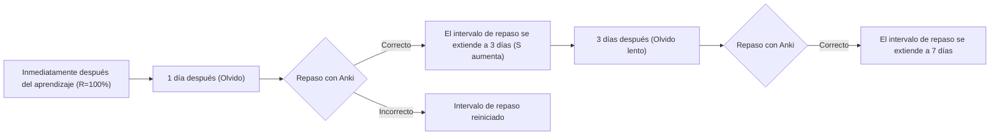
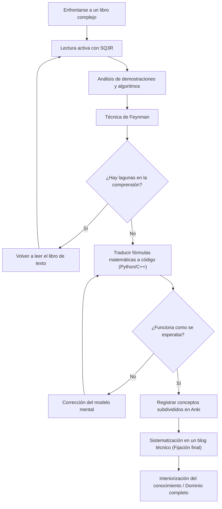

En el proceso de mejorar nuestras habilidades como ingenieros o investigadores, siempre nos topamos con el obstáculo de los "libros técnicos complejos". En particular, los libros sobre matemáticas, algoritmos y ciencias de la computación teóricas tienen una naturaleza completamente diferente a la de los libros introductorios de programación general. No son pocos los que han experimentado la frustración ante secuencias de fórmulas matemáticas, conceptos abstractos y amplios espacios entre líneas (omisiones lógicas) que son descartados como "triviales".

Sin embargo, son precisamente estos conocimientos complejos los que forman la "base" esencial que no se vuelve obsoleta fácilmente. En este artículo, basándonos en la ciencia cognitiva y la teoría del aprendizaje, explicaremos en detalle un método integral (SQ3R, Técnica de Feynman, Repetición Espaciada, Codificación, Escritura de Blogs) para leer y comprender eficientemente libros técnicos de matemáticas y algoritmos, fijarlos en el cerebro y finalmente hacerlos parte de uno mismo.

---

## 1. ¿Por qué no se pueden "leer" los libros técnicos de matemáticas y algoritmos?

Primero, analicemos por qué es tan difícil leer estos libros. Los tres factores principales son los siguientes:

1. **La densidad de la información (Information Density) es extremadamente alta**
   En un libro de negocios o técnico general, se puede captar la idea principal incluso con una lectura rápida. Sin embargo, en un libro de matemáticas, cada "definición", "lema" y "teorema" tiene significado en cada palabra y frase, y pasar por alto un solo símbolo puede colapsar toda la lógica.
2. **Amplios espacios entre líneas (Missing Intermediate Steps)**
   Los autores a menudo omiten los cálculos intermedios de las demostraciones por cuestiones de espacio o bajo la suposición de que "el lector debería ser capaz de hacer este nivel de transformación de fórmulas por sí mismo". Si no haces el trabajo de llenar estos "espacios" por ti mismo (lectura para llenar espacios), la comprensión no avanzará en absoluto.
3. **Alto nivel de abstracción (High Level of Abstraction)**
   Dado que se habla de espacios $n$-dimensionales o grafos arbitrarios $G=(V, E)$ sin ejemplos concretos, se requiere una carga cognitiva inmensa para construir un modelo mental visual y concreto en el cerebro.

Para superar estas dificultades, es necesario cambiar radicalmente el estilo de lectura de una "lectura pasiva (solo seguir las letras)" a una "lectura activa (reconstruir el conocimiento mientras se aplica carga al cerebro)".

---

## 2. Método de lectura activa: SQ3R y la Técnica de Feynman

### 2.1 Método SQ3R para libros de matemáticas

SQ3R es un método de lectura propuesto por el psicólogo educativo estadounidense Francis P. Robinson. Lo aplicaremos específicamente a libros de matemáticas y algoritmos.

- **Survey (Inspeccionar)**: Primero, hojea todo el capítulo para comprender "qué teoremas hay" y "qué se intenta demostrar al final". Mira el bosque antes de mirar los árboles.
- **Question (Preguntar)**: En el momento en que leas la afirmación de un teorema, pregúntate a ti mismo: "¿Por qué es necesaria esta condición?" y "¿Qué pasaría si esta restricción no existiera?".
- **Read (Leer detenidamente)**: Lee realmente la demostración. Aquí, un bolígrafo y un cuaderno son indispensables. Reproduce a mano las transformaciones de fórmulas omitidas.
- **Recite (Recitar/Verbalizar)**: Cierra el libro e intenta explicar con tus propias palabras el teorema o el mecanismo del algoritmo que acabas de leer.
- **Review (Repasar)**: Utiliza la repetición espaciada (Spaced Repetition), que se describirá más adelante, para fijar en la memoria a largo plazo lo que has aprendido.

### 2.2 Técnica de Feynman

Este método de aprendizaje, nombrado en honor al físico Richard Feynman, se basa en el principio de que "si no lo entiendes, no puedes explicarlo de manera sencilla".

1. Escribe el concepto que quieres aprender en la parte superior de una hoja de papel.
2. Escribe ese concepto en palabras sencillas, como si se lo estuvieras enseñando a un "estudiante de secundaria (o a un patito de goma)".
3. Las partes donde te quedas atascado o recurres a la jerga técnica son "lagunas en tu comprensión".
4. Vuelve al libro de texto y repasa esa parte.

Sentir que entiendes solo viendo una secuencia de fórmulas es muy peligroso. Solo cuando puedes explicar en lenguaje natural la "intuición física" o el "comportamiento del algoritmo" que significan las fórmulas, puedes llamarlo verdadera comprensión.

---

## 3. Resistiendo la curva del olvido: Sistema de Repetición Espaciada (SRS) y Anki

La memoria humana decae exponencialmente con el tiempo. Este fenómeno se conoce como la **curva del olvido de Ebbinghaus**, y la tasa de retención de la memoria $R$ a veces se modela como la solución a la siguiente ecuación diferencial:

$$ R = e^{-\frac{t}{S}} $$

Donde $t$ es el tiempo transcurrido y $S$ es la fuerza de la memoria (Strength of memory). A medida que repites los repasos, $S$ aumenta y la velocidad del olvido se ralentiza.

El software que optimiza esta propiedad son los Sistemas de Repetición Espaciada (Spaced Repetition System: SRS) como **Anki**.



### 3.1 Cómo crear tarjetas de Anki para matemáticas y algoritmos

En la memorización de libros técnicos, "memorizar de memoria una demostración larga" no tiene sentido. Divide el conocimiento en unidades mínimas (Atómicas) para crear tarjetas.

- **Mala tarjeta**: "Escribe toda la demostración del algoritmo de Dijkstra"
- **Buena tarjeta**: "¿Cuál es la condición para considerar que la distancia más corta de un vértice está confirmada en el algoritmo de Dijkstra?" -> "Cuando se selecciona el vértice con la distancia provisional mínima entre el conjunto de vértices no confirmados."
- **Buena tarjeta**: "¿Cuál es la fórmula del pequeño teorema de Fermat?" -> "Para un número primo $p$ y un número entero $a$ coprimo con $p$, $a^{p-1} \equiv 1 \pmod p$"

Al memorizar fórmulas matemáticas, también es efectivo registrarlas en Anki en formato LaTeX y utilizar preguntas de completar espacios en blanco (Cloze Deletion).

---

## 4. La prueba de comprensión definitiva: "Codificar" las fórmulas matemáticas

El método más poderoso para verificar si realmente has entendido las matemáticas o los algoritmos es **"traducir las fórmulas y las demostraciones a un programa que realmente funcione (como Python o C++)"**.

En el mundo de las matemáticas, termina una vez que se demuestra que "existe", pero para codificarlo, necesitas profundizar hasta "¿cómo calculo el valor específico?", lo que eleva la resolución de la comprensión al límite.

Aquí, veamos el proceso de convertir fórmulas matemáticas en código a través de dos ejemplos específicos.

### 4.1 Ejemplo práctico 1: Matemáticas de la criptografía RSA e implementación en Python

La criptografía RSA, un representante de la criptografía de clave pública, es una hermosa aplicación de la teoría elemental de números (congruencias, teorema de Euler, algoritmo de Euclides extendido).

#### Contexto matemático
El proceso de generación de claves, cifrado y descifrado de la criptografía RSA se expresa mediante las siguientes fórmulas.

1. **Generación de claves**:
   Elige dos números primos enormes $p, q$ y establece $n = pq$.
   Calcula la función indicatriz de Euler $\phi(n) = (p-1)(q-1)$.
   Elige una clave pública $e$ coprima con $\phi(n)$.
   Encuentra una clave privada $d$ tal que $e \cdot d \equiv 1 \pmod{\phi(n)}$.

2. **Cifrado**:
   Para un mensaje en texto plano $m$, calcula el texto cifrado $c$ de la siguiente manera.
   $$ c \equiv m^e \pmod n $$

3. **Descifrado**:
   Restaura el texto plano $m$ a partir del texto cifrado $c$ de la siguiente manera.
   $$ m \equiv c^d \pmod n $$

El trasfondo de por qué este descifrado funciona correctamente es el teorema de Euler $a^{\phi(n)} \equiv 1 \pmod n$. En los libros de matemáticas, continúan varias páginas de demostraciones, pero implementemos esto en Python.

#### Implementación en Python

```python
import random
from math import gcd

# Algoritmo de Euclides extendido
# Devuelve (x, y, gcd) tal que ax + by = gcd(a, b)
def extended_gcd(a, b):
    if a == 0:
        return (b, 0, 1)
    else:
        g, y, x = extended_gcd(b % a, a)
        return (g, x - (b // a) * y, y)

# Inverso modular: Encuentra x tal que ax ≡ 1 (mod m)
def mod_inverse(a, m):
    g, x, y = extended_gcd(a, m)
    if g != 1:
        raise Exception('El inverso modular no existe')
    else:
        return x % m

# Demostración de RSA
def rsa_demo():
    # 1. Generación de números primos (en realidad se utilizan números primos muy grandes)
    p, q = 61, 53
    n = p * q
    phi = (p - 1) * (q - 1)

    # 2. Selección de la clave pública e
    e = 17
    assert gcd(e, phi) == 1

    # 3. Cálculo de la clave privada d
    d = mod_inverse(e, phi)

    print(f"Clave pública: (e={e}, n={n})")
    print(f"Clave privada: (d={d}, n={n})")

    # Cifrado
    m = 65  # Texto plano
    c = pow(m, e, n)  # c = m^e mod n
    print(f"Texto plano: {m} -> Después del cifrado: {c}")

    # Descifrado
    decrypted_m = pow(c, d, n)  # m = c^d mod n
    print(f"Después del descifrado: {decrypted_m}")

rsa_demo()
```

Para encontrar un $d$ que satisfaga la fórmula matemática $e \cdot d \equiv 1 \pmod{\phi(n)}$, necesitas implementar un algoritmo llamado algoritmo de Euclides extendido. De esta manera, **cuando intentas codificar fórmulas matemáticas, te enfrentas a problemas de implementación como "¿cómo calculo específicamente esta variable?", y en el proceso de resolverlos, tu comprensión matemática se profundiza drásticamente**.

### 4.2 Ejemplo práctico 2: Algoritmo de Dijkstra y Relajación (Relaxation)

Consideremos el algoritmo de Dijkstra para resolver el problema de la ruta más corta desde un único origen (SSSP) en la teoría de grafos.

El núcleo matemático y algorítmico es una operación llamada "Relajación (Relaxation)".
Cuando hay una arista desde el vértice $u$ al vértice $v$ con peso $w(u, v)$, la distancia más corta provisional $d[v]$ al vértice $v$ se actualiza con la siguiente fórmula:

$$ d[v] \leftarrow \min(d[v], d[u] + w(u, v)) $$

Esta operación matemática se implementa como un algoritmo eficiente en C++ utilizando `std::priority_queue`.

```cpp
#include <iostream>
#include <vector>
#include <queue>

using namespace std;

const int INF = 1e9;

// Estructura que representa una arista
struct Edge {
    int to;
    int weight;
};

void dijkstra(int start, const vector<vector<Edge>>& graph) {
    int n = graph.size();
    vector<int> dist(n, INF);
    // Par de {distancia, vértice}. Para poder extraer en orden de menor distancia
    priority_queue<pair<int, int>, vector<pair<int, int>>, greater<pair<int, int>>> pq;

    dist[start] = 0;
    pq.push({0, start});

    while (!pq.empty()) {
        auto [current_dist, u] = pq.top();
        pq.pop();

        // Omitir si ya se ha encontrado una ruta más corta
        if (current_dist > dist[u]) continue;

        // Ejecución de la relajación (Relaxation)
        for (const auto& edge : graph[u]) {
            int v = edge.to;
            int weight = edge.weight;

            // Actualizar si d[v] > d[u] + w(u, v)
            if (dist[v] > dist[u] + weight) {
                dist[v] = dist[u] + weight;
                pq.push({dist[v], v});
            }
        }
    }

    for (int i = 0; i < n; ++i) {
        cout << "Distancia más corta al vértice " << i << ": " << dist[i] << "\n";
    }
}
```

Se puede ver que la definición matemática $d[v] \leftarrow \min(\dots)$ está mapeada maravillosamente en el código a la bifurcación condicional y al proceso de actualización `if (dist[v] > dist[u] + weight)`.

---

## 5. Proceso cognitivo y panorama general del aprendizaje

Utilizaremos un diagrama Mermaid para organizar cómo los métodos explicados hasta ahora trabajan juntos para dar forma al conocimiento en nuestro cerebro.



## 6. La fijación definitiva: Producción sistemática como blog técnico

La fase final del aprendizaje es **"escribir un blog técnico dirigido a un número no especificado de personas"**.

Si Anki es una herramienta para mantener los "puntos" de conocimiento, escribir un blog es la tarea de conectar esos puntos en "líneas" y "planos".

Al escribir un blog, ocurren los siguientes procesos:
1. **Definir a los lectores**: Imaginas como lector a tu "yo del pasado que no entendía", y verbalizas dónde te atascaste y cómo pensaste para superarlo.
2. **Creación de diagramas**: Visualizas estructuras de datos abstractas y transiciones de estado utilizando Mermaid o herramientas de dibujo. Esto también profundiza tu propia comprensión visual.
3. **Garantizar la precisión**: Como se publicará al mundo, te preguntas a ti mismo: "¿Es este desarrollo de la fórmula realmente correcto?" o "¿Esta expresión no causará malentendidos?", y verificas tus afirmaciones. Este proceso expone sin piedad las áreas de comprensión superficial (Micro-misunderstandings) y te obliga a repararlas.

### 6.1 Herramientas a utilizar al escribir un blog
- **Markdown / LaTeX**: Indispensables para escribir fórmulas matemáticas de forma hermosa.
- **Mermaid.js**: Te permite describir diagramas de transición de estado y diagramas de flujo basados en código, y tiene un mantenimiento excelente.
- **GitHub / Gist**: Comparte fragmentos de código de algoritmos implementados para que los lectores puedan ejecutarlos y verificarlos realmente.

## 7. Conclusión: El paisaje más allá de superar las dificultades

Leer libros de matemáticas y libros especializados en algoritmos no es de ninguna manera un camino fácil. Sin embargo, al seguir el ciclo de captar la estructura con SQ3R, verbalizar con la Técnica de Feynman, verificar el funcionamiento traduciéndolo a código, prevenir el olvido con Anki y finalmente transmitirlo al mundo en un blog técnico, ese conocimiento complejo seguramente se convertirá en tu "poder".

La forma superficial de usar APIs y el conocimiento de frameworks se volverán obsoletos en unos pocos años, pero el pensamiento matemático y los fundamentos de los algoritmos son activos para toda la vida. La próxima vez que abras un libro técnico complejo, intenta utilizar los métodos de este artículo y sumérgete en el abismo del conocimiento.
