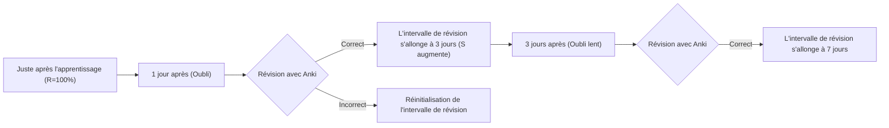
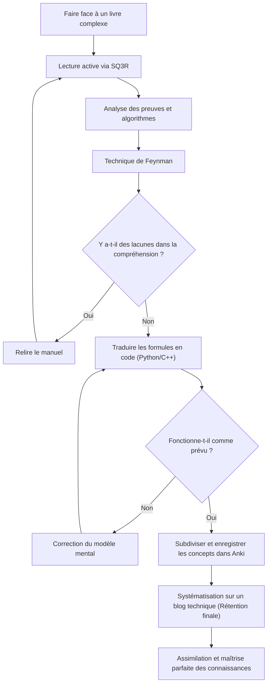

Dans le processus de développement des compétences en tant qu'ingénieur ou chercheur, nous rencontrons inévitablement le mur des "livres techniques complexes". En particulier, les livres sur les mathématiques, les algorithmes et l'informatique théorique ont une nature complètement différente des livres d'introduction à la programmation générale. Beaucoup de personnes ont probablement connu la frustration face à une énumération de formules, des concepts abstraits, et les grands écarts entre les lignes simplement rejetés comme "évidents".

Cependant, ce sont précisément ces connaissances complexes qui forment la "force de base" essentielle qui ne devient pas facilement obsolète. Dans cet article, basé sur les sciences cognitives et la théorie de l'apprentissage, nous expliquerons en détail une méthode complète (SQ3R, technique de Feynman, répétition espacée, codage, rédaction de blog) pour lire efficacement des livres techniques sur les mathématiques et les algorithmes, les fixer dans le cerveau, et finalement les assimiler.

---

## 1. Pourquoi les livres techniques sur les mathématiques et les algorithmes sont-ils "illisibles" ?

Tout d'abord, analysons pourquoi la lecture de tels livres est difficile. Les trois principaux facteurs sont les suivants.

1. **La densité de l'information (Information Density) est extrêmement élevée**
   S'il s'agit d'un livre d'affaires ou d'un livre technique général, vous pouvez saisir l'idée principale même en lisant en diagonale. Cependant, dans les livres de mathématiques, chaque "définition", "lemme" et "théorème" a un sens, et négliger un seul symbole peut faire s'effondrer toute la logique.
2. **Le grand écart entre les lignes (Missing Intermediate Steps)**
   L'auteur omet fréquemment les calculs intermédiaires des preuves, soit par manque d'espace, soit en supposant que "le lecteur devrait être capable de faire ce niveau de transformation de formule par lui-même". Si vous ne faites pas le travail de combler vous-même ces "écarts" (lire entre les lignes), votre compréhension ne progressera pas du tout.
3. **Le niveau d'abstraction est élevé (High Level of Abstraction)**
   Puisque l'on parle d'un espace à $n$ dimensions ou d'un graphe arbitraire $G=(V, E)$ sans exemples concrets, la construction d'un modèle mental visuel et concret dans le cerveau impose une charge cognitive énorme.

Pour surmonter ces difficultés, il est nécessaire de changer radicalement votre style de lecture, en passant d'une "lecture passive (simplement suivre les mots)" à une "lecture active (reconstruire les connaissances tout en sollicitant le cerveau)".

---

## 2. Méthode de lecture active : SQ3R et technique de Feynman

### 2.1 La méthode SQ3R pour les livres de mathématiques

Le SQ3R est une méthode de lecture proposée par le psychologue de l'éducation américain Francis P. Robinson. Nous l'appliquerons spécifiquement aux livres de mathématiques et d'algorithmes.

- **Survey (Survoler)** : D'abord, parcourez l'ensemble du chapitre pour saisir "quels théorèmes il y a" et "ce qu'ils essaient finalement de prouver". Regardez la forêt avant de regarder les arbres.
- **Question (Questionner)** : Au moment où vous lisez l'affirmation d'un théorème, demandez-vous : "Pourquoi cette condition est-elle nécessaire ?" ou "Que se passerait-il si cette contrainte n'existait pas ?".
- **Read (Lire attentivement)** : Lisez réellement la preuve. Ici, un stylo et un carnet sont indispensables. Reproduisez par vous-même les transformations de formules omises.
- **Recite (Réciter / Verbaliser)** : Fermez le livre, et essayez d'expliquer le mécanisme du théorème ou de l'algorithme que vous venez de lire avec vos propres mots.
- **Review (Réviser)** : Utilisez la répétition espacée (Spaced Repetition), décrite plus loin, pour ancrer ce que vous avez appris dans la mémoire à long terme.

### 2.2 La technique de Feynman

Cette méthode d'apprentissage, nommée d'après le physicien Richard Feynman, est basée sur le principe selon lequel "vous ne pouvez pas expliquer simplement ce que vous ne comprenez pas".

1. Écrivez le concept que vous voulez apprendre en haut d'une feuille de papier.
2. Rédigez le concept avec des mots simples, comme si vous l'enseigniez à un "élève de 4ème (ou à un canard en plastique)".
3. Les parties où vous bloquez, ou là où vous vous réfugiez dans le jargon technique, sont des "lacunes dans votre compréhension".
4. Retournez au manuel et révisez ces parties.

Il est très dangereux d'avoir l'impression de comprendre simplement en regardant une série de formules. La véritable compréhension n'est atteinte que lorsque vous pouvez expliquer "l'intuition physique" ou le "comportement de l'algorithme" qu'impliquent les formules en langage naturel.

---

## 3. Lutter contre la courbe de l'oubli : Le système de répétition espacée (SRS) et Anki

La mémoire humaine se dégrade de manière exponentielle avec le temps. Ce phénomène est connu sous le nom de **courbe de l'oubli d'Ebbinghaus**, et le taux de rétention de la mémoire $R$ peut être modélisé comme la solution d'une équation différentielle comme celle-ci :

$$ R = e^{-\frac{t}{S}} $$

Ici, $t$ est le temps écoulé, et $S$ est la force de la mémoire (Strength of memory). À chaque révision, $S$ augmente, ce qui ralentit la vitesse de l'oubli.

Ce qui optimise cette propriété grâce aux logiciels est le système de répétition espacée (Spaced Repetition System : SRS) tel que **Anki**.



### 3.1 Comment créer des cartes Anki pour les mathématiques et les algorithmes

Lors de la mémorisation de livres techniques, il est inutile d'"apprendre de longues preuves par cœur". Divisez les connaissances dans leur unité minimale (Atomic) et créez des cartes.

- **Mauvaise carte** : "Écrivez toute la preuve de l'algorithme de Dijkstra"
- **Bonne carte** : "Dans l'algorithme de Dijkstra, quelle est la condition pour considérer que la distance la plus courte d'un sommet est définitive ?" → "Lors du choix du sommet avec la distance provisoire minimale parmi l'ensemble des sommets non confirmés."
- **Bonne carte** : "Quelle est la formule du petit théorème de Fermat ?" → "Pour un nombre premier $p$ et un entier $a$ premier avec $p$, $a^{p-1} \equiv 1 \pmod p$"

Même lors de la mémorisation de formules, il est efficace de les enregistrer dans Anki au format LaTeX et d'utiliser des textes à trous (Cloze Deletion).

---

## 4. Le test de compréhension ultime : "Coder" les formules

La méthode la plus puissante pour vérifier si vous avez vraiment compris les mathématiques ou les algorithmes est de **"traduire les formules et les preuves en un programme qui fonctionne réellement (comme Python ou C++)"**.

Dans le monde des mathématiques, il suffit de prouver qu'une chose "existe", mais pour la coder, il faut aller jusqu'à se demander "comment calculer des valeurs spécifiques", ce qui augmente la résolution de votre compréhension à son maximum.

Voyons ici le processus de transcription de formules en code à travers deux exemples concrets.

### 4.1 Exemple 1 : Les mathématiques de la cryptographie RSA et son implémentation en Python

La cryptographie RSA, représentante de la cryptographie à clé publique, est une belle application de la théorie élémentaire des nombres (congruences, théorème d'Euler, algorithme d'Euclide étendu).

#### Contexte mathématique
Les processus de génération de clés, de chiffrement et de déchiffrement de la cryptographie RSA sont représentés par les formules suivantes.

1. **Génération de clés** :
   Choisissez d'énormes nombres premiers $p, q$, et posez $n = pq$.
   Calculez l'indicatrice d'Euler $\phi(n) = (p-1)(q-1)$.
   Choisissez une clé publique $e$ première avec $\phi(n)$.
   Trouvez la clé privée $d$ telle que $e \cdot d \equiv 1 \pmod{\phi(n)}$.

2. **Chiffrement** :
   Pour un texte clair $m$, calculez le texte chiffré $c$ comme suit.
   $$ c \equiv m^e \pmod n $$

3. **Déchiffrement** :
   Restaurez le texte clair $m$ à partir du texte chiffré $c$ comme suit.
   $$ m \equiv c^d \pmod n $$

Le théorème d'Euler $a^{\phi(n)} \equiv 1 \pmod n$ est à la base du bon fonctionnement de ce déchiffrement. Dans les livres de mathématiques, les preuves se poursuivent sur plusieurs pages, mais implémentons cela en Python.

#### Implémentation en Python

```python
import random
from math import gcd

# Algorithme d'Euclide étendu
# Retourne (x, y, gcd) tel que ax + by = gcd(a, b)
def extended_gcd(a, b):
    if a == 0:
        return (b, 0, 1)
    else:
        g, y, x = extended_gcd(b % a, a)
        return (g, x - (b // a) * y, y)

# Inverse modulaire : trouve x tel que ax ≡ 1 (mod m)
def mod_inverse(a, m):
    g, x, y = extended_gcd(a, m)
    if g != 1:
        raise Exception("L'inverse modulaire n'existe pas")
    else:
        return x % m

# Démo RSA
def rsa_demo():
    # 1. Génération de nombres premiers (normalement des nombres très grands sont utilisés)
    p, q = 61, 53
    n = p * q
    phi = (p - 1) * (q - 1)

    # 2. Choix de la clé publique e
    e = 17
    assert gcd(e, phi) == 1

    # 3. Calcul de la clé privée d
    d = mod_inverse(e, phi)

    print(f"Clé publique : (e={e}, n={n})")
    print(f"Clé privée : (d={d}, n={n})")

    # Chiffrement
    m = 65  # Texte clair
    c = pow(m, e, n)  # c = m^e mod n
    print(f"Texte clair : {m} -> Après chiffrement : {c}")

    # Déchiffrement
    decrypted_m = pow(c, d, n)  # m = c^d mod n
    print(f"Après déchiffrement : {decrypted_m}")

rsa_demo()
```

Pour trouver $d$ satisfaisant la formule $e \cdot d \equiv 1 \pmod{\phi(n)}$, il est nécessaire d'implémenter l'algorithme d'Euclide étendu. Ainsi, **lorsque l'on essaie de coder des formules mathématiques, on est confronté à des problèmes d'implémentation tels que "comment calculer cette variable concrètement ?", et en les résolvant, la compréhension mathématique s'approfondit considérablement**.

### 4.2 Exemple 2 : Algorithme de Dijkstra et Relâchement (Relaxation)

Considérons l'algorithme de Dijkstra qui résout le problème du plus court chemin à origine unique (SSSP) dans la théorie des graphes.

Le cœur mathématique et algorithmique est l'opération appelée "Relâchement (Relaxation)".
Lorsqu'il y a une arête de poids $w(u, v)$ allant du sommet $u$ au sommet $v$, la plus courte distance provisoire $d[v]$ au sommet $v$ est mise à jour avec la formule suivante.

$$ d[v] \leftarrow \min(d[v], d[u] + w(u, v)) $$

Nous implémentons cette opération mathématique sous la forme d'un algorithme efficace en utilisant `std::priority_queue` en C++.

```cpp
#include <iostream>
#include <vector>
#include <queue>

using namespace std;

const int INF = 1e9;

// Structure représentant une arête
struct Edge {
    int to;
    int weight;
};

void dijkstra(int start, const vector<vector<Edge>>& graph) {
    int n = graph.size();
    vector<int> dist(n, INF);
    // Paire {distance, sommet}. Permet d'extraire dans l'ordre croissant des distances
    priority_queue<pair<int, int>, vector<pair<int, int>>, greater<pair<int, int>>> pq;

    dist[start] = 0;
    pq.push({0, start});

    while (!pq.empty()) {
        auto [current_dist, u] = pq.top();
        pq.pop();

        // Si un chemin plus court a déjà été trouvé, on ignore
        if (current_dist > dist[u]) continue;

        // Exécution du relâchement (Relaxation)
        for (const auto& edge : graph[u]) {
            int v = edge.to;
            int weight = edge.weight;

            // Si d[v] > d[u] + w(u, v), alors on met à jour
            if (dist[v] > dist[u] + weight) {
                dist[v] = dist[u] + weight;
                pq.push({dist[v], v});
            }
        }
    }

    for (int i = 0; i < n; ++i) {
        cout << "Distance la plus courte au sommet " << i << " : " << dist[i] << "\n";
    }
}
```

On peut voir que la définition mathématique $d[v] \leftarrow \min(\dots)$ est parfaitement mappée sur le branchement conditionnel et le processus de mise à jour `if (dist[v] > dist[u] + weight)` dans le code.

---

## 5. Le processus cognitif et la vue d'ensemble de l'apprentissage

Nous allons organiser comment les méthodes expliquées jusqu'à présent collaborent pour former des connaissances dans notre cerveau, à l'aide d'un diagramme Mermaid.



## 6. La rétention ultime : L'output systématique sous forme de blog technique

La phase finale de l'apprentissage est de **"rédiger un blog technique destiné à un public large et indéterminé"**.

Si Anki est un outil pour maintenir les "points" de connaissances, rédiger un blog est le travail de relier ces points pour en faire des "lignes" ou des "surfaces".

Lors de l'écriture d'un blog, le processus suivant se produit.
1. **Définition du lecteur** : En supposant que le lecteur est votre "vous du passé qui n'avait pas compris", vous verbalisez là où vous avez trébuché et comment vous auriez dû penser pour le surmonter.
2. **Création de diagrammes explicatifs** : Utilisez Mermaid ou des outils de dessin pour visualiser les structures de données abstraites et les transitions d'état. Cela approfondit également votre propre compréhension visuelle.
3. **Garantie de l'exactitude** : Puisqu'il sera publié dans le monde entier, vous vous posez des questions comme "Ce développement de formule est-il vraiment correct ?" ou "Cette expression ne va-t-elle pas créer de malentendus ?", et vous commencez à vérifier vos sources. Ce processus expose impitoyablement les parties mal comprises (Micro-misunderstandings) et vous oblige à les réparer.

### 6.1 Outils à utiliser pour rédiger un blog
- **Markdown / LaTeX** : Indispensable pour écrire de belles formules mathématiques.
- **Mermaid.js** : Permet de décrire des diagrammes de transition d'état et des organigrammes sous forme de code, avec une excellente maintenabilité.
- **GitHub / Gist** : Partagez des extraits de code des algorithmes implémentés pour que les lecteurs puissent réellement les exécuter et les tester.

## 7. Conclusion : Le paysage après avoir surmonté les difficultés

Lire des livres de mathématiques et des ouvrages spécialisés en algorithmes n'est en aucun cas un chemin facile. Cependant, en exécutant cette série de cycles consistant à saisir la structure avec le SQ3R, à la verbaliser avec la technique de Feynman, à transcrire en code pour vérifier son fonctionnement, à prévenir l'oubli avec Anki, et enfin à la diffuser au monde entier via un blog technique, ces connaissances complexes deviendront certainement votre "force".

Alors que les connaissances sur l'utilisation superficielle des API ou des frameworks deviennent obsolètes en quelques années, la capacité de réflexion mathématique et les fondations des algorithmes sont des atouts pour la vie. La prochaine fois que vous ouvrirez un livre technique complexe, n'hésitez pas à utiliser les méthodes de cet article pour plonger dans les abysses de la connaissance.
