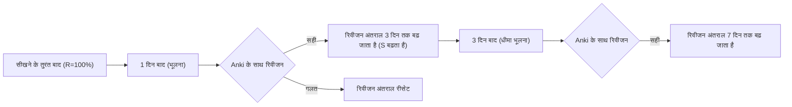
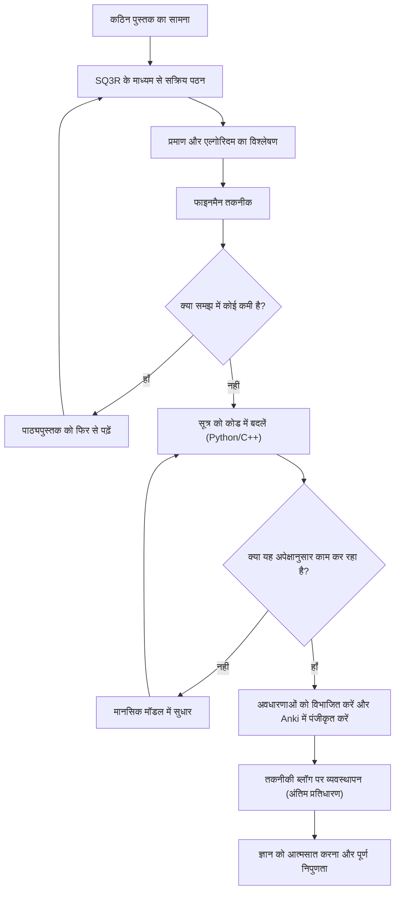

एक इंजीनियर या शोधकर्ता के रूप में अपने कौशल को बेहतर बनाने की प्रक्रिया में, हम निश्चित रूप से "कठिन तकनीकी पुस्तकों" की दीवार से टकराते हैं। विशेष रूप से गणित, एल्गोरिदम और सैद्धांतिक कंप्यूटर विज्ञान से संबंधित पुस्तकें सामान्य प्रोग्रामिंग परिचयात्मक पुस्तकों से पूरी तरह से अलग प्रकृति की होती हैं। सूत्रों की एक श्रृंखला, अमूर्त अवधारणाएं, और पंक्तियों के बीच की दूरी जिसे "स्वयं स्पष्ट" के रूप में खारिज कर दिया जाता है, ऐसी चीजें हैं जिनके कारण कई लोगों ने निराशा का अनुभव किया होगा।

हालाँकि, यह कठिन ज्ञान ही है जो एक आवश्यक "बुनियादी शक्ति" बनाता है जो आसानी से पुरानी नहीं होती है। इस लेख में, हम संज्ञानात्मक विज्ञान और सीखने के सिद्धांत के आधार पर गणित और एल्गोरिदम तकनीकी पुस्तकों को कुशलतापूर्वक पढ़ने, उन्हें मस्तिष्क में बनाए रखने और अंततः उन्हें अपना बनाने के लिए एक व्यापक विधि (SQ3R, फाइनमैन तकनीक, स्पेस रिपीटिशन, कोडिंग और ब्लॉग लेखन) के बारे में विस्तार से बताएंगे।

---

## 1. गणित और एल्गोरिदम की तकनीकी पुस्तकें "पढ़ी क्यों नहीं जा सकतीं"?

सबसे पहले, आइए विश्लेषण करें कि ऐसी पुस्तकों को पढ़ना मुश्किल क्यों है। इसके तीन मुख्य कारण हैं:

1. **सूचना का घनत्व (Information Density) बहुत अधिक है**
   सामान्य व्यावसायिक पुस्तकों या तकनीकी पुस्तकों के मामले में, आप उन्हें जल्दी से पढ़कर भी मुख्य बिंदु समझ सकते हैं। हालाँकि, गणित की किताबों में, "परिभाषा," "लेम्मा," और "प्रमेय" में हर शब्द का अर्थ होता है, और एक भी प्रतीक को छोड़ देने से पूरा तर्क ढह जाता है।
2. **पंक्तियों के बीच की दूरी (Missing Intermediate Steps)**
   लेखक अक्सर स्थान की कमी के कारण या इस धारणा के कारण प्रमाणों में मध्यवर्ती गणनाओं को छोड़ देते हैं कि "पाठकों को इस स्तर के सूत्र परिवर्तन को स्वयं करने में सक्षम होना चाहिए।" यदि आप इस "अंतर" को स्वयं भरने का कार्य (पंक्तियों के बीच पढ़कर) नहीं करते हैं, तो आपकी समझ बिल्कुल भी आगे नहीं बढ़ेगी।
3. **अमूर्तता का उच्च स्तर (High Level of Abstraction)**
   चूँकि $n$-आयामी अंतरिक्ष या किसी भी ग्राफ $G=(V, E)$ के बारे में बिना किसी ठोस उदाहरण के बात की जाती है, इसलिए मस्तिष्क में एक दृश्य और ठोस मानसिक मॉडल बनाने में बहुत अधिक संज्ञानात्मक भार लगता है।

इन कठिनाइयों को दूर करने के लिए, आपको अपनी पढ़ने की शैली को "निष्क्रिय पढ़ने (केवल अक्षरों का अनुसरण करना)" से "सक्रिय पढ़ने (मस्तिष्क पर भार डालते हुए ज्ञान का पुनर्निर्माण करना)" में मौलिक रूप से बदलने की आवश्यकता है।

---

## 2. सक्रिय पठन विधि: SQ3R और फाइनमैन तकनीक

### 2.1 गणित की पुस्तकों के लिए SQ3R विधि

SQ3R एक पठन पद्धति है जिसे अमेरिकी शैक्षिक मनोवैज्ञानिक फ्रांसिस पी. रॉबिन्सन ने प्रस्तावित किया था। हम इसे विशेष रूप से गणित और एल्गोरिदम की किताबों पर लागू करेंगे।

- **Survey (अवलोकन)**: सबसे पहले, पूरे अध्याय को पलटें और समझें कि "किस प्रकार के प्रमेय हैं" और "वे अंततः क्या साबित करने की कोशिश कर रहे हैं।" पेड़ों को देखने से पहले जंगल को देखें।
- **Question (प्रश्न)**: जिस क्षण आप किसी प्रमेय का दावा पढ़ते हैं, अपने आप से पूछें, "इस शर्त की आवश्यकता क्यों है?" "यदि यह प्रतिबंध नहीं होता तो क्या होता?"
- **Read (गहन पठन)**: वास्तव में प्रमाण पढ़ें। यहाँ पेन और नोटबुक अनिवार्य हैं। छोड़े गए सूत्र परिवर्तनों को अपने हाथों से दोबारा बनाएँ।
- **Recite (पाठ / मौखिककरण)**: पुस्तक बंद करें और जो प्रमेय या एल्गोरिदम आपने अभी पढ़ा है उसे अपने शब्दों में समझाने का प्रयास करें।
- **Review (समीक्षा)**: सीखी गई सामग्री को अपनी दीर्घकालिक स्मृति में बनाए रखने के लिए, बाद में वर्णित स्पेस रिपीटिशन (Spaced Repetition) का उपयोग करें।

### 2.2 फाइनमैन तकनीक

भौतिक विज्ञानी रिचर्ड फाइनमैन के नाम पर इस शिक्षण पद्धति का नाम रखा गया है, जो इस सिद्धांत पर आधारित है कि "जो आप नहीं समझते हैं, उसे आप सरलता से नहीं समझा सकते।"

1. उस अवधारणा को लिखें जिसे आप सीखना चाहते हैं, एक कागज़ के सबसे ऊपर।
2. उस अवधारणा को सरल शब्दों में इस तरह लिखें जैसे कि आप किसी "आठवीं कक्षा के छात्र (या रबर डक)" को पढ़ा रहे हों।
3. जिन हिस्सों में आप अटक जाते हैं या तकनीकी शब्दों का सहारा लेते हैं, वे आपकी "समझ में कमी" हैं।
4. पाठ्यपुस्तक पर वापस जाएँ और उस भाग की समीक्षा करें।

केवल गणितीय सूत्रों की एक श्रृंखला को देखकर यह महसूस करना बहुत खतरनाक है कि आप सब समझ गए हैं। आप इसे तभी सच्ची समझ कह सकते हैं जब आप प्राकृतिक भाषा में सूत्रों के अर्थ वाली "भौतिक अंतर्ज्ञान" या "एल्गोरिदम के व्यवहार" की व्याख्या कर सकें।

---

## 3. भूलने की अवस्था का विरोध करना: स्पेस रिपीटिशन सिस्टम (SRS) और Anki

समय के साथ मानव स्मृति तेजी से कम होती जाती है। इस घटना को **एबिंगहॉस के भूलने की अवस्था (Ebbinghaus Forgetting Curve)** के रूप में जाना जाता है, और स्मृति प्रतिधारण दर $R$ को निम्नलिखित अवकल समीकरण के समाधान के रूप में मॉडल किया जा सकता है:

$$ R = e^{-\frac{t}{S}} $$

जहाँ, $t$ बीता हुआ समय है, और $S$ स्मृति की ताकत (Strength of memory) है। जैसे-जैसे आप दोहराते हैं, $S$ बढ़ता जाता है, और भूलने की गति धीमी हो जाती है।

**Anki** जैसे स्पेस रिपीटिशन सिस्टम (SRS) ने सॉफ्टवेयर के माध्यम से इस विशेषता को अनुकूलित किया है।



### 3.1 गणित और एल्गोरिदम के लिए Anki कार्ड कैसे बनाएँ

तकनीकी पुस्तकों को याद रखने के लिए "लंबे प्रमाणों को रटना" व्यर्थ है। आपको ज्ञान को सबसे छोटी इकाइयों (Atomic) में विभाजित करना चाहिए और उनके कार्ड बनाने चाहिए।

- **बुरा कार्ड**: "Dijkstra एल्गोरिदम का पूरा प्रमाण लिखें"
- **अच्छा कार्ड**: "Dijkstra एल्गोरिदम में, यह मानने की शर्त क्या है कि किसी शीर्ष (vertex) की सबसे छोटी दूरी निर्धारित हो गई है?" → "जब अनिर्धारित शीर्षों के समूह में से सबसे छोटी अस्थायी दूरी वाला शीर्ष चुना जाता है।"
- **अच्छा कार्ड**: "फर्मेट का छोटा प्रमेय (Fermat's Little Theorem) का सूत्र बताइए" → "एक अभाज्य संख्या $p$ और एक सह-अभाज्य पूर्णांक $a$ के लिए, $a^{p-1} \equiv 1 \pmod p$"

सूत्रों को याद करते समय भी, उन्हें LaTeX प्रारूप में Anki में पंजीकृत करना और रिक्त स्थान भरें (Cloze Deletion) का उपयोग करना प्रभावी होता है।

---

## 4. समझ का अंतिम परीक्षण: सूत्रों को "कोड" में बदलना

आपने गणित या एल्गोरिदम को वास्तव में समझा है या नहीं, यह सत्यापित करने का सबसे शक्तिशाली तरीका है **"सूत्रों और प्रमाणों को एक वास्तविक कार्यशील प्रोग्राम (जैसे Python या C++) में अनुवाद करना"**।

गणित की दुनिया में, अगर यह साबित हो जाए कि कुछ "अस्तित्व में है", तो वह अंत है। लेकिन इसे कोड करने के लिए, आपको गहराई में जाकर यह सोचना होगा कि "विशिष्ट मूल्यों की गणना कैसे की जाए", जो आपकी समझ के संकल्प को चरम सीमा तक बढ़ा देता है।

यहाँ, आइए दो विशिष्ट उदाहरणों के माध्यम से सूत्रों को कोड में बदलने की प्रक्रिया को देखें।

### 4.1 उदाहरण 1: RSA क्रिप्टोग्राफी का गणित और Python में इसे लागू करना

पब्लिक-की क्रिप्टोग्राफी (Public-key cryptography) का एक प्रमुख उदाहरण, RSA एन्क्रिप्शन, प्रारंभिक संख्या सिद्धांत (समीकरण, यूलर का प्रमेय, विस्तारित यूक्लिडियन एल्गोरिदम) का एक सुंदर अनुप्रयोग है।

#### गणितीय पृष्ठभूमि
RSA एन्क्रिप्शन में कुंजी निर्माण और एन्क्रिप्शन/डिक्रिप्शन प्रक्रिया को निम्नलिखित सूत्रों द्वारा दर्शाया गया है:

1. **कुंजी निर्माण**:
   विशाल अभाज्य संख्याएँ $p, q$ चुनें और $n = pq$ निर्धारित करें।
   यूलर के टॉटिएंट फ़ंक्शन $\phi(n) = (p-1)(q-1)$ की गणना करें।
   एक सार्वजनिक कुंजी $e$ चुनें जो $\phi(n)$ के साथ सह-अभाज्य (co-prime) हो।
   एक निजी कुंजी $d$ ज्ञात करें ताकि $e \cdot d \equiv 1 \pmod{\phi(n)}$ हो।

2. **एन्क्रिप्शन**:
   एक प्लेनटेक्स्ट $m$ के लिए, सिफरटेक्स्ट (ciphertext) $c$ की गणना इस प्रकार करें:
   $$ c \equiv m^e \pmod n $$

3. **डिक्रिप्शन**:
   सिफरटेक्स्ट $c$ से प्लेनटेक्स्ट $m$ को इस प्रकार पुनर्प्राप्त करें:
   $$ m \equiv c^d \pmod n $$

इस डिक्रिप्शन के सही ढंग से काम करने की पृष्ठभूमि में यूलर का प्रमेय $a^{\phi(n)} \equiv 1 \pmod n$ है। गणित की किताबों में, कई पृष्ठों का प्रमाण होता है, लेकिन आइए इसे Python में लागू करें।

#### Python कार्यान्वयन

```python
import random
from math import gcd

# विस्तारित यूक्लिडियन एल्गोरिदम
# (x, y, gcd) लौटाता है जहाँ ax + by = gcd(a, b)
def extended_gcd(a, b):
    if a == 0:
        return (b, 0, 1)
    else:
        g, y, x = extended_gcd(b % a, a)
        return (g, x - (b // a) * y, y)

# मॉड्यूलर इनवर्स: x ज्ञात करें जहाँ ax ≡ 1 (mod m)
def mod_inverse(a, m):
    g, x, y = extended_gcd(a, m)
    if g != 1:
        raise Exception('मॉड्यूलर इनवर्स मौजूद नहीं है')
    else:
        return x % m

# RSA डेमो
def rsa_demo():
    # 1. अभाज्य संख्या निर्माण (वास्तव में बहुत बड़ी अभाज्य संख्याओं का उपयोग किया जाता है)
    p, q = 61, 53
    n = p * q
    phi = (p - 1) * (q - 1)

    # 2. सार्वजनिक कुंजी e का चयन
    e = 17
    assert gcd(e, phi) == 1

    # 3. निजी कुंजी d की गणना
    d = mod_inverse(e, phi)

    print(f"सार्वजनिक कुंजी: (e={e}, n={n})")
    print(f"निजी कुंजी: (d={d}, n={n})")

    # एन्क्रिप्शन
    m = 65  # प्लेनटेक्स्ट
    c = pow(m, e, n)  # c = m^e mod n
    print(f"प्लेनटेक्स्ट: {m} -> एन्क्रिप्टेड: {c}")

    # डिक्रिप्शन
    decrypted_m = pow(c, d, n)  # m = c^d mod n
    print(f"डिक्रिप्टेड: {decrypted_m}")

rsa_demo()
```

समीकरण $e \cdot d \equiv 1 \pmod{\phi(n)}$ को संतुष्ट करने वाले $d$ को खोजने के लिए, हमें विस्तारित यूक्लिडियन एल्गोरिदम को लागू करने की आवश्यकता है। इस प्रकार, **जब आप गणितीय सूत्रों को कोड में बदलने का प्रयास करते हैं, तो आपको इस तरह की कार्यान्वयन चुनौतियों का सामना करना पड़ता है कि "इस चर की गणना विशेष रूप से कैसे की जानी चाहिए?", और इसे हल करने की प्रक्रिया में आपकी गणितीय समझ काफी गहरी हो जाती है**।

### 4.2 उदाहरण 2: Dijkstra का एल्गोरिदम और रिलैक्सेशन (Relaxation)

ग्राफ थ्योरी में सिंगल-सोर्स शॉर्टेस्ट पाथ (SSSP) समस्या को हल करने वाले Dijkstra एल्गोरिदम पर विचार करें।

गणितीय और एल्गोरिथम कोर वह ऑपरेशन है जिसे "रिलैक्सेशन (Relaxation)" कहा जाता है।
जब शीर्ष $u$ से शीर्ष $v$ तक $w(u, v)$ भार (weight) वाला एक किनारा (edge) होता है, तो शीर्ष $v$ तक की अस्थायी सबसे छोटी दूरी $d[v]$ को निम्नलिखित सूत्र का उपयोग करके अपडेट किया जाता है:

$$ d[v] \leftarrow \min(d[v], d[u] + w(u, v)) $$

इस गणितीय संचालन को C++ में `std::priority_queue` का उपयोग करके एक कुशल एल्गोरिदम के रूप में लागू किया गया है।

```cpp
#include <iostream>
#include <vector>
#include <queue>

using namespace std;

const int INF = 1e9;

// किनारे (Edge) का प्रतिनिधित्व करने वाला ढांचा
struct Edge {
    int to;
    int weight;
};

void dijkstra(int start, const vector<vector<Edge>>& graph) {
    int n = graph.size();
    vector<int> dist(n, INF);
    // {दूरी, शीर्ष} का पेयर। ताकि कम दूरी वाला पहले निकाला जा सके।
    priority_queue<pair<int, int>, vector<pair<int, int>>, greater<pair<int, int>>> pq;

    dist[start] = 0;
    pq.push({0, start});

    while (!pq.empty()) {
        auto [current_dist, u] = pq.top();
        pq.pop();

        // यदि कोई छोटा रास्ता पहले ही मिल चुका है, तो छोड़ दें
        if (current_dist > dist[u]) continue;

        // रिलैक्सेशन (Relaxation) निष्पादन
        for (const auto& edge : graph[u]) {
            int v = edge.to;
            int weight = edge.weight;

            // यदि d[v] > d[u] + w(u, v) है, तो अपडेट करें
            if (dist[v] > dist[u] + weight) {
                dist[v] = dist[u] + weight;
                pq.push({dist[v], v});
            }
        }
    }

    for (int i = 0; i < n; ++i) {
        cout << "शीर्ष " << i << " की सबसे छोटी दूरी: " << dist[i] << "\n";
    }
}
```

आप देख सकते हैं कि गणितीय परिभाषा $d[v] \leftarrow \min(\dots)$ खूबसूरती से `if (dist[v] > dist[u] + weight)` की सशर्त शाखा (conditional branching) और कोड में अद्यतन प्रक्रिया पर मैप की गई है।

---

## 5. संज्ञानात्मक प्रक्रिया और सीखने का समग्र दृष्टिकोण

आइए हम Mermaid आरेख का उपयोग करके संक्षेप में बताएं कि अब तक बताई गई विधियाँ हमारे मस्तिष्क में ज्ञान बनाने के लिए एक साथ कैसे काम करती हैं।



## 6. अंतिम प्रतिधारण: एक तकनीकी ब्लॉग के रूप में व्यवस्थित आउटपुट

सीखने का अंतिम चरण **"आम जनता के लिए एक तकनीकी ब्लॉग लिखना"** है।

यदि Anki ज्ञान के "बिंदुओं" को बनाए रखने का एक उपकरण है, तो ब्लॉग लिखना उन बिंदुओं को जोड़कर "रेखाएँ" और "सतहें" बनाने का काम है।

ब्लॉग लिखते समय, निम्नलिखित प्रक्रियाएँ होती हैं:
1. **पाठकों को निर्धारित करना**: अपने "अतीत के स्वयं जो समझ नहीं पाए थे" को पाठक के रूप में मानें, और बताएं कि आप कहाँ अटके थे और आपने किस तरह सोचकर इसे पार किया।
2. **आरेख बनाना**: अमूर्त डेटा संरचनाओं और अवस्था परिवर्तनों (state transitions) की कल्पना करने के लिए Mermaid और ड्राइंग टूल का उपयोग करें। यह आपकी अपनी दृश्य समझ को भी गहरा करेगा।
3. **सटीकता सुनिश्चित करना**: चूँकि इसे दुनिया के सामने प्रकाशित किया जाएगा, आप खुद से सवाल करेंगे, "क्या यह गणितीय विस्तार वास्तव में सही है?" "क्या यह अभिव्यक्ति गलतफहमी पैदा करेगी?" और तथ्यों की जांच करेंगे। यह प्रक्रिया उन क्षेत्रों को बेरहमी से उजागर करती है जहाँ आपकी समझ उथली (Micro-misunderstandings) है और आपको उन्हें ठीक करने के लिए मजबूर करती है।

### 6.1 ब्लॉग लिखने के लिए उपयोग किए जाने वाले उपकरण
- **Markdown / LaTeX**: गणितीय सूत्रों को खूबसूरती से लिखने के लिए आवश्यक।
- **Mermaid.js**: आप कोड बेस में स्टेट ट्रांज़िशन आरेख (state transition diagrams) और फ़्लोचार्ट लिख सकते हैं, जो बनाए रखने में आसान है।
- **GitHub / Gist**: लागू किए गए एल्गोरिदम के कोड स्निपेट साझा करें ताकि पाठक उन्हें चलाकर सत्यापित कर सकें।

## 7. निष्कर्ष: कठिनाइयों पर काबू पाने के बाद का दृश्य

गणित की किताबें या एल्गोरिदम पर तकनीकी किताबें पढ़ना कोई आसान काम नहीं है। हालाँकि, SQ3R के साथ संरचना को समझकर, इसे फाइनमैन तकनीक के साथ शब्दों में बयां करके, इसके व्यवहार को सत्यापित करने के लिए इसे कोड में बदलकर, Anki के साथ भूलने से रोककर, और अंत में इसे तकनीकी ब्लॉग के माध्यम से दुनिया के सामने प्रस्तुत करके, यह कठिन ज्ञान निश्चित रूप से आपकी "शक्ति" बन जाएगा।

सतही API का उपयोग या फ्रेमवर्क का ज्ञान कुछ ही वर्षों में पुराना हो जाएगा, लेकिन गणितीय सोच और एल्गोरिदम के बुनियादी सिद्धांत आजीवन चलने वाली संपत्तियां हैं। अगली बार जब आप कोई कठिन तकनीकी पुस्तक खोलें, तो इस लेख की विधियों का उपयोग अवश्य करें और ज्ञान की गहराई में गोता लगाएँ।
