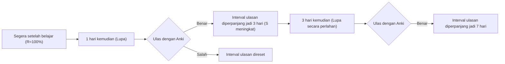
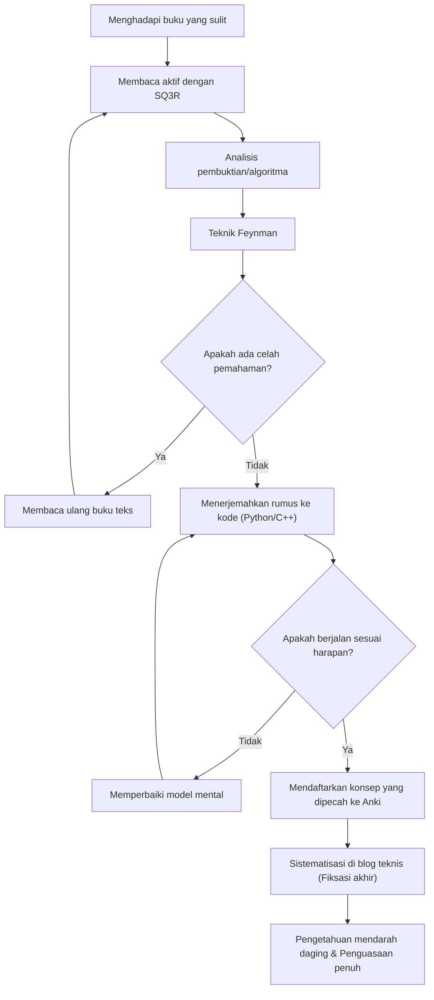

Dalam proses meningkatkan keterampilan sebagai insinyur atau peneliti, kita pasti akan menemui hambatan berupa "buku teknis yang sulit dipahami". Khususnya buku-buku yang berkaitan dengan matematika, algoritma, dan ilmu komputer teoretis, yang memiliki sifat sangat berbeda dari buku pengantar pemrograman pada umumnya. Tidak sedikit orang yang pernah mengalami kegagalan akibat deretan rumus matematika, konsep abstrak, dan kesenjangan logika yang sering kali diabaikan karena dianggap "sudah jelas" (trivial).

Namun, pengetahuan yang sulit inilah yang membentuk "kemampuan dasar" esensial yang tidak mudah usang oleh zaman. Artikel ini akan menjelaskan secara rinci metode komprehensif (SQ3R, Teknik Feynman, Pengulangan Berjarak, Pengkodean, dan Menulis Blog) berdasarkan ilmu kognitif dan teori pembelajaran untuk membaca dan memahami buku teknis matematika dan algoritma secara efisien, menanamkannya di otak, dan akhirnya menjadikannya sebagai kemampuan yang mendarah daging.

---

## 1. Mengapa Buku Teknis Matematika dan Algoritma "Sulit Dibaca"?

Pertama, mari kita analisis mengapa buku-buku semacam ini sulit dibaca. Ada 3 faktor utama:

1. **Kepadatan Informasi (Information Density) yang Sangat Tinggi**
   Pada buku bisnis atau buku teknis umum, Anda bisa menangkap intisari hanya dengan membaca cepat (skimming). Namun, dalam buku matematika, setiap kata pada "Definisi", "Lema", dan "Teorema" memiliki makna, dan melewatkan satu simbol saja dapat menghancurkan seluruh logika.
2. **Kesenjangan Langkah (Missing Intermediate Steps)**
   Karena keterbatasan halaman, atau asumsi bahwa "pembaca seharusnya bisa menyelesaikan persamaan tingkat ini sendiri", penulis sering menghilangkan perhitungan perantara dari sebuah pembuktian. Jika Anda tidak melakukan upaya untuk mengisi "kesenjangan" ini sendiri (membaca sambil mengisi kesenjangan), pemahaman Anda tidak akan berkembang sama sekali.
3. **Tingkat Abstraksi yang Tinggi (High Level of Abstraction)**
   Karena buku ini membahas ruang dimensi $n$ atau sembarang graf $G=(V, E)$ tanpa disertai contoh konkret, diperlukan beban kognitif yang besar untuk membangun model mental visual dan konkret di dalam otak.

Untuk mengatasi kesulitan ini, Anda harus mengubah gaya membaca secara mendasar dari "membaca pasif (sekadar mengikuti teks)" menjadi "membaca aktif (merekonstruksi pengetahuan sambil membebani otak)".

---

## 2. Metode Membaca Aktif: SQ3R dan Teknik Feynman

### 2.1 Metode SQ3R untuk Buku Matematika

SQ3R adalah metode membaca yang diusulkan oleh psikolog pendidikan Amerika, Francis P. Robinson. Kita akan menerapkannya secara khusus untuk buku matematika dan algoritma.

- **Survey (Tinjau)**: Pertama, buka-buka seluruh bab dengan cepat untuk memahami "teorema apa saja yang ada" dan "apa yang pada akhirnya ingin dibuktikan". Lihatlah hutannya sebelum melihat pohonnya.
- **Question (Tanya)**: Saat membaca klaim sebuah teorema, tanyakan pada diri sendiri, "Mengapa kondisi ini diperlukan?" atau "Apa yang terjadi jika batasan ini tidak ada?".
- **Read (Membaca Teliti)**: Bacalah pembuktiannya secara aktual. Di sini, pena dan buku catatan adalah hal yang wajib. Reproduksi ulang transformasi persamaan yang dihilangkan dengan tangan Anda sendiri.
- **Recite (Hafalkan/Lafalkan)**: Tutup buku, dan cobalah menjelaskan teorema atau cara kerja algoritma yang baru saja Anda baca dengan kata-kata Anda sendiri.
- **Review (Ulangi/Tinjau Kembali)**: Gunakan pengulangan berjarak (Spaced Repetition) yang akan dibahas nanti untuk menanamkan materi yang dipelajari ke dalam memori jangka panjang.

### 2.2 Teknik Feynman

Metode pembelajaran yang dinamai dari fisikawan Richard Feynman ini didasarkan pada prinsip: "Jika Anda tidak memahaminya, Anda tidak dapat menjelaskannya secara sederhana."

1. Tulis konsep yang ingin Anda pelajari di bagian paling atas selembar kertas.
2. Tuliskan konsep tersebut dengan kata-kata sederhana, seolah-olah Anda sedang mengajarkannya kepada "anak SMP (atau bebek karet)".
3. Bagian di mana Anda merasa buntu atau melarikan diri menggunakan jargon adalah "celah pemahaman" Anda.
4. Kembali ke buku teks dan pelajari ulang bagian tersebut.

Sangat berbahaya jika Anda merasa paham hanya dengan melihat deretan rumus matematika. Anda baru bisa menyebutnya sebagai pemahaman sejati ketika Anda dapat menjelaskan "intuisi fisik" atau "perilaku algoritma" yang direpresentasikan oleh rumus tersebut menggunakan bahasa alami.

---

## 3. Melawan Kurva Kelupaan: Sistem Pengulangan Berjarak (SRS) dan Anki

Ingatan manusia memudar secara eksponensial seiring berjalannya waktu. Fenomena ini dikenal sebagai **Kurva Kelupaan Ebbinghaus**, dan tingkat retensi memori $R$ dapat dimodelkan sebagai solusi dari persamaan diferensial berikut:

$$ R = e^{-\frac{t}{S}} $$

Di sini, $t$ adalah waktu yang berlalu, dan $S$ adalah kekuatan memori (Strength of memory). Setiap kali Anda mengulang (review), nilai $S$ akan membesar, sehingga kecepatan melupakan menjadi lebih lambat.

Sifat ini dioptimalkan oleh perangkat lunak dalam Sistem Pengulangan Berjarak (Spaced Repetition System: SRS) seperti **Anki**.



### 3.1 Cara Membuat Kartu Anki dalam Matematika dan Algoritma

Dalam menghafal buku teknis, "menghafal pembuktian panjang secara utuh" adalah hal yang sia-sia. Bagilah pengetahuan menjadi unit terkecil (Atomic) sebelum dijadikan kartu.

- **Kartu yang buruk**: "Tulis seluruh pembuktian Algoritma Dijkstra."
- **Kartu yang baik**: "Dalam Algoritma Dijkstra, apa syarat agar jarak terpendek sebuah simpul dianggap sudah pasti?" → "Ketika simpul dengan jarak sementara terkecil dipilih dari himpunan simpul yang belum pasti."
- **Kartu yang baik**: "Sebutkan rumus Teorema Kecil Fermat." → "Untuk bilangan prima $p$ dan bilangan bulat $a$ yang saling prima, $a^{p-1} \equiv 1 \pmod p$."

Saat menghafal rumus matematika, sangat efektif jika Anda mendaftarkannya di Anki dalam format LaTeX dan memanfaatkan metode rumpang (Cloze Deletion).

---

## 4. Tes Pemahaman Paling Kuat: "Mengkodekan" Rumus Matematika

Cara paling ampuh untuk memverifikasi apakah Anda benar-benar memahami matematika atau algoritma adalah dengan **"menerjemahkan rumus atau pembuktian ke dalam program yang benar-benar bisa dijalankan (seperti Python atau C++)"**.

Di dunia matematika, masalah selesai ketika sesuatu terbukti "eksistensinya", tetapi untuk menulis kodenya, Anda harus melangkah lebih jauh dan memikirkan "bagaimana cara menghitung nilai spesifiknya", sehingga resolusi pemahaman Anda akan meningkat hingga ke batas maksimal.

Di sini, mari kita lihat proses menerjemahkan rumus ke dalam kode melalui dua contoh konkret.

### 4.1 Contoh 1: Matematika Kriptografi RSA dan Implementasi Python

Kriptografi RSA, yang merupakan representasi dari kriptografi kunci publik, adalah aplikasi yang indah dari teori bilangan dasar (Aritmatika modular, Teorema Euler, Algoritma Euclidean Lanjutan).

#### Latar Belakang Matematika
Proses pembuatan kunci, enkripsi, dan dekripsi kriptografi RSA direpresentasikan oleh rumus berikut.

1. **Pembuatan Kunci**:
   Pilih bilangan prima yang sangat besar $p, q$, lalu biarkan $n = pq$.
   Hitung fungsi totient Euler $\phi(n) = (p-1)(q-1)$.
   Pilih kunci publik $e$ yang saling prima dengan $\phi(n)$.
   Temukan kunci rahasia $d$ sedemikian rupa sehingga $e \cdot d \equiv 1 \pmod{\phi(n)}$.

2. **Enkripsi**:
   Untuk teks terang $m$, hitung teks sandi $c$ sebagai berikut.
   $$ c \equiv m^e \pmod n $$

3. **Dekripsi**:
   Pulihkan teks terang $m$ dari teks sandi $c$ sebagai berikut.
   $$ m \equiv c^d \pmod n $$

Di balik berfungsinya dekripsi ini dengan benar, terdapat Teorema Euler $a^{\phi(n)} \equiv 1 \pmod n$. Dalam buku matematika, hal ini diikuti oleh beberapa halaman pembuktian, tapi mari kita coba mengimplementasikannya dengan Python.

#### Implementasi dalam Python

```python
import random
from math import gcd

# Algoritma Euclidean Lanjutan (Extended Euclidean Algorithm)
# Mengembalikan (x, y, gcd) sedemikian rupa sehingga ax + by = gcd(a, b)
def extended_gcd(a, b):
    if a == 0:
        return (b, 0, 1)
    else:
        g, y, x = extended_gcd(b % a, a)
        return (g, x - (b // a) * y, y)

# Invers modular: mencari x sehingga ax ≡ 1 (mod m)
def mod_inverse(a, m):
    g, x, y = extended_gcd(a, m)
    if g != 1:
        raise Exception('Invers modular tidak ada')
    else:
        return x % m

# Demo RSA
def rsa_demo():
    # 1. Pembuatan bilangan prima (aslinya menggunakan bilangan prima yang sangat besar)
    p, q = 61, 53
    n = p * q
    phi = (p - 1) * (q - 1)

    # 2. Pemilihan kunci publik e
    e = 17
    assert gcd(e, phi) == 1

    # 3. Perhitungan kunci rahasia d
    d = mod_inverse(e, phi)

    print(f"Kunci publik: (e={e}, n={n})")
    print(f"Kunci rahasia: (d={d}, n={n})")

    # Enkripsi
    m = 65  # Teks terang
    c = pow(m, e, n)  # c = m^e mod n
    print(f"Teks terang: {m} -> Setelah dienkripsi: {c}")

    # Dekripsi
    decrypted_m = pow(c, d, n)  # m = c^d mod n
    print(f"Setelah didekripsi: {decrypted_m}")

rsa_demo()
```

Untuk menemukan $d$ yang memenuhi rumus $e \cdot d \equiv 1 \pmod{\phi(n)}$, kita perlu mengimplementasikan algoritma yang disebut Algoritma Euclidean Lanjutan. Dengan cara ini, **ketika Anda mencoba menerjemahkan rumus matematika ke dalam kode, Anda akan dihadapkan pada tantangan implementasi "bagaimana secara spesifik menghitung variabel ini?", dan dalam proses memecahkannya, pemahaman matematis Anda akan menjadi jauh lebih dalam**.

### 4.2 Contoh 2: Algoritma Dijkstra dan Relaksasi (Relaxation)

Mari kita pertimbangkan Algoritma Dijkstra untuk menyelesaikan masalah lintasan terpendek dari sumber tunggal (SSSP) dalam teori graf.

Inti matematis dan algoritmik dari metode ini adalah operasi yang disebut "Relaksasi" (Relaxation).
Ketika terdapat sisi dari simpul $u$ ke simpul $v$ dengan bobot $w(u, v)$, jarak terpendek sementara $d[v]$ ke simpul $v$ diperbarui dengan rumus berikut.

$$ d[v] \leftarrow \min(d[v], d[u] + w(u, v)) $$

Operasi matematis ini diimplementasikan sebagai algoritma yang efisien menggunakan `std::priority_queue` dalam C++.

```cpp
#include <iostream>
#include <vector>
#include <queue>

using namespace std;

const int INF = 1e9;

// Struktur yang merepresentasikan sisi (edge)
struct Edge {
    int to;
    int weight;
};

void dijkstra(int start, const vector<vector<Edge>>& graph) {
    int n = graph.size();
    vector<int> dist(n, INF);
    // Pasangan {jarak, simpul}. Dibuat agar elemen dengan jarak terkecil dapat diambil terlebih dahulu
    priority_queue<pair<int, int>, vector<pair<int, int>>, greater<pair<int, int>>> pq;

    dist[start] = 0;
    pq.push({0, start});

    while (!pq.empty()) {
        auto [current_dist, u] = pq.top();
        pq.pop();

        // Jika rute yang lebih pendek sudah ditemukan, maka lewati (skip)
        if (current_dist > dist[u]) continue;

        // Eksekusi relaksasi (Relaxation)
        for (const auto& edge : graph[u]) {
            int v = edge.to;
            int weight = edge.weight;

            // Perbarui jika d[v] > d[u] + w(u, v)
            if (dist[v] > dist[u] + weight) {
                dist[v] = dist[u] + weight;
                pq.push({dist[v], v});
            }
        }
    }

    for (int i = 0; i < n; ++i) {
        cout << "Jarak terpendek ke simpul " << i << ": " << dist[i] << "\n";
    }
}
```

Anda dapat melihat bahwa definisi matematika $d[v] \leftarrow \min(\dots)$ dipetakan dengan sangat baik pada percabangan bersyarat dan proses pembaruan `if (dist[v] > dist[u] + weight)` di dalam kode.

---

## 5. Proses Kognitif dan Gambaran Umum Pembelajaran

Kita akan merangkum bagaimana metode-metode yang telah dijelaskan di atas bekerja sama untuk membentuk pengetahuan di dalam otak kita, menggunakan diagram Mermaid.



## 6. Fiksasi Ultimate: Output Sistematis sebagai Blog Teknis

Fase terakhir dari pembelajaran adalah **"menulis blog teknis yang ditujukan untuk orang banyak"**.

Jika Anki adalah alat untuk mempertahankan "titik" pengetahuan, menulis blog adalah proses menghubungkan titik-titik tersebut menjadi "garis" dan "bidang".

Saat menulis blog, proses berikut akan terjadi:
1. **Menentukan Pembaca**: Asumsikan "diri Anda di masa lalu yang tidak mengerti" sebagai pembaca, dan nyatakan secara verbal di mana Anda tersandung dan bagaimana Anda berpikir untuk melewatinya.
2. **Pembuatan Ilustrasi**: Visualisasikan struktur data abstrak dan transisi keadaan menggunakan Mermaid atau alat menggambar. Hal ini juga akan memperdalam pemahaman visual Anda sendiri.
3. **Menjamin Keakuratan**: Karena ini akan dipublikasikan ke seluruh dunia, Anda akan mulai bertanya pada diri sendiri dan melakukan verifikasi silang: "Apakah ekspansi rumus ini benar-benar tepat?" dan "Apakah ungkapan ini tidak menimbulkan kesalahpahaman?". Proses ini dengan tanpa ampun mengungkapkan bagian di mana pemahaman Anda masih dangkal (Micro-misunderstandings) dan memaksa Anda untuk memperbaikinya.

### 6.1 Alat yang Harus Digunakan untuk Menulis Blog
- **Markdown / LaTeX**: Wajib digunakan untuk menulis rumus matematika dengan indah.
- **Mermaid.js**: Memungkinkan Anda untuk mendeskripsikan diagram transisi keadaan dan diagram alir berbasis kode, serta memiliki kemudahan pemeliharaan yang sangat baik.
- **GitHub / Gist**: Membagikan cuplikan kode dari algoritma yang diimplementasikan, sehingga pembaca dapat benar-benar menjalankan dan memverifikasinya.

## 7. Kesimpulan: Pemandangan Setelah Melewati Kesulitan

Membaca buku spesialis matematika atau algoritma bukanlah jalan yang mudah. Namun, dengan menjalankan siklus yang meliputi memahami struktur dengan SQ3R, mengekspresikannya melalui Teknik Feynman, menerjemahkannya ke dalam kode untuk memverifikasi operasinya, mencegah kelupaan dengan Anki, dan akhirnya menyajikannya ke dunia melalui blog teknis, pengetahuan yang sulit tersebut pasti akan menjadi "kekuatan" Anda.

Pengetahuan tentang cara menggunakan API atau framework yang dangkal akan menjadi usang dalam beberapa tahun, tetapi kemampuan berpikir matematis dan dasar algoritma adalah aset seumur hidup. Saat Anda membuka buku teknis yang sulit berikutnya, silakan manfaatkan metode dalam artikel ini dan selamilah kedalaman pengetahuan tersebut.
