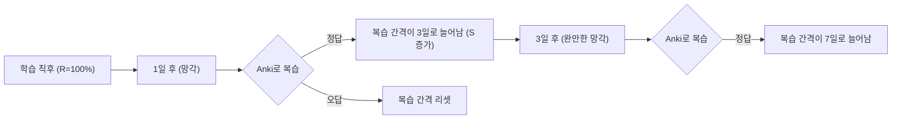
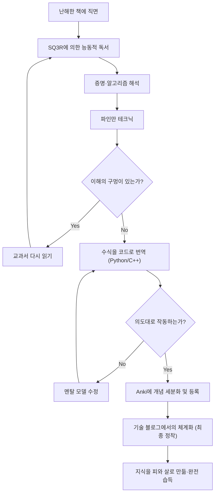

엔지니어나 연구자로서 스킬업을 도모하는 과정에서, 우리는 반드시 "난해한 기술서"라는 벽에 부딪히게 됩니다. 특히 수학이나 알고리즘, 이론 컴퓨터 과학과 관련된 서적은 일반적인 프로그래밍 입문서와는 전혀 다른 성질을 가지고 있습니다. 수식의 나열, 추상적인 개념, 그리고 "자명하다"며 일축해 버리는 행간의 넓이에 좌절을 경험한 사람이 적지 않을 것입니다.

하지만, 이러한 난해한 지식이야말로 시대에 뒤떨어지지 않는 본질적인 "기초력"을 형성합니다. 본 기사에서는 인지과학과 학습 이론을 바탕으로, 수학이나 알고리즘 기술서를 효율적으로 읽고 이해하며, 뇌에 정착시키고 최종적으로 자신의 피와 살로 만들기 위한 포괄적인 메서드(SQ3R, 파인만 테크닉, 간격 반복, 코드화, 블로그 집필)를 상세히 해설합니다.

---

## 1. 왜 수학·알고리즘 기술서는 "읽을 수 없는" 것일까?

먼저, 왜 이러한 서적을 읽는 것이 어려운지 분석해 봅시다. 주요 요인은 다음 3가지입니다.

1. **정보의 밀도(Information Density)가 극히 높다**
   일반적인 비즈니스 서적이나 기술서라면 훑어보아도 대략적인 뜻을 파악할 수 있습니다. 하지만 수학서에서 "정의", "보조정리", "정리"는 일언일구에 의미가 있으며, 하나의 기호만 놓쳐도 전체의 논리가 붕괴됩니다.
2. **행간의 넓이(Missing Intermediate Steps)**
   저자는 지면의 사정상, 혹은 "독자라면 이 정도의 수식 변형은 스스로 할 수 있을 것이다"라는 전제에서 증명의 중간 계산을 빈번히 생략합니다. 이 "행간"을 스스로 채우는 작업(행간을 채우는 독서)을 하지 않으면, 이해는 전혀 진행되지 않습니다.
3. **추상도가 높다(High Level of Abstraction)**
   구체적인 예시 없이 $n$ 차원 공간이나 임의의 그래프 $G=(V, E)$ 에 대해 이야기하기 때문에, 뇌 속에 시각적·구체적인 멘탈 모델을 구축하는 데 막대한 인지 부하가 걸립니다.

이러한 어려움을 극복하기 위해서는, "수동적인 독서(그저 글자만 쫓는 것)"에서 "능동적인 독서(뇌에 부하를 주면서 지식을 재구축하는 것)"로 독서 스타일을 근본적으로 바꿀 필요가 있습니다.

---

## 2. 능동적 독서법: SQ3R과 파인만 테크닉

### 2.1 수학서를 위한 SQ3R 메서드

SQ3R은 미국의 교육 심리학자 프랜시스 P. 로빈슨이 제창한 독서법입니다. 이를 수학·알고리즘 서적에 특화시켜 적용합니다.

- **Survey(개관)**: 먼저 장 전체를 휙휙 넘기며 "어떤 정리가 있는지", "최종적으로 무엇을 증명하려고 하는지"를 파악합니다. 숲을 먼저 보고 나서 나무를 봅니다.
- **Question(질문)**: 정리의 주장을 읽은 시점에서, "왜 이 조건이 필요한가?", "만약 이 제약이 없었다면 어떻게 될까?"라고 자문합니다.
- **Read(정독)**: 실제로 증명을 읽습니다. 여기서는 펜과 노트가 필수입니다. 생략된 수식 변형을 자신의 손으로 재현합니다.
- **Recite(암송·언어화)**: 책을 덮고, 방금 읽은 정리나 알고리즘의 구조를 자신의 언어로 설명해 봅니다.
- **Review(복습)**: 후술할 간격 반복(Spaced Repetition)을 이용하여, 학습한 내용을 장기 기억에 정착시킵니다.

### 2.2 파인만 테크닉

물리학자 리처드 파인만의 이름을 딴 이 학습법은, "이해하지 못한 것은 단순하게 설명할 수 없다"는 원칙에 기초하고 있습니다.

1. 배우고 싶은 개념을 종이의 맨 위에 적는다.
2. 그 개념을 마치 "중학교 2학년(또는 고무 오리)"에게 가르치듯이, 쉬운 말로 적어 내려간다.
3. 막히거나 전문 용어로 도망쳐 버린 부분이 "이해의 누락"이다.
4. 교과서로 돌아가서 그 부분을 복습한다.

수식의 나열만으로 이해했다고 착각하는 것은 매우 위험합니다. 수식이 의미하는 "물리적인 직관"이나 "알고리즘의 동작"을 자연어로 설명할 수 있어야 비로소 진정한 이해라고 부를 수 있습니다.

---

## 3. 망각 곡선에 저항하다: 간격 반복 시스템 (SRS) 과 Anki

인간의 기억은 시간과 함께 지수함수적으로 감쇠합니다. 이 현상은 **에빙하우스의 망각 곡선**으로 알려져 있으며, 기억의 유지율 $R$ 은 다음과 같은 미분 방정식의 해로 모델링되기도 합니다.

$$ R = e^{-\frac{t}{S}} $$

여기서 $t$ 는 경과 시간, $S$ 는 기억의 강도(Strength of memory)입니다. 복습을 거듭할수록 $S$ 가 커지고, 망각의 속도가 완만해집니다.

이 성질을 소프트웨어로 최적화한 것이 **Anki** 등의 간격 반복 시스템(Spaced Repetition System: SRS)입니다.



### 3.1 수학·알고리즘에서의 Anki 카드 만드는 법

기술서의 암기에 있어서, "긴 증명을 통째로 암기하는 것"은 무의미합니다. 지식을 최소 단위(Atomic)로 분할하여 카드화합니다.

- **나쁜 카드**: "다익스트라(Dijkstra) 알고리즘의 증명을 모두 쓰시오"
- **좋은 카드**: "다익스트라 알고리즘에서, 어떤 정점의 최단 거리가 확정되었다고 간주할 수 있는 조건은 무엇인가?" → "미확정 정점 집합 중에서, 잠정 거리가 최소인 정점을 선택했을 때."
- **좋은 카드**: "페르마의 소정리 수식을 답하시오" → "소수 $p$ 와 서로소인 정수 $a$ 에 대하여, $a^{p-1} \equiv 1 \pmod p$"

수식을 외울 때도 LaTeX 형식으로 Anki에 등록하고, 빈칸 뚫기 문제(Cloze Deletion)를 활용하면 효과적입니다.

---

## 4. 최강의 이해도 테스트: 수식을 "코드화"하기

수학이나 알고리즘을 정말로 이해했는지 검증하는 가장 강력한 방법은, **"수식이나 증명을 실제로 동작하는 프로그램(Python이나 C++ 등)으로 번역하는 것"**입니다.

수학의 세계에서는 "존재한다"고 증명되면 끝나지만, 코드화하기 위해서는 "어떻게 구체적인 값을 계산할 것인가"까지 파고들 필요가 있어, 이해의 해상도가 극한까지 높아집니다.

여기서는 두 가지 구체적인 예를 통해 수식을 코드로 구현하는 과정을 살펴보겠습니다.

### 4.1 실제 사례 1: RSA 암호의 수학과 Python 구현

공개키 암호 방식의 대표격인 RSA 암호는, 초등 정수론(합동식, 오일러의 정리, 확장 유클리드 호제법)의 아름다운 응용입니다.

#### 수학적 배경
RSA 암호의 키 생성과 암호화·복호화 프로세스는 다음 수식으로 표현됩니다.

1. **키 생성**:
   거대한 소수 $p, q$ 를 선택하고, $n = pq$ 로 둔다.
   오일러의 피 함수 $\phi(n) = (p-1)(q-1)$ 을 계산한다.
   $\phi(n)$ 과 서로소인 공개키 $e$ 를 선택한다.
   $e \cdot d \equiv 1 \pmod{\phi(n)}$ 이 되는 비밀키 $d$ 를 구한다.

2. **암호화**:
   평문 $m$ 에 대하여, 암호문 $c$ 를 다음과 같이 계산한다.
   $$ c \equiv m^e \pmod n $$

3. **복호화**:
   암호문 $c$ 로부터 평문 $m$ 을 다음과 같이 복원한다.
   $$ m \equiv c^d \pmod n $$

이 복호화가 올바르게 기능하는 배경에는 오일러의 정리 $a^{\phi(n)} \equiv 1 \pmod n$ 이 있습니다. 수학서에서는 몇 페이지에 걸친 증명이 이어지지만, 이를 Python으로 구현해 보겠습니다.

#### Python을 통한 구현

```python
import random
from math import gcd

# 확장 유클리드 호제법
# ax + by = gcd(a, b) 가 되는 (x, y, gcd) 를 반환
def extended_gcd(a, b):
    if a == 0:
        return (b, 0, 1)
    else:
        g, y, x = extended_gcd(b % a, a)
        return (g, x - (b // a) * y, y)

# 모듈러 역수: ax ≡ 1 (mod m) 이 되는 x 를 구함
def mod_inverse(a, m):
    g, x, y = extended_gcd(a, m)
    if g != 1:
        raise Exception('모듈러 역수가 존재하지 않습니다')
    else:
        return x % m

# RSA 데모
def rsa_demo():
    # 1. 소수 생성 (본래는 매우 거대한 소수를 사용)
    p, q = 61, 53
    n = p * q
    phi = (p - 1) * (q - 1)

    # 2. 공개키 e 의 선택
    e = 17
    assert gcd(e, phi) == 1

    # 3. 비밀키 d 의 계산
    d = mod_inverse(e, phi)

    print(f"공개키: (e={e}, n={n})")
    print(f"비밀키: (d={d}, n={n})")

    # 암호화
    m = 65  # 평문
    c = pow(m, e, n)  # c = m^e mod n
    print(f"평문: {m} -> 암호화 후: {c}")

    # 복호화
    decrypted_m = pow(c, d, n)  # m = c^d mod n
    print(f"복호화 후: {decrypted_m}")

rsa_demo()
```

수식 $e \cdot d \equiv 1 \pmod{\phi(n)}$ 을 만족하는 $d$ 를 찾기 위해, 확장 유클리드 호제법이라는 알고리즘을 구현할 필요가 있습니다. 이처럼, **수식을 코드화하려고 하면 "이 변수는 구체적으로 어떻게 계산하는가?"라는 구현상의 과제에 직면하게 되고, 이를 해결하는 과정에서 수학적 이해가 비약적으로 깊어지는 것**입니다.

### 4.2 실제 사례 2: 다익스트라 알고리즘과 완화(Relaxation)

그래프 이론에서의 단일 출발지 최단 경로 문제(SSSP)를 푸는 다익스트라 알고리즘을 생각해 봅시다.

수학적·알고리즘적 핵심이 되는 것은 "완화(Relaxation)"라고 불리는 조작입니다.
정점 $u$ 에서 정점 $v$ 로 향하는 가중치 $w(u, v)$ 인 간선이 있을 때, 정점 $v$ 에 대한 잠정적인 최단 거리 $d[v]$ 를 다음 식으로 갱신합니다.

$$ d[v] \leftarrow \min(d[v], d[u] + w(u, v)) $$

이 수식적인 조작을, C++의 `std::priority_queue` 를 이용하여 효율적인 알고리즘으로 구현해 보겠습니다.

```cpp
#include <iostream>
#include <vector>
#include <queue>

using namespace std;

const int INF = 1e9;

// 간선을 나타내는 구조체
struct Edge {
    int to;
    int weight;
};

void dijkstra(int start, const vector<vector<Edge>>& graph) {
    int n = graph.size();
    vector<int> dist(n, INF);
    // {거리, 정점} 의 쌍. 거리가 작은 순서대로 꺼낼 수 있도록 함
    priority_queue<pair<int, int>, vector<pair<int, int>>, greater<pair<int, int>>> pq;

    dist[start] = 0;
    pq.push({0, start});

    while (!pq.empty()) {
        auto [current_dist, u] = pq.top();
        pq.pop();

        // 이미 더 짧은 경로가 발견된 경우에는 건너뜀
        if (current_dist > dist[u]) continue;

        // 완화 (Relaxation) 의 실행
        for (const auto& edge : graph[u]) {
            int v = edge.to;
            int weight = edge.weight;

            // d[v] > d[u] + w(u, v) 라면 갱신
            if (dist[v] > dist[u] + weight) {
                dist[v] = dist[u] + weight;
                pq.push({dist[v], v});
            }
        }
    }

    for (int i = 0; i < n; ++i) {
        cout << "정점 " << i << " 까지의 최단 거리: " << dist[i] << "\n";
    }
}
```

수학적인 정의 $d[v] \leftarrow \min(\dots)$ 가, 코드상의 `if (dist[v] > dist[u] + weight)` 라는 조건 분기와 갱신 처리로 멋지게 매핑되어 있는 것을 알 수 있습니다.

---

## 5. 인지 프로세스와 학습의 전체상

지금까지 해설한 기법이, 어떻게 연계되어 우리의 뇌 속에서 지식을 형성하는지를 Mermaid 다이어그램을 사용하여 정리합니다.



## 6. 궁극의 정착: 기술 블로그로서의 체계적 아웃풋

학습의 최종 단계는, **"불특정 다수를 향해 기술 블로그를 쓰는 것"**입니다.

Anki가 지식의 "점"을 유지하는 도구라면, 블로그 집필은 그 점들을 연결하여 "선"이나 "면"으로 만드는 작업입니다.

블로그를 쓸 때, 다음과 같은 프로세스가 발생합니다.
1. **독자 설정**: "과거에 이해하지 못했던 자신"을 독자로 상정하고, 어디서 막혔는지, 어떻게 생각해서 돌파할 수 있었는지를 언어화합니다.
2. **도해 작성**: Mermaid나 드로잉 툴을 이용하여, 추상적인 데이터 구조나 상태 전이를 시각화합니다. 이로 인해 자기 자신의 시각적인 이해도 깊어집니다.
3. **정확성 담보**: 전 세계에 공개되기 때문에, "이 수식 전개는 정말로 맞을까?", "이 표현이 오해를 부르지 않을까?"라고 자문자답하며 뒷받침할 근거를 찾게 됩니다. 이 프로세스가, 이해가 얕은 부분(Micro-misunderstandings)을 가차 없이 들춰내어 강제적으로 수정해 줍니다.

### 6.1 블로그 집필 시 사용해야 할 도구
- **Markdown / LaTeX**: 수식을 아름답게 작성하기 위해 필수입니다.
- **Mermaid.js**: 상태 전이도나 플로우차트를 코드 기반으로 작성할 수 있어, 유지보수성이 뛰어납니다.
- **GitHub / Gist**: 구현한 알고리즘의 코드 스니펫을 공유하여, 독자가 실제로 실행하고 검증할 수 있도록 합니다.

## 7. 결론: 고생을 극복한 후의 풍경

수학서나 알고리즘 전문서를 읽는 것은 결코 쉬운 길이 아닙니다. 하지만, SQ3R로 구조를 파악하고, 파인만 테크닉으로 언어화하고, 코드로 구현하여 동작을 검증하고, Anki로 망각을 방지하며, 마지막으로 기술 블로그를 통해 세계에 발신하는 일련의 사이클을 돌림으로써, 그 난해한 지식은 확실하게 당신의 "힘"이 됩니다.

표면적인 API 사용법이나 프레임워크 지식은 몇 년이면 진부해지지만, 수학적 사고력이나 알고리즘의 기초는 평생의 자산입니다. 다음번에 난해한 기술서를 펼칠 때는, 꼭 본 기사의 메서드를 활용하여 지식의 심연으로 뛰어들어 보시기 바랍니다.
