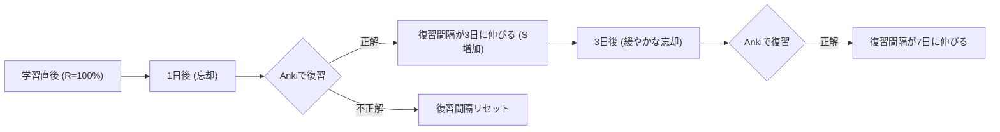
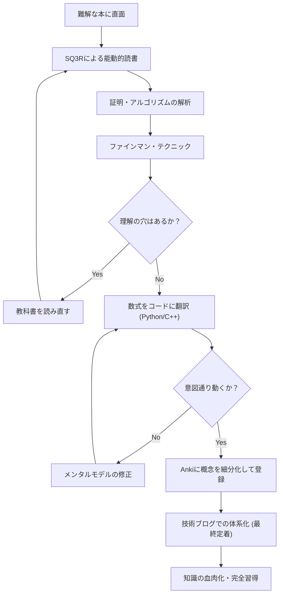

エンジニアや研究者としてスキルアップを図る過程で、私たちは必ず「難解な技術書」という壁にぶつかります。特に数学やアルゴリズム、理論計算機科学に関する書籍は、一般的なプログラミングの入門書とは全く異なる性質を持っています。数式の羅列、抽象的な概念、そして「自明である」と一蹴される行間の広さに、挫折を経験した人は少なくないでしょう。

しかし、これらの難解な知識こそが、時代遅れになりにくい本質的な「基礎力」を形成します。本記事では、認知科学や学習理論に基づき、数学やアルゴリズムの技術書を効率的に読み解き、脳に定着させ、最終的に自らの血肉とするための包括的なメソッド（SQ3R、ファインマン・テクニック、間隔反復、コード化、ブログ執筆）を詳細に解説します。

---

## 1. なぜ数学・アルゴリズムの技術書は「読めない」のか？

まず、なぜこうした書籍を読むのが難しいのかを分析しましょう。主な要因は以下の3つです。

1. **情報の密度（Information Density）が極めて高い**
   一般的なビジネス書や技術書であれば、斜め読みでも大意をつかむことができます。しかし、数学書において「定義」「補題」「定理」は一言一句に意味があり、一つの記号を見落とすだけで全体の論理が崩壊します。
2. **行間の広さ（Missing Intermediate Steps）**
   著者は紙面の都合上、あるいは「読者ならこの程度の式変形は自力でできるはずだ」という前提から、証明の途中計算を頻繁に省略します。この「行間」を自力で埋める作業（行間を埋める読書）を行わなければ、理解は全く進みません。
3. **抽象度が高い（High Level of Abstraction）**
   具体例を伴わずに $n$ 次元空間や任意のグラフ $G=(V, E)$ について語られるため、脳内に視覚的・具体的なメンタルモデルを構築するのに多大な認知負荷がかかります。

これらの困難を乗り越えるためには、「受動的な読書（ただ文字を追うだけ）」から「能動的な読書（脳に負荷をかけながら知識を再構築する）」へと読書のスタイルを根本から変える必要があります。

---

## 2. 能動的読書法：SQ3Rとファインマン・テクニック

### 2.1 数学書のための SQ3R メソッド

SQ3Rは、アメリカの教育心理学者フランシス・P・ロビンソンが提唱した読書法です。これを数学・アルゴリズム書に特化させて適用します。

- **Survey（概観）**: まず章全体をパラパラとめくり、「どんな定理があるか」「最終的に何を証明しようとしているのか」を把握します。森を見てから木を見ます。
- **Question（質問）**: 定理の主張を読んだ時点で、「なぜこの条件が必要なのか？」「もしこの制約がなかったらどうなるのか？」と自問します。
- **Read（精読）**: 実際に証明を読みます。ここではペンとノートが必須です。省略された式変形を自分の手で再現します。
- **Recite（暗唱・言語化）**: 本を閉じ、今読んだ定理やアルゴリズムの仕組みを自分の言葉で説明してみます。
- **Review（復習）**: 後述する間隔反復（Spaced Repetition）を用いて、学習した内容を長期記憶に定着させます。

### 2.2 ファインマン・テクニック

物理学者リチャード・ファインマンにちなんで名付けられたこの学習法は、「理解していないものは、シンプルに説明できない」という原則に基づいています。

1. 学びたい概念を紙の一番上に書く。
2. その概念を、まるで「中学2年生（あるいはゴム製のアヒル）」に教えるかのように、平易な言葉で書き出す。
3. 行き詰まったり、専門用語に逃げてしまったりした部分が「理解の抜け漏れ」である。
4. 教科書に戻り、その部分を復習する。

数式の羅列だけで分かった気になるのは非常に危険です。数式が意味する「物理的な直感」や「アルゴリズムの挙動」を自然言語で説明できて初めて、真の理解と呼べます。

---

## 3. 忘却曲線に抗う：間隔反復システム (SRS) と Anki

人間の記憶は時間とともに指数関数的に減衰します。この現象は**エビングハウスの忘却曲線**として知られており、記憶の保持率 $R$ は以下のような微分方程式の解としてモデル化されることがあります。

$$ R = e^{-\frac{t}{S}} $$

ここで、$t$ は経過時間、$S$ は記憶の強度（Strength of memory）です。復習を重ねるごとに $S$ が大きくなり、忘却のスピードが緩やかになります。

この性質をソフトウェアで最適化したのが **Anki** などの間隔反復システム（Spaced Repetition System: SRS）です。



### 3.1 数学・アルゴリズムにおける Anki カードの作り方

技術書の暗記においては、「長い証明を丸暗記する」ことは無意味です。知識を最小単位（Atomic）に分割してカード化します。

- **悪いカード**: 「Dijkstra法の証明を全て書け」
- **良いカード**: 「Dijkstra法で、ある頂点の最短距離が確定したとみなせる条件は何か？」→「未確定の頂点集合の中で、暫定距離が最小の頂点を選んだとき。」
- **良いカード**: 「フェルマーの小定理の数式を答えよ」→「素数 $p$ と、互いに素な整数 $a$ について、 $a^{p-1} \equiv 1 \pmod p$」

数式を覚える際も、LaTeX形式でAnkiに登録し、穴埋め問題（Cloze Deletion）を活用すると効果的です。

---

## 4. 最強の理解度テスト：数式を「コード化」する

数学やアルゴリズムを本当に理解したかどうかを検証する最も強力な方法は、**「数式や証明を、実際に動くプログラム（PythonやC++など）に翻訳すること」**です。

数学の世界では「存在する」と証明されれば終わりですが、コード化するためには「どうやって具体的な値を計算するか」まで踏み込む必要があり、理解の解像度が極限まで高まります。

ここでは2つの具体例を通して、数式をコードに落とし込む過程を見てみましょう。

### 4.1 実例1：RSA暗号の数学とPython実装

公開鍵暗号方式の代表であるRSA暗号は、初等整数論（合同式、オイラーの定理、拡張ユークリッドの互除法）の美しい応用です。

#### 数学的背景
RSA暗号の鍵生成と暗号化・復号のプロセスは以下の数式で表されます。

1. **鍵生成**:
   巨大な素数 $p, q$ を選び、$n = pq$ とする。
   オイラーのトーティエント関数 $\phi(n) = (p-1)(q-1)$ を計算する。
   $\phi(n)$ と互いに素な公開鍵 $e$ を選ぶ。
   $e \cdot d \equiv 1 \pmod{\phi(n)}$ となる秘密鍵 $d$ を求める。

2. **暗号化**:
   平文 $m$ に対して、暗号文 $c$ を次のように計算する。
   $$ c \equiv m^e \pmod n $$

3. **復号**:
   暗号文 $c$ から平文 $m$ を次のように復元する。
   $$ m \equiv c^d \pmod n $$

この復号が正しく機能する背景には、オイラーの定理 $a^{\phi(n)} \equiv 1 \pmod n$ があります。数学書では数ページの証明が続きますが、これをPythonで実装してみましょう。

#### Pythonによる実装

```python
import random
from math import gcd

# 拡張ユークリッドの互除法
# ax + by = gcd(a, b) となる (x, y, gcd) を返す
def extended_gcd(a, b):
    if a == 0:
        return (b, 0, 1)
    else:
        g, y, x = extended_gcd(b % a, a)
        return (g, x - (b // a) * y, y)

# モジュラ逆数: ax ≡ 1 (mod m) となる x を求める
def mod_inverse(a, m):
    g, x, y = extended_gcd(a, m)
    if g != 1:
        raise Exception('モジュラ逆数が存在しません')
    else:
        return x % m

# RSAデモ
def rsa_demo():
    # 1. 素数生成 (本来は非常に巨大な素数を使う)
    p, q = 61, 53
    n = p * q
    phi = (p - 1) * (q - 1)

    # 2. 公開鍵 e の選択
    e = 17
    assert gcd(e, phi) == 1

    # 3. 秘密鍵 d の計算
    d = mod_inverse(e, phi)

    print(f"公開鍵: (e={e}, n={n})")
    print(f"秘密鍵: (d={d}, n={n})")

    # 暗号化
    m = 65  # 平文
    c = pow(m, e, n)  # c = m^e mod n
    print(f"平文: {m} -> 暗号化後: {c}")

    # 復号
    decrypted_m = pow(c, d, n)  # m = c^d mod n
    print(f"復号後: {decrypted_m}")

rsa_demo()
```

数式 $e \cdot d \equiv 1 \pmod{\phi(n)}$ を満たす $d$ を見つけるために、拡張ユークリッドの互除法というアルゴリズムを実装する必要があります。このように、**数式をコード化しようとすると、「この変数は具体的にどう計算するのか？」という実装上の課題に直面し、それを解決する過程で数学的理解が飛躍的に深まる**のです。

### 4.2 実例2：ダイクストラ法と緩和（Relaxation）

グラフ理論における単一始点最短経路問題（SSSP）を解くダイクストラ法を考えます。

数学的・アルゴリズム的な核となるのは「緩和（Relaxation）」と呼ばれる操作です。
頂点 $u$ から頂点 $v$ への重み $w(u, v)$ の辺があるとき、頂点 $v$ への暫定的な最短距離 $d[v]$ を以下の式で更新します。

$$ d[v] \leftarrow \min(d[v], d[u] + w(u, v)) $$

この数式的な操作を、C++の `std::priority_queue` を用いて効率的なアルゴリズムとして実装します。

```cpp
#include <iostream>
#include <vector>
#include <queue>

using namespace std;

const int INF = 1e9;

// 辺を表す構造体
struct Edge {
    int to;
    int weight;
};

void dijkstra(int start, const vector<vector<Edge>>& graph) {
    int n = graph.size();
    vector<int> dist(n, INF);
    // {距離, 頂点} のペア。距離が小さい順に取り出せるようにする
    priority_queue<pair<int, int>, vector<pair<int, int>>, greater<pair<int, int>>> pq;

    dist[start] = 0;
    pq.push({0, start});

    while (!pq.empty()) {
        auto [current_dist, u] = pq.top();
        pq.pop();

        // 既により短い経路が見つかっている場合はスキップ
        if (current_dist > dist[u]) continue;

        // 緩和 (Relaxation) の実行
        for (const auto& edge : graph[u]) {
            int v = edge.to;
            int weight = edge.weight;

            // d[v] > d[u] + w(u, v) なら更新
            if (dist[v] > dist[u] + weight) {
                dist[v] = dist[u] + weight;
                pq.push({dist[v], v});
            }
        }
    }

    for (int i = 0; i < n; ++i) {
        cout << "頂点 " << i << " への最短距離: " << dist[i] << "\n";
    }
}
```

数学的な定義 $d[v] \leftarrow \min(\dots)$ が、コード上の `if (dist[v] > dist[u] + weight)` という条件分岐と更新処理に見事にマッピングされていることがわかります。

---

## 5. 認知プロセスと学習の全体像

ここまで解説した手法が、どのように連携して私たちの脳内で知識を形作るのかを、Mermaid図を用いて整理します。



## 6. 究極の定着：技術ブログとしての体系的アウトプット

学習の最終フェーズは、**「不特定多数の人に向けて技術ブログを書くこと」**です。

Ankiが知識の「点」を維持するツールだとすれば、ブログ執筆はそれらの点を繋ぎ合わせて「線」や「面」にする作業です。

ブログを書く際、以下のようなプロセスが発生します。
1. **読者の設定**: 「過去の理解できなかった自分」を読者と想定し、どこで躓いたのか、どう考えれば突破できたのかを言語化します。
2. **図解の作成**: Mermaidやドローイングツールを用いて、抽象的なデータ構造や状態遷移を可視化します。これにより、自分自身の視覚的な理解も深まります。
3. **正確性の担保**: 世界中に公開されるため、「この数式展開は本当に正しいのか？」「この表現で誤解を招かないか？」と自問自答し、裏取りをするようになります。このプロセスが、理解の浅い部分（Micro-misunderstandings）を容赦なく暴き出し、強制的に修復してくれます。

### 6.1 ブログ執筆で使うべきツール
- **Markdown / LaTeX**: 数式を美しく記述するために必須です。
- **Mermaid.js**: 状態遷移図やフローチャートをコードベースで記述でき、保守性に優れています。
- **GitHub / Gist**: 実装したアルゴリズムのコードスニペットを共有し、読者が実際に動かして検証できるようにします。

## 7. 結論：苦労を乗り越えた先の景色

数学書やアルゴリズムの専門書を読むことは、決して楽な道のりではありません。しかし、SQ3Rで構造を把握し、ファインマン・テクニックで言語化し、コードに落とし込んで動作を検証し、Ankiで忘却を防ぎ、最後に技術ブログで世界に向けて発信するという一連のサイクルを回すことで、その難解な知識は確実にあなたの「力」になります。

表面的なAPIの使い方やフレームワークの知識は数年で陳腐化しますが、数学的思考力やアルゴリズムの基礎は一生モノの資産です。次に難解な技術書を開くときは、ぜひ本記事のメソッドを活用して、知識の深淵に飛び込んでみてください。
