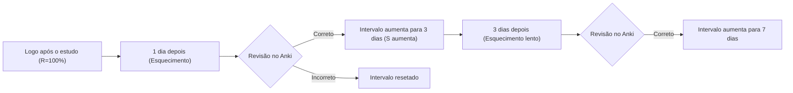
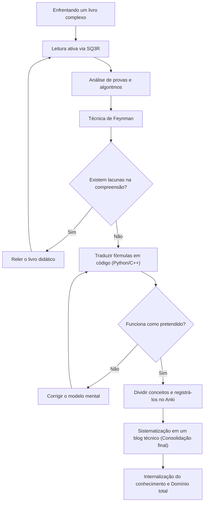

No processo de aprimoramento de habilidades como engenheiros ou pesquisadores, inevitavelmente nos deparamos com o obstáculo dos "livros técnicos complexos". Em particular, livros sobre matemática, algoritmos e ciência da computação teórica têm uma natureza completamente diferente dos livros introdutórios gerais de programação. Não são poucas as pessoas que já experimentaram frustração devido à enxurrada de fórmulas matemáticas, conceitos abstratos e às entrelinhas onde explicações são descartadas como "triviais" ou "óbvias".

No entanto, são precisamente esses conhecimentos complexos que formam uma "força fundamental" essencial e que dificilmente se tornará obsoleta. Neste artigo, com base na ciência cognitiva e nas teorias de aprendizagem, explicaremos detalhadamente métodos abrangentes (SQ3R, Técnica de Feynman, Repetição Espaçada, Codificação e Escrita de Blog) para decifrar eficientemente livros técnicos de matemática e algoritmos, consolidá-los na mente e, por fim, torná-los parte de si mesmo.

---

## 1. Por que não conseguimos "ler" livros técnicos de matemática e algoritmos?

Primeiro, vamos analisar por que é tão difícil ler tais livros. Os três principais fatores são os seguintes:

1. **A densidade de informação (Information Density) é extremamente alta**
   Com livros gerais de negócios ou técnicos, é possível captar a ideia principal mesmo com uma leitura dinâmica. Contudo, em livros de matemática, cada palavra das "definições", "lemas" e "teoremas" tem significado, e ignorar um único símbolo pode fazer toda a lógica desmoronar.
2. **As entrelinhas são vastas (Missing Intermediate Steps)**
   Devido a restrições de espaço ou à premissa de que "o leitor deve ser capaz de fazer essa transformação de equação por conta própria", os autores frequentemente omitem cálculos intermediários em provas. Se você não fizer o esforço de preencher essas "entrelinhas" por si mesmo (uma leitura preenchendo as entrelinhas), sua compreensão simplesmente não avançará.
3. **O nível de abstração é alto (High Level of Abstraction)**
   Como falam sobre um espaço $n$-dimensional ou um grafo arbitrário $G=(V, E)$ sem exemplos concretos, isso exige uma carga cognitiva enorme para construir um modelo mental visual e específico no cérebro.

Para superar essas dificuldades, é necessário mudar fundamentalmente seu estilo de leitura de uma "leitura passiva (apenas seguir as palavras)" para uma "leitura ativa (reconstruir o conhecimento enquanto coloca carga no cérebro)".

---

## 2. Método de Leitura Ativa: SQ3R e a Técnica de Feynman

### 2.1 O Método SQ3R para Livros de Matemática

SQ3R é um método de leitura proposto pelo psicólogo educacional americano Francis P. Robinson. Nós o aplicaremos especificamente a livros de matemática e algoritmos.

- **Survey (Pesquisar/Visão Geral)**: Primeiro, folheie o capítulo inteiro para entender "que teoremas estão lá" e "o que eles estão tentando provar em última instância". Veja a floresta antes de olhar para as árvores.
- **Question (Questionar)**: Ao ler a declaração de um teorema, pergunte a si mesmo: "Por que essa condição é necessária?" e "O que aconteceria se essa restrição não existisse?".
- **Read (Ler)**: Leia as provas de fato. Aqui, caneta e caderno são essenciais. Reproduza com suas próprias mãos as transformações de equações que foram omitidas.
- **Recite (Recitar/Verbalizar)**: Feche o livro e tente explicar os mecanismos do teorema ou algoritmo que você acabou de ler com suas próprias palavras.
- **Review (Revisar)**: Use a Repetição Espaçada (Spaced Repetition), discutida mais adiante, para consolidar o que você aprendeu na memória de longo prazo.

### 2.2 A Técnica de Feynman

Este método de aprendizagem, nomeado em homenagem ao físico Richard Feynman, baseia-se no princípio de que "se você não pode explicar algo de forma simples, você não o entende".

1. Escreva o conceito que deseja aprender no topo de uma folha de papel.
2. Escreva uma explicação para esse conceito usando palavras simples, como se estivesse ensinando a um "aluno do oitavo ano (ou a um pato de borracha)".
3. As partes onde você trava ou recorre ao jargão técnico são as "lacunas na sua compreensão".
4. Volte ao livro didático e revise essa parte.

É extremamente perigoso achar que entendeu apenas por olhar uma série de fórmulas. A verdadeira compreensão só é alcançada quando você consegue explicar a "intuição física" ou o "comportamento do algoritmo" que a fórmula representa em linguagem natural.

---

## 3. Resistindo à Curva do Esquecimento: Sistemas de Repetição Espaçada (SRS) e Anki

A memória humana decai exponencialmente com o tempo. Esse fenômeno é conhecido como a **curva do esquecimento de Ebbinghaus**, e a taxa de retenção da memória $R$ é às vezes modelada como a solução de uma equação diferencial como a seguinte:

$$ R = e^{-\frac{t}{S}} $$

Onde $t$ é o tempo decorrido e $S$ é a força da memória (Strength of memory). A cada revisão, $S$ aumenta e a velocidade do esquecimento diminui.

Sistemas de Repetição Espaçada (Spaced Repetition System: SRS), como o **Anki**, otimizam essa propriedade via software.



### 3.1 Como Criar Cartões do Anki para Matemática e Algoritmos

Ao memorizar livros técnicos, não faz sentido "decorar longas provas inteiras". Divida o conhecimento nas menores unidades (Atômicas) e crie cartões a partir delas.

- **Cartão Ruim**: "Escreva toda a prova do Algoritmo de Dijkstra."
- **Cartão Bom**: "No Algoritmo de Dijkstra, qual é a condição para que a distância mais curta de um certo vértice seja considerada determinada?" → "Quando você escolhe o vértice com a menor distância provisória do conjunto de vértices não determinados."
- **Cartão Bom**: "Qual é a fórmula do Pequeno Teorema de Fermat?" → "Para um número primo $p$ e um inteiro $a$ coprimo a $p$, $a^{p-1} \equiv 1 \pmod p$"

Mesmo ao memorizar fórmulas, é eficaz registrá-las no Anki no formato LaTeX e usar omissão de palavras (Cloze Deletion).

---

## 4. O Teste Supremo de Compreensão: "Codificar" Fórmulas Matemáticas

A maneira mais poderosa de verificar se você realmente entendeu matemática ou algoritmos é **"traduzir fórmulas matemáticas e provas em um programa real que funcione (como Python ou C++)"**.

No mundo da matemática, se algo for provado que "existe", está feito; no entanto, para codificá-lo, você precisa se aprofundar em "como calcular os valores concretos", e a resolução da sua compreensão aumenta ao máximo.

Aqui, através de dois exemplos concretos, veremos o processo de traduzir fórmulas matemáticas em código.

### 4.1 Exemplo Prático 1: A Matemática da Criptografia RSA e sua Implementação em Python

A criptografia RSA, representante da criptografia de chave pública, é uma bela aplicação da teoria elementar dos números (congruências, Teorema de Euler, algoritmo de Euclides estendido).

#### Contexto Matemático

Os processos de geração de chaves, criptografia e descriptografia do RSA são expressos pelas seguintes fórmulas:

1. **Geração de Chaves**:
   Escolha números primos gigantescos $p, q$ e deixe $n = pq$.
   Calcule a função totiente de Euler $\phi(n) = (p-1)(q-1)$.
   Escolha uma chave pública $e$ coprima de $\phi(n)$.
   Encontre a chave privada $d$ tal que $e \cdot d \equiv 1 \pmod{\phi(n)}$.

2. **Criptografia**:
   Para uma mensagem em texto simples $m$, calcule o texto cifrado $c$ da seguinte forma:
   $$ c \equiv m^e \pmod n $$

3. **Descriptografia**:
   Recupere a mensagem em texto simples $m$ do texto cifrado $c$ da seguinte forma:
   $$ m \equiv c^d \pmod n $$

A razão pela qual essa descriptografia funciona corretamente reside no Teorema de Euler $a^{\phi(n)} \equiv 1 \pmod n$. Livros de matemática dedicariam páginas a essa prova, mas vamos implementá-la em Python.

#### Implementação em Python

```python
import random
from math import gcd

# Algoritmo de Euclides Estendido
# Retorna (g, x, y) tal que ax + by = gcd(a, b) = g
def extended_gcd(a, b):
    if a == 0:
        return (b, 0, 1)
    else:
        g, y, x = extended_gcd(b % a, a)
        return (g, x - (b // a) * y, y)

# Inverso modular: encontra x tal que ax ≡ 1 (mod m)
def mod_inverse(a, m):
    g, x, y = extended_gcd(a, m)
    if g != 1:
        raise Exception('O inverso modular não existe')
    else:
        return x % m

# Demonstração do RSA
def rsa_demo():
    # 1. Geração de números primos (na prática, usam-se primos gigantescos)
    p, q = 61, 53
    n = p * q
    phi = (p - 1) * (q - 1)

    # 2. Escolha da chave pública e
    e = 17
    assert gcd(e, phi) == 1

    # 3. Cálculo da chave privada d
    d = mod_inverse(e, phi)

    print(f"Chave pública: (e={e}, n={n})")
    print(f"Chave privada: (d={d}, n={n})")

    # Criptografia
    m = 65  # Texto simples
    c = pow(m, e, n)  # c = m^e mod n
    print(f"Texto simples: {m} -> Texto cifrado: {c}")

    # Descriptografia
    decrypted_m = pow(c, d, n)  # m = c^d mod n
    print(f"Descriptografado: {decrypted_m}")

rsa_demo()
```

Para encontrar um $d$ que satisfaça a equação $e \cdot d \equiv 1 \pmod{\phi(n)}$, precisamos implementar um algoritmo chamado algoritmo de Euclides estendido. Desta forma, **quando você tenta codificar uma fórmula, se depara com a questão de implementação: "como eu calculo especificamente essa variável?", e no processo de resolvê-la, sua compreensão matemática se aprofunda exponencialmente**.

### 4.2 Exemplo Prático 2: Algoritmo de Dijkstra e Relaxamento (Relaxation)

Considere o algoritmo de Dijkstra para resolver o Problema do Caminho Mais Curto de Origem Única (SSSP) na teoria dos grafos.

O núcleo matemático e algorítmico é uma operação chamada "Relaxamento" (Relaxation).
Quando há uma aresta do vértice $u$ para o vértice $v$ com peso $w(u, v)$, nós atualizamos a distância mais curta provisória para o vértice $v$, $d[v]$, com a seguinte fórmula:

$$ d[v] \leftarrow \min(d[v], d[u] + w(u, v)) $$

Implementaremos esta operação matemática como um algoritmo eficiente usando a `std::priority_queue` do C++.

```cpp
#include <iostream>
#include <vector>
#include <queue>

using namespace std;

const int INF = 1e9;

// Estrutura que representa uma aresta
struct Edge {
    int to;
    int weight;
};

void dijkstra(int start, const vector<vector<Edge>>& graph) {
    int n = graph.size();
    vector<int> dist(n, INF);
    // Par {distância, vértice}. Permite extrair pela menor distância.
    priority_queue<pair<int, int>, vector<pair<int, int>>, greater<pair<int, int>>> pq;

    dist[start] = 0;
    pq.push({0, start});

    while (!pq.empty()) {
        auto [current_dist, u] = pq.top();
        pq.pop();

        // Pula se já encontramos um caminho mais curto
        if (current_dist > dist[u]) continue;

        // Executa o Relaxamento (Relaxation)
        for (const auto& edge : graph[u]) {
            int v = edge.to;
            int weight = edge.weight;

            // Atualiza se d[v] > d[u] + w(u, v)
            if (dist[v] > dist[u] + weight) {
                dist[v] = dist[u] + weight;
                pq.push({dist[v], v});
            }
        }
    }

    for (int i = 0; i < n; ++i) {
        cout << "Distância mais curta para o vértice " << i << ": " << dist[i] << "\n";
    }
}
```

Você pode ver que a definição matemática $d[v] \leftarrow \min(\dots)$ mapeia perfeitamente para a ramificação condicional e o processo de atualização `if (dist[v] > dist[u] + weight)` no código.

---

## 5. Processo Cognitivo e a Visão Geral do Aprendizado

Usaremos um diagrama Mermaid para organizar como os métodos discutidos até agora trabalham juntos para formar o conhecimento em nossos cérebros.



## 6. A Consolidação Definitiva: Produção Sistematizada como um Blog Técnico

A fase final do aprendizado é **"escrever um blog técnico direcionado ao público em geral"**.

Se o Anki é uma ferramenta que mantém os "pontos" de conhecimento, escrever um blog é o processo de conectar esses pontos para formar "linhas" e "superfícies".

Ao escrever um blog, os seguintes processos ocorrem:
1. **Definição do Leitor**: Imagine o leitor como o "seu eu do passado que não entendia", e verbalize onde você tropeçou e como você deve pensar para superar isso.
2. **Criação de Diagramas**: Use ferramentas como Mermaid ou de desenho para visualizar estruturas de dados abstratas e transições de estado. Isso aprofundará sua própria compreensão visual.
3. **Garantia de Precisão**: Como será publicado para o mundo inteiro, você se perguntará: "Essa expansão de fórmula está realmente correta?" ou "Essa expressão não será enganosa?" e começará a verificar os fatos. Esse processo expõe impiedosamente as áreas de compreensão superficial (Micro-misunderstandings) e força você a consertá-las.

### 6.1 Ferramentas a Usar ao Escrever um Blog
- **Markdown / LaTeX**: Essencial para escrever fórmulas lindamente.
- **Mermaid.js**: Permite descrever diagramas de transição de estado e fluxogramas em código, e tem excelente manutenibilidade.
- **GitHub / Gist**: Compartilhe trechos de código de algoritmos implementados, para que os leitores possam executá-los e verificá-los na prática.

## 7. Conclusão: A Paisagem Além da Luta

Ler livros de matemática e livros especializados em algoritmos não é um caminho fácil. No entanto, ao percorrer uma série de ciclos — compreendendo a estrutura com SQ3R, verbalizando com a Técnica de Feynman, traduzindo para código para verificar o comportamento, evitando o esquecimento com o Anki e, finalmente, compartilhando com o mundo através de um blog técnico — esse conhecimento complexo certamente se tornará a sua "força".

Embora o conhecimento sobre como usar APIs e frameworks superficiais se torne obsoleto em alguns anos, o pensamento matemático e a base de algoritmos são um ativo para a vida toda. Da próxima vez que você abrir um livro técnico complexo, por favor, utilize os métodos descritos neste artigo e mergulhe no abismo do conhecimento.
