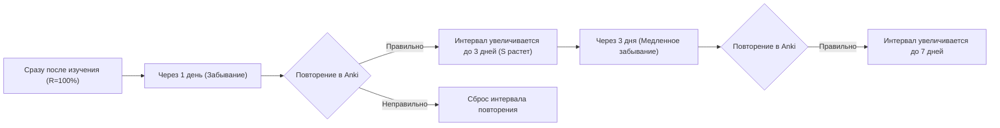
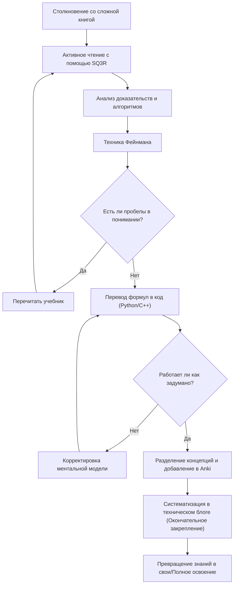

В процессе повышения квалификации в качестве инженера или исследователя мы неизбежно сталкиваемся со стеной — «сложными техническими книгами». Особенно это касается книг по математике, алгоритмам и теоретической информатике, которые по своей природе сильно отличаются от обычных вводных книг по программированию. Нагромождение формул, абстрактные концепции и огромные пробелы между строк, которые отметаются фразой «это очевидно» — многие из нас испытывали разочарование, сталкиваясь с этим.

Однако именно эти сложные знания формируют фундаментальные базовые навыки, которые не устаревают. В этой статье, основываясь на когнитивной науке и теории обучения, я подробно объясню комплексные методы (SQ3R, техника Фейнмана, интервальное повторение, кодирование, написание блога) для того, чтобы эффективно читать, закреплять в памяти и, в конечном итоге, делать своими технические книги по математике и алгоритмам.

---

## 1. Почему книги по математике и алгоритмам «не читаются»?

Для начала давайте проанализируем, почему такие книги так трудно читать. Основных причин три:

1. **Крайне высокая плотность информации (Information Density)**
   Если это обычная бизнес-книга или техническое руководство, вы можете уловить суть, даже читая по диагонали. Но в математических книгах «определение», «лемма» и «теорема» имеют значение в каждом слове, и если вы пропустите хотя бы один символ, вся логика рухнет.
2. **Широкие пробелы между строк (Missing Intermediate Steps)**
   Авторы часто опускают промежуточные вычисления в доказательствах из-за ограниченности места на странице или исходя из предположения, что «читатель сам сможет выполнить такие преобразования формул». Если вы не проделаете работу по самостоятельному заполнению этих пробелов (чтение между строк), ваше понимание не продвинется ни на шаг.
3. **Высокий уровень абстракции (High Level of Abstraction)**
   Поскольку речь идет об $n$-мерных пространствах и произвольных графах $G=(V, E)$ без конкретных примеров, построение визуальной и конкретной ментальной модели в мозгу требует огромной когнитивной нагрузки.

Чтобы преодолеть эти трудности, необходимо в корне изменить свой стиль чтения — перейти от «пассивного чтения» (простого пробегания глазами по тексту) к «активному чтению» (реконструкции знаний с когнитивной нагрузкой на мозг).

---

## 2. Методы активного чтения: SQ3R и техника Фейнмана

### 2.1 Метод SQ3R для математических книг

SQ3R — это метод чтения, предложенный американским педагогическим психологом Фрэнсисом П. Робинсоном. Мы адаптируем его специально для книг по математике и алгоритмам.

- **Survey (Обзор)**: Сначала пролистайте всю главу, чтобы понять, «какие там есть теоремы» и «что в итоге мы пытаемся доказать». Сначала посмотрите на лес, а потом на деревья.
- **Question (Вопрос)**: Прочитав утверждение теоремы, спросите себя: «Почему необходимо это условие?» или «Что было бы, если бы этого ограничения не было?».
- **Read (Внимательное чтение)**: Начните читать доказательство. Здесь ручка и тетрадь обязательны. Воспроизводите пропущенные преобразования формул своими руками.
- **Recite (Пересказ / Формулирование)**: Закройте книгу и попытайтесь своими словами объяснить теорему или механизм работы алгоритма, который вы только что прочитали.
- **Review (Повторение)**: Используйте интервальное повторение (Spaced Repetition), о котором пойдет речь позже, чтобы закрепить изученный материал в долговременной памяти.

### 2.2 Техника Фейнмана

Этот метод обучения, названный в честь физика Ричарда Фейнмана, основан на принципе: «Если вы не можете объяснить что-то просто, значит, вы этого не понимаете».

1. Напишите концепцию, которую хотите изучить, в самом верху листа.
2. Запишите эту концепцию простым языком, как если бы вы объясняли её «восьмикласснику (или резиновой уточке)».
3. Те места, где вы застряли или начали использовать профессиональный жаргон — это пробелы в вашем понимании.
4. Вернитесь к учебнику и повторите этот материал.

Считать, что вы все поняли, просто посмотрев на список формул, очень опасно. Только когда вы сможете объяснить естественным языком «физическую интуицию» или «поведение алгоритма», стоящие за формулами, это можно назвать истинным пониманием.

---

## 3. Борьба с кривой забывания: Система интервального повторения (SRS) и Anki

Человеческая память экспоненциально угасает со временем. Это явление известно как **кривая забывания Эббингауза**, а коэффициент удержания памяти $R$ можно смоделировать как решение следующего дифференциального уравнения:

$$ R = e^{-\frac{t}{S}} $$

Здесь $t$ — прошедшее время, а $S$ — сила памяти (Strength of memory). С каждым повторением $S$ увеличивается, и скорость забывания замедляется.

Программное обеспечение, оптимизирующее это свойство — это системы интервального повторения (Spaced Repetition System: SRS), такие как **Anki**.



### 3.1 Как создавать карточки Anki для математики и алгоритмов

При заучивании технических книг «зазубривание длинных доказательств целиком» бессмысленно. Разбивайте знания на минимальные (атомарные) единицы для создания карточек.

- **Плохая карточка**: «Напиши всё доказательство алгоритма Дейкстры».
- **Хорошая карточка**: «При каком условии кратчайшее расстояние до определенной вершины считается окончательным в алгоритме Дейкстры?» → «Когда среди множества неподтвержденных вершин выбирается та, у которой предварительное расстояние минимально».
- **Хорошая карточка**: «Напиши формулу Малой теоремы Ферма» → «Для простого числа $p$ и целого числа $a$, взаимно простого с $p$, $a^{p-1} \equiv 1 \pmod p$».

При запоминании формул также эффективно использовать формат LaTeX в Anki и карточки с пропусками (Cloze Deletion).

---

## 4. Лучший тест на понимание: «Кодирование» формул

Самый мощный способ проверить, действительно ли вы поняли математику или алгоритм — **«перевести формулы или доказательства в реально работающую программу (на Python, C++ и т. д.)»**.

В мире математики, если доказано, что что-то «существует», на этом всё заканчивается. Но чтобы написать код, вам нужно копнуть глубже: «А как именно вычислить конкретные значения?», что повышает разрешение вашего понимания до предела.

Здесь мы рассмотрим процесс преобразования формул в код на двух конкретных примерах.

### 4.1 Пример 1: Математика шифрования RSA и реализация на Python

Алгоритм RSA — типичный пример криптографии с открытым ключом, является прекрасным применением элементарной теории чисел (модулярная арифметика, теорема Эйлера, расширенный алгоритм Евклида).

#### Математическая основа
Процесс генерации ключей, шифрования и расшифровки в RSA описывается следующими формулами.

1. **Генерация ключей**:
   Выбираются два огромных простых числа $p, q$, и вычисляется $n = pq$.
   Вычисляется функция Эйлера $\phi(n) = (p-1)(q-1)$.
   Выбирается открытый ключ $e$, взаимно простой с $\phi(n)$.
   Находится закрытый ключ $d$, такой что $e \cdot d \equiv 1 \pmod{\phi(n)}$.

2. **Шифрование**:
   Для открытого текста $m$ шифротекст $c$ вычисляется так:
   $$ c \equiv m^e \pmod n $$

3. **Расшифровка**:
   Открытый текст $m$ восстанавливается из шифротекста $c$ так:
   $$ m \equiv c^d \pmod n $$

За правильной работой расшифровки стоит теорема Эйлера: $a^{\phi(n)} \equiv 1 \pmod n$. В математической книге доказательство этого может занять несколько страниц, но давайте реализуем это на Python.

#### Реализация на Python

```python
import random
from math import gcd

# Расширенный алгоритм Евклида
# Возвращает (x, y, gcd), где ax + by = gcd(a, b)
def extended_gcd(a, b):
    if a == 0:
        return (b, 0, 1)
    else:
        g, y, x = extended_gcd(b % a, a)
        return (g, x - (b // a) * y, y)

# Модулярная инверсия: нахождение x, где ax ≡ 1 (mod m)
def mod_inverse(a, m):
    g, x, y = extended_gcd(a, m)
    if g != 1:
        raise Exception('Обратного элемента по модулю не существует')
    else:
        return x % m

# Демонстрация RSA
def rsa_demo():
    # 1. Генерация простых чисел (в реальности используются очень большие числа)
    p, q = 61, 53
    n = p * q
    phi = (p - 1) * (q - 1)

    # 2. Выбор открытого ключа e
    e = 17
    assert gcd(e, phi) == 1

    # 3. Вычисление закрытого ключа d
    d = mod_inverse(e, phi)

    print(f"Открытый ключ: (e={e}, n={n})")
    print(f"Закрытый ключ: (d={d}, n={n})")

    # Шифрование
    m = 65  # Открытый текст
    c = pow(m, e, n)  # c = m^e mod n
    print(f"Открытый текст: {m} -> Зашифровано: {c}")

    # Расшифровка
    decrypted_m = pow(c, d, n)  # m = c^d mod n
    print(f"Расшифровано: {decrypted_m}")

rsa_demo()
```

Чтобы найти $d$, удовлетворяющее уравнению $e \cdot d \equiv 1 \pmod{\phi(n)}$, нужно реализовать расширенный алгоритм Евклида. Таким образом, **при попытке закодировать формулу вы сталкиваетесь с проблемой реализации: «А как конкретно вычислить эту переменную?», и в процессе её решения ваше понимание математики кардинально углубляется**.

### 4.2 Пример 2: Алгоритм Дейкстры и релаксация (Relaxation)

Рассмотрим алгоритм Дейкстры для решения задачи поиска кратчайших путей от одной вершины (SSSP) в теории графов.

Математическим и алгоритмическим ядром является операция, называемая «релаксацией» (Relaxation).
Если существует ребро от вершины $u$ к вершине $v$ с весом $w(u, v)$, то предварительное кратчайшее расстояние $d[v]$ до вершины $v$ обновляется по формуле:

$$ d[v] \leftarrow \min(d[v], d[u] + w(u, v)) $$

Мы реализуем эту математическую операцию как эффективный алгоритм, используя `std::priority_queue` в C++.

```cpp
#include <iostream>
#include <vector>
#include <queue>

using namespace std;

const int INF = 1e9;

// Структура, представляющая ребро
struct Edge {
    int to;
    int weight;
};

void dijkstra(int start, const vector<vector<Edge>>& graph) {
    int n = graph.size();
    vector<int> dist(n, INF);
    // Пара {расстояние, вершина}. Позволяет извлекать элемент с наименьшим расстоянием
    priority_queue<pair<int, int>, vector<pair<int, int>>, greater<pair<int, int>>> pq;

    dist[start] = 0;
    pq.push({0, start});

    while (!pq.empty()) {
        auto [current_dist, u] = pq.top();
        pq.pop();

        // Если уже найден более короткий путь, пропускаем
        if (current_dist > dist[u]) continue;

        // Выполнение релаксации (Relaxation)
        for (const auto& edge : graph[u]) {
            int v = edge.to;
            int weight = edge.weight;

            // Если d[v] > d[u] + w(u, v), то обновляем
            if (dist[v] > dist[u] + weight) {
                dist[v] = dist[u] + weight;
                pq.push({dist[v], v});
            }
        }
    }

    for (int i = 0; i < n; ++i) {
        cout << "Кратчайшее расстояние до вершины " << i << ": " << dist[i] << "\n";
    }
}
```

Видно, что математическое определение $d[v] \leftarrow \min(\dots)$ прекрасно отображается на условное ветвление `if (dist[v] > dist[u] + weight)` и процесс обновления в коде.

---

## 5. Когнитивный процесс и общая картина обучения

Используя диаграмму Mermaid, давайте обобщим, как описанные до сих пор методы взаимодействуют, формируя знания в нашем мозгу.



## 6. Окончательное закрепление: Систематический вывод в виде технического блога

Последний этап обучения — **«написание технического блога для широкой аудитории»**.

Если Anki — это инструмент для поддержания «точек» знаний, то написание блога — это процесс соединения этих точек в «линии» и «поверхности».

При написании блога происходят следующие процессы:
1. **Определение читателя**: Представьте «самого себя в прошлом, который ничего не понимал» в качестве читателя и опишите словами, где вы споткнулись и как размышляли, чтобы прорваться через это.
2. **Создание схем и диаграмм**: Используйте Mermaid или графические редакторы для визуализации абстрактных структур данных и переходов состояний. Это также углубит ваше собственное визуальное понимание.
3. **Обеспечение точности**: Поскольку пост будет опубликован для всего мира, вы начнете задавать себе вопросы вроде: «А действительно ли правильно развернута эта формула?» или «Не вызовет ли такое выражение недопонимание?», и начнете перепроверять факты. Этот процесс безжалостно раскрывает слабо понятые моменты (Micro-misunderstandings) и заставляет их исправить.

### 6.1 Инструменты, которые следует использовать при написании блога
- **Markdown / LaTeX**: Необходимы для красивой записи математических формул.
- **Mermaid.js**: Позволяет описывать диаграммы состояний и блок-схемы с помощью кода, что отлично подходит для поддержки в будущем.
- **GitHub / Gist**: Поделитесь фрагментами кода реализованных алгоритмов, чтобы читатели могли запустить и проверить их на практике.

## 7. Заключение: Вид после преодоления трудностей

Чтение книг по математике и специализированных книг по алгоритмам — отнюдь не легкий путь. Однако, применяя SQ3R для понимания структуры, технику Фейнмана для вербализации, перевод в код для проверки работы, Anki для предотвращения забывания, и, наконец, транслируя знания миру через технический блог, вы пройдете через цикл, который гарантированно превратит эти сложные знания в вашу «силу».

Знания о поверхностном использовании API и фреймворков устаревают через несколько лет, но математическое мышление и основы алгоритмов — это актив на всю жизнь. В следующий раз, когда вы откроете сложную техническую книгу, обязательно используйте методы из этой статьи, чтобы погрузиться в пучину знаний.
