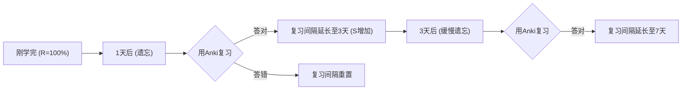
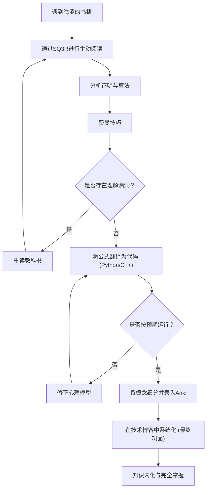

在作为工程师或研究人员提升技能的过程中，我们必然会遇到“晦涩的技术书”这堵墙。尤其是关于数学、算法和理论计算机科学的书籍，它们与一般的编程入门书具有完全不同的性质。面对一连串的公式、抽象的概念以及经常被一句“显而易见”带过的巨大字里行间的跳跃，许多人可能都经历过挫败。

然而，正是这些晦涩的知识，构成了不易过时的本质性“基础能力”。本文将基于认知科学和学习理论，详细讲解一套综合方法（SQ3R、费曼技巧、间隔重复、代码化、撰写博客），帮助你高效地阅读数学和算法的技术书籍、将其巩固在脑海中，并最终内化为自己的血肉。

---

## 1. 为什么数学与算法的技术书“读不懂”？

首先，让我们分析一下为什么阅读这些书籍会如此困难。主要因素有以下三个：

1. **信息密度（Information Density）极高**
   如果是一般的商业书或技术书，即使跳读也能掌握大意。但在数学书中，“定义”、“引理”和“定理”字字珠玑，仅仅漏看一个符号就可能导致整体逻辑的崩塌。
2. **字里行间的跳跃（Missing Intermediate Steps）**
   由于篇幅限制，或者基于“读者应该有能力自行推导这种程度的公式变形”的假设，作者经常会省略证明的中间计算过程。如果不自己动手填补这些“字里行间”（填补空白的阅读），理解将寸步难行。
3. **抽象度高（High Level of Abstraction）**
   由于内容往往是在没有具体例子的情况下讨论 $n$ 维空间或任意图 $G=(V, E)$，在脑海中构建可视化、具体的心理模型需要耗费巨大的认知负荷。

为了克服这些困难，必须从根本上改变阅读方式，从“被动阅读（仅仅跟着文字走）”转变为“主动阅读（在给大脑施加负荷的同时重构知识）”。

---

## 2. 主动阅读法：SQ3R与费曼技巧

### 2.1 针对数学书的 SQ3R 方法

SQ3R 是由美国教育心理学家 Francis P. Robinson 提出的一种阅读法。我们将它专门应用于数学和算法书籍中。

- **概览（Survey）**: 首先快速翻阅整章，把握“有哪些定理”、“最终要证明什么”。先见森林，再见树木。
- **提问（Question）**: 在阅读定理的主张时，问自己“为什么需要这个条件？”、“如果没有这个限制会怎样？”
- **精读（Read）**: 实际阅读证明过程。在这里，笔和笔记本是必不可少的。用自己的手重现被省略的公式变形。
- **背诵/输出（Recite）**: 合上书本，试着用自己的语言解释刚读过的定理或算法的原理。
- **复习（Review）**: 使用后文提到的间隔重复（Spaced Repetition），将学到的内容巩固到长期记忆中。

### 2.2 费曼技巧

这种以物理学家理查德·费曼命名的学习法，基于一个原则：“如果你不能简单地解释它，说明你还没有真正理解它。”

1. 将想学的概念写在纸的最上方。
2. 就像教“初二学生（或者橡皮鸭）”一样，用通俗易懂的语言把这个概念写下来。
3. 卡壳或忍不住使用专业术语的地方，就是“理解的漏洞”。
4. 回到教科书，复习那部分内容。

只凭看懂一堆公式就觉得自己懂了，是非常危险的。只有当你能用自然语言解释公式所代表的“物理直觉”或“算法行为”时，才能称之为真正的理解。

---

## 3. 对抗遗忘曲线：间隔重复系统 (SRS) 与 Anki

人类的记忆会随着时间呈指数级衰减。这种现象被称为**艾宾浩斯遗忘曲线**，记忆保持率 $R$ 可以被建模为以下微分方程的解：

$$ R = e^{-\frac{t}{S}} $$

其中，$t$ 是经过的时间，$S$ 是记忆强度（Strength of memory）。随着不断复习，$S$ 会变大，遗忘的速度也会减缓。

将这种性质通过软件进行优化的，就是 **Anki** 等间隔重复系统（Spaced Repetition System: SRS）。



### 3.1 数学与算法中 Anki 卡片的制作方法

在记忆技术书时，“死记硬背长篇证明”是毫无意义的。应该将知识分割成最小单元（Atomic）制成卡片。

- **糟糕的卡片**: “写下 Dijkstra 算法的全部证明”
- **优秀的卡片**: “在 Dijkstra 算法中，可以认为某个顶点的最短距离已经确定的条件是什么？”→“在未确定的顶点集合中，选择当前暂定距离最小的顶点时。”
- **优秀的卡片**: “写出费马小定理的公式”→“对于素数 $p$ 和互素的整数 $a$， $a^{p-1} \equiv 1 \pmod p$”

在记忆公式时，以 LaTeX 格式录入 Anki，并活用填空题（Cloze Deletion）会非常有效。

---

## 4. 最强的理解度测试：将公式“代码化”

验证是否真正理解数学或算法的最强大方法，是**“将公式和证明翻译成实际可运行的程序（如 Python 或 C++）”**。

在数学世界中，只要证明了“存在”就结束了，但为了代码化，必须深入到“如何计算出具体的值”，这会将理解的分辨率提升到极限。

下面我们将通过两个具体的例子，来看看将公式转化为代码的过程。

### 4.1 实例1：RSA加密的数学与 Python 实现

作为公钥密码学代表的 RSA 加密，是初等数论（同余式、欧拉定理、扩展欧几里得算法）的绝美应用。

#### 数学背景
RSA 加密的密钥生成以及加解密过程可以用以下公式表示：

1. **密钥生成**:
   选取巨大的素数 $p, q$，令 $n = pq$。
   计算欧拉函数 $\phi(n) = (p-1)(q-1)$。
   选取与 $\phi(n)$ 互素的公钥 $e$。
   求出满足 $e \cdot d \equiv 1 \pmod{\phi(n)}$ 的私钥 $d$。

2. **加密**:
   对于明文 $m$，按照如下方式计算密文 $c$。
   $$ c \equiv m^e \pmod n $$

3. **解密**:
   从密文 $c$ 按照如下方式还原出明文 $m$。
   $$ m \equiv c^d \pmod n $$

这种解密能够正确运作的背后，是欧拉定理 $a^{\phi(n)} \equiv 1 \pmod n$。在数学书中会有连续几页的证明，但让我们试着用 Python 来实现它。

#### Python 实现

```python
import random
from math import gcd

# 扩展欧几里得算法
# 返回满足 ax + by = gcd(a, b) 的 (x, y, gcd)
def extended_gcd(a, b):
    if a == 0:
        return (b, 0, 1)
    else:
        g, y, x = extended_gcd(b % a, a)
        return (g, x - (b // a) * y, y)

# 模逆元: 求满足 ax ≡ 1 (mod m) 的 x
def mod_inverse(a, m):
    g, x, y = extended_gcd(a, m)
    if g != 1:
        raise Exception('模逆元不存在')
    else:
        return x % m

# RSA 演示
def rsa_demo():
    # 1. 素数生成 (实际应用中会使用非常巨大的素数)
    p, q = 61, 53
    n = p * q
    phi = (p - 1) * (q - 1)

    # 2. 选择公钥 e
    e = 17
    assert gcd(e, phi) == 1

    # 3. 计算私钥 d
    d = mod_inverse(e, phi)

    print(f"公钥: (e={e}, n={n})")
    print(f"私钥: (d={d}, n={n})")

    # 加密
    m = 65  # 明文
    c = pow(m, e, n)  # c = m^e mod n
    print(f"明文: {m} -> 加密后: {c}")

    # 解密
    decrypted_m = pow(c, d, n)  # m = c^d mod n
    print(f"解密后: {decrypted_m}")

rsa_demo()
```

为了找到满足公式 $e \cdot d \equiv 1 \pmod{\phi(n)}$ 的 $d$，我们需要实现名为扩展欧几里得算法的算法。像这样，**当尝试将公式代码化时，我们会面临“这个变量具体该如何计算？”的实现难题，而在解决这些难题的过程中，数学理解会得到飞跃性的加深。**

### 4.2 实例2：Dijkstra 算法与松弛（Relaxation）

考虑图论中用于解决单源最短路径问题（SSSP）的 Dijkstra 算法。

其数学和算法的核心是称为“松弛（Relaxation）”的操作。
当存在一条从顶点 $u$ 到顶点 $v$ 权重为 $w(u, v)$ 的边时，用以下公式更新到达顶点 $v$ 的暂定最短距离 $d[v]$。

$$ d[v] \leftarrow \min(d[v], d[u] + w(u, v)) $$

我们将这个数学上的操作，使用 C++ 的 `std::priority_queue` 实现为高效的算法。

```cpp
#include <iostream>
#include <vector>
#include <queue>

using namespace std;

const int INF = 1e9;

// 表示边的结构体
struct Edge {
    int to;
    int weight;
};

void dijkstra(int start, const vector<vector<Edge>>& graph) {
    int n = graph.size();
    vector<int> dist(n, INF);
    // {距离, 顶点} 的数对。使距离最小的元素能被优先取出
    priority_queue<pair<int, int>, vector<pair<int, int>>, greater<pair<int, int>>> pq;

    dist[start] = 0;
    pq.push({0, start});

    while (!pq.empty()) {
        auto [current_dist, u] = pq.top();
        pq.pop();

        // 如果已经找到更短的路径则跳过
        if (current_dist > dist[u]) continue;

        // 执行松弛 (Relaxation)
        for (const auto& edge : graph[u]) {
            int v = edge.to;
            int weight = edge.weight;

            // 如果 d[v] > d[u] + w(u, v) 则更新
            if (dist[v] > dist[u] + weight) {
                dist[v] = dist[u] + weight;
                pq.push({dist[v], v});
            }
        }
    }

    for (int i = 0; i < n; ++i) {
        cout << "到达顶点 " << i << " 的最短距离: " << dist[i] << "\n";
    }
}
```

可以看出，数学定义 $d[v] \leftarrow \min(\dots)$ 完美地映射到了代码中 `if (dist[v] > dist[u] + weight)` 的条件分支与更新处理上。

---

## 5. 认知过程与学习全貌

在此，我们将使用 Mermaid 图表，整理到目前为止讲解的方法是如何协同工作，在我们的脑海中构建知识的。



## 6. 终极巩固：作为技术博客的系统性输出

学习的最终阶段是**“面向大众撰写技术博客”**。

如果说 Anki 是维持知识“点”的工具，那么写博客就是将这些点连接成“线”和“面”的工作。

在写博客时，会发生以下过程：
1. **设定读者**: 将“过去那个看不懂的自己”设想为读者，用语言表达出是在哪里卡壳的，以及如何思考才能突破。
2. **制作图解**: 使用 Mermaid 或绘图工具，将抽象的数据结构和状态转移可视化。这也能加深自己视觉上的理解。
3. **确保准确性**: 因为要向全世界公开，所以会不断自问自答并进行查证：“这个公式推导真的正确吗？”、“这种表述会引起误解吗？”。这个过程会毫不留情地暴露出理解肤浅的地方（Micro-misunderstandings），并强制进行修复。

### 6.1 写博客时应使用的工具
- **Markdown / LaTeX**: 完美排版数学公式的必备工具。
- **Mermaid.js**: 能够以代码形式编写状态转移图和流程图，极具维护性。
- **GitHub / Gist**: 分享所实现算法的代码片段，以便读者能够实际运行并验证。

## 7. 结论：跨越艰辛后的风景

阅读数学书或算法专业书绝对不是一条轻松的道路。但是，通过 SQ3R 掌握结构，用费曼技巧将其语言化，落实到代码中验证运行，用 Anki 防止遗忘，最后通过技术博客向世界发布——通过转动这一系列的循环，那些晦涩的知识一定会切实地转化为你的“力量”。

表面上的 API 用法和框架知识几年内就会过时，但数学思维能力和算法基础是一生的财富。下次翻开晦涩的技术书时，请务必活用本文的方法，跃入知识的深渊中去探索一番吧。
