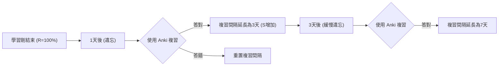
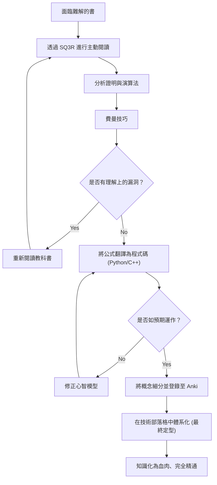

作為工程師或研究人員在提升技能的過程中，我們一定會遇到「難解的技術書」這道高牆。尤其是關於數學、演算法或理論計算機科學的書籍，與一般的程式設計入門書有著完全不同的性質。面對滿篇的數學公式、抽象的概念，以及被一句「顯而易見」輕輕帶過的字裡行間的巨大跳躍，經歷過挫折的人肯定不在少數。

然而，正是這些難解的知識，才能構成不易過時的本質性「基礎能力」。本文將基於認知科學與學習理論，詳細解說如何高效閱讀數學與演算法的技術書籍，使其在腦海中定型，並最終化為自己血肉的綜合方法（SQ3R、費曼技巧、間隔重複、程式碼化、撰寫部落格）。

---

## 1. 為什麼數學與演算法的技術書會「讀不懂」？

首先，讓我們來分析為什麼這類書籍會如此難懂。主要因素有以下三個：

1. **資訊密度（Information Density）極高**
   如果是一般的商業書或技術書，即使是快速瀏覽也能掌握大意。但在數學書中，「定義」、「引理」、「定理」的字字句句都有其意義，只要漏看一個符號，整體的邏輯就會崩潰。
2. **字裡行間的跳躍過大（Missing Intermediate Steps）**
   作者常受限於版面，或是基於「讀者應該有能力自行完成這種程度的公式推導」的假設，頻繁省略證明的運算過程。如果不靠自己完成這些「填補字裡行間」的作業（填補空白的閱讀），理解將完全無法推進。
3. **抽象度極高（High Level of Abstraction）**
   因為經常在沒有具體範例的情況下討論 $n$ 維空間或任意圖形 $G=(V, E)$，要在腦中建立視覺化、具體的心智模型，會造成極大的認知負擔。

為了克服這些困難，我們必須從根本上改變閱讀風格，從「被動閱讀（只是用眼睛追著字句）」轉變為「主動閱讀（讓大腦承受負荷並重新建構知識）」。

---

## 2. 主動閱讀法：SQ3R 與費曼技巧

### 2.1 專為數學書設計的 SQ3R 方法

SQ3R 是美國教育心理學家 Francis P. Robinson 所提倡的閱讀法。我們將其針對數學與演算法書籍進行特化應用。

- **Survey（概覽）**：首先快速翻閱整個章節，掌握「有哪些定理」、「最終想要證明什麼」。先見林再見樹。
- **Question（提問）**：在閱讀定理的主張時，自我提問：「為什麼需要這個條件？」、「如果沒有這個限制會發生什麼事？」。
- **Read（精讀）**：實際閱讀證明過程。這裡必備紙筆，需親手重現被省略的公式推導。
- **Recite（背誦與語言化）**：闔上書本，試著用自己的話解釋剛剛讀過的定理或演算法的運作機制。
- **Review（複習）**：使用後文提到的間隔重複（Spaced Repetition），將學習到的內容鞏固為長期記憶。

### 2.2 費曼技巧

這項以物理學家理查·費曼命名的學習法，基於一個原則：「如果你無法簡單地解釋，就代表你沒有真正理解。」

1. 將想學習的概念寫在紙張的最上方。
2. 用淺顯易懂的語言寫出該概念，就像在教導「國中二年級學生（或是黃色小鴨）」一樣。
3. 遇到卡住或只能依賴專業術語逃避的地方，就是「理解上的漏洞」。
4. 回到教科書，針對該部分重新複習。

僅看著一堆數學公式就覺得自己懂了是非常危險的。只有當你能用自然語言解釋公式所代表的「物理直覺」或「演算法行為」時，才能稱作真正的理解。

---

## 3. 對抗遺忘曲線：間隔重複系統 (SRS) 與 Anki

人類的記憶會隨著時間呈指數遞減。這種現象被稱為**艾賓浩斯遺忘曲線**，記憶的保持率 $R$ 有時可以被建模為以下微分方程式的解：

$$ R = e^{-\frac{t}{S}} $$

其中，$t$ 是經過時間，$S$ 是記憶強度（Strength of memory）。隨著不斷複習，$S$ 會逐漸增大，遺忘的速度也會隨之變緩。

將這種特性透過軟體最佳化的工具，就是 **Anki** 等間隔重複系統（Spaced Repetition System: SRS）。



### 3.1 數學與演算法中 Anki 卡片的製作方法

在記憶技術書的內容時，「死記硬背長篇大論的證明」是毫無意義的。應該將知識分割為最小單位（Atomic）並製作成卡片。

- **糟糕的卡片**：「寫下 Dijkstra 演算法的完整證明」
- **好的卡片**：「在 Dijkstra 演算法中，某個頂點的最短距離被視為確定的條件是什麼？」→「在未確定的頂點集合中，選出暫定距離最小的頂點時。」
- **好的卡片**：「寫出費馬小定理的公式」→「對於質數 $p$ 以及與其互質的整數 $a$，$a^{p-1} \equiv 1 \pmod p$」

在記憶公式時，建議使用 LaTeX 格式將其登錄至 Anki，並活用填空題（Cloze Deletion）來提升效果。

---

## 4. 最強的理解度測試：將數學公式「程式碼化」

要驗證自己是否真正理解了數學或演算法，最強而有力的方法就是**「將公式與證明翻譯成能實際執行的程式（如 Python 或 C++）」**。

在數學的世界裡，只要證明「存在」便算結束，但為了將其轉為程式碼，必須進一步探討「該如何計算具體的值」，這會使理解的清晰度提升至極致。

這裡我們透過兩個具體範例，來看看將數學公式轉換為程式碼的過程。

### 4.1 範例 1：RSA 加密的數學原理與 Python 實作

作為公開金鑰加密技術代表的 RSA 加密，是初等整數論（同餘式、歐拉定理、擴展歐幾里得演算法）的完美應用。

#### 數學背景
RSA 加密的金鑰產生及加密與解密過程可由以下數學公式表示：

1. **金鑰產生**：
   選擇巨大的質數 $p, q$，令 $n = pq$。
   計算歐拉函數 $\phi(n) = (p-1)(q-1)$。
   選擇與 $\phi(n)$ 互質的公開金鑰 $e$。
   求出滿足 $e \cdot d \equiv 1 \pmod{\phi(n)}$ 的私密金鑰 $d$。

2. **加密**：
   對於明文 $m$，暗文 $c$ 的計算方式如下：
   $$ c \equiv m^e \pmod n $$

3. **解密**：
   從暗文 $c$ 還原明文 $m$ 的計算方式如下：
   $$ m \equiv c^d \pmod n $$

解密能夠正常運作的背景，在於歐拉定理 $a^{\phi(n)} \equiv 1 \pmod n$。在數學書中這需要好幾頁的證明，讓我們試著用 Python 來實作它。

#### Python 實作

```python
import random
from math import gcd

# 擴展歐幾里得演算法
# 回傳滿足 ax + by = gcd(a, b) 的 (x, y, gcd)
def extended_gcd(a, b):
    if a == 0:
        return (b, 0, 1)
    else:
        g, y, x = extended_gcd(b % a, a)
        return (g, x - (b // a) * y, y)

# 模逆元：求出滿足 ax ≡ 1 (mod m) 的 x
def mod_inverse(a, m):
    g, x, y = extended_gcd(a, m)
    if g != 1:
        raise Exception('模逆元不存在')
    else:
        return x % m

# RSA 示範
def rsa_demo():
    # 1. 質數產生 (實際上會使用非常巨大的質數)
    p, q = 61, 53
    n = p * q
    phi = (p - 1) * (q - 1)

    # 2. 選擇公開金鑰 e
    e = 17
    assert gcd(e, phi) == 1

    # 3. 計算私密金鑰 d
    d = mod_inverse(e, phi)

    print(f"公開金鑰: (e={e}, n={n})")
    print(f"私密金鑰: (d={d}, n={n})")

    # 加密
    m = 65  # 明文
    c = pow(m, e, n)  # c = m^e mod n
    print(f"明文: {m} -> 加密後: {c}")

    # 解密
    decrypted_m = pow(c, d, n)  # m = c^d mod n
    print(f"解密後: {decrypted_m}")

rsa_demo()
```

為了找到滿足公式 $e \cdot d \equiv 1 \pmod{\phi(n)}$ 的 $d$，我們必須實作稱為擴展歐幾里得演算法的演算法。像這樣，**當試圖將數學公式寫成程式碼時，就會面臨「這個變數具體該如何計算？」的實作問題，而在解決這些問題的過程中，對數學的理解將會突飛猛進**。

### 4.2 範例 2：Dijkstra 演算法與鬆弛操作（Relaxation）

讓我們思考用來解決圖論中單源最短路徑問題（SSSP）的 Dijkstra 演算法。

在數學與演算法方面的核心，是稱為「鬆弛（Relaxation）」的操作。
當存在一條從頂點 $u$ 到頂點 $v$ 且權重為 $w(u, v)$ 的邊時，我們透過以下公式更新到達頂點 $v$ 的暫定最短距離 $d[v]$：

$$ d[v] \leftarrow \min(d[v], d[u] + w(u, v)) $$

我們可以使用 C++ 的 `std::priority_queue` 將這個數學操作實作為高效的演算法。

```cpp
#include <iostream>
#include <vector>
#include <queue>

using namespace std;

const int INF = 1e9;

// 表示邊的結構
struct Edge {
    int to;
    int weight;
};

void dijkstra(int start, const vector<vector<Edge>>& graph) {
    int n = graph.size();
    vector<int> dist(n, INF);
    // {距離, 頂點} 的配對。以便能夠優先取出距離較小的元素
    priority_queue<pair<int, int>, vector<pair<int, int>>, greater<pair<int, int>>> pq;

    dist[start] = 0;
    pq.push({0, start});

    while (!pq.empty()) {
        auto [current_dist, u] = pq.top();
        pq.pop();

        // 若已經找到更短的路徑則跳過
        if (current_dist > dist[u]) continue;

        // 執行鬆弛操作 (Relaxation)
        for (const auto& edge : graph[u]) {
            int v = edge.to;
            int weight = edge.weight;

            // 若 d[v] > d[u] + w(u, v) 則更新
            if (dist[v] > dist[u] + weight) {
                dist[v] = dist[u] + weight;
                pq.push({dist[v], v});
            }
        }
    }

    for (int i = 0; i < n; ++i) {
        cout << "到達頂點 " << i << " 的最短距離: " << dist[i] << "\n";
    }
}
```

我們可以看到，數學定義 $d[v] \leftarrow \min(\dots)$ 完美對應到程式碼中的 `if (dist[v] > dist[u] + weight)` 條件判斷與更新處理上。

---

## 5. 認知過程與學習全貌

我們將使用 Mermaid 圖表，來整理前文所解說的這些方法是如何相互配合，並在我們的腦海中建構知識。



## 6. 終極的鞏固：作為技術部落格的體系化輸出

學習的最終階段，是**「向不特定多數的大眾撰寫技術部落格」**。

如果說 Anki 是用來維持知識「點」的工具，那麼寫部落格就是將這些點連接成「線」與「面」的過程。

在撰寫部落格時，會經歷以下過程：
1. **設定讀者**：將「過去無法理解的自己」設想為讀者，用文字表達自己曾經在哪裡卡住、該如何思考才能突破。
2. **製作圖解**：使用 Mermaid 或繪圖工具，將抽象的資料結構與狀態轉換視覺化。這也能加深自己視覺上的理解。
3. **確保正確性**：因為要對全世界公開，你會開始反覆自問：「這個公式推導真的正確嗎？」、「這種表達方式會不會引起誤解？」，並進行查證。這個過程會毫不留情地揭露出理解不夠透徹的部分（Micro-misunderstandings），並強迫你進行修正。

### 6.1 撰寫部落格時應使用的工具
- **Markdown / LaTeX**：這是優雅地撰寫數學公式的必備工具。
- **Mermaid.js**：可以用程式碼編寫狀態轉換圖與流程圖，具有極佳的可維護性。
- **GitHub / Gist**：分享實作演算法的程式碼片段，讓讀者能夠實際執行與驗證。

## 7. 結論：克服萬難後的風景

閱讀數學書或演算法的專業書籍，絕非一條輕鬆的路。但是，透過 SQ3R 掌握結構、用費曼技巧語言化、寫成程式碼驗證動作、用 Anki 防止遺忘，最後透過技術部落格向世界發聲，藉由運轉這一連串的循環，那些難解的知識必定會成為你的「力量」。

表面上的 API 用法或框架知識幾年後就會過時，但數學的思考能力與演算法基礎卻是一輩子的資產。下次翻開難解的技術書時，請務必活用本文的方法，勇敢躍入知識的深淵吧。
