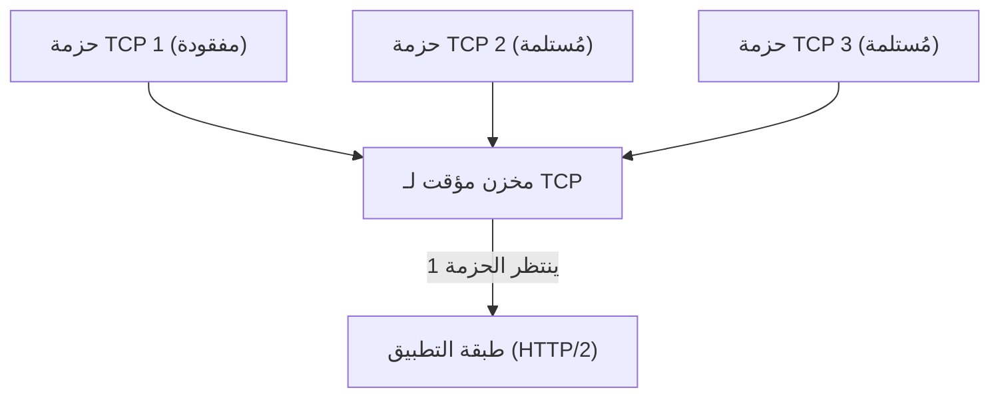
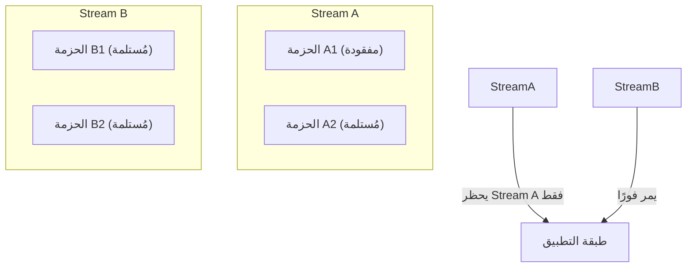
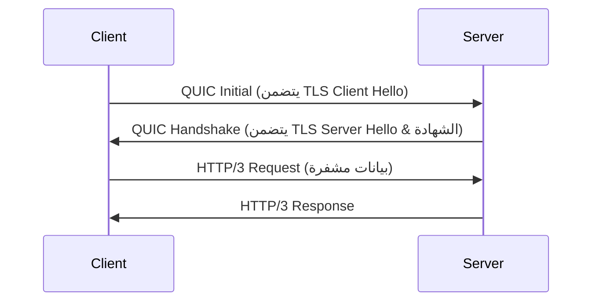
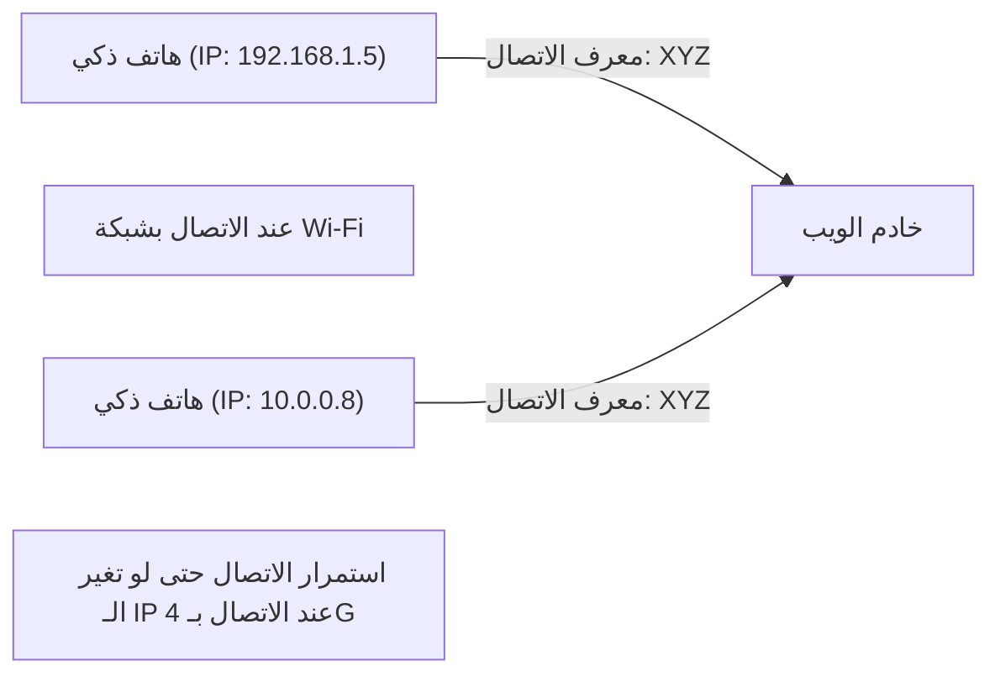

يتطور عالم الإنترنت باستمرار، لكن تطور البروتوكولات التي تدعم أساسياته يُحدث أحيانًا تغييرات كبيرة تُعرف بالنقلة النوعية (Paradigm Shift). في هذا المقال، سنتعمق في تفاصيل "HTTP/3"، المعيار الجديد لاتصالات الويب، وبروتوكول طبقة النقل الأساسي له "QUIC" (Quick UDP Internet Connections)، ونشرح الخلفية التقنية والآليات التفصيلية التي أدت إلى التخلي عن بروتوكول TCP الذي طالما استخدم لسنوات طويلة واعتماد UDP بدلاً منه.

## 1. مقدمة: تطور اتصالات الويب وحدود TCP

منذ فجر الويب في التسعينيات، كان بروتوكول TCP (Transmission Control Protocol) هو الأساس الدائم لاتصالات HTTP. يتميز TCP بآليات معقدة مثل التحكم في ترتيب الحزم، والتحكم في إعادة الإرسال، والتحكم في الازدحام (Congestion Control) لضمان "اتصال موثوق". ولكن، مع زيادة ثراء صفحات الويب والحاجة إلى تنزيل العديد من الصور والبرامج النصية في وقت واحد، بدأت قيود تصميم TCP تظهر كعنق زجاجة (Bottleneck).

### 1.1 تحديات HTTP/1.1: قيود على عدد الاتصالات المتزامنة
في HTTP/1.1، تتم معالجة طلب واستجابة واحدة بالتسلسل عبر اتصال TCP واحد (رغم وجود آلية التوجيه أو Pipelining، إلا أنها لم تنتشر على نطاق واسع). لذلك، للحصول على موارد متعددة في نفس الوقت، كان يتعين على المتصفح إنشاء اتصالات TCP متعددة مع الخادم. ولكن عدد الاتصالات التي يمكن للمتصفح إنشاؤها لنطاق (Domain) واحد عادة ما يكون محدودًا بحوالي 6 اتصالات، مما أدى إلى حدوث فترات انتظار للحصول على الموارد.

### 1.2 التحسينات عبر HTTP/2 والمشاكل الجديدة
لحل هذه المشكلة، قدم HTTP/2 مفهوم "التدفقات" (Streams)، مما سمح بتعدد الإرسال (Multiplexing) لطلبات واستجابات متعددة عبر اتصال TCP واحد. أدى ذلك إلى القضاء على عنق الزجاجة الناتج عن الحد الأقصى لعدد الاتصالات.

ومع ذلك، واجه HTTP/2 مشكلة جوهرية لأنه لا يزال يعمل فوق TCP. هذه المشكلة هي **حظر رأس الخط على مستوى TCP (Head-of-Line Blocking أو HoL Blocking)**.

يضمن TCP ترتيب الحزم بصرامة. لذلك، إذا فُقدت الحزمة 1 على الشبكة (Packet Loss)، حتى لو وصلت الحزمتان 2 و 3 إلى الخادم بالفعل، فلن يتمكن TCP من تمرير الحزمتين 2 و 3 إلى طبقة التطبيق (HTTP/2) حتى تكتمل إعادة إرسال الحزمة 1. في HTTP/2، نظرًا لأن العديد من التدفقات تشترك في اتصال TCP واحد، فإن فقدان حزمة واحدة يؤدي إلى موقف خطير حيث يتوقف اتصال التدفقات الأخرى غير ذات الصلة تمامًا.

## 2. ولادة بروتوكول QUIC: اعتماد UDP

قررت Google أن تحسين TCP لا يمكن أن يحل مشكلة HoL Blocking، لذا اتخذت نهجًا جديدًا تمامًا. وكان هذا النهج هو تطوير بروتوكول "QUIC". تخلى QUIC عن بروتوكول TCP المُدمج بعمق في مساحة النواة (Kernel Space) لنظام التشغيل والذي يصعب تغييره (Protocol Ossification)، وتم بناؤه بدلاً من ذلك على بروتوكول **UDP (User Datagram Protocol)** البسيط والمَرِن.

UDP هو بروتوكول "غير موثوق" ولا يمتلك آليات لضمان الترتيب أو إعادة الإرسال مثل TCP، ولكن QUIC قام بتنفيذ ضوابط الموثوقية الخاصة بـ TCP، بالإضافة إلى ميزات متقدمة (مثل التحكم في التدفق والتشفير) في مساحة التطبيق (User Space) فوق UDP.

### 2.1 القضاء على HoL Blocking في QUIC
الابتكار الأكبر في QUIC هو أنه يقوم بالتحكم في الترتيب وإعادة الإرسال بشكل مستقل لكل تدفق (Stream).

حتى لو فُقدت حزمة، فإن التدفق الذي تنتمي إليه هذه الحزمة فقط هو الذي ينتظر إعادة الإرسال (يُحظر)، بينما لا تتأثر التدفقات الأخرى على الإطلاق. وقد أدى ذلك إلى حل مشكلة HoL Blocking في طبقة TCP والتي كانت تمثل عائقًا في HTTP/2.

## 3. دمج التشفير وتسريع عملية المصافحة (Handshake)

مبدأ تصميمي آخر مهم في QUIC هو أنه "مُشفر افتراضيًا". في اتصالات HTTPS التقليدية، بعد إكمال مصافحة TCP (المصافحة الثلاثية أو 3-way handshake)، كان من الضروري إجراء مصافحة TLS (Transport Layer Security)، مما يتسبب في تأخير كبير (RTT: Round Trip Time) قبل بدء الاتصال.

### 3.1 المصافحة التقليدية (TCP + TLS 1.3)
1. العميل -> الخادم: TCP SYN
2. الخادم -> العميل: TCP SYN+ACK
3. العميل -> الخادم: TCP ACK & TLS Client Hello
4. الخادم -> العميل: TLS Server Hello & الشهادة
5. العميل -> الخادم: HTTP Request (أول إرسال للبيانات هنا)
الإجمالي: 2-RTT إلى 3-RTT

### 3.2 مصافحة QUIC (دمج النقل والتشفير)
يدمج QUIC آليات TLS 1.3 داخل البروتوكول نفسه. يتيح ذلك إنشاء الاتصال وتبادل مفاتيح التشفير في مصافحة واحدة.

عند الاتصال الأولي، يمكن بدء الاتصال بـ **1-RTT** فقط. علاوة على ذلك، بالنسبة للخوادم التي تم الاتصال بها سابقًا (عند الاحتفاظ بتذكرة جلسة Session Ticket وما إلى ذلك)، فإنه يحقق **0-RTT (صفر وقت ذهاب وإياب)**، حيث يتم إرسال بيانات التطبيق بدءًا من الحزمة الأولى. ويقلل هذا بشكل كبير من وقت التحميل الأولي لصفحات الويب.

## 4. "ترحيل الاتصال" لدعم بيئات الهواتف المحمولة

يعتمد استخدام الإنترنت الحديث بشكل أساسي على الأجهزة المحمولة مثل الهواتف الذكية. يتمثل أحد التحديات الخاصة ببيئات الهواتف المحمولة في "تبديل الشبكات". على سبيل المثال، عند مغادرة المنزل والانتقال من شبكة Wi-Fi إلى شبكة الهاتف المحمول (4G/5G)، سيتغير عنوان IP الخاص بالجهاز.

يحدد TCP الاتصال بمجموعة من 4 عناصر (4-tuple): "عنوان IP المصدر، منفذ المصدر، عنوان IP الوجهة، منفذ الوجهة". لذلك، عند التبديل من Wi-Fi إلى 4G وتغير عنوان IP، ينقطع اتصال TCP ويكون من الضروري إعادة المصافحة من البداية. وكان هذا سببًا في توقف تشغيل الفيديو أو انقطاع مكالمات الويب أثناء التنقل.

### 4.1 الانتقال السلس باستخدام معرف الاتصال (Connection ID)
لا يستخدم QUIC عناوين IP أو أرقام المنافذ لتحديد الاتصال، بل يستخدم **معرف اتصال مشفر (Connection ID)**.

حتى إذا تغير عنوان IP، سيستمر العميل والخادم في استخدام نفس معرف الاتصال، مما يسمح باستمرار الاتصال بسلاسة دون الحاجة إلى إعادة تأسيسه. يُسمى هذا **ترحيل الاتصال (Connection Migration)**. بفضل هذه الميزة، تتحسن تجربة المستخدم (UX) في بيئة الهواتف المحمولة بشكل كبير.

## 5. دور HTTP/3

يلعب QUIC دور طبقة النقل (كبديل لـ TCP)، وبروتوكول طبقة التطبيق الذي يعمل فوقه هو **HTTP/3**.
يحتفظ HTTP/3 بنفس الدلالات الأساسية (مثل طُرق GET و POST، والترويسات، ورموز الحالة) كما هو الحال في HTTP/2، ولكنه مُحسّن للتكيف مع حقيقة أن الأساس قد تغير إلى QUIC. على سبيل المثال، تم تغيير طريقة ضغط ترويسة HTTP من HPACK في HTTP/2 إلى **QPACK**، المُحسّن لاستقلالية التدفق في QUIC.

## 6. انتشار QUIC و HTTP/3 وآفاق المستقبل

حاليًا، تتقدم شركات التكنولوجيا الكبرى مثل Google و Cloudflare و Meta في اعتماد HTTP/3، وتدعمه المتصفحات الرئيسية (Chrome و Edge و Firefox و Safari) بشكل افتراضي.

### تحديات الاعتماد
نظرًا لأنه يعتمد على UDP، هناك حالات تقوم فيها جدران الحماية (Firewalls) وأجهزة التوجيه (Routers) القديمة في الشركات بتقييد أو عدم تحسين حزم UDP (حظر UDP)، مما يؤدي في بعض البيئات إلى التراجع (Fallback) إلى TCP (والعودة إلى HTTP/2)، وهو ما يعتبر تحديًا. أيضًا، نظرًا لأن معالجة حزم UDP تاريخيًا لم تكن مُحسّنة في نواة نظام التشغيل (مثل تفريغ الأجهزة أو Hardware Offload) بنفس قدر TCP، فهناك تحدٍ يتمثل في زيادة العبء على وحدة المعالجة المركزية (CPU) من جانب الخادم.

ومع ذلك، يتم حل هذه التحديات بسرعة من خلال تطور الأجهزة وتحسين البرامج.

## 7. الخاتمة

يُعد HTTP/3 و QUIC أحد أهم التحديثات في تاريخ الإنترنت. من خلال التحرر من قيود TCP (مثل HoL Blocking والمصافحة المفرطة) وإعادة بناء طبقة نقل حديثة وآمنة فوق UDP، أصبح من الممكن تحقيق "ويب سريع ومستمر وآمن" بالمعنى الحقيقي للكلمة.

بصفتك مطورًا، بمجرد نقل بنيتك التحتية إلى شبكة توصيل محتوى (CDN) تدعم HTTP/3 (مثل Cloudflare أو AWS CloudFront)، يمكنك تقديم معظم هذه الفوائد للمستخدمين النهائيين. في السعي لتحسين أداء الويب، سيكون الفهم الصحيح لنموذج HTTP/3 واستخدامه أمرًا لا غنى عنه في المستقبل.
