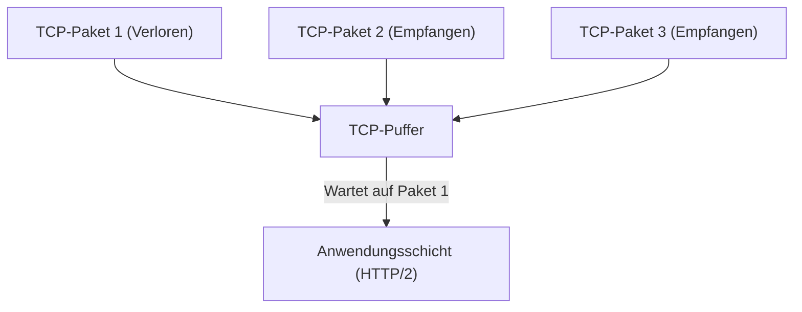
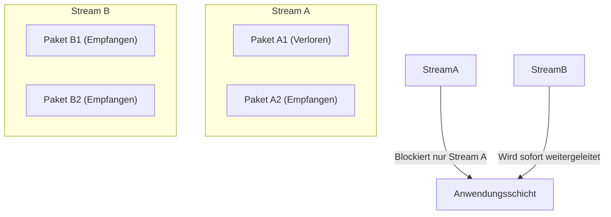
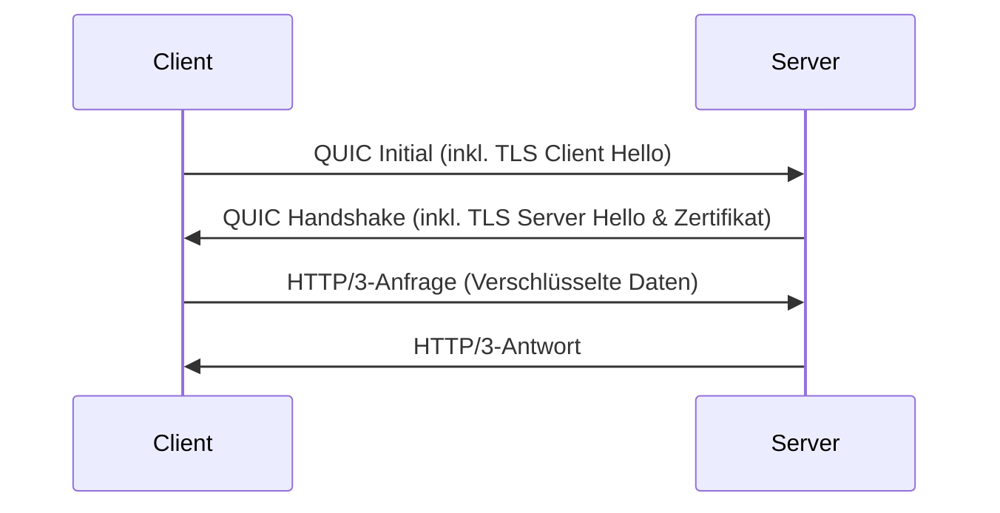
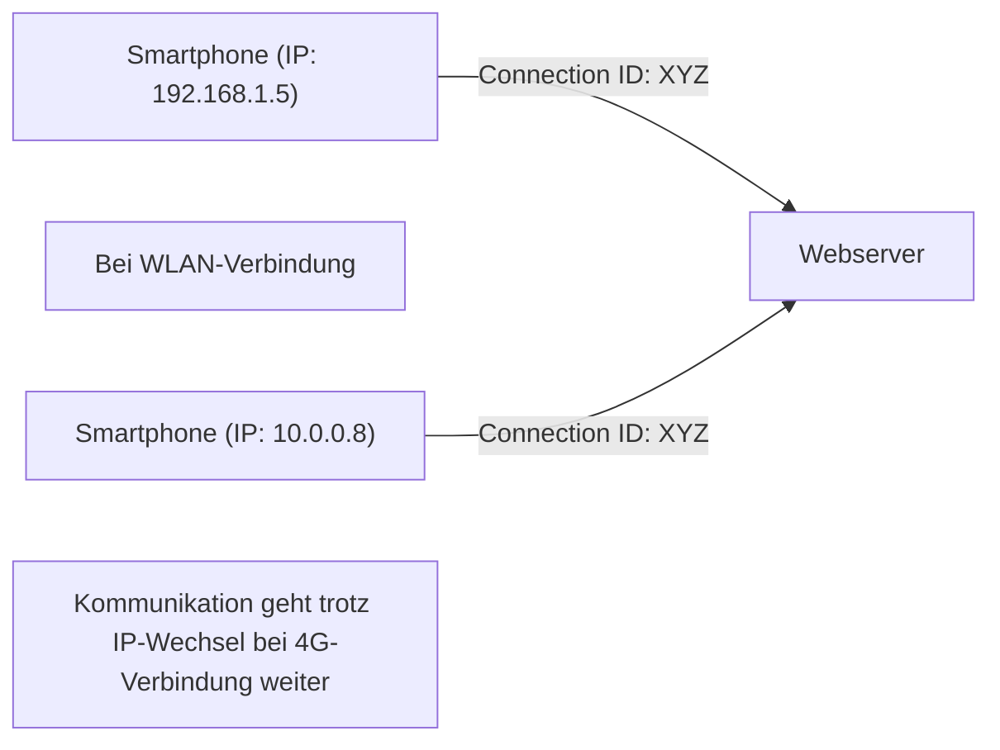

Die Welt des Internets entwickelt sich ständig weiter, aber die Evolution der zugrunde liegenden Protokolle bringt manchmal so tiefgreifende Veränderungen mit sich, dass man von einem Paradigmenwechsel sprechen kann. In diesem Artikel werden wir 'HTTP/3', den neuen Standard für Webkommunikation, und dessen zugrunde liegendes Transportschichtprotokoll 'QUIC (Quick UDP Internet Connections)' genauer beleuchten. Wir werden den technischen Hintergrund und die detaillierten Mechanismen untersuchen und erklären, warum das seit langem etablierte TCP zugunsten von UDP aufgegeben wurde.

## 1. Einführung: Die Evolution der Webkommunikation und die Grenzen von TCP

Seit den Anfängen des Webs in den 1990er Jahren war TCP (Transmission Control Protocol) stets die Grundlage der HTTP-Kommunikation. Um eine 'zuverlässige Kommunikation' zu gewährleisten, verfügt TCP über komplexe Mechanismen wie Paketreihenfolgenkontrolle, Neuübertragungssteuerung und Überlastungskontrolle. Als Webseiten jedoch immer aufwendiger wurden und viele Bilder und Skripte gleichzeitig heruntergeladen werden mussten, traten die Designgrenzen von TCP zunehmend als Flaschenhals in Erscheinung.

### 1.1 Herausforderungen von HTTP/1.1: Begrenzung der gleichzeitigen Verbindungen

In HTTP/1.1 wird auf einer einzelnen TCP-Verbindung jeweils eine Anfrage und eine Antwort nacheinander verarbeitet (es gab zwar einen Pipelining-Mechanismus, der sich jedoch nicht durchgesetzt hat). Um mehrere Ressourcen gleichzeitig abzurufen, musste der Browser daher mehrere TCP-Verbindungen zum Server herstellen. Allerdings ist die Anzahl der Verbindungen, die ein Browser zu derselben Domain aufbauen kann, in der Regel auf etwa sechs beschränkt, was zu Wartezeiten beim Abrufen der Ressourcen führte.

### 1.2 Verbesserungen durch HTTP/2 und neue Probleme

Um dieses Problem zu lösen, führte HTTP/2 das Konzept der 'Streams' ein, wodurch mehrere Anfragen und Antworten über eine einzige TCP-Verbindung gemultiplext (Multiplexing) werden konnten. Dadurch wurde der durch die Verbindungsbeschränkung verursachte Flaschenhals beseitigt.

Da HTTP/2 jedoch immer noch auf TCP basierte, stieß es auf ein grundlegendes Problem: das **Head-of-Line Blocking (HoL Blocking) auf TCP-Ebene**.

TCP garantiert strikt die Reihenfolge der Pakete. Wenn also Paket 1 im Netzwerk verloren geht (Paketverlust), kann TCP die Pakete 2 und 3 nicht an die Anwendungsschicht (HTTP/2) weitergeben, selbst wenn sie den Server bereits erreicht haben, bis die erneute Übertragung von Paket 1 abgeschlossen ist. Da bei HTTP/2 mehrere Streams eine einzige TCP-Verbindung nutzen, führte der Verlust eines einzigen Pakets zu der schwerwiegenden Situation, dass die Kommunikation völlig unabhängiger Streams blockiert wurde.

## 2. Die Geburtsstunde des QUIC-Protokolls: Die Einführung von UDP

Google kam zu dem Schluss, dass dieses HoL-Blocking durch Modifikationen an TCP nicht behoben werden konnte, und wählte einen völlig neuen Ansatz: die Entwicklung des 'QUIC'-Protokolls. Bei QUIC wurde auf TCP verzichtet, da dieses tief in den Kernel-Space des Betriebssystems integriert und nur schwer veränderbar ist (Protokoll-Ossifizierung). Stattdessen basiert QUIC auf dem einfacheren und weitaus flexibleren **UDP (User Datagram Protocol)**.

Obwohl UDP ein 'unzuverlässiges' Protokoll ohne Mechanismen zur Reihenfolgegarantie und Neuübertragungssteuerung wie bei TCP ist, implementiert QUIC auf Basis von UDP die Zuverlässigkeitssteuerung von TCP sowie noch fortschrittlichere Funktionen (Stream-Steuerung, Verschlüsselung usw.) im Anwendungsraum (User-Space).

### 2.1 Lösung des HoL-Blockings bei QUIC

Die größte Innovation von QUIC besteht darin, dass die Reihenfolgenkontrolle und die Neuübertragungssteuerung für jeden Stream unabhängig durchgeführt werden.

Selbst wenn ein Paket verloren geht, wird nur der Stream blockiert (Warten auf Neuübertragung), zu dem das Paket gehört. Andere Streams bleiben davon völlig unberührt. Dadurch wurde das bei HTTP/2 aufgetretene HoL-Blocking auf TCP-Ebene vollständig behoben.

## 3. Integration von Verschlüsselung und Beschleunigung des Handshakes

Ein weiteres wichtiges Designprinzip von QUIC ist, dass es 'standardmäßig verschlüsselt' ist. Bei herkömmlicher HTTPS-Kommunikation musste nach dem TCP-Handshake (Drei-Wege-Handshake) ein TLS-Handshake (Transport Layer Security) durchgeführt werden, was zu einer erheblichen Verzögerung (RTT: Round Trip Time) bis zum Beginn der Kommunikation führte.

### 3.1 Herkömmlicher Handshake (TCP + TLS 1.3)

1. Client -> Server: TCP SYN
2. Server -> Client: TCP SYN+ACK
3. Client -> Server: TCP ACK & TLS Client Hello
4. Server -> Client: TLS Server Hello & Zertifikat
5. Client -> Server: HTTP-Anfrage (Hier erfolgt die erste Datenübertragung)
Insgesamt: 2-RTT bis 3-RTT

### 3.2 QUIC-Handshake (Integration von Transport und Verschlüsselung)

QUIC integriert die Mechanismen von TLS 1.3 in das Protokoll. Dadurch können der Verbindungsaufbau und der Austausch der Verschlüsselungsschlüssel in einem einzigen Handshake durchgeführt werden.

Bei der ersten Verbindung kann die Kommunikation nach nur **1-RTT** gestartet werden. Darüber hinaus ermöglicht QUIC für Server, mit denen zuvor bereits eine Verbindung hergestellt wurde (z. B. wenn Session-Tickets vorhanden sind), **0-RTT (Zero-Round Trip Time)**. Dabei können bereits beim Senden des ersten Pakets Anwendungsdaten mitgeschickt werden. Dadurch wird die anfängliche Ladezeit von Webseiten drastisch verkürzt.

## 4. 'Connection Migration' als Stütze für mobile Umgebungen

Die heutige Internetnutzung findet hauptsächlich über mobile Endgeräte wie Smartphones statt. Eine typische Herausforderung in mobilen Umgebungen ist der 'Netzwerkwechsel'. Wenn man beispielsweise von zu Hause das heimische WLAN verlässt und in ein Mobilfunknetz (4G/5G) wechselt, ändert sich die IP-Adresse des Geräts.

TCP identifiziert eine Verbindung anhand einer Kombination aus vier Werten (4-Tupel): 'Quell-IP, Quell-Port, Ziel-IP, Ziel-Port'. Wechselte man also vom WLAN ins 4G-Netz und änderte sich somit die IP-Adresse, brach die TCP-Verbindung ab und der Handshake musste komplett neu durchgeführt werden. Dies war oft die Ursache für das Unterbrechen von Videostreams oder Web-Telefonaten während der Fahrt.

### 4.1 Nahtloser Übergang durch Connection-ID

Zur Identifizierung einer Verbindung verwendet QUIC weder IP-Adressen noch Portnummern, sondern eine verschlüsselte **Connection-ID**.

Selbst wenn sich die IP-Adresse ändert, nutzen Client und Server weiterhin dieselbe Connection-ID, was eine nahtlose Fortsetzung der Kommunikation ohne Neuaufbau der Verbindung ermöglicht. Dies wird als **Connection Migration** bezeichnet. Durch diese Funktion wird die Nutzererfahrung (UX) in mobilen Umgebungen drastisch verbessert.

## 5. Die Rolle von HTTP/3

QUIC übernimmt die Funktion der Transportschicht (als TCP-Alternative), und das darauf aufbauende Anwendungsschichtprotokoll ist **HTTP/3**.
Die grundlegende Semantik von HTTP/3 (wie GET- und POST-Methoden, Header, Statuscodes etc.) ist identisch mit der von HTTP/2. Jedoch wurde HTTP/3 an die neue QUIC-Basis angepasst und optimiert. Beispielsweise wurde das Kompressionsverfahren für HTTP-Header von HPACK (HTTP/2) auf **QPACK** umgestellt, welches speziell auf die Stream-Unabhängigkeit von QUIC zugeschnitten ist.

## 6. Verbreitung von QUIC und HTTP/3 sowie Zukunftsaussichten

Derzeit treiben vor allem große Tech-Unternehmen wie Google, Cloudflare und Meta die Implementierung von HTTP/3 voran. Auch alle gängigen Browser (Chrome, Edge, Firefox, Safari) unterstützen das Protokoll mittlerweile standardmäßig.

### Herausforderungen bei der Einführung

Da HTTP/3 auf UDP basiert, werden UDP-Pakete manchmal von herkömmlichen Unternehmens-Firewalls oder Routern blockiert (UDP-Blocking) oder nicht optimal verarbeitet. Dies führt in einigen Umgebungen als Ausweichlösung zu einem Fallback auf TCP (Rückfall auf HTTP/2), was eine der aktuellen Herausforderungen darstellt. Zudem wurde die Verarbeitung von UDP-Paketen historisch gesehen nicht so stark auf Kernel-Ebene (z.B. durch Hardware-Offloading) optimiert wie bei TCP, wodurch die CPU-Auslastung auf der Serverseite ansteigt.

Dank der Weiterentwicklung der Hardware und der Softwareoptimierung werden jedoch auch diese Probleme derzeit zügig gelöst.

## 7. Fazit

HTTP/3 und QUIC stellen eines der wichtigsten Updates in der Geschichte des Internets dar. Durch die Befreiung von den Einschränkungen von TCP (wie HoL-Blocking und übermäßigen Handshakes) und die Neuerfindung einer modernen und sicheren Transportschicht auf Basis von UDP, wurde ein im wahrsten Sinne des Wortes 'schnelles, unterbrechungsfreies und sicheres Web' geschaffen.

Als Entwickler kann man durch einen simplen Wechsel der Infrastruktur zu einem HTTP/3-kompatiblen CDN (wie Cloudflare oder AWS CloudFront) bereits einen Großteil dieser Vorteile an die Endnutzer weitergeben. Um die Web-Performance kontinuierlich zu optimieren, wird es in Zukunft unerlässlich sein, den von HTTP/3 ausgelösten Paradigmenwechsel richtig zu verstehen und effektiv zu nutzen.
