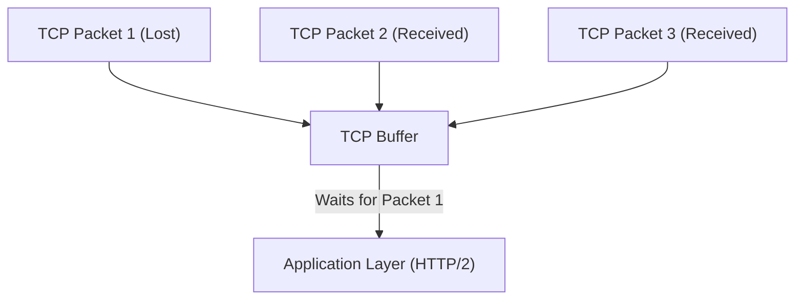
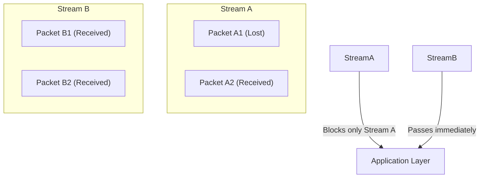
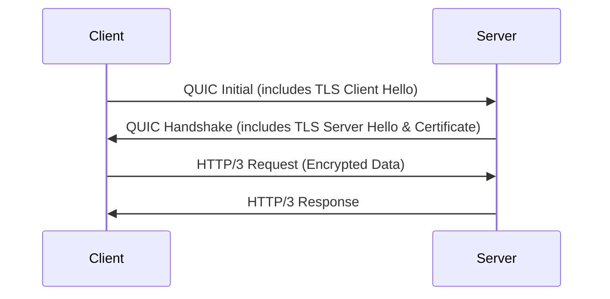
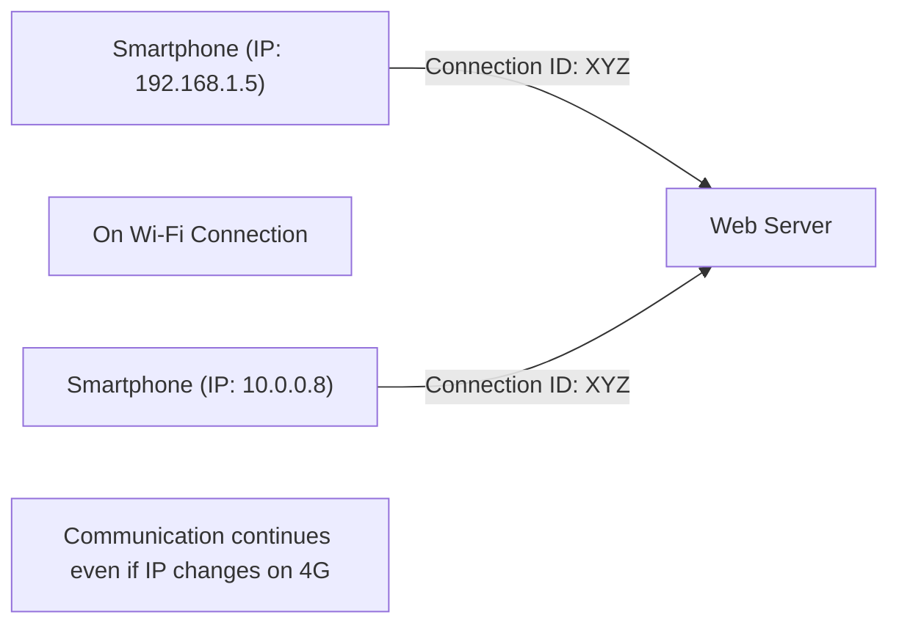

The world of the Internet is constantly evolving, but the evolution of the underlying protocols sometimes brings about major transformations known as paradigm shifts. In this article, we will delve into the technical background and detailed mechanisms of "HTTP/3," the new standard for Web communication, and its underlying transport layer protocol "QUIC (Quick UDP Internet Connections)," exploring why they abandoned the long-familiar TCP in favor of UDP.

## 1. Introduction: The Evolution of Web Communication and the Limits of TCP

Since the dawn of the Web in the 1990s, TCP (Transmission Control Protocol) has always been used as the foundation of HTTP communication. TCP is equipped with complex mechanisms such as packet order control, retransmission control, and congestion control to ensure "reliable communication." However, as web pages became richer and required the simultaneous downloading of numerous images and scripts, the design limitations of TCP surfaced as bottlenecks.

### 1.1 The Challenges of HTTP/1.1: Limit on Concurrent Connections
In HTTP/1.1, one request and response are processed in order over a single TCP connection (there was a pipelining mechanism, but it did not become widely adopted). Therefore, to fetch multiple resources simultaneously, the browser had to establish multiple TCP connections to the server. However, the number of connections a browser can make to the same domain is usually limited to around six, causing a wait for resource retrieval.

### 1.2 Improvements with HTTP/2 and New Problems
To solve this problem, HTTP/2 introduced the concept of "streams," allowing multiple requests and responses to be multiplexed over a single TCP connection. This eliminated the bottleneck caused by the connection limit.

However, since HTTP/2 still operates over TCP, it faced a fundamental problem. This is **Head-of-Line Blocking (HoL Blocking) at the TCP level**.

TCP strictly guarantees the order of packets. Therefore, if Packet 1 is lost on the network (packet loss), even if Packet 2 and Packet 3 have already reached the server, TCP cannot pass Packet 2 and 3 to the application layer (HTTP/2) until the retransmission of Packet 1 is complete. Because multiple streams share a single TCP connection in HTTP/2, a single packet loss causes the serious situation of halting communication for completely unrelated streams.

## 2. The Birth of the QUIC Protocol: Adopting UDP

Google, deciding that improving TCP could not solve this HoL blocking, took a completely new approach. This is the development of the "QUIC" protocol. Giving up on TCP, which is deeply embedded in the OS kernel space and difficult to change (protocol ossification), QUIC was built upon the simple and highly flexible **UDP (User Datagram Protocol)**.

While UDP is an "unreliable" protocol lacking TCP's order guarantee and retransmission control, QUIC implements the reliability control TCP had, along with more advanced features (stream control, encryption, etc.), in the application space (user space) on top of that UDP.

### 2.1 Eliminating HoL Blocking in QUIC
The greatest innovation of QUIC lies in its independent order and retransmission control for each stream.

Even if a packet is lost, only the stream to which that packet belongs waits for retransmission (is blocked), without affecting other streams at all. This completely resolved the HoL blocking at the TCP layer that was a problem in HTTP/2.

## 3. Integration of Encryption and Faster Handshakes

Another important design philosophy of QUIC is that it is "encrypted by default." In traditional HTTPS communication, after completing the TCP handshake (3-way handshake), it was necessary to perform a TLS (Transport Layer Security) handshake, causing a large delay (RTT: Round Trip Time) before communication could start.

### 3.1 Traditional Handshake (TCP + TLS 1.3)
1. Client -> Server: TCP SYN
2. Server -> Client: TCP SYN+ACK
3. Client -> Server: TCP ACK & TLS Client Hello
4. Server -> Client: TLS Server Hello & Certificate
5. Client -> Server: HTTP Request (first data transmission here)
Total: 2-RTT to 3-RTT

### 3.2 QUIC Handshake (Integration of Transport and Encryption)
QUIC integrates the mechanism of TLS 1.3 within the protocol. This makes it possible to perform connection establishment and encryption key exchange in a single handshake.

On the initial connection, communication can start in just **1-RTT**. Furthermore, for servers connected to in the past (when holding session tickets, etc.), it achieves **0-RTT (Zero Round Trip Time)** by sending application data starting from the very first packet. This dramatically reduces the initial load time of web pages.

## 4. "Connection Migration" Supporting Mobile Environments

Modern internet usage is centered on mobile devices such as smartphones. A challenge specific to mobile environments is "network switching." For example, when leaving home Wi-Fi and switching to a mobile network (4G/5G), the device's IP address changes.

TCP identifies a connection using a 4-tuple of "source IP, source port, destination IP, and destination port." Therefore, when switching from Wi-Fi to 4G and the IP address changes, the TCP connection is severed, and the handshake must be redone from the beginning. This was the cause of video playback stopping or web calls dropping while on the move.

### 4.1 Seamless Migration using Connection IDs
QUIC uses encrypted **Connection IDs** rather than IP addresses or port numbers to identify connections.

Even if the IP address changes, the client and server continue to use the same connection ID, allowing communication to continue seamlessly without re-establishing the connection. This is called **Connection Migration**. With this feature, the user experience (UX) in mobile environments is dramatically improved.

## 5. The Role of HTTP/3

QUIC takes on the role of the transport layer (an alternative to TCP), and the application layer protocol operating on top of it is **HTTP/3**.
HTTP/3 has the same basic semantics (GET and POST methods, headers, status codes, etc.) as HTTP/2, but it has been optimized to match the foundation changing to QUIC. For example, the HTTP header compression method was changed from HTTP/2's HPACK to **QPACK**, which is optimized for QUIC's stream independence.

## 6. The Spread of QUIC and HTTP/3 and Future Prospects

Currently, the adoption of HTTP/3 is progressing, led by major tech companies like Google, Cloudflare, and Meta, and it is supported by default in major browsers (Chrome, Edge, Firefox, Safari).

### Challenges in Adoption
Because it is UDP-based, there are cases where UDP packets are restricted or not optimized by traditional corporate firewalls and routers (UDP blocking), and fallback to TCP (downgrade to HTTP/2) occurs in some environments, which is seen as a challenge. Additionally, UDP packet processing historically has not been as optimized in the OS kernel (e.g., hardware offloading) as TCP, presenting a challenge of high CPU load on the server side.

However, these challenges are rapidly being resolved by hardware evolution and software optimization.

## 7. Conclusion

HTTP/3 and QUIC are among the most important updates in the history of the Internet. By breaking free from the curse of TCP (HoL blocking and excessive handshakes) and rebuilding a modern and secure transport layer on top of UDP, they have achieved a truly "fast, uninterrupted, and secure Web."

As a developer, simply by switching your infrastructure to an HTTP/3-compatible CDN (like Cloudflare or AWS CloudFront), you can deliver most of these benefits to your end-users. In the pursuit of web performance optimization, correctly understanding and utilizing the paradigm shift of HTTP/3 will be essential in the future.
