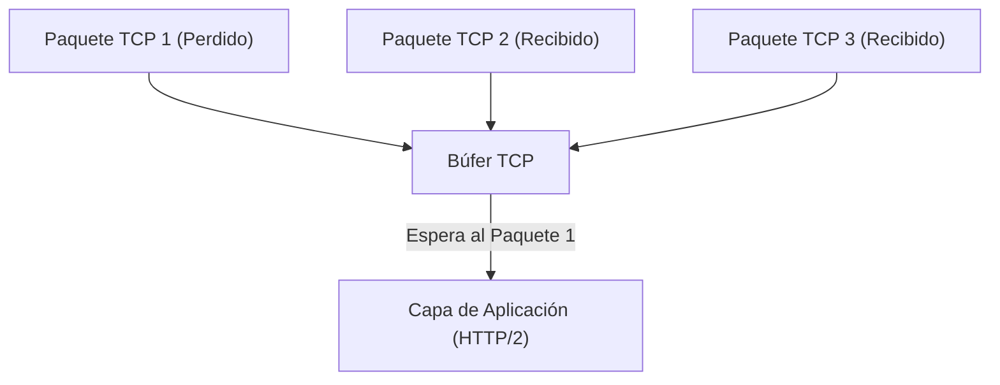
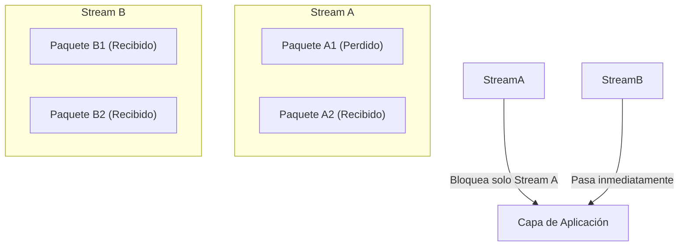
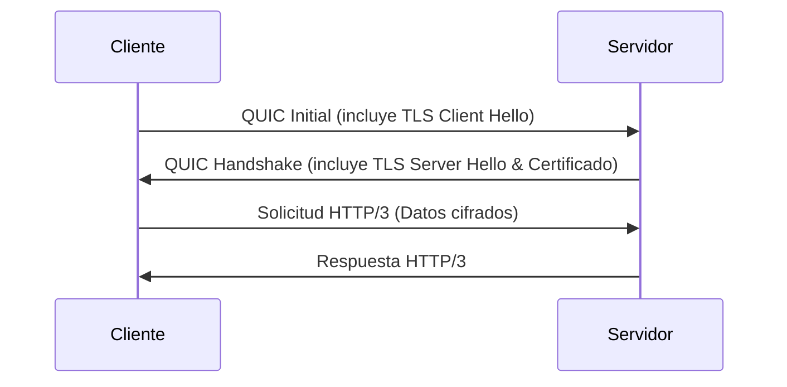
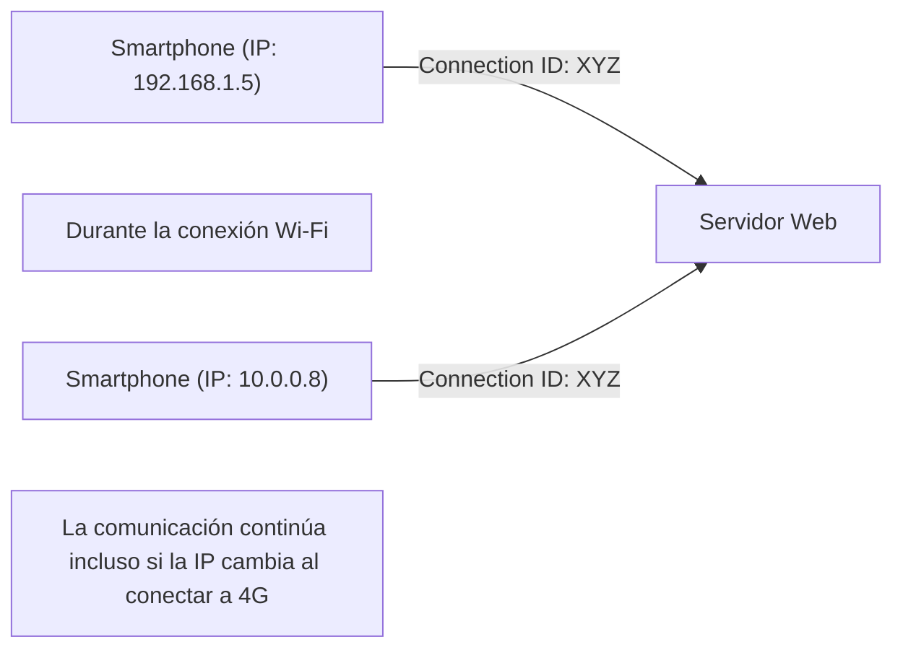

El mundo de Internet evoluciona constantemente, pero la evolución de los protocolos que lo sustentan trae consigo, en ocasiones, cambios tan grandes que se denominan cambios de paradigma. En este artículo, analizaremos en profundidad los antecedentes técnicos y los mecanismos detallados del nuevo estándar de comunicación Web "HTTP/3" y su protocolo de capa de transporte subyacente "QUIC (Quick UDP Internet Connections)", y por qué se descartó el tan utilizado TCP para adoptar UDP.

## 1. Introducción: La evolución de la comunicación Web y las limitaciones de TCP

Desde los albores de la Web en la década de 1990, TCP (Transmission Control Protocol) siempre se ha utilizado como base para las comunicaciones HTTP. TCP cuenta con mecanismos complejos como el control de secuencia de paquetes, el control de retransmisión y el control de congestión para garantizar una "comunicación confiable". Sin embargo, a medida que las páginas Web se volvieron más ricas y surgió la necesidad de descargar numerosas imágenes y scripts a la vez, las limitaciones de diseño de TCP se hicieron evidentes como un cuello de botella.

### 1.1 El problema de HTTP/1.1: Límite de conexiones simultáneas
En HTTP/1.1, una solicitud y una respuesta se procesan en orden a través de una sola conexión TCP (había un mecanismo de pipelining, pero no fue ampliamente adoptado). Por lo tanto, para obtener múltiples recursos simultáneamente, el navegador necesitaba establecer múltiples conexiones TCP con el servidor. Sin embargo, el número de conexiones que un navegador puede establecer con un mismo dominio suele estar limitado a unas 6, lo que provocaba tiempos de espera para la obtención de recursos.

### 1.2 Mejoras con HTTP/2 y nuevos problemas
HTTP/2 introdujo el concepto de "flujo" (stream) para resolver este problema, permitiendo la multiplexación de múltiples solicitudes y respuestas en una sola conexión TCP. Esto eliminó el cuello de botella causado por el límite en el número de conexiones.

Sin embargo, dado que HTTP/2 todavía funciona sobre TCP, se enfrentó a un problema fundamental: el **bloqueo de cabeza de línea a nivel de TCP (Head-of-Line Blocking, HoL Blocking)**.

TCP garantiza estrictamente el orden de los paquetes. Por lo tanto, si el paquete 1 se pierde en la red (pérdida de paquetes), incluso si los paquetes 2 y 3 ya han llegado al servidor, TCP no puede entregar los paquetes 2 y 3 a la capa de aplicación (HTTP/2) hasta que se complete la retransmisión del paquete 1. Dado que HTTP/2 comparte una única conexión TCP entre varios flujos, la pérdida de un solo paquete provocaba una situación grave que detenía la comunicación de otros flujos completamente ajenos.

## 2. El nacimiento del protocolo QUIC: Adopción de UDP

Al concluir que el problema de bloqueo HoL no podía resolverse mejorando TCP, Google adoptó un enfoque completamente nuevo. Así nació el desarrollo del protocolo "QUIC". QUIC abandonó TCP, que está profundamente integrado en el espacio del kernel del sistema operativo y es difícil de modificar (osificación del protocolo), y se construyó sobre **UDP (User Datagram Protocol)**, que tiene una estructura simple y una alta flexibilidad.

UDP es un protocolo "no confiable" que carece de garantías de orden y control de retransmisión como TCP, pero QUIC implementa los controles de confiabilidad que tenía TCP y características aún más avanzadas (control de flujos, cifrado, etc.) en el espacio de aplicación (espacio de usuario) por encima de UDP.

### 2.1 Resolución del bloqueo HoL en QUIC
La mayor innovación de QUIC radica en que realiza el control de orden y el control de retransmisión de forma independiente para cada flujo.

Incluso si un paquete se pierde, solo el flujo al que pertenece ese paquete entra en estado de espera por retransmisión (bloqueo), sin afectar en absoluto a los demás flujos. Esto resuelve por completo el problema del bloqueo HoL en la capa TCP que afectaba a HTTP/2.

## 3. Integración del cifrado y aceleración del Handshake

Otra filosofía de diseño importante de QUIC es que está "cifrado por defecto". En la comunicación HTTPS tradicional, después de completar el handshake de TCP (handshake de 3 vías), era necesario realizar el handshake de TLS (Transport Layer Security), lo que generaba un retraso significativo (RTT: Round Trip Time) antes de comenzar la comunicación.

### 3.1 Handshake tradicional (TCP + TLS 1.3)
1. Cliente -> Servidor: TCP SYN
2. Servidor -> Cliente: TCP SYN+ACK
3. Cliente -> Servidor: TCP ACK & TLS Client Hello
4. Servidor -> Cliente: TLS Server Hello & Certificado
5. Cliente -> Servidor: Solicitud HTTP (Primera transmisión de datos)
Total: 2-RTT a 3-RTT

### 3.2 Handshake de QUIC (Integración de transporte y cifrado)
QUIC integra el mecanismo de TLS 1.3 dentro del protocolo. Esto permite realizar el establecimiento de la conexión y el intercambio de claves de cifrado en un solo handshake.

En la conexión inicial, la comunicación puede comenzar en solo **1-RTT**. Además, para los servidores a los que se ha conectado anteriormente (si se mantiene un ticket de sesión, etc.), se logra un **0-RTT (Cero Round Trip)** enviando datos de la aplicación desde el primer paquete. Esto reduce drásticamente el tiempo de carga inicial de las páginas Web.

## 4. "Connection Migration" que respalda los entornos móviles

El uso actual de Internet se centra en dispositivos móviles como los teléfonos inteligentes. Un desafío particular de los entornos móviles es el "cambio de red". Por ejemplo, cuando se sale de casa y se cambia de la red Wi-Fi a una red móvil (4G/5G), la dirección IP del dispositivo cambia.

TCP identifica una conexión utilizando un conjunto de 4 elementos (tupla de 4): "IP de origen, Puerto de origen, IP de destino, Puerto de destino". Por lo tanto, cuando se cambia de Wi-Fi a 4G y la dirección IP cambia, la conexión TCP se corta y es necesario volver a realizar el handshake desde el principio. Esto causaba la detención de la reproducción de videos y la desconexión de llamadas Web mientras se estaba en movimiento.

### 4.1 Transición perfecta usando Connection ID
QUIC utiliza un **ID de conexión (Connection ID)** cifrado en lugar de direcciones IP y números de puerto para identificar la conexión.

Incluso si la dirección IP cambia, el cliente y el servidor siguen utilizando el mismo ID de conexión, lo que permite continuar la comunicación de manera fluida sin tener que restablecer la conexión. A esto se le llama **Migración de Conexión (Connection Migration)**. Esta función mejora drásticamente la experiencia del usuario (UX) en entornos móviles.

## 5. El papel de HTTP/3

QUIC asume el papel de la capa de transporte (como alternativa a TCP), y el protocolo de capa de aplicación que funciona sobre él es **HTTP/3**.
HTTP/3 mantiene la misma semántica básica (métodos GET y POST, encabezados, códigos de estado, etc.) que hasta HTTP/2, pero ha sido optimizado en consonancia con el cambio de base a QUIC. Por ejemplo, el método de compresión de encabezados HTTP se cambió de HPACK en HTTP/2 a **QPACK**, que está optimizado para la independencia de flujos de QUIC.

## 6. Adopción de QUIC y HTTP/3 y perspectivas futuras

Actualmente, las principales empresas tecnológicas como Google, Cloudflare y Meta están liderando la adopción de HTTP/3, y los principales navegadores (Chrome, Edge, Firefox, Safari) también lo soportan por defecto.

### Desafíos en la implementación
Al estar basado en UDP, en algunos cortafuegos y enrutadores corporativos tradicionales, los paquetes UDP pueden estar restringidos o no estar optimizados (bloqueo de UDP), lo que hace que en algunos entornos se produzca un retorno a TCP (fallback a HTTP/2). Además, históricamente, el procesamiento de paquetes UDP en el kernel del sistema operativo (como la descarga de hardware u offloading) no ha avanzado tanto como el de TCP, lo que plantea el desafío de un aumento en la carga de la CPU en el lado del servidor.

Sin embargo, estos desafíos se están resolviendo rápidamente gracias a la evolución del hardware y la optimización del software.

## 7. Conclusión

HTTP/3 y QUIC representan una de las actualizaciones más importantes en la historia de Internet. Al liberarse de las ataduras de TCP (bloqueo HoL y handshakes excesivos) y reconstruir una capa de transporte moderna y segura sobre UDP, se ha logrado una "Web verdaderamente rápida, ininterrumpida y segura".

Como desarrollador, con solo cambiar la infraestructura a una CDN compatible con HTTP/3 (como Cloudflare o AWS CloudFront), se puede ofrecer la mayor parte de estos beneficios a los usuarios finales. En la búsqueda por optimizar el rendimiento Web, será indispensable comprender correctamente y aprovechar el cambio de paradigma de HTTP/3 en el futuro.
