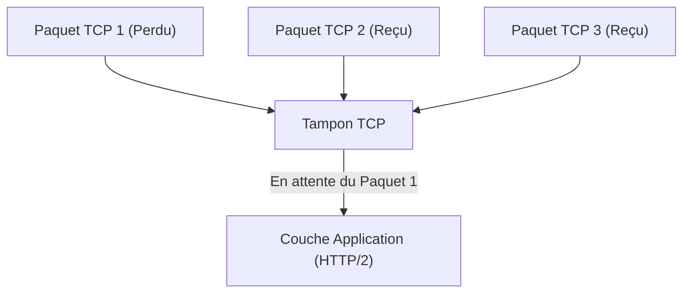
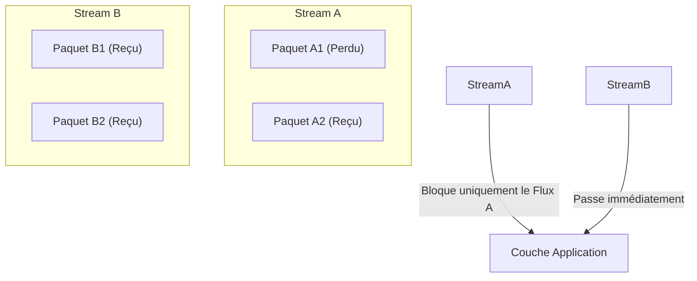
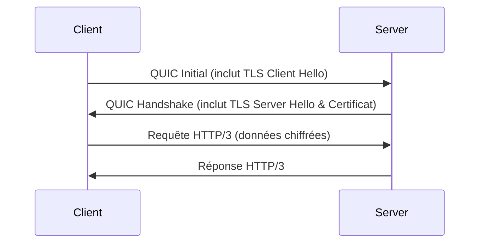
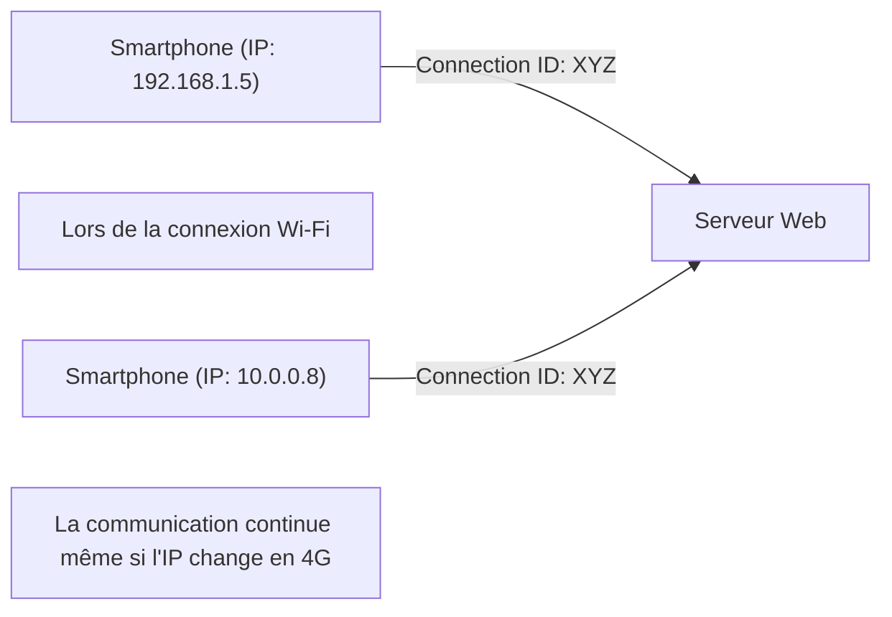

Le monde d'Internet est en constante évolution, et l'évolution des protocoles qui le sous-tendent entraîne parfois des transformations majeures appelées changements de paradigme. Dans cet article, nous explorerons le nouveau standard des communications Web, « HTTP/3 », ainsi que son protocole de couche de transport sous-jacent, « QUIC (Quick UDP Internet Connections) ». Nous examinerons en profondeur le contexte technique et les mécanismes détaillés expliquant pourquoi le protocole TCP, utilisé depuis de nombreuses années, a été abandonné au profit d'UDP.

## 1. Introduction : l'évolution des communications Web et les limites de TCP

Depuis les débuts du Web dans les années 1990, TCP (Transmission Control Protocol) a toujours été utilisé comme base pour les communications HTTP. TCP est doté de mécanismes complexes tels que le contrôle de l'ordre des paquets, le contrôle de retransmission et le contrôle de congestion afin de garantir une « communication fiable ». Cependant, à mesure que les pages Web sont devenues plus riches, nécessitant le téléchargement simultané de nombreuses images et de scripts, les limites de conception de TCP se sont révélées être de véritables goulots d'étranglement.

### 1.1 Les défis de HTTP/1.1 : la limitation du nombre de connexions simultanées
Dans HTTP/1.1, une seule requête et une seule réponse sont traitées séquentiellement sur une unique connexion TCP (bien qu'un mécanisme de pipelining ait existé, il n'a pas été largement adopté). Par conséquent, pour récupérer plusieurs ressources simultanément, le navigateur devait établir plusieurs connexions TCP avec le serveur. Cependant, le nombre de connexions qu'un navigateur peut établir vers un même domaine est généralement limité à environ six, ce qui entraînait des temps d'attente pour la récupération des ressources.

### 1.2 Les améliorations apportées par HTTP/2 et les nouveaux problèmes
Pour résoudre ce problème, HTTP/2 a introduit le concept de « flux » (streams), permettant de multiplexer plusieurs requêtes et réponses sur une seule connexion TCP. Cela a permis d'éliminer le goulot d'étranglement causé par la limitation du nombre de connexions.

Cependant, comme HTTP/2 fonctionne toujours sur TCP, il a été confronté à un problème fondamental : **le blocage en tête de ligne au niveau TCP (Head-of-Line Blocking, ou HoL Blocking)**.

TCP garantit strictement l'ordre des paquets. Par conséquent, si le Paquet 1 est perdu sur le réseau (perte de paquet), même si les Paquets 2 et 3 ont déjà atteint le serveur, TCP ne peut pas transmettre les Paquets 2 et 3 à la couche application (HTTP/2) tant que la retransmission du Paquet 1 n'est pas terminée. Dans HTTP/2, étant donné que plusieurs flux partagent une seule connexion TCP, la perte d'un seul paquet entraîne une situation critique où les communications des autres flux, qui n'ont absolument aucun lien, sont également interrompues.

## 2. La naissance du protocole QUIC : l'adoption d'UDP

Jugeant que les améliorations apportées à TCP ne permettraient pas de résoudre ce blocage HoL, Google a adopté une approche complètement nouvelle : le développement du protocole « QUIC ». QUIC abandonne TCP, qui est profondément intégré dans l'espace noyau (kernel space) du système d'exploitation et difficile à modifier (ossification du protocole), pour se baser sur **UDP (User Datagram Protocol)**, dont la structure est simple et très flexible.

Bien qu'UDP soit un protocole « non fiable » dépourvu des garanties d'ordre ou du contrôle de retransmission de TCP, QUIC met en œuvre au-dessus d'UDP le contrôle de fiabilité que possédait TCP, ainsi que des fonctionnalités plus avancées (contrôle de flux, chiffrement, etc.) directement dans l'espace application (espace utilisateur).

### 2.1 La résolution du blocage HoL dans QUIC
L'innovation majeure de QUIC réside dans sa capacité à effectuer un contrôle d'ordre et un contrôle de retransmission indépendants pour chaque flux (stream).

Même en cas de perte de paquets, seul le flux auquel appartient ce paquet sera en attente de retransmission (bloqué), et cela n'affectera en rien les autres flux. Grâce à cela, le blocage HoL au niveau de la couche TCP, qui posait problème dans HTTP/2, a été complètement éliminé.

## 3. Intégration du chiffrement et accélération de l'établissement de la liaison (Handshake)

Une autre philosophie de conception clé de QUIC est qu'il est « chiffré par défaut ». Dans les communications HTTPS traditionnelles, le handshake TLS (Transport Layer Security) doit être effectué après avoir terminé le handshake TCP (three-way handshake), ce qui entraînait un délai important (RTT : Round Trip Time) avant que la communication ne puisse commencer.

### 3.1 Handshake traditionnel (TCP + TLS 1.3)
1. Client -> Serveur : TCP SYN
2. Serveur -> Client : TCP SYN+ACK
3. Client -> Serveur : TCP ACK & TLS Client Hello
4. Serveur -> Client : TLS Server Hello & Certificat
5. Client -> Serveur : Requête HTTP (première transmission de données ici)
Total : 2-RTT à 3-RTT

### 3.2 Handshake QUIC (intégration du transport et du chiffrement)
QUIC intègre le mécanisme TLS 1.3 à l'intérieur du protocole. Cela a permis de réaliser l'établissement de la connexion et l'échange de clés de chiffrement en un seul handshake.

Lors de la première connexion, la communication peut commencer en seulement **1-RTT**. De plus, pour les serveurs auxquels on s'est déjà connecté par le passé (si on détient un ticket de session, etc.), il est possible de réaliser un **0-RTT (Zéro Round Trip)** où les données de l'application sont transmises dès le tout premier paquet. Par conséquent, le temps de chargement initial des pages Web est considérablement réduit.

## 4. La « Migration de Connexion » pour soutenir l'environnement mobile

Aujourd'hui, l'utilisation d'Internet est principalement centrée sur les appareils mobiles tels que les smartphones. L'un des défis spécifiques à l'environnement mobile est le « changement de réseau ». Par exemple, lorsque l'on quitte son domicile et que l'on passe d'un réseau Wi-Fi à un réseau mobile (4G/5G), l'adresse IP de l'appareil change.

TCP identifie les connexions via un ensemble de quatre éléments (le 4-tuple) : « IP source, Port source, IP de destination, Port de destination ». De ce fait, lorsque l'adresse IP change suite à un basculement du Wi-Fi vers la 4G, la connexion TCP est interrompue, et il est nécessaire de recommencer le handshake depuis le début. Cela était la cause des interruptions lors de la lecture de vidéos en déplacement ou des coupures lors des appels Web.

### 4.1 Transition transparente grâce à l'Identifiant de Connexion
Pour identifier une connexion, QUIC n'utilise ni adresse IP ni numéro de port, mais un **Identifiant de Connexion (Connection ID)** chiffré.

Même si l'adresse IP change, le client et le serveur continuent d'utiliser le même identifiant de connexion, ce qui leur permet de poursuivre la communication de manière transparente sans avoir à rétablir la connexion. C'est ce qu'on appelle la **Migration de Connexion (Connection Migration)**. Grâce à cette fonctionnalité, l'expérience utilisateur (UX) dans les environnements mobiles est considérablement améliorée.

## 5. Le rôle de HTTP/3

QUIC joue le rôle de la couche de transport (en remplacement de TCP), et le protocole de couche application fonctionnant par-dessus est **HTTP/3**.
Bien que la sémantique de base de HTTP/3 (les méthodes GET et POST, les en-têtes, les codes d'état, etc.) reste identique à celle de HTTP/2, il a été optimisé pour s'adapter à sa nouvelle fondation basée sur QUIC. Par exemple, la méthode de compression des en-têtes HTTP est passée de HPACK (utilisé dans HTTP/2) à **QPACK**, qui est optimisé pour l'indépendance des flux de QUIC.

## 6. Adoption et perspectives d'avenir pour QUIC et HTTP/3

Actuellement, l'adoption de HTTP/3 progresse, principalement menée par de grandes entreprises technologiques telles que Google, Cloudflare et Meta, et les principaux navigateurs (Chrome, Edge, Firefox, Safari) le prennent en charge par défaut.

### Les défis de l'adoption
Étant donné qu'il est basé sur UDP, il arrive que les paquets UDP soient restreints ou non optimisés par les routeurs ou les pare-feu d'entreprise traditionnels (blocage d'UDP). Cela entraîne, dans certains environnements, un repli (fallback) vers TCP (et un retour à HTTP/2), ce qui constitue un défi. De plus, historiquement, le traitement des paquets UDP n'a pas bénéficié du même niveau d'optimisation (comme le déchargement matériel ou hardware offload) dans le noyau du système d'exploitation que TCP, ce qui entraîne également un défi lié à l'augmentation de la charge CPU côté serveur.

Cependant, ces défis sont rapidement en train d'être résolus grâce à l'évolution du matériel et à l'optimisation des logiciels.

## 7. Conclusion

HTTP/3 et QUIC représentent l'une des mises à jour les plus importantes de l'histoire d'Internet. Libéré des contraintes de TCP (comme le blocage HoL et les handshakes excessifs), il a permis de recréer une couche de transport moderne et sécurisée au-dessus d'UDP, réalisant ainsi un « Web rapide, ininterrompu et sécurisé » dans le vrai sens du terme.

En tant que développeurs, il suffit de migrer son infrastructure vers un CDN compatible HTTP/3 (comme Cloudflare ou AWS CloudFront) pour offrir une grande partie de ces avantages aux utilisateurs finaux. Dans la quête de l'optimisation des performances Web, il sera désormais indispensable de bien comprendre et d'exploiter le changement de paradigme qu'apporte HTTP/3.
