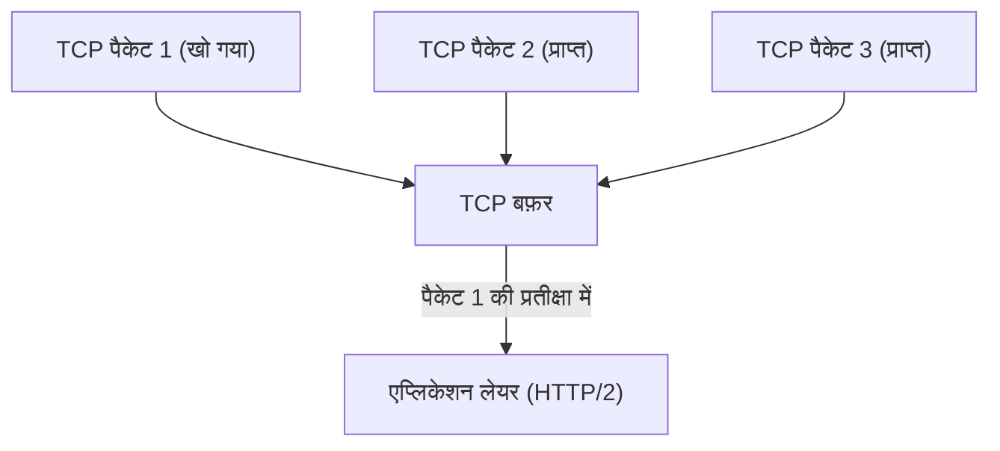
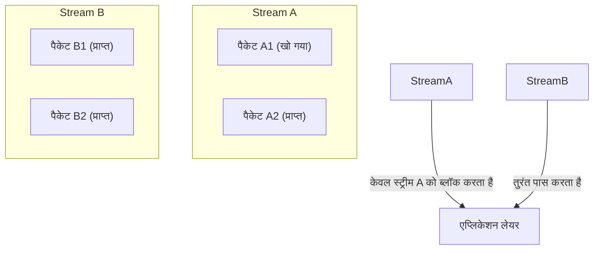
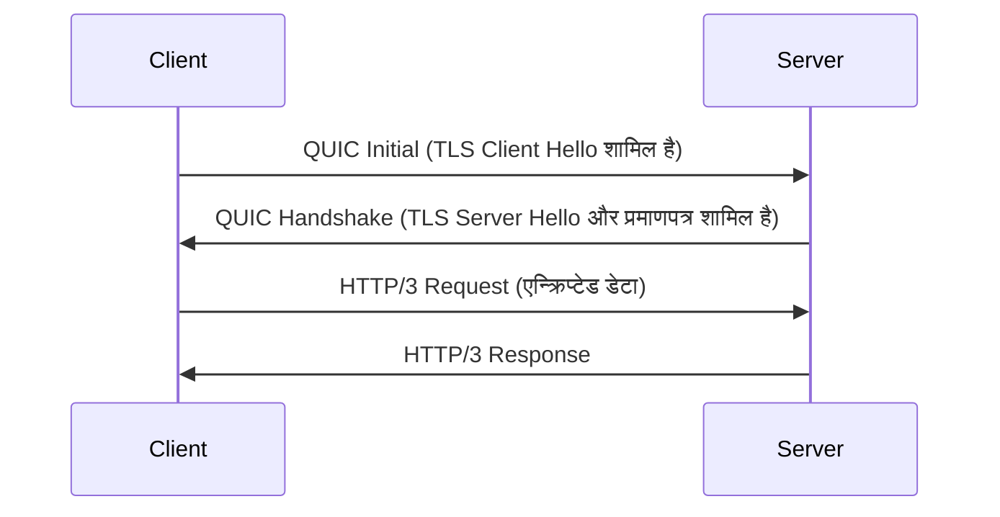
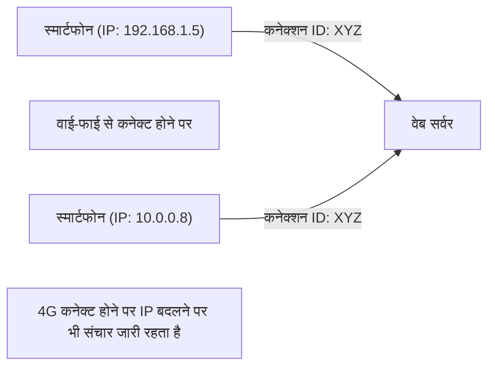

इंटरनेट की दुनिया लगातार विकसित हो रही है, लेकिन इसके आधार को सहारा देने वाले प्रोटोकॉल के विकास से कभी-कभी इतने बड़े बदलाव आते हैं जिन्हें पैराडाइम शिफ्ट कहा जाता है। इस लेख में, हम वेब संचार के नए मानक "HTTP/3" और इसके आधार ट्रांसपोर्ट लेयर प्रोटोकॉल "QUIC (Quick UDP Internet Connections)" के बारे में विस्तार से जानेंगे। हम तकनीकी पृष्ठभूमि और विस्तृत तंत्र की गहराई में जाएंगे कि आखिर क्यों लंबे समय से उपयोग किए जा रहे TCP को छोड़कर UDP को अपनाया गया।

## 1. परिचय: वेब संचार का विकास और TCP की सीमाएँ

1990 के दशक में वेब के शुरुआती दिनों से, TCP (Transmission Control Protocol) हमेशा HTTP संचार की नींव के रूप में उपयोग किया जाता रहा है। "विश्वसनीय संचार" सुनिश्चित करने के लिए, TCP में पैकेट क्रम नियंत्रण, पुनर्संचरण (retransmission) नियंत्रण, और कंजेशन नियंत्रण जैसे जटिल तंत्र होते हैं। हालाँकि, जैसे-जैसे वेब पेज अधिक रिच हुए और एक ही समय में कई छवियों और स्क्रिप्ट्स को डाउनलोड करने की आवश्यकता उत्पन्न हुई, TCP के डिज़ाइन की सीमाएँ अड़चन (bottleneck) के रूप में स्पष्ट होने लगीं।

### 1.1 HTTP/1.1 की चुनौतियां: समवर्ती कनेक्शन की सीमा
HTTP/1.1 में, एक TCP कनेक्शन पर एक रिक्वेस्ट और रिस्पॉन्स को क्रमिक रूप से प्रोसेस किया जाता है (पाइपलाइनिंग का एक तंत्र था, लेकिन यह व्यापक रूप से लोकप्रिय नहीं हुआ)। इसलिए, एक ही समय में कई संसाधनों को प्राप्त करने के लिए, ब्राउज़र को सर्वर के साथ कई TCP कनेक्शन स्थापित करने पड़ते थे। हालाँकि, एक ब्राउज़र द्वारा एक ही डोमेन के लिए स्थापित किए जा सकने वाले कनेक्शन की संख्या आमतौर पर लगभग 6 तक सीमित होती है, जिससे संसाधन प्राप्ति में प्रतीक्षा करनी पड़ती थी।

### 1.2 HTTP/2 द्वारा सुधार और नई समस्याएं
इस समस्या को हल करने के लिए, HTTP/2 ने "स्ट्रीम (stream)" की अवधारणा पेश की, जिससे एक ही TCP कनेक्शन पर कई रिक्वेस्ट और रिस्पॉन्स को मल्टीप्लेक्स (multiplex) करना संभव हो गया। इसने कनेक्शन की संख्या सीमा के कारण होने वाली अड़चन को दूर कर दिया।

हालाँकि, चूंकि HTTP/2 अभी भी TCP पर काम करता है, इसलिए इसे एक मौलिक समस्या का सामना करना पड़ा। यह है **TCP स्तर पर हेड-ऑफ-लाइन ब्लॉकिंग (Head-of-Line Blocking, HoL Blocking)**।

TCP पैकेट के क्रम की कड़ाई से गारंटी देता है। इसलिए, यदि नेटवर्क पर पैकेट 1 खो जाता है (पैकेट लॉस), तो भी पैकेट 2 और पैकेट 3 सर्वर पर पहुंच चुके होने के बावजूद, TCP पैकेट 2 और 3 को एप्लिकेशन लेयर (HTTP/2) को तब तक नहीं सौंप सकता जब तक कि पैकेट 1 का पुनर्संचरण पूरा नहीं हो जाता। चूंकि HTTP/2 में कई स्ट्रीम एक ही TCP कनेक्शन साझा करते हैं, इसलिए सिर्फ एक पैकेट के खोने से पूरी तरह से असंबंधित अन्य स्ट्रीम का संचार भी रुक जाता है, जिससे गंभीर स्थिति पैदा होती है।

## 2. QUIC प्रोटोकॉल का जन्म: UDP को अपनाना

यह देखते हुए कि TCP में सुधार इस HoL ब्लॉकिंग को हल नहीं कर सकता है, Google ने एक पूरी तरह से नया दृष्टिकोण अपनाया। वह "QUIC" प्रोटोकॉल का विकास है। QUIC को OS के कर्नेल स्पेस में गहराई से अंतर्निहित और संशोधित करने में कठिन (प्रोटोकॉल ऑसिफिकेशन) TCP को छोड़कर, एक सरल संरचना और अत्यधिक लचीले **UDP (User Datagram Protocol)** के आधार पर बनाया गया था।

UDP एक "अविश्वसनीय" प्रोटोकॉल है जिसमें TCP की तरह क्रम की गारंटी या पुनर्संचरण नियंत्रण नहीं होता है, लेकिन QUIC ने UDP के ऊपर एप्लिकेशन स्पेस (यूज़र स्पेस) में TCP द्वारा प्रदान की जाने वाली विश्वसनीयता नियंत्रण और अधिक उन्नत सुविधाओं (स्ट्रीम नियंत्रण, एन्क्रिप्शन, आदि) को लागू किया।

### 2.1 QUIC में HoL ब्लॉकिंग का समाधान
QUIC का सबसे बड़ा नवाचार प्रत्येक स्ट्रीम के लिए स्वतंत्र रूप से क्रम नियंत्रण और पुनर्संचरण नियंत्रण करना है।

यहां तक कि अगर कोई पैकेट खो जाता है, तो केवल वह स्ट्रीम जिससे वह पैकेट संबंधित है, पुनर्संचरण (ब्लॉक) की प्रतीक्षा करती है, और इसका अन्य स्ट्रीम पर कोई प्रभाव नहीं पड़ता है। इसने HTTP/2 में एक समस्या रही TCP लेयर में HoL ब्लॉकिंग को पूरी तरह से समाप्त कर दिया।

## 3. एन्क्रिप्शन का एकीकरण और हैंडशेक की गति बढ़ाना

QUIC का एक और महत्वपूर्ण डिज़ाइन दर्शन यह है कि यह "डिफ़ॉल्ट रूप से एन्क्रिप्टेड" है। पारंपरिक HTTPS संचार में, TCP हैंडशेक (3-वे हैंडशेक) पूरा करने के बाद TLS (Transport Layer Security) हैंडशेक करना आवश्यक था, जिससे संचार शुरू होने से पहले एक बड़ी देरी (RTT: Round Trip Time) होती थी।

### 3.1 पारंपरिक हैंडशेक (TCP + TLS 1.3)
1. क्लाइंट -> सर्वर: TCP SYN
2. सर्वर -> क्लाइंट: TCP SYN+ACK
3. क्लाइंट -> सर्वर: TCP ACK और TLS Client Hello
4. सर्वर -> क्लाइंट: TLS Server Hello और प्रमाणपत्र (Certificate)
5. क्लाइंट -> सर्वर: HTTP Request (यहां पहली बार डेटा प्रेषित)
कुल: 2-RTT से 3-RTT

### 3.2 QUIC का हैंडशेक (ट्रांसपोर्ट और एन्क्रिप्शन का एकीकरण)
QUIC प्रोटोकॉल के भीतर TLS 1.3 के तंत्र को एकीकृत करता है। यह एक ही हैंडशेक में कनेक्शन स्थापित करने और एन्क्रिप्शन कुंजी का आदान-प्रदान करने की अनुमति देता है।

पहली बार कनेक्ट होने पर, आप केवल **1-RTT** में संचार शुरू कर सकते हैं। इसके अलावा, उन सर्वरों के लिए जिनसे पहले कनेक्ट किया जा चुका है (यदि सेशन टिकट आदि रखे गए हैं), यह **0-RTT (जीरो राउंड ट्रिप)** प्राप्त करता है जो पहले पैकेट से एप्लिकेशन डेटा सहित भेजता है। यह वेब पेजों के शुरुआती लोड समय को काफी कम कर देता है।

## 4. मोबाइल परिवेश का समर्थन करने वाला "कनेक्शन माइग्रेशन"

आजकल इंटरनेट का उपयोग मुख्य रूप से स्मार्टफोन जैसे मोबाइल उपकरणों पर किया जाता है। मोबाइल परिवेश के लिए विशिष्ट चुनौती "नेटवर्क स्विचिंग" है। उदाहरण के लिए, जब आप अपने घर के वाई-फाई से बाहर जाते हैं और मोबाइल नेटवर्क (4G/5G) पर स्विच करते हैं, तो डिवाइस का IP एड्रेस बदल जाता है।

TCP कनेक्शन की पहचान चार चीजों (4-ट्यूपल) के सेट से करता है: "सोर्स IP, सोर्स पोर्ट, डेस्टिनेशन IP, डेस्टिनेशन पोर्ट"। इसलिए, जब आप वाई-फाई से 4G पर स्विच करते हैं और आपका IP एड्रेस बदल जाता है, तो TCP कनेक्शन टूट जाता है और हैंडशेक को शुरू से फिर से करना पड़ता है। चलते-फिरते वीडियो प्लेबैक के रुकने और वेब कॉल के कटने का यही कारण था।

### 4.1 कनेक्शन ID द्वारा निर्बाध संक्रमण
QUIC कनेक्शन की पहचान करने के लिए IP एड्रेस या पोर्ट नंबर के बजाय एन्क्रिप्टेड **कनेक्शन ID (Connection ID)** का उपयोग करता है।

भले ही IP एड्रेस बदल जाए, क्लाइंट और सर्वर उसी कनेक्शन ID का उपयोग करना जारी रखते हैं, जिससे वे कनेक्शन को फिर से स्थापित किए बिना निर्बाध रूप से संचार जारी रख सकते हैं। इसे **कनेक्शन माइग्रेशन (Connection Migration)** कहा जाता है। यह सुविधा मोबाइल परिवेश में उपयोगकर्ता अनुभव (UX) को नाटकीय रूप से बेहतर बनाती है।

## 5. HTTP/3 की भूमिका

QUIC ट्रांसपोर्ट लेयर (TCP के विकल्प) की भूमिका निभाता है, और इसके ऊपर चलने वाला एप्लिकेशन लेयर प्रोटोकॉल **HTTP/3** है।
HTTP/3 में HTTP/2 के समान मूल सेमेन्टिक्स (GET और POST मेथड, हेडर, स्टेटस कोड आदि) हैं, लेकिन इसे QUIC पर आधारित होने के लिए अनुकूलित किया गया है। उदाहरण के लिए, HTTP हेडर संपीड़न (compression) विधि को HTTP/2 के HPACK से बदलकर **QPACK** कर दिया गया है, जो QUIC की स्ट्रीम स्वतंत्रता के लिए अनुकूलित है।

## 6. QUIC और HTTP/3 को अपनाना और भविष्य की संभावनाएं

वर्तमान में, HTTP/3 को Google, Cloudflare और Meta जैसी प्रमुख तकनीकी कंपनियों के नेतृत्व में अपनाया जा रहा है, और प्रमुख ब्राउज़र (Chrome, Edge, Firefox, Safari) भी इसे डिफ़ॉल्ट रूप से सपोर्ट करते हैं।

### अपनाने में चुनौतियां
चूंकि यह UDP पर आधारित है, ऐसे मामले हैं जहां पारंपरिक कॉर्पोरेट फ़ायरवॉल या राउटर द्वारा UDP पैकेट को प्रतिबंधित या अनुकूलित नहीं किया जाता है (UDP ब्लॉक), और कुछ वातावरणों में TCP पर फ़ॉलबैक (HTTP/2 पर वापस जाना) होता है, जिसे एक चुनौती माना जाता है। इसके अलावा, ऐतिहासिक रूप से OS कर्नेल (जैसे हार्डवेयर ऑफलोड) में UDP पैकेट प्रोसेसिंग का अनुकूलन TCP जितना उन्नत नहीं है, जिसके परिणामस्वरूप सर्वर पक्ष पर उच्च CPU लोड की समस्या होती है।

हालाँकि, हार्डवेयर के विकास और सॉफ़्टवेयर अनुकूलन के कारण इन चुनौतियों को भी तेज़ी से हल किया जा रहा है।

## 7. निष्कर्ष

HTTP/3 और QUIC इंटरनेट के इतिहास में सबसे महत्वपूर्ण अपडेट्स में से एक हैं। TCP के बंधनों (HoL ब्लॉकिंग और अत्यधिक हैंडशेक) से मुक्त होकर, और UDP के ऊपर एक आधुनिक और सुरक्षित ट्रांसपोर्ट लेयर का पुनर्निर्माण करके, सही अर्थों में "तेज़, निर्बाध और सुरक्षित वेब" को साकार किया गया है।

डेवलपर्स के रूप में, आप केवल अपने इंफ्रास्ट्रक्चर को HTTP/3 संगत CDN (जैसे Cloudflare या AWS CloudFront) पर माइग्रेट करके इस लाभ का अधिकांश हिस्सा अंतिम उपयोगकर्ताओं तक पहुंचा सकते हैं। वेब प्रदर्शन के अनुकूलन को आगे बढ़ाने के लिए, भविष्य में HTTP/3 के पैराडाइम शिफ्ट को सही ढंग से समझना और उपयोग करना अपरिहार्य होगा।
