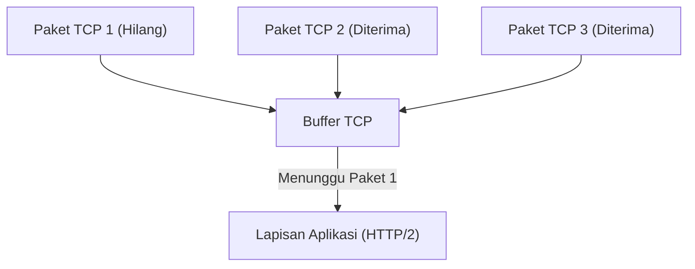
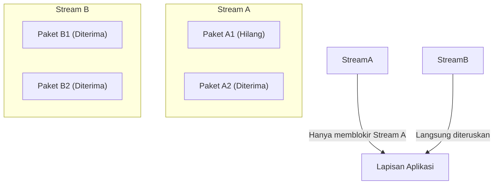
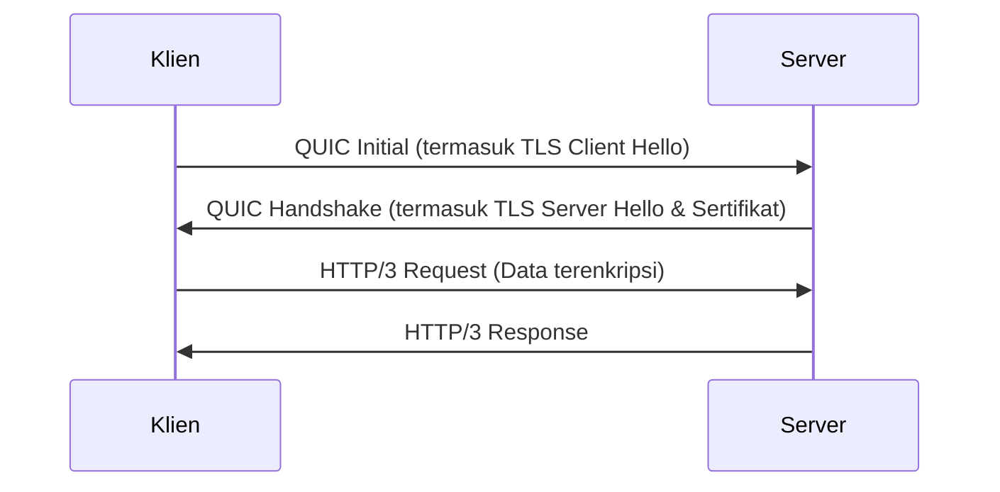
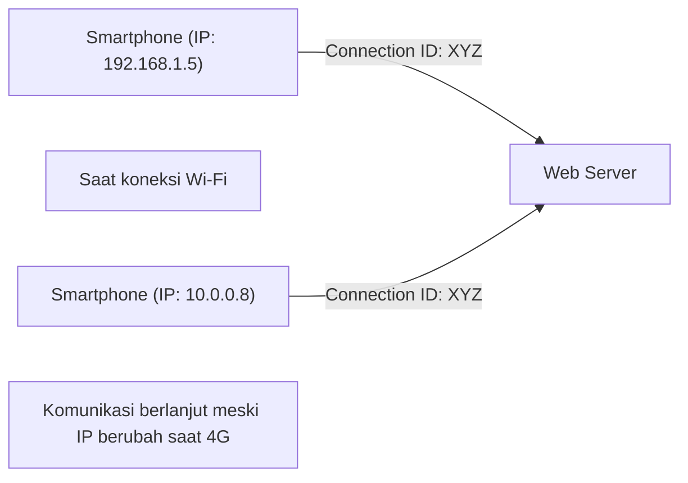

Dunia internet terus berevolusi, dan evolusi protokol yang menopang fondasinya sering kali membawa perubahan besar yang disebut pergeseran paradigma. Dalam artikel ini, kita akan membahas lebih dalam tentang standar baru komunikasi Web yaitu "HTTP/3" dan protokol lapisan transport yang mendasarinya, "QUIC (Quick UDP Internet Connections)". Kita akan mengupas alasan mengapa TCP yang telah lama digunakan akhirnya ditinggalkan demi mengadopsi UDP, beserta latar belakang teknis dan mekanisme detailnya.

## 1. Pendahuluan: Evolusi Komunikasi Web dan Keterbatasan TCP

Sejak awal mula Web pada tahun 1990-an, TCP (Transmission Control Protocol) selalu digunakan sebagai fondasi komunikasi HTTP. TCP memiliki mekanisme kompleks seperti kontrol urutan paket, kontrol transmisi ulang, dan kontrol kemacetan (congestion control) untuk menjamin "komunikasi yang andal". Namun, ketika halaman Web menjadi lebih kaya dan membutuhkan pengunduhan banyak gambar serta skrip sekaligus, keterbatasan desain TCP mulai terlihat sebagai leher botol (bottleneck).

### 1.1 Tantangan HTTP/1.1: Batasan Jumlah Koneksi Simultan
Pada HTTP/1.1, satu koneksi TCP memproses satu request dan response secara berurutan (meskipun ada mekanisme pipelining, itu tidak digunakan secara luas). Oleh karena itu, untuk mengambil beberapa sumber daya secara bersamaan, browser harus membuat banyak koneksi TCP ke server. Akan tetapi, jumlah koneksi yang dapat dibuat oleh browser ke domain yang sama biasanya dibatasi sekitar 6, sehingga menyebabkan waktu tunggu (delay) saat mengambil sumber daya.

### 1.2 Peningkatan oleh HTTP/2 dan Masalah Baru
Untuk mengatasi masalah ini, HTTP/2 memperkenalkan konsep "stream", yang memungkinkan berbagai request dan response dimultipleks (multiplexing) dalam satu koneksi TCP. Hal ini berhasil menghilangkan bottleneck yang disebabkan oleh pembatasan jumlah koneksi.

Namun, karena HTTP/2 masih beroperasi di atas TCP, protokol ini menghadapi masalah mendasar. Itulah **Head-of-Line Blocking (HoL Blocking) pada tingkat TCP**.

TCP menjamin urutan paket secara ketat. Oleh karena itu, jika Paket 1 hilang di jaringan (packet loss), meskipun Paket 2 dan Paket 3 sudah mencapai server, TCP tidak dapat meneruskan Paket 2 dan 3 ke lapisan aplikasi (HTTP/2) sebelum transmisi ulang Paket 1 selesai. Karena HTTP/2 berbagi satu koneksi TCP untuk beberapa stream, satu packet loss saja bisa menghentikan seluruh komunikasi stream lain yang tidak ada hubungannya sama sekali, yang mana merupakan masalah serius.

## 2. Lahirnya Protokol QUIC: Pengadopsian UDP

Menyadari bahwa perbaikan pada TCP tidak akan bisa menyelesaikan masalah HoL Blocking ini, Google mengambil pendekatan yang sama sekali baru. Inilah awal mula pengembangan protokol "QUIC". QUIC meninggalkan TCP, yang tertanam dalam di ruang kernel OS sehingga sulit diubah (protocol ossification), dan dibangun di atas **UDP (User Datagram Protocol)** yang berstruktur sederhana dan sangat fleksibel.

UDP adalah protokol "tidak andal" yang tidak memiliki jaminan urutan atau kontrol transmisi ulang seperti TCP. Namun, di atas UDP tersebut, QUIC mengimplementasikan kontrol keandalan yang sebelumnya dimiliki oleh TCP, beserta fitur yang lebih canggih (kontrol stream, enkripsi, dll.) di ruang aplikasi (user space).

### 2.1 Penyelesaian HoL Blocking di QUIC
Inovasi terbesar dari QUIC terletak pada fakta bahwa protokol ini melakukan kontrol urutan dan kontrol transmisi ulang secara independen untuk setiap stream.

Bahkan jika ada paket yang hilang, hanya stream tempat paket tersebut berada yang harus menunggu transmisi ulang (diblokir), tanpa memengaruhi stream lainnya sama sekali. Dengan ini, HoL Blocking di lapisan TCP yang menjadi masalah pada HTTP/2 telah sepenuhnya terselesaikan.

## 3. Integrasi Enkripsi dan Percepatan Handshake

Konsep desain penting lainnya dari QUIC adalah "terenkripsi secara default". Pada komunikasi HTTPS konvensional, setelah menyelesaikan TCP handshake (3-way handshake), TLS (Transport Layer Security) handshake harus dilakukan, sehingga menyebabkan penundaan (RTT: Round Trip Time) yang besar sebelum komunikasi dapat dimulai.

### 3.1 Handshake Konvensional (TCP + TLS 1.3)
1. Klien -> Server: TCP SYN
2. Server -> Klien: TCP SYN+ACK
3. Klien -> Server: TCP ACK & TLS Client Hello
4. Server -> Klien: TLS Server Hello & Sertifikat
5. Klien -> Server: HTTP Request (Baru pada tahap ini data dikirim)
Total: 2-RTT hingga 3-RTT

### 3.2 Handshake QUIC (Integrasi Transport dan Enkripsi)
QUIC mengintegrasikan mekanisme TLS 1.3 ke dalam protokolnya. Hal ini memungkinkan pembangunan koneksi dan pertukaran kunci enkripsi dilakukan dalam satu handshake.

Pada koneksi pertama kali, komunikasi dapat dimulai hanya dalam **1-RTT**. Selanjutnya, untuk server yang pernah terhubung sebelumnya (jika klien menyimpan session ticket dsb.), QUIC mengimplementasikan **0-RTT (Zero Round Trip Time)**, di mana data aplikasi dapat dikirimkan bersamaan dengan paket pertama. Ini secara dramatis mengurangi waktu muat (load time) awal dari sebuah halaman Web.

## 4. "Connection Migration" yang Mendukung Lingkungan Mobile

Penggunaan internet modern didominasi oleh perangkat mobile seperti smartphone. Salah satu tantangan khusus di lingkungan mobile adalah "peralihan jaringan". Misalnya, ketika pengguna keluar rumah dan beralih dari Wi-Fi rumah ke jaringan seluler (4G/5G), alamat IP perangkat akan berubah.

TCP mengidentifikasi koneksi melalui 4 serangkai (4-tuple) yaitu "IP sumber, Port sumber, IP tujuan, Port tujuan". Karena itu, jika pengguna beralih dari Wi-Fi ke 4G dan IP-nya berubah, koneksi TCP akan terputus dan handshake harus diulang dari awal. Hal inilah yang menjadi penyebab berhentinya pemutaran video atau terputusnya panggilan Web saat sedang bepergian.

### 4.1 Transisi Mulus dengan Connection ID
QUIC tidak menggunakan alamat IP atau nomor port untuk mengidentifikasi koneksi, melainkan menggunakan **Connection ID (ID Koneksi)** yang terenkripsi.

Meskipun alamat IP berubah, klien dan server tetap menggunakan Connection ID yang sama, sehingga komunikasi dapat dilanjutkan dengan mulus tanpa perlu membangun ulang koneksi. Hal ini disebut **Connection Migration (Migrasi Koneksi)**. Dengan fitur ini, pengalaman pengguna (UX) di lingkungan mobile meningkat secara signifikan.

## 5. Peran HTTP/3

QUIC bertindak sebagai lapisan transport (pengganti TCP), dan protokol lapisan aplikasi yang berjalan di atasnya adalah **HTTP/3**.
Semantik dasar HTTP/3 (seperti metode GET dan POST, header, status code, dll.) masih sama dengan HTTP/2, namun ia telah dioptimalkan agar sesuai dengan basis barunya yang menggunakan QUIC. Sebagai contoh, metode kompresi header HTTP diubah dari HPACK pada HTTP/2 menjadi **QPACK**, yang dioptimalkan untuk sifat stream independen pada QUIC.

## 6. Adopsi QUIC dan HTTP/3 serta Prospek Masa Depan

Saat ini, adopsi HTTP/3 sedang berlangsung pesat, dipelopori oleh perusahaan teknologi raksasa seperti Google, Cloudflare, dan Meta, serta telah didukung secara standar oleh browser utama (Chrome, Edge, Firefox, Safari).

### Tantangan dalam Adopsi
Karena berbasis UDP, ada kasus di mana paket UDP dibatasi atau tidak dioptimalkan oleh firewall perusahaan dan router konvensional (UDP blocking), yang menyebabkan fallback (penurunan versi) ke TCP (HTTP/2) di beberapa lingkungan. Selain itu, pemrosesan paket UDP secara historis tidak seoptimal TCP pada level kernel OS (seperti hardware offload), sehingga menjadi tantangan tersendiri karena membebani CPU di sisi server.

Namun, tantangan-tantangan ini dengan cepat diselesaikan melalui evolusi perangkat keras dan optimasi perangkat lunak.

## 7. Kesimpulan

HTTP/3 dan QUIC adalah salah satu pembaruan terpenting dalam sejarah internet. Dengan melepaskan diri dari kutukan TCP (HoL Blocking dan handshake berlebihan) serta membangun ulang lapisan transport yang modern dan aman di atas UDP, protokol ini telah mewujudkan "Web yang cepat, tanpa henti, dan aman" dalam arti yang sesungguhnya.

Bagi developer (pengembang), sebagian besar manfaat ini dapat diberikan kepada pengguna akhir (end-user) hanya dengan memigrasikan infrastruktur ke CDN yang mendukung HTTP/3 (seperti Cloudflare atau AWS CloudFront). Untuk mencapai optimalisasi performa Web, memahami dan memanfaatkan pergeseran paradigma HTTP/3 dengan benar akan menjadi suatu hal yang esensial di masa depan.
