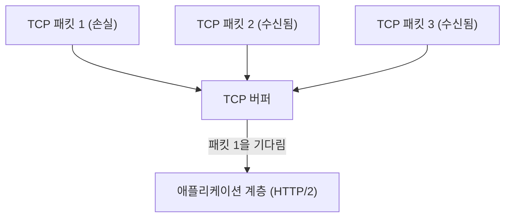
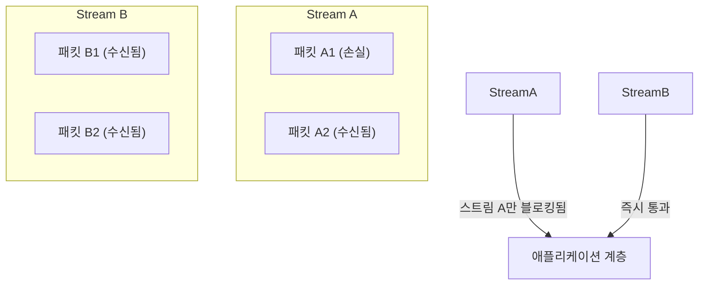
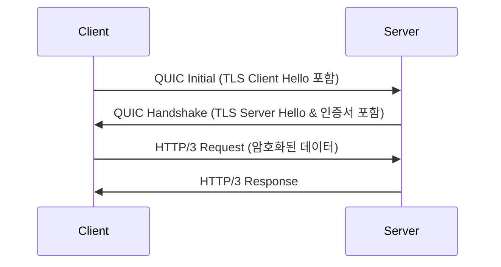
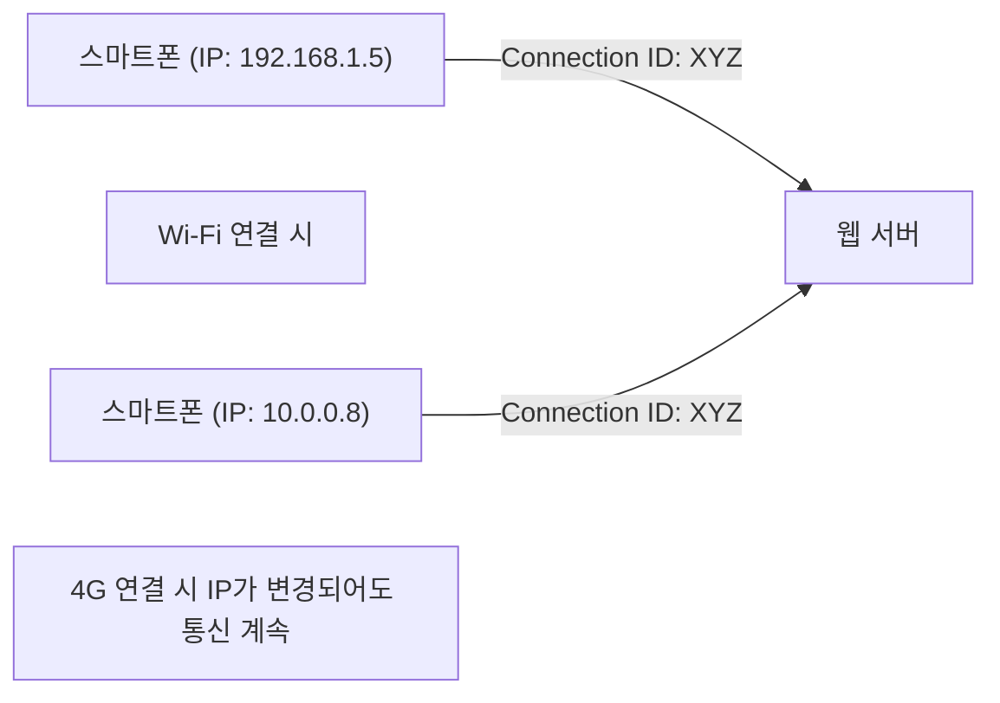

인터넷의 세계는 끊임없이 진화하고 있지만, 그 근간을 지탱하는 프로토콜의 진화는 때로 패러다임 시프트라 불릴 만큼 큰 변혁을 가져옵니다. 본 기사에서는 웹 통신의 새로운 표준인 'HTTP/3'와 그 기반이 되는 전송 계층 프로토콜인 'QUIC(Quick UDP Internet Connections)'에 대해, 왜 오랫동안 친숙했던 TCP를 버리고 UDP를 채택하게 되었는지, 그 기술적 배경과 상세한 메커니즘을 깊이 파헤쳐 설명합니다.

## 1. 소개: 웹 통신의 진화와 TCP의 한계

1990년대 웹의 여명기부터 HTTP 통신의 기반에는 항상 TCP(Transmission Control Protocol)가 사용되어 왔습니다. TCP는 '신뢰성 있는 통신'을 보장하기 위해 패킷의 순서 제어, 재전송 제어, 혼잡 제어와 같은 복잡한 메커니즘을 갖추고 있습니다. 그러나 웹 페이지가 리치해지고 한 번에 다수의 이미지나 스크립트를 다운로드해야 할 필요성이 생기면서, TCP의 설계상 한계가 병목 현상으로 표면화되기 시작했습니다.

### 1.1 HTTP/1.1의 과제: 동시 연결 수의 제한
HTTP/1.1에서는 하나의 TCP 연결 위에서 하나의 요청과 응답을 순차적으로 처리합니다(파이프라이닝 구조도 있었지만 널리 보급되지는 않았습니다). 따라서 여러 리소스를 동시에 가져오기 위해 브라우저는 서버에 여러 개의 TCP 연결을 맺어야 했습니다. 하지만 브라우저가 동일한 도메인에 대해 맺을 수 있는 연결 수는 보통 6개 정도로 제한되어 있어, 리소스 획득을 기다리는 대기 시간이 발생했습니다.

### 1.2 HTTP/2에 의한 개선과 새로운 문제
HTTP/2는 이 문제를 해결하기 위해 '스트림(Stream)'이라는 개념을 도입하여, 하나의 TCP 연결 위에서 여러 요청과 응답을 다중화(멀티플렉싱)할 수 있게 했습니다. 이로써 연결 수 제한으로 인한 병목 현상은 해소되었습니다.

하지만 HTTP/2는 여전히 TCP 위에서 동작하기 때문에 근본적인 문제에 직면하게 되었습니다. 그것이 바로 **TCP 레벨에서의 헤드 오브 라인 블로킹(Head-of-Line Blocking, HoL Blocking)**입니다.

TCP는 패킷의 순서를 엄격하게 보장합니다. 따라서 만약 패킷 1이 네트워크 상에서 손실(패킷 로스)될 경우, 패킷 2와 패킷 3이 이미 서버에 도달했더라도 TCP는 패킷 1의 재전송이 완료될 때까지 애플리케이션 계층(HTTP/2)에 패킷 2와 3을 전달할 수 없습니다. HTTP/2에서는 여러 스트림이 하나의 TCP 연결을 공유하고 있기 때문에, 단 하나의 패킷 손실이 전혀 관계없는 다른 스트림의 통신까지 멈추게 만드는 심각한 사태를 초래한 것입니다.

## 2. QUIC 프로토콜의 탄생: UDP의 채택

TCP의 개량으로는 이 HoL 블로킹을 해결할 수 없다고 판단한 Google은 완전히 새로운 접근 방식을 취했습니다. 그것이 'QUIC' 프로토콜의 개발입니다. QUIC은 OS 커널 공간에 깊이 내장되어 변경하기 어려운(프로토콜 오시피케이션) TCP를 포기하고, 단순한 구조로 유연성이 높은 **UDP(User Datagram Protocol)**를 기반으로 구축되었습니다.

UDP는 TCP와 같은 순서 보장이나 재전송 제어를 갖지 않는 '신뢰성 없는' 프로토콜이지만, QUIC은 그 UDP 위에 TCP가 가지고 있던 신뢰성 제어와 더욱 고도화된 기능(스트림 제어, 암호화 등)을 애플리케이션 공간(유저 공간)에서 구현했습니다.

### 2.1 QUIC에서의 HoL 블로킹 해소
QUIC의 가장 큰 혁신은 스트림별로 독립적인 순서 제어와 재전송 제어를 수행한다는 점에 있습니다.

패킷이 손실되더라도 해당 패킷이 속한 스트림만이 재전송 대기(블로킹) 상태가 되며, 다른 스트림에는 전혀 영향을 주지 않습니다. 이로써 HTTP/2에서 문제가 되었던 TCP 레이어에서의 HoL 블로킹이 완전히 해소되었습니다.

## 3. 암호화의 통합과 핸드셰이크의 고속화

QUIC의 또 다른 중요한 설계 사상은 '기본적으로 암호화되어 있다'는 것입니다. 기존의 HTTPS 통신에서는 TCP의 핸드셰이크(3-way 핸드셰이크)를 마친 후, TLS(Transport Layer Security) 핸드셰이크를 수행해야 했기 때문에 통신 시작까지 큰 지연(RTT: Round Trip Time)이 발생했습니다.

### 3.1 기존의 핸드셰이크 (TCP + TLS 1.3)
1. 클라이언트 -> 서버: TCP SYN
2. 서버 -> 클라이언트: TCP SYN+ACK
3. 클라이언트 -> 서버: TCP ACK & TLS Client Hello
4. 서버 -> 클라이언트: TLS Server Hello & 인증서
5. 클라이언트 -> 서버: HTTP Request (여기서 비로소 데이터 전송)
총: 2-RTT ~ 3-RTT

### 3.2 QUIC의 핸드셰이크 (전송과 암호화의 통합)
QUIC은 TLS 1.3의 메커니즘을 프로토콜 내부에 통합했습니다. 이로써 연결 확립과 암호화 키 교환을 단일 핸드셰이크로 수행하는 것이 가능해졌습니다.

최초 연결 시에는 불과 **1-RTT** 만에 통신을 시작할 수 있습니다. 나아가, 과거에 접속한 적이 있는 서버(세션 티켓 등을 보유하고 있는 경우)에 대해서는 첫 패킷부터 애플리케이션 데이터를 포함해 전송하는 **0-RTT (제로 라운드 트립)**를 실현하고 있습니다. 이로 인해 웹 페이지의 초기 로드 시간이 극적으로 단축됩니다.

## 4. 모바일 환경을 지탱하는 '커넥션 마이그레이션'

현대의 인터넷 이용은 스마트폰 등 모바일 디바이스가 중심입니다. 모바일 환경 특유의 과제로 '네트워크의 전환'이 있습니다. 예를 들어, 집의 Wi-Fi에서 외출하여 모바일 회선(4G/5G)으로 전환될 때 디바이스의 IP 주소가 변경됩니다.

TCP는 연결을 '출발지 IP, 출발지 포트, 목적지 IP, 목적지 포트'라는 4개의 쌍(4-tuple)으로 식별합니다. 따라서 Wi-Fi에서 4G로 전환되어 IP 주소가 바뀌면 TCP 연결이 끊어지고 처음부터 다시 핸드셰이크를 해야 했습니다. 이것이 이동 중인 동영상 재생 중단이나 웹 통화 끊김의 원인이 되었습니다.

### 4.1 연결 ID를 통한 원활한 마이그레이션
QUIC은 연결의 식별에 IP 주소나 포트 번호가 아닌 암호화된 **연결 ID(Connection ID)**를 사용합니다.

IP 주소가 변경되어도 클라이언트와 서버는 동일한 연결 ID를 계속 사용하기 때문에, 연결을 재확립할 필요 없이 원활하게 통신을 계속할 수 있습니다. 이를 **커넥션 마이그레이션(Connection Migration)**이라고 부릅니다. 이 기능 덕분에 모바일 환경에서의 사용자 경험(UX)은 비약적으로 향상됩니다.

## 5. HTTP/3의 역할

QUIC은 전송 계층(TCP의 대체)의 역할을 담당하며, 그 위에서 동작하는 애플리케이션 계층 프로토콜이 **HTTP/3**입니다.
HTTP/3는 기본적인 시맨틱(GET이나 POST 메서드, 헤더, 상태 코드 등)은 HTTP/2까지와 동일하지만, 기반이 QUIC으로 변경된 것에 맞춰 최적화되었습니다. 예를 들어, HTTP 헤더의 압축 방식은 HTTP/2의 HPACK에서 QUIC의 스트림 독립성에 최적화된 **QPACK**으로 변경되었습니다.

## 6. QUIC과 HTTP/3의 보급 및 향후 전망

현재 Google, Cloudflare, Meta 등 대형 테크 기업을 중심으로 HTTP/3의 도입이 진행되고 있으며, 주요 브라우저(Chrome, Edge, Firefox, Safari)도 기본적으로 지원하고 있습니다.

### 도입에 있어서의 과제
UDP 기반이기 때문에 기존의 기업 방화벽이나 라우터에서 UDP 패킷이 제한되거나 최적화되어 있지 않은 경우(UDP 블로킹)가 있어, 일부 환경에서는 TCP로의 폴백(HTTP/2로의 후퇴)이 발생하는 것이 과제로 지적되고 있습니다. 또한, UDP의 패킷 처리는 역사적으로 OS 커널에서의 최적화(하드웨어 오프로드 등)가 TCP만큼 진행되지 않았기 때문에, 서버 측의 CPU 부하가 높아진다는 과제도 있습니다.

하지만 이러한 과제들도 하드웨어의 진화와 소프트웨어의 최적화를 통해 빠르게 해결되어 가고 있습니다.

## 7. 결론

HTTP/3와 QUIC은 인터넷 역사에서 가장 중요한 업데이트 중 하나입니다. TCP의 주술(HoL 블로킹이나 과도한 핸드셰이크)에서 벗어나, UDP 위에 모던하고 안전한 전송 계층을 재구축함으로써 진정한 의미의 '빠르고 끊김 없는 안전한 웹'을 실현했습니다.

개발자 입장에서는 인프라를 HTTP/3 대응의 CDN(Cloudflare나 AWS CloudFront 등)으로 교체하는 것만으로 이 혜택의 대부분을 최종 사용자에게 전달할 수 있습니다. 웹 성능의 최적화를 추구하는 데 있어, HTTP/3의 패러다임 시프트를 올바르게 이해하고 활용해 나가는 것은 앞으로 필수적일 것입니다.
