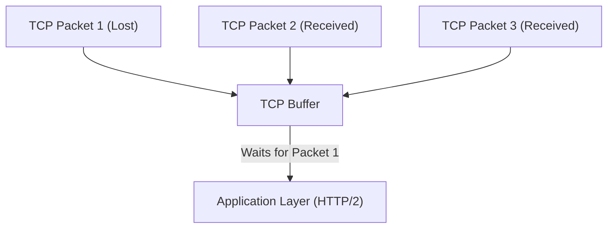
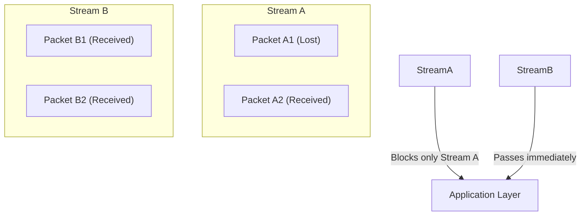
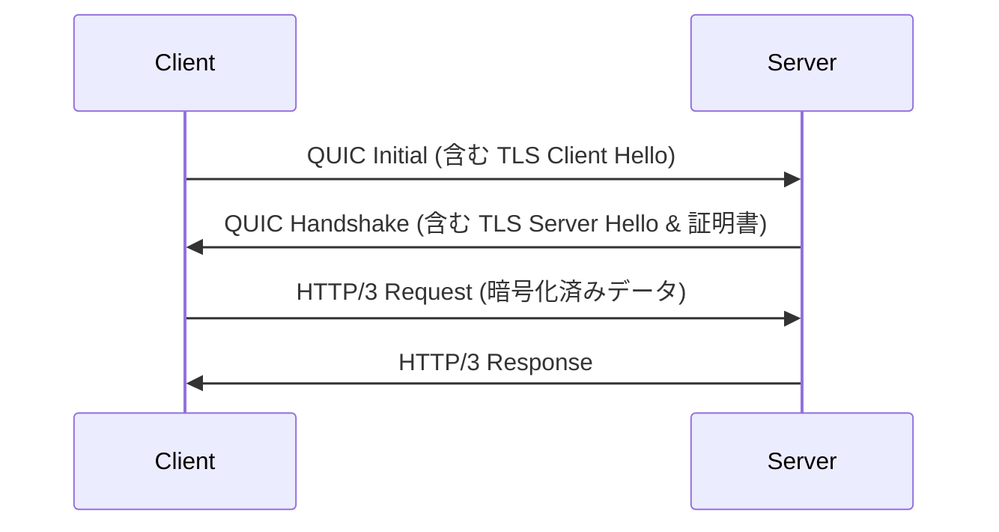
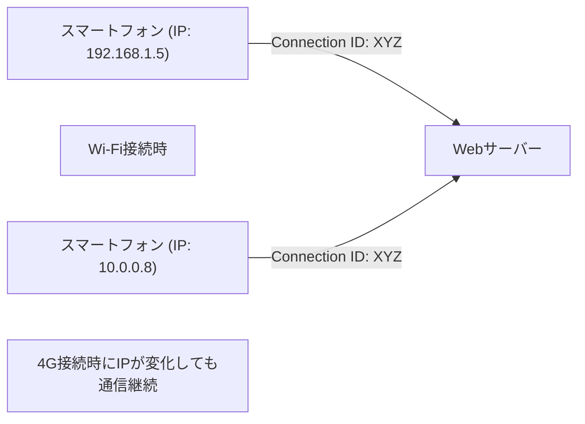

インターネットの世界は常に進化を続けていますが、その根幹を支えるプロトコルの進化は、時にパラダイムシフトと呼ばれるほどの大きな変革をもたらします。本記事では、Web通信の新しい標準である「HTTP/3」と、その基盤となるトランスポート層プロトコル「QUIC（Quick UDP Internet Connections）」について、なぜ長年親しまれてきたTCPを捨ててUDPを採用するに至ったのか、その技術的な背景と詳細なメカニズムを深く掘り下げて解説します。

## 1. はじめに：Web通信の進化とTCPの限界

1990年代のWeb黎明期から、HTTP通信の基盤には常にTCP（Transmission Control Protocol）が使われてきました。TCPは「信頼性のある通信」を保証するために、パケットの順序制御、再送制御、輻輳制御といった複雑な仕組みを備えています。しかし、Webページがリッチになり、一度に多数の画像やスクリプトをダウンロードする必要が生じると、TCPの設計上の限界がボトルネックとして顕在化してきました。

### 1.1 HTTP/1.1の課題：同時接続数の制限
HTTP/1.1では、1つのTCPコネクション上で1つのリクエストとレスポンスを順番に処理します（パイプライン化の仕組みもありましたが、広くは普及しませんでした）。そのため、複数のリソースを同時に取得するためには、ブラウザはサーバーに対して複数のTCPコネクションを張る必要がありました。しかし、ブラウザが同一ドメインに対して張れるコネクション数は通常6つ程度に制限されており、リソースの取得待ちが発生していました。

### 1.2 HTTP/2による改善と新たな問題
HTTP/2は、この問題を解決するために「ストリーム」という概念を導入し、1つのTCPコネクション上で複数のリクエストとレスポンスを多重化（マルチプレキシング）できるようにしました。これにより、コネクション数の制限によるボトルネックは解消されました。

しかし、HTTP/2は依然としてTCP上で動作しているため、根本的な問題に直面しました。それが**TCPレベルでのヘッドオブライン・ブロッキング（Head-of-Line Blocking, HoL Blocking）**です。

TCPはパケットの順序を厳密に保証します。そのため、もしパケット1がネットワーク上で損失（パケットロス）した場合、パケット2とパケット3がすでにサーバーに到達していたとしても、TCPはパケット1の再送が完了するまで、アプリケーション層（HTTP/2）にパケット2と3を渡すことができません。HTTP/2では複数のストリームが1つのTCPコネクションを共有しているため、たった1つのパケットロスが、全く関係のない他のストリームの通信まで止めてしまうという深刻な事態を引き起こしたのです。

## 2. QUICプロトコルの誕生：UDPの採用

TCPの改良ではこのHoLブロッキングを解決できないと判断したGoogleは、全く新しいアプローチを取りました。それが「QUIC」プロトコルの開発です。QUICは、OSのカーネル空間に深く組み込まれ、変更が困難（プロトコル・オシフィケーション）なTCPを諦め、シンプルな構造で柔軟性の高い**UDP（User Datagram Protocol）**をベースに構築されました。

UDPはTCPのような順序保証や再送制御を持たない「信頼性のない」プロトコルですが、QUICはそのUDPの上に、TCPが持っていた信頼性制御と、さらに高度な機能（ストリーム制御、暗号化など）をアプリケーション空間（ユーザー空間）で実装しました。

### 2.1 QUICにおけるHoLブロッキングの解消
QUICの最大の革新は、ストリームごとに独立した順序制御と再送制御を行う点にあります。

パケットが損失した場合でも、そのパケットが属するストリームのみが再送待ち（ブロック）となり、他のストリームには全く影響を与えません。これにより、HTTP/2で問題となったTCPレイヤーでのHoLブロッキングが完全に解消されました。

## 3. 暗号化の統合とハンドシェイクの高速化

QUICのもう一つの重要な設計思想は、「デフォルトで暗号化されている」ということです。従来のHTTPS通信では、TCPのハンドシェイク（3ウェイ・ハンドシェイク）を終えた後に、TLS（Transport Layer Security）のハンドシェイクを行う必要があり、通信開始までに大きな遅延（RTT：Round Trip Time）が発生していました。

### 3.1 従来のハンドシェイク（TCP + TLS 1.3）
1. クライアント -> サーバー: TCP SYN
2. サーバー -> クライアント: TCP SYN+ACK
3. クライアント -> サーバー: TCP ACK & TLS Client Hello
4. サーバー -> クライアント: TLS Server Hello & 証明書
5. クライアント -> サーバー: HTTP Request (ここで初めてデータ送信)
計: 2-RTT〜3-RTT

### 3.2 QUICのハンドシェイク（トランスポートと暗号化の統合）
QUICは、TLS 1.3のメカニズムをプロトコル内部に統合しています。これにより、コネクションの確立と暗号化鍵の交換を単一のハンドシェイクで行うことが可能になりました。

初回接続時はわずか **1-RTT** で通信を開始できます。さらに、過去に接続したことのあるサーバー（セッションチケットなどを保持している場合）に対しては、最初のパケットからアプリケーションデータを含めて送信する **0-RTT（ゼロラウンドトリップ）** を実現しています。これにより、Webページの初期ロード時間が劇的に短縮されます。

## 4. モバイル環境を支える「コネクション・マイグレーション」

現代のインターネット利用は、スマートフォンなどのモバイルデバイスが中心です。モバイル環境特有の課題として「ネットワークの切り替え」があります。例えば、自宅のWi-Fiから外出してモバイル回線（4G/5G）に切り替わる際、デバイスのIPアドレスが変更されます。

TCPはコネクションを「送信元IP、送信元ポート、宛先IP、宛先ポート」の4つの組（4タプル）で識別します。そのため、Wi-Fiから4Gに切り替わってIPアドレスが変わると、TCPコネクションは切断され、最初からハンドシェイクをやり直す必要がありました。これが、移動中の動画再生の停止や、Web通話の切断の原因となっていました。

### 4.1 コネクションIDによるシームレスな移行
QUICは、コネクションの識別にIPアドレスやポート番号ではなく、暗号化された **コネクションID（Connection ID）** を使用します。

IPアドレスが変更されても、クライアントとサーバーは同じコネクションIDを使い続けるため、コネクションを再確立することなくシームレスに通信を継続できます。これを **コネクション・マイグレーション（Connection Migration）** と呼びます。この機能により、モバイル環境におけるユーザー体験（UX）は飛躍的に向上します。

## 5. HTTP/3の役割

QUICはトランスポート層（TCPの代替）の役割を担い、その上で動作するアプリケーション層プロトコルが **HTTP/3** です。
HTTP/3は、基本的なセマンティクス（GETやPOSTメソッド、ヘッダー、ステータスコードなど）はHTTP/2までと同じですが、基盤がQUICに変わったことに合わせて最適化されています。例えば、HTTPヘッダーの圧縮方式はHTTP/2のHPACKから、QUICのストリーム独立性に最適化された **QPACK** に変更されました。

## 6. QUICとHTTP/3の普及と今後の展望

現在、Google、Cloudflare、Metaなどの大手テック企業を中心にHTTP/3の導入が進んでおり、主要なブラウザ（Chrome、Edge、Firefox、Safari）も標準でサポートしています。

### 導入における課題
UDPベースであるため、従来の企業ファイアウォールやルーターでUDPパケットが制限されたり、最適化されていなかったりするケース（UDPブロック）があり、一部環境ではTCPへのフォールバック（HTTP/2への後退）が発生することが課題とされています。また、UDPのパケット処理は歴史的にOSのカーネルでの最適化（ハードウェア・オフロードなど）がTCPほど進んでいないため、サーバー側のCPU負荷が高くなるという課題もあります。

しかし、これらの課題もハードウェアの進化とソフトウェアの最適化により急速に解決されつつあります。

## 7. 結論

HTTP/3とQUICは、インターネットの歴史における最も重要なアップデートの一つです。TCPの呪縛（HoLブロッキングや過剰なハンドシェイク）から解き放たれ、UDPの上にモダンでセキュアなトランスポート層を再構築することで、真の意味での「高速で、途切れない、安全なWeb」を実現しました。

開発者としては、インフラをHTTP/3対応のCDN（CloudflareやAWS CloudFrontなど）に乗せ換えるだけで、この恩恵の大部分をエンドユーザーに届けることができます。Webパフォーマンスの最適化を追求する上で、HTTP/3のパラダイムシフトを正しく理解し、活用していくことは今後不可欠となるでしょう。
