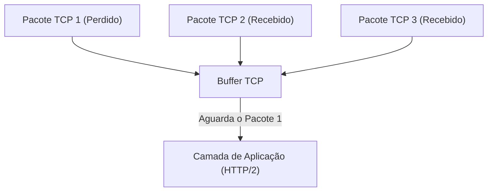
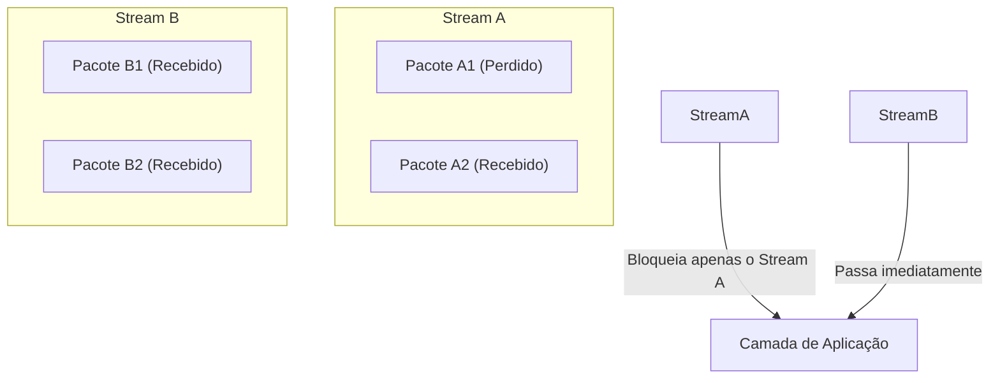
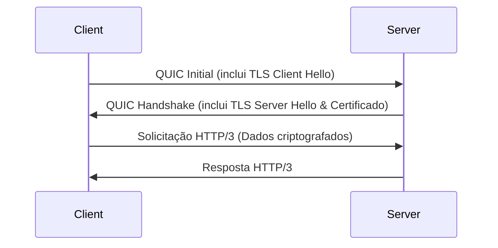
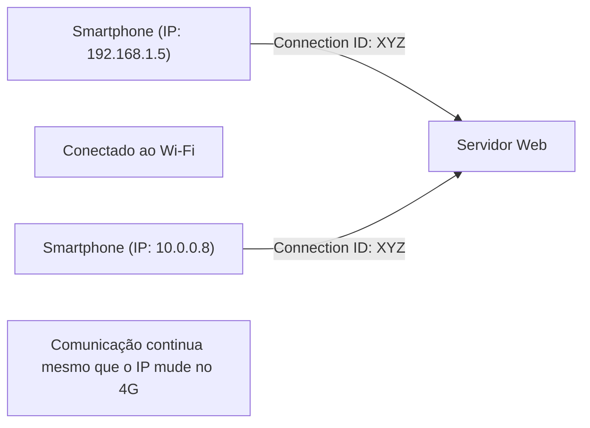

O mundo da Internet está em constante evolução, mas a evolução dos protocolos fundamentais que a sustentam traz, por vezes, transformações tão significativas que são chamadas de mudanças de paradigma. Neste artigo, exploraremos o "HTTP/3", o novo padrão para comunicação Web, e o seu protocolo de camada de transporte subjacente, o "QUIC (Quick UDP Internet Connections)". Analisaremos a fundo o contexto técnico e os mecanismos detalhados de por que ele abandonou o TCP, há muito tempo familiar, para adotar o UDP.

## 1. Introdução: A evolução da comunicação Web e os limites do TCP

Desde os primórdios da Web, na década de 1990, o TCP (Transmission Control Protocol) sempre foi utilizado como base para a comunicação HTTP. O TCP possui mecanismos complexos, como controle de ordem de pacotes, controle de retransmissão e controle de congestionamento, para garantir uma "comunicação confiável". No entanto, à medida que as páginas Web se tornaram mais ricas e surgiu a necessidade de baixar inúmeras imagens e scripts de uma só vez, as limitações do design do TCP começaram a se manifestar como um gargalo.

### 1.1 O problema do HTTP/1.1: Limite de conexões simultâneas
No HTTP/1.1, uma solicitação e uma resposta são processadas sequencialmente sobre uma única conexão TCP (havia também um mecanismo de pipelining, mas que não se tornou amplamente popular). Por isso, para obter vários recursos simultaneamente, o navegador precisava estabelecer múltiplas conexões TCP com o servidor. No entanto, o número de conexões que um navegador pode estabelecer com o mesmo domínio geralmente é limitado a cerca de seis, o que causava atrasos na espera para obter os recursos.

### 1.2 Melhorias com o HTTP/2 e novos problemas
Para resolver esse problema, o HTTP/2 introduziu o conceito de "streams", permitindo que múltiplas solicitações e respostas fossem multiplexadas (multiplexing) sobre uma única conexão TCP. Isso eliminou o gargalo causado pela limitação do número de conexões.

No entanto, como o HTTP/2 ainda opera sobre o TCP, ele enfrentou um problema fundamental. Trata-se do **bloqueio de início de fila (Head-of-Line Blocking, ou HoL Blocking) no nível do TCP**.

O TCP garante rigorosamente a ordem dos pacotes. Portanto, se o Pacote 1 for perdido na rede (packet loss), mesmo que os Pacotes 2 e 3 já tenham chegado ao servidor, o TCP não pode passar os Pacotes 2 e 3 para a camada de aplicação (HTTP/2) até que a retransmissão do Pacote 1 seja concluída. No HTTP/2, como múltiplos streams compartilham uma única conexão TCP, a perda de um único pacote causava a grave consequência de interromper também a comunicação de outros streams totalmente não relacionados.

## 2. O nascimento do protocolo QUIC: Adoção do UDP

Concluindo que melhorias no TCP não poderiam resolver esse bloqueio HoL, o Google adotou uma abordagem totalmente nova. Isso resultou no desenvolvimento do protocolo "QUIC". O QUIC abandonou o TCP, que está profundamente integrado ao espaço do kernel do sistema operacional e é difícil de modificar (ossificação de protocolo), e foi construído com base no **UDP (User Datagram Protocol)**, que possui uma estrutura simples e alta flexibilidade.

O UDP é um protocolo "não confiável" que não possui garantias de ordem ou controle de retransmissão como o TCP. No entanto, o QUIC implementa sobre esse UDP os controles de confiabilidade que o TCP possuía, além de recursos mais avançados (controle de stream, criptografia, etc.) no espaço do aplicativo (espaço do usuário).

### 2.1 Resolução do bloqueio HoL no QUIC
A maior inovação do QUIC reside em realizar o controle de ordem e de retransmissão de forma independente para cada stream.

Mesmo em caso de perda de um pacote, apenas o stream ao qual esse pacote pertence fica aguardando retransmissão (bloqueado), não afetando em nada os outros streams. Com isso, o bloqueio HoL na camada TCP, que era um problema no HTTP/2, foi totalmente resolvido.

## 3. Integração de criptografia e aceleração do handshake

Outro conceito de design crucial do QUIC é que ele é "criptografado por padrão". Nas comunicações HTTPS tradicionais, após a conclusão do handshake TCP (handshake de 3 vias), era necessário realizar o handshake TLS (Transport Layer Security), o que causava uma latência significativa (RTT: Round Trip Time) antes do início da comunicação.

### 3.1 Handshake tradicional (TCP + TLS 1.3)
1. Cliente -> Servidor: TCP SYN
2. Servidor -> Cliente: TCP SYN+ACK
3. Cliente -> Servidor: TCP ACK & TLS Client Hello
4. Servidor -> Cliente: TLS Server Hello & Certificado
5. Cliente -> Servidor: Solicitação HTTP (Primeiro envio de dados aqui)
Total: 2-RTT a 3-RTT

### 3.2 Handshake do QUIC (Integração de transporte e criptografia)
O QUIC integra os mecanismos do TLS 1.3 em seu protocolo. Isso permitiu que o estabelecimento da conexão e a troca de chaves de criptografia fossem realizados em um único handshake.

Na primeira conexão, a comunicação pode começar com apenas **1-RTT**. Além disso, para servidores aos quais já se conectou no passado (quando retém um ticket de sessão, etc.), ele possibilita o **0-RTT (Zero Round Trip Time)**, enviando dados do aplicativo desde o primeiro pacote. Isso reduz drasticamente o tempo de carregamento inicial das páginas Web.

## 4. "Migração de Conexão" para suportar ambientes móveis

O uso da Internet hoje em dia é centrado em dispositivos móveis, como smartphones. Um desafio específico dos ambientes móveis é a "troca de rede". Por exemplo, ao sair de casa (Wi-Fi) e mudar para uma rede móvel (4G/5G), o endereço IP do dispositivo muda.

O TCP identifica as conexões por um conjunto de 4 elementos (4-tuple): "IP de origem, porta de origem, IP de destino e porta de destino". Assim, se a mudança do Wi-Fi para o 4G alterar o endereço IP, a conexão TCP é interrompida, e é necessário reiniciar o handshake desde o início. Isso causava a interrupção da reprodução de vídeos ou a queda de chamadas Web em movimento.

### 4.1 Transição perfeita com Connection ID
O QUIC usa um **ID de conexão (Connection ID)** criptografado em vez de endereços IP e números de porta para identificar as conexões.

Mesmo que o endereço IP mude, o cliente e o servidor continuam a usar o mesmo Connection ID, permitindo que a comunicação continue perfeitamente sem restabelecer a conexão. Isso é chamado de **Migração de Conexão (Connection Migration)**. Com esse recurso, a experiência do usuário (UX) em ambientes móveis melhora dramaticamente.

## 5. O papel do HTTP/3

O QUIC desempenha o papel da camada de transporte (uma alternativa ao TCP), e o protocolo da camada de aplicação que roda sobre ele é o **HTTP/3**.
O HTTP/3 possui a mesma semântica básica (métodos GET e POST, cabeçalhos, códigos de status, etc.) que o HTTP/2, mas foi otimizado para acompanhar a mudança da base para o QUIC. Por exemplo, o método de compressão de cabeçalhos HTTP foi alterado do HPACK, usado no HTTP/2, para o **QPACK**, que é otimizado para a independência dos streams do QUIC.

## 6. Adoção do QUIC e HTTP/3 e perspectivas futuras

Atualmente, grandes empresas de tecnologia, como Google, Cloudflare e Meta, estão liderando a adoção do HTTP/3, e os principais navegadores (Chrome, Edge, Firefox, Safari) o suportam por padrão.

### Desafios na adoção
Como é baseado em UDP, há casos em que os pacotes UDP são restritos ou não otimizados em roteadores e firewalls corporativos tradicionais (bloqueio de UDP), sendo apontado como um desafio o fato de ocorrer, em alguns ambientes, um fallback para o TCP (regressão para o HTTP/2). Além disso, há o desafio de aumentar a carga de CPU no lado do servidor, pois historicamente o processamento de pacotes UDP não tem avançado tanto nas otimizações de kernel de sistemas operacionais (como o hardware offloading) quanto o TCP.

Entretanto, esses desafios estão sendo superados rapidamente devido à evolução do hardware e à otimização de software.

## 7. Conclusão

O HTTP/3 e o QUIC representam uma das atualizações mais importantes na história da Internet. Ao se libertar das amarras do TCP (como o bloqueio HoL e handshakes excessivos) e reconstruir uma camada de transporte moderna e segura sobre o UDP, alcançou-se uma Web verdadeiramente "rápida, ininterrupta e segura".

Para os desenvolvedores, simplesmente migrando a infraestrutura para uma CDN com suporte a HTTP/3 (como Cloudflare ou AWS CloudFront), é possível entregar a maior parte desses benefícios aos usuários finais. Na busca pela otimização da performance Web, entender e aproveitar adequadamente a mudança de paradigma do HTTP/3 será essencial de agora em diante.
