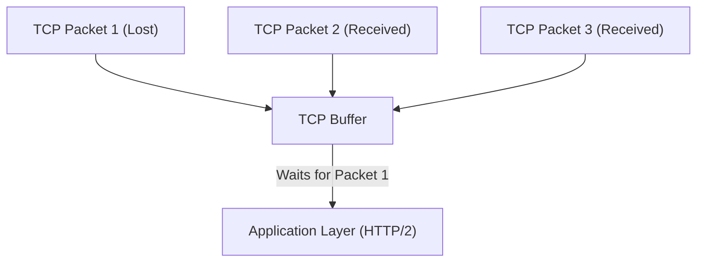
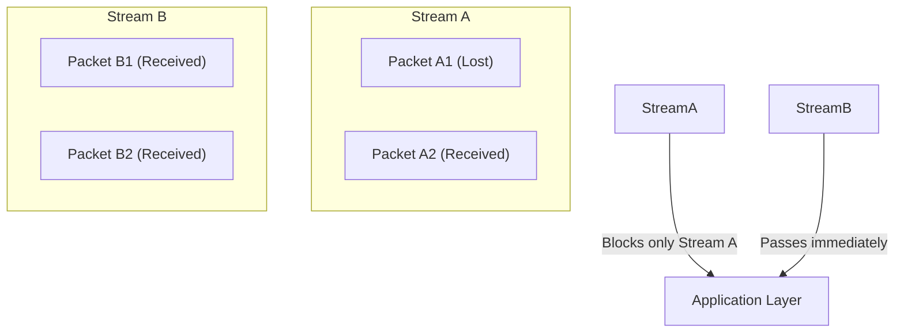
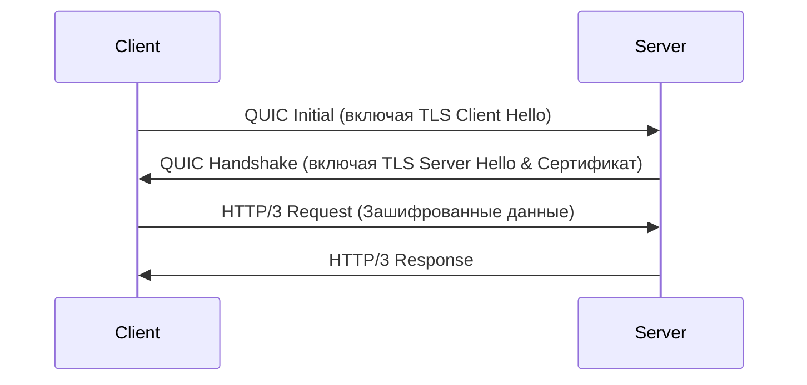
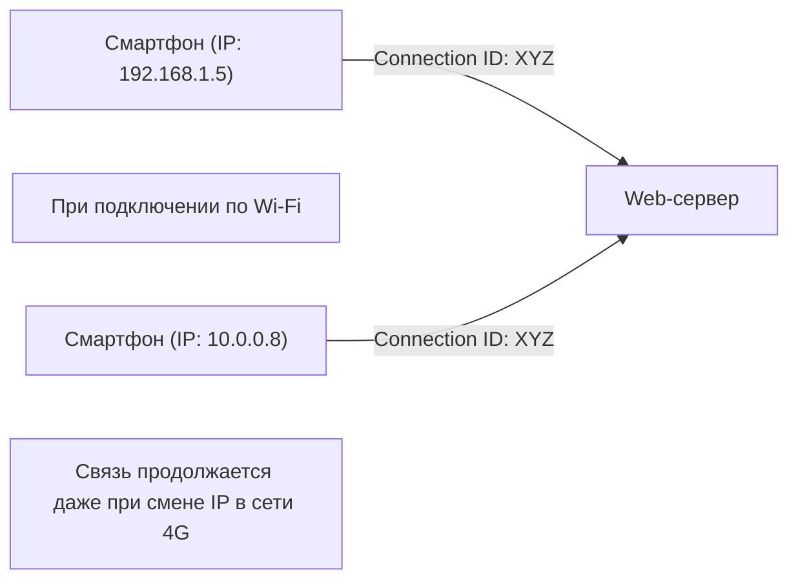

Мир Интернета постоянно развивается, но эволюция протоколов, лежащих в его основе, порой приносит настолько масштабные изменения, что их называют сменой парадигмы. В этой статье мы подробно рассмотрим «HTTP/3», новый стандарт веб-коммуникаций, и базовый протокол транспортного уровня «QUIC (Quick UDP Internet Connections)». Мы выясним технические предпосылки и детальные механизмы того, почему разработчики решили отказаться от привычного TCP в пользу UDP.

## 1. Введение: Эволюция веб-коммуникаций и ограничения TCP

С самого зарождения Веба в 1990-х годах протокол TCP (Transmission Control Protocol) всегда был основой HTTP-коммуникаций. TCP оснащен сложными механизмами, такими как контроль порядка пакетов, управление повторной передачей и контроль перегрузки, чтобы гарантировать «надежную связь». Однако, по мере того как веб-страницы становились более насыщенными и требовали загрузки множества изображений и скриптов одновременно, ограничения архитектуры TCP превратились в узкое место.

### 1.1 Проблема HTTP/1.1: Ограничение количества одновременных соединений
В HTTP/1.1 один TCP-запрос и ответ обрабатываются последовательно в рамках одного соединения (существовал механизм конвейерной обработки, но он не получил широкого распространения). Поэтому, чтобы получать несколько ресурсов одновременно, браузеру приходилось открывать несколько TCP-соединений с сервером. Однако количество соединений, которые браузер может установить с одним доменом, обычно ограничено примерно шестью, что приводило к задержкам в ожидании получения ресурсов.

### 1.2 Улучшения в HTTP/2 и новые проблемы
Чтобы решить эту проблему, в HTTP/2 была введена концепция «потоков», позволяющая мультиплексировать несколько запросов и ответов поверх одного TCP-соединения. Это устранило узкое место, связанное с ограничением количества соединений.

Однако HTTP/2 все еще работал поверх TCP, поэтому столкнулся с фундаментальной проблемой. Это **блокировка начала очереди на уровне TCP (Head-of-Line Blocking, HoL Blocking)**.

TCP строго гарантирует порядок пакетов. Поэтому, если пакет 1 теряется в сети (потеря пакета), даже если пакеты 2 и 3 уже достигли сервера, TCP не может передать их прикладному уровню (HTTP/2), пока не завершится повторная передача пакета 1. Поскольку в HTTP/2 несколько потоков разделяют одно TCP-соединение, потеря всего лишь одного пакета приводила к серьезным последствиям: она останавливала передачу данных даже в совершенно не связанных с ним потоках.

## 2. Рождение протокола QUIC: Переход на UDP

Поняв, что модификации TCP не смогут решить проблему HoL-блокировки, компания Google применила совершенно новый подход. Так началась разработка протокола «QUIC». Вместо того чтобы пытаться изменить TCP, который глубоко интегрирован в пространство ядра ОС и трудно поддается модификации (окостенение протокола), QUIC был построен на основе **UDP (User Datagram Protocol)** — протокола с простой и гибкой структурой.

Хотя UDP — это «ненадежный» протокол, не имеющий гарантий порядка следования или управления повторной передачей, как TCP, QUIC реализует механизмы надежности TCP и еще более продвинутые функции (управление потоками, шифрование и т.д.) поверх UDP в пространстве пользователя (application space).

### 2.1 Устранение HoL-блокировки в QUIC
Главная инновация QUIC заключается в независимом контроле порядка и повторной передачи для каждого потока.

Даже в случае потери пакета блокируется (ожидает повторной передачи) только тот поток, которому принадлежит этот пакет, не оказывая абсолютно никакого влияния на другие потоки. Таким образом, проблема HoL-блокировки на уровне TCP, характерная для HTTP/2, была полностью устранена.

## 3. Интеграция шифрования и ускорение рукопожатия

Еще один важный принцип архитектуры QUIC заключается в том, что он «зашифрован по умолчанию». В традиционных HTTPS-соединениях после завершения рукопожатия TCP (тройного рукопожатия) необходимо было выполнить рукопожатие TLS (Transport Layer Security), что приводило к значительной задержке (RTT: Round Trip Time) до начала передачи данных.

### 3.1 Традиционное рукопожатие (TCP + TLS 1.3)
1. Клиент -> Сервер: TCP SYN
2. Сервер -> Клиент: TCP SYN+ACK
3. Клиент -> Сервер: TCP ACK & TLS Client Hello
4. Сервер -> Клиент: TLS Server Hello & Сертификат
5. Клиент -> Сервер: HTTP Request (только здесь начинается отправка данных)
Итого: 2-RTT〜3-RTT

### 3.2 Рукопожатие QUIC (Интеграция транспорта и шифрования)
QUIC интегрирует механизмы TLS 1.3 непосредственно в сам протокол. Это позволяет осуществлять установку соединения и обмен ключами шифрования за одно рукопожатие.

При первоначальном подключении связь может начаться всего за **1-RTT**. Более того, для серверов, с которыми ранее уже устанавливалось соединение (если сохранились сессионные билеты и т. д.), реализуется подключение **0-RTT (Zero Round Trip Time)**, при котором данные приложения отправляются уже в самом первом пакете. Это кардинально сокращает время начальной загрузки веб-страниц.

## 4. «Миграция соединений», поддерживающая мобильные сети

Современный интернет в основном используется с мобильных устройств, таких как смартфоны. Специфической проблемой мобильной среды является «переключение сетей». Например, при выходе из дома и переключении с домашнего Wi-Fi на мобильную сеть (4G/5G) IP-адрес устройства меняется.

TCP идентифицирует соединение по четырем параметрам (4-tuple): «IP источника, порт источника, IP назначения, порт назначения». Поэтому, когда при переходе с Wi-Fi на 4G меняется IP-адрес, TCP-соединение разрывается, и рукопожатие приходится начинать заново. Это служило причиной остановок при воспроизведении видео на ходу или обрывов веб-звонков.

### 4.1 Плавный переход с помощью Connection ID
Для идентификации соединения QUIC использует не IP-адрес или номер порта, а зашифрованный **идентификатор соединения (Connection ID)**.

Даже если IP-адрес изменится, клиент и сервер продолжат использовать один и тот же Connection ID, что позволяет бесшовно продолжать передачу данных без необходимости переустанавливать соединение. Эта функция называется **Миграцией соединения (Connection Migration)**. Благодаря ей пользовательский опыт (UX) в мобильной среде значительно улучшается.

## 5. Роль HTTP/3

QUIC выполняет роль транспортного уровня (заменяя TCP), а **HTTP/3** — это протокол прикладного уровня, работающий поверх него.
В HTTP/3 базовая семантика (методы GET и POST, заголовки, коды состояний и т. д.) остается такой же, как в HTTP/2, but она оптимизирована с учетом перехода на базу QUIC. Например, метод сжатия HTTP-заголовков изменился с HPACK в HTTP/2 на **QPACK**, который оптимизирован для независимости потоков в QUIC.

## 6. Распространение QUIC и HTTP/3, и перспективы на будущее

В настоящее время внедрение HTTP/3 активно продвигается, в первую очередь такими крупными технологическими компаниями, как Google, Cloudflare и Meta. Основные браузеры (Chrome, Edge, Firefox, Safari) также поддерживают его по умолчанию.

### Проблемы внедрения
Поскольку протокол основан на UDP, существуют случаи, когда UDP-пакеты ограничиваются или не оптимизируются корпоративными брандмауэрами и маршрутизаторами (UDP-блокировка), что в некоторых средах приводит к откату к TCP (возврат к HTTP/2). Кроме того, исторически сложилось так, что обработка пакетов UDP в ядрах ОС не так оптимизирована (например, аппаратная разгрузка), как TCP, что может вызывать повышенную нагрузку на CPU на стороне сервера.

Однако эти проблемы стремительно решаются благодаря развитию аппаратного обеспечения и программной оптимизации.

## 7. Заключение

HTTP/3 и QUIC — одни из самых важных обновлений в истории Интернета. Освободившись от недостатков TCP (таких как HoL-блокировка и избыточные рукопожатия) и перестроив современный и безопасный транспортный уровень поверх UDP, мы смогли достичь по-настоящему «быстрого, непрерывного и безопасного Веба».

Разработчикам достаточно перевести свою инфраструктуру на CDN, поддерживающие HTTP/3 (например, Cloudflare или AWS CloudFront), чтобы предоставить конечным пользователям большинство этих преимуществ. Правильное понимание и использование сдвига парадигмы HTTP/3 станет неотъемлемой частью стремления к оптимизации веб-производительности в будущем.
