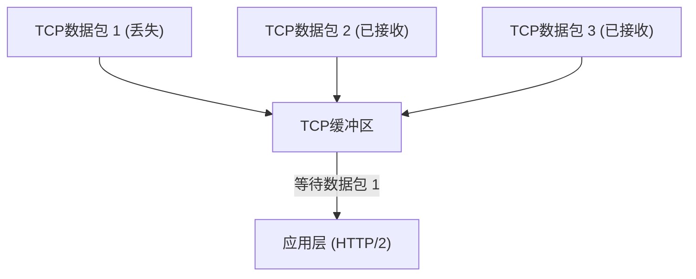
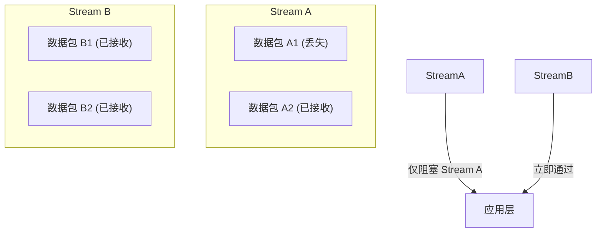
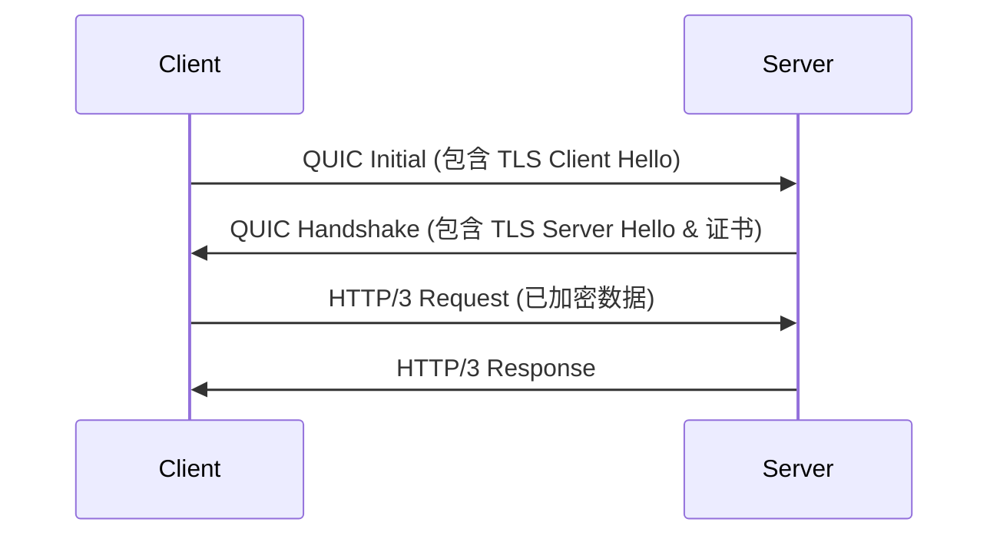
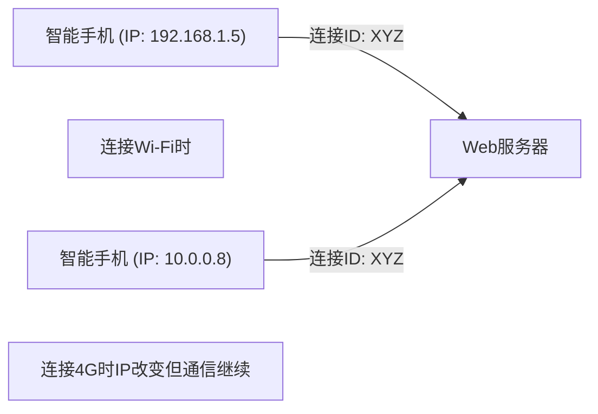

互联网世界一直在不断发展，支撑其根基的协议演进有时会带来堪称“范式转变”的巨大变革。本文将深入探讨Web通信的新标准“HTTP/3”及其底层的传输层协议“QUIC (Quick UDP Internet Connections)”，分析为什么我们要放弃多年来广泛使用的TCP转而采用UDP，并深入挖掘其技术背景和详细机制。

## 1. 引言：Web通信的演进与TCP的局限性

自20世纪90年代Web诞生之初，HTTP通信的底层始终使用TCP (Transmission Control Protocol)。为了保证“可靠的通信”，TCP具备了数据包排序、重传控制、拥塞控制等复杂的机制。然而，随着Web页面变得越来越丰富，需要一次性下载大量图片和脚本，TCP在设计上的局限性逐渐成为瓶颈。

### 1.1 HTTP/1.1的挑战：并发连接数的限制
在HTTP/1.1中，一个TCP连接上依次处理一个请求和响应（虽然有管线化机制，但并未广泛普及）。因此，为了同时获取多个资源，浏览器需要向服务器建立多个TCP连接。但是，浏览器对同一域名的连接数通常限制在6个左右，导致资源获取需要排队等待。

### 1.2 HTTP/2的改进与新问题
为了解决这个问题，HTTP/2引入了“流 (Stream)”的概念，允许在一个TCP连接上多路复用多个请求和响应。这消除了由于连接数限制造成的瓶颈。

然而，由于HTTP/2仍然运行在TCP之上，它面临了一个根本性的问题，即**TCP级别的队头阻塞 (Head-of-Line Blocking, HoL Blocking)**。

TCP严格保证数据包的顺序。因此，如果数据包1在网络中丢失（丢包），即使数据包2和数据包3已经到达服务器，TCP也无法在数据包1重传完成之前将数据包2和3传递给应用层（HTTP/2）。在HTTP/2中，由于多个流共享同一个TCP连接，仅仅一个丢包就会导致完全无关的其他流的通信也被迫停止，引发严重的问题。

## 2. QUIC协议的诞生：采用UDP

Google认为对TCP的改进无法解决这种HoL阻塞，因此采取了全新的方法，这就是“QUIC”协议的开发。QUIC放弃了深深嵌入操作系统内核空间且难以修改（协议僵化）的TCP，转而基于结构简单、灵活性高的**UDP (User Datagram Protocol)** 构建。

UDP是一种不像TCP那样具有顺序保证和重传控制的“不可靠”协议，但QUIC在UDP之上，在应用空间（用户空间）实现了TCP原有的可靠性控制以及更高级的功能（如流控制、加密等）。

### 2.1 QUIC如何消除HoL阻塞
QUIC最大的创新在于它对每个流独立进行顺序控制和重传控制。

即使发生丢包，也只有该数据包所属的流需要等待重传（阻塞），而完全不会影响其他流。这样，HTTP/2中备受困扰的TCP层HoL阻塞问题得到了彻底解决。

## 3. 加密的集成与握手加速

QUIC的另一个重要设计理念是“默认加密”。在传统的HTTPS通信中，在完成TCP握手（三次握手）之后，还需要进行TLS (Transport Layer Security) 握手，导致通信开始前产生很大的延迟（RTT：往返时间）。

### 3.1 传统的握手 (TCP + TLS 1.3)
1. 客户端 -> 服务端: TCP SYN
2. 服务端 -> 客户端: TCP SYN+ACK
3. 客户端 -> 服务端: TCP ACK & TLS Client Hello
4. 服务端 -> 客户端: TLS Server Hello & 证书
5. 客户端 -> 服务端: HTTP Request (此时才首次发送数据)
总计: 2-RTT至3-RTT

### 3.2 QUIC的握手 (传输与加密的集成)
QUIC将TLS 1.3的机制集成到了协议内部。这使得连接的建立和加密密钥的交换可以在一次握手中完成。

首次连接时仅需 **1-RTT** 即可开始通信。此外，对于曾经连接过的服务器（如果保留了会话票证等），QUIC实现了从第一个数据包即可包含应用程序数据发送的 **0-RTT (零往返时间)**。这极大地缩短了Web页面的初始加载时间。

## 4. 支撑移动环境的“连接迁移”

现代互联网的使用以智能手机等移动设备为主。移动环境特有的一个挑战是“网络切换”。例如，从家里的Wi-Fi切换到外出的移动网络（4G/5G）时，设备的IP地址会发生改变。

TCP使用“源IP、源端口、目的IP、目的端口”这四个元组（4-tuple）来识别连接。因此，当从Wi-Fi切换到4G导致IP地址改变时，TCP连接会被断开，必须从头重新进行握手。这往往是移动中视频播放停止或网络通话断开的原因。

### 4.1 基于连接ID的无缝迁移
QUIC不使用IP地址或端口号，而是使用加密的**连接ID (Connection ID)** 来识别连接。

即使IP地址发生变化，由于客户端和服务器继续使用相同的连接ID，无需重新建立连接即可无缝继续通信。这被称为**连接迁移 (Connection Migration)**。凭借此功能，移动环境下的用户体验 (UX) 得到了飞跃性的提升。

## 5. HTTP/3的角色

QUIC扮演了传输层（替代TCP）的角色，而在其之上运行的应用层协议就是**HTTP/3**。
HTTP/3的基本语义（GET和POST方法、标头、状态码等）与HTTP/2相同，但它针对底层更换为QUIC进行了优化。例如，HTTP标头的压缩方式从HTTP/2的HPACK改为了针对QUIC流独立性进行了优化的**QPACK**。

## 6. QUIC与HTTP/3的普及及未来展望

目前，以Google、Cloudflare、Meta等大型科技公司为中心，HTTP/3的部署正在加速，主流浏览器（Chrome、Edge、Firefox、Safari）也已默认支持。

### 部署面临的挑战
由于基于UDP，在传统的企业防火墙或路由器中可能存在限制或未针对UDP数据包进行优化的情况（UDP阻塞），在部分环境中会发生回退到TCP（退回到HTTP/2）的问题。此外，历史原因导致操作系统内核对UDP数据包处理的优化（如硬件卸载等）不如TCP完善，这也带来了服务器端CPU负载较高的问题。

不过，随着硬件的演进和软件优化的推进，这些问题正在被迅速解决。

## 7. 结论

HTTP/3与QUIC是互联网历史上最重要的更新之一。通过摆脱TCP的束缚（HoL阻塞和过度的握手），并在UDP之上重建现代且安全的传输层，实现了真正意义上“快速、不中断、安全”的Web。

对于开发者而言，只需将基础设施切换到支持HTTP/3的CDN（如Cloudflare或AWS CloudFront等），就能将大部分红利传递给终端用户。在追求Web性能优化的过程中，正确理解并运用HTTP/3的范式转变在未来将是必不可少的。
