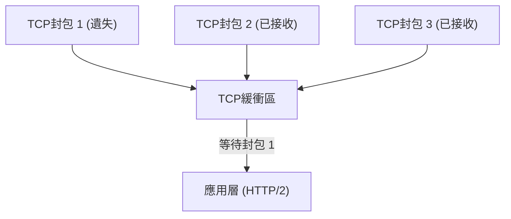
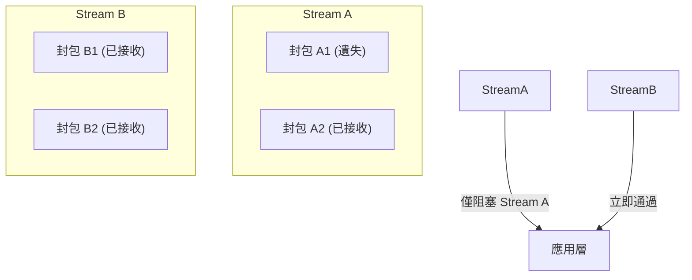
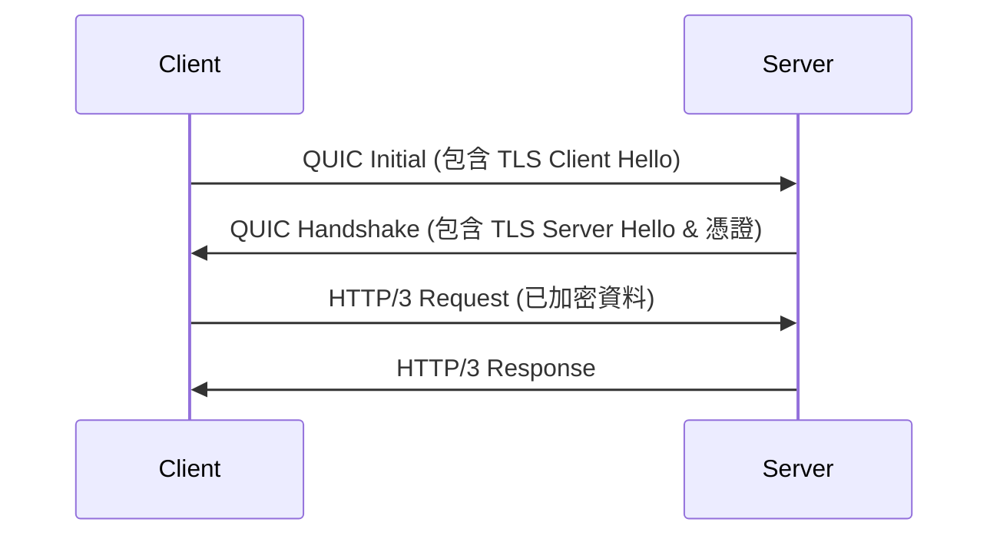
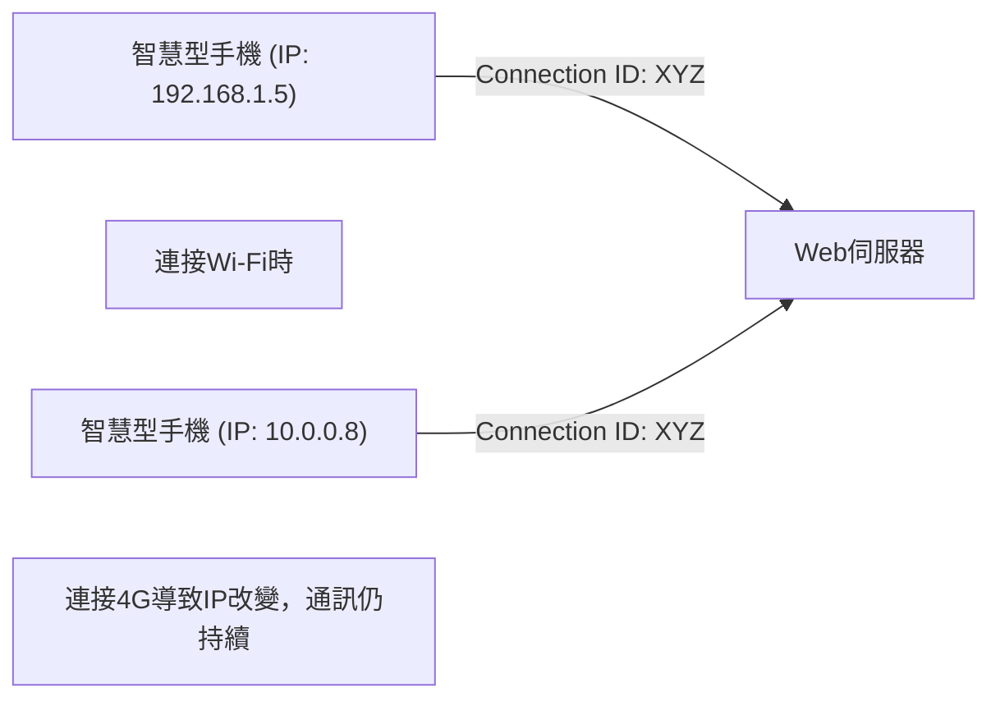

網際網路的世界始終在不斷進化，而支撐其根基的通訊協定演進，有時甚至會帶來被稱為典範轉移（Paradigm Shift）的巨大變革。本文將深入探討Web通訊的新標準「HTTP/3」與其底層傳輸層協定「QUIC（Quick UDP Internet Connections）」，了解為何要捨棄長年使用的TCP而改用UDP，並詳細解析其技術背景與深層機制。

## 1. 前言：Web通訊的進化與TCP的極限

從1990年代Web發展初期開始，HTTP通訊的基礎始終是使用TCP（Transmission Control Protocol）。為了保證「可靠的通訊」，TCP具備了封包順序控制、重傳控制、壅塞控制等複雜的機制。然而，隨著網頁內容變得越來越豐富，需要一次性下載大量圖片與腳本時，TCP在設計上的極限逐漸顯露，成為效能瓶頸。

### 1.1 HTTP/1.1的挑戰：同時連線數的限制
在HTTP/1.1中，會在一個TCP連線上依序處理一個請求與回應（雖然也有管線化 Pipeline 的機制，但並未廣泛普及）。因此，為了同時取得多個資源，瀏覽器必須對伺服器建立多個TCP連線。然而，瀏覽器對單一網域能建立的連線數通常限制在6個左右，這導致了取得資源的等待時間。

### 1.2 HTTP/2的改善與新問題
為了解決這個問題，HTTP/2導入了「串流（Stream）」的概念，允許在一個TCP連線上多工（Multiplexing）處理多個請求與回應。這成功消除了連線數限制所帶來的瓶頸。

但是，由於HTTP/2仍然運行在TCP之上，它面臨到了一個根本性的問題。這就是**TCP層級的隊頭阻塞（Head-of-Line Blocking, HoL Blocking）**。

TCP嚴格保證封包的順序。因此，如果封包1在網路上遺失（Packet Loss），即使封包2與封包3已經抵達伺服器，在封包1完成重傳之前，TCP也無法將封包2與3交給應用層（HTTP/2）。由於HTTP/2中多個串流共用一個TCP連線，僅僅一個封包遺失，就會導致完全無關的其他串流通訊也被迫暫停，引發了嚴重的情況。

## 2. QUIC協定的誕生：採用UDP

Google判斷單靠改良TCP無法解決HoL阻塞問題，於是採取了全新方法。這就是「QUIC」協定的開發。由於TCP深深嵌入在作業系統核心空間（Kernel Space），難以進行修改（Protocol Ossification，協定僵化），因此QUIC放棄了TCP，轉而以結構簡單且具有高靈活性的**UDP（User Datagram Protocol）**為基礎進行建構。

UDP是一個沒有像TCP那樣具備順序保證與重傳控制的「不可靠」協定，但QUIC在UDP之上，將TCP原有的可靠性控制與更進階的功能（如串流控制、加密等）實作在應用空間（User Space）中。

### 2.1 QUIC如何解決HoL阻塞
QUIC最大的創新在於，它對每個串流進行獨立的順序控制與重傳控制。

即使發生封包遺失，也只有該封包所屬的串流會處於等待重傳（阻塞）狀態，對其他串流完全沒有影響。這徹底解決了HTTP/2中因TCP層級導致的HoL阻塞問題。

## 3. 整合加密機制與加速交握

QUIC的另一個重要設計理念是「預設加密」。在傳統的HTTPS通訊中，完成TCP交握（三向交握）後，還必須進行TLS（Transport Layer Security）交握，這在通訊開始前會產生相當大的延遲（RTT：Round Trip Time）。

### 3.1 傳統交握（TCP + TLS 1.3）
1. 用戶端 -> 伺服器: TCP SYN
2. 伺服器 -> 用戶端: TCP SYN+ACK
3. 用戶端 -> 伺服器: TCP ACK & TLS Client Hello
4. 伺服器 -> 用戶端: TLS Server Hello & 憑證
5. 用戶端 -> 伺服器: HTTP Request (這時才首次傳送資料)
總計: 2-RTT 至 3-RTT

### 3.2 QUIC的交握（整合傳輸與加密）
QUIC將TLS 1.3的機制整合到協定內部。這使得建立連線與交換加密金鑰可以在單一交握中完成。

首次連線時，只需 **1-RTT** 即可開始通訊。此外，針對過去曾連線過的伺服器（如果保留了Session Ticket等），它甚至實現了從第一個封包就包含應用程式資料進行傳送的 **0-RTT（零來回通訊延遲）**。這大幅縮短了網頁的初始載入時間。

## 4. 支援行動環境的「連線遷移」

現代的網際網路使用主要以智慧型手機等行動裝置為中心。行動環境特有的一項挑戰是「網路切換」。例如，從家裡的Wi-Fi切換到外出的行動網路（4G/5G）時，裝置的IP位址會發生改變。

TCP是利用「來源IP、來源連接埠、目的IP、目的連接埠」這四個元素（4-Tuple）來識別連線。因此，當從Wi-Fi切換到4G導致IP位址改變時，TCP連線就會中斷，必須從頭重新進行交握。這正是移動中影片播放中斷或網路通話斷線的原因。

### 4.1 透過連線ID實現無縫轉移
QUIC不使用IP位址或連接埠號碼，而是使用加密的 **連線ID（Connection ID）** 來識別連線。

即使IP位址改變，用戶端與伺服器仍繼續使用相同的連線ID，因此無需重新建立連線即可無縫地繼續通訊。這被稱為 **連線遷移（Connection Migration）**。這項功能讓行動環境下的使用者體驗（UX）有了飛躍性的提升。

## 5. HTTP/3的角色

QUIC扮演了傳輸層（TCP的替代方案）的角色，而在其上運行的應用層協定就是 **HTTP/3**。
HTTP/3的基本語義（如GET與POST方法、標頭、狀態碼等）與HTTP/2相同，但它已針對底層改為QUIC進行了最佳化。例如，HTTP標頭的壓縮方式從HTTP/2的HPACK，改為針對QUIC串流獨立性最佳化的 **QPACK**。

## 6. QUIC與HTTP/3的普及與未來展望

目前，以Google、Cloudflare、Meta等大型科技企業為中心，正積極推動HTTP/3的導入，且主流瀏覽器（Chrome、Edge、Firefox、Safari）也已將其作為標準支援。

### 導入面臨的挑戰
由於它基於UDP，在傳統企業防火牆或路由器中，有時會發生UDP封包受到限制或未最佳化的情況（UDP阻擋），這可能導致在部分環境下退回使用TCP（降級至HTTP/2），這是一項挑戰。此外，在歷史上作業系統核心對於UDP封包處理的最佳化（如硬體卸載等）不如TCP成熟，因此也存在伺服器端CPU負載較高的問題。

然而，隨著硬體的進化與軟體的最佳化，這些挑戰正被快速解決。

## 7. 結論

HTTP/3與QUIC是網際網路歷史上最重要的更新之一。藉由擺脫TCP的束縛（HoL阻塞與過度的交握），並在UDP之上重建現代且安全的傳輸層，實現了真正意義上「快速、不中斷、安全」的Web。

對於開發者而言，只需將基礎設施轉移到支援HTTP/3的CDN（如Cloudflare或AWS CloudFront等），就能將這些好處的一大部分帶給終端使用者。在追求Web效能最佳化的過程中，正確理解並活用HTTP/3的典範轉移，將是未來不可或缺的一環。
