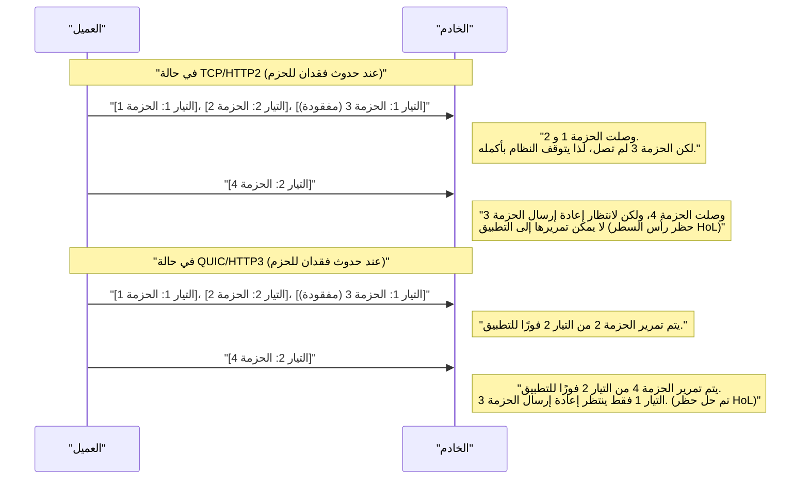
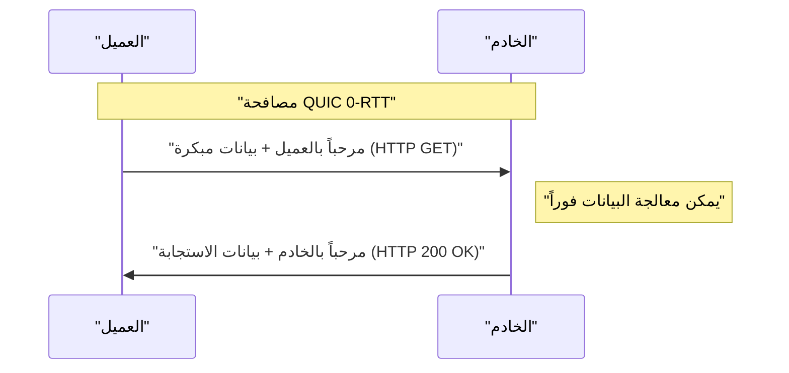

# 1. مقدمة: تطور اتصالات الويب وبداية الجيل القادم

عالم الإنترنت مدعوم بالابتكار التكنولوجي المستمر. وراء المواقع والتطبيقات التي نستخدمها يوميًا، يعمل بروتوكول **HTTP (Hypertext Transfer Protocol)**. بدءًا من HTTP/1.0 الذي ظهر في التسعينيات، وصولاً إلى HTTP/1.1 الذي استخدم لفترة طويلة، ثم HTTP/2 الذي حسّن الأداء بشكل كبير، استمر هذا البروتوكول في التطور.

ومع ذلك، فإن الويب الحديث يفيض بالمحتوى الغني (الصور عالية الدقة، بث الفيديو، وتطبيقات JavaScript المعقدة)، وبدأت تظهر حدود حزمة البروتوكولات التقليدية. على وجه الخصوص، كانت مواصفات **TCP (Transmission Control Protocol)** نفسها، التي دعمت طبقة النقل في الإنترنت لسنوات طويلة، عقبة أمام المزيد من تسريع الويب.

وهنا ظهر **HTTP/3** والبروتوكول الأساسي له **QUIC (Quick UDP Internet Connections)**. يتخلى HTTP/3 عن TCP، ويتبنى نهجًا طموحًا للغاية من خلال بناء طبقة اتصال موثوقة جديدة فوق **UDP (User Datagram Protocol)**.

في هذا المقال، سنشرح بالتفصيل الشديد لماذا كانت هناك حاجة إلى HTTP/3 و QUIC، وما هي حدود TCP التي تم التغلب عليها باستخدام UDP، مع ذكر البنية، والخوارزميات، وأمثلة على الأكواد، والرسوم البيانية.

---

# 2. تاريخ HTTP وحدود TCP

لفهم مدى ابتكار HTTP/3، يجب علينا أولاً أن نفهم بعمق التحديات التي واجهت أسلافه HTTP/1.1 و HTTP/2، أي "حدود TCP".

## 2.1 التطور من HTTP/1.1 إلى HTTP/2 والتحديات المتبقية

في HTTP/1.1، كان يجب معالجة طلب واستجابة واحدة بالتسلسل عبر اتصال TCP واحد. لحل هذه المشكلة، انتشرت حيلة تتمثل في فتح اتصالات TCP متعددة، لكن إنشاء اتصال TCP كان مكلفًا، وكانت هناك قيود على الحد الأقصى لعدد الاتصالات المتزامنة لكل متصفح (عادة 6).

حل HTTP/2 هذه المشكلة من خلال **تعدد الإرسال (Multiplexing)** باستخدام **التيارات (Streams)**. حيث يتم إنشاء عدة تيارات افتراضية داخل اتصال TCP واحد، وتقسيم الطلبات والاستجابات إلى إطارات صغيرة بحيث يمكن تبادلها في نفس الوقت.


بهذا، تم القضاء على "الانتظار في الطابور (حظر رأس السطر في HTTP)" على مستوى HTTP. ومع ذلك، كانت المشكلة الأساسية مخفية في طبقة النقل، أي TCP.

## 2.2 حظر رأس السطر لـ TCP (HoL Blocking)

بروتوكول TCP هو بروتوكول موثوق للغاية يقوم بـ "ضمان الترتيب" و "إعادة إرسال الحزم المفقودة". عندما يرسل المرسل الحزم `1، 2، 3، 4`، يقوم المستقبل دائمًا بتمريرها إلى طبقة التطبيق (HTTP/2) بهذا الترتيب.

إذا فُقدت الحزمة `2` في الشبكة (فقدان الحزم)، فلن يتمكن المستقبل من تمرير الحزم اللاحقة إلى طبقة التطبيق، حتى لو استلم الحزمتين `3` و `4`، حتى يتم إعادة إرسال الحزمة `2` ووصولها. يُطلق على هذا اسم **حظر رأس السطر على مستوى TCP (TCP HoL Blocking)**.

نظرًا لأن HTTP/2 يقوم بمشاركة جميع التيارات على اتصال TCP واحد، فإن مجرد حدوث فقدان لحزمة واحدة يمثل نقطة ضعف قاتلة تؤدي إلى **إيقاف مؤقت للاتصال في جميع التيارات**. في بيئات شبكات الهاتف المحمول حيث يتكرر فقدان الحزم، كان من الممكن أن ينخفض أداء HTTP/2 ليصبح أسوأ من HTTP/1.1 في بعض الحالات.

## 2.3 تأخير المصافحة (تراكم RTT)

بروتوكول TCP هو بروتوكول موجه للاتصال، ويتطلب **مصافحة ثلاثية (3-way handshake)** قبل بدء الاتصال. بالإضافة إلى ذلك، تُضاف مصافحة التشفير (TLS) التي أصبحت ضرورية للويب الحديث.

في بيئة TCP + TLS 1.2، يستغرق إنشاء الاتصال وقتًا يعادل عدة أضعاف وقت الذهاب والإياب (RTT).

*   **مصافحة TCP:** $ 1 \text{ RTT} $
*   **مصافحة TLS:** $ 2 \text{ RTT} $ (في حالة TLS 1.2)

يتم استهلاك إجمالي $ 3 \text{ RTT} $ من الوقت قبل إرسال أول طلب HTTP. بالنظر إلى وجود حد لقانون الفيزياء المتمثل في سرعة الضوء، فمن المستحيل جعل RTT نفسه صفرًا (على سبيل المثال، يبلغ RTT في الاتصال بين اليابان والساحل الغربي للولايات المتحدة حوالي 100 مللي ثانية). لذلك، كان تقليل عدد مرات RTT اللازمة لإنشاء الاتصال شرطًا مطلقًا لتحسين الأداء.

## 2.4 غياب تنقلية IP (انقطاع الاتصال)

يُعرّف بروتوكول TCP نقاط النهاية التي تتواصل من خلال **مزيج من 4 عناصر وهي عنوان IP ورقم المنفذ (Source IP, Source Port, Destination IP, Destination Port)**.

عندما يتم تبديل الاتصال من Wi-Fi إلى شبكة 4G/5G على هاتف ذكي، يتغير عنوان IP الخاص بالجهاز. عندما يتغير عنوان IP، يعتبر TCP ذلك اتصالًا مختلفًا، وبالتالي يتم قطع اتصال TCP الحالي. إذا كنت تقوم ببث مقطع فيديو أو تنزيل ملف كبير، فستحتاج إلى إعادة إنشاء الاتصال من الصفر، مما يؤثر سلبًا بشكل كبير على تجربة المستخدم (UX).

---

# 3. ولادة QUIC: رسم عالم جديد على قماش UDP

تم تطوير **QUIC (Quick UDP Internet Connections)** في البداية بواسطة Google ثم تم توحيده لاحقًا في IETF (Internet Engineering Task Force) للتغلب على حدود TCP هذه.

المفاجأة الأكبر في QUIC هي التخلي عن TCP، الذي كان أساس الإنترنت لسنوات طويلة، وتبني **UDP (User Datagram Protocol)** كقاعدة له.

## 3.1 لماذا تم اختيار UDP بدلاً من تحسين TCP؟

قد تتساءل، "إذا كانت هناك مشكلة في TCP، فلماذا لا نقوم فقط بتحديث إصدار TCP نفسه؟". ومع ذلك، كان ذلك صعبًا للغاية من الناحية الواقعية.

السبب الأكبر لذلك هو **تصلب الصناديق الوسطى (Middlebox Ossification)**.
تقوم أجهزة الشبكة (الصناديق الوسطى) على الإنترنت، مثل أجهزة التوجيه وجدران الحماية و NAT (Network Address Translation) وموازنات الحمل، بتفسير مواصفات TCP بعمق (مثل بنية الرأس وسلوك العلامات) وإجراء التحسينات والتحققات الأمنية.

إذا تمت إضافة علامة جديدة إلى رأس TCP، أو تم إنشاء إصدار جديد من TCP، فإن عددًا لا يحصى من الصناديق الوسطى القديمة حول العالم ستقوم بتجاهله باعتباره "حزمة غير صالحة". يُطلق على هذا اسم **تصلب البروتوكول (Protocol Ossification)**.

من ناحية أخرى، UDP هو بروتوكول بسيط للغاية يحتوي فقط على معلومات منفذ الوجهة، ومنفذ المصدر، والمجموع الاختباري (Checksum). كما لا تتدخل الصناديق الوسطى بعمق في محتوى UDP.
لذلك، تم اعتماد النهج التالي: **"على قماش UDP الأبيض، قم بإعادة تنفيذ كل شيء مثل التحكم الموثوق به والتشفير TLS الخاص بـ TCP في مساحة المستخدم (مكان قريب من طبقة التطبيق)"**. هذا هو QUIC.

## 3.2 حزمة بروتوكولات QUIC

تبدو حزمة بروتوكولات HTTP/3 التي قدمت QUIC كما يلي:

```mermaid
flowchart TD
    subgraph "HTTP/3 Stack ["حزمة HTTP/3"]"
        H3["HTTP/3 (دلالات HTTP، QPACK)"]
        QUIC["QUIC (تعدد الإرسال، التحكم في الازدحام، TLS 1.3)"]
        UDP["UDP"]
        IP["IP"]
    end
    
    subgraph "HTTP/2 Stack ["حزمة HTTP/2"]"
        H2["HTTP/2 (HPACK)"]
        TLS["TLS 1.2 / 1.3"]
        TCP["TCP"]
        IP2["IP"]
    end
    
    H3 --> QUIC
    QUIC --> UDP
    UDP --> IP
    
    H2 --> TLS
    TLS --> TCP
    TCP --> IP2
```

يدمج QUIC ميزة تعدد الإرسال (التيارات) التي كانت موجودة في HTTP/2، وميزات التحكم في الازدحام واسترداد الحزم المفقودة التي كانت موجودة في TCP، وميزة التشفير في TLS 1.3، في طبقة واحدة.

---

# 4. الميزات والحلول المبتكرة التي يقدمها QUIC

كيف نجح QUIC في حل حدود TCP المذكورة أعلاه؟ سنلقي نظرة تفصيلية على التقنيات المبتكرة الأساسية.

## 4.1 القضاء على HoL Blocking في طبقة النقل

تخلى QUIC عن "ضمان الترتيب للاتصال بأكمله" مثل TCP، وقدم **"ضمان الترتيب لكل تيار"**.

توجد عدة تيارات مستقلة داخل QUIC، وتحمل كل حزمة معلومات حول التيار الذي تنتمي إليه. في حالة فقدان حزمة، فإن ما يوضع في الانتظار هو **فقط التيار الذي تنتمي إليه الحزمة المفقودة**. سيتم تسليم الحزم التي تنتمي إلى تيارات أخرى إلى طبقة التطبيق (HTTP/3) دون أن تتأثر بالفقدان.



أدى هذا إلى تحسين الأداء بشكل كبير في بيئات الشبكات غير المستقرة المعرضة لفقدان الحزم (مثل شبكات الهاتف المحمول وشبكات Wi-Fi العامة المزدحمة).

## 4.2 تسريع إنشاء الاتصال (1-RTT و 0-RTT)

تم تصميم QUIC لإجراء مصافحة طبقة النقل ومصافحة التشفير (TLS 1.3) **في نفس الوقت**.

مع خادم تتواصل معه لأول مرة، تكتمل المصافحة وتبادل مفاتيح التشفير في **1-RTT**، ويمكنك البدء في إرسال البيانات فورًا. مقارنةً بـ $ 3 \text{ RTT} $ في TCP+TLS1.2، فهذا في حد ذاته تطور جذري.

علاوة على ذلك، يقدم QUIC ميزة سحرية تسمى **0-RTT (Zero Round Trip Time)** للخوادم التي تواصلت معها مسبقًا.
يستخدم العميل تذكرة الجلسة والمعلمات المستلمة من الخادم في الاتصال السابق لإرسال بيانات طلب HTTP (مثل طلب GET) على الفور في أول حزمة مصافحة (ClientHello).



هذا يجعل التأخير النظري لبدء الاتصال صفرًا. ومع ذلك، فإن بيانات 0-RTT تنطوي على مخاطر أمنية تتمثل في الضعف أمام **هجوم إعادة الإرسال (Replay Attack)**. لذلك، يقتصر استخدام 0-RTT على الطلبات الآمنة التي تتمتع بـ "تكرار الإجراء" (Idempotence) بحيث تكون النتيجة واحدة بغض النظر عن عدد مرات التنفيذ، مثل طلبات GET.

## 4.3 نقل الاتصال (Connection Migration)

للتغلب على ضعف TCP الذي ينقطع عندما يتغير عنوان IP، يقوم QUIC بإدارة الاتصالات ليس باستخدام عناوين IP وأرقام المنافذ، بل بمعرف فريد يسمى **معرف الاتصال (Connection ID)**.

يتم تضمين معرف الاتصال في رأس حزمة QUIC بدون تشفير (بحيث يمكن توجيهه).

لنفترض أن المستخدم خرج من نطاق شبكة Wi-Fi وانتقل إلى شبكة 4G/5G، وتغير عنوان IP للهاتف الذكي. سيرسل عميل QUIC حزمة من عنوان IP الجديد، ولكن تلك الحزمة ستحتوي على "معرف الاتصال" الحالي.
يكتشف الخادم أن عنوان IP قد تغير، ولكن نظرًا لمطابقة معرف الاتصال، فإنه يعتبر ذلك "استمرارًا لنفس الاتصال" ويستمر في التواصل دون إعادة المصافحة.

بفضل هذه الميزة، تم تحقيق تبديل سلس للاتصال في البيئات المتنقلة، وانخفض توقف التخزين المؤقت للفيديو وفشل التنزيل بشكل كبير.

---

# 5. HTTP/3: دلالات HTTP على QUIC

بروتوكول QUIC نفسه ليس مخصصًا لـ HTTP حصريًا، بل هو بروتوكول نقل للأغراض العامة. المواصفات لتشغيل دلالات HTTP (الطرق، الرؤوس، رموز الحالة، وما إلى ذلك) فوق هذا الـ QUIC هي **HTTP/3**.

يرث HTTP/3 أساسًا مفاهيم HTTP/2، ولكن نظرًا لأن الطبقة الأساسية تغيرت من TCP إلى QUIC، فقد تم إجراء العديد من التغييرات المهمة.

## 5.1 ضغط الرأس باستخدام QPACK

في HTTP/2، تم استخدام خوارزمية ضغط الرأس تسمى **HPACK**. يحتفظ HPACK بجدول ديناميكي (Dynamic Table) على كلا طرفي الاتصال، ويقلل من حجم البيانات المرسلة عن طريق إرسال الرؤوس باستخدام أرقام الفهرس فقط بمجرد إرسالها لأول مرة.

ومع ذلك، كان HPACK يعتمد بالكامل على "ضمان الترتيب" لبروتوكول TCP. وهذا يعني أنه في حالة فقدان كتلة رأس وانتظار إعادة الإرسال، فإن رؤوس التيارات اللاحقة لا يمكن فك تشفيرها حتى يتم تحديث الجدول الديناميكي المعتمد عليه، وهو ما يُعرف بوجود HoL Blocking ناتج عن HPACK.

نظرًا لأن QUIC لا يضمن ترتيب التيارات، فإذا استخدمت HPACK كما هو، فإن تزامن الجدول الديناميكي سيختل عندما يتغير ترتيب وصول التيارات.

لحل هذه المشكلة، تم تصميم **QPACK** حديثًا. في QPACK، تم فصل تحديث الجدول الديناميكي عن كل تيار بيانات، وتم إدخال آلية لإدارة الجدول بشكل غير متزامن باستخدام تيار تحكم مخصص. أتاح هذا اتصال رؤوس آمنًا وعالي الضغط حتى في ظل التسليم غير المرتب للتيارات في QUIC.

## 5.2 تيارات التحكم والتيارات أحادية الاتجاه

في HTTP/3، بالإضافة إلى التيارات ثنائية الاتجاه للطلبات والاستجابات، يتم تعريف بعض **التيارات أحادية الاتجاه** الخاصة.

1.  **تيار التحكم (Control Stream):** تيار لتبادل الإعدادات (إطارات SETTINGS) وما إلى ذلك.
2.  **تيار تشفير QPACK:** تيار لتحديث الجدول الديناميكي لـ QPACK.
3.  **تيار فك تشفير QPACK:** تيار لتوصيل تأكيد تحديث جدول QPACK أو الأخطاء.

هذا التحسين يهدف إلى منع تعارض البيانات والانتظار غير الضروري من خلال فصل التيارات وفقًا للأدوار.

---

# 6. نظرة تقنية متعمقة: خوارزميات QUIC والصيغ الرياضية

من هنا، سنتعمق قليلاً في الجانب التقني، وندرس الخوارزميات وتقييم الأداء الذي يدعم QUIC مع استخدام الصيغ الرياضية.

## 6.1 التحكم في الازدحام BBR (Bottleneck Bandwidth and Round-trip propagation time)

بما أن QUIC يتم تنفيذه في مساحة المستخدم، فإن لديه ميزة القدرة على تحديث خوارزميات التحكم في الازدحام بحرية وبسرعة دون انتظار تحديثات نواة نظام التشغيل (OS kernel). في كثير من الأحيان، يتم اعتماد **BBR** الذي طورته Google للتحكم في ازدحام QUIC.

في أنظمة التحكم في الازدحام القائمة على الفقدان مثل CUBIC TCP التقليدي، تستمر نافذة الإرسال في الاتساع حتى يحدث فقدان للحزم. أدى هذا إلى حدوث مشكلة تسمى "تضخم المخزن المؤقت" (Bufferbloat - ظاهرة تزيد فيها التأخيرات عندما تمتلئ المخازن المؤقتة لأجهزة الشبكة).

يتم التعبير عن إنتاجية TCP التقليدية (صيغة Mathis) على النحو التالي:

$ \text{الإنتاجية} \le \frac{\text{MSS}}{R \times \sqrt{p}} $

*   $ \text{MSS} $ : الحد الأقصى لحجم القطعة (Maximum Segment Size)
*   $ R $ : وقت الذهاب والإياب (RTT)
*   $ p $ : معدل فقدان الحزم

كما توضح هذه الصيغة، في بروتوكول TCP القائم على الفقدان، إذا زاد معدل فقدان الحزم $ p $ ولو قليلاً، فإن الإنتاجية تنخفض بشكل كبير.

في المقابل، لا يقوم BBR بقياس فقدان الحزم، بل يقدر حدود الشبكة من خلال قياس **عرض النطاق الترددي (Bandwidth)** و **التأخير (RTT)** بشكل مباشر.

يصمم BBR سعة أنابيب الشبكة باستخدام الصيغة التالية:

$ \text{BDP (حاصل ضرب عرض النطاق الترددي في التأخير)} = \text{BtlBw} \times \text{RTprop} $

*   $ \text{BtlBw} $ : عرض النطاق الترددي لعنق الزجاجة (الحد الأقصى لسرعة الاتصال السابقة)
*   $ \text{RTprop} $ : وقت تأخير الانتشار ذهابًا وإيابًا (الحد الأدنى لـ RTT السابق)

يقوم BBR بضبط سرعة الإرسال بحيث يتطابق حجم البيانات قيد الإرسال (In-flight) مع BDP. ونتيجة لذلك، حتى إذا حدث فقدان للحزم (مثل الفقدان بسبب تداخل الاتصال اللاسلكي)، فإنه لا يقلل السرعة عبثًا، ولا يجعل المخزن المؤقت للموجه (Router) يفيض، وبالتالي يجمع بين الإنتاجية العالية ووقت الوصول المنخفض (Low Latency). إن الجمع بين تنفيذ QUIC في مساحة المستخدم و BBR يوفر أفضل أداء ممكن.

## 6.2 تكامل التشفير والأمن

يتضمن QUIC افتراضيًا **TLS 1.3**، ولا يوجد اتصال QUIC "نص عادي" (غير مشفر). في حالة TCP، بما أن رأس TCP نفسه غير مشفر، كان بإمكان الصناديق الوسطى النظر إلى علامات TCP (مثل SYN، ACK، FIN) أو التلاعب بها (مثل حقن RST).

في QUIC، باستثناء رأس IP ورأس UDP، يتم تشفير معظم رأس QUIC (بما في ذلك رقم الحزمة) وحمولة البيانات بالكامل.
نظرًا لأنه يتم تشفير حتى رقم الحزمة، فمن الصعب للغاية تخمين البيانات الوصفية (مثل الحزم التي تم إعادة إرسالها أو حجم نافذة الازدحام الحالية) حتى لو تمت مراقبة حركة مرور الشبكة على المسار. هذا قوي جدًا من حيث حماية الخصوصية.

---

# 7. تنفيذ QUIC وأمثلة على الأكواد

لفهم كيف يتم التعامل مع QUIC برمجيًا، دعنا نلقي نظرة على مثال تطبيقي.
هذا مثال بسيط لخادم وعميل HTTP/3 باستخدام مكتبة QUIC غير متزامنة في Python تسمى `aioquic`.

## 7.1 خادم HTTP/3 في Python (aioquic)

```python
import asyncio
from aioquic.asyncio import serve
from aioquic.h3.connection import H3_ALPN, H3Connection
from aioquic.h3.events import DataReceived, HeadersReceived
from aioquic.quic.configuration import QuicConfiguration

class Http3ServerProtocol(asyncio.Protocol):
    def __init__(self):
        self.http = H3Connection(is_client=False)
        self.transport = None

    def connection_made(self, transport):
        self.transport = transport

    def datagram_received(self, data, addr):
        # استقبال مخطط بيانات UDP، وتمريره إلى حزمة بروتوكول QUIC
        self.http.receive_datagram(data, addr, now=asyncio.get_event_loop().time())
        self.process_http_events()

    def process_http_events(self):
        for event in self.http.next_event():
            if isinstance(event, HeadersReceived):
                print(f"Received headers: {event.headers}")
                # بناء استجابة 200 OK بسيطة
                headers = [
                    (b":status", b"200"),
                    (b"server", b"aioquic"),
                    (b"content-type", b"text/html"),
                ]
                self.http.send_headers(event.stream_id, headers)
                self.http.send_data(event.stream_id, b"<h1>Hello HTTP/3 via QUIC!</h1>", end_stream=True)
                
        # إرسال الرد عبر UDP
        for data, addr in self.http.datagrams_to_send(now=asyncio.get_event_loop().time()):
            self.transport.sendto(data, addr)

async def main():
    configuration = QuicConfiguration(is_client=False, alpn_protocols=H3_ALPN)
    # من الضروري تحميل الشهادة
    configuration.load_cert_chain("cert.pem", "key.pem")
    
    # الاستماع على المنفذ 443 عبر UDP
    await serve("0.0.0.0", 443, configuration=configuration, create_protocol=Http3ServerProtocol)
    print("HTTP/3 Server listening on UDP 443...")
    await asyncio.Future()  # تشغيل للأبد

if __name__ == "__main__":
    asyncio.run(main())
```

كما يتضح من هذا الكود، بينما تعتمد الطبقة السفلية بالكامل على **اتصال UDP (datagram_received / sendto)**، فإنه يتم تشغيل تحكم מתקדם في تيارات HTTP/3 ومعالجة الرؤوس فوقه.

## 7.2 تفعيل HTTP/3 في Nginx

خادم الويب الشائع الاستخدام Nginx يدعم أيضًا HTTP/3 و QUIC افتراضيًا في الإصدار 1.25.0 وما بعده.
الإعداد بسيط للغاية؛ تحتاج فقط إلى إضافة بضعة أسطر إلى إعدادات TLS الحالية.

```nginx
server {
    # للـ TCP التقليدي (HTTP/1.1, HTTP/2)
    listen 443 ssl;
    listen [::]:443 ssl;
    
    # للـ UDP الجديد (HTTP/3, QUIC)
    listen 443 quic reuseport;
    listen [::]:443 quic reuseport;

    server_name example.com;

    ssl_certificate     /path/to/cert.pem;
    ssl_certificate_key /path/to/key.pem;
    # يتطلب QUIC وجود TLS 1.3
    ssl_protocols       TLSv1.2 TLSv1.3;

    location / {
        root /var/www/html;
        # إعلام العميل بأن HTTP/3 متاح (رأس Alt-Svc)
        add_header Alt-Svc 'h3=":443"; ma=86400';
    }
}
```

المهم هنا هو رأس `Alt-Svc`. في البداية، ولأسباب تاريخية، سيحاول المتصفح الاتصال باستخدام TCP (مثل HTTP/2). عندما يتضمن الرد `Alt-Svc: h3=":443"`، يدرك المتصفح أن "هذا الخادم يمكنه أيضًا التحدث بـ HTTP/3 عبر منفذ UDP 443!"، وسيحاول ترقية الاتصال إلى QUIC في الوصول التالي أو في الخلفية.

---

# 8. تحديات الانتقال والتشغيل (Challenges of Deployment)

تعد تقنيات QUIC و HTTP/3 رائعة، ولكن هناك بعض العقبات الهائلة عند وضعها موضع التنفيذ الفعلي.

## 8.1 حظر UDP بواسطة جدران الحماية للشركات

منذ فجر الإنترنت، غالبًا ما يُستخدم UDP في "هجمات حجب الخدمة (DDoS)" أو "اتصالات الند للند ([P2P](https://kenji.blog/ar/p/webrtc-realtime-communication-p2p/)) المشبوهة". ولهذا السبب، تقوم جدران حماية الشركات أو مسؤولي الشبكات في كثير من الأحيان بـ **حظر (DROP) جميع منافذ UDP باستثناء منفذ 53 (DNS) و 123 (NTP)**.

يستخدم QUIC منفذ UDP رقم 443، ولكن في البيئات التي يتم فيها حظر هذا المنفذ لمجرد أنه UDP، لن يمكن إنشاء اتصال HTTP/3.
في هذه الحالة، يمتلك المتصفح آلية للانتظار لبضعة أجزاء من الألف من الثانية إلى بضع ثوانٍ للكشف عن انتهاء مهلة اتصال QUIC، ثم يتراجع تلقائيًا (Fallback) إلى TCP (HTTP/2). ومع ذلك، فإن وقت انتظار التراجع هذا بحد ذاته يؤدي إلى تأخير يضر بتجربة المستخدم.

## 8.2 الحمل العالي على وحدة المعالجة المركزية وغياب تفريغ الأجهزة

يتمتع بروتوكول TCP بتاريخ يمتد لعقود، وتمتلك بطاقات الشبكة الحديثة (NIC) ميزات مثل **TCP Segmentation Offload (TSO)** التي تنقل عبء تقسيم حزم TCP وحساب المجموع الاختباري إلى الأجهزة (شريحة NIC) بدلاً من معالج النظام. وهذا يقلل من عبء وحدة المعالجة المركزية (CPU) لنظام التشغيل بشكل كبير.

ومع ذلك، يعمل QUIC في مساحة المستخدم، ويتم تطبيق تشفير قوي (مثل AES-GCM أو ChaCha20) على جميع الحزم بشكل منفصل، لذلك يكون **معدل استخدام وحدة المعالجة المركزية على جانب الخادم الذي يعالج حجمًا كبيرًا من حركة المرور أعلى بكثير مقارنة بـ TCP+TLS**.
حاليًا، يسارع موردو الأجهزة ومقدمو الخدمات السحابية لتطوير ميزات مثل UDP Segmentation Offload (USO)، ولكن إلى أن يتم توفير الدعم الكامل على مستوى الأجهزة على نطاق واسع، سيظل التحدي المتمثل في زيادة تكاليف البنية التحتية قائمًا.

## 8.3 تعقيد موازنة الحمل (Load Balancing)

عادةً ما تعتمد موازنة حمل حركة مرور TCP على قيمة تجزئة لمزيج بسيط من 4 عناصر (عنوان IP المصدر والمنفذ، عنوان IP الوجهة والمنفذ) لتوزيعها على الخوادم الخلفية.

ومع ذلك، بسبب ميزة **"نقل الاتصال"** المذكورة أعلاه في QUIC، قد يتغير عنوان IP ورقم المنفذ الخاص بالعميل أثناء الاتصال. لذلك، في توجيه يعتمد على IP البسيط، قد يتم توجيه الحزم إلى خادم خلفي مختلف أثناء الاتصال، مما يؤدي إلى قطع الاتصال.

لموازنة حمل QUIC بشكل صحيح، من الضروري وجود موازنات حمل متقدمة للطبقة 4 / الطبقة 7 التي يمكنها قراءة "معرف الاتصال" المتضمن في رأس الحزمة واستخدامه لتوجيه الاتصال دائمًا إلى نفس الخادم الخلفي.

---

# 9. مستقبل QUIC: WebTransport والتطبيقات الأوسع

تتجاوز القيمة الحقيقية لـ QUIC مجرد تحقيق HTTP/3. بصفته "بروتوكول نقل عام يعتمد على UDP بإنتاجية عالية وأمان"، بدأ اعتماد QUIC كقاعدة لبروتوكولات أخرى غير HTTP.

## 9.1 WebTransport: الجيل القادم من معيار WebSocket

حاليًا، يُستخدم **WebSocket** على نطاق واسع للاتصال في الوقت الفعلي ثنائي الاتجاه بين متصفح الويب والخادم. ومع ذلك، نظرًا لأن WebSocket يعمل فوق TCP، فإنه لا يزال يعاني من مشكلة HoL Blocking. على سبيل المثال، بيانات مثل مزامنة الموقع في الألعاب في الوقت الفعلي لها طابع "تجاهل البيانات القديمة المتأخرة والاحتفاظ بالبيانات الأحدث دائمًا"، لكن بروتوكول TCP يقوم بإعادة إرسال الحزم المتأخرة بصدق، مما يتسبب في حدوث بطء في الألعاب (Lag).

لحل هذه المشكلة، تأتي واجهة برمجة تطبيقات (API) جديدة تعتمد على QUIC وهي **WebTransport**.
في WebTransport، يمكن لمتصفح JavaScript التعامل ليس فقط مع تيارات الاتصال الموثوقة، ولكن أيضًا مع **اتصالات مخطط البيانات (Datagram)** التي ترسل البيانات بأسرع ما يمكن حتى لو سمح بفقدان بعض الحزم.
من المتوقع أن يؤدي هذا إلى تطور كبير في الألعاب السحابية القائمة على المتصفح والبث المباشر للفيديو بزمن انتقال منخفض للغاية (كبديل لـ [WebRTC](https://kenji.blog/ar/p/webrtc-realtime-communication-p2p/)).

## 9.2 نقل بروتوكولات مختلفة إلى "over QUIC"

استفادةً من الميزات الممتازة لـ QUIC، تتقدم جهود التوحيد لنقل البروتوكولات الحالية لتعمل فوق QUIC.

*   **DoQ (DNS over QUIC):** بروتوكول DNS من الجيل القادم يجمع بين الخصوصية والسرعة. أسرع من DoT على TCP وأكثر أمانًا من DNS النصي على UDP.
*   **SMB over QUIC:** تقنية تجعل بروتوكول مشاركة ملفات Windows (SMB) يعمل عبر QUIC، مما يتيح الوصول الآمن والسريع إلى خوادم الملفات عبر الإنترنت دون الحاجة إلى VPN (متوفر بالفعل في Windows Server 2022).
*   **SSH over QUIC:** اتصال محطة طرفية SSH نهائي لا ينقطع حتى أثناء التحرك عبر شبكات الهاتف المحمول.

بهذه الطريقة، رسخ QUIC مكانته باعتباره "المعيار الجديد للطبقة الرابعة لاتصالات الإنترنت".

---

# 10. الخلاصة: من عصر TCP إلى عصر QUIC

في هذا المقال، قمنا بالتعمق في شرح HTTP/3 وبروتوكول QUIC، بدءًا من حدود TCP والتحول النموذجي إلى UDP، مرورًا بحل مشكلة HoL Blocking، وتسريع إنشاء الاتصال، وصولاً إلى تحديات التنفيذ والتشغيل.

*   **حدود TCP:** حظر HoL الناجم عن ضمان الترتيب، تأخير المصافحة، والضعف أمام تغييرات عناوين IP.
*   **ابتكار QUIC:** يعتمد على UDP، ويحقق تعدد التيارات، وتكامل TLS 1.3، ونقل الاتصال عبر معرف الاتصال داخل مساحة المستخدم.
*   **HTTP/3:** مواصفات HTTP جديدة تم تحسينها لخصائص QUIC مثل QPACK.

لقد دعم بروتوكول TCP النمو الهائل للإنترنت لما يقرب من 40 عامًا، وهو بروتوكول عظيم. ومع ذلك، في عصر اليوم حيث يؤثر الأداء على مستوى الميلي ثانية بشكل مباشر على الأعمال، ويستخدم الجميع تطبيقات ويب غنية في البيئات المتنقلة، أصبحت حدود بنية TCP واضحة.

حطم QUIC، المرسوم على قماش UDP الأبيض، اختناقات اتصالات الويب من جذورها. في حين لا تزال هناك عقبات يجب التغلب عليها، مثل إعدادات جدران الحماية وتحسين الأجهزة، إلا أن معظم حركة المرور الضخمة لشركات مثل Google و Facebook (Meta) و Cloudflare قد انتقلت بالفعل إلى HTTP/3.

تستفيد تطبيقات الويب التي نطورها يوميًا من تقنية QUIC هذه وتصبح أسرع وأكثر متانة دون أن ندرك ذلك. لا يسعنا إلا متابعة تطورات هذا البروتوكول المبتكر الذي يشكل الويب في المستقبل.

---

*المراجع:*
*   RFC 9000: QUIC: A UDP-Based Multiplexed and Secure Transport
*   RFC 9114: HTTP/3
*   RFC 9204: QPACK: Field Compression for HTTP/3
*   وثائق مجموعة عمل IETF QUIC
