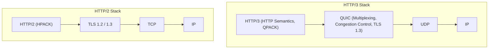
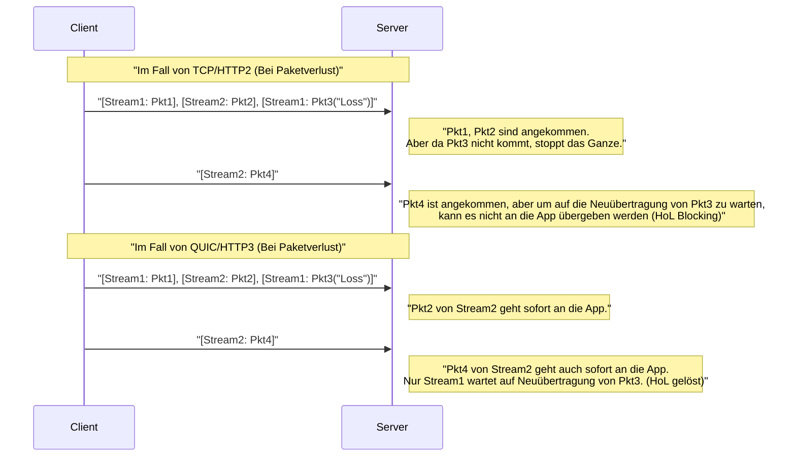
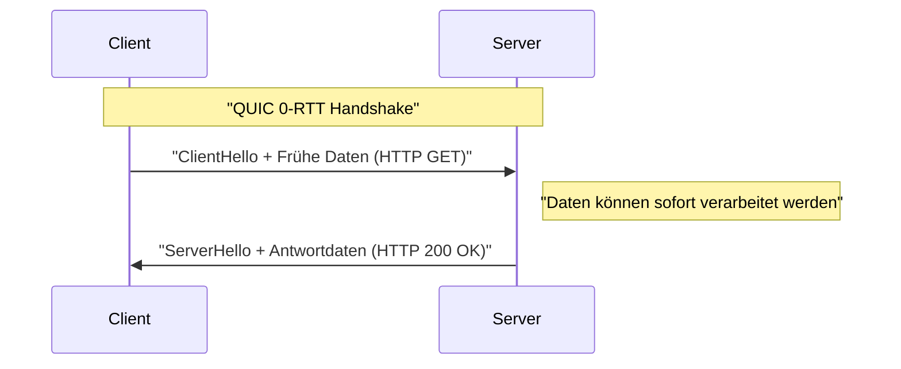

# 1. Einführung: Die Evolution der Web-Kommunikation und der Beginn einer neuen Ära

Die Welt des Internets wird durch kontinuierliche technologische Innovationen getragen. Hinter den Websites und Anwendungen, die wir täglich nutzen, arbeitet das Protokoll **HTTP (Hypertext Transfer Protocol)**. Beginnend mit HTTP/1.0, das in den 1990er Jahren erschien, über das lange genutzte HTTP/1.1 bis hin zu HTTP/2, das die Leistung drastisch verbesserte, hat es sich stetig weiterentwickelt.

Das moderne Web ist jedoch voll von reichhaltigen Inhalten (hochauflösende Bilder, Video-Streaming, komplexe JavaScript-Anwendungen), und bei den herkömmlichen Protokoll-Stacks zeigten sich allmählich Grenzen. Insbesondere die Spezifikation von **TCP (Transmission Control Protocol)** selbst, das die Transportschicht des Internets seit vielen Jahren stützt, wurde zu einem Hindernis für die weitere Beschleunigung des Webs.

Hier kamen **HTTP/3** und sein zugrunde liegendes **QUIC (Quick UDP Internet Connections)**-Protokoll ins Spiel. HTTP/3 verfolgt einen sehr ambitionierten Ansatz: Es verzichtet auf TCP und baut eine neue Schicht für zuverlässige Kommunikation direkt auf **UDP (User Datagram Protocol)** auf.

In diesem Artikel werden wir äußerst detailliert erklären, warum HTTP/3 und QUIC notwendig waren und welche Grenzen von TCP durch UDP überwunden wurden, unterstützt durch Architektur, Algorithmen, konkrete Code-Beispiele und Diagramme.

---

# 2. Die Geschichte von HTTP und die Grenzen von TCP

Um die Innovationskraft von HTTP/3 zu verstehen, muss man zunächst die Probleme der Vorgänger HTTP/1.1 und HTTP/2, also die „Grenzen von TCP“, tiefgehend verstehen.

## 2.1 Die Entwicklung von HTTP/1.1 zu HTTP/2 und die verbleibenden Herausforderungen

Bei HTTP/1.1 mussten Anfragen und Antworten sequenziell über eine einzige TCP-Verbindung verarbeitet werden. Um dies zu lösen, wurde der Workaround populär, mehrere TCP-Verbindungen aufzubauen. Jedoch ist der Aufbau von TCP-Verbindungen mit Kosten verbunden, und es gab die Einschränkung einer maximalen Anzahl gleichzeitiger Verbindungen pro Browser (normalerweise 6).

HTTP/2 löste dieses Problem durch **Multiplexing (Multiplexing)** mittels **Streams (Streams)**. Es erstellte mehrere virtuelle Streams innerhalb einer einzigen TCP-Verbindung und ermöglichte den gleichzeitigen Austausch von Anfragen und Antworten, indem diese in kleine Frames unterteilt wurden.


Dadurch wurde das „Warten in der Reihe (Head-of-Line Blocking auf HTTP-Ebene)“ behoben. Das grundlegende Problem verbarg sich jedoch in der Transportschicht, also in TCP.

## 2.2 TCPs Head-of-Line (HoL) Blocking

TCP ist ein extrem zuverlässiges Protokoll, das „Reihenfolgegarantie“ und „Neuübertragung bei Paketverlust“ bietet. Wenn der Sender die Pakete `1, 2, 3, 4` sendet, übergibt der Empfänger diese immer in dieser Reihenfolge an die Anwendungsschicht (HTTP/2).

Wenn Paket `2` auf dem Netzwerkpfad verloren geht (Paketverlust), kann der Empfänger, selbst wenn er die Pakete `3` und `4` empfangen hat, die nachfolgenden Pakete erst an die Anwendungsschicht übergeben, wenn Paket `2` erneut gesendet wurde und angekommen ist. Dies nennt man **Head-of-Line Blocking auf TCP-Ebene (HoL Blocking)**.

Da HTTP/2 alle Streams über eine einzige TCP-Verbindung leitet, hatte es die fatale Schwäche, dass **die Kommunikation aller Streams pausiert wurde**, wenn auch nur ein einziger Paketverlust auftrat. In Umgebungen mit häufigen Paketverlusten, wie z.B. in mobilen Netzwerken, gab es sogar Fälle, in denen die Leistung von HTTP/2 schlechter war als die von HTTP/1.1.

## 2.3 Handshake-Latenz (Kumulation von RTT)

TCP ist ein verbindungsorientiertes Protokoll und erfordert vor Beginn der Kommunikation einen **Drei-Wege-Handshake**. Hinzu kommt der Verschlüsselungs-Handshake (TLS), der im modernen Web obligatorisch ist.

In einer TCP + TLS 1.2-Umgebung dauert der Verbindungsaufbau ein Vielfaches der Round Trip Time (RTT).

*   **TCP-Handshake:** $ 1 \text{ RTT} $
*   **TLS-Handshake:** $ 2 \text{ RTT} $ (bei TLS 1.2)

Insgesamt werden $ 3 \text{ RTT} $ an Zeit verbraucht, bevor die erste HTTP-Anfrage gesendet werden kann. Da es eine physikalische Grenze wie die Lichtgeschwindigkeit gibt, ist es unmöglich, die RTT selbst auf null zu reduzieren (z. B. beträgt die RTT zwischen Japan und der US-Westküste etwa 100 ms). Daher war die Reduzierung der Anzahl der für den Verbindungsaufbau erforderlichen RTTs eine absolute Voraussetzung für die Leistungssteigerung.

## 2.4 Fehlende IP-Mobilität (Verbindungsabbrüche)

TCP identifiziert die beiden Endpunkte einer Kommunikation anhand **einer Kombination von 4 Werten: Quell-IP, Quell-Port, Ziel-IP und Ziel-Port (Source IP, Source Port, Destination IP, Destination Port)**.

Wenn ein Smartphone von Wi-Fi auf ein 4G/5G-Netzwerk umschaltet, ändert sich die IP-Adresse des Geräts. Wenn sich die IP-Adresse ändert, betrachtet TCP dies als eine andere Kommunikation, sodass die bestehende TCP-Verbindung getrennt wird. Wenn man gerade ein Video streamt oder eine große Datei herunterlädt, muss die Verbindung von Grund auf neu aufgebaut werden, was die User Experience (UX) stark beeinträchtigt.

---

# 3. Die Geburt von QUIC: Eine neue Welt auf der UDP-Leinwand malen

Um diese TCP-Grenzen zu durchbrechen, begann Google mit der Entwicklung von **QUIC (Quick UDP Internet Connections)**, das später von der IETF (Internet Engineering Task Force) standardisiert wurde.

Die größte Überraschung bei QUIC ist, dass es TCP, das langjährige Fundament des Internets, aufgegeben und als Basis **UDP (User Datagram Protocol)** gewählt hat.

## 3.1 Warum wurde UDP gewählt, anstatt TCP zu verbessern?

Man könnte denken: „Wenn es ein Problem mit TCP gibt, warum wird dann nicht TCP selbst aktualisiert?“ In der Praxis war dies jedoch extrem schwierig.

Der Hauptgrund dafür ist die **Verknöcherung von Middleboxes (Ossification)**.
Netzwerkgeräte (Middleboxes) im Internet wie Router, Firewalls, NAT (Network Address Translation) und Load-Balancer interpretieren die TCP-Spezifikationen (Header-Strukturen, Flag-Verhalten usw.) tiefgehend, um Optimierungen und Sicherheitsüberprüfungen durchzuführen.

Wenn man dem TCP-Header neue Flags hinzufügen oder eine neue Version von TCP erstellen würde, würden zahllose alte Middleboxes auf der ganzen Welt diese als „ungültige Pakete“ verwerfen. Dies wird als **Protokoll-Verknöcherung (Protocol Ossification)** bezeichnet.

Auf der anderen Seite ist UDP ein sehr einfaches Protokoll, das nur Informationen wie Ziel-Port, Quell-Port und eine Prüfsumme enthält. Middleboxes greifen nicht tief in den Inhalt von UDP ein.
Daher wurde der Ansatz gewählt, **„auf der weißen Leinwand namens UDP im User-Space (nah an der Anwendungsschicht) eine tcp-ähnliche Zuverlässigkeitskontrolle und TLS-Verschlüsselung komplett neu zu implementieren“**. Das ist QUIC.

## 3.2 Der QUIC-Protokoll-[Stack](https://kenji.blog/de/p/c-language-pointers-memory-management-stack-heap/)

Der Protokoll-Stack von HTTP/3, der QUIC einführt, sieht wie folgt aus.



QUIC integriert die Multiplexing-Funktion (Streams) von HTTP/2, die Funktionen zur Überlastkontrolle und zur Behebung von Paketverlusten von TCP sowie die Verschlüsselungsfunktion von TLS 1.3 in einer einzigen Schicht.

---

# 4. Innovative Funktionen und Lösungen von QUIC

Wie hat QUIC die zuvor genannten TCP-Grenzen gelöst? Wir werden die innovativen Kerntechnologien im Detail betrachten.

## 4.1 Lösung von HoL Blocking in der Transportschicht

QUIC hat die „Reihenfolgegarantie für die gesamte Verbindung“ von TCP aufgegeben und eine **„Reihenfolgegarantie pro Stream“** eingeführt.

In QUIC existieren mehrere unabhängige Streams, und jedes Paket enthält die Information, zu welchem Stream es gehört. Wenn ein bestimmtes Paket verloren geht, wird **nur der Stream, zu dem das fehlende Paket gehört**, in die Warteschleife gestellt. Pakete, die zu anderen Streams gehören, werden ohne Beeinträchtigung durch den Verlust an die Anwendungsschicht (HTTP/3) geliefert.



Dadurch wurde die Leistung in instabilen Netzwerkumgebungen (wie Mobilfunknetzen oder überfüllten öffentlichen Wi-Fis), in denen häufig Paketverluste auftreten, dramatisch verbessert.

## 4.2 Ultraschneller Verbindungsaufbau (1-RTT und 0-RTT)

QUIC ist so konzipiert, dass der Handshake der Transportschicht und der Verschlüsselungs-Handshake (TLS 1.3) **gleichzeitig** durchgeführt werden.

Mit Servern, mit denen zum ersten Mal kommuniziert wird, wird der Verbindungsaufbau und der Schlüsselaustausch für die Verschlüsselung in **1-RTT** abgeschlossen und die Datenübertragung kann sofort beginnen. Verglichen mit den $ 3 \text{ RTT} $ von TCP+TLS1.2 ist allein dies eine dramatische Entwicklung.

Darüber hinaus bietet QUIC eine geradezu magische Funktion namens **0-RTT (Zero Round Trip Time)** für Server, mit denen in der Vergangenheit bereits kommuniziert wurde.
Der Client nutzt Session-Tickets oder Parameter, die er bei früheren Kommunikationen vom Server erhalten hat, und fügt HTTP-Anfragedaten (z. B. GET-Requests) direkt in das erste Handshake-Paket (ClientHello) ein.



Dadurch wird die theoretische Verzögerung beim Start der Kommunikation null. Allerdings gibt es ein Sicherheitsrisiko, da 0-RTT-Daten anfällig für **Replay-Angriffe (Replay Attacks)** sind. Daher ist das Senden über 0-RTT auf sichere Anforderungen mit „Idempotenz“ (gleiches Ergebnis unabhängig davon, wie oft es ausgeführt wird), wie z. B. GET-Requests, beschränkt.

## 4.3 Verbindungs-Migration (Connection Migration)

Um die Schwäche von TCP zu überwinden, bei der Verbindungen abbrechen, wenn sich die IP-Adresse ändert, verwaltet QUIC Verbindungen nicht über IP-Adressen und Portnummern, sondern durch einen eindeutigen Bezeichner namens **Verbindungs-ID (Connection ID)**.

Die Verbindungs-ID ist unverschlüsselt im QUIC-Paket-Header enthalten (damit sie routingfähig ist).

Angenommen, ein Benutzer verlässt die Wi-Fi-Reichweite, wechselt in ein 4G/5G-Netzwerk und die IP-Adresse seines Smartphones ändert sich. Der QUIC-Client sendet Pakete von der neuen IP-Adresse, aber diese Pakete enthalten die bestehende „Verbindungs-ID“.
Der Server erkennt, dass sich die IP-Adresse geändert hat, aber da die Verbindungs-ID übereinstimmt, erkennt er dies als „Fortsetzung derselben Kommunikation“ und setzt die Kommunikation ohne erneuten Handshake fort.

Diese Funktion ermöglicht ein nahtloses Umschalten von Kommunikationen in mobilen Umgebungen und hat Video-Pufferungsstopps und Download-Fehler drastisch reduziert.

---

# 5. HTTP/3: HTTP-Semantik auf QUIC

Das QUIC-Protokoll selbst ist nicht exklusiv für HTTP, sondern ein generisches Transportprotokoll. Die Spezifikation, um HTTP-Semantik (Methoden, Header, Statuscodes usw.) auf diesem QUIC auszuführen, ist **HTTP/3**.

HTTP/3 übernimmt im Wesentlichen die Konzepte von HTTP/2, aber da die zugrunde liegende Schicht von TCP zu QUIC gewechselt ist, wurden einige wichtige Änderungen vorgenommen.

## 5.1 Header-Kompression mit QPACK

HTTP/2 verwendete einen Header-Kompressionsalgorithmus namens **HPACK**. HPACK hält an beiden Enden der Kommunikation eine dynamische Tabelle (Dynamic Table) und reduziert die übertragene Datenmenge, indem es einmal gesendete Header nur noch über deren Indexnummer überträgt.

HPACK hing jedoch vollständig von der „Reihenfolgegarantie“ von TCP ab. Das heißt, wenn ein Header-Block verloren ging und auf Neuübertragung wartete, konnten die Header nachfolgender Streams nicht dekomprimiert werden, bis die abhängige dynamische Tabelle aktualisiert war. Dies war ein HPACK-induziertes HoL Blocking.

Da QUIC keine Reihenfolgegarantie zwischen Streams bietet, würde bei direkter Nutzung von HPACK die Synchronisierung der dynamischen Tabelle zerstört, wenn die Streams in einer anderen Reihenfolge ankommen.

Um dies zu lösen, wurde neu **QPACK** entworfen. QPACK trennt die Aktualisierung der dynamischen Tabelle von den Datenströmen und führt einen Mechanismus ein, um die Tabelle asynchron über dedizierte Kontroll-Streams zu verwalten. Dies ermöglicht eine sichere und hochkomprimierte Header-Kommunikation selbst unter den bedingungen der unregulierten Stream-Auslieferung von QUIC.

## 5.2 Kontroll-Streams und Unidirektionale Streams

In HTTP/3 sind neben den bidirektionalen Streams für Anfragen und Antworten auch einige spezielle **unidirektionale Streams** definiert.

1.  **Kontroll-Stream:** Ein Stream für den Austausch von Einstellungen (SETTINGS-Frames) etc.
2.  **QPACK-Encoder-Stream:** Ein Stream zur Aktualisierung der dynamischen QPACK-Tabelle.
3.  **QPACK-Decoder-Stream:** Ein Stream, um Aktualisierungsbestätigungen und Fehler der QPACK-Tabelle zu übermitteln.

Diese optimieren die Kommunikation, indem sie Streams nach ihrer Funktion trennen und so Datenkonflikte und unnötige Wartezeiten verhindern.

---

# 6. Technischer Deep Dive: QUIC-Algorithmen und Formeln

Ab hier gehen wir technisch etwas tiefer und betrachten die Algorithmen und Leistungsevaluationen, die QUIC unterstützen, mithilfe von Formeln.

## 6.1 BBR (Bottleneck Bandwidth and Round-trip propagation time) Überlastkontrolle

Da QUIC im User-Space implementiert ist, bietet es den Vorteil, dass Algorithmen zur Überlastkontrolle frei und schnell aktualisiert werden können, ohne auf OS-Kernel-Updates warten zu müssen. Häufig wird das von Google entwickelte **BBR** als Überlastkontrolle für QUIC eingesetzt.

Herkömmliche verlustbasierte Überlastkontrollen wie CUBIC TCP erweitern das Sendefenster kontinuierlich, bis ein Paketverlust auftritt. Dies führte leicht zum Problem des Bufferbloat (ein Phänomen, bei dem die Puffer der Netzwerkgeräte voll werden und sich die Verzögerung erhöht).

Der traditionelle TCP-Durchsatz (Mathis-Gleichung) wird wie folgt ausgedrückt:

$ \text{Durchsatz} \le \frac{\text{MSS}}{R \times \sqrt{p}} $

*   $ \text{MSS} $ : Maximum Segment Size (Maximale Segmentgröße)
*   $ R $ : Round Trip Time (RTT)
*   $ p $ : Paketverlustrate

Wie diese Gleichung zeigt, fällt bei verlustbasiertem TCP der Durchsatz dramatisch ab, wenn die Paketverlustrate $ p $ auch nur leicht ansteigt.

Im Gegensatz dazu schätzt BBR die Netzwerkgrenzen nicht anhand von Paketverlusten, sondern durch direkte Messung von **Bandbreite (Bandwidth)** und **Verzögerung (RTT)**.

BBR modelliert die Kapazität der Netzwerk-Pipe mit der folgenden Formel:

$ \text{BDP (Bandwidth-Delay Product)} = \text{BtlBw} \times \text{RTprop} $

*   $ \text{BtlBw} $ : Bottleneck Bandwidth (Flaschenhals-Bandbreite・Vergangene maximale Kommunikationsgeschwindigkeit)
*   $ \text{RTprop} $ : Round-Trip propagation time (Ausbreitungsverzögerung・Vergangene minimale RTT)

BBR passt die Sendegeschwindigkeit so an, dass die Menge der aktuell gesendeten (In-flight) Daten mit diesem BDP übereinstimmt. Dadurch wird die Geschwindigkeit auch bei Paketverlusten (z. B. durch Funkstörungen) nicht unnötig reduziert und die Puffer der Router laufen nicht über, wodurch sowohl hoher Durchsatz als auch geringe Latenz erreicht werden. Die Kombination der User-Space-Implementierung von QUIC und BBR bietet die beste Performance.

## 6.2 Integration von Verschlüsselung und Sicherheit

QUIC integriert **TLS 1.3** standardmäßig, und es gibt keine unverschlüsselten, „Klartext“-QUIC-Verbindungen. Bei TCP waren die TCP-Header selbst nicht verschlüsselt, was es Middleboxes ermöglichte, TCP-Flags (SYN, ACK, FIN usw.) einzusehen oder zu manipulieren (z. B. RST-Injection).

Bei QUIC ist mit Ausnahme der IP- und UDP-Header der größte Teil des QUIC-Headers (einschließlich Paketnummern) und die Payload vollständig verschlüsselt.
Da sogar Paketnummern verschlüsselt sind, ist es extrem schwierig, Metadaten wie z.B. welche Pakete erneut gesendet wurden oder wie groß das aktuelle Überlastfenster ist, abzuleiten, selbst wenn der Netzwerkverkehr auf dem Weg überwacht wird. Dies ist aus Sicht des Datenschutzes äußerst leistungsstark.

---

# 7. QUIC-Implementierung und Code-Beispiele

Lassen Sie uns Code-Beispiele betrachten, um ein konkretes Gefühl dafür zu bekommen, wie QUIC in der Programmierung gehandhabt wird.
Dies ist ein Beispiel für einen einfachen HTTP/3-Server und -Client unter Verwendung der asynchronen QUIC-Implementierungsbibliothek `aioquic` für Python.

## 7.1 HTTP/3 Server in Python (aioquic)

```python
import asyncio
from aioquic.asyncio import serve
from aioquic.h3.connection import H3_ALPN, H3Connection
from aioquic.h3.events import DataReceived, HeadersReceived
from aioquic.quic.configuration import QuicConfiguration

class Http3ServerProtocol(asyncio.Protocol):
    def __init__(self):
        self.http = H3Connection(is_client=False)
        self.transport = None

    def connection_made(self, transport):
        self.transport = transport

    def datagram_received(self, data, addr):
        # UDP-Datagramm empfangen und an den QUIC-Protokoll-Stack weiterleiten
        self.http.receive_datagram(data, addr, now=asyncio.get_event_loop().time())
        self.process_http_events()

    def process_http_events(self):
        for event in self.http.next_event():
            if isinstance(event, HeadersReceived):
                print(f"Received headers: {event.headers}")
                # Eine einfache 200 OK-Antwort aufbauen
                headers = [
                    (b":status", b"200"),
                    (b"server", b"aioquic"),
                    (b"content-type", b"text/html"),
                ]
                self.http.send_headers(event.stream_id, headers)
                self.http.send_data(event.stream_id, b"<h1>Hello HTTP/3 via QUIC!</h1>", end_stream=True)
                
        # Antwort über UDP senden
        for data, addr in self.http.datagrams_to_send(now=asyncio.get_event_loop().time()):
            self.transport.sendto(data, addr)

async def main():
    configuration = QuicConfiguration(is_client=False, alpn_protocols=H3_ALPN)
    # Laden von Zertifikaten erforderlich
    configuration.load_cert_chain("cert.pem", "key.pem")
    
    # Auf UDP-Port 443 lauschen
    await serve("0.0.0.0", 443, configuration=configuration, create_protocol=Http3ServerProtocol)
    print("HTTP/3 Server listening on UDP 443...")
    await asyncio.Future()  # run forever

if __name__ == "__main__":
    asyncio.run(main())
```

Wie aus diesem Code ersichtlich ist, handelt es sich unter der Haube vollständig um **UDP-Kommunikation (datagram_received / sendto)**, während darauf basierend die hoch entwickelte Stream-Kontrolle und Header-Verarbeitung von HTTP/3 stattfindet.

## 7.2 Aktivierung von HTTP/3 in Nginx

Nginx, das weit verbreitet als Webserver verwendet wird, unterstützt HTTP/3 und QUIC seit Version 1.25.0 standardmäßig.
Die Konfiguration ist sehr einfach und erfordert nur das Hinzufügen von wenigen Zeilen zur bestehenden TLS-Konfiguration.

```nginx
server {
    # Für traditionelles TCP (HTTP/1.1, HTTP/2)
    listen 443 ssl;
    listen [::]:443 ssl;
    
    # Für das neue UDP (HTTP/3, QUIC)
    listen 443 quic reuseport;
    listen [::]:443 quic reuseport;

    server_name example.com;

    ssl_certificate     /path/to/cert.pem;
    ssl_certificate_key /path/to/key.pem;
    # TLS 1.3 ist für QUIC zwingend erforderlich
    ssl_protocols       TLSv1.2 TLSv1.3;

    location / {
        root /var/www/html;
        # Dem Client mitteilen, dass HTTP/3 verfügbar ist (Alt-Svc-Header)
        add_header Alt-Svc 'h3=":443"; ma=86400';
    }
}
```

Hier ist der `Alt-Svc`-Header wichtig. Aus historischen Gründen versuchen Browser zunächst, sich über TCP (z. B. HTTP/2) zu verbinden. Wenn die Antwort `Alt-Svc: h3=":443"` enthält, erkennen sie: „Oh, dieser Server kann auch HTTP/3 über UDP-Port 443 sprechen!“ und versuchen bei nachfolgenden Zugriffen oder im Hintergrund ein Upgrade auf eine QUIC-Verbindung.

---

# 8. Herausforderungen bei Migration und Betrieb (Challenges of Deployment)

QUIC und HTTP/3 sind traumhafte Technologien, doch bei der Einführung in reale Umgebungen gibt es einige gewaltige Hürden.

## 8.1 UDP-Blockierung durch Unternehmens-Firewalls

Seit den Anfängen des Internets wird UDP oft mit „DDoS-Angriffen“ oder „verdächtiger [P2P](https://kenji.blog/de/p/webrtc-realtime-communication-p2p/)-Kommunikation“ in Verbindung gebracht, weshalb es häufig von Unternehmens-Firewalls oder Netzwerkadministratoren **mit Ausnahme von Port 53 (DNS) oder 123 (NTP) pauschal blockiert (DROP)** wird.

QUIC verwendet den UDP-Port 443. In Umgebungen, in denen UDP allein aufgrund der Tatsache blockiert wird, dass es UDP ist, kann keine HTTP/3-Kommunikation aufgebaut werden.
In diesem Fall warten Browser einige Millisekunden bis Sekunden, erkennen ein QUIC-Kommunikations-Timeout und verfügen über einen Mechanismus, um automatisch auf TCP (HTTP/2) zurückzugreifen (Fallback). Diese Fallback-Wartezeit selbst führt jedoch zu einer Verzögerung, die das Nutzererlebnis verschlechtert.

## 8.2 Hohe CPU-Auslastung und fehlender Hardware-Offload

TCP hat eine jahrzehntelange Geschichte, und moderne Netzwerkkarten (NIC) verfügen über Funktionen wie **TCP Segmentation Offload (TSO)**, mit denen Hardware (der Chip auf der NIC) die TCP-Paketsegmentierung und die Checksummenberechnung übernimmt. Dies verringert die CPU-Auslastung des Betriebssystems drastisch.

Da QUIC jedoch im User-Space läuft und zudem alle Pakete individuell stark verschlüsselt werden (AES-GCM oder ChaCha20), ist die **CPU-Auslastung auf der Serverseite, die ein hohes Verkehrsaufkommen bewältigt, im Vergleich zu TCP+TLS extrem hoch**.
Derzeit beeilen sich verschiedene Hardware-Hersteller und Cloud-Provider, Funktionen wie UDP Segmentation Offload (USO) zu entwickeln. Bis der vollständige Support auf Hardwareebene jedoch weit verbreitet ist, bleibt das Problem gestiegener Infrastrukturkosten bestehen.

## 8.3 Komplexeres Load-Balancing

Bei der Lastverteilung (Load-Balancing) von TCP-Verkehr war es üblich, die Pakete mithilfe von Hash-Werten der 4 Tupel (Quell-IP, Quell-Port, Ziel-IP, Ziel-Port) an Backend-Server zu verteilen.

Durch die zuvor erwähnte Funktion **„Verbindungs-Migration“** von QUIC ändern sich jedoch während der Übertragung die IP-Adresse oder die Portnummer des Clients. Bei einfachem IP-basiertem Routing würden Pakete während der laufenden Kommunikation an einen anderen Backend-Server umgeleitet, und die Verbindung würde verworfen werden.

Um das Load-Balancing von QUIC korrekt durchzuführen, sind fortgeschrittene Layer-4/Layer-7-Load-Balancer erforderlich, die die im Paket-Header enthaltene „Verbindungs-ID“ auslesen und basierend darauf immer zum selben Backend-Server routen.

---

# 9. Die Zukunft von QUIC: WebTransport und erweiterte Anwendungsbereiche

Der wahre Wert von QUIC beschränkt sich nicht auf die Realisierung von HTTP/3. Als „leistungsfähiges, sicheres und auf UDP basierendes universelles Transportprotokoll“ wird QUIC zunehmend auch als Basis für verschiedene nicht-HTTP-Protokolle übernommen.

## 9.1 WebTransport: Der Next-Generation-Standard für WebSocket

Derzeit wird **WebSocket** weithin für die bidirektionale Echtzeitkommunikation zwischen Webbrowsern und Servern genutzt. Da WebSocket jedoch auf TCP läuft, kann es dem HoL-Blocking-Problem nicht entkommen. Beispielsweise bei Daten wie der Echtzeit-Positionssynchronisierung in Spielen besteht die Anforderung: „Etwas verspätete alte Daten sollen verworfen werden; wir wollen immer nur die neuesten Daten.“ TCP sendet alte, verzögerte Pakete jedoch stur erneut und verursacht Lags im Spiel.

Dies wird durch **WebTransport**, eine neue API basierend auf QUIC, gelöst.
Mit WebTransport kann neben der zuverlässigen Stream-Kommunikation auch **Datagramm-Kommunikation** direkt aus dem JavaScript des Browsers gesteuert werden. Dabei werden Daten so schnell wie möglich gesendet, selbst wenn dabei Paketverluste in Kauf genommen werden müssen.
Es wird erwartet, dass dies Cloud-Gaming im Browser oder extrem verzögerungsarme Live-Videostreams (als [WebRTC](https://kenji.blog/de/p/webrtc-realtime-communication-p2p/)-Alternative) massiv voranbringen wird.

## 9.2 Die „over QUIC“-Werdung diverser Protokolle

Unter Ausnutzung der exzellenten Eigenschaften von QUIC schreitet die Standardisierung voran, bestehende Protokolle auf QUIC umzustellen.

*   **DoQ (DNS over QUIC):** Ein Next-Generation-DNS-Protokoll, das Privatsphäre und Geschwindigkeit vereint. Schneller als DoT über TCP und sicherer als Klartext-DNS über UDP.
*   **SMB over QUIC:** Eine Technologie, die das Dateifreigabeprotokoll von Windows (SMB) auf QUIC portiert und den sicheren und schnellen Zugriff auf Dateiserver über das Internet auch ohne VPN ermöglicht (bereits im Windows Server 2022 implementiert).
*   **SSH over QUIC:** Die ultimative SSH-Terminalverbindung, die nicht abbricht, selbst wenn man sich mit einer Mobilfunkverbindung bewegt.

Auf diese Weise etabliert sich QUIC als „neuer Layer-4-Standard der Internetkommunikation“.

---

# 10. Fazit: Von der TCP-Ära zur QUIC-Ära

In diesem Artikel haben wir HTTP/3 und das QUIC-Protokoll detailliert beleuchtet – vom Paradigmenwechsel weg von den Grenzen des TCP hin zu UDP, über die Lösung des HoL Blockings und die Beschleunigung des Verbindungsaufbaus bis hin zu den Herausforderungen bei Implementierung und Betrieb.

*   **Die Grenzen von TCP:** HoL Blocking durch Reihenfolgegarantie, Handshake-Verzögerung, Anfälligkeit für IP-Adressänderungen.
*   **Die Innovation von QUIC:** Basierend auf UDP ermöglicht es im User-Space Stream-Multiplexing, die Integration von TLS 1.3 und die Migration durch Verbindungs-IDs.
*   **HTTP/3:** Neue HTTP-Spezifikationen wie QPACK, die für die Eigenschaften von QUIC optimiert sind.

TCP ist ein großartiges Protokoll, das das explosive Wachstum des Internets über fast 40 Jahre hinweg unterstützt hat. Jedoch wurden die architektonischen Grenzen in der heutigen Zeit offensichtlich, in der Performance im Millisekundenbereich über den Geschäftserfolg entscheidet und jeder komplexe Webanwendungen in mobilen Umgebungen nutzt.

QUIC, das auf der weißen Leinwand namens UDP gezeichnet wurde, hat die Engpässe der Web-Kommunikation von Grund auf durchbrochen. Es gibt zwar noch Hürden zu überwinden, wie Firewall-Konfigurationen oder Hardware-Optimierungen, aber der Großteil des riesigen Datenverkehrs von Unternehmen wie Google, Facebook (Meta) und Cloudflare ist bereits auf HTTP/3 umgestellt.

Die Webanwendungen, die wir täglich entwickeln, werden unbewusst von den Vorteilen von QUIC profitieren und schneller und robuster werden. Die Entwicklung dieses innovativen Protokolls, das das Web der nächsten Generation prägen wird, bleibt auch in Zukunft sehr spannend.

---

*Referenzen:*
*   RFC 9000: QUIC: A UDP-Based Multiplexed and Secure Transport
*   RFC 9114: HTTP/3
*   RFC 9204: QPACK: Field Compression for HTTP/3
*   IETF QUIC Working Group bezogene Dokumente
