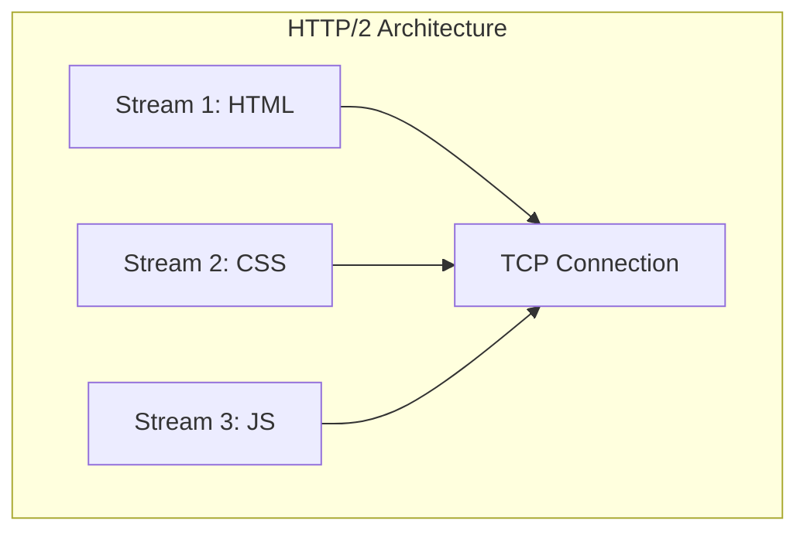
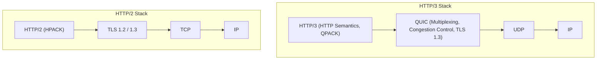
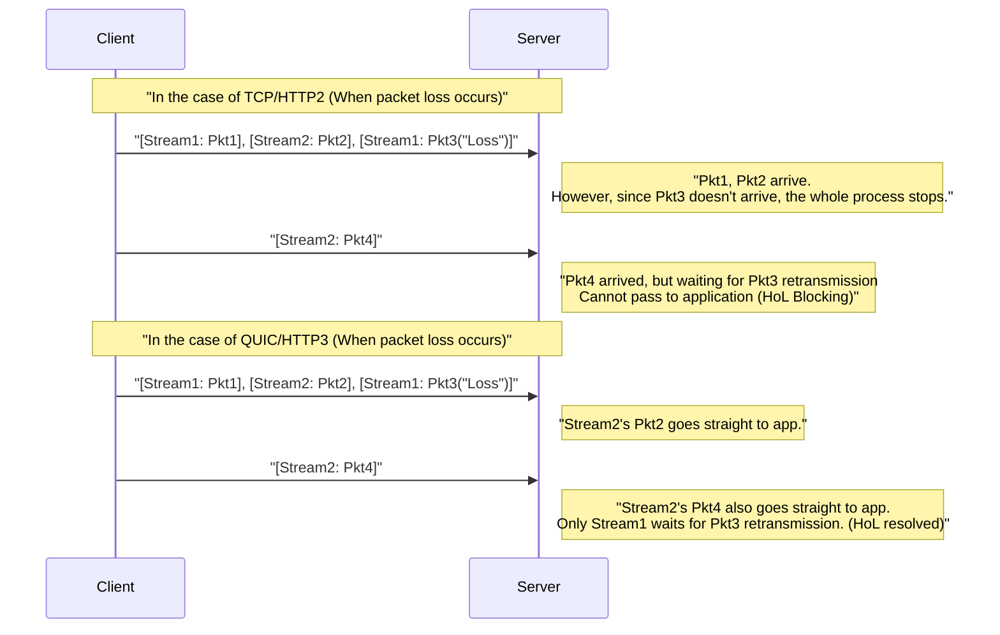
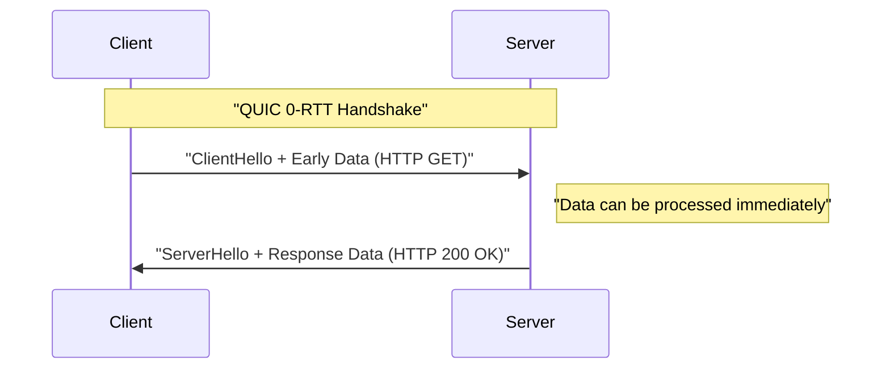

# 1. Introduction: The Evolution of Web Communication and the Dawn of the Next Generation

The world of the internet is supported by continuous technological innovation. Behind the websites and applications we use every day, a protocol called **HTTP (Hypertext Transfer Protocol)** is running. Starting with HTTP/1.0 introduced in the 1990s, it has continued to evolve through the long-used HTTP/1.1, and then to HTTP/2, which significantly improved performance.

However, the modern web is overflowing with rich content (high-resolution images, video streaming, complex JavaScript applications), and the limits of the traditional protocol stack have begun to show. In particular, the specifications of **TCP (Transmission Control Protocol)** itself, which has long supported the internet's transport layer, had become a bottleneck for further speeding up the web.

This is where **HTTP/3** and its foundational protocol **QUIC (Quick UDP Internet Connections)** come into play. HTTP/3 takes a very ambitious approach by abandoning TCP and building a new layer of reliable communication on top of **UDP (User Datagram Protocol)**.

In this article, we will explain in extreme detail why HTTP/3 and QUIC were necessary, and what limits of TCP were overcome with UDP, using architectures, algorithms, concrete code examples, and diagrams.

---

# 2. History of HTTP and the Limits of TCP

To understand the innovation of HTTP/3, it is first necessary to deeply understand the issues faced by its predecessors HTTP/1.1 and HTTP/2, namely the "limits of TCP."

## 2.1 Evolution from HTTP/1.1 to HTTP/2 and Remaining Issues

In HTTP/1.1, it was necessary to process one request and response sequentially over a single TCP connection. To solve this, a workaround of opening multiple TCP connections became popular, but establishing TCP connections is costly, and there was a restriction on the maximum number of simultaneous connections per browser (usually 6).

HTTP/2 solved this problem with **Multiplexing** using **streams**. It created multiple virtual streams within a single TCP connection, dividing requests and responses into fine frames so they could be exchanged simultaneously.



This resolved the "waiting in line (HTTP Head-of-Line Blocking)" at the HTTP level. However, the fundamental problem was hidden in the transport layer, that is, TCP.

## 2.2 TCP Head-of-Line (HoL) Blocking

TCP is an extremely reliable protocol that performs "order guarantee" and "retransmission on packet loss." When the sender sends packets `1, 2, 3, 4`, the receiver always passes the data to the application layer (HTTP/2) in that order.

If packet `2` is lost (packet loss) on the network, even if the receiver has received packets `3` and `4`, it cannot pass the subsequent packets to the application layer until packet `2` is retransmitted and arrives. This is called **TCP-level Head-of-Line Blocking (HoL Blocking)**.

Because HTTP/2 piggybacks all streams on a single TCP connection, the occurrence of just a single packet loss had the fatal weakness of **temporarily halting communication for all streams**. In environments like mobile networks where packet loss is frequent, there were even cases where HTTP/2 performed worse than HTTP/1.1.

## 2.3 Handshake Latency (Accumulation of RTT)

TCP is a connection-oriented protocol, and it is necessary to perform a **3-way handshake** before initiating communication. Furthermore, the encryption (TLS) handshake, which is mandatory in the modern web, is also added.

In a TCP + TLS 1.2 environment, it takes multiple times the Round Trip Time (RTT) to establish communication.

*   **TCP Handshake:** $ 1 \text{ RTT} $
*   **TLS Handshake:** $ 2 \text{ RTT} $ (In the case of TLS 1.2)

A total of $ 3 \text{ RTT} $ time is consumed before sending the first HTTP request. Since there is the limit of physical laws like the speed of light, it is impossible to reduce RTT itself to zero (for example, communication between Japan and the US West Coast takes about 100ms RTT). Therefore, reducing the number of RTTs required to establish communication was an absolute requirement for improving performance.

## 2.4 Lack of IP Mobility (Connection Disconnection)

TCP identifies the endpoints communicating on both sides by a **combination of 4 elements: IP address and port number (Source IP, Source Port, Destination IP, Destination Port)**.

If a smartphone switches from Wi-Fi to a 4G/5G line, the device's IP address changes. When the IP address changes, TCP considers it a different communication, so the existing TCP connection is disconnected. If this happens during video streaming or downloading a large file, the connection needs to be re-established from scratch, greatly impairing the User Experience (UX).

---

# 3. Birth of QUIC: Drawing a New World on the Canvas of UDP

To break through these limits of TCP, Google began development, and it was later standardized by the IETF (Internet Engineering Task Force) as **QUIC (Quick UDP Internet Connections)**.

The biggest surprise of QUIC is that it abandons TCP, which has been the foundation of the internet for many years, and adopts **UDP (User Datagram Protocol)** as its base.

## 3.1 Why Choose UDP Instead of Improving TCP?

You might think, "If there is a problem with TCP, why not just upgrade TCP itself?" However, realistically, this was extremely difficult.

The biggest reason for this is the **Ossification of Middleboxes**.
Network equipment (middleboxes) on the internet, such as routers, firewalls, NAT (Network Address Translation), and load balancers, deeply interpret TCP specifications (header structures, flag behaviors, etc.) to perform optimizations and security checks.

If a new flag were added to the TCP header or a new version of TCP were created, countless old middleboxes around the world would discard them as "invalid packets." This is called **Protocol Ossification**.

On the other hand, UDP is a very simple protocol that holds only information such as destination port, source port, and a checksum. Middleboxes also do not deeply interfere with the contents of UDP.
Therefore, the approach adopted was: **"Reimplement all reliability controls and TLS encryption like TCP in user space (a location closer to the application layer) on the blank canvas of UDP."** This is QUIC.

## 3.2 QUIC Protocol [Stack](https://kenji.blog/en/p/c-language-pointers-memory-management-stack-heap/)

The protocol stack of HTTP/3 incorporating QUIC is as follows.



QUIC integrates the multiplexing (stream) features that HTTP/2 had, the congestion control and packet loss recovery features that TCP had, and the encryption features of TLS 1.3 into a single layer.

---

# 4. Innovative Features and Solutions Brought by QUIC

How did QUIC solve the limits of TCP mentioned earlier? Let's take a detailed look at the core innovative technologies.

## 4.1 Eliminating HoL Blocking at the Transport Layer

QUIC abandons "order guarantee for the entire connection" like TCP and introduces **"order guarantee per stream."**

Multiple independent streams exist within QUIC, and each packet has information about which stream it belongs to. If a packet is lost, the only thing forced to wait is **the stream to which the missing packet belongs**. Packets belonging to other streams are delivered to the application layer (HTTP/3) without being affected by the loss.



This dramatically improved performance in unstable network environments prone to packet loss (such as mobile lines or crowded public Wi-Fi).

## 4.2 Ultra-Fast Connection Establishment (1-RTT and 0-RTT)

QUIC is designed to perform the transport layer handshake and the encryption (TLS 1.3) handshake **simultaneously**.

When communicating with a server for the first time, it can complete connection establishment and encryption key exchange in **1-RTT** and immediately start sending data. Compared to TCP+TLS1.2's $ 3 \text{ RTT} $, this alone is a dramatic evolution.

Furthermore, QUIC provides a magical feature called **0-RTT (Zero Round Trip Time)** for servers it has communicated with in the past.
The client uses session tickets or parameters received from the server in previous communications to immediately piggyback HTTP request data (like GET requests) on the initial handshake packet (ClientHello).



This theoretically brings the communication start delay to zero. However, 0-RTT data has the security risk of being vulnerable to **Replay Attacks**. Therefore, what can be sent via 0-RTT is limited to safe requests that have "idempotency (the result is the same no matter how many times it is executed)," such as GET requests.

## 4.3 Connection Migration

To overcome the weakness of TCP disconnecting when the IP address changes, QUIC manages connections not by IP address or port number, but by a unique identifier called a **Connection ID**.

The Connection ID is included unencrypted (so that it can be routed) in the header of the QUIC packet.

Suppose a user moves out of Wi-Fi range and switches to a 4G/5G line, changing the smartphone's IP address. The QUIC client sends packets from the new IP address, but those packets contain the existing "Connection ID".
The server detects that the IP address has changed, but because the Connection ID matches, it recognizes this as "continuation of the same communication" and continues the communication without re-handshaking.

This feature realizes seamless communication switching in mobile environments, dramatically reducing video buffering stops and download failures.

---

# 5. HTTP/3: HTTP Semantics over QUIC

The QUIC protocol itself is not exclusively for HTTP; it is a general-purpose transport protocol. The specification for running HTTP semantics (methods, headers, status codes, etc.) on top of this QUIC is **HTTP/3**.

HTTP/3 basically inherits the concepts of HTTP/2, but because the lower layer changed from TCP to QUIC, some important changes were made.

## 5.1 Header Compression with QPACK

HTTP/2 used a header compression algorithm called **HPACK**. HPACK maintains a dynamic table at both ends of the communication and reduces traffic by sending only an index number for a header once it has been sent.

However, HPACK entirely relied on TCP's "order guarantee." In other words, if a certain header block was lost and awaited retransmission, the headers of subsequent streams could not be decoded until the dependent dynamic table was updated, introducing HPACK-induced HoL Blocking.

Because QUIC does not guarantee order between streams, using HPACK as is would corrupt the synchronization of the dynamic table when the arrival order of streams is swapped.

To solve this, **QPACK** was newly designed. In QPACK, the mechanism of updating the dynamic table is separated from each data stream, and the table is managed asynchronously using a dedicated control stream. This enables safe and highly compressed header communication even under QUIC's unordered stream delivery.

## 5.2 Control Streams and Unidirectional Streams

In HTTP/3, in addition to the bidirectional streams for requests and responses, several special **unidirectional streams** are defined.

1.  **Control Stream:** A stream for exchanging settings (SETTINGS frames).
2.  **QPACK Encoder Stream:** A stream for updating the QPACK dynamic table.
3.  **QPACK Decoder Stream:** A stream for conveying confirmation of QPACK table updates and errors.

Separating streams by role is an optimization to prevent data collisions and unnecessary waiting.

---

# 6. Technical Deep Dive: QUIC Algorithms and Formulas

From here, we will delve slightly deeper technically and examine the algorithms and performance evaluations that support QUIC, incorporating formulas.

## 6.1 BBR (Bottleneck Bandwidth and Round-trip propagation time) Congestion Control

Because QUIC is implemented in user space, it has the advantage of being able to freely and quickly update the congestion control algorithm without waiting for an OS kernel update. In many cases, **BBR**, developed by Google, is adopted as QUIC's congestion control.

Traditional loss-based congestion control like CUBIC TCP continues to expand the transmission window until packet loss occurs. Because of this, it had the problem of easily causing bufferbloat (a phenomenon where network equipment buffers fill up and delay increases).

Traditional TCP throughput (Mathis's equation) is expressed as follows:

$ \text{Throughput} \le \frac{\text{MSS}}{R \times \sqrt{p}} $

*   $ \text{MSS} $ : Maximum Segment Size
*   $ R $ : Round Trip Time (RTT)
*   $ p $ : Packet loss rate

As this equation shows, for loss-based TCP, even a slight increase in the packet loss rate $ p $ dramatically drops throughput.

In contrast, BBR directly measures **Bandwidth** and **Delay (RTT)** instead of packet loss to estimate the network's limits.

BBR models the capacity of the network pipe with the following formula:

$ \text{BDP (Bandwidth-Delay Product)} = \text{BtlBw} \times \text{RTprop} $

*   $ \text{BtlBw} $ : Bottleneck Bandwidth (maximum communication speed in the past)
*   $ \text{RTprop} $ : Round-Trip propagation time (minimum RTT in the past)

BBR adjusts the transmission speed so that the amount of data in-flight matches this BDP. As a result, even if packet loss occurs (e.g., loss due to wireless interference), it does not unnecessarily slow down the speed, and because it does not overflow router buffers, it can achieve both high throughput and low latency. The combination of QUIC's user-space implementation and BBR delivers the best performance.

## 6.2 Integration of Encryption and Security

QUIC incorporates **TLS 1.3** by default, and there is no such thing as an unencrypted "plaintext" QUIC connection. In the case of TCP, since the TCP header itself is not encrypted, middleboxes could snoop on TCP flags (SYN, ACK, FIN, etc.) or tamper with them (RST injection, etc.).

In QUIC, except for the IP header and UDP header, the majority of the QUIC header (including the packet number) and payload are completely encrypted.
Because even the packet number is encrypted, even if network traffic is monitored on the path, it becomes extremely difficult to infer metadata such as which packet is a retransmission or what the current congestion window is. This is very powerful from a privacy protection perspective.

---

# 7. QUIC Implementation and Code Examples

Let's look at a code example to grasp a concrete image of how QUIC is handled programmatically.
This is a simple HTTP/3 server and client example using an asynchronous QUIC implementation library for Python called `aioquic`.

## 7.1 HTTP/3 Server in Python (aioquic)

```python
import asyncio
from aioquic.asyncio import serve
from aioquic.h3.connection import H3_ALPN, H3Connection
from aioquic.h3.events import DataReceived, HeadersReceived
from aioquic.quic.configuration import QuicConfiguration

class Http3ServerProtocol(asyncio.Protocol):
    def __init__(self):
        self.http = H3Connection(is_client=False)
        self.transport = None

    def connection_made(self, transport):
        self.transport = transport

    def datagram_received(self, data, addr):
        # Receive UDP datagram and pass it to the QUIC protocol stack
        self.http.receive_datagram(data, addr, now=asyncio.get_event_loop().time())
        self.process_http_events()

    def process_http_events(self):
        for event in self.http.next_event():
            if isinstance(event, HeadersReceived):
                print(f"Received headers: {event.headers}")
                # Construct a simple 200 OK response
                headers = [
                    (b":status", b"200"),
                    (b"server", b"aioquic"),
                    (b"content-type", b"text/html"),
                ]
                self.http.send_headers(event.stream_id, headers)
                self.http.send_data(event.stream_id, b"<h1>Hello HTTP/3 via QUIC!</h1>", end_stream=True)
                
        # Send response via UDP
        for data, addr in self.http.datagrams_to_send(now=asyncio.get_event_loop().time()):
            self.transport.sendto(data, addr)

async def main():
    configuration = QuicConfiguration(is_client=False, alpn_protocols=H3_ALPN)
    # Loading certificate is required
    configuration.load_cert_chain("cert.pem", "key.pem")
    
    # Listen on UDP port 443
    await serve("0.0.0.0", 443, configuration=configuration, create_protocol=Http3ServerProtocol)
    print("HTTP/3 Server listening on UDP 443...")
    await asyncio.Future()  # run forever

if __name__ == "__main__":
    asyncio.run(main())
```

As you can see from this code, while the underlying layer is entirely **UDP communication (datagram_received / sendto)**, advanced HTTP/3 stream control and header processing are performed on top of it.

## 7.2 Enabling HTTP/3 in Nginx

Nginx, widely used as a web server, also supports HTTP/3 and QUIC by default starting from version 1.25.0.
The configuration is very simple, just adding a few lines to the existing TLS configuration.

```nginx
server {
    # For traditional TCP (HTTP/1.1, HTTP/2)
    listen 443 ssl;
    listen [::]:443 ssl;
    
    # For new UDP (HTTP/3, QUIC)
    listen 443 quic reuseport;
    listen [::]:443 quic reuseport;

    server_name example.com;

    ssl_certificate     /path/to/cert.pem;
    ssl_certificate_key /path/to/key.pem;
    # TLS 1.3 is required for QUIC
    ssl_protocols       TLSv1.2 TLSv1.3;

    location / {
        root /var/www/html;
        # Tell the client that HTTP/3 is available (Alt-Svc header)
        add_header Alt-Svc 'h3=":443"; ma=86400';
    }
}
```

The important thing here is the `Alt-Svc` header. For historical reasons, the browser initially attempts to connect via TCP (HTTP/2, etc.). If the response contains `Alt-Svc: h3=":443"`, it recognizes, "This server can also speak HTTP/3 on UDP port 443!" and attempts to upgrade to a QUIC connection for subsequent accesses or in the background.

---

# 8. Challenges of Deployment

While QUIC and HTTP/3 are dream-like technologies, there are a few huge walls in putting them into actual operation.

## 8.1 UDP Blocking by Corporate Firewalls

Since the early days of the internet, there have been many cases where corporate firewalls and network administrators **uniformly block (DROP) UDP except for ports 53 (DNS) and 123 (NTP)** because it is often used for "DDoS attacks" or "suspicious [P2P](https://kenji.blog/en/p/webrtc-realtime-communication-p2p/) communications."

QUIC uses UDP port 443, but in environments where it is blocked simply because it is UDP, HTTP/3 communication cannot be established.
In this case, the browser has a mechanism to wait a few milliseconds to a few seconds, detect the QUIC communication timeout, and automatically fallback to TCP (HTTP/2). However, this fallback waiting time itself introduces a delay that worsens the user experience.

## 8.2 High CPU Load and Lack of Hardware Offload

TCP has decades of history, and modern Network Interface Cards (NICs) have features like **TCP Segmentation Offload (TSO)** that shoulder TCP packet fragmentation and checksum calculations in hardware (the NIC chip). This drastically reduces the OS CPU load.

However, because QUIC runs in user space and every packet is individually strongly encrypted (AES-GCM or ChaCha20), **the CPU usage on the server side processing a massive amount of communication is extremely high compared to TCP+TLS**.
Currently, hardware vendors and cloud providers are rushing to develop features like UDP Segmentation Offload (USO), but until full hardware-level support becomes widespread, the challenge of increased infrastructure costs remains.

## 8.3 Complication of Load Balancing

Load balancing of TCP traffic was generally distributed to backend servers using a hash value of a simple 4-tuple (source IP/port, destination IP/port).

However, due to the **"Connection Migration"** feature mentioned above, QUIC clients' IP addresses and port numbers change mid-way. Because of this, with simple IP-based routing, packets would be routed to a different backend server in the middle of communication, destroying the connection.

To correctly load balance QUIC, an advanced Layer 4 / Layer 7 load balancer that reads the "Connection ID" included in the packet header and always routes to the same backend server based on it is necessary.

---

# 9. The Future of QUIC: WebTransport and Expanding Application Areas

The true value of QUIC is not limited merely to realizing HTTP/3. As a "high-performance, secure UDP-based general-purpose transport protocol," QUIC is beginning to be adopted as a foundation for various protocols other than HTTP.

## 9.1 WebTransport: The Next-Generation Standard for WebSocket

Currently, **WebSocket** is widely used for bidirectional real-time communication between web browsers and servers. However, because WebSocket runs over TCP, it still cannot escape the HoL Blocking problem. For example, data like real-time position synchronization in games has the property of "discarding even slightly delayed old data, wanting only the latest data," but TCP strictly retransmits old delayed packets, causing game lag.

The new API **WebTransport**, which is based on QUIC, solves this.
In WebTransport, you can directly handle not only reliable stream communication from browser JavaScript but also **datagram communication**, which sends data as fast as possible even tolerating packet loss.
This is expected to greatly advance browser-based cloud gaming and ultra-low latency live video streaming (as an alternative to [WebRTC](https://kenji.blog/en/p/webrtc-realtime-communication-p2p/)).

## 9.2 "over QUIC" of Various Protocols

Taking advantage of QUIC's excellent characteristics, standardization to port existing protocols onto QUIC is progressing.

*   **DoQ (DNS over QUIC):** A next-generation DNS protocol that balances privacy and speed. Faster than DoT over TCP, and safer than plaintext DNS over UDP.
*   **SMB over QUIC:** Technology that changes the Windows file sharing protocol (SMB) to QUIC, enabling safe and fast access to file servers across the internet without a VPN (already implemented in Windows Server 2022).
*   **SSH over QUIC:** The ultimate SSH terminal connection that won't drop even while moving on a mobile network.

In this way, QUIC is establishing its position as the "new Layer 4 standard for internet communication."

---

# 10. Conclusion: From the Era of TCP to the Era of QUIC

In this article, we deeply explored the HTTP/3 and QUIC protocols, from the paradigm shift from the limits of TCP to UDP, resolving HoL Blocking, speeding up connection establishment, and the challenges of implementation and deployment.

*   **TCP Limits:** HoL Blocking due to order guarantee, handshake delay, vulnerability to IP address changes.
*   **QUIC Innovation:** Achieved stream multiplexing, TLS 1.3 integration, and migration using Connection IDs in user space, based on UDP.
*   **HTTP/3:** New HTTP specifications like QPACK optimized for QUIC characteristics.

TCP is a great protocol that has supported the explosive growth of the internet for nearly 40 years. However, in an age where millisecond performance directly impacts business and everyone uses rich web apps in mobile environments, the limits of its architecture were clear.

QUIC, drawn on the blank canvas of UDP, has fundamentally destroyed the bottlenecks of web communication. Although there are still hurdles to overcome, such as firewall configurations and hardware optimizations, a vast majority of massive traffic for Google, Facebook (Meta), Cloudflare, etc., has already migrated to HTTP/3.

The web applications we develop every day will unknowingly benefit from this QUIC, becoming faster and more robust. We cannot take our eyes off the trends of this innovative protocol shaping the next-generation web.

---

*References:*
*   RFC 9000: QUIC: A UDP-Based Multiplexed and Secure Transport
*   RFC 9114: HTTP/3
*   RFC 9204: QPACK: Field Compression for HTTP/3
*   IETF QUIC Working Group Related Documents
