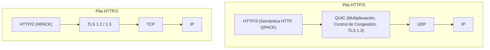
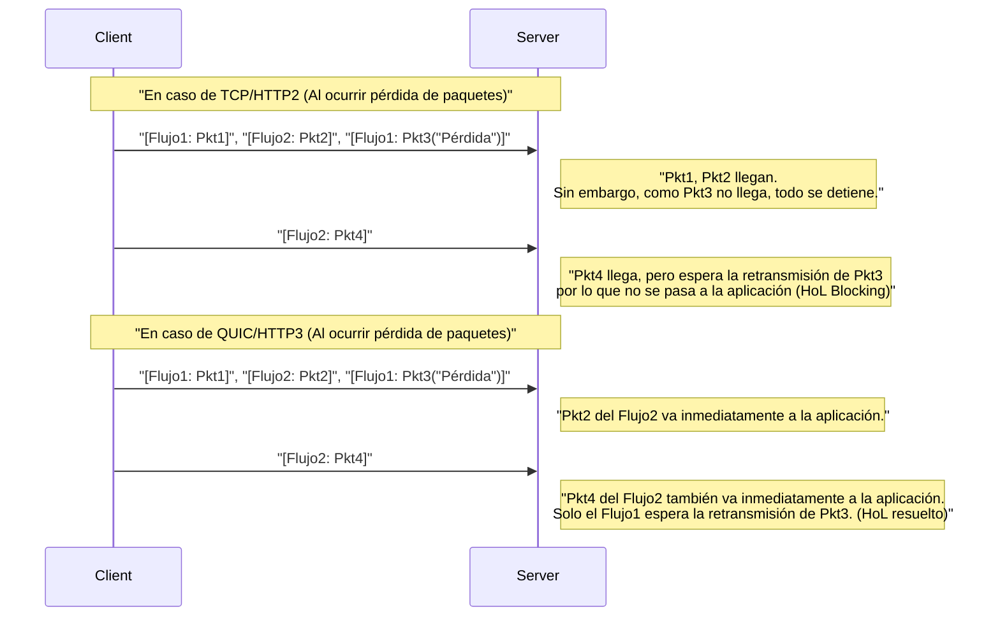
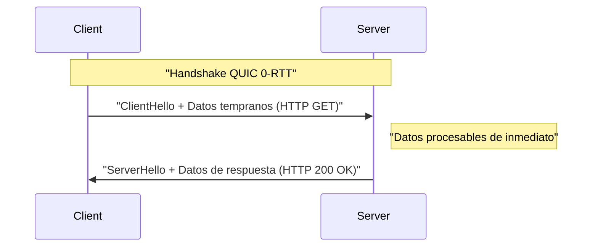

# 1. Introducción: La evolución de las comunicaciones Web y el inicio de la próxima generación

El mundo de Internet está respaldado por constantes innovaciones tecnológicas. Detrás de los sitios web y las aplicaciones que usamos a diario, funciona el protocolo **HTTP (Hypertext Transfer Protocol)**. Comenzando con HTTP/1.0, que apareció en la década de 1990, seguido de HTTP/1.1, que se usó durante mucho tiempo, y luego HTTP/2, que mejoró drásticamente el rendimiento, ha continuado evolucionando.

Sin embargo, la Web moderna está llena de contenido rico (imágenes de alta calidad, transmisión de video, aplicaciones complejas de JavaScript) y la pila de protocolos tradicional estaba empezando a mostrar sus límites. En particular, las especificaciones del propio **TCP (Transmission Control Protocol)**, que ha soportado la capa de transporte de Internet durante muchos años, se habían convertido en un obstáculo para seguir acelerando la Web.

Aquí es donde entra en juego **HTTP/3** y su protocolo base **QUIC (Quick UDP Internet Connections)**. HTTP/3 adopta un enfoque muy ambicioso al descartar TCP y, sorprendentemente, construir una nueva capa de comunicación confiable sobre **UDP (User Datagram Protocol)**.

En este artículo, explicaremos con gran detalle por qué eran necesarios HTTP/3 y QUIC, y qué límites de TCP se superaron con UDP, intercalando arquitecturas, algoritmos, ejemplos de código concretos y diagramas.

---

# 2. La historia de HTTP y los límites de TCP

Para comprender la innovación de HTTP/3, primero debemos conocer a fondo los problemas que tenían sus predecesores, HTTP/1.1 y HTTP/2, es decir, los "límites de TCP".

## 2.1 La evolución de HTTP/1.1 a HTTP/2 y los problemas restantes

En HTTP/1.1, era necesario procesar una solicitud y respuesta en orden a través de una sola conexión TCP. Para resolver esto, se popularizó la solución alternativa de establecer múltiples conexiones TCP, pero el establecimiento de una conexión TCP tenía un costo y había una restricción en el límite de conexiones simultáneas por navegador (generalmente 6).

HTTP/2 resolvió este problema mediante la **Multiplexación (Multiplexing)** utilizando **flujos (streams)**. Creó múltiples flujos virtuales dentro de una única conexión TCP, dividiendo las solicitudes y respuestas en pequeños fragmentos para que pudieran intercambiarse simultáneamente.


Con esto, se resolvió la "espera de turno (Head-of-Line Blocking de HTTP)" a nivel de HTTP. Sin embargo, el problema fundamental estaba oculto en la capa de transporte, es decir, en TCP.

## 2.2 El Head-of-Line (HoL) Blocking de TCP

TCP es un protocolo extremadamente confiable que realiza "garantía de orden" y "retransmisión de pérdida de paquetes". Cuando el remitente envía los paquetes `1, 2, 3, 4`, el receptor siempre pasa los datos a la capa de aplicación (HTTP/2) en ese orden.

Si el paquete `2` se pierde en el medio de la red (pérdida de paquetes), el receptor no puede pasar los paquetes subsiguientes a la capa de aplicación hasta que el paquete `2` sea retransmitido y llegue, incluso si ha recibido los paquetes `3` y `4`. A esto se le llama **Head-of-Line Blocking (HoL Blocking) a nivel de TCP**.

Dado que HTTP/2 hace que todos los flujos compartan una sola conexión TCP, tenía la debilidad fatal de que la pérdida de un solo paquete **pausaba temporalmente la comunicación de todos los flujos**. En entornos de redes móviles donde la pérdida de paquetes es frecuente, había casos en los que el rendimiento de HTTP/2 era incluso inferior al de HTTP/1.1.

## 2.3 Latencia del handshake (Acumulación de RTT)

TCP es un protocolo orientado a la conexión y requiere un **handshake de 3 vías** antes de iniciar la comunicación. Además, se añade el handshake de encriptación (TLS) que es obligatorio en la Web moderna.

En un entorno TCP + TLS 1.2, se requiere un tiempo equivalente a múltiples Round Trip Times (RTT) antes de que se establezca la comunicación.

*   **Handshake de TCP:** $ 1 \text{ RTT} $
*   **Handshake de TLS:** $ 2 \text{ RTT} $ (en caso de TLS 1.2)

En total, se consumen $ 3 \text{ RTT} $ antes de enviar la primera solicitud HTTP. Dado que existe el límite de las leyes físicas como la velocidad de la luz, es imposible reducir el RTT en sí a cero (por ejemplo, la comunicación entre Japón y la costa oeste de EE. UU. tarda unos 100 ms en RTT). Por lo tanto, reducir el número de RTT necesarios para establecer la comunicación era una condición absoluta para mejorar el rendimiento.

## 2.4 Falta de movilidad IP (Desconexión de la conexión)

TCP identifica los puntos finales en ambos extremos de una comunicación mediante una **combinación de 4 elementos de dirección IP y número de puerto (IP de origen, puerto de origen, IP de destino, puerto de destino)**.

Si cambias de Wi-Fi a una red 4G/5G en tu teléfono inteligente, la dirección IP del dispositivo cambiará. Cuando la dirección IP cambia, TCP lo considera como una comunicación diferente, por lo que la conexión TCP existente se desconecta. Si estabas transmitiendo un video o descargando un archivo grande, necesitabas restablecer la conexión desde cero, lo que deterioraba en gran medida la experiencia del usuario (UX).

---

# 3. El nacimiento de QUIC: Dibujando un nuevo mundo en el lienzo de UDP

**QUIC (Quick UDP Internet Connections)** fue desarrollado originalmente por Google para superar estos límites de TCP y luego fue estandarizado por el IETF (Internet Engineering Task Force).

La mayor sorpresa de QUIC es que abandonó TCP, que fue la base de Internet durante muchos años, y adoptó **UDP (User Datagram Protocol)** como su base.

## 3.1 ¿Por qué se eligió UDP en lugar de mejorar TCP?

Podrías pensar: "Si hay un problema con TCP, ¿por qué no simplemente actualizar la versión de TCP?". Sin embargo, en la realidad eso era extremadamente difícil.

La razón principal es la **osificación de las Middleboxes (Ossification)**.
Los dispositivos de red (middleboxes) en Internet, como enrutadores, firewalls, NAT (Traducción de Direcciones de Red) y balanceadores de carga, interpretan profundamente las especificaciones de TCP (estructura de encabezados, comportamiento de banderas, etc.) y realizan optimizaciones y comprobaciones de seguridad.

Si se agrega una nueva bandera al encabezado TCP o se crea una nueva versión de TCP, innumerables middleboxes antiguos en todo el mundo lo descartarán como un "paquete no válido". A esto se le llama **Osificación del Protocolo (Protocol Ossification)**.

Por otro lado, UDP es un protocolo muy simple que solo tiene el puerto de destino, el puerto de origen y una suma de comprobación (checksum). Las middleboxes tampoco interfieren profundamente con el contenido de UDP.
Por lo tanto, se adoptó el enfoque de **"reimplementar todos los controles de confiabilidad similares a TCP y el cifrado TLS en el espacio del usuario (cerca de la capa de aplicación) sobre un lienzo en blanco llamado UDP"**. Esto es QUIC.

## 3.2 Pila de protocolos de QUIC

La pila de protocolos de HTTP/3 introduciendo QUIC es la siguiente:



QUIC integra las funciones de multiplexación (flujos) que tenía HTTP/2, las funciones de control de congestión y recuperación de pérdida de paquetes que tenía TCP, y las funciones de cifrado de TLS 1.3 en una sola capa.

---

# 4. Funciones innovadoras y soluciones aportadas por QUIC

¿Cómo resolvió QUIC los límites de TCP mencionados anteriormente? Veremos en detalle las tecnologías innovadoras que forman su núcleo.

## 4.1 Resolución del HoL Blocking en la capa de transporte

QUIC abandona la "garantía de orden de toda la conexión" como TCP e introduce la **"garantía de orden por flujo"**.

Dentro de QUIC existen múltiples flujos independientes y cada paquete tiene información sobre a qué flujo pertenece. Si se pierde un paquete, **solo se pone en espera el flujo al que pertenece el paquete faltante**. Los paquetes que pertenecen a otros flujos se entregan a la capa de aplicación (HTTP/3) sin verse afectados por la pérdida.



Esto ha mejorado drásticamente el rendimiento en entornos de red inestables propensos a la pérdida de paquetes (como líneas móviles y redes Wi-Fi públicas congestionadas).

## 4.2 Aceleración extrema del establecimiento de la conexión (1-RTT y 0-RTT)

QUIC está diseñado para realizar el handshake de la capa de transporte y el handshake de cifrado (TLS 1.3) **simultáneamente**.

Con servidores con los que te comunicas por primera vez, puedes completar el establecimiento de la conexión y el intercambio de claves de cifrado en **1-RTT** y comenzar a transmitir datos de inmediato. En comparación con los $ 3 \text{ RTT} $ de TCP+TLS1.2, esto por sí solo es una evolución dramática.

Además, QUIC ofrece una característica mágica llamada **0-RTT (Zero Round Trip Time)** para los servidores con los que se ha comunicado en el pasado.
El cliente usa el ticket de sesión y los parámetros recibidos del servidor en comunicaciones anteriores para adjuntar los datos de la solicitud HTTP (como una solicitud GET) directamente al primer paquete de handshake (ClientHello) y enviarlo.



Esto teóricamente reduce el retraso de inicio de la comunicación a cero. Sin embargo, los datos 0-RTT conllevan el riesgo de seguridad de ser vulnerables a los **Ataques de Replay (Replay Attack)**. Por lo tanto, la transmisión en 0-RTT se limita a solicitudes seguras que tienen "idempotencia (el resultado es el mismo sin importar cuántas veces se ejecuten)", como las solicitudes GET.

## 4.3 Migración de conexión (Connection Migration)

Para superar la debilidad de TCP de desconectarse cuando cambia la dirección IP, QUIC administra las conexiones con un identificador único llamado **ID de conexión (Connection ID)**, en lugar de direcciones IP y números de puerto.

El ID de conexión se incluye sin cifrar (para permitir el enrutamiento) en el encabezado del paquete QUIC.

Supongamos que un usuario se sale del alcance del Wi-Fi y cambia a una red 4G/5G, cambiando la dirección IP de su teléfono inteligente. El cliente QUIC envía un paquete desde la nueva dirección IP, pero el paquete contiene el "ID de conexión" existente.
El servidor detecta que la dirección IP ha cambiado, pero debido a que el ID de conexión coincide, lo reconoce como una "continuación de la misma comunicación" y continúa la comunicación sin un nuevo handshake.

Esta característica permite una transición de comunicación fluida en entornos móviles, reduciendo drásticamente las detenciones por almacenamiento en búfer (buffering) de video y las descargas fallidas.

---

# 5. HTTP/3: Semántica HTTP sobre QUIC

El protocolo QUIC en sí no es exclusivo para HTTP, sino un protocolo de transporte de uso general. La especificación para ejecutar la semántica HTTP (métodos, encabezados, códigos de estado, etc.) sobre este QUIC es **HTTP/3**.

HTTP/3 hereda básicamente los conceptos de HTTP/2, pero a medida que la capa inferior cambió de TCP a QUIC, se hicieron varios cambios importantes.

## 5.1 Compresión de encabezados con QPACK

En HTTP/2, se usaba un algoritmo de compresión de encabezados llamado **HPACK**. HPACK mantiene una tabla dinámica (Dynamic Table) en ambos extremos de la comunicación y, una vez que se envía un encabezado, se envía solo el número de índice para reducir el tráfico de red.

Sin embargo, HPACK dependía completamente de la "garantía de orden" de TCP. En otras palabras, si un bloque de encabezado se perdía y esperaba su retransmisión, los encabezados de los flujos subsiguientes no se podían decodificar hasta que se actualizara la tabla dinámica de la que dependían, lo que creaba un HoL Blocking originado por HPACK.

Dado que QUIC no garantiza el orden entre flujos, usar HPACK tal cual rompería la sincronización de las tablas dinámicas cuando cambia el orden de llegada de los flujos.

Para resolver esto, se diseñó nuevamente **QPACK**. En QPACK, la actualización de la tabla dinámica se separa de cada flujo de datos y se gestiona de forma asíncrona mediante un flujo de control dedicado. Esto permite una comunicación de encabezados segura y de alta compresión incluso bajo la entrega de flujos desordenados de QUIC.

## 5.2 Flujos de control y flujos unidireccionales

En HTTP/3, además de los flujos bidireccionales para solicitudes y respuestas, se definen algunos **flujos unidireccionales** especiales.

1.  **Flujo de control (Control Stream):** Un flujo para intercambiar configuraciones (tramas SETTINGS), etc.
2.  **Flujo de codificador QPACK (QPACK Encoder Stream):** Un flujo para actualizar la tabla dinámica de QPACK.
3.  **Flujo de decodificador QPACK (QPACK Decoder Stream):** Un flujo para informar la confirmación de la actualización de la tabla QPACK y errores.

Estas son optimizaciones que separan los flujos por rol para prevenir la contención de datos y la espera innecesaria.

---

# 6. Profundización técnica: Algoritmos de QUIC y fórmulas matemáticas

A partir de aquí, entraremos un poco en los detalles técnicos y examinaremos los algoritmos que respaldan a QUIC y su evaluación de rendimiento usando fórmulas.

## 6.1 Control de congestión BBR (Bottleneck Bandwidth and Round-trip propagation time)

Dado que QUIC se implementa en el espacio de usuario, tiene la ventaja de poder actualizar los algoritmos de control de congestión libremente y de forma rápida sin tener que esperar a que el núcleo del SO se actualice. En muchos casos, **BBR**, desarrollado por Google, se adopta como el control de congestión para QUIC.

Los controles de congestión basados en pérdidas tradicionales, como CUBIC TCP, continúan expandiendo la ventana de envío hasta que ocurre una pérdida de paquetes. Como resultado, tenían el problema de ser propensos a causar "bufferbloat" (un fenómeno donde los búferes de los equipos de red se llenan y la latencia aumenta).

El rendimiento de TCP tradicional (Fórmula de Mathis) se expresa de la siguiente manera:

$ \text{Rendimiento} \le \frac{\text{MSS}}{R \times \sqrt{p}} $

*   $ \text{MSS} $ : Maximum Segment Size (Tamaño Máximo de Segmento)
*   $ R $ : Round Trip Time (RTT)
*   $ p $ : Tasa de pérdida de paquetes

Como muestra esta fórmula, en un TCP basado en pérdidas, si la tasa de pérdida de paquetes $ p $ aumenta aunque sea un poco, el rendimiento disminuye drásticamente.

En contraste, BBR no mide la pérdida de paquetes, sino que mide directamente el **ancho de banda (Bandwidth)** y el **retardo (RTT)** para estimar el límite de la red.

BBR modela la capacidad de la tubería de la red con la siguiente fórmula:

$ \text{BDP (Producto de Ancho de Banda y Retardo)} = \text{BtlBw} \times \text{RTprop} $

*   $ \text{BtlBw} $ : Bottleneck Bandwidth (Ancho de banda del cuello de botella / velocidad máxima de comunicación histórica)
*   $ \text{RTprop} $ : Round-Trip propagation time (Retardo de propagación / mínimo RTT histórico)

BBR ajusta la velocidad de transmisión para que la cantidad de datos en tránsito (In-flight) coincida con este BDP. Por consiguiente, incluso si ocurre una pérdida de paquetes (por ejemplo, pérdida por interferencia inalámbrica), no reduce innecesariamente la velocidad y evita que el búfer del enrutador se desborde, logrando tanto un alto rendimiento como una baja latencia. La combinación de la implementación del espacio de usuario de QUIC y BBR ofrece el máximo rendimiento.

## 6.2 Integración de cifrado y seguridad

QUIC incluye **TLS 1.3** por defecto, y no existe algo como una conexión QUIC en "texto plano" no cifrada. En el caso de TCP, el encabezado TCP en sí no estaba encriptado, por lo que las middleboxes podían echar un vistazo a las banderas de TCP (SYN, ACK, FIN, etc.) o alterarlas (como la inyección de RST).

En QUIC, excluyendo el encabezado IP y el encabezado UDP, la mayor parte del encabezado QUIC (incluido el número de paquete, etc.) y la carga útil están completamente encriptados.
Dado que incluso el número de paquete está encriptado, es extremadamente difícil adivinar metadatos, como qué paquete se retransmitió o cuál es la ventana de congestión actual, incluso si se monitorea el tráfico de la red en la ruta. Esto es muy poderoso desde la perspectiva de la protección de la privacidad.

---

# 7. Implementación de QUIC y ejemplos de código

Veamos un ejemplo de código para tener una idea concreta de cómo se maneja QUIC en los programas.
Este es un ejemplo simple de servidor y cliente HTTP/3 que utiliza una biblioteca de implementación asíncrona de QUIC en Python llamada `aioquic`.

## 7.1 Servidor HTTP/3 en Python (aioquic)

```python
import asyncio
from aioquic.asyncio import serve
from aioquic.h3.connection import H3_ALPN, H3Connection
from aioquic.h3.events import DataReceived, HeadersReceived
from aioquic.quic.configuration import QuicConfiguration

class Http3ServerProtocol(asyncio.Protocol):
    def __init__(self):
        self.http = H3Connection(is_client=False)
        self.transport = None

    def connection_made(self, transport):
        self.transport = transport

    def datagram_received(self, data, addr):
        # Recibir datagrama UDP y pasarlo a la pila de protocolos QUIC
        self.http.receive_datagram(data, addr, now=asyncio.get_event_loop().time())
        self.process_http_events()

    def process_http_events(self):
        for event in self.http.next_event():
            if isinstance(event, HeadersReceived):
                print(f"Received headers: {event.headers}")
                # Construir una respuesta simple 200 OK
                headers = [
                    (b":status", b"200"),
                    (b"server", b"aioquic"),
                    (b"content-type", b"text/html"),
                ]
                self.http.send_headers(event.stream_id, headers)
                self.http.send_data(event.stream_id, b"<h1>Hello HTTP/3 via QUIC!</h1>", end_stream=True)
                
        # Enviar respuesta por UDP
        for data, addr in self.http.datagrams_to_send(now=asyncio.get_event_loop().time()):
            self.transport.sendto(data, addr)

async def main():
    configuration = QuicConfiguration(is_client=False, alpn_protocols=H3_ALPN)
    # Se requiere cargar el certificado
    configuration.load_cert_chain("cert.pem", "key.pem")
    
    # Escuchar en el puerto UDP 443
    await serve("0.0.0.0", 443, configuration=configuration, create_protocol=Http3ServerProtocol)
    print("HTTP/3 Server listening on UDP 443...")
    await asyncio.Future()  # run forever

if __name__ == "__main__":
    asyncio.run(main())
```

Como puede ver en este código, mientras que la base es completamente **comunicación UDP (datagram_received / sendto)**, por encima de eso se realiza un control avanzado de flujos HTTP/3 y procesamiento de encabezados.

## 7.2 Habilitación de HTTP/3 en Nginx

Nginx, que se usa ampliamente como servidor web, también admite HTTP/3 y QUIC de forma predeterminada a partir de la versión 1.25.0.
La configuración es muy simple, solo hay que agregar unas pocas líneas a la configuración TLS existente.

```nginx
server {
    # Para TCP tradicional (HTTP/1.1, HTTP/2)
    listen 443 ssl;
    listen [::]:443 ssl;
    
    # Para el nuevo UDP (HTTP/3, QUIC)
    listen 443 quic reuseport;
    listen [::]:443 quic reuseport;

    server_name example.com;

    ssl_certificate     /path/to/cert.pem;
    ssl_certificate_key /path/to/key.pem;
    # TLS 1.3 es obligatorio para QUIC
    ssl_protocols       TLSv1.2 TLSv1.3;

    location / {
        root /var/www/html;
        # Informar al cliente que HTTP/3 está disponible (encabezado Alt-Svc)
        add_header Alt-Svc 'h3=":443"; ma=86400';
    }
}
```

Lo importante aquí es el encabezado `Alt-Svc`. Por razones históricas, el navegador inicialmente intentará conectarse mediante TCP (como HTTP/2). Si la respuesta incluye `Alt-Svc: h3=":443"`, reconocerá que "¡Este servidor también puede hablar HTTP/3 en el puerto UDP 443!" e intentará actualizar a una conexión usando QUIC para accesos subsiguientes o en segundo plano.

---

# 8. Desafíos en la implementación y operación (Challenges of Deployment)

QUIC y HTTP/3 son tecnologías de ensueño, pero existen varios muros gigantescos para ponerlos en uso práctico.

## 8.1 Bloqueo de UDP por firewalls corporativos

Desde los albores de Internet, existen bastantes casos en los que los firewalls corporativos o los administradores de redes **bloquean sistemáticamente (DROP) todo excepto el puerto 53 (DNS) y 123 (NTP)** con el argumento de que UDP se usa a menudo para "ataques DDoS" o "comunicaciones [P2P](https://kenji.blog/es/p/webrtc-realtime-communication-p2p/) sospechosas".

QUIC utiliza el puerto UDP 443, pero en entornos donde se bloquea solo por ser UDP, no se pueden establecer comunicaciones HTTP/3.
En este caso, los navegadores tienen un mecanismo para volver automáticamente (fallback) a TCP (HTTP/2) al detectar un tiempo de espera en la comunicación QUIC después de esperar de unos pocos milisegundos a varios segundos. Sin embargo, el tiempo de espera para este fallback se convierte en un retraso que empeora la experiencia del usuario.

## 8.2 Alta carga de CPU y falta de descarga de hardware (Hardware Offload)

TCP tiene una historia de décadas, y las tarjetas de interfaz de red (NIC) modernas tienen características como **TCP Segmentation Offload (TSO)**, donde el hardware (chip de la NIC) asume las tareas de dividir paquetes de TCP o calcular sumas de verificación. Esto reduce drásticamente la carga de la CPU del SO.

Sin embargo, debido a que QUIC opera en el espacio de usuario y, además, a cada paquete se le aplica individualmente un cifrado fuerte (AES-GCM o ChaCha20), la **tasa de uso de la CPU en el lado del servidor que maneja un gran volumen de tráfico se vuelve mucho más alta en comparación con TCP+TLS**.
Actualmente, los proveedores de hardware y proveedores de la nube se apresuran a desarrollar características como UDP Segmentation Offload (USO), pero hasta que el soporte completo a nivel de hardware se generalice, el desafío del aumento en los costos de infraestructura permanecerá.

## 8.3 Complicación del equilibrio de carga (Load Balancing)

El equilibrio de carga del tráfico de TCP tradicionalmente utiliza el valor hash de la tupla de 4 elementos (IP/puerto de origen, IP/puerto de destino) para distribuirlo a los servidores backend de forma general.

Sin embargo, QUIC cambia la dirección IP o el puerto del cliente a mitad de camino debido a la característica de **"Migración de conexión"** mencionada anteriormente. Por lo tanto, con un enrutamiento simple basado en IP, los paquetes podrían enrutarse a un servidor backend diferente a mitad de la comunicación, provocando que la conexión se descarte.

Para equilibrar correctamente la carga de QUIC, se requiere un balanceador de carga de Capa 4/Capa 7 más avanzado que pueda leer el "ID de conexión" incluido en el encabezado del paquete y usarlo para enrutar consistentemente al mismo servidor backend.

---

# 9. El futuro de QUIC: WebTransport y áreas de aplicación en expansión

El verdadero valor de QUIC no se limita a la realización de HTTP/3. Como un "protocolo de transporte de propósito general, de alto rendimiento y seguro basado en UDP", QUIC también ha comenzado a ser adoptado como la base de otros protocolos además de HTTP.

## 9.1 WebTransport: El estándar de próxima generación para WebSocket

Actualmente, **WebSocket** se usa ampliamente para comunicaciones interactivas bidireccionales en tiempo real entre un navegador web y un servidor. Sin embargo, como WebSocket funciona sobre TCP, tampoco puede escapar del problema del HoL Blocking. Por ejemplo, los datos como la sincronización de ubicación en tiempo real de los juegos tienen la naturaleza de "desechar los datos antiguos retrasados aunque sea un poco y solo desear los datos más recientes", pero TCP retransmite fielmente los paquetes antiguos retrasados, causando latencia en el juego.

Esto se resuelve mediante una nueva API llamada **WebTransport**, basada en QUIC.
Con WebTransport, se puede manejar no solo la comunicación por flujos que garantiza la confiabilidad, sino también la **comunicación por datagramas** directamente desde el JavaScript del navegador para enviar datos lo más rápido posible, incluso si eso significa tolerar la pérdida de paquetes.
Se espera que esto avance significativamente los juegos en la nube basados en navegadores y la distribución de video en vivo de latencia ultrabaja (una alternativa a [WebRTC](https://kenji.blog/es/p/webrtc-realtime-communication-p2p/)).

## 9.2 Hacia un "over QUIC" para diversos protocolos

Aprovechando las excelentes características de QUIC, se está avanzando en la estandarización para portar protocolos existentes a QUIC.

*   **DoQ (DNS over QUIC):** Un protocolo DNS de próxima generación que equilibra la privacidad y la velocidad. Más rápido que DoT sobre TCP, y más seguro que el DNS de texto plano sobre UDP.
*   **SMB over QUIC:** Una tecnología que adapta el protocolo de intercambio de archivos de Windows (SMB) a QUIC, permitiendo un acceso rápido y seguro a los servidores de archivos a través de Internet sin VPN (ya implementado en Windows Server 2022).
*   **SSH over QUIC:** La conexión terminal SSH definitiva que no se interrumpe ni siquiera al moverse con una conexión móvil.

De esta manera, QUIC se está estableciendo rápidamente como el "nuevo estándar de capa 4 para la comunicación en Internet".

---

# 10. Conclusión: De la era de TCP a la era de QUIC

En este artículo, hemos explorado en profundidad HTTP/3 y el protocolo QUIC, desde el cambio de paradigma de los límites de TCP a UDP, la resolución de HoL Blocking, la aceleración en el establecimiento de la conexión, hasta los desafíos de implementación y operación.

*   **Límites de TCP:** HoL Blocking por garantía de orden, latencia de handshake, vulnerabilidad al cambio de direcciones IP.
*   **Innovación de QUIC:** Logra multiplexación de flujos, integración de TLS 1.3 y migración por ID de conexión en el espacio del usuario, basado en UDP.
*   **HTTP/3:** Nuevas especificaciones HTTP como QPACK, optimizadas para las características de QUIC.

Durante casi 40 años, TCP ha sido un gran protocolo que ha soportado el crecimiento explosivo de Internet. Sin embargo, en la era actual, donde el rendimiento al nivel de milisegundos impacta directamente en el negocio y donde todo el mundo usa aplicaciones web ricas en entornos móviles, las limitaciones de esa arquitectura eran evidentes.

QUIC, dibujado en el lienzo en blanco llamado UDP, ha destruido los cuellos de botella de la comunicación web desde sus raíces. Aunque todavía hay obstáculos que superar, como las configuraciones de firewall y las optimizaciones de hardware, la mayor parte del tráfico gigantesco de empresas como Google, Facebook (Meta) y Cloudflare ya ha migrado a HTTP/3.

Las aplicaciones web que desarrollamos todos los días se benefician de QUIC sin que seamos conscientes de ello, haciéndose más rápidas y más robustas. Continuaremos vigilando los desarrollos de este protocolo innovador que da forma a la web del mañana.

---

*Referencias:*
*   RFC 9000: QUIC: A UDP-Based Multiplexed and Secure Transport
*   RFC 9114: HTTP/3
*   RFC 9204: QPACK: Field Compression for HTTP/3
*   Documentos relacionados del IETF QUIC Working Group
