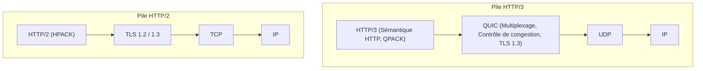
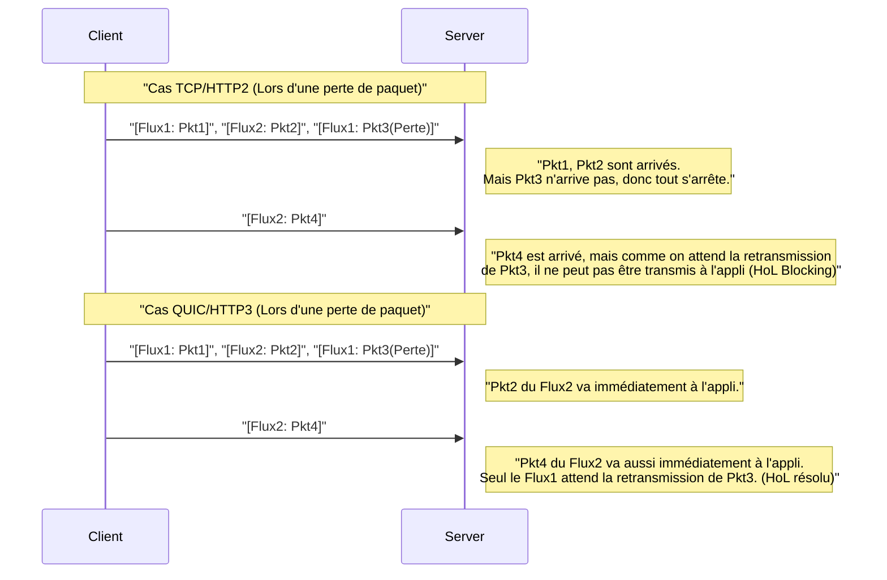
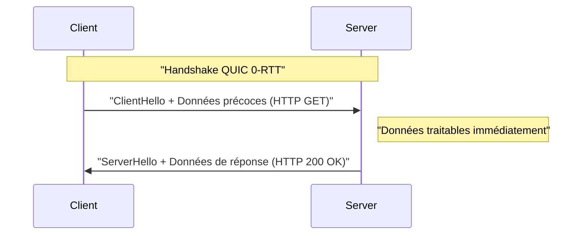

# 1. Introduction : L'évolution de la communication Web et l'aube d'une nouvelle ère

Le monde d'Internet est soutenu par une innovation technologique constante. Derrière les sites Web et les applications que nous utilisons tous les jours fonctionne le protocole **HTTP (Hypertext Transfer Protocol)**. Commençant par HTTP/1.0 apparu dans les années 1990, il a continué à évoluer avec HTTP/1.1 utilisé pendant longtemps, puis HTTP/2 qui a considérablement amélioré les performances.

Cependant, le Web moderne regorge de contenus riches (images haute résolution, streaming vidéo, applications JavaScript complexes), et la pile de protocoles traditionnelle commençait à montrer ses limites. En particulier, les spécifications mêmes de **TCP (Transmission Control Protocol)**, qui a soutenu la couche de transport d'Internet pendant de nombreuses années, étaient devenues un obstacle à l'accélération continue du Web.

C'est là que **HTTP/3** et son protocole sous-jacent **QUIC (Quick UDP Internet Connections)** font leur apparition. HTTP/3 abandonne TCP et adopte une approche très ambitieuse en construisant une nouvelle couche de communication fiable sur **UDP (User Datagram Protocol)**.

Dans cet article, nous expliquerons très en détail pourquoi HTTP/3 et QUIC étaient nécessaires, et quelles limites de TCP ont été surmontées par UDP, en incluant l'architecture, les algorithmes, des exemples de code concrets et des diagrammes.

---

# 2. L'histoire de HTTP et les limites de TCP

Pour comprendre le caractère innovant de HTTP/3, il faut d'abord connaître en profondeur les problèmes rencontrés par ses prédécesseurs, HTTP/1.1 et HTTP/2, c'est-à-dire les "limites de TCP".

## 2.1 Évolution de HTTP/1.1 à HTTP/2 et défis restants

Dans HTTP/1.1, il fallait traiter une requête/réponse de manière séquentielle sur une seule connexion TCP. Pour contourner cela, la solution de contournement consistant à ouvrir plusieurs connexions TCP s'est popularisée, mais l'établissement d'une connexion TCP était coûteux, et il y avait une limite au nombre de connexions simultanées par navigateur (généralement 6).

HTTP/2 a résolu ce problème par le **multiplexage (Multiplexing)** basé sur des **flux (streams)**. Il créait plusieurs flux virtuels au sein d'une seule connexion TCP, divisait les requêtes et les réponses en petits blocs (frames), et permettait de les échanger simultanément.


Ainsi, l'"attente (Head-of-Line Blocking de HTTP)" au niveau HTTP a été éliminée. Cependant, le problème fondamental restait caché dans la couche de transport, c'est-à-dire TCP.

## 2.2 Head-of-Line (HoL) Blocking de TCP

TCP est un protocole extrêmement fiable qui assure la "garantie de l'ordre" et la "retransmission en cas de perte de paquets". Lorsque l'expéditeur envoie les paquets `1, 2, 3, 4`, le destinataire les transmet toujours à la couche application (HTTP/2) dans cet ordre.

Si le paquet `2` est perdu en cours de route sur le réseau (perte de paquet), le destinataire ne peut pas transmettre les paquets suivants à la couche application tant que le paquet `2` n'a pas été retransmis et reçu, même s'il a déjà reçu les paquets `3` et `4`. On appelle cela le **Head-of-Line Blocking (HoL Blocking) au niveau TCP**.

Étant donné que HTTP/2 fait passer tous ses flux sur une seule connexion TCP, il avait un point faible fatal : la perte d'un seul paquet **suspendait temporairement la communication de tous les flux**. Dans des environnements réseau sujets aux pertes de paquets, comme les réseaux mobiles, les performances de HTTP/2 pouvaient même parfois être inférieures à celles de HTTP/1.1.

## 2.3 Latence du Handshake (Accumulation du RTT)

TCP est un protocole orienté connexion, et il doit effectuer un **handshake à trois voies (3-way handshake)** avant de commencer la communication. À cela s'ajoute le handshake du chiffrement (TLS), devenu indispensable sur le Web moderne.

Dans un environnement TCP + TLS 1.2, l'établissement de la communication prend un temps multiple du temps de parcours aller-retour (Round Trip Time, RTT).

*   **Handshake TCP :** $ 1 \text{ RTT} $
*   **Handshake TLS :** $ 2 \text{ RTT} $ (Dans le cas de TLS 1.2)

Au total, un temps de $ 3 \text{ RTT} $ est consommé avant l'envoi de la première requête HTTP. Étant donné qu'il y a une limite physique liée à la vitesse de la lumière (par exemple, le RTT entre le Japon et la côte Ouest des États-Unis est d'environ 100 ms), il est impossible de réduire le RTT lui-même à zéro. Par conséquent, réduire le nombre de RTT nécessaires pour établir la communication était une condition absolue pour améliorer les performances.

## 2.4 Manque de mobilité IP (Déconnexion)

TCP identifie les points terminaux (endpoints) effectuant la communication par **une combinaison de 4 éléments : Adresse IP et Numéro de port (Source IP, Source Port, Destination IP, Destination Port)**.

Si un smartphone passe du Wi-Fi à la 4G/5G, l'adresse IP de l'appareil change. Lorsque l'adresse IP change, TCP considère qu'il s'agit d'une autre communication, et la connexion TCP existante est coupée. Lors d'un streaming vidéo ou d'un téléchargement de gros fichier, il faut rétablir la connexion à partir de zéro, ce qui dégradait considérablement l'expérience utilisateur (UX).

---

# 3. La naissance de QUIC : Peindre un nouveau monde sur la toile UDP

Pour surmonter ces limites de TCP, Google a commencé à développer un protocole, plus tard standardisé par l'IETF (Internet Engineering Task Force), appelé **QUIC (Quick UDP Internet Connections)**.

La plus grande surprise de QUIC est qu'il abandonne TCP, qui a été la base d'Internet pendant des années, pour adopter **UDP (User Datagram Protocol)** comme base.

## 3.1 Pourquoi avoir choisi UDP au lieu d'améliorer TCP ?

Vous pourriez vous demander : "Si TCP pose problème, pourquoi ne pas simplement mettre à jour TCP lui-même ?" Cependant, c'était extrêmement difficile en pratique.

La raison principale en est l'**ossification des Middleboxes (Protocol Ossification)**.
Les équipements réseau (Middleboxes) sur Internet, tels que les routeurs, pare-feu, NAT (Network Address Translation) et équilibreurs de charge (Load Balancers), interprètent en profondeur les spécifications de TCP (la structure de l'en-tête, le comportement des drapeaux, etc.) pour effectuer des optimisations et des contrôles de sécurité.

Si l'on ajoute un nouveau drapeau à l'en-tête TCP ou que l'on crée une nouvelle version de TCP, les innombrables anciens Middleboxes à travers le monde les rejetteront comme étant des "paquets invalides". On appelle cela l'**ossification du protocole**.

En revanche, UDP est un protocole très simple, qui ne contient guère plus d'informations que le port de destination, le port source et la somme de contrôle (checksum). Les Middleboxes n'interfèrent pas non plus en profondeur avec le contenu de l'UDP.
C'est pourquoi on a adopté l'approche consistant à **"réimplémenter tous les contrôles de fiabilité (comme dans TCP) et le chiffrement TLS dans l'espace utilisateur (un endroit proche de la couche application), sur la toile blanche qu'est UDP"**. C'est cela, QUIC.

## 3.2 La pile de protocole de QUIC

La pile de protocole de HTTP/3 introduisant QUIC est la suivante :



QUIC intègre dans une seule couche les fonctionnalités de multiplexage (flux) de HTTP/2, le contrôle de congestion et la récupération de perte de paquets de TCP, ainsi que le chiffrement de TLS 1.3.

---

# 4. Les fonctionnalités innovantes et solutions apportées par QUIC

Comment QUIC a-t-il résolu les limites de TCP mentionnées précédemment ? Examinons en détail les technologies innovantes qui en sont le cœur.

## 4.1 Élimination du HoL Blocking au niveau de la couche transport

QUIC abandonne la "garantie de l'ordre pour l'ensemble de la connexion" propre à TCP, et introduit la **"garantie de l'ordre par flux"**.

Plusieurs flux indépendants existent au sein de QUIC, et chaque paquet possède l'information du flux auquel il appartient. Si un paquet est perdu, **seul le flux auquel appartient ce paquet manquant** est mis en attente. Les paquets appartenant à d'autres flux sont transmis à la couche application (HTTP/3) sans être affectés par la perte.



Grâce à cela, les performances ont été considérablement améliorées dans les environnements réseau instables sujets aux pertes de paquets (réseaux mobiles, Wi-Fi public encombré, etc.).

## 4.2 Accélération extrême de l'établissement de la connexion (1-RTT et 0-RTT)

QUIC est conçu pour effectuer le handshake de la couche transport et le handshake du chiffrement (TLS 1.3) **en même temps**.

Lors de la première communication avec un serveur, l'établissement de la connexion et l'échange des clés de chiffrement se font en **1-RTT**, et l'envoi de données peut commencer immédiatement. Comparé aux $ 3 \text{ RTT} $ de TCP+TLS1.2, c'est déjà une avancée spectaculaire.

De plus, QUIC offre une fonctionnalité magique appelée **0-RTT (Zero Round Trip Time)** pour les serveurs avec lesquels il a déjà communiqué par le passé.
Le client utilise le ticket de session ou les paramètres reçus du serveur lors de la communication précédente, et envoie les données de la requête HTTP (comme une requête GET) dès le premier paquet de handshake (ClientHello).



Ainsi, le délai théorique de début de communication devient nul. Cependant, il existe un risque de sécurité car les données 0-RTT sont vulnérables aux **attaques par rejeu (Replay Attack)**. C'est pourquoi seules les requêtes "sûres" possédant l'idempotence (le résultat est le même quel que soit le nombre d'exécutions), comme les requêtes GET, peuvent être envoyées en 0-RTT.

## 4.3 Migration de connexion (Connection Migration)

Afin de surmonter la faiblesse de TCP qui se déconnecte lorsque l'adresse IP change, QUIC gère les connexions non pas par adresse IP et numéro de port, mais par un identifiant unique appelé **ID de connexion (Connection ID)**.

L'ID de connexion est inclus en clair (pour permettre le routage) dans l'en-tête du paquet QUIC.

Supposons qu'un utilisateur sorte de la zone de couverture Wi-Fi et passe à la 4G/5G, modifiant ainsi l'adresse IP du smartphone. Le client QUIC envoie des paquets depuis la nouvelle adresse IP, mais ces paquets contiennent l'"ID de connexion" existant.
Le serveur détecte le changement d'adresse IP, mais comme l'ID de connexion correspond, il reconnaît qu'il s'agit de la "poursuite de la même communication" et continue la communication sans refaire le handshake.

Grâce à cette fonctionnalité, le basculement transparent de communication dans les environnements mobiles a été rendu possible, réduisant considérablement les arrêts de mise en mémoire tampon des vidéos et les échecs de téléchargement.

---

# 5. HTTP/3 : Sémantique HTTP sur QUIC

Le protocole QUIC lui-même n'est pas exclusif à HTTP, c'est un protocole de transport générique. La spécification permettant de faire fonctionner la sémantique HTTP (méthodes, en-têtes, codes d'état, etc.) sur ce QUIC est **HTTP/3**.

HTTP/3 reprend fondamentalement les concepts de HTTP/2, mais le changement de la couche inférieure de TCP à QUIC a entraîné quelques modifications importantes.

## 5.1 Compression des en-têtes avec QPACK

HTTP/2 utilisait un algorithme de compression d'en-tête appelé **HPACK**. HPACK maintient une table dynamique (Dynamic Table) aux deux extrémités de la communication, et réduit le volume de données en n'envoyant qu'un numéro d'index pour les en-têtes déjà transmis.

Cependant, HPACK dépendait entièrement de la "garantie de l'ordre" de TCP. Autrement dit, si un bloc d'en-tête était perdu et en attente de retransmission, les en-têtes des flux suivants ne pouvaient pas être déchiffrés tant que la table dynamique dépendante n'était pas mise à jour, créant ainsi un HoL Blocking lié à HPACK.

Comme QUIC ne garantit pas l'ordre entre les flux, si l'on utilise HPACK tel quel, la synchronisation de la table dynamique serait rompue lors de l'arrivée désordonnée des flux.

Pour résoudre cela, un nouveau mécanisme a été conçu : **QPACK**. QPACK sépare la mise à jour de la table dynamique de chaque flux de données, et utilise un flux de contrôle dédié pour gérer la table de manière asynchrone. Ainsi, une communication d'en-tête sécurisée et hautement compressée est possible même sous la livraison désordonnée des flux par QUIC.

## 5.2 Flux de contrôle et flux unidirectionnels

Dans HTTP/3, en plus des flux bidirectionnels pour les requêtes/réponses, plusieurs **flux unidirectionnels** spéciaux sont définis.

1.  **Flux de contrôle (Control Stream) :** Flux permettant d'échanger des paramètres (trames SETTINGS), etc.
2.  **Flux d'encodeur QPACK :** Flux permettant de mettre à jour la table dynamique de QPACK.
3.  **Flux de décodeur QPACK :** Flux permettant de transmettre la confirmation de mise à jour de la table QPACK ou des erreurs.

La séparation des flux selon leur rôle est une optimisation visant à prévenir les conflits de données et les attentes inutiles.

---

# 6. Approfondissement technique : Algorithmes et formules de QUIC

À partir d'ici, nous allons approfondir la technique en examinant les algorithmes et l'évaluation des performances soutenant QUIC, avec des formules mathématiques.

## 6.1 Contrôle de congestion BBR (Bottleneck Bandwidth and Round-trip propagation time)

Comme QUIC est implémenté dans l'espace utilisateur, il présente l'avantage de pouvoir mettre à jour rapidement et librement l'algorithme de contrôle de congestion, sans attendre la mise à jour du noyau du système d'exploitation. Dans de nombreux cas, **BBR**, développé par Google, est adopté comme contrôle de congestion pour QUIC.

Les contrôles de congestion basés sur les pertes (Loss-based), tels que le CUBIC TCP classique, continuent d'élargir la fenêtre d'envoi jusqu'à ce qu'une perte de paquet se produise. Cela posait problème, car cela provoquait souvent du bufferbloat (phénomène où les tampons des équipements réseau se remplissent, augmentant la latence).

Le débit (Throughput) du TCP classique (formule de Mathis) est exprimé comme suit :

$ \text{Débit} \le \frac{\text{MSS}}{R \times \sqrt{p}} $

*   $ \text{MSS} $ : Maximum Segment Size (Taille maximale de segment)
*   $ R $ : Round Trip Time (RTT)
*   $ p $ : Taux de perte de paquets

Comme le montre cette formule, le débit du TCP basé sur les pertes chute de manière spectaculaire dès que le taux de perte de paquets $ p $ augmente un peu.

En revanche, BBR n'utilise pas la perte de paquets, mais mesure directement la **Bande passante (Bandwidth)** et le **Délai (RTT)** pour estimer les limites du réseau.

BBR modélise la capacité du tuyau réseau avec la formule suivante :

$ \text{BDP (Produit Bande passante-Délai)} = \text{BtlBw} \times \text{RTprop} $

*   $ \text{BtlBw} $ : Bottleneck Bandwidth (Bande passante du goulot d'étranglement / Vitesse de communication maximale passée)
*   $ \text{RTprop} $ : Round-Trip propagation time (Délai de propagation / RTT minimum passé)

BBR ajuste la vitesse d'envoi pour que la quantité de données en transit (In-flight) corresponde à ce BDP. Ainsi, même si des pertes de paquets surviennent (par exemple : pertes dues à des interférences sans fil), la vitesse ne baisse pas inutilement, et comme les tampons des routeurs ne débordent pas, on peut concilier haut débit et faible latence. La combinaison de l'implémentation de QUIC en espace utilisateur et de BBR offre des performances optimales.

## 6.2 Intégration du chiffrement et de la sécurité

QUIC intègre par défaut **TLS 1.3**, il n'y a donc pas de connexion QUIC "en clair" non chiffrée. Dans le cas de TCP, l'en-tête TCP lui-même n'est pas chiffré, ce qui permettait aux Middleboxes d'espionner ou d'altérer les drapeaux TCP (SYN, ACK, FIN, etc., ou injection RST).

Dans QUIC, à l'exception des en-têtes IP et UDP, la majorité de l'en-tête QUIC (y compris le numéro de paquet, etc.) et la charge utile (payload) sont entièrement chiffrés.
Comme même le numéro de paquet est chiffré, si l'on surveille le trafic réseau sur la ligne, il devient extrêmement difficile de déduire des métadonnées telles que les paquets retransmis ou la taille actuelle de la fenêtre de congestion. C'est très puissant du point de vue de la protection de la vie privée.

---

# 7. Implémentation et exemples de code QUIC

Pour avoir une idée concrète de la façon dont QUIC est manipulé par les programmes, regardons un exemple de code.
Voici un exemple de client et serveur HTTP/3 simples utilisant la bibliothèque d'implémentation QUIC asynchrone pour Python `aioquic`.

## 7.1 Serveur HTTP/3 en Python (aioquic)

```python
import asyncio
from aioquic.asyncio import serve
from aioquic.h3.connection import H3_ALPN, H3Connection
from aioquic.h3.events import DataReceived, HeadersReceived
from aioquic.quic.configuration import QuicConfiguration

class Http3ServerProtocol(asyncio.Protocol):
    def __init__(self):
        self.http = H3Connection(is_client=False)
        self.transport = None

    def connection_made(self, transport):
        self.transport = transport

    def datagram_received(self, data, addr):
        # Recevoir le datagramme UDP et le transmettre à la pile de protocole QUIC
        self.http.receive_datagram(data, addr, now=asyncio.get_event_loop().time())
        self.process_http_events()

    def process_http_events(self):
        for event in self.http.next_event():
            if isinstance(event, HeadersReceived):
                print(f"En-têtes reçus : {event.headers}")
                # Construire une réponse simple 200 OK
                headers = [
                    (b":status", b"200"),
                    (b"server", b"aioquic"),
                    (b"content-type", b"text/html"),
                ]
                self.http.send_headers(event.stream_id, headers)
                self.http.send_data(event.stream_id, b"<h1>Hello HTTP/3 via QUIC!</h1>", end_stream=True)
                
        # Envoyer la réponse via UDP
        for data, addr in self.http.datagrams_to_send(now=asyncio.get_event_loop().time()):
            self.transport.sendto(data, addr)

async def main():
    configuration = QuicConfiguration(is_client=False, alpn_protocols=H3_ALPN)
    # Le chargement du certificat est nécessaire
    configuration.load_cert_chain("cert.pem", "key.pem")
    
    # Écoute sur le port UDP 443
    await serve("0.0.0.0", 443, configuration=configuration, create_protocol=Http3ServerProtocol)
    print("HTTP/3 Server listening on UDP 443...")
    await asyncio.Future()  # run forever

if __name__ == "__main__":
    asyncio.run(main())
```

Comme on peut le voir dans ce code, bien que la sous-couche soit entièrement une **communication UDP (datagram_received / sendto)**, un contrôle de flux HTTP/3 et un traitement d'en-tête avancés sont effectués au-dessus.

## 7.2 Activation de HTTP/3 sur Nginx

Nginx, largement utilisé comme serveur Web, prend également en charge HTTP/3 et QUIC par défaut à partir de sa version 1.25.0.
La configuration est très simple, il suffit d'ajouter quelques lignes à la configuration TLS existante.

```nginx
server {
    # Pour TCP classique (HTTP/1.1, HTTP/2)
    listen 443 ssl;
    listen [::]:443 ssl;
    
    # Pour le nouveau UDP (HTTP/3, QUIC)
    listen 443 quic reuseport;
    listen [::]:443 quic reuseport;

    server_name example.com;

    ssl_certificate     /path/to/cert.pem;
    ssl_certificate_key /path/to/key.pem;
    # TLS 1.3 est obligatoire pour QUIC
    ssl_protocols       TLSv1.2 TLSv1.3;

    location / {
        root /var/www/html;
        # Indiquer au client que HTTP/3 est disponible (En-tête Alt-Svc)
        add_header Alt-Svc 'h3=":443"; ma=86400';
    }
}
```

Ce qui est important ici, c'est l'en-tête `Alt-Svc`. Le navigateur essaie d'abord de se connecter en TCP (comme HTTP/2) pour des raisons historiques. S'il trouve `Alt-Svc: h3=":443"` dans la réponse, il réalise : "Oh, ce serveur sait aussi parler HTTP/3 sur le port UDP 443 !", et il tentera de basculer vers une connexion via QUIC pour les accès futurs ou en arrière-plan.

---

# 8. Défis de déploiement et d'exploitation (Challenges of Deployment)

QUIC et HTTP/3 sont des technologies de rêve, mais il y a d'énormes obstacles à leur mise en œuvre pratique.

## 8.1 Blocage de l'UDP par les pare-feu d'entreprise

Depuis les débuts d'Internet, UDP a souvent été utilisé pour des "attaques DDoS" ou des "communications [P2P](https://kenji.blog/fr/p/webrtc-realtime-communication-p2p/) suspectes", ce qui fait qu'il est souvent **bloqué (DROP) de manière générale, à l'exception des ports 53 (DNS) et 123 (NTP)** par les administrateurs réseau et les pare-feu d'entreprise.

QUIC utilise le port UDP 443, mais dans les environnements où UDP est bloqué pour cette simple raison, la communication HTTP/3 ne peut pas s'établir.
Dans ce cas, le navigateur est conçu pour attendre quelques millisecondes à quelques secondes, détecter l'expiration de la communication QUIC, puis revenir automatiquement à TCP (HTTP/2) (Fallback). Cependant, ce temps d'attente avant le repli constitue en soi une latence qui dégrade l'expérience utilisateur.

## 8.2 Charge CPU élevée et manque d'accélération matérielle (Hardware Offload)

TCP a des décennies d'histoire, et les cartes réseau modernes (NIC) possèdent des fonctionnalités telles que le **TCP Segmentation Offload (TSO)**, qui délèguent le fractionnement des paquets TCP et le calcul du checksum au matériel (la puce du NIC). Cela réduit considérablement la charge CPU du système d'exploitation.

En revanche, QUIC fonctionne dans l'espace utilisateur, et chaque paquet est chiffré individuellement et de manière robuste (AES-GCM ou ChaCha20), ce qui entraîne une **utilisation du CPU beaucoup plus élevée qu'avec TCP+TLS** côté serveur lorsqu'il faut gérer une grande quantité de trafic.
Actuellement, les fournisseurs de matériel et les fournisseurs de cloud se hâtent de développer des fonctionnalités comme l'UDP Segmentation Offload (USO), mais tant qu'un support matériel complet ne se sera pas généralisé, le défi de l'augmentation des coûts d'infrastructure demeurera.

## 8.3 Complexité de l'équilibrage de charge (Load Balancing)

Pour la répartition de charge (Load Balancing) du trafic TCP, il était courant d'utiliser la valeur de hachage des 4 éléments simples (IP et port source, IP et port de destination) pour répartir les flux vers les serveurs backend.

Cependant, avec QUIC, l'adresse IP et le port du client peuvent changer en cours de route grâce à la fonctionnalité de **"Migration de connexion"** décrite plus haut. Ainsi, avec un routage IP simple, les paquets seraient redirigés vers un autre serveur backend en plein milieu de la communication, et la connexion serait rompue.

Pour équilibrer correctement la charge de QUIC, il faut des équilibreurs de charge avancés de couche 4 / couche 7, capables de lire l'"ID de connexion" contenu dans l'en-tête du paquet et de router toujours vers le même serveur backend sur cette base.

---

# 9. L'avenir de QUIC : WebTransport et l'élargissement des domaines d'application

La véritable valeur de QUIC ne se limite pas à la réalisation de HTTP/3. QUIC, en tant que "protocole de transport générique basé sur UDP, performant et sécurisé", commence à être adopté comme base pour divers protocoles autres que HTTP.

## 9.1 WebTransport : Le standard de nouvelle génération pour WebSocket

Actuellement, **WebSocket** est largement utilisé pour la communication bidirectionnelle en temps réel entre les navigateurs Web et les serveurs. Cependant, comme WebSocket fonctionne sur TCP, il n'échappe pas au problème de HoL Blocking. Par exemple, pour des données telles que la synchronisation en temps réel de la position dans un jeu, qui ont pour caractéristique de dire "jetez les vieilles données retardées, nous voulons toujours les données les plus récentes", TCP retransmettra fidèlement les anciens paquets retardés, ce qui provoque du décalage (lag) dans le jeu.

La nouvelle API **WebTransport**, basée sur QUIC, résout cela.
Avec WebTransport, non seulement on peut avoir une communication par flux garantissant la fiabilité, mais on peut aussi utiliser directement depuis le JavaScript du navigateur une **communication par datagramme**, qui envoie les données le plus rapidement possible même si l'on tolère des pertes de paquets.
On s'attend à ce que cela fasse considérablement évoluer le cloud gaming basé sur navigateur et la diffusion vidéo en direct à très faible latence (comme alternative à [WebRTC](https://kenji.blog/fr/p/webrtc-realtime-communication-p2p/)).

## 9.2 L'adoption du "over QUIC" pour divers protocoles

Tirant parti des excellentes caractéristiques de QUIC, la standardisation consistant à faire passer les protocoles existants sur QUIC est en cours.

*   **DoQ (DNS over QUIC) :** Un protocole DNS de nouvelle génération alliant confidentialité et vitesse. Plus rapide que DoT sur TCP et plus sécurisé que le DNS en clair sur UDP.
*   **SMB over QUIC :** Une technologie (déjà implémentée dans Windows Server 2022) qui adapte le protocole de partage de fichiers de Windows (SMB) sur QUIC, permettant un accès rapide et sécurisé aux serveurs de fichiers sur Internet même sans VPN.
*   **SSH over QUIC :** Une connexion de terminal SSH ultime qui ne se déconnecte pas, même en se déplaçant sur un réseau mobile.

Ainsi, QUIC est en train d'établir sa position en tant que "nouveau standard de la couche 4 pour la communication sur Internet".

---

# 10. Conclusion : De l'ère TCP à l'ère QUIC

Dans cet article, nous avons approfondi l'explication de HTTP/3 et du protocole QUIC, du changement de paradigme des limites de TCP à l'utilisation d'UDP, en passant par la résolution du HoL Blocking, l'accélération de l'établissement des connexions, jusqu'aux défis liés à l'implémentation et l'exploitation.

*   **Limites de TCP :** HoL Blocking dû à la garantie d'ordre, retard du handshake, vulnérabilité au changement d'adresse IP.
*   **Innovation de QUIC :** Basé sur UDP, il réalise dans l'espace utilisateur le multiplexage de flux, l'intégration de TLS 1.3 et la migration via l'ID de connexion.
*   **HTTP/3 :** Nouvelles spécifications HTTP telles que QPACK, optimisées pour les caractéristiques de QUIC.

TCP est un protocole majeur qui a soutenu la croissance explosive d'Internet depuis près de 40 ans. Cependant, dans le monde d'aujourd'hui, où des performances de l'ordre de la milliseconde ont un impact direct sur les affaires et où tout le monde utilise des applications Web riches sur mobile, les limites de son architecture étaient évidentes.

QUIC, peint sur la toile blanche de l'UDP, a détruit à la racine les goulots d'étranglement de la communication Web. Bien qu'il reste encore des obstacles à surmonter, tels que la configuration des pare-feu et l'optimisation matérielle, la majorité du trafic géant de Google, Facebook (Meta) et Cloudflare est déjà passée à HTTP/3.

Les applications Web que nous développons au quotidien bénéficieront de QUIC, consciemment ou non, et deviendront plus rapides et plus robustes. Nous ne devons pas quitter des yeux l'évolution de ce protocole innovant qui façonnera le Web de demain.

---

*Références :*
*   RFC 9000: QUIC: A UDP-Based Multiplexed and Secure Transport
*   RFC 9114: HTTP/3
*   RFC 9204: QPACK: Field Compression for HTTP/3
*   Documents de l'IETF QUIC Working Group
