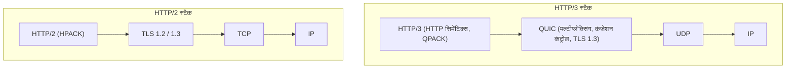
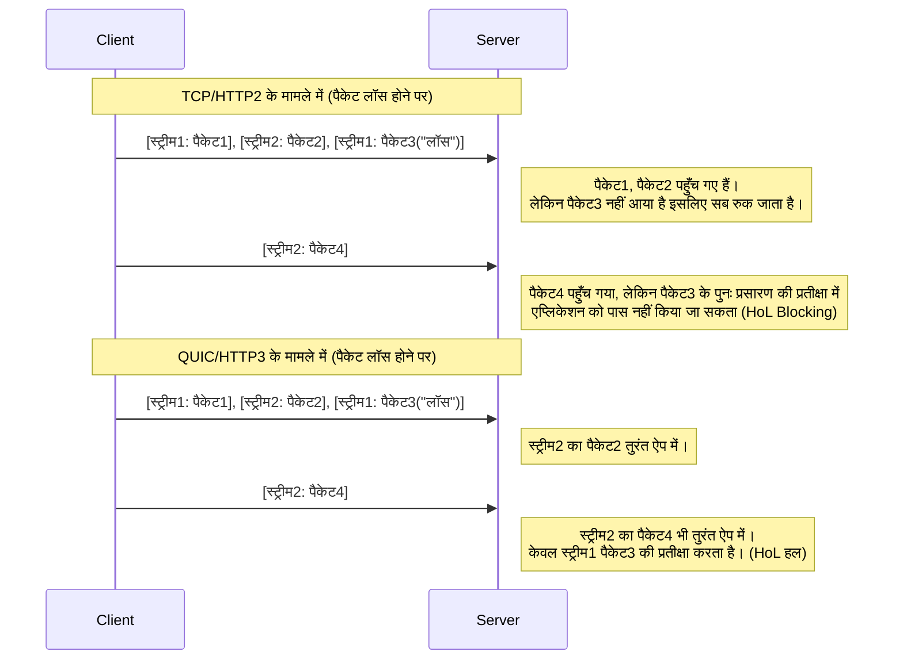
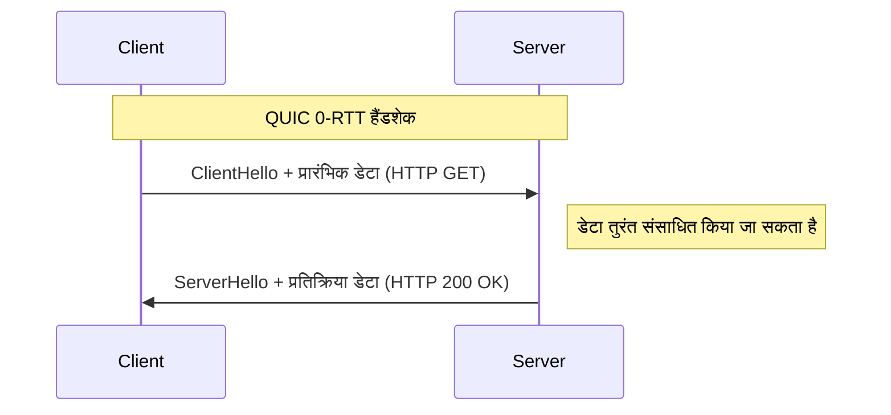

# 1. परिचय: वेब संचार का विकास और अगली पीढ़ी की शुरुआत

इंटरनेट की दुनिया लगातार तकनीकी नवाचारों द्वारा समर्थित है। जिन वेब साइटों और एप्लिकेशन का हम हर दिन उपयोग करते हैं, उनके पीछे **HTTP (Hypertext Transfer Protocol)** नामक प्रोटोकॉल काम करता है। 1990 के दशक में सामने आए HTTP/1.0 से शुरू होकर, लंबे समय तक इस्तेमाल किए जाने वाले HTTP/1.1 और फिर HTTP/2 जिसने प्रदर्शन में काफी सुधार किया, इसका विकास जारी है।

हालांकि, आधुनिक वेब समृद्ध सामग्री (उच्च-गुणवत्ता वाली छवियां, वीडियो स्ट्रीमिंग, जटिल जावास्क्रिप्ट एप्लिकेशन) से भरा है, और पारंपरिक प्रोटोकॉल स्टैक में सीमाएं दिखाई देने लगी थीं। विशेष रूप से, **TCP (Transmission Control Protocol)** के विनिर्देश, जिसने लंबे समय से इंटरनेट के ट्रांसपोर्ट लेयर का समर्थन किया है, वेब को और तेज करने में एक बाधा बन गए थे।

यहीं पर **HTTP/3** और इसका अंतर्निहित **QUIC (Quick UDP Internet Connections)** प्रोटोकॉल चलन में आया। HTTP/3 ने TCP को छोड़ने और आश्चर्यजनक रूप से **UDP (User Datagram Protocol)** के ऊपर एक नया विश्वसनीयता संचार लेयर बनाने का एक बहुत ही महत्वाकांक्षी दृष्टिकोण अपनाया।

इस लेख में, हम वास्तुकला, एल्गोरिदम, विशिष्ट कोड उदाहरणों और आरेखों का उपयोग करते हुए अत्यंत विस्तार से बताएंगे कि HTTP/3 और QUIC क्यों आवश्यक थे, और TCP की किन सीमाओं को UDP के साथ दूर किया गया था।

---

# 2. HTTP का इतिहास और TCP की सीमाएँ

HTTP/3 के नवाचार को समझने के लिए, सबसे पहले उन समस्याओं को समझना आवश्यक है जिनका सामना इसके पूर्ववर्तियों HTTP/1.1 और HTTP/2 को करना पड़ा, अर्थात "TCP की सीमाएँ"।

## 2.1 HTTP/1.1 से HTTP/2 तक का विकास और शेष चुनौतियाँ

HTTP/1.1 में, एक ही TCP कनेक्शन पर एक के बाद एक अनुरोध और प्रतिक्रियाओं को अनुक्रमिक रूप से संसाधित करना आवश्यक था। इसे हल करने के लिए, कई TCP कनेक्शन खोलने का वर्कअराउंड लोकप्रिय हो गया, लेकिन TCP कनेक्शन स्थापित करना महंगा था, और प्रति ब्राउज़र समवर्ती कनेक्शन की सीमा (आमतौर पर 6) थी।

HTTP/2 ने इस समस्या को **स्ट्रीम** के माध्यम से **मल्टीप्लेक्सिंग (Multiplexing)** से हल किया। इसने एक एकल TCP कनेक्शन के भीतर कई वर्चुअल स्ट्रीम बनाए, जिससे अनुरोधों और प्रतिक्रियाओं को छोटे फ्रेम में विभाजित करके एक साथ आदान-प्रदान किया जा सके।


इससे HTTP स्तर पर "प्रतीक्षा (HTTP की Head-of-Line Blocking)" समाप्त हो गई। हालांकि, मुख्य समस्या ट्रांसपोर्ट लेयर, यानी TCP में छिपी थी।

## 2.2 TCP की Head-of-Line (HoL) Blocking

TCP एक अत्यधिक विश्वसनीय प्रोटोकॉल है जो "ऑर्डर गारंटी" और "पैकेट लॉस रीट्रांसमिशन" प्रदान करता है। जब भेजने वाला पैकेट `1, 2, 3, 4` भेजता है, तो प्राप्तकर्ता उन्हें उसी क्रम में एप्लिकेशन लेयर (HTTP/2) को पास करता है।

यदि नेटवर्क के बीच में पैकेट `2` खो जाता है (पैकेट लॉस), तो प्राप्तकर्ता बाद के पैकेटों को एप्लिकेशन लेयर में तब तक पास नहीं कर सकता जब तक कि पैकेट `2` को फिर से ट्रांसमिट नहीं किया जाता और डिलीवर नहीं किया जाता, भले ही उसे पैकेट `3` और `4` मिल गए हों। इसे **TCP स्तर की Head-of-Line Blocking (HoL Blocking)** कहा जाता है।

चूंकि HTTP/2 एक एकल TCP कनेक्शन पर सभी स्ट्रीम को मल्टीप्लेक्स करता है, इसलिए यह एक घातक कमजोरी से ग्रस्त था जहां सिर्फ एक पैकेट लॉस **सभी स्ट्रीम के संचार को अस्थायी रूप से रोक देगा**। मोबाइल नेटवर्क जैसे वातावरण में जहां पैकेट लॉस अक्सर होता है, HTTP/2 का प्रदर्शन कभी-कभी HTTP/1.1 से भी खराब हो जाता है।

## 2.3 हैंडशेक लेटेंसी (RTT का संचय)

TCP एक कनेक्शन-उन्मुख प्रोटोकॉल है जिसे संचार शुरू करने से पहले **3-वे हैंडशेक** की आवश्यकता होती है। इसके अलावा, एन्क्रिप्शन (TLS) हैंडशेक भी जोड़ा जाता है, जो आधुनिक वेब में आवश्यक है।

TCP + TLS 1.2 वातावरण में, संचार स्थापित होने में राउंड ट्रिप टाइम (RTT) का कई गुना समय लगता है।

*   **TCP हैंडशेक:** $ 1 \text{ आरटीटी} $
*   **TLS हैंडशेक:** $ 2 \text{ आरटीटी} $ (TLS 1.2 के मामले में)

पहला HTTP अनुरोध भेजे जाने से पहले कुल $ 3 \text{ आरटीटी} $ समय का उपभोग किया जाता है। चूंकि प्रकाश की गति जैसे भौतिक नियमों की सीमाएं हैं, इसलिए RTT को शून्य करना असंभव है (उदाहरण के लिए, जापान और अमेरिका के पश्चिमी तट के बीच संचार में RTT लगभग 100ms लेता है)। इसलिए, संचार स्थापित करने के लिए आवश्यक RTT की संख्या को कम करना प्रदर्शन में सुधार के लिए एक पूर्ण आवश्यकता थी।

## 2.4 IP मोबिलिटी का अभाव (कनेक्शन का कटना)

TCP संचार करने वाले दोनों एंडपॉइंट्स को **IP पते और पोर्ट नंबर के 4 संयोजनों (Source IP, Source Port, Destination IP, Destination Port)** द्वारा पहचानता है।

यदि स्मार्टफोन वाई-फाई से 4G/5G नेटवर्क पर स्विच होता है, तो डिवाइस का IP पता बदल जाता है। जब IP पता बदलता है, तो TCP इसे एक अलग संचार मानता है, और मौजूदा TCP कनेक्शन काट दिया जाता है। यदि आप वीडियो स्ट्रीमिंग कर रहे हैं या बड़ी फाइलें डाउनलोड कर रहे हैं, तो आपको कनेक्शन को खरोंच से फिर से स्थापित करने की आवश्यकता है, जिससे उपयोगकर्ता अनुभव (UX) काफी खराब हो जाता है।

---

# 3. QUIC का जन्म: UDP के कैनवास पर एक नई दुनिया

Google ने इन TCP सीमाओं को दूर करने के लिए विकास शुरू किया, और बाद में IETF (Internet Engineering Task Force) द्वारा इसे **QUIC (Quick UDP Internet Connections)** के रूप में मानकीकृत किया गया।

QUIC का सबसे बड़ा आश्चर्य यह है कि इसने TCP को छोड़ दिया, जो लंबे समय से इंटरनेट की नींव था, और इसके बजाय **UDP (User Datagram Protocol)** को अपने आधार के रूप में अपनाया।

## 3.1 TCP को सुधारने के बजाय UDP को क्यों चुना गया?

आप सोच सकते हैं, "यदि TCP में कोई समस्या है, तो TCP को ही क्यों न अपग्रेड करें?" हालांकि, वास्तविकता में यह अत्यंत कठिन था।

इसका सबसे बड़ा कारण **मिडिलबॉक्स (Middleboxes) का कठोर होना (Ossification)** है।
इंटरनेट पर राउटर, फायरवॉल, NAT (Network Address Translation) और लोड बैलेंसर जैसे नेटवर्क उपकरण (मिडिलबॉक्स) TCP विनिर्देशों (हेडर संरचना, ध्वज व्यवहार, आदि) की गहराई से व्याख्या करते हैं और अनुकूलन और सुरक्षा जांच करते हैं।

यदि आप TCP हेडर में एक नया ध्वज जोड़ते हैं या TCP का नया संस्करण बनाते हैं, तो दुनिया भर के अनगिनत पुराने मिडिलबॉक्स इसे "अमान्य पैकेट" के रूप में त्याग देंगे। इसे **प्रोटोकॉल का कठोर होना (Protocol Ossification)** कहा जाता है।

दूसरी ओर, UDP एक बहुत ही सरल प्रोटोकॉल है जिसमें केवल गंतव्य पोर्ट, स्रोत पोर्ट और चेकसम की जानकारी होती है। मिडिलबॉक्स भी UDP की सामग्री में गहराई से हस्तक्षेप नहीं करते हैं।
इसलिए, **"UDP के खाली कैनवास पर, उपयोगकर्ता स्थान (एप्लिकेशन लेयर के करीब) में TCP जैसे विश्वसनीयता नियंत्रण और TLS एन्क्रिप्शन को पूरी तरह से फिर से लागू करने"** का दृष्टिकोण अपनाया गया। यही QUIC है।

## 3.2 QUIC का प्रोटोकॉल स्टैक

HTTP/3 का प्रोटोकॉल स्टैक जिसने QUIC पेश किया, वह इस प्रकार है।



QUIC HTTP/2 के मल्टीप्लेक्सिंग (स्ट्रीम) फ़ंक्शन, TCP के कंजेशन कंट्रोल और पैकेट लॉस रिकवरी फ़ंक्शन, और TLS 1.3 एन्क्रिप्शन फ़ंक्शन को एक ही परत में एकीकृत करता है।

---

# 4. QUIC द्वारा लाए गए नवीन कार्य और समाधान

QUIC ने ऊपर वर्णित TCP की सीमाओं को कैसे हल किया? आइए इसके मूल में नवीन तकनीकों पर एक विस्तृत नज़र डालें।

## 4.1 ट्रांसपोर्ट लेयर में HoL Blocking का समाधान

QUIC ने TCP जैसी "संपूर्ण कनेक्शन के लिए ऑर्डर गारंटी" को त्याग दिया और **"प्रति-स्ट्रीम ऑर्डर गारंटी"** पेश की।

QUIC के भीतर कई स्वतंत्र स्ट्रीम मौजूद हैं, और प्रत्येक पैकेट में इस बात की जानकारी होती है कि वह किस स्ट्रीम से संबंधित है। यदि कोई पैकेट खो जाता है, तो केवल **वह स्ट्रीम जिससे खोया हुआ पैकेट संबंधित है** को प्रतीक्षा कराई जाती है। अन्य स्ट्रीम से संबंधित पैकेट नुकसान से प्रभावित हुए बिना एप्लिकेशन लेयर (HTTP/3) में वितरित किए जाते हैं।



इसने अस्थिर नेटवर्क वातावरण (जैसे मोबाइल नेटवर्क या भीड़भाड़ वाले सार्वजनिक वाई-फाई) में प्रदर्शन में काफी सुधार किया, जहां पैकेट लॉस होने की संभावना होती है।

## 4.2 कनेक्शन स्थापना को अत्यंत तेज़ करना (1-RTT और 0-RTT)

QUIC को ट्रांसपोर्ट लेयर हैंडशेक और एन्क्रिप्शन (TLS 1.3) हैंडशेक को **एक साथ** करने के लिए डिज़ाइन किया गया है।

किसी सर्वर के साथ पहली बार संचार करते समय, यह **1-RTT** में कनेक्शन स्थापना और एन्क्रिप्शन कुंजी विनिमय को पूरा कर सकता है, और तुरंत डेटा भेजना शुरू कर सकता है। TCP+TLS1.2 के $ 3 \text{ आरटीटी} $ की तुलना में, यह एक नाटकीय विकास है।

इसके अलावा, QUIC उन सर्वरों के लिए **0-RTT (Zero Round Trip Time)** नामक एक जादुई सुविधा प्रदान करता है जिनके साथ इसने पहले संचार किया है।
क्लाइंट पिछले संचार में सर्वर से प्राप्त सत्र टिकटों और मापदंडों का उपयोग करता है, और पहले हैंडशेक पैकेट (ClientHello) के साथ तुरंत HTTP अनुरोध डेटा (GET अनुरोध, आदि) भेजता है।



यह सैद्धांतिक रूप से संचार शुरू करने में देरी को शून्य कर देता है। हालांकि, 0-RTT डेटा में सुरक्षा जोखिम होता है क्योंकि यह **रिप्ले अटैक (Replay Attack)** के प्रति संवेदनशील होता है। इसलिए, 0-RTT में भेजना केवल सुरक्षित अनुरोधों तक सीमित है जिनमें GET अनुरोधों की तरह "आइडम्पोटेंसी (Idempotency - कोई फर्क नहीं पड़ता कि आप इसे कितनी बार निष्पादित करते हैं, परिणाम समान होता है)" होती है।

## 4.3 कनेक्शन माइग्रेशन (Connection Migration)

IP पते बदलने पर कट जाने वाली TCP की कमजोरी को दूर करने के लिए, QUIC कनेक्शनों को IP पते या पोर्ट नंबरों के बजाय **कनेक्शन ID (Connection ID)** नामक एक अद्वितीय पहचानकर्ता द्वारा प्रबंधित करता है।

कनेक्शन ID को QUIC पैकेट हेडर में बिना एन्क्रिप्ट किए (ताकि इसे रूट किया जा सके) शामिल किया जाता है।

मान लीजिए कि कोई उपयोगकर्ता वाई-फाई रेंज से बाहर चला जाता है और 4G/5G पर स्विच हो जाता है, और स्मार्टफोन का IP पता बदल जाता है। QUIC क्लाइंट नए IP पते से पैकेट भेजता है, लेकिन उस पैकेट में मौजूदा "कनेक्शन ID" शामिल होता है।
सर्वर पता लगाता है कि IP पता बदल गया है, लेकिन चूंकि कनेक्शन ID मेल खाता है, यह इसे "समान संचार की निरंतरता" के रूप में पहचानता है और बिना फिर से हैंडशेक किए संचार जारी रखता है।

इस सुविधा ने मोबाइल वातावरण में निर्बाध संचार स्विचिंग को सक्षम किया, जिससे वीडियो बफरिंग स्टॉप और डाउनलोड विफलताएं काफी कम हो गईं।

---

# 5. HTTP/3: QUIC पर HTTP सिमेंटिक्स

QUIC प्रोटोकॉल स्वयं विशेष रूप से HTTP के लिए नहीं है, बल्कि एक सामान्य प्रयोजन वाला ट्रांसपोर्ट प्रोटोकॉल है। इस QUIC के ऊपर HTTP सिमेंटिक्स (तरीके, हेडर, स्टेटस कोड आदि) को संचालित करने का विनिर्देश **HTTP/3** है।

HTTP/3 मूल रूप से HTTP/2 की अवधारणाओं को विरासत में मिला है, लेकिन चूंकि निचली परत TCP से QUIC में बदल गई है, इसलिए कुछ महत्वपूर्ण बदलाव किए गए हैं।

## 5.1 QPACK के साथ हेडर संपीड़न

HTTP/2 ने **HPACK** नामक हेडर संपीड़न एल्गोरिदम का उपयोग किया। HPACK संचार के दोनों सिरों पर एक डायनेमिक टेबल (Dynamic Table) बनाए रखता है, और एक बार भेजे गए हेडर के लिए केवल इंडेक्स नंबर भेजकर ट्रैफ़िक को कम करता है।

हालांकि, HPACK पूरी तरह से TCP की "ऑर्डर गारंटी" पर निर्भर था। दूसरे शब्दों में, यदि कोई हेडर ब्लॉक खो जाता है और पुनः प्रसारण की प्रतीक्षा कर रहा है, तो HPACK-प्रेरित HoL Blocking थी जहां बाद के स्ट्रीम के हेडर को तब तक डिकोड नहीं किया जा सकता था जब तक कि आश्रित डायनेमिक टेबल को अपडेट नहीं किया जाता।

चूंकि QUIC स्ट्रीम के बीच ऑर्डरिंग की गारंटी नहीं देता है, अगर HPACK का उपयोग वैसे ही किया जाता है, तो जब स्ट्रीम अलग क्रम में पहुंचेंगे तो डायनेमिक टेबल का सिंक्रनाइज़ेशन टूट जाएगा।

इसे हल करने के लिए **QPACK** को नया रूप दिया गया। QPACK में, प्रत्येक डेटा स्ट्रीम से डायनेमिक टेबल के अपडेट को अलग करने और एक समर्पित नियंत्रण स्ट्रीम के साथ एसिंक्रोनस रूप से टेबल को प्रबंधित करने के लिए एक तंत्र पेश किया गया था। यह QUIC के अनियंत्रित स्ट्रीम डिलीवरी के तहत भी सुरक्षित और उच्च संपीड़न हेडर संचार सक्षम करता है।

## 5.2 नियंत्रण स्ट्रीम और यूनिडायरेक्शनल स्ट्रीम

HTTP/3 में, द्विदिश अनुरोध/प्रतिक्रिया स्ट्रीम के अलावा, कई विशेष **यूनिडायरेक्शनल स्ट्रीम** परिभाषित किए गए हैं।

1.  **नियंत्रण स्ट्रीम:** एक स्ट्रीम जो सेटिंग्स (SETTINGS फ्रेम) आदि का आदान-प्रदान करती है।
2.  **QPACK एनकोडर स्ट्रीम:** QPACK डायनेमिक टेबल को अपडेट करने के लिए एक स्ट्रीम।
3.  **QPACK डिकोडर स्ट्रीम:** QPACK टेबल अपडेट पुष्टिकरण और त्रुटियों को संप्रेषित करने के लिए एक स्ट्रीम।

डेटा विरोधों और अनावश्यक प्रतीक्षा को रोकने के लिए स्ट्रीम को उनकी भूमिकाओं के आधार पर अलग करके यह एक अनुकूलन है।

---

# 6. तकनीकी गहराई: QUIC के एल्गोरिदम और सूत्र

यहां से, हम थोड़ी अधिक तकनीकी गहराई में जाएंगे और गणितीय सूत्रों का उपयोग करते हुए QUIC का समर्थन करने वाले एल्गोरिदम और प्रदर्शन मूल्यांकन पर विचार करेंगे।

## 6.1 BBR (Bottleneck Bandwidth and Round-trip propagation time) कंजेशन कंट्रोल

चूंकि QUIC को यूजर स्पेस में लागू किया गया है, इसलिए इसमें OS कर्नेल अपडेट की प्रतीक्षा किए बिना कंजेशन कंट्रोल एल्गोरिदम को स्वतंत्र रूप से और जल्दी से अपडेट करने में सक्षम होने का लाभ है। कई मामलों में, Google द्वारा विकसित **BBR** को QUIC के कंजेशन कंट्रोल के रूप में अपनाया जाता है।

पारंपरिक लॉस-आधारित कंजेशन कंट्रोल जैसे कि CUBIC TCP पैकेट लॉस होने तक ट्रांसमिशन विंडो का विस्तार करना जारी रखता है। इससे बफरब्लोट (एक ऐसी घटना जहां नेटवर्क उपकरण के बफर भर जाते हैं और विलंबता बढ़ जाती है) होने की समस्या थी।

पारंपरिक TCP थ्रूपुट (Mathis का सूत्र) को निम्नानुसार व्यक्त किया गया है।

$ \text{थ्रूपुट} \le \frac{\text{एमएसएस}}{R \times \sqrt{p}} $

*   $ \text{एमएसएस} $ : Maximum Segment Size (अधिकतम सेगमेंट आकार)
*   $ R $ : Round Trip Time (RTT)
*   $ p $ : पैकेट लॉस दर

जैसा कि यह सूत्र दिखाता है, लॉस-आधारित TCP में, थ्रूपुट में नाटकीय रूप से गिरावट आती है यदि पैकेट लॉस दर $ p $ थोड़ी भी बढ़ जाती है।

इसके विपरीत, BBR पैकेट लॉस को नहीं मापता है, बल्कि नेटवर्क की सीमाओं का अनुमान लगाने के लिए सीधे **बैंडविड्थ (Bandwidth)** और **विलंब (RTT)** को मापता है।

BBR निम्न सूत्र के साथ नेटवर्क पाइप की क्षमता को मॉडल करता है।

$ \text{बीडीपी (बैंडविड्थ-डिले प्रोडक्ट)} = \text{बीटीएलबीयू} \times \text{आरटीप्रॉप} $

*   $ \text{बीटीएलबीयू} $ : Bottleneck Bandwidth (बॉटलनेक बैंडविड्थ・पिछली अधिकतम संचार गति)
*   $ \text{आरटीप्रॉप} $ : Round-Trip propagation time (प्रसार विलंब・पिछला न्यूनतम RTT)

BBR ट्रांसमिशन गति को समायोजित करता है ताकि ट्रांसमिशन (In-flight) में डेटा की मात्रा इस BDP से मेल खाए। परिणामस्वरूप, भले ही पैकेट लॉस (उदा: वायरलेस हस्तक्षेप के कारण लॉस) हो, गति अनावश्यक रूप से कम नहीं होती है, और यह राउटर के बफर को ओवरफ्लो नहीं होने देती है, जिससे उच्च थ्रूपुट और कम विलंबता दोनों प्राप्त होते हैं। QUIC के यूजर स्पेस कार्यान्वयन और BBR का संयोजन सर्वोत्तम प्रदर्शन प्रदान करता है।

## 6.2 एन्क्रिप्शन और सुरक्षा का एकीकरण

QUIC में डिफ़ॉल्ट रूप से **TLS 1.3** शामिल है, और बिना एन्क्रिप्टेड "प्लेनटेक्स्ट" QUIC कनेक्शन जैसी कोई चीज नहीं है। TCP के मामले में, चूंकि TCP हेडर स्वयं एन्क्रिप्टेड नहीं है, इसलिए मिडिलबॉक्स TCP फ्लैग्स (SYN, ACK, FIN, आदि) की जासूसी कर सकते हैं या उनके साथ छेड़छाड़ (RST इंजेक्शन, आदि) कर सकते हैं।

QUIC में, IP हेडर और UDP हेडर के अपवाद के साथ, QUIC हेडर (पैकेट नंबर आदि सहित) और पेलोड का अधिकांश भाग पूरी तरह से एन्क्रिप्टेड होता है।
चूंकि पैकेट नंबरों को भी एन्क्रिप्ट किया जाता है, इसलिए नेटवर्क ट्रैफ़िक की निगरानी करके यह अनुमान लगाना बेहद मुश्किल हो जाता है कि कौन से पैकेट फिर से प्रेषित किए गए थे और वर्तमान कंजेशन विंडो क्या है। गोपनीयता सुरक्षा के नजरिए से यह बहुत शक्तिशाली है।

---

# 7. QUIC कार्यान्वयन और कोड उदाहरण

यह समझने के लिए कि QUIC को प्रोग्रामेटिक रूप से कैसे नियंत्रित किया जाता है, आइए कोड उदाहरण देखें।
यह एक साधारण HTTP/3 सर्वर और क्लाइंट का उदाहरण है जो Python के `aioquic` नामक एक एसिंक्रोनस QUIC कार्यान्वयन लाइब्रेरी का उपयोग करता है।

## 7.1 Python (aioquic) का उपयोग करके HTTP/3 सर्वर

```python
import asyncio
from aioquic.asyncio import serve
from aioquic.h3.connection import H3_ALPN, H3Connection
from aioquic.h3.events import DataReceived, HeadersReceived
from aioquic.quic.configuration import QuicConfiguration

class Http3ServerProtocol(asyncio.Protocol):
    def __init__(self):
        self.http = H3Connection(is_client=False)
        self.transport = None

    def connection_made(self, transport):
        self.transport = transport

    def datagram_received(self, data, addr):
        # UDP डेटाग्राम प्राप्त करें और इसे QUIC प्रोटोकॉल स्टैक में पास करें
        self.http.receive_datagram(data, addr, now=asyncio.get_event_loop().time())
        self.process_http_events()

    def process_http_events(self):
        for event in self.http.next_event():
            if isinstance(event, HeadersReceived):
                print(f"Received headers: {event.headers}")
                # एक साधारण 200 OK प्रतिक्रिया बनाएँ
                headers = [
                    (b":status", b"200"),
                    (b"server", b"aioquic"),
                    (b"content-type", b"text/html"),
                ]
                self.http.send_headers(event.stream_id, headers)
                self.http.send_data(event.stream_id, b"<h1>Hello HTTP/3 via QUIC!</h1>", end_stream=True)
                
        # UDP पर प्रतिक्रिया भेजें
        for data, addr in self.http.datagrams_to_send(now=asyncio.get_event_loop().time()):
            self.transport.sendto(data, addr)

async def main():
    configuration = QuicConfiguration(is_client=False, alpn_protocols=H3_ALPN)
    # प्रमाणपत्र लोड करने की आवश्यकता है
    configuration.load_cert_chain("cert.pem", "key.pem")
    
    # UDP के पोर्ट 443 पर सुनें
    await serve("0.0.0.0", 443, configuration=configuration, create_protocol=Http3ServerProtocol)
    print("HTTP/3 Server listening on UDP 443...")
    await asyncio.Future()  # हमेशा चलाएं

if __name__ == "__main__":
    asyncio.run(main())
```

जैसा कि आप इस कोड से देख सकते हैं, हालांकि अंतर्निहित संचार पूरी तरह से **UDP संचार (datagram_received / sendto)** है, उन्नत HTTP/3 स्ट्रीम नियंत्रण और हेडर प्रोसेसिंग इसके ऊपर की जाती है।

## 7.2 Nginx में HTTP/3 सक्षम करना

Nginx, जिसका व्यापक रूप से वेब सर्वर के रूप में उपयोग किया जाता है, डिफ़ॉल्ट रूप से संस्करण 1.25.0 और बाद के संस्करणों में HTTP/3 और QUIC का भी समर्थन करता है।
सेटअप बहुत सरल है, मौजूदा TLS कॉन्फ़िगरेशन में बस कुछ पंक्तियाँ जोड़कर।

```nginx
server {
    # पारंपरिक TCP (HTTP/1.1, HTTP/2) के लिए
    listen 443 ssl;
    listen [::]:443 ssl;
    
    # नए UDP (HTTP/3, QUIC) के लिए
    listen 443 quic reuseport;
    listen [::]:443 quic reuseport;

    server_name example.com;

    ssl_certificate     /path/to/cert.pem;
    ssl_certificate_key /path/to/key.pem;
    # QUIC के लिए TLS 1.3 आवश्यक है
    ssl_protocols       TLSv1.2 TLSv1.3;

    location / {
        root /var/www/html;
        # क्लाइंट को बताएं कि HTTP/3 उपलब्ध है (Alt-Svc हेडर)
        add_header Alt-Svc 'h3=":443"; ma=86400';
    }
}
```

यहां महत्वपूर्ण हिस्सा `Alt-Svc` हेडर है। ब्राउज़र शुरुआत में ऐतिहासिक कारणों से TCP (HTTP/2, आदि) पर कनेक्ट करने का प्रयास करता है। यदि प्रतिक्रिया में `Alt-Svc: h3=":443"` शामिल है, तो यह पहचानता है कि "यह सर्वर UDP पोर्ट 443 पर HTTP/3 भी बोल सकता है!", और अगली बार से या बैकग्राउंड में QUIC के माध्यम से कनेक्शन को अपग्रेड करने का प्रयास करेगा।

---

# 8. परिनियोजन और संचालन की चुनौतियाँ (Challenges of Deployment)

QUIC और HTTP/3 स्वप्निल तकनीकें हैं, लेकिन जब उन्हें वास्तविक संचालन में लागू करने की बात आती है तो कई बड़ी बाधाएं होती हैं।

## 8.1 एंटरप्राइज़ फायरवॉल द्वारा UDP को ब्लॉक करना

इंटरनेट के शुरुआती दिनों से, ऐसे कई मामले सामने आए हैं जहां कॉर्पोरेट फायरवॉल और नेटवर्क एडमिनिस्ट्रेटर ने **पोर्ट 53 (DNS) और 123 (NTP) को छोड़कर सभी UDP को ब्लॉक (DROP) कर दिया है** क्योंकि इसका उपयोग अक्सर "DDoS हमलों" या "संदिग्ध [P2P](https://kenji.blog/hi/p/webrtc-realtime-communication-p2p/) संचार" के लिए किया जाता है।

QUIC UDP पोर्ट 443 का उपयोग करता है, लेकिन ऐसे वातावरण में जहां इसे केवल इसलिए ब्लॉक किया जाता है क्योंकि यह UDP है, HTTP/3 संचार स्थापित नहीं किया जा सकता है।
इस मामले में, ब्राउज़र के पास कुछ मिलीसेकंड से कुछ सेकंड तक प्रतीक्षा करने और QUIC संचार टाइमआउट का पता लगाने पर स्वचालित रूप से TCP (HTTP/2) पर वापस आने का एक तंत्र है। हालांकि, यह फ़ॉलबैक प्रतीक्षा समय स्वयं एक देरी बन जाता है जो उपयोगकर्ता अनुभव को ख़राब करता है।

## 8.2 उच्च CPU लोड और हार्डवेयर ऑफलोड का अभाव

TCP का दशकों का इतिहास है, और आधुनिक नेटवर्क कार्ड (NIC) में **TCP Segmentation Offload (TSO)** जैसी सुविधाएँ होती हैं, जहाँ हार्डवेयर (NIC चिप) TCP पैकेट विभाजन और चेकसम गणना करता है। इसने OS के CPU लोड को काफी कम कर दिया है।

हालांकि, चूंकि QUIC उपयोगकर्ता स्थान में काम करता है और प्रत्येक पैकेट व्यक्तिगत रूप से मजबूती से एन्क्रिप्टेड (AES-GCM या ChaCha20) होता है, सर्वर की ओर से **CPU उपयोग दर TCP+TLS की तुलना में बहुत अधिक** है जो बड़ी मात्रा में संचार को संभालता है।
वर्तमान में, हार्डवेयर विक्रेता और क्लाउड प्रदाता UDP Segmentation Offload (USO) जैसी सुविधाएँ विकसित करने में जल्दबाजी कर रहे हैं, लेकिन जब तक हार्डवेयर स्तर पर पूर्ण समर्थन व्यापक नहीं हो जाता, तब तक बुनियादी ढांचे की लागत में वृद्धि की समस्या बनी रहेगी।

## 8.3 लोड बैलेंसिंग की जटिलता

TCP ट्रैफ़िक के लिए लोड बैलेंसिंग (लोड वितरण) आमतौर पर एक साधारण 4-ट्यूपल (स्रोत IP/पोर्ट, गंतव्य IP/पोर्ट) के हैश मान का उपयोग करके बैकएंड सर्वरों को वितरित किया जाता था।

हालांकि, पूर्वोक्त **"कनेक्शन माइग्रेशन"** सुविधा के कारण QUIC क्लाइंट का IP पता और पोर्ट नंबर बीच में बदल सकता है। इसलिए, सरल IP-आधारित रूटिंग के साथ, संचार के बीच में पैकेट को दूसरे बैकएंड सर्वर पर रूट किया जाएगा और कनेक्शन टूट जाएगा।

QUIC को सही ढंग से लोड बैलेंस करने के लिए, आपको एक उन्नत लेयर 4/लेयर 7 लोड बैलेंसर की आवश्यकता होती है जो पैकेट हेडर में "कनेक्शन ID" को पढ़ सकता है और उसके आधार पर इसे हमेशा उसी बैकएंड सर्वर पर रूट कर सकता है।

---

# 9. QUIC का भविष्य: WebTransport और अनुप्रयोग क्षेत्रों का विस्तार

QUIC का वास्तविक मूल्य केवल HTTP/3 को साकार करने तक सीमित नहीं है। "एक उच्च-प्रदर्शन, सुरक्षित UDP-आधारित सामान्य-उद्देश्य ट्रांसपोर्ट प्रोटोकॉल" के रूप में, QUIC को HTTP के अलावा विभिन्न प्रोटोकॉल के आधार के रूप में भी अपनाया जा रहा है।

## 9.1 WebTransport: WebSocket का अगली पीढ़ी का मानक

वर्तमान में, वेब ब्राउज़र और सर्वर के बीच द्विदिश वास्तविक समय संचार के लिए **WebSocket** का व्यापक रूप से उपयोग किया जाता है। हालांकि, चूंकि WebSocket TCP पर काम करता है, इसलिए यह अभी भी HoL Blocking समस्या से बच नहीं सकता है। उदाहरण के लिए, गेम में रीयल-टाइम स्थिति सिंक्रनाइज़ेशन जैसे डेटा में एक विशेषता होती है कि "हम हमेशा नवीनतम डेटा चाहते हैं और थोड़ा भी विलंबित पुराना डेटा त्यागना चाहते हैं", लेकिन TCP पुराने विलंबित पैकेटों को फिर से भेजता है, जिससे गेम में अंतराल होता है।

इसे हल करने वाला नया API **WebTransport** है, जो QUIC पर आधारित है।
WebTransport के साथ, आप ब्राउज़र के जावास्क्रिप्ट से सीधे न केवल स्ट्रीम संचार को संभाल सकते हैं जो विश्वसनीयता की गारंटी देता है, बल्कि **डेटाग्राम संचार** को भी संभाल सकते हैं जो पैकेट हानि को सहन करने पर भी जितनी जल्दी हो सके डेटा भेजता है।
उम्मीद है कि इससे ब्राउज़र-आधारित क्लाउड गेमिंग और अल्ट्रा-लो लेटेंसी लाइव वीडियो स्ट्रीमिंग ([WebRTC](https://kenji.blog/hi/p/webrtc-realtime-communication-p2p/) का विकल्प) में काफी सुधार होगा।

## 9.2 विभिन्न प्रोटोकॉल का "over QUIC"

QUIC की उत्कृष्ट विशेषताओं का लाभ उठाते हुए, मौजूदा प्रोटोकॉल को QUIC में बदलने के लिए मानकीकरण चल रहा है।

*   **DoQ (DNS over QUIC):** अगली पीढ़ी का DNS प्रोटोकॉल जो गोपनीयता और गति को जोड़ता है। यह TCP पर DoT से तेज है और UDP पर प्लेनटेक्स्ट DNS से अधिक सुरक्षित है।
*   **SMB over QUIC:** विंडोज़ फ़ाइल शेयरिंग प्रोटोकॉल (SMB) का QUIC संस्करण, एक ऐसी तकनीक जो वीपीएन के बिना भी इंटरनेट पर फ़ाइल सर्वर तक सुरक्षित और तेज़ पहुँच सक्षम बनाती है (विंडोज़ सर्वर 2022 में लागू)।
*   **SSH over QUIC:** अंतिम SSH टर्मिनल कनेक्शन जो तब भी डिस्कनेक्ट नहीं होता है जब आप मोबाइल नेटवर्क पर घूम रहे होते हैं।

इस तरह, QUIC "इंटरनेट संचार के लिए नए लेयर 4 मानक" के रूप में खुद को स्थापित कर रहा है।

---

# 10. निष्कर्ष: TCP के युग से QUIC के युग तक

इस लेख में, हमने HTTP/3 और QUIC प्रोटोकॉल, TCP की सीमाओं से लेकर UDP तक प्रतिमान बदलाव, HoL Blocking का समाधान, कनेक्शन स्थापना को गति देना, और कार्यान्वयन और परिचालन चुनौतियों के बारे में गहराई से चर्चा की है।

*   **TCP की सीमाएँ:** ऑर्डरिंग गारंटी के कारण HoL Blocking, हैंडशेक विलंबता, और IP पता बदलने की भेद्यता।
*   **QUIC का नवाचार:** UDP के आधार पर, यह उपयोगकर्ता स्थान में स्ट्रीम मल्टीप्लेक्सिंग, TLS 1.3 एकीकरण और कनेक्शन ID का उपयोग करके माइग्रेशन का एहसास करता है।
*   **HTTP/3:** QUIC की विशेषताओं के लिए अनुकूलित नए HTTP विनिर्देश, जैसे QPACK।

TCP एक महान प्रोटोकॉल है जिसने पिछले 40 वर्षों से इंटरनेट के विस्फोटक विकास का समर्थन किया है। हालांकि, आज की दुनिया में जहां मिलीसेकंड-स्तर का प्रदर्शन सीधे व्यापार से जुड़ा है और हर कोई मोबाइल वातावरण में समृद्ध वेब एप्लिकेशन का उपयोग करता है, इसकी वास्तुकला की सीमाएं स्पष्ट थीं।

UDP के खाली कैनवास पर खींचे गए QUIC ने वेब संचार की बाधाओं को मौलिक रूप से नष्ट कर दिया है। फायरवॉल कॉन्फ़िगरेशन और हार्डवेयर अनुकूलन जैसी अभी भी बाधाएं हैं जिन्हें दूर किया जाना है, लेकिन Google, Facebook (Meta), और Cloudflare के विशाल ट्रैफ़िक का अधिकांश हिस्सा पहले ही HTTP/3 में स्थानांतरित हो चुका है।

जिन वेब एप्लिकेशन को हम हर दिन विकसित करते हैं, वे बिना जाने भी QUIC से लाभान्वित होंगे, और तेज़ और अधिक मजबूत बनेंगे। हम भविष्य में इस नवोन्मेषी प्रोटोकॉल के रुझान पर नजर रखना जारी रखेंगे जो अगली पीढ़ी के वेब को आकार देता है।

---

*संदर्भ सामग्री:*
*   RFC 9000: QUIC: A UDP-Based Multiplexed and Secure Transport
*   RFC 9114: HTTP/3
*   RFC 9204: QPACK: Field Compression for HTTP/3
*   IETF QUIC Working Group संबंधित दस्तावेज़
