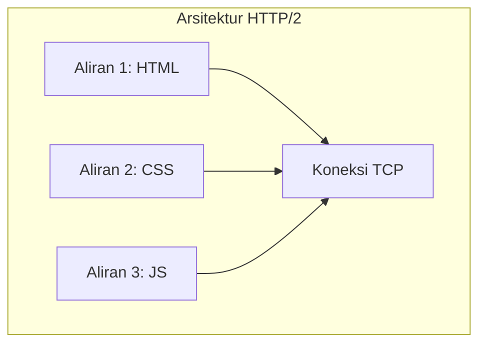
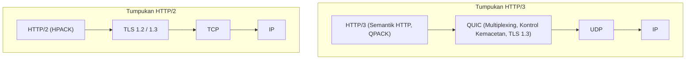
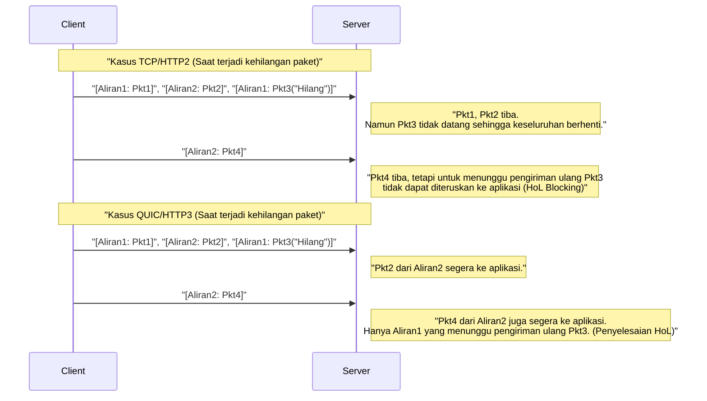
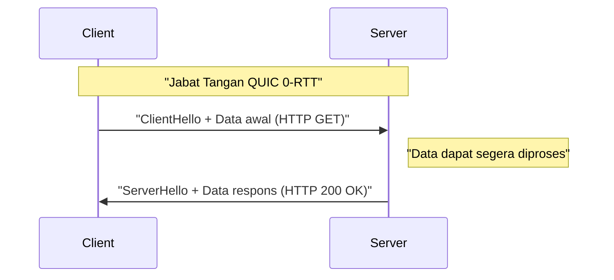

# 1. Pendahuluan: Evolusi Komunikasi Web dan Awal Generasi Berikutnya

Dunia internet didukung oleh inovasi teknologi yang terus-menerus. Di balik situs web dan aplikasi yang kita gunakan sehari-hari, beroperasi sebuah protokol yang disebut **HTTP (Hypertext Transfer Protocol)**. Dimulai dari HTTP/1.0 yang muncul pada tahun 1990-an, berkembang menjadi HTTP/1.1 yang digunakan dalam waktu lama, dan kemudian HTTP/2 yang secara signifikan meningkatkan kinerja.

Namun, Web modern dipenuhi dengan konten yang kaya (gambar resolusi tinggi, streaming video, aplikasi JavaScript yang kompleks), dan batasan dari tumpukan protokol konvensional mulai terlihat. Secara khusus, spesifikasi dari **TCP (Transmission Control Protocol)** itu sendiri, yang telah mendukung lapisan transport internet selama bertahun-tahun, menjadi penghambat untuk percepatan Web lebih lanjut.

Dari sinilah muncul **HTTP/3** beserta fondasinya, protokol **QUIC (Quick UDP Internet Connections)**. HTTP/3 mengambil pendekatan yang sangat ambisius dengan meninggalkan TCP dan membangun lapisan komunikasi yang andal di atas **UDP (User Datagram Protocol)**.

Dalam artikel ini, kita akan membahas secara mendetail mengapa HTTP/3 dan QUIC diperlukan, dan bagaimana UDP mengatasi keterbatasan TCP, disertai dengan arsitektur, algoritma, contoh kode konkret, serta diagram.

---

# 2. Sejarah HTTP dan Keterbatasan TCP

Untuk memahami inovasi HTTP/3, pertama-tama kita harus mengetahui lebih dalam tentang masalah yang dihadapi oleh pendahulunya, yaitu HTTP/1.1 dan HTTP/2, atau "keterbatasan TCP".

## 2.1 Evolusi dari HTTP/1.1 ke HTTP/2 dan Masalah yang Tersisa

Pada HTTP/1.1, satu permintaan dan respons harus diproses secara berurutan pada satu koneksi TCP. Untuk mengatasinya, solusi dengan membuka banyak koneksi TCP menjadi populer, tetapi pembuatan koneksi TCP membutuhkan biaya, dan ada batasan jumlah koneksi simultan (biasanya 6) untuk setiap browser.

HTTP/2 memecahkan masalah ini dengan **pemultipleksan (Multiplexing)** melalui **aliran (stream)**. Ini membuat beberapa aliran virtual dalam satu koneksi TCP, memecah permintaan dan respons menjadi bingkai-bingkai kecil, dan memungkinkan mereka dikirim secara bersamaan.



Dengan ini, "waktu tunggu" pada level HTTP (Head-of-Line Blocking HTTP) dapat diatasi. Namun, masalah mendasarnya tersembunyi di lapisan transport, yaitu TCP.

## 2.2 Head-of-Line (HoL) Blocking pada TCP

TCP adalah protokol yang sangat andal yang melakukan "jaminan urutan" dan "pengiriman ulang kehilangan paket". Ketika pengirim mengirimkan paket `1, 2, 3, 4`, penerima harus meneruskan data ke lapisan aplikasi (HTTP/2) dalam urutan tersebut.

Jika paket `2` hilang di jaringan (kehilangan paket), bahkan jika penerima telah menerima paket `3` dan `4`, ia tidak dapat meneruskan paket-paket berikutnya ke lapisan aplikasi sampai paket `2` dikirim ulang dan tiba. Hal ini disebut **Head-of-Line Blocking (HoL Blocking) pada level TCP**.

Karena HTTP/2 menempatkan semua aliran pada satu koneksi TCP, kehilangan satu paket saja memiliki kelemahan fatal yaitu **menghentikan seluruh komunikasi aliran secara sementara**. Dalam lingkungan jaringan seluler di mana sering terjadi kehilangan paket, performa HTTP/2 bahkan bisa lebih buruk dibandingkan HTTP/1.1.

## 2.3 Latensi Jabat Tangan (Akumulasi RTT)

TCP adalah protokol yang berorientasi koneksi, sehingga perlu melakukan **jabat tangan 3 arah** sebelum memulai komunikasi. Selain itu, ada juga jabat tangan enkripsi (TLS), yang kini wajib ada di Web modern.

Dalam lingkungan TCP + TLS 1.2, dibutuhkan waktu beberapa kali lipat dari Round Trip Time (RTT) untuk membentuk komunikasi.

*   **Jabat tangan TCP:** $ 1 \text{ RTT} $
*   **Jabat tangan TLS:** $ 2 \text{ RTT} $ (Pada TLS 1.2)

Total $ 3 \text{ RTT} $ waktu dikonsumsi sebelum mengirimkan permintaan HTTP pertama. Karena batasan hukum fisika terkait kecepatan cahaya, mustahil untuk menjadikan RTT nol (contohnya, komunikasi antara Jepang dan pantai barat Amerika membutuhkan sekitar 100ms). Oleh karena itu, mengurangi jumlah RTT yang diperlukan untuk pembentukan koneksi adalah syarat mutlak untuk meningkatkan performa.

## 2.4 Kurangnya Mobilitas IP (Pemutusan Koneksi)

TCP mengidentifikasi titik akhir yang berkomunikasi dengan **kombinasi 4 elemen (IP Sumber, Port Sumber, IP Tujuan, Port Tujuan)**.

Jika sebuah smartphone beralih dari Wi-Fi ke jaringan 4G/5G, alamat IP perangkat tersebut berubah. Karena alamat IP berubah, TCP menganggap ini sebagai komunikasi yang berbeda, sehingga koneksi TCP yang ada akan diputus. Jika sedang melakukan streaming video atau mengunduh file besar, koneksi perlu dibangun ulang dari awal, yang sangat mengganggu pengalaman pengguna (UX).

---

# 3. Kelahiran QUIC: Dunia Baru di atas Kanvas UDP

**QUIC (Quick UDP Internet Connections)** dikembangkan oleh Google, dan kemudian distandarisasi oleh IETF (Internet Engineering Task Force), untuk mengatasi keterbatasan TCP ini.

Kejutan terbesar dari QUIC adalah ia membuang TCP, yang selama bertahun-tahun menjadi fondasi internet, dan memilih menggunakan **UDP (User Datagram Protocol)** sebagai dasarnya.

## 3.1 Mengapa Memilih UDP daripada Memperbaiki TCP?

Anda mungkin bertanya, "Jika TCP memiliki masalah, mengapa tidak memperbarui TCP itu sendiri?" Namun, pada kenyataannya itu sangat sulit.

Alasan terbesarnya adalah **Osifikasi Kotak Menengah (Middleboxes Ossification)**.
Perangkat jaringan (middleboxes) di internet seperti router, firewall, NAT (Network Address Translation), dan load balancer menafsirkan spesifikasi TCP secara mendalam (seperti struktur header dan perilaku flag) dan melakukan optimasi atau pemeriksaan keamanan.

Jika kita menambahkan flag baru ke header TCP atau membuat versi TCP baru, perangkat middleboxes lama di seluruh dunia akan membuangnya karena dianggap sebagai "paket tidak valid". Hal ini disebut **Osifikasi Protokol (Protocol Ossification)**.

Di sisi lain, UDP sangat sederhana, hanya memiliki informasi seperti port tujuan, port sumber, dan checksum. Kotak menengah juga tidak terlalu mencampuri isi dari UDP.
Oleh karena itu, diambil pendekatan: **"Membangun ulang seluruh kontrol keandalan layaknya TCP dan enkripsi TLS di ruang pengguna (area yang dekat dengan lapisan aplikasi) di atas kanvas kosong bernama UDP."** Inilah QUIC.

## 3.2 Tumpukan Protokol QUIC

Tumpukan protokol HTTP/3 yang mengadopsi QUIC adalah sebagai berikut:



QUIC mengintegrasikan fitur pemultipleksan (aliran) dari HTTP/2, fitur kontrol kemacetan dan pemulihan kehilangan paket dari TCP, serta fitur enkripsi TLS 1.3 ke dalam satu lapisan tunggal.

---

# 4. Fitur Inovatif dan Solusi yang Ditawarkan oleh QUIC

Bagaimana QUIC mengatasi keterbatasan TCP yang disebutkan di atas? Mari kita lihat secara mendetail teknologi inovatif intinya.

## 4.1 Penyelesaian HoL Blocking di Lapisan Transport

QUIC meninggalkan "jaminan urutan untuk seluruh koneksi" seperti TCP, dan memperkenalkan **"jaminan urutan per aliran"**.

Ada beberapa aliran independen di dalam QUIC, dan setiap paket memiliki informasi mengenai aliran mana ia tergabung. Jika sebuah paket hilang, yang ditunda hanyalah **aliran tempat paket hilang tersebut tergabung**. Paket-paket dari aliran lain tetap diteruskan ke lapisan aplikasi (HTTP/3) tanpa terpengaruh oleh kehilangan tersebut.



Hal ini secara drastis meningkatkan kinerja di lingkungan jaringan yang tidak stabil dan rentan terhadap kehilangan paket (seperti jaringan seluler atau Wi-Fi publik yang padat).

## 4.2 Percepatan Ekstrem Pembentukan Koneksi (1-RTT dan 0-RTT)

QUIC dirancang untuk melakukan jabat tangan lapisan transport dan jabat tangan enkripsi (TLS 1.3) **secara bersamaan**.

Saat berkomunikasi dengan server untuk pertama kalinya, pembentukan koneksi dan pertukaran kunci enkripsi diselesaikan dalam **1-RTT**, dan pengiriman data dapat langsung dimulai. Jika dibandingkan dengan $ 3 \text{ RTT} $ dari TCP+TLS1.2, ini saja sudah merupakan perkembangan yang drastis.

Selain itu, QUIC menyediakan fitur ajaib bernama **0-RTT (Zero Round Trip Time)** untuk server yang pernah berkomunikasi sebelumnya.
Klien menggunakan tiket sesi dan parameter yang diterima dari server pada komunikasi sebelumnya, dan langsung mengirimkan data permintaan HTTP (seperti permintaan GET) bersamaan dengan paket jabat tangan pertama (ClientHello).



Dengan ini, penundaan awal komunikasi secara teoritis menjadi nol. Namun, data 0-RTT rentan terhadap risiko keamanan yang disebut **Serangan Pemutaran Ulang (Replay Attack)**. Oleh karena itu, pengiriman dengan 0-RTT terbatas pada permintaan yang aman yang memiliki "idempotensi" (hasil yang sama meskipun dijalankan berulang kali), seperti permintaan GET.

## 4.3 Migrasi Koneksi (Connection Migration)

Untuk mengatasi kelemahan TCP yang terputus jika alamat IP berubah, QUIC mengelola koneksi menggunakan pengidentifikasi unik yaitu **ID Koneksi (Connection ID)**, bukan alamat IP atau nomor port.

ID Koneksi disertakan dalam header paket QUIC tanpa enkripsi (agar bisa dialihkan).

Katakanlah seorang pengguna beralih dari jangkauan Wi-Fi ke jaringan 4G/5G, dan alamat IP smartphone-nya berubah. Klien QUIC mengirimkan paket dari alamat IP baru, namun paket tersebut mencantumkan "ID Koneksi" yang sudah ada.
Server mendeteksi bahwa alamat IP telah berubah, namun karena ID Koneksinya cocok, ia menganggapnya sebagai "kelanjutan dari komunikasi yang sama" dan melanjutkan komunikasi tanpa melakukan jabat tangan ulang.

Fitur ini mewujudkan peralihan komunikasi yang mulus di lingkungan seluler, dan secara dramatis mengurangi gangguan penyanggaan video atau kegagalan pengunduhan.

---

# 5. HTTP/3: Semantik HTTP di atas QUIC

Protokol QUIC itu sendiri bukanlah khusus untuk HTTP, melainkan sebuah protokol transport umum. **HTTP/3** adalah spesifikasi untuk menjalankan semantik HTTP (seperti metode, header, kode status) di atas QUIC ini.

HTTP/3 pada dasarnya mewarisi konsep HTTP/2, namun dengan digantinya lapisan bawah dari TCP ke QUIC, ada beberapa perubahan penting.

## 5.1 Kompresi Header dengan QPACK

Pada HTTP/2, algoritma kompresi header bernama **HPACK** digunakan. HPACK mempertahankan tabel dinamis (Dynamic Table) di kedua ujung komunikasi, dan mengurangi volume komunikasi dengan mengirimkan hanya nomor indeks untuk header yang pernah dikirim sebelumnya.

Namun, HPACK sepenuhnya bergantung pada "jaminan urutan" dari TCP. Artinya, jika sebuah blok header hilang dan sedang menunggu pengiriman ulang, header dari aliran selanjutnya tidak dapat didekripsi sampai tabel dinamis yang bergantung padanya diperbarui, sehingga terjadi HoL Blocking yang disebabkan oleh HPACK.

Karena QUIC tidak menjamin urutan antar aliran, jika HPACK digunakan apa adanya, sinkronisasi tabel dinamis akan rusak saat urutan kedatangan aliran bertukar.

Untuk mengatasi ini, **QPACK** dirancang. QPACK memisahkan pembaruan tabel dinamis dari aliran data, dan mengelola tabel secara asinkron menggunakan aliran kontrol khusus. Hal ini memungkinkan komunikasi header yang aman dan sangat terkompresi meskipun aliran tiba secara tidak beraturan di bawah QUIC.

## 5.2 Aliran Kontrol dan Aliran Searah

Dalam HTTP/3, selain aliran dua arah untuk permintaan dan respons, terdapat beberapa **aliran searah** khusus yang didefinisikan:

1.  **Aliran Kontrol:** Aliran untuk bertukar pengaturan (bingkai SETTINGS), dsb.
2.  **Aliran Pembuat Kode QPACK:** Aliran untuk memperbarui tabel dinamis QPACK.
3.  **Aliran Pendekode QPACK:** Aliran untuk menyampaikan konfirmasi pembaruan tabel QPACK dan peringatan kesalahan.

Pemisahan aliran berdasarkan peran ini merupakan optimasi untuk mencegah konflik data dan waktu tunggu yang tidak perlu.

---

# 6. Analisis Teknis Mendalam: Algoritma dan Rumus QUIC

Mulai dari sini, kita akan membahas lebih dalam secara teknis, dan mengkaji algoritma serta evaluasi performa yang mendukung QUIC dengan melibatkan rumus matematika.

## 6.1 Kontrol Kemacetan BBR (Bottleneck Bandwidth and Round-trip propagation time)

Karena QUIC diimplementasikan di ruang pengguna, ia memiliki keuntungan di mana algoritma kontrol kemacetannya dapat diperbarui secara cepat dan bebas tanpa harus menunggu pembaruan kernel OS. Sering kali, **BBR** yang dikembangkan oleh Google diadopsi sebagai kontrol kemacetan QUIC.

Kontrol kemacetan berbasis kehilangan paket yang konvensional, seperti CUBIC TCP, akan terus memperbesar jendela pengiriman hingga terjadi kehilangan paket. Hal ini menyebabkan masalah di mana bufferbloat (fenomena peningkatan penundaan karena buffer perangkat jaringan penuh) mudah terjadi.

Throughput TCP konvensional (Rumus Mathis) dapat dinyatakan sebagai berikut:

$ \text{ Throughput } \le \frac{\text{ MSS }}{R \times \sqrt{p}} $

*   $ \text{ MSS } $ : Ukuran Segmen Maksimum (Maximum Segment Size)
*   $ R $ : Waktu Perjalanan Pulang-Pergi (Round Trip Time, RTT)
*   $ p $ : Tingkat kehilangan paket

Seperti yang ditunjukkan oleh rumus ini, untuk TCP berbasis kehilangan, peningkatan tingkat kehilangan paket $ p $ sedikit saja akan menyebabkan penurunan throughput yang drastis.

Sebaliknya, BBR tidak memperkirakan batas jaringan berdasarkan kehilangan paket, melainkan dengan mengukur **lebar pita (Bandwidth)** dan **penundaan (RTT)** secara langsung.

BBR memodelkan kapasitas pipa jaringan menggunakan rumus berikut:

$ \text{ BDP (Bandwidth-Delay Product) } = \text{ BtlBw } \times \text{ RTprop } $

*   $ \text{ BtlBw } $ : Lebar Pita Bottleneck (kecepatan komunikasi maksimum historis)
*   $ \text{ RTprop } $ : Waktu propagasi Round-Trip (RTT minimum historis)

BBR menyesuaikan kecepatan pengiriman sehingga jumlah data yang sedang dikirim (In-flight) sesuai dengan BDP ini. Karena itu, bahkan jika kehilangan paket terjadi (misal: akibat gangguan nirkabel), ia tidak akan menurunkan kecepatan tanpa alasan yang jelas, dan juga tidak akan memenuhi buffer router, sehingga dapat mencapai throughput tinggi sekaligus latensi rendah. Kombinasi implementasi QUIC di ruang pengguna dan BBR memberikan kinerja terbaik.

## 6.2 Integrasi Enkripsi dan Keamanan

QUIC sudah secara default mengintegrasikan **TLS 1.3**, sehingga tidak ada yang namanya koneksi QUIC "teks biasa" yang tidak dienkripsi. Dalam kasus TCP, karena header TCP itu sendiri tidak dienkripsi, middleboxes dapat mengintip flag TCP (SYN, ACK, FIN, dll.) atau merusaknya (misal RST injection).

Dalam QUIC, kecuali header IP dan header UDP, sebagian besar header QUIC (termasuk nomor paket, dll.) dan payload dienkripsi sepenuhnya.
Karena nomor paket pun ikut dienkripsi, sangat sulit bagi pihak yang mengawasi lalu lintas jaringan di tengah jalan untuk menebak paket mana yang telah dikirim ulang atau berapa jendela kemacetan saat ini. Hal ini sangat kuat dalam hal perlindungan privasi.

---

# 7. Contoh Implementasi dan Kode QUIC

Mari kita lihat contoh kode untuk mengetahui bagaimana QUIC dikelola dari sebuah program.
Ini adalah contoh server dan klien HTTP/3 sederhana menggunakan pustaka implementasi QUIC asinkron Python, `aioquic`.

## 7.1 Server HTTP/3 Menggunakan Python (aioquic)

```python
import asyncio
from aioquic.asyncio import serve
from aioquic.h3.connection import H3_ALPN, H3Connection
from aioquic.h3.events import DataReceived, HeadersReceived
from aioquic.quic.configuration import QuicConfiguration

class Http3ServerProtocol(asyncio.Protocol):
    def __init__(self):
        self.http = H3Connection(is_client=False)
        self.transport = None

    def connection_made(self, transport):
        self.transport = transport

    def datagram_received(self, data, addr):
        # Menerima datagram UDP dan meneruskannya ke tumpukan protokol QUIC
        self.http.receive_datagram(data, addr, now=asyncio.get_event_loop().time())
        self.process_http_events()

    def process_http_events(self):
        for event in self.http.next_event():
            if isinstance(event, HeadersReceived):
                print(f"Menerima header: {event.headers}")
                # Membangun respons 200 OK yang sederhana
                headers = [
                    (b":status", b"200"),
                    (b"server", b"aioquic"),
                    (b"content-type", b"text/html"),
                ]
                self.http.send_headers(event.stream_id, headers)
                self.http.send_data(event.stream_id, b"<h1>Halo HTTP/3 melalui QUIC!</h1>", end_stream=True)
                
        # Mengirim respons melalui UDP
        for data, addr in self.http.datagrams_to_send(now=asyncio.get_event_loop().time()):
            self.transport.sendto(data, addr)

async def main():
    configuration = QuicConfiguration(is_client=False, alpn_protocols=H3_ALPN)
    # Memerlukan pemuatan sertifikat
    configuration.load_cert_chain("cert.pem", "key.pem")
    
    # Mendengarkan pada port UDP 443
    await serve("0.0.0.0", 443, configuration=configuration, create_protocol=Http3ServerProtocol)
    print("Server HTTP/3 mendengarkan pada UDP 443...")
    await asyncio.Future()  # berjalan selamanya

if __name__ == "__main__":
    asyncio.run(main())
```

Seperti yang dapat dilihat dari kode ini, lapisan di bawahnya sepenuhnya berbasis **komunikasi UDP (datagram_received / sendto)**, sementara kontrol aliran HTTP/3 dan pemrosesan header canggih dilakukan di atasnya.

## 7.2 Mengaktifkan HTTP/3 di Nginx

Nginx, yang secara luas digunakan sebagai server web, juga telah mendukung HTTP/3 dan QUIC secara default sejak versi 1.25.0.
Pengaturannya sangat sederhana, hanya perlu menambahkan beberapa baris ke konfigurasi TLS yang sudah ada.

```nginx
server {
    # Untuk TCP konvensional (HTTP/1.1, HTTP/2)
    listen 443 ssl;
    listen [::]:443 ssl;
    
    # Untuk UDP baru (HTTP/3, QUIC)
    listen 443 quic reuseport;
    listen [::]:443 quic reuseport;

    server_name example.com;

    ssl_certificate     /path/to/cert.pem;
    ssl_certificate_key /path/to/key.pem;
    # QUIC memerlukan TLS 1.3
    ssl_protocols       TLSv1.2 TLSv1.3;

    location / {
        root /var/www/html;
        # Memberitahu klien bahwa HTTP/3 tersedia (Header Alt-Svc)
        add_header Alt-Svc 'h3=":443"; ma=86400';
    }
}
```

Yang penting di sini adalah header `Alt-Svc`. Secara default, browser pada awalnya mencoba terhubung melalui TCP (seperti HTTP/2) karena alasan historis. Jika respons mengandung `Alt-Svc: h3=":443"`, browser menyadari, "Ah, server ini juga bisa menggunakan HTTP/3 di port UDP 443!" dan akan mencoba meningkatkan ke koneksi QUIC pada akses berikutnya atau di latar belakang.

---

# 8. Tantangan Transisi dan Operasional (Challenges of Deployment)

QUIC dan HTTP/3 adalah teknologi impian, tetapi ada beberapa hambatan besar dalam menerapkannya di dunia nyata.

## 8.1 Pemblokiran UDP oleh Firewall Perusahaan

Sejak awal kehadiran internet, tidak sedikit kasus di mana firewall perusahaan atau administrator jaringan **memblokir UDP secara merata (DROP) kecuali port 53 (DNS) dan 123 (NTP)** karena UDP sering dikaitkan dengan "Serangan DDoS" atau "Komunikasi [P2P](https://kenji.blog/id/p/webrtc-realtime-communication-p2p/) yang mencurigakan".

QUIC menggunakan port UDP 443, tetapi di lingkungan yang memblokir hanya karena menggunakan UDP, koneksi HTTP/3 tidak dapat terbentuk.
Dalam kasus ini, jika browser mendeteksi komunikasi QUIC habis waktu (timeout) setelah menunggu beberapa milidetik hingga beberapa detik, ia memiliki mekanisme untuk secara otomatis kembali ke TCP (HTTP/2). Namun, waktu tunggu (fallback) itu sendiri menyebabkan penundaan yang memperburuk pengalaman pengguna.

## 8.2 Beban CPU yang Tinggi dan Kurangnya Offload Perangkat Keras

TCP memiliki sejarah puluhan tahun, dan kartu antarmuka jaringan (NIC) modern memiliki kemampuan seperti **TCP Segmentation Offload (TSO)** yang mengalihkan perhitungan pembagian paket dan checksum TCP ke perangkat keras (chip NIC). Ini sangat mengurangi beban CPU OS.

Namun, QUIC berjalan di ruang pengguna, dan setiap paket diberi enkripsi yang sangat kuat (seperti AES-GCM atau ChaCha20). Oleh karena itu, server yang menangani lalu lintas besar akan mengalami **penggunaan CPU yang jauh lebih tinggi dibandingkan dengan TCP+TLS**.
Saat ini, vendor perangkat keras dan penyedia cloud sedang mempercepat pengembangan fitur seperti UDP Segmentation Offload (USO). Namun, sebelum dukungan perangkat keras tersebut meluas sepenuhnya, akan selalu ada masalah terkait peningkatan biaya infrastruktur.

## 8.3 Kerumitan Penyeimbangan Beban (Load Balancing)

Penyeimbangan beban (load balancing) lalu lintas TCP umumnya dilakukan dengan menyalurkan lalu lintas ke server backend menggunakan nilai hash dari 4-tuple sederhana (IP sumber, port sumber, IP tujuan, port tujuan).

Namun, karena fitur **"Migrasi Koneksi"** QUIC yang disebutkan sebelumnya, alamat IP dan nomor port klien dapat berubah di tengah jalan. Oleh karena itu, jika perutean berbasis IP sederhana digunakan, paket di tengah komunikasi akan disalurkan ke server backend lain dan koneksinya akan terputus.

Untuk menyeimbangkan beban lalu lintas QUIC dengan benar, dibutuhkan load balancer Lapisan 4/Lapisan 7 canggih yang dapat membaca "ID Koneksi" dalam header paket dan menggunakan informasi tersebut untuk selalu merutekan paket ke server backend yang sama.

---

# 9. Masa Depan QUIC: WebTransport dan Perluasan Area Aplikasi

Nilai sesungguhnya dari QUIC tidak hanya pada realisasi HTTP/3. Sebagai "protokol transport umum berbasis UDP yang sekuir dan berkinerja tinggi", QUIC mulai diadopsi sebagai fondasi bagi berbagai protokol selain HTTP.

## 9.1 WebTransport: Standar Generasi Berikutnya untuk WebSocket

Saat ini, komunikasi real-time dua arah antara browser web dan server banyak yang menggunakan **WebSocket**. Namun, karena WebSocket berjalan di atas TCP, ia masih terbelenggu masalah HoL Blocking. Contohnya, data seperti sinkronisasi lokasi real-time dalam permainan membutuhkan "data terbaru, meski yang lama sedikit terlambat, buang saja". TCP justru akan mengirim ulang paket lambat dengan rapi, menyebabkan keterlambatan dalam permainan.

Yang memecahkan masalah ini adalah API baru bernama **WebTransport**, yang berbasis QUIC.
Dengan WebTransport, Anda tidak hanya dapat melakukan komunikasi aliran yang terpercaya, tetapi juga dapat melakukan **komunikasi datagram** dari JavaScript browser, yang mengirimkan data secepat mungkin meskipun harus kehilangan paket.
Hal ini diharapkan dapat meningkatkan kemajuan signifikan dalam game awan (cloud gaming) berbasis browser dan streaming video langsung dengan latensi sangat rendah (sebagai alternatif dari [WebRTC](https://kenji.blog/id/p/webrtc-realtime-communication-p2p/)).

## 9.2 Berbagai Protokol "over QUIC"

Memanfaatkan sifat luar biasa QUIC, banyak standardisasi sedang berlangsung untuk memindahkan protokol yang ada ke atas QUIC.

*   **DoQ (DNS over QUIC):** Protokol DNS generasi baru yang menyeimbangkan privasi dan kecepatan. Lebih cepat dari DoT di atas TCP dan lebih aman dari DNS teks biasa di atas UDP.
*   **SMB over QUIC:** Teknologi yang mengubah protokol berbagi file (SMB) Windows ke QUIC, memungkinkan akses ke server file dari internet tanpa VPN secara aman dan cepat (sudah diterapkan pada Windows Server 2022).
*   **SSH over QUIC:** Koneksi terminal SSH mutakhir yang tidak terputus bahkan saat beralih koneksi seluler sambil bepergian.

Dengan demikian, QUIC perlahan-lahan sedang memantapkan posisinya sebagai "standar Lapisan 4 baru untuk komunikasi internet".

---

# 10. Kesimpulan: Dari Era TCP Menuju Era QUIC

Dalam artikel ini, kita telah membahas secara mendalam tentang HTTP/3 dan protokol QUIC, mulai dari keterbatasan TCP, pergeseran paradigma menuju UDP, penyelesaian masalah HoL Blocking, percepatan pembentukan koneksi, hingga tantangan operasional dan penerapannya.

*   **Keterbatasan TCP:** HoL Blocking akibat jaminan urutan, latensi jabat tangan, kerentanan terhadap perubahan alamat IP.
*   **Inovasi QUIC:** Membangun pemultipleksan aliran, integrasi TLS 1.3, dan migrasi ID koneksi di ruang pengguna dengan basis UDP.
*   **HTTP/3:** Spesifikasi HTTP baru seperti QPACK yang dioptimalkan untuk karakteristik QUIC.

TCP telah menjadi protokol hebat yang mendukung pertumbuhan eksplosif internet selama hampir 40 tahun terakhir. Namun, di era modern di mana performa sekecil milidetik berdampak langsung pada bisnis dan semua orang menggunakan aplikasi Web canggih di perangkat seluler, batas arsitekturnya sudah terlihat.

QUIC, yang dibangun di atas kanvas kosong bernama UDP, secara mendasar menghancurkan kebuntuan dalam komunikasi Web. Walaupun masih banyak rintangan yang harus dilalui seperti konfigurasi firewall dan optimalisasi perangkat keras, sebagian besar trafik masif pada Google, Facebook (Meta), dan Cloudflare telah bermigrasi ke HTTP/3.

Aplikasi Web yang kita kembangkan setiap hari akan mendapatkan manfaat dari QUIC ini tanpa disadari, menjadi lebih cepat dan lebih andal. Kita harus terus memperhatikan perkembangan protokol inovatif yang akan membentuk Web generasi berikutnya.

---

*Referensi:*
*   RFC 9000: QUIC: A UDP-Based Multiplexed and Secure Transport
*   RFC 9114: HTTP/3
*   RFC 9204: QPACK: Field Compression for HTTP/3
*   Dokumen terkait IETF QUIC Working Group
