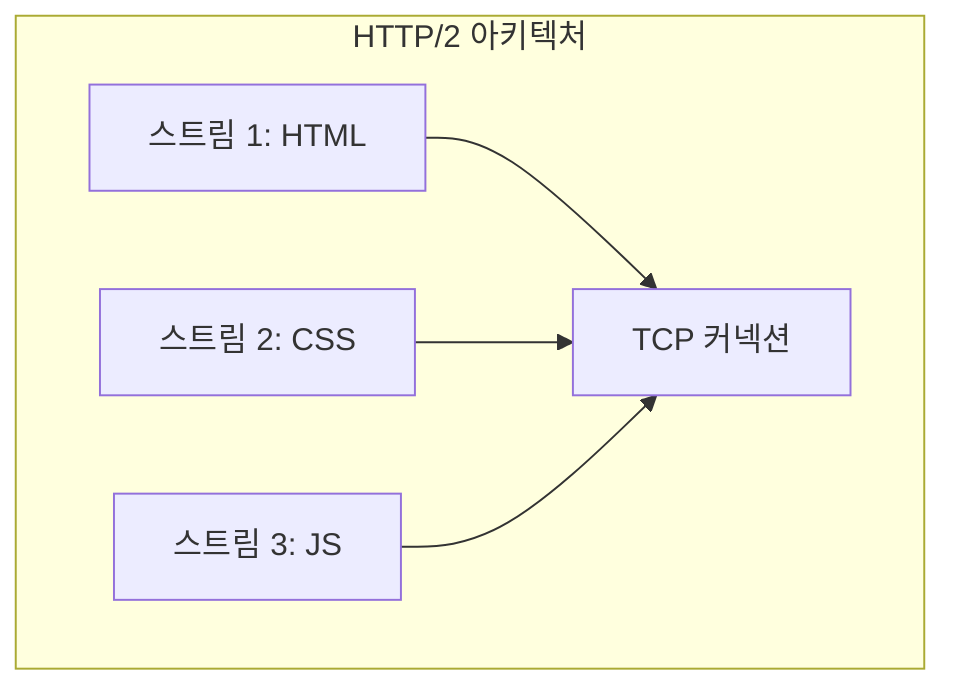
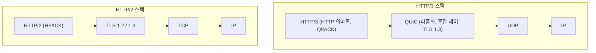
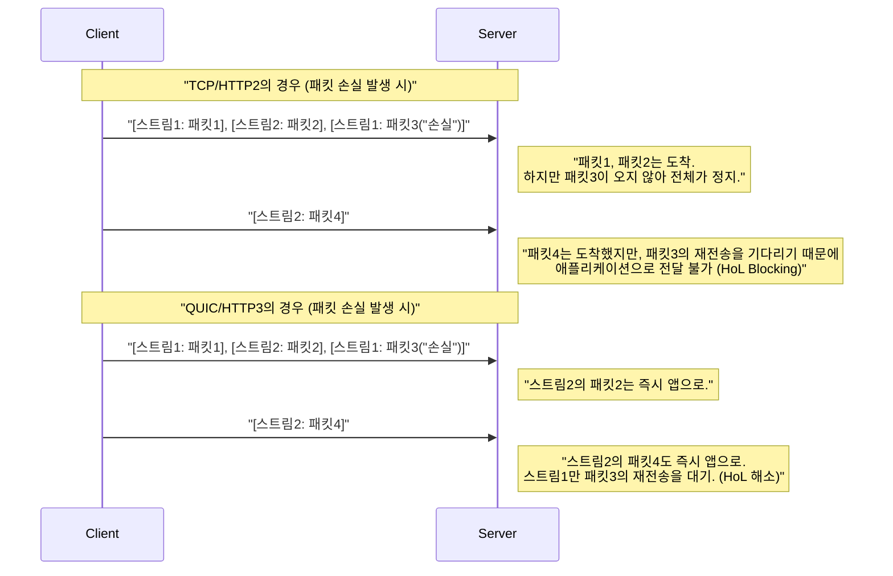
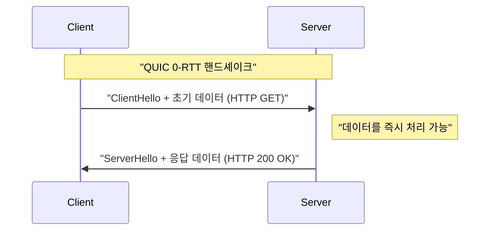

# 1. 서론: Web 통신의 진화와 차세대의 막을 열다

인터넷의 세계는 끊임없는 기술 혁신에 의해 지탱되고 있습니다. 우리가 매일 이용하는 Web 사이트나 애플리케이션의 이면에서는 **HTTP (Hypertext Transfer Protocol)** 라는 프로토콜이 가동되고 있습니다. 1990년대에 등장한 HTTP/1.0부터 시작하여, 오랫동안 사용되어 온 HTTP/1.1, 그리고 성능을 대폭 향상시킨 HTTP/2로 진화를 거듭해 왔습니다.

하지만, 현대의 Web은 풍부한 콘텐츠(고화질 이미지, 동영상 스트리밍, 복잡한 JavaScript 애플리케이션)로 넘쳐나고 있으며, 기존의 프로토콜 스택으로는 한계가 보이기 시작했습니다. 특히, 오랫동안 인터넷의 전송 계층을 지탱해 온 **TCP (Transmission Control Protocol)** 자체의 사양이 Web의 추가적인 고속화에 발목을 잡고 있었습니다.

그래서 등장한 것이 **HTTP/3** 와 그 기반이 되는 **QUIC (Quick UDP Internet Connections)** 프로토콜입니다. HTTP/3는 TCP를 버리고, 놀랍게도 **UDP (User Datagram Protocol)** 위에 새로운 신뢰성 통신 계층을 구축한다는 매우 야심 찬 접근 방식을 취하고 있습니다.

본 기사에서는 HTTP/3와 QUIC가 왜 필요했는지, TCP의 어떤 한계를 UDP로 극복했는지에 대해 아키텍처, 알고리즘, 구체적인 코드 예시, 도표를 곁들여 매우 상세하게 해설해 나가겠습니다.

---

# 2. HTTP의 역사와 TCP의 한계

HTTP/3의 혁신성을 이해하기 위해서는, 먼저 전신인 HTTP/1.1이나 HTTP/2가 안고 있던 과제, 즉 「TCP의 한계」에 대해 깊이 알아야 합니다.

## 2.1 HTTP/1.1에서 HTTP/2로의 진화와 남겨진 과제

HTTP/1.1에서는 1개의 TCP 커넥션 상에서 1개의 요청・응답을 순서대로 처리해야 했습니다. 이를 해결하기 위해 여러 개의 TCP 커넥션을 맺는 워크어라운드가 보급되었지만, TCP 커넥션 확립에는 비용이 들고, 또한 브라우저별 동시 접속 수 상한(일반적으로 6개)이라는 제약이 있었습니다.

HTTP/2는 이 문제를 **스트림** 에 의한 **다중화 (Multiplexing)** 로 해결했습니다. 1개의 TCP 커넥션 안에 가상적인 스트림을 여러 개 만들고, 요청과 응답을 미세한 프레임으로 분할하여 동시에 주고받을 수 있게 한 것입니다.



이로써 HTTP 수준에서의 「순서 대기(HTTP의 Head-of-Line Blocking)」는 해소되었습니다. 하지만 근본적인 문제는 전송 계층, 즉 TCP에 숨겨져 있었습니다.

## 2.2 TCP의 Head-of-Line (HoL) Blocking

TCP는 「순서 보장」과 「패킷 손실의 재전송」을 수행하는, 극히 신뢰성이 높은 프로토콜입니다. 송신 측이 패킷 `1, 2, 3, 4` 를 보냈을 때, 수신 측은 반드시 그 순서대로 애플리케이션 계층(HTTP/2)에 데이터를 전달합니다.

만약 네트워크 도중에 패킷 `2` 가 결손(패킷 손실)된 경우, 수신 측은 패킷 `3` 과 `4` 를 받았더라도 패킷 `2` 가 재전송되어 도착할 때까지 후속 패킷을 애플리케이션 계층에 전달할 수 없습니다. 이를 **TCP 수준의 Head-of-Line Blocking (HoL Blocking)** 이라고 부릅니다.

HTTP/2는 1개의 TCP 커넥션에 모든 스트림을 합승시키고 있기 때문에, 단 1개의 패킷 손실이 발생하는 것만으로 **모든 스트림의 통신이 일시 정지** 해버린다는 치명적인 약점을 안고 있었습니다. 패킷 손실이 빈발하는 모바일 네트워크 환경 등에서는 HTTP/2가 HTTP/1.1보다 성능이 저하되는 경우조차 있었습니다.

## 2.3 핸드셰이크의 지연 시간 (RTT의 축적)

TCP는 커넥션 지향 프로토콜이며, 통신을 시작하기 전에 **3방향 핸드셰이크** 를 수행해야 합니다. 게다가 현대의 Web에서는 필수가 된 암호화(TLS) 핸드셰이크도 추가됩니다.

TCP + TLS 1.2 환경에서는 통신 확립까지 왕복 지연 시간(RTT)의 여러 배에 달하는 시간이 소요됩니다.

*   **TCP 핸드셰이크:** $ 1 \text{ RTT} $
*   **TLS 핸드셰이크:** $ 2 \text{ RTT} $ (TLS 1.2의 경우)

총합 $ 3 \text{ RTT} $ 의 시간이 첫 번째 HTTP 요청을 송신하기 전에 소비됩니다. 빛의 속도라는 물리 법칙의 한계가 있는 이상, RTT 자체를 0으로 만드는 것은 불가능합니다(예를 들어 일본과 미국 서해안의 통신에서는 RTT가 약 100ms 걸립니다). 따라서 통신 확립에 필요한 RTT 횟수를 줄이는 것이 성능 향상을 위한 절대 조건이었습니다.

## 2.4 IP 이동성의 부재 (커넥션의 단절)

TCP는 통신을 수행하는 양 끝의 엔드포인트를 **IP 주소와 포트 번호의 4가지 조합(Source IP, Source Port, Destination IP, Destination Port)** 으로 식별합니다.

스마트폰에서 Wi-Fi로부터 4G/5G 회선으로 전환된 경우 단말기의 IP 주소가 변경됩니다. IP 주소가 바뀌면 TCP는 이를 다른 통신으로 간주하기 때문에 기존의 TCP 커넥션은 끊어지고 맙니다. 동영상 스트리밍이나 대용량 파일 다운로드 중이라면 커넥션을 0부터 다시 확립해야 하므로 사용자 경험(UX)을 크게 훼손하고 있었습니다.

---

# 3. QUIC의 탄생: UDP의 캔버스에 그리는 신세계

이러한 TCP의 한계를 타파하기 위해 Google이 개발을 시작했고, 나중에 IETF(Internet Engineering Task Force)에서 표준화된 것이 **QUIC (Quick UDP Internet Connections)** 입니다.

QUIC의 가장 큰 놀라움은 오랫동안 인터넷의 기반이었던 TCP를 버리고 **UDP (User Datagram Protocol)** 를 기반으로 채택했다는 점입니다.

## 3.1 왜 TCP를 개량하지 않고 UDP를 선택했는가?

「TCP에 문제가 있다면 TCP 자체를 버전 업하면 되지 않을까?」라고 생각할 수 있습니다. 하지만 이는 현실적으로 매우 어려웠습니다.

그 가장 큰 이유는 **미들박스(Middleboxes)의 경직화 (Ossification)** 입니다.
인터넷 상의 라우터, 방화벽, NAT(Network Address Translation), 로드 밸런서 등의 네트워크 기기(미들박스)는 TCP의 사양(헤더의 구조나 플래그의 동작 등)을 깊이 해석하고 최적화나 보안 검사를 수행하고 있습니다.

만약 TCP 헤더에 새로운 플래그를 추가하거나 새로운 버전의 TCP를 만들 경우, 전 세계의 수많은 오래된 미들박스가 「잘못된 패킷」으로 간주하여 폐기해 버립니다. 이를 **프로토콜의 경직화 (Protocol Ossification)** 라고 부릅니다.

반면, UDP는 매우 단순하여 수신지 포트와 송신지 포트, 체크섬 정도의 정보만 가지는 프로토콜입니다. 미들박스도 UDP의 내용물에 대해서는 깊이 간섭하지 않습니다.
그래서 **「UDP라는 새하얀 캔버스 위에, 사용자 공간(애플리케이션 계층에 가까운 곳)에서 TCP와 같은 신뢰성 제어나 TLS 암호화를 모두 재구현한다」** 는 접근 방식이 채택되었습니다. 이것이 QUIC입니다.

## 3.2 QUIC의 프로토콜 스택

QUIC를 도입한 HTTP/3의 프로토콜 스택은 다음과 같습니다.



QUIC는 HTTP/2가 가지고 있던 다중화(스트림) 기능, TCP가 가지고 있던 혼잡 제어나 패킷 손실 복구 기능, 그리고 TLS 1.3의 암호화 기능을 단일 계층에 통합하고 있습니다.

---

# 4. QUIC가 가져오는 혁신적인 기능과 해결책

QUIC는 앞서 언급한 TCP의 한계를 어떻게 해결했을까요? 그 핵심이 되는 혁신적 기술을 자세히 살펴보겠습니다.

## 4.1 전송 계층에서의 HoL Blocking 해소

QUIC는 TCP와 같은 「커넥션 전체의 순서 보장」을 포기하고, **「스트림별 순서 보장」** 을 도입했습니다.

QUIC 안에는 독립적인 여러 스트림이 존재하며, 각 패킷은 자신이 어느 스트림에 속해 있는지에 대한 정보를 가지고 있습니다. 만약 어떤 패킷이 손실될 경우, 대기해야 하는 것은 **그 결손된 패킷이 속한 스트림뿐** 입니다. 다른 스트림에 속한 패킷은 손실에 영향받지 않고 애플리케이션 계층(HTTP/3)으로 전달됩니다.



이로 인해 패킷 손실이 일어나기 쉬운 불안정한 네트워크 환경(모바일 회선이나 혼잡한 공용 Wi-Fi 등)에서의 성능이 비약적으로 향상되었습니다.

## 4.2 커넥션 확립의 초고속화 (1-RTT와 0-RTT)

QUIC는 전송 계층의 핸드셰이크와 암호화(TLS 1.3) 핸드셰이크를 **동시에** 수행하도록 설계되어 있습니다.

처음 통신하는 서버와는 **1-RTT** 만에 커넥션 확립과 암호화 키 교환을 완료하고 즉시 데이터 송신을 시작할 수 있습니다. TCP+TLS1.2의 $ 3 \text{ RTT} $ 와 비교하면 이것만으로도 극적인 진화입니다.

게다가 QUIC는 과거에 통신한 적이 있는 서버에 대해서는 **0-RTT (Zero Round Trip Time)** 라는 마법 같은 기능을 제공합니다.
클라이언트는 이전 통신에서 서버로부터 받은 세션 티켓이나 매개변수를 이용해, 첫 번째 핸드셰이크 패킷(ClientHello)에 다짜고짜 HTTP 요청 데이터(GET 요청 등)를 함께 실어 보냅니다.



이로 인해 이론상의 통신 시작 지연 시간은 0이 됩니다. 단, 0-RTT 데이터는 **재전송 공격(Replay Attack)** 에 취약하다는 보안상의 위험이 있습니다. 따라서 0-RTT로 송신해도 되는 것은 GET 요청과 같은 「멱등성(몇 번을 실행해도 결과가 동일함)」을 가진 안전한 요청으로 한정되어 있습니다.

## 4.3 커넥션 마이그레이션 (Connection Migration)

IP 주소가 바뀌면 단절되어 버리는 TCP의 약점을 극복하기 위해, QUIC는 커넥션을 IP 주소나 포트 번호가 아닌 **커넥션 ID (Connection ID)** 라는 고유한 식별자로 관리합니다.

커넥션 ID는 QUIC 패킷 헤더에 암호화되지 않고(라우팅이 가능하도록) 포함됩니다.

사용자가 Wi-Fi 전파 범위를 벗어나 4G/5G 회선으로 전환되어 스마트폰의 IP 주소가 변경되었다고 가정해 봅시다. QUIC 클라이언트는 새로운 IP 주소에서 패킷을 송신하지만, 그 패킷에는 기존의 「커넥션 ID」가 기재되어 있습니다.
서버는 IP 주소가 변경된 것을 감지하지만, 커넥션 ID가 일치하기 때문에 이를 「동일한 통신의 지속」으로 인식하고 재핸드셰이크 없이 통신을 속행합니다.

이 기능에 의해 모바일 환경에서의 원활한 통신 전환이 실현되어, 동영상의 버퍼링 정지나 다운로드 실패가 극적으로 감소했습니다.

---

# 5. HTTP/3: QUIC 상의 HTTP 의미론

QUIC 프로토콜 자체는 HTTP 전용이 아니며, 범용적인 전송 프로토콜입니다. 이 QUIC 위에서 HTTP의 의미론(메서드, 헤더, 상태 코드 등)을 동작시키기 위한 사양이 **HTTP/3** 입니다.

HTTP/3는 기본적으로 HTTP/2의 개념을 이어받고 있지만, 하위 계층이 TCP에서 QUIC로 바뀌면서 몇 가지 중요한 변경이 추가되었습니다.

## 5.1 QPACK에 의한 헤더 압축

HTTP/2에서는 **HPACK** 이라는 헤더 압축 알고리즘을 사용했습니다. HPACK은 통신의 양 끝에서 동적 테이블(Dynamic Table)을 유지하고, 한 번 송신한 헤더는 인덱스 번호만 보냄으로써 통신량을 줄입니다.

하지만 HPACK은 TCP의 「순서 보장」에 완전히 의존하고 있었습니다. 즉, 특정 헤더 블록이 결손되어 재전송 대기 상태가 되면, 후속 스트림의 헤더는 의존하는 동적 테이블이 업데이트될 때까지 복호화할 수 없다는 HPACK 기인의 HoL Blocking이 존재했습니다.

QUIC는 스트림 간의 순서 보장을 하지 않기 때문에, HPACK을 그대로 사용하면 스트림의 도착 순서가 뒤바뀌었을 때 동적 테이블의 동기화가 깨져 버립니다.

이를 해결하기 위해 새롭게 설계된 것이 **QPACK** 입니다. QPACK에서는 동적 테이블의 업데이트를 각 데이터 스트림에서 분리하고, 전용 제어 스트림으로 비동기적으로 테이블을 관리하는 구조를 도입했습니다. 이로 인해 QUIC의 순서가 뒤섞인 스트림 전송 하에서도 안전하고 압축률이 높은 헤더 통신이 가능해졌습니다.

## 5.2 제어 스트림과 단방향 스트림

HTTP/3에서는 요청・응답용 양방향 스트림에 더해 몇 가지 특수한 **단방향 스트림** 이 정의되어 있습니다.

1.  **제어 스트림:** 설정(SETTINGS 프레임) 등을 주고받는 스트림.
2.  **QPACK 인코더 스트림:** QPACK의 동적 테이블을 업데이트하기 위한 스트림.
3.  **QPACK 디코더 스트림:** QPACK 테이블의 업데이트 확인이나 오류를 전달하는 스트림.

이들은 역할별로 스트림을 분리함으로써 데이터의 경합이나 불필요한 대기를 방지하기 위한 최적화입니다.

---

# 6. 기술적인 심층 탐구: QUIC의 알고리즘과 수식

지금부터는 조금 기술적으로 파고들어, QUIC를 지탱하는 알고리즘이나 성능 평가에 대해 수식을 곁들여 고찰해 보겠습니다.

## 6.1 BBR (Bottleneck Bandwidth and Round-trip propagation time) 혼잡 제어

QUIC는 사용자 공간에서 구현되어 있기 때문에 혼잡 제어 알고리즘을 자유롭게, 그리고 OS의 커널 업데이트를 기다리지 않고 빠르게 업데이트할 수 있는 장점이 있습니다. 대부분의 경우 Google이 개발한 **BBR** 이 QUIC의 혼잡 제어로 채택되어 있습니다.

기존의 CUBIC TCP 등의 손실 기반 혼잡 제어는 패킷 손실이 발생할 때까지 송신 창을 계속 넓힙니다. 이로 인해 버퍼블로트(네트워크 기기의 버퍼가 꽉 차서 지연이 증가하는 현상)를 일으키기 쉽다는 문제가 있었습니다.

기존의 TCP 처리량(Mathis의 공식)은 다음과 같이 표현됩니다.

$ \text{Throughput} \le \frac{\text{MSS}}{R \times \sqrt{p}} $

*   $ \text{MSS} $ : Maximum Segment Size (최대 세그먼트 크기)
*   $ R $ : Round Trip Time (RTT)
*   $ p $ : 패킷 손실률

이 수식이 보여주듯, 손실 기반의 TCP는 패킷 손실률 $ p $ 가 조금이라도 증가하면 처리량이 극적으로 떨어지고 맙니다.

반면, BBR은 패킷 손실이 아니라 **대역폭(Bandwidth)** 과 **지연(RTT)** 을 직접 측정하여 네트워크의 한계를 추정합니다.

BBR은 네트워크 파이프의 용량을 다음 수식으로 모델링합니다.

$ \text{BDP (Bandwidth-Delay Product)} = \text{BtlBw} \times \text{RTprop} $

*   $ \text{BtlBw} $ : Bottleneck Bandwidth (병목 대역폭・과거의 최대 통신 속도)
*   $ \text{RTprop} $ : Round-Trip propagation time (전파 지연・과거의 최소 RTT)

BBR은 송신 중(In-flight)인 데이터 양이 이 BDP와 일치하도록 송신 속도를 조절합니다. 이로 인해 패킷 손실(예: 무선 간섭에 의한 손실)이 일어나도 쓸데없이 속도를 낮추지 않고, 라우터의 버퍼를 넘치게 하지 않기 때문에 높은 처리량과 낮은 지연 시간을 양립할 수 있습니다. QUIC의 사용자 공간 구현과 BBR의 조합은 최고의 성능을 발휘합니다.

## 6.2 암호화와 보안의 통합

QUIC는 기본적으로 **TLS 1.3** 을 내포하고 있으며, 암호화되지 않은 「평문」 형태의 QUIC 연결이란 존재하지 않습니다. TCP의 경우 TCP 헤더 자체는 암호화되어 있지 않기 때문에, 미들박스가 TCP의 플래그(SYN, ACK, FIN 등)를 훔쳐보거나 변조(RST 인젝션 등)하는 것이 가능했습니다.

QUIC에서는 IP 헤더와 UDP 헤더를 제외하고, QUIC 헤더의 대부분(패킷 번호 등 포함)과 페이로드가 완전히 암호화됩니다.
패킷 번호조차 암호화되기 때문에, 경로 상에서 네트워크 트래픽을 감시하더라도 어떤 패킷이 재전송된 것인지, 현재의 혼잡 창이 어느 정도인지와 같은 메타데이터를 추측하기가 매우 어려워집니다. 이는 프라이버시 보호 관점에서 매우 강력합니다.

---

# 7. QUIC의 구현과 코드 예시

QUIC가 프로그램에서 어떻게 다루어지는지 구체적인 이미지를 잡기 위해 코드 예시를 살펴보겠습니다.
Python의 `aioquic` 이라는 비동기 QUIC 구현 라이브러리를 사용한 간단한 HTTP/3 서버와 클라이언트의 예입니다.

## 7.1 Python (aioquic) 에 의한 HTTP/3 서버

```python
import asyncio
from aioquic.asyncio import serve
from aioquic.h3.connection import H3_ALPN, H3Connection
from aioquic.h3.events import DataReceived, HeadersReceived
from aioquic.quic.configuration import QuicConfiguration

class Http3ServerProtocol(asyncio.Protocol):
    def __init__(self):
        self.http = H3Connection(is_client=False)
        self.transport = None

    def connection_made(self, transport):
        self.transport = transport

    def datagram_received(self, data, addr):
        # UDP 데이터그램을 수신하고, QUIC 프로토콜 스택에 전달
        self.http.receive_datagram(data, addr, now=asyncio.get_event_loop().time())
        self.process_http_events()

    def process_http_events(self):
        for event in self.http.next_event():
            if isinstance(event, HeadersReceived):
                print(f"Received headers: {event.headers}")
                # 간단한 200 OK 응답을 구성
                headers = [
                    (b":status", b"200"),
                    (b"server", b"aioquic"),
                    (b"content-type", b"text/html"),
                ]
                self.http.send_headers(event.stream_id, headers)
                self.http.send_data(event.stream_id, b"<h1>Hello HTTP/3 via QUIC!</h1>", end_stream=True)
                
        # 응답을 UDP로 송신
        for data, addr in self.http.datagrams_to_send(now=asyncio.get_event_loop().time()):
            self.transport.sendto(data, addr)

async def main():
    configuration = QuicConfiguration(is_client=False, alpn_protocols=H3_ALPN)
    # 인증서 로드가 필요
    configuration.load_cert_chain("cert.pem", "key.pem")
    
    # UDP 포트 443에서 리슨
    await serve("0.0.0.0", 443, configuration=configuration, create_protocol=Http3ServerProtocol)
    print("HTTP/3 Server listening on UDP 443...")
    await asyncio.Future()  # run forever

if __name__ == "__main__":
    asyncio.run(main())
```

이 코드에서 알 수 있듯이, 하부 구조는 완전히 **UDP 통신 (datagram_received / sendto)** 이면서, 그 위에서 고도의 HTTP/3 스트림 제어나 헤더 처리가 이루어지고 있습니다.

## 7.2 Nginx 에서의 HTTP/3 활성화

Web 서버로 널리 쓰이는 Nginx도 버전 1.25.0 이후로 기본적으로 HTTP/3 및 QUIC를 지원하고 있습니다.
설정은 매우 간단하며, 기존의 TLS 설정에 몇 줄을 추가하기만 하면 됩니다.

```nginx
server {
    # 기존의 TCP (HTTP/1.1, HTTP/2) 용
    listen 443 ssl;
    listen [::]:443 ssl;
    
    # 새로운 UDP (HTTP/3, QUIC) 용
    listen 443 quic reuseport;
    listen [::]:443 quic reuseport;

    server_name example.com;

    ssl_certificate     /path/to/cert.pem;
    ssl_certificate_key /path/to/key.pem;
    # QUIC에는 TLS 1.3이 필수
    ssl_protocols       TLSv1.2 TLSv1.3;

    location / {
        root /var/www/html;
        # 클라이언트에게 HTTP/3를 이용할 수 있음을 알림 (Alt-Svc 헤더)
        add_header Alt-Svc 'h3=":443"; ma=86400';
    }
}
```

여기서 중요한 것은 `Alt-Svc` 헤더입니다. 브라우저는 처음에 역사적인 이유로 TCP(HTTP/2 등)로 연결을 시도합니다. 응답에 `Alt-Svc: h3=":443"` 이 포함되어 있으면, 「이 서버는 UDP 포트 443에서 HTTP/3와도 대화할 수 있구나!」라고 인식하고, 다음 접근이나 백그라운드에서 QUIC에 의한 연결로 업그레이드를 시도합니다.

---

# 8. 이행과 운용의 과제 (Challenges of Deployment)

QUIC와 HTTP/3는 꿈같은 기술이지만, 실제 운용에 적용하는 데에는 몇 가지 거대한 벽이 존재합니다.

## 8.1 기업 방화벽에 의한 UDP 차단

인터넷 초창기부터 UDP는 「DDoS 공격」이나 「수상한 [P2P](https://kenji.blog/ko/p/webrtc-realtime-communication-p2p/) 통신」에 쓰이는 경우가 많다는 이유로 기업의 방화벽이나 네트워크 관리자에 의해 **포트 53(DNS)이나 123(NTP)을 제외하고 일괄 차단 (DROP)** 되는 사례가 적지 않습니다.

QUIC는 UDP 포트 443을 사용하지만, UDP라는 이유만으로 차단되어 버리는 환경에서는 HTTP/3 통신을 확립할 수 없습니다.
이 경우, 브라우저는 몇 밀리초~수 초를 기다려 QUIC 통신 시간 초과를 감지하면 자동으로 TCP(HTTP/2)로 폴백하는 메커니즘을 가지고 있습니다. 하지만 이 폴백 대기 시간 자체가 사용자 경험을 악화시키는 지연이 됩니다.

## 8.2 높은 CPU 부하와 하드웨어 오프로드의 부재

TCP는 수십 년의 역사가 있으며, 현대의 네트워크 카드(NIC)는 **TCP Segmentation Offload (TSO)** 등 TCP의 패킷 분할이나 체크섬 계산을 하드웨어(NIC 칩)에서 대신 처리하는 기능을 가지고 있습니다. 이로 인해 OS의 CPU 부하를 극적으로 낮춥니다.

하지만 QUIC는 사용자 공간에서 동작하고, 게다가 모든 패킷이 개별적으로 강력한 암호화(AES-GCM이나 ChaCha20)를 거치기 때문에, 대량의 통신을 처리하는 서버 측에서의 **CPU 사용률이 TCP+TLS에 비해 매우 높게** 나타납니다.
현재 각 하드웨어 벤더나 클라우드 제공업체는 UDP Segmentation Offload (USO) 등의 기능 개발을 서두르고 있지만, 하드웨어 수준에서의 완전한 지원이 보급될 때까지는 인프라 비용 증가라는 과제가 따라다닙니다.

## 8.3 로드 밸런싱의 복잡화

TCP 트래픽의 부하 분산(로드 밸런싱)은 단순한 4튜플(송신지 IP・포트, 수신지 IP・포트)의 해시값을 사용하여 백엔드 서버에 분배하는 것이 일반적이었습니다.

하지만 QUIC는 앞서 언급한 **「커넥션 마이그레이션」** 기능에 의해 도중에 클라이언트의 IP 주소나 포트 번호가 변화합니다. 따라서 단순한 IP 기반 라우팅에서는 통신 도중에 패킷이 다른 백엔드 서버로 분배되어 버려 커넥션이 파기되고 맙니다.

QUIC를 올바르게 로드 밸런싱하기 위해서는 패킷 헤더에 포함된 「커넥션 ID」를 읽어내고, 이를 바탕으로 항상 같은 백엔드 서버로 라우팅하는 고도화된 레이어 4/레이어 7 로드 밸런서가 필요하게 됩니다.

---

# 9. QUIC의 미래: WebTransport와 넓어지는 응용 영역

QUIC의 진정한 가치는 HTTP/3의 실현에만 머무르지 않습니다. 「고성능이고 안전한 UDP 기반 범용 전송 프로토콜」인 QUIC는 HTTP 이외의 다양한 프로토콜의 기반으로도 채택되기 시작했습니다.

## 9.1 WebTransport: WebSocket의 차세대 규격

현재 Web 브라우저와 서버 간의 양방향 실시간 통신에는 **WebSocket** 이 널리 쓰이고 있습니다. 하지만 WebSocket은 TCP 위에서 동작하기 때문에 역시 HoL Blocking 문제에서 벗어날 수 없습니다. 예를 들어, 게임의 실시간 위치 동기화 같은 데이터는 「조금이라도 늦은 옛날 데이터는 폐기하고, 항상 최신 데이터만 원한다」는 특성이 있지만, TCP는 우직하게 오래된 지연 패킷을 재전송하여 게임의 랙을 유발합니다.

이를 해결하는 것이 QUIC를 기반으로 하는 새로운 API **WebTransport** 입니다.
WebTransport에서는 신뢰성을 보장하는 스트림 통신뿐만 아니라, 패킷 손실을 허용하더라도 가장 빠르게 데이터를 보내는 **데이터그램 통신** 을 브라우저의 JavaScript에서 직접 다룰 수 있게 됩니다.
이로 인해 브라우저 기반의 클라우드 게이밍이나 초저지연 라이브 동영상 전송([WebRTC](https://kenji.blog/ko/p/webrtc-realtime-communication-p2p/)의 대체)이 크게 진화할 것으로 기대되고 있습니다.

## 9.2 다양한 프로토콜의 "over QUIC" 화

QUIC의 뛰어난 특성을 살려, 기존 프로토콜을 QUIC 위로 옮기는 표준화가 진행되고 있습니다.

*   **DoQ (DNS over QUIC):** 프라이버시와 속도를 양립한 차세대 DNS 프로토콜. TCP 상의 DoT보다 빠르고, UDP 상의 평문 DNS보다 안전.
*   **SMB over QUIC:** Windows의 파일 공유 프로토콜(SMB)을 QUIC화하여, VPN 없이도 인터넷을 통해 안전하고 빠르게 파일 서버에 접근 가능하게 하는 기술(Windows Server 2022에 구현 완료).
*   **SSH over QUIC:** 모바일 회선으로 이동 중에도 연결이 끊기지 않는 궁극의 SSH 터미널 접속.

이와 같이, QUIC는 「인터넷 통신의 새로운 레이어 4 표준」으로서의 지위를 확립해 나가고 있습니다.

---

# 10. 결론: TCP의 시대에서 QUIC의 시대로

본 기사에서는 HTTP/3와 QUIC 프로토콜에 대해 TCP의 한계부터 UDP로의 패러다임 전환, HoL Blocking의 해결, 커넥션 확립의 고속화, 그리고 구현 및 운용의 과제에 이르기까지 깊이 파고들어 해설했습니다.

*   **TCP의 한계:** 순서 보장에 의한 HoL Blocking, 핸드셰이크의 지연, IP 주소 변경에 대한 취약성.
*   **QUIC의 혁신:** UDP를 기반으로 스트림 다중화, TLS 1.3의 통합, 커넥션 ID에 의한 마이그레이션을 사용자 공간에서 실현.
*   **HTTP/3:** QUIC의 특성에 최적화된 QPACK 등의 새로운 HTTP 사양.

TCP는 과거 40년 가까이 인터넷의 폭발적인 성장을 지탱해 온 위대한 프로토콜입니다. 하지만 밀리초 단위의 성능이 비즈니스에 직결되고 누구나 모바일 환경에서 풍부한 Web 앱을 이용하는 현대에 있어, 그 아키텍처의 한계는 명백했습니다.

UDP라는 새하얀 캔버스에 그려진 QUIC는 Web 통신의 병목 현상을 근본부터 파괴했습니다. 방화벽 설정이나 하드웨어 최적화 등 아직 넘어야 할 벽은 있지만, 이미 Google이나 Facebook(Meta), Cloudflare 등의 거대 트래픽 대부분은 HTTP/3로 이행하고 있습니다.

우리가 매일 개발하는 Web 애플리케이션은 의식하지 않아도 이 QUIC의 혜택을 받아 더 빠르고 더 견고해질 것입니다. 차세대 Web을 형성하는 이 혁신적인 프로토콜의 동향에서 앞으로도 눈을 뗄 수 없습니다.

---

*참고 자료:*
*   RFC 9000: QUIC: A UDP-Based Multiplexed and Secure Transport
*   RFC 9114: HTTP/3
*   RFC 9204: QPACK: Field Compression for HTTP/3
*   IETF QUIC Working Group 관련 문서
