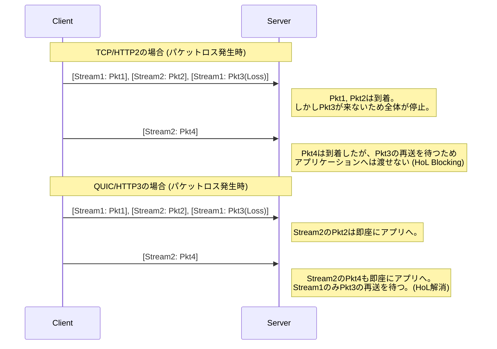
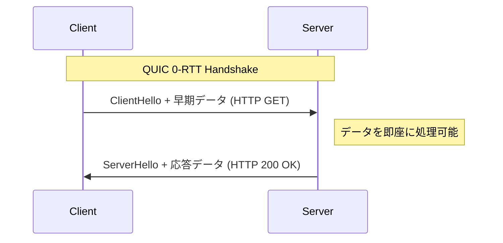

# 1. はじめに：Web通信の進化と次世代の幕開け

インターネットの世界は、絶え間ない技術革新によって支えられています。私たちが日々利用しているWebサイトやアプリケーションの裏側では、**HTTP (Hypertext Transfer Protocol)** というプロトコルが稼働しています。1990年代に登場したHTTP/1.0から始まり、長らく使われてきたHTTP/1.1、そしてパフォーマンスを大幅に向上させたHTTP/2と、進化を続けてきました。

しかし、現代のWebはリッチなコンテンツ（高画質画像、動画ストリーミング、複雑なJavaScriptアプリケーション）で溢れており、従来のプロトコルスタックでは限界が見え始めていました。特に、長年インターネットのトランスポート層を支えてきた **TCP (Transmission Control Protocol)** そのものの仕様が、Webのさらなる高速化の足かせとなっていたのです。

そこで登場したのが、**HTTP/3** とその基盤となる **QUIC (Quick UDP Internet Connections)** プロトコルです。HTTP/3は、TCPを捨て去り、なんと **UDP (User Datagram Protocol)** の上に新たな信頼性通信のレイヤーを構築するという、非常に野心的なアプローチをとっています。

本記事では、HTTP/3とQUICがなぜ必要だったのか、TCPのどのような限界をUDPで乗り越えたのかについて、アーキテクチャ、アルゴリズム、具体的なコード例、図表を交えて、極めて詳細に解説していきます。

---

# 2. HTTPの歴史とTCPの限界

HTTP/3の革新性を理解するためには、まず前身となるHTTP/1.1やHTTP/2が抱えていた課題、すなわち「TCPの限界」について深く知る必要があります。

## 2.1 HTTP/1.1からHTTP/2への進化と残された課題

HTTP/1.1では、1つのTCPコネクション上で1つのリクエスト・レスポンスを順番に処理する必要がありました。これを解決するために、複数のTCPコネクションを張るワークアラウンドが普及しましたが、TCPコネクションの確立にはコストがかかり、またブラウザごとの同時接続数上限（通常6個）という制約がありました。

HTTP/2は、この問題を **ストリーム** による **多重化 (Multiplexing)** で解決しました。1つのTCPコネクションの中に仮想的なストリームを複数作り、リクエストとレスポンスを細かなフレームに分割して同時にやり取りできるようにしたのです。


これにより、HTTPレベルでの「順番待ち（HTTPのHead-of-Line Blocking）」は解消されました。しかし、根本的な問題はトランスポート層、つまりTCPに隠されていました。

## 2.2 TCPの Head-of-Line (HoL) Blocking

TCPは「順序保証」と「パケットロスの再送」を行う、極めて信頼性の高いプロトコルです。送信側がパケット `1, 2, 3, 4` を送ったとき、受信側は必ずその順番でアプリケーション層（HTTP/2）にデータを渡します。

もしネットワークの途中でパケット `2` が欠損（パケットロス）した場合、受信側はパケット `3` と `4` を受け取っていても、パケット `2` が再送されて届くまで、後続のパケットをアプリケーション層に渡すことができません。これを **TCPレベルのHead-of-Line Blocking (HoL Blocking)** と呼びます。

HTTP/2は1つのTCPコネクションに全ストリームを相乗りさせているため、たった1つのパケットロスが発生するだけで、**すべてのストリームの通信が一時停止** してしまうという致命的な弱点を抱えていました。パケットロスが頻発するモバイルネットワーク環境などでは、HTTP/2はHTTP/1.1よりもパフォーマンスが低下するケースすらあったのです。

## 2.3 ハンドシェイクのレイテンシ (RTTの蓄積)

TCPはコネクション指向のプロトコルであり、通信を開始する前に **3ウェイ・ハンドシェイク** を行う必要があります。さらに、現代のWebでは必須となっている[暗号化](https://kenji.blog/p/modern-cryptography-public-key-hash-signature/)（TLS）のハンドシェイクも加わります。

TCP + TLS 1.2の環境では、通信の確立までにラウンドトリップタイム（RTT）の複数倍の時間がかかります。

*   **TCPハンドシェイク:** $ 1 \text{ RTT} $
*   **TLSハンドシェイク:** $ 2 \text{ RTT} $ (TLS 1.2の場合)

合計で $ 3 \text{ RTT} $ の時間が、最初のHTTPリクエストを送信する前に消費されます。光の速度という物理法則の限界がある以上、RTTそのものをゼロにすることは不可能です（例えば日本とアメリカ西海岸の通信ではRTTは約100msかかります）。したがって、通信確立に必要なRTTの回数を減らすことが、パフォーマンス向上への絶対条件でした。

## 2.4 IPモビリティの欠如（コネクションの切断）

TCPは、通信を行う両端のエンドポイントを **IPアドレスとポート番号の4つの組み合わせ（Source IP, Source Port, Destination IP, Destination Port）** で識別します。

スマートフォンでWi-Fiから4G/5G回線に切り替わった場合、端末のIPアドレスが変化します。IPアドレスが変わると、TCPはそれを別の通信と見なすため、既存のTCPコネクションは切断されてしまいます。動画のストリーミングや大容量ファイルのダウンロード中であれば、コネクションをゼロから確立し直す必要があり、ユーザー体験（UX）を大きく損なっていました。

---

# 3. QUICの誕生：UDPのキャンバスに描く新世界

これらのTCPの限界を打ち破るためにGoogleが開発を始め、後にIETF（Internet Engineering Task Force）で標準化されたのが **QUIC (Quick UDP Internet Connections)** です。

QUICの最大の驚きは、長年インターネットの基盤であったTCPを捨て、**UDP (User Datagram Protocol)** をベースに採用したことです。

## 3.1 なぜTCPを改良せず、UDPを選んだのか？

「TCPに問題があるなら、TCP自体をバージョンアップすればいいのではないか？」と思うかもしれません。しかし、それは現実的に極めて困難でした。

その最大の理由は **ミドルボックス（Middleboxes）の硬直化 (Ossification)** です。
インターネット上のルーター、ファイアウォール、NAT（Network Address Translation）、ロードバランサーなどのネットワーク機器（ミドルボックス）は、TCPの仕様（ヘッダーの構造やフラグの挙動など）を深く解釈し、最適化やセキュリティチェックを行っています。

もしTCPのヘッダーに新しいフラグを追加したり、新しいバージョンのTCPを作ったりした場合、世界中の無数の古いミドルボックスが「不正なパケット」として破棄してしまいます。これを **プロトコルの硬直化 (Protocol Ossification)** と呼びます。

一方、UDPは非常にシンプルで、宛先ポートと送信元ポート、チェックサム程度の情報しか持たないプロトコルです。ミドルボックスもUDPの中身については深く干渉しません。
そこで、**「UDPという真っ白なキャンバスの上に、ユーザー空間（アプリケーション層に近い場所）でTCPのような信頼性制御やTLSの暗号化をすべて再実装する」** というアプローチが採用されました。これがQUICです。

## 3.2 QUICのプロトコルスタック

QUICを導入したHTTP/3のプロトコルスタックは以下のようになります。

```mermaid
flowchart TD
    subgraph HTTP/3 Stack
        H3[HTTP/3 (HTTP Semantics, QPACK)]
        QUIC[QUIC (Multiplexing, Congestion Control, TLS 1.3)]
        UDP[UDP]
        IP[IP]
    end
    
    subgraph HTTP/2 Stack
        H2[HTTP/2 (HPACK)]
        TLS[TLS 1.2 / 1.3]
        TCP[TCP]
        IP2[IP]
    end
    
    H3 --> QUIC
    QUIC --> UDP
    UDP --> IP
    
    H2 --> TLS
    TLS --> TCP
    TCP --> IP2
```

QUICは、HTTP/2が持っていた多重化（ストリーム）の機能、TCPが持っていた輻輳制御やパケットロス回復の機能、そしてTLS 1.3の[暗号化](https://kenji.blog/p/modern-cryptography-public-key-hash-signature/)機能を、単一の層に統合しています。

---

# 4. QUICがもたらす革新的な機能と解決策

QUICは、先述したTCPの限界をどのように解決したのでしょうか。そのコアとなる革新的技術を詳細に見ていきます。

## 4.1 トランスポート層での HoL Blocking の解消

QUICは、TCPのような「コネクション全体の順序保証」を放棄し、**「ストリームごとの順序保証」** を導入しました。

QUICの中には複数の独立したストリームが存在し、各パケットは自分がどのストリームに属しているかという情報を持っています。もしあるパケットがロスした場合、待機させられるのは **その欠損したパケットが属するストリームだけ** です。他のストリームに属するパケットは、ロスに影響されることなくアプリケーション層（HTTP/3）に届けられます。



これにより、パケットロスが起きやすい不安定なネットワーク環境（モバイル回線や混雑した公共Wi-Fiなど）におけるパフォーマンスが飛躍的に向上しました。

## 4.2 コネクション確立の超高速化 (1-RTT と 0-RTT)

QUICは、トランスポート層のハンドシェイクと、[暗号化](https://kenji.blog/p/modern-cryptography-public-key-hash-signature/)（TLS 1.3）のハンドシェイクを **同時に** 行うように設計されています。

初めて通信するサーバーとの間では、**1-RTT** でコネクションの確立と暗号化キーの交換を完了し、直ちにデータの送信を開始できます。TCP+TLS1.2の $ 3 \text{ RTT} $ と比べると、これだけでも劇的な進化です。

さらにQUICは、過去に通信したことがあるサーバーに対しては **0-RTT (Zero Round Trip Time)** という魔法のような機能を提供します。
クライアントは以前の通信でサーバーから受け取ったセッションチケットやパラメータを利用し、最初のハンドシェイクパケット（ClientHello）にいきなりHTTPリクエストデータ（GETリクエストなど）を相乗りさせて送信します。



これにより、理論上の通信開始遅延はゼロになります。ただし、0-RTTデータは **リプレイ攻撃（Replay Attack）** に対して脆弱であるというセキュリティ上のリスクがあります。そのため、0-RTTで送信してよいのはGETリクエストのような「べき等性（何度実行しても結果が同じ）」を持つ安全なリクエストに限定されています。

## 4.3 コネクションマイグレーション (Connection Migration)

IPアドレスが変わると切断されてしまうTCPの弱点を克服するため、QUICはコネクションをIPアドレスやポート番号ではなく、**コネクションID (Connection ID)** という一意の識別子で管理します。

コネクションIDはQUICパケットのヘッダーに[暗号化](https://kenji.blog/p/modern-cryptography-public-key-hash-signature/)されずに（ルーティング可能なように）含まれます。

ユーザーがWi-Fiの電波範囲から外れて4G/5G回線に切り替わり、スマートフォンのIPアドレスが変化したとします。QUICクライアントは新しいIPアドレスからパケットを送信しますが、そのパケットには既存の「コネクションID」が記載されています。
サーバーはIPアドレスが変更されたことを検知しますが、コネクションIDが一致するため、これを「同じ通信の継続」と認識し、再ハンドシェイクなしで通信を続行します。

この機能により、モバイル環境でのシームレスな通信切り替えが実現され、動画のバッファリング停止やダウンロードの失敗が劇的に減少しました。

---

# 5. HTTP/3：QUIC上のHTTPセマンティクス

QUICプロトコル自体はHTTP専用ではなく、汎用的なトランスポートプロトコルです。このQUICの上でHTTPのセマンティクス（メソッド、ヘッダー、ステータスコードなど）を動作させるための仕様が **HTTP/3** です。

HTTP/3は、基本的にはHTTP/2の概念を引き継いでいますが、下位レイヤーがTCPからQUICに変わったことで、いくつかの重要な変更が加えられました。

## 5.1 QPACKによるヘッダー圧縮

HTTP/2では、**HPACK** というヘッダー圧縮アルゴリズムを使用していました。HPACKは、通信の両端で動的テーブル（Dynamic Table）を保持し、一度送信したヘッダーはインデックス番号だけで送ることで通信量を削減します。

しかし、HPACKはTCPの「順序保証」に完全に依存していました。つまり、あるヘッダーブロックが欠損して再送待ちになった場合、後続のストリームのヘッダーは、依存する動的テーブルが更新されるまで復号できないという、HPACK起因のHoL Blockingが存在していました。

QUICはストリーム間の順序保証を行わないため、HPACKをそのまま使うと、ストリームの到着順序が入れ替わった際に動的テーブルの同期が壊れてしまいます。

これを解決するために新たに設計されたのが **QPACK** です。QPACKでは、動的テーブルの更新を各データストリームから分離し、専用のコントロールストリームで非同期にテーブルを管理する仕組みを取り入れました。これにより、QUICの順序不同なストリーム配送下でも、安全かつ高圧縮なヘッダー通信が可能になりました。

## 5.2 制御ストリームと単方向ストリーム

HTTP/3では、リクエスト・レスポンス用の双方向ストリームに加えて、いくつかの特殊な **単方向ストリーム** が定義されています。

1.  **コントロールストリーム:** 設定（SETTINGSフレーム）などをやり取りするストリーム。
2.  **QPACKエンコーダーストリーム:** QPACKの動的テーブルを更新するためのストリーム。
3.  **QPACKデコーダーストリーム:** QPACKテーブルの更新確認やエラーを伝えるストリーム。

これらは役割ごとにストリームを分けることで、データの競合や不要な待機を防ぐための最適化です。

---

# 6. 技術的な深掘り：QUICのアルゴリズムと数式

ここからは、少し技術的に踏み込み、QUICを支えるアルゴリズムや性能評価について数式を交えて考察します。

## 6.1 BBR (Bottleneck Bandwidth and Round-trip propagation time) 輻輳制御

QUICはユーザー空間で実装されているため、輻輳制御アルゴリズムを自由に、かつOSのカーネルアップデートを待たずに素早く更新できる利点があります。多くの場合、Googleが開発した **BBR** がQUICの輻輳制御として採用されています。

従来のCUBIC TCPなどのロスベース輻輳制御は、パケットロスが発生するまで送信ウィンドウを広げ続けます。このため、バッファブロート（ネットワーク機器のバッファが埋まって遅延が増大する現象）を引き起こしやすいという問題がありました。

従来のTCPスループット（Mathisの式）は以下のように表されます。

$$ \text{Throughput} \le \frac{\text{MSS}}{R \times \sqrt{p}} $$

*   $ \text{MSS} $ : Maximum Segment Size (最大セグメントサイズ)
*   $ R $ : Round Trip Time (RTT)
*   $ p $ : パケットロス率

この式が示す通り、ロスベースのTCPは、パケットロス率 $ p $ が少しでも増加すると、スループットが劇的に低下してしまいます。

これに対し、BBRはパケットロスではなく、**帯域幅（Bandwidth）** と **遅延（RTT）** を直接測定してネットワークの限界を推定します。

BBRは、ネットワークパイプの容量を以下の式でモデル化します。

$$ \text{BDP (Bandwidth-Delay Product)} = \text{BtlBw} \times \text{RTprop} $$

*   $ \text{BtlBw} $ : Bottleneck Bandwidth (ボトルネック帯域幅・過去の最大通信速度)
*   $ \text{RTprop} $ : Round-Trip propagation time (伝播遅延・過去の最小RTT)

BBRは、送信中（In-flight）のデータ量がこのBDPに一致するように送信速度を調整します。これにより、パケットロス（例：無線の干渉によるロス）が起きても無駄に速度を落とさず、かつルーターのバッファを溢れさせないため、高スループットと低レイテンシを両立できます。QUICのユーザー空間実装とBBRの組み合わせは、最高のパフォーマンスを発揮します。

## 6.2 暗号化とセキュリティの統合

QUICはデフォルトで **TLS 1.3** を内包しており、暗号化されていない「平文」のQUIC接続というものは存在しません。TCPの場合、TCPヘッダー自体は暗号化されていないため、ミドルボックスがTCPのフラグ（SYN, ACK, FINなど）を覗き見たり、改ざん（RSTインジェクションなど）したりすることが可能でした。

QUICでは、IPヘッダーとUDPヘッダーを除き、QUICヘッダーの大部分（パケット番号など含む）とペイロードが完全に暗号化されます。
パケット番号すら暗号化されるため、経路上でネットワークトラフィックを監視しても、どのパケットが再送されたものなのか、現在の輻輳ウィンドウがどれくらいかといったメタデータを推測することが極めて困難になります。これはプライバシー保護の観点で非常に強力です。

---

# 7. QUICの実装とコード例

QUICがプログラムからどのように扱われるのか、具体的なイメージを掴むためにコード例を見てみましょう。
Pythonの `aioquic` という非同期QUIC実装ライブラリを使用した簡単なHTTP/3サーバーとクライアントの例です。

## 7.1 Python (aioquic) による HTTP/3 サーバー

```python
import asyncio
from aioquic.asyncio import serve
from aioquic.h3.connection import H3_ALPN, H3Connection
from aioquic.h3.events import DataReceived, HeadersReceived
from aioquic.quic.configuration import QuicConfiguration

class Http3ServerProtocol(asyncio.Protocol):
    def __init__(self):
        self.http = H3Connection(is_client=False)
        self.transport = None

    def connection_made(self, transport):
        self.transport = transport

    def datagram_received(self, data, addr):
        # UDPデータグラムを受信し、QUICプロトコルスタックに渡す
        self.http.receive_datagram(data, addr, now=asyncio.get_event_loop().time())
        self.process_http_events()

    def process_http_events(self):
        for event in self.http.next_event():
            if isinstance(event, HeadersReceived):
                print(f"Received headers: {event.headers}")
                # シンプルな 200 OK レスポンスを構築
                headers = [
                    (b":status", b"200"),
                    (b"server", b"aioquic"),
                    (b"content-type", b"text/html"),
                ]
                self.http.send_headers(event.stream_id, headers)
                self.http.send_data(event.stream_id, b"<h1>Hello HTTP/3 via QUIC!</h1>", end_stream=True)
                
        # 応答をUDPで送信
        for data, addr in self.http.datagrams_to_send(now=asyncio.get_event_loop().time()):
            self.transport.sendto(data, addr)

async def main():
    configuration = QuicConfiguration(is_client=False, alpn_protocols=H3_ALPN)
    # 証明書のロードが必要
    configuration.load_cert_chain("cert.pem", "key.pem")
    
    # UDPのポート443でリッスン
    await serve("0.0.0.0", 443, configuration=configuration, create_protocol=Http3ServerProtocol)
    print("HTTP/3 Server listening on UDP 443...")
    await asyncio.Future()  # run forever

if __name__ == "__main__":
    asyncio.run(main())
```

このコードからわかるように、下回りは完全に **UDP通信 (datagram_received / sendto)** でありながら、その上で高度なHTTP/3のストリーム制御やヘッダー処理が行われています。

## 7.2 Nginx における HTTP/3 の有効化

Webサーバーとして広く使われているNginxも、バージョン1.25.0以降でデフォルトでHTTP/3およびQUICをサポートしています。
設定は非常にシンプルで、既存のTLS設定に数行追加するだけです。

```nginx
server {
    # 従来の TCP (HTTP/1.1, HTTP/2) 用
    listen 443 ssl;
    listen [::]:443 ssl;
    
    # 新しい UDP (HTTP/3, QUIC) 用
    listen 443 quic reuseport;
    listen [::]:443 quic reuseport;

    server_name example.com;

    ssl_certificate     /path/to/cert.pem;
    ssl_certificate_key /path/to/key.pem;
    # QUICにはTLS 1.3が必須
    ssl_protocols       TLSv1.2 TLSv1.3;

    location / {
        root /var/www/html;
        # クライアントにHTTP/3が利用可能であることを伝える (Alt-Svcヘッダー)
        add_header Alt-Svc 'h3=":443"; ma=86400';
    }
}
```

ここで重要なのは `Alt-Svc` ヘッダーです。ブラウザは最初、歴史的な理由からTCP（HTTP/2など）で接続を試みます。レスポンスに `Alt-Svc: h3=":443"` が含まれていると、「このサーバーはUDPポート443でHTTP/3も話せるのか！」と認識し、次回以降のアクセスやバックグラウンドでQUICによる接続にアップグレードを試みます。

---

# 8. 移行と運用の課題 (Challenges of Deployment)

QUICとHTTP/3は夢のような技術ですが、実運用に落とし込む上ではいくつかの巨大な壁が存在します。

## 8.1 企業ファイアウォールによる UDP のブロック

インターネットの黎明期から、UDPは「DDoS攻撃」や「怪しい[P2P](https://kenji.blog/p/webrtc-realtime-communication-p2p/)通信」に使われることが多いという理由で、企業のファイアウォールやネットワーク管理者によって **ポート53(DNS)や123(NTP)を除いて一律遮断 (DROP)** されているケースが少なくありません。

QUICはUDPポート443を使用しますが、UDPであるという理由だけでブロックされてしまう環境では、HTTP/3通信は確立できません。
この場合、ブラウザは数ミリ秒〜数秒待ってQUICの通信タイムアウトを検知すると、自動的にTCP（HTTP/2）へフォールバックする仕組みを持っています。しかし、このフォールバックの待ち時間自体がユーザー体験を悪化させる遅延となります。

## 8.2 高い CPU 負荷とハードウェア・オフロードの欠如

TCPは数十年の歴史があり、現代のネットワークカード（NIC）は **TCP Segmentation Offload (TSO)** など、TCPのパケット分割やチェックサム計算をハードウェア（NICのチップ）で肩代わりする機能を持っています。これにより、OSのCPU負荷を劇的に下げています。

しかし、QUICはユーザー空間で動作し、しかも全てのパケットが個別に強力な[暗号化](https://kenji.blog/p/modern-cryptography-public-key-hash-signature/)（AES-GCMやChaCha20）を施されるため、大量の通信をさばくサーバー側での **CPU使用率がTCP+TLSに比べて非常に高く** なります。
現在、各ハードウェアベンダーやクラウドプロバイダーは UDP Segmentation Offload (USO) などの機能開発を急いでいますが、ハードウェアレベルでの完全なサポートが普及するまでは、インフラコストの増加という課題がつきまといます。

## 8.3 ロードバランシングの複雑化

TCPトラフィックの負荷分散（ロードバランシング）は、単純な4タプル（送信元IP・ポート、宛先IP・ポート）のハッシュ値を用いてバックエンドサーバーに振り分けるのが一般的でした。

しかし、QUICは前述の **「コネクションマイグレーション」** 機能により、途中でクライアントのIPアドレスやポート番号が変化します。そのため、単純なIPベースのルーティングでは、通信の途中でパケットが別のバックエンドサーバーに振り分けられてしまい、コネクションが破棄されてしまいます。

QUICを正しくロードバランシングするためには、パケットヘッダーに含まれる「コネクションID」を読み取り、それを元に常に同じバックエンドサーバーへルーティングする高度なレイヤー4/レイヤー7ロードバランサーが必要になります。

---

# 9. QUICの未来：WebTransport と広がる応用領域

QUICの真の価値は、HTTP/3の実現だけに留まりません。「高性能でセキュアなUDPベースの汎用トランスポートプロトコル」であるQUICは、HTTP以外の様々なプロトコルの基盤としても採用され始めています。

## 9.1 WebTransport：WebSocketの次世代規格

現在、Webブラウザとサーバー間の双方向リアルタイム通信には **WebSocket** が広く使われています。しかし、WebSocketはTCP上で動作するため、やはりHoL Blockingの問題から逃れられません。例えば、ゲームのリアルタイム位置同期のようなデータは「少しでも遅れた古いデータは破棄して、常に最新データだけ欲しい」性質がありますが、TCPは律儀に古い遅延パケットを再送し、ゲームのラグを引き起こします。

これを解決するのが、QUICを基盤とする新しいAPI **WebTransport** です。
WebTransportでは、信頼性を保証するストリーム通信だけでなく、パケットロスを許容してでも最速でデータを送る **データグラム通信** をブラウザのJavaScriptから直接扱えるようになります。
これにより、ブラウザベースのクラウドゲーミングや、超低遅延のライブ動画配信（[WebRTC](https://kenji.blog/p/webrtc-realtime-communication-p2p/)の代替）が大きく進化すると期待されています。

## 9.2 様々なプロトコルの "over QUIC" 化

QUICの優れた特性を活かし、既存のプロトコルをQUIC上に載せ替える標準化が進んでいます。

*   **DoQ (DNS over QUIC):** プライバシーと速度を両立した次世代のDNSプロトコル。TCP上のDoTより速く、UDP上の平文DNSより安全。
*   **SMB over QUIC:** Windowsのファイル共有プロトコル (SMB) をQUIC化し、VPNなしでもインターネット越しに安全かつ高速にファイルサーバーにアクセス可能にする技術（Windows Server 2022で実装済）。
*   **SSH over QUIC:** モバイル回線で移動しながらでも接続が切れない、究極のSSHターミナル接続。

このように、QUICは「インターネット通信の新しいレイヤー4の標準」としての地位を確立しつつあります。

---

# 10. まとめ：TCPの時代からQUICの時代へ

本記事では、HTTP/3とQUICプロトコルについて、TCPの限界からUDPへのパラダイムシフト、HoL Blockingの解決、コネクション確立の高速化、そして実装や運用の課題に至るまで、深く掘り下げて解説しました。

*   **TCPの限界:** 順序保証によるHoL Blocking、ハンドシェイクの遅延、IPアドレス変更への[脆弱性](https://kenji.blog/p/web-application-vulnerability-owasp-top-10/)。
*   **QUICの革新:** UDPをベースに、ストリーム多重化、TLS 1.3の統合、コネクションIDによるマイグレーションをユーザー空間で実現。
*   **HTTP/3:** QUICの特性に最適化されたQPACKなどの新しいHTTP仕様。

TCPは過去40年近くにわたり、インターネットの爆発的な成長を支えてきた偉大なプロトコルです。しかし、ミリ秒単位のパフォーマンスがビジネスに直結し、誰もがモバイル環境でリッチなWebアプリを利用する現代において、そのアーキテクチャの限界は明らかでした。

UDPという真っ白なキャンバスに描かれたQUICは、Web通信のボトルネックを根本から破壊しました。ファイアウォールの設定やハードウェアの最適化など、まだまだ乗り越えるべき壁はありますが、すでにGoogleやFacebook（Meta）、Cloudflareなどの巨大トラフィックの大部分はHTTP/3へ移行しています。

私たちが日々開発するWebアプリケーションは、意識せずともこのQUICの恩恵を受け、より速く、より堅牢になっていきます。次世代のWebを形作るこの革新的なプロトコルの動向から、今後も目が離せません。

---

*参考資料：*
*   RFC 9000: QUIC: A UDP-Based Multiplexed and Secure Transport
*   RFC 9114: HTTP/3
*   RFC 9204: QPACK: Field Compression for HTTP/3
*   IETF QUIC Working Group 関連ドキュメント
