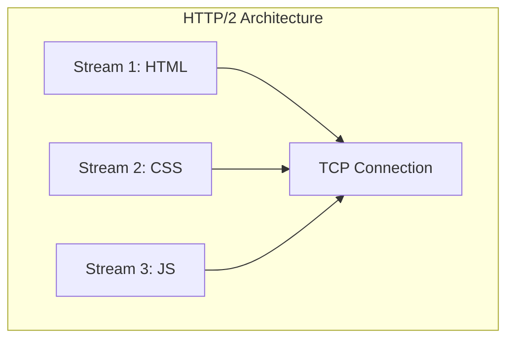
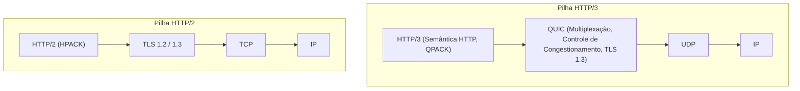
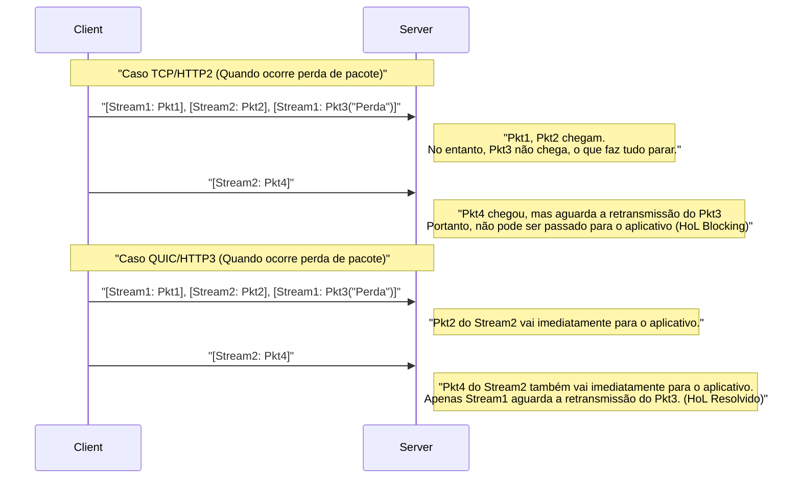
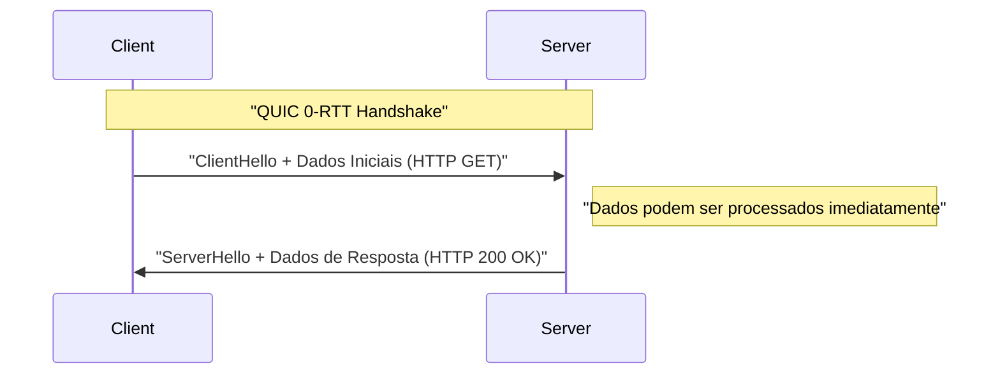

# 1. Introdução: A Evolução da Comunicação Web e o Início da Próxima Geração

O mundo da internet é sustentado por constantes inovações tecnológicas. Por trás dos sites e aplicativos que usamos todos os dias, o protocolo **HTTP (Hypertext Transfer Protocol)** está em funcionamento. Começando com o HTTP/1.0 introduzido na década de 1990, e continuando com o HTTP/1.1 de longa data, evoluiu para o HTTP/2, que melhorou significativamente o desempenho.

No entanto, a web moderna está repleta de conteúdos ricos (imagens de alta resolução, streaming de vídeo, aplicações JavaScript complexas), e as pilhas de protocolos tradicionais começavam a mostrar seus limites. Em particular, a própria especificação do **TCP (Transmission Control Protocol)**, que por muito tempo sustentou a camada de transporte da internet, estava se tornando um obstáculo para uma aceleração ainda maior da web.

Foi então que surgiu o **HTTP/3** e seu protocolo base **QUIC (Quick UDP Internet Connections)**. O HTTP/3 abandonou o TCP e adotou uma abordagem incrivelmente ambiciosa de construir uma nova camada de comunicação confiável sobre o **UDP (User Datagram Protocol)**.

Neste artigo, explicaremos em detalhes extremos por que o HTTP/3 e o QUIC eram necessários, e que tipos de limites do TCP foram superados pelo UDP, utilizando arquiteturas, algoritmos, exemplos concretos de código e diagramas.

---

# 2. A História do HTTP e os Limites do TCP

Para entender a inovação do HTTP/3, primeiro precisamos entender profundamente os desafios que seus predecessores, HTTP/1.1 e HTTP/2, enfrentaram, ou seja, os "limites do TCP".

## 2.1 A Evolução do HTTP/1.1 para o HTTP/2 e os Desafios Restantes

No HTTP/1.1, era necessário processar uma solicitação e resposta sequencialmente em uma única conexão TCP. Para resolver isso, tornou-se popular uma solução alternativa de estabelecer múltiplas conexões TCP, mas a criação de conexões TCP tinha um custo, e havia o limite máximo de conexões simultâneas por navegador (geralmente 6).

O HTTP/2 resolveu esse problema através da **Multiplexação (Multiplexing)** usando **streams**. Ele criou múltiplos streams virtuais dentro de uma única conexão TCP, dividindo solicitações e respostas em pequenos quadros para que pudessem ser trocados simultaneamente.



Isso resolveu a "espera (Head-of-Line Blocking do HTTP)" no nível HTTP. No entanto, o problema fundamental estava escondido na camada de transporte, ou seja, no TCP.

## 2.2 TCP Head-of-Line (HoL) Blocking

O TCP é um protocolo extremamente confiável que "garante a ordem" e "retransmite pacotes perdidos". Quando o remetente envia os pacotes `1, 2, 3, 4`, o receptor sempre os entrega à camada de aplicativo (HTTP/2) nessa exata ordem.

Se o pacote `2` for perdido (packet loss) na rede, mesmo que o receptor tenha recebido os pacotes `3` e `4`, ele não poderá passar os pacotes subsequentes para a camada de aplicativo até que o pacote `2` seja retransmitido e chegue. Isso é chamado de **Head-of-Line Blocking no nível TCP (HoL Blocking)**.

Como o HTTP/2 envia todos os streams sobre uma única conexão TCP, ele possuía uma fraqueza fatal: a perda de apenas um pacote faria com que a comunicação de **todos os streams fosse pausada temporariamente**. Em ambientes de rede móvel onde a perda de pacotes é frequente, houve casos em que o desempenho do HTTP/2 caiu ainda mais em comparação com o HTTP/1.1.

## 2.3 Latência de Handshake (Acúmulo de RTT)

O TCP é um protocolo orientado a conexão e requer um **handshake de 3 vias** antes que a comunicação possa começar. Além disso, há o handshake de criptografia (TLS), que é essencial na web moderna.

Em um ambiente TCP + TLS 1.2, leva o equivalente a vários Round Trip Times (RTT) para estabelecer a comunicação.

*   **Handshake TCP:** $ 1 \text{ RTT} $
*   **Handshake TLS:** $ 2 \text{ RTT} $ (No caso do TLS 1.2)

Um tempo total de $ 3 \text{ RTT} $ é consumido antes que a primeira solicitação HTTP seja enviada. Enquanto houver o limite físico da velocidade da luz, é impossível reduzir o próprio RTT a zero (por exemplo, a comunicação entre o Japão e a Costa Oeste dos EUA leva cerca de 100 ms). Portanto, reduzir o número de RTTs necessários para estabelecer a comunicação era um requisito absoluto para melhorar o desempenho.

## 2.4 Falta de Mobilidade IP (Desconexão da Conexão)

O TCP identifica os endpoints que estão se comunicando por uma combinação de **quatro elementos de endereço IP e número de porta (IP de Origem, Porta de Origem, IP de Destino, Porta de Destino)**.

Quando um smartphone muda de Wi-Fi para uma rede 4G/5G, o endereço IP do dispositivo muda. Quando o endereço IP muda, o TCP considera isso como uma comunicação diferente, e a conexão TCP existente é cortada. Se você estiver fazendo streaming de um vídeo ou baixando um arquivo grande, precisará restabelecer a conexão do zero, prejudicando severamente a experiência do usuário (UX).

---

# 3. O Nascimento do QUIC: Desenhando um Novo Mundo na Tela do UDP

Para quebrar esses limites do TCP, o Google começou a desenvolver, e mais tarde a IETF (Internet Engineering Task Force) padronizou, o **QUIC (Quick UDP Internet Connections)**.

A maior surpresa do QUIC é que ele abandonou o TCP, a base da internet por muitos anos, e adotou o **UDP (User Datagram Protocol)** como base.

## 3.1 Por Que Escolher UDP em Vez de Melhorar o TCP?

Você pode pensar: "Se há um problema com o TCP, por que não apenas atualizar a versão do próprio TCP?" No entanto, na realidade, isso foi extremamente difícil.

O maior motivo é a **Ossificação (Ossification) dos Middleboxes**.
Equipamentos de rede na internet (middleboxes) como roteadores, firewalls, NAT (Network Address Translation) e balanceadores de carga interpretam profundamente as especificações do TCP (como a estrutura do cabeçalho e o comportamento das flags) e realizam otimizações e verificações de segurança.

Se uma nova flag fosse adicionada ao cabeçalho TCP ou uma nova versão do TCP fosse criada, inúmeros middleboxes antigos em todo o mundo a descartariam como um "pacote inválido". Isso é chamado de **Ossificação de Protocolo (Protocol Ossification)**.

Por outro lado, o UDP é um protocolo muito simples que carrega apenas informações como porta de destino, porta de origem e soma de verificação. Os middleboxes também não interferem profundamente no conteúdo do UDP.
Portanto, foi adotada a abordagem de **"reimplementar todos os controles de confiabilidade semelhantes ao TCP e a criptografia TLS no espaço do usuário (um local próximo à camada de aplicativo) na tela em branco do UDP"**. Isso é o QUIC.

## 3.2 A Pilha de Protocolos do QUIC

A pilha de protocolos do HTTP/3 que adota o QUIC é a seguinte:



O QUIC integra a funcionalidade de multiplexação (streams) que o HTTP/2 tinha, a funcionalidade de controle de congestionamento e recuperação de perda de pacotes que o TCP tinha, e a funcionalidade de criptografia do TLS 1.3 em uma única camada.

---

# 4. As Inovações e Soluções Trazidas pelo QUIC

Como o QUIC resolveu os limites do TCP mencionados anteriormente? Veremos detalhadamente as tecnologias inovadoras centrais.

## 4.1 Resolvendo o HoL Blocking na Camada de Transporte

O QUIC abandonou a "garantia de ordem de toda a conexão" como no TCP e introduziu a **"garantia de ordem por stream"**.

Existem múltiplos streams independentes dentro do QUIC, e cada pacote carrega a informação de a qual stream pertence. Se um determinado pacote for perdido, **apenas o stream ao qual o pacote ausente pertence** ficará em espera. Pacotes pertencentes a outros streams são entregues à camada de aplicativo (HTTP/3) sem serem afetados pela perda.



Isso melhorou drasticamente o desempenho em ambientes de rede instáveis propensos à perda de pacotes (como redes móveis ou Wi-Fi público congestionado).

## 4.2 Aceleração Extrema do Estabelecimento da Conexão (1-RTT e 0-RTT)

O QUIC foi projetado para realizar o handshake da camada de transporte e o handshake criptográfico (TLS 1.3) **simultaneamente**.

Com servidores com os quais se comunica pela primeira vez, ele pode concluir o estabelecimento da conexão e a troca de chaves criptográficas em **1-RTT** e iniciar imediatamente a transmissão de dados. Em comparação com os $ 3 \text{ RTT} $ do TCP+TLS1.2, isso por si só é uma evolução drástica.

Além disso, para servidores com os quais já se comunicou no passado, o QUIC fornece um recurso mágico chamado **0-RTT (Zero Round Trip Time)**.
O cliente utiliza um ticket de sessão e parâmetros recebidos do servidor em uma comunicação anterior e envia imediatamente dados de solicitação HTTP (como solicitações GET) embutidos no pacote de handshake inicial (ClientHello).



Com isso, o atraso teórico no início da comunicação se torna zero. No entanto, existe um risco de segurança de que os dados 0-RTT sejam vulneráveis a **Ataques de Repetição (Replay Attacks)**. Portanto, o que pode ser enviado com 0-RTT é limitado a solicitações seguras com "idempotência (o resultado é o mesmo não importa quantas vezes seja executado)", como solicitações GET.

## 4.3 Migração de Conexão (Connection Migration)

Para superar a fraqueza do TCP de ser desconectado quando o endereço IP muda, o QUIC gerencia as conexões não por endereços IP e portas, mas por um identificador exclusivo chamado **ID de Conexão (Connection ID)**.

O ID da Conexão é incluído sem ser criptografado (para que seja roteável) no cabeçalho do pacote QUIC.

Suponha que um usuário saia do alcance do Wi-Fi e mude para a rede 4G/5G, e o endereço IP do smartphone mude. O cliente QUIC envia pacotes do novo endereço IP, mas o "ID de Conexão" existente está incluído no pacote.
O servidor detecta que o endereço IP mudou, mas como o ID de Conexão corresponde, reconhece isso como uma "continuação da mesma comunicação" e continua a comunicação sem re-handshake.

Graças a esse recurso, foi alcançada uma transição perfeita de comunicação em ambientes móveis, reduzindo drasticamente as paradas de bufferização de vídeos e as falhas de download.

---

# 5. HTTP/3: Semântica HTTP sobre QUIC

O protocolo QUIC em si não é exclusivo para HTTP, mas sim um protocolo de transporte genérico. A especificação para executar a semântica HTTP (métodos, cabeçalhos, códigos de status, etc.) sobre esse QUIC é o **HTTP/3**.

O HTTP/3 basicamente herda os conceitos do HTTP/2, mas algumas mudanças importantes foram feitas porque a camada subjacente mudou do TCP para o QUIC.

## 5.1 Compressão de Cabeçalho com QPACK

No HTTP/2, foi usado um algoritmo de compressão de cabeçalho chamado **HPACK**. O HPACK mantém uma Tabela Dinâmica (Dynamic Table) em ambas as extremidades da comunicação, e ao enviar um cabeçalho previamente enviado apenas por seu número de índice, reduz a quantidade de dados transmitidos.

No entanto, o HPACK dependia inteiramente da "garantia de ordem" do TCP. Em outras palavras, se um bloco de cabeçalho fosse perdido e aguardasse retransmissão, os cabeçalhos dos streams subsequentes não poderiam ser descriptografados até que a Tabela Dinâmica dependente fosse atualizada. Existia o HoL Blocking causado pelo HPACK.

Como o QUIC não garante a ordem entre os streams, usar o HPACK como está quebraria a sincronização da tabela dinâmica quando a ordem de chegada dos streams mudasse.

Para resolver isso, foi projetado o **QPACK**. No QPACK, a atualização da tabela dinâmica é separada de cada stream de dados, e um mecanismo foi introduzido para gerenciar a tabela de forma assíncrona com um stream de controle dedicado. Com isso, é possível uma comunicação de cabeçalhos segura e altamente compactada, mesmo sob a entrega desordenada de streams do QUIC.

## 5.2 Streams de Controle e Streams Unidirecionais

No HTTP/3, além dos streams bidirecionais para solicitações e respostas, vários **streams unidirecionais** especiais são definidos.

1.  **Stream de Controle:** Um stream para trocar configurações (quadros SETTINGS), etc.
2.  **Stream do Codificador QPACK:** Um stream para atualizar a tabela dinâmica do QPACK.
3.  **Stream do Decodificador QPACK:** Um stream para notificar a confirmação de atualização ou erros na tabela do QPACK.

Essas são otimizações para evitar contenção de dados e esperas desnecessárias, dividindo os streams de acordo com suas funções.

---

# 6. Mergulho Técnico Profundo: Algoritmos QUIC e Fórmulas

A partir daqui, vamos aprofundar um pouco os aspectos técnicos e examinar os algoritmos e as avaliações de desempenho que sustentam o QUIC usando fórmulas.

## 6.1 Controle de Congestionamento BBR (Bottleneck Bandwidth and Round-trip propagation time)

Como o QUIC é implementado no espaço do usuário, ele tem a vantagem de poder atualizar livre e rapidamente os algoritmos de controle de congestionamento sem esperar por atualizações no kernel do SO. Na maioria dos casos, o **BBR** desenvolvido pelo Google é adotado como controle de congestionamento do QUIC.

O controle de congestionamento tradicional baseado em perda, como CUBIC TCP, continua a aumentar a janela de envio até ocorrer a perda de pacote. Portanto, ele tinha um problema propenso a causar o bufferbloat (um fenômeno onde os buffers de equipamentos de rede enchem, aumentando o atraso).

A taxa de transferência tradicional do TCP (Fórmula de Mathis) é expressa como a seguir:

$ \text{Taxa de Transferência} \le \frac{\text{MSS}}{R \times \sqrt{p}} $

*   $ \text{MSS} $ : Maximum Segment Size (Tamanho Máximo do Segmento)
*   $ R $ : Round Trip Time (RTT)
*   $ p $ : Taxa de perda de pacotes

Como esta fórmula mostra, a taxa de transferência de um TCP baseado em perda cai drasticamente quando a taxa de perda de pacotes $ p $ aumenta, mesmo que um pouco.

Em contraste, o BBR estima o limite da rede medindo diretamente a **Largura de Banda (Bandwidth)** e o **Atraso (RTT)** em vez da perda de pacotes.

O BBR modela a capacidade do tubo da rede usando a seguinte fórmula:

$ \text{BDP (Produto Largura de Banda-Atraso)} = \text{BtlBw} \times \text{RTprop} $

*   $ \text{BtlBw} $ : Bottleneck Bandwidth (Largura de banda do gargalo - velocidade máxima de comunicação anterior)
*   $ \text{RTprop} $ : Round-Trip propagation time (Tempo de propagação de ida e volta - RTT mínimo anterior)

O BBR ajusta a velocidade de envio para que a quantidade de dados em voo (In-flight) corresponda a esse BDP. Como resultado, mesmo que ocorra perda de pacotes (ex: perda devido a interferência sem fio), não reduz a velocidade desnecessariamente, e por não transbordar o buffer do roteador, consegue alcançar uma alta taxa de transferência e baixa latência de forma equilibrada. A combinação de implementação em espaço do usuário do QUIC e o BBR oferece o melhor desempenho.

## 6.2 Integração de Criptografia e Segurança

O QUIC incorpora nativamente o **TLS 1.3** por padrão, e conexões QUIC em "texto plano" (plaintext) não criptografadas não existem. No caso do TCP, como o próprio cabeçalho TCP não era criptografado, era possível para os middleboxes espiar as flags TCP (SYN, ACK, FIN, etc.) e adulterá-las (como a Injeção de RST).

No QUIC, exceto pelos cabeçalhos IP e UDP, a maior parte do cabeçalho QUIC (incluindo números de pacotes) e o payload são completamente criptografados.
Como até os números de pacotes são criptografados, mesmo que se monitore o tráfego de rede ao longo do caminho, é extremamente difícil deduzir metadados, como qual pacote foi retransmitido, quão grande é a janela de congestionamento atual. Isso é incrivelmente poderoso do ponto de vista da proteção da privacidade.

---

# 7. Implementação do QUIC e Exemplos de Código

Vamos dar uma olhada em exemplos de código para ter uma ideia concreta de como o QUIC é manipulado no programa.
Aqui está um exemplo simples de servidor e cliente HTTP/3 usando a biblioteca de implementação QUIC assíncrona do Python, `aioquic`.

## 7.1 Servidor HTTP/3 em Python (aioquic)

```python
import asyncio
from aioquic.asyncio import serve
from aioquic.h3.connection import H3_ALPN, H3Connection
from aioquic.h3.events import DataReceived, HeadersReceived
from aioquic.quic.configuration import QuicConfiguration

class Http3ServerProtocol(asyncio.Protocol):
    def __init__(self):
        self.http = H3Connection(is_client=False)
        self.transport = None

    def connection_made(self, transport):
        self.transport = transport

    def datagram_received(self, data, addr):
        # Recebe datagrama UDP e passa para a pilha de protocolo QUIC
        self.http.receive_datagram(data, addr, now=asyncio.get_event_loop().time())
        self.process_http_events()

    def process_http_events(self):
        for event in self.http.next_event():
            if isinstance(event, HeadersReceived):
                print(f"Received headers: {event.headers}")
                # Constrói uma resposta simples 200 OK
                headers = [
                    (b":status", b"200"),
                    (b"server", b"aioquic"),
                    (b"content-type", b"text/html"),
                ]
                self.http.send_headers(event.stream_id, headers)
                self.http.send_data(event.stream_id, b"<h1>Hello HTTP/3 via QUIC!</h1>", end_stream=True)
                
        # Envia a resposta via UDP
        for data, addr in self.http.datagrams_to_send(now=asyncio.get_event_loop().time()):
            self.transport.sendto(data, addr)

async def main():
    configuration = QuicConfiguration(is_client=False, alpn_protocols=H3_ALPN)
    # Requer o carregamento de um certificado
    configuration.load_cert_chain("cert.pem", "key.pem")
    
    # Escuta na porta UDP 443
    await serve("0.0.0.0", 443, configuration=configuration, create_protocol=Http3ServerProtocol)
    print("HTTP/3 Server listening on UDP 443...")
    await asyncio.Future()  # rodar para sempre

if __name__ == "__main__":
    asyncio.run(main())
```

Como visto neste código, enquanto o sistema inferior é totalmente **comunicação UDP (datagram_received / sendto)**, no topo disso ocorre um controle avançado de streams e processamento de cabeçalhos do HTTP/3.

## 7.2 Ativação do HTTP/3 no Nginx

O Nginx, que é amplamente usado como servidor web, também suporta o HTTP/3 e o QUIC por padrão a partir da versão 1.25.0.
A configuração é muito simples, bastando adicionar algumas linhas à configuração TLS existente.

```nginx
server {
    # Para o TCP tradicional (HTTP/1.1, HTTP/2)
    listen 443 ssl;
    listen [::]:443 ssl;
    
    # Para o novo UDP (HTTP/3, QUIC)
    listen 443 quic reuseport;
    listen [::]:443 quic reuseport;

    server_name example.com;

    ssl_certificate     /path/to/cert.pem;
    ssl_certificate_key /path/to/key.pem;
    # QUIC requer TLS 1.3
    ssl_protocols       TLSv1.2 TLSv1.3;

    location / {
        root /var/www/html;
        # Informa ao cliente que HTTP/3 está disponível (cabeçalho Alt-Svc)
        add_header Alt-Svc 'h3=":443"; ma=86400';
    }
}
```

O importante aqui é o cabeçalho `Alt-Svc`. Inicialmente, o navegador tenta se conectar via TCP (HTTP/2, etc.) por motivos históricos. Se a resposta contiver `Alt-Svc: h3=":443"`, ele reconhecerá "Esse servidor também pode falar HTTP/3 na porta UDP 443!" e tentará fazer o upgrade da conexão para o QUIC para acessos subsequentes ou em segundo plano.

---

# 8. Desafios de Implantação e Operação (Challenges of Deployment)

Embora o QUIC e o HTTP/3 sejam uma tecnologia de sonho, existem algumas grandes barreiras na implementação no uso real.

## 8.1 Bloqueio de UDP por Firewalls Corporativos

Desde os primórdios da internet, o UDP tem sido frequentemente usado em "ataques DDoS" e "comunicação [P2P](https://kenji.blog/pt/p/webrtc-realtime-communication-p2p/) suspeita", e por isso não é incomum encontrar firewalls corporativos e administradores de rede onde é **bloqueado de forma geral (DROP), exceto para as portas 53 (DNS) e 123 (NTP)**.

O QUIC utiliza a porta UDP 443, mas em um ambiente onde o UDP é bloqueado simplesmente por ser UDP, as comunicações HTTP/3 não podem ser estabelecidas.
Neste caso, os navegadores têm um mecanismo embutido onde eles aguardam alguns milissegundos a vários segundos e, ao detectarem um timeout na conexão QUIC, automaticamente realizam o fallback para o TCP (HTTP/2). No entanto, o próprio tempo de espera para esse fallback causa atrasos que pioram a experiência do usuário.

## 8.2 Alta Carga de CPU e Falta de Hardware Offload

O TCP possui dezenas de anos de história, e as placas de rede (NICs) modernas têm funcionalidades como o **TCP Segmentation Offload (TSO)**, que assumem a fragmentação de pacotes e o cálculo de soma de verificação por conta do hardware (chips na NIC). Isso reduz drasticamente a carga da CPU no sistema operacional.

No entanto, uma vez que o QUIC roda no espaço do usuário e, além disso, todos os pacotes são individualmente sujeitos a criptografia forte (AES-GCM ou ChaCha20), a **utilização da CPU se torna muito maior em comparação com TCP+TLS** no servidor que gerencia uma quantidade massiva de comunicação.
Atualmente, fornecedores de hardware e provedores de nuvem estão correndo para desenvolver recursos como o UDP Segmentation Offload (USO), mas até que o suporte total ao nível do hardware se espalhe, ainda estaremos acompanhados pelo desafio do aumento nos custos de infraestrutura.

## 8.3 Complicação do Balanceamento de Carga (Load Balancing)

No balanceamento de carga tradicional de tráfego TCP, era comum usar um valor de hash simples baseado na 4-tupla (IP e Porta de Origem, IP e Porta de Destino) para distribuir entre os servidores backend.

No entanto, o QUIC causa mudanças de porta ou de IP do cliente a meio da comunicação, devido à sua capacidade de **"migração de conexão"** (Connection Migration) mencionada acima. Portanto, sob rotas simples baseadas em IP, os pacotes seriam distribuídos a outro servidor backend a meio da comunicação, quebrando a conexão.

A fim de lidar corretamente com o load balancing do QUIC, são necessários balanceadores de carga mais avançados nas camadas 4/7 que leem o "ID de Conexão" no cabeçalho do pacote, usando-o para encaminhar os pacotes sempre para o mesmo servidor de backend.

---

# 9. O Futuro do QUIC: WebTransport e Áreas de Aplicação em Expansão

O verdadeiro valor do QUIC não se limita a possibilitar o HTTP/3. Sendo um "protocolo de transporte de uso geral baseado em UDP com alto desempenho e segurança", o QUIC está começando a ser adotado como a base para vários protocolos além do HTTP.

## 9.1 WebTransport: O Padrão de Próxima Geração Pós-WebSocket

Atualmente, **WebSocket** é amplamente utilizado para comunicação bidirecional em tempo real entre navegadores web e servidores. No entanto, por funcionar sob o TCP, os WebSockets também não conseguem escapar do problema do HoL Blocking. Por exemplo, informações como sincronização de posição em tempo real num jogo têm a característica de que "queremos os dados mais recentes imediatamente e rejeitamos dados obsoletos minimamente atrasados", mas o TCP retransmite fielmente os pacotes em atraso, causando "lag" no jogo.

Isso é resolvido por uma nova API baseada no QUIC chamada **WebTransport**.
O WebTransport permite que, via JavaScript no navegador, não só se manipulem as comunicações de stream com confiabilidade garantida, mas também se transmitam os dados mais rápidos através de **comunicação datagrama**, mesmo com perda de pacote tolerada.
Espera-se que isso impulsione a evolução no cloud gaming baseado no browser, assim como transmissões de vídeo ao vivo com latência ultrabaixa (substitutos para [WebRTC](https://kenji.blog/pt/p/webrtc-realtime-communication-p2p/)).

## 9.2 Mudança de Vários Protocolos para "over QUIC"

Tirando vantagem das propriedades do QUIC, está a ocorrer uma padronização para executar os protocolos existentes na base do QUIC.

*   **DoQ (DNS over QUIC):** Um protocolo DNS de próxima geração que garante a privacidade e velocidade simultaneamente. Mais rápido que o DoT sobre TCP, mais seguro que o DNS plaintext sobre UDP.
*   **SMB over QUIC:** Tecnologia que faz o protocolo de partilha de ficheiros do Windows (SMB) em QUIC, permitindo que a aceda ao servidor de ficheiros em segurança e rapidez pela Internet, e sem VPN (implementado no Windows Server 2022).
*   **SSH over QUIC:** Conexão de terminal SSH final cuja ligação não cai ao se mover pela rede móvel.

Portanto, o QUIC estabeleceu perfeitamente a sua posição como o "novo standard para a Camada 4 da Internet".

---

# 10. Conclusão: Da Era do TCP à Era do QUIC

Neste artigo, aprofundamos nos protocolos HTTP/3 e QUIC, na mudança de paradigma para o UDP perante os limites do TCP, na resolução do HoL Blocking e nas melhorias de aceleração no estabelecimento da conexão, juntamente com os desafios na sua operacionalização.

*   **Os limites do TCP:** HoL Blocking pela ordem garantida, latências no handshake, e a vulnerabilidade à alteração do endereço IP.
*   **A Inovação do QUIC:** Tendo por base o UDP, permite a multiplexação de streams, a integração com o TLS 1.3 e migrações através dos IDs de conexão concretizados no "espaço de usuário".
*   **HTTP/3:** A nova especificação de HTTP (ex. QPACK) otimizada tendo em base as características do QUIC.

O TCP tem sido um ótimo protocolo que impulsionou o enorme crescimento da internet pelos últimos 40 anos. No entanto, nesta época contemporânea, em que cada milissegundo num aplicativo da web nos smartphones resulta diretamente no negócio, o seu limite em matéria de arquitetura tem se verificado de uma maneira indisfarçável.

Desenhado perante o ecrã branco do UDP, o QUIC desfez do zero todas as restrições e atrasos na rede que prejudicavam a web. Ainda existem vários entraves na implementação (como definições no firewall, falta de opções off-load em equipamentos), mas neste ponto atual da internet, a maioria das organizações com as infraestruturas de dados mais massivas, tal como Google, Facebook (Meta) e Cloudflare, migraram para o HTTP/3 com sucesso.

As aplicações que hoje criamos poderão usufruir naturalmente desta nova era que o QUIC inaugurou - proporcionando um fluxo de experiência sempre veloz e consistente. Com o desenvolvimento desta tecnologia brilhante e os protocolos ao seu redor que definirão as tendências na internet das próximas décadas - devemos manter-nos muito atentos!

---

*Referências Bibliográficas:*
*   RFC 9000: QUIC: A UDP-Based Multiplexed and Secure Transport
*   RFC 9114: HTTP/3
*   RFC 9204: QPACK: Field Compression for HTTP/3
*   Documentos Relevantes pelo IETF QUIC Working Group
