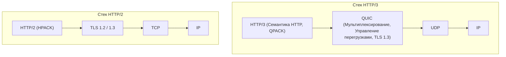
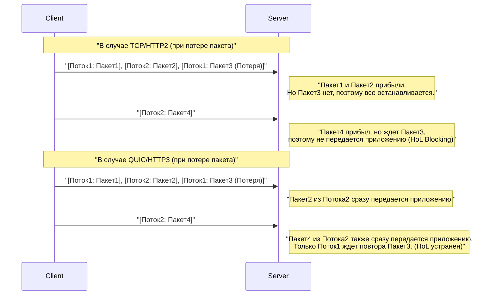
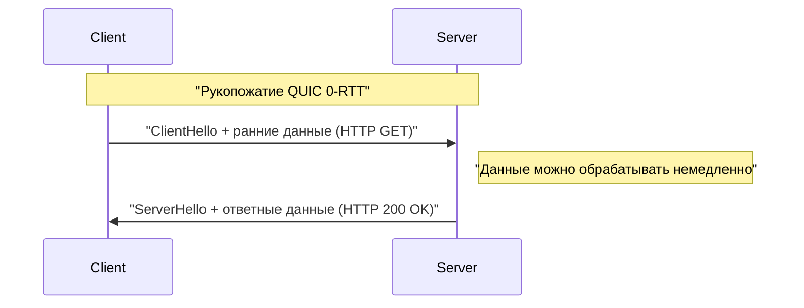

# 1. Введение: эволюция веб-коммуникаций и начало новой эры

Мир интернета держится на постоянных технологических инновациях. В основе работы веб-сайтов и приложений, которыми мы пользуемся каждый день, лежит протокол **HTTP (Hypertext Transfer Protocol)**. Начав с HTTP/1.0, появившегося в 1990-х годах, он продолжал развиваться через долго использовавшийся HTTP/1.1 к HTTP/2, который значительно повысил производительность.

Однако современный веб переполнен «тяжелым» контентом (изображениями высокого разрешения, потоковым видео, сложными JavaScript-приложениями), и традиционный стек протоколов начал показывать свои пределы. В частности, сами спецификации **TCP (Transmission Control Protocol)**, который долгие годы был основой транспортного уровня интернета, стали препятствием для дальнейшего ускорения веба.

Именно тогда появились **HTTP/3** и лежащий в его основе протокол **QUIC (Quick UDP Internet Connections)**. HTTP/3 использует очень амбициозный подход: он отказывается от TCP и строит новый уровень надежной связи поверх **UDP (User Datagram Protocol)**.

В этой статье мы подробно, с использованием архитектурных схем, алгоритмов, конкретных примеров кода и иллюстраций, объясним, почему возникла необходимость в HTTP/3 и QUIC, и какие ограничения TCP удалось преодолеть с помощью UDP.

---

# 2. История HTTP и ограничения TCP

Чтобы понять инновационность HTTP/3, необходимо сначала глубоко разобраться в проблемах, с которыми сталкивались его предшественники, HTTP/1.1 и HTTP/2, а именно в «ограничениях TCP».

## 2.1 Эволюция от HTTP/1.1 к HTTP/2 и оставшиеся проблемы

В HTTP/1.1 запросы и ответы должны были обрабатываться последовательно в рамках одного TCP-соединения. Для решения этой проблемы стало популярным обходное решение в виде открытия нескольких TCP-соединений, но установка соединения требовала затрат ресурсов, к тому же существовали ограничения браузеров на максимальное количество одновременных подключений (обычно 6).

HTTP/2 решил эту проблему с помощью **мультиплексирования (Multiplexing)** через **потоки (streams)**. Внутри одного TCP-соединения создавались виртуальные потоки, а запросы и ответы разбивались на мелкие фреймы, что позволяло обмениваться ими одновременно.


Благодаря этому «очередь ожидания» на уровне HTTP (HTTP Head-of-Line Blocking) была устранена. Однако фундаментальная проблема скрывалась на транспортном уровне, то есть в TCP.

## 2.2 Блокировка начала очереди (HoL) в TCP

TCP — это протокол высокой надежности, который обеспечивает «гарантию порядка» и «повторную передачу при потере пакетов». Когда отправитель посылает пакеты `1, 2, 3, 4`, получатель всегда передает их на прикладной уровень (HTTP/2) именно в таком порядке.

Если пакет `2` теряется в сети (потеря пакета), получатель не сможет передать последующие пакеты на прикладной уровень, даже если он уже получил пакеты `3` и `4`, пока пакет `2` не будет отправлен повторно и не прибудет. Это называется **Head-of-Line Blocking (HoL Blocking) на уровне TCP**.

Поскольку в HTTP/2 все потоки используют одно TCP-соединение, потеря всего лишь одного пакета приводит к фатальной слабости: **передача данных всех потоков временно приостанавливается**. В средах с частой потерей пакетов, например в мобильных сетях, производительность HTTP/2 иногда была даже ниже, чем у HTTP/1.1.

## 2.3 Задержка рукопожатия (накопление RTT)

TCP — это протокол, ориентированный на соединение, и перед началом обмена данными необходимо выполнить **трехэтапное рукопожатие (3-way handshake)**. Кроме того, добавляется рукопожатие шифрования (TLS), которое стало обязательным в современном вебе.

В среде TCP + TLS 1.2 установка соединения занимает время, равное нескольким значениям Round-Trip Time (RTT).

*   **Рукопожатие TCP:** $ 1 \text{ RTT} $
*   **Рукопожатие TLS:** $ 2 \text{ RTT} $ (для TLS 1.2)

В общей сложности перед отправкой первого HTTP-запроса тратится $ 3 \text{ RTT} $. Поскольку физические законы (скорость света) ограничивают скорость передачи, сократить RTT до нуля невозможно (например, связь между Японией и Западным побережьем США занимает около 100 мс). Следовательно, сокращение количества RTT, необходимых для установления соединения, было абсолютным условием для повышения производительности.

## 2.4 Отсутствие IP-мобильности (разрыв соединения)

TCP идентифицирует конечные точки обмена данными по **комбинации из четырех параметров (Source IP, Source Port, Destination IP, Destination Port)**.

Когда смартфон переключается с Wi-Fi на сеть 4G/5G, IP-адрес устройства меняется. При изменении IP-адреса TCP рассматривает это как другое соединение, и существующее TCP-соединение разрывается. При потоковой передаче видео или загрузке больших файлов соединение приходится устанавливать заново, что сильно ухудшает пользовательский опыт (UX).

---

# 3. Рождение QUIC: новый мир на холсте UDP

Чтобы преодолеть эти ограничения TCP, компания Google начала разработку протокола, который позже был стандартизирован IETF (Internet Engineering Task Force) под названием **QUIC (Quick UDP Internet Connections)**.

Самое удивительное в QUIC — это отказ от TCP, который долгие годы был основой интернета, и переход на использование **UDP (User Datagram Protocol)**.

## 3.1 Почему выбрали UDP, а не улучшили TCP?

Вы можете спросить: «Если проблема в TCP, почему бы просто не обновить сам TCP?». Но на практике это оказалось чрезвычайно сложно.

Главная причина — **окостенение мидлбоксов (Middlebox Ossification)**.
Сетевые устройства в интернете, такие как маршрутизаторы, брандмауэры, NAT и балансировщики нагрузки (мидлбоксы), глубоко анализируют спецификации TCP (структуру заголовков, флаги и т.д.) для оптимизации и проверки безопасности.

Если добавить новый флаг в заголовок TCP или создать новую версию TCP, бесчисленное количество старых мидлбоксов по всему миру отбросят эти пакеты как «недопустимые». Это называется **окостенением протокола (Protocol Ossification)**.

С другой стороны, UDP — это очень простой протокол, который содержит только порт назначения, порт источника и контрольную сумму. Мидлбоксы не слишком глубоко вмешиваются в содержимое UDP.
Поэтому был выбран подход: **«полностью переопределить управление надежностью, как в TCP, и шифрование TLS в пользовательском пространстве (ближе к прикладному уровню) на чистом холсте UDP»**. Это и есть QUIC.

## 3.2 Стек протоколов QUIC

Стек протоколов HTTP/3 с внедренным QUIC выглядит следующим образом:



QUIC объединяет в едином уровне функции мультиплексирования (потоки), которые были в HTTP/2, функции управления перегрузками и восстановления после потери пакетов, которые были в TCP, и функции шифрования TLS 1.3.

---

# 4. Инновационные функции и решения QUIC

Как же QUIC решает упомянутые выше ограничения TCP? Давайте детально рассмотрим инновационные технологии, лежащие в его основе.

## 4.1 Устранение HoL Blocking на транспортном уровне

QUIC отказывается от «гарантии порядка для всего соединения», как в TCP, и вводит **«гарантию порядка для каждого потока»**.

Внутри QUIC существует множество независимых потоков, и каждый пакет содержит информацию о том, к какому потоку он принадлежит. Если какой-либо пакет теряется, в ожидании задерживается **только тот поток, к которому принадлежал утерянный пакет**. Пакеты, принадлежащие другим потокам, доставляются на прикладной уровень (HTTP/3) без задержек.



Благодаря этому производительность в нестабильных сетевых средах с частой потерей пакетов (мобильные сети, переполненный публичный Wi-Fi) значительно возросла.

## 4.2 Сверхбыстрая установка соединения (1-RTT и 0-RTT)

QUIC спроектирован так, чтобы выполнять рукопожатие транспортного уровня и рукопожатие шифрования (TLS 1.3) **одновременно**.

При первом соединении с сервером установка соединения и обмен ключами шифрования завершаются за **1-RTT**, после чего можно сразу начинать передачу данных. По сравнению с $ 3 \text{ RTT} $ для TCP+TLS1.2, это уже огромный шаг вперед.

Более того, для серверов, с которыми уже была связь ранее, QUIC предоставляет волшебную функцию **0-RTT (Zero Round Trip Time)**.
Клиент использует сессионный билет и параметры, полученные от сервера в предыдущей сессии, и отправляет данные HTTP-запроса (например, GET-запрос) прямо с первым пакетом рукопожатия (ClientHello).



В теории это сводит задержку перед началом обмена данными к нулю. Однако данные 0-RTT уязвимы для **атак повторного воспроизведения (Replay Attack)**. Поэтому передача через 0-RTT ограничивается безопасными запросами, обладающими «идемпотентностью» (например, GET-запросы, где многократное выполнение дает один и тот же результат).

## 4.3 Миграция соединения (Connection Migration)

Чтобы преодолеть слабость TCP, разрывающего связь при смене IP-адреса, QUIC управляет соединениями не по IP и портам, а по уникальному идентификатору — **идентификатору соединения (Connection ID)**.

Connection ID включается в заголовок пакета QUIC в не зашифрованном виде (для маршрутизации).

Представим, что пользователь выходит из зоны Wi-Fi и переключается на 4G/5G, меняя свой IP-адрес. Клиент QUIC отправляет пакеты с нового IP-адреса, но в этих пакетах указан существующий Connection ID.
Сервер обнаруживает изменение IP-адреса, но поскольку Connection ID совпадает, он распознает это как «продолжение того же общения» и возобновляет передачу без нового рукопожатия.

Эта функция обеспечивает бесшовное переключение в мобильных сетях, резко снижая сбои при загрузке или остановки видео из-за буферизации.

---

# 5. HTTP/3: семантика HTTP поверх QUIC

Сам протокол QUIC не является специализированным для HTTP; это универсальный транспортный протокол. Спецификация для работы семантики HTTP (методы, заголовки, коды состояния) поверх QUIC называется **HTTP/3**.

HTTP/3 во многом наследует концепции HTTP/2, но из-за смены нижележащего уровня с TCP на QUIC были внесены некоторые важные изменения.

## 5.1 Сжатие заголовков с помощью QPACK

В HTTP/2 использовался алгоритм сжатия заголовков **HPACK**. Он поддерживает динамические таблицы на обоих концах соединения и снижает объем передаваемых данных, отправляя только индексные номера для уже переданных заголовков.

Однако HPACK полностью зависел от «гарантии порядка» TCP. Если блок заголовков терялся и ожидал повторной передачи, заголовки последующих потоков не могли быть расшифрованы, пока не обновится зависящая от них динамическая таблица, что создавало HoL Blocking, вызванный HPACK.

Поскольку QUIC не гарантирует порядок между потоками, использование HPACK в первозданном виде привело бы к нарушению синхронизации динамических таблиц при изменении порядка прибытия потоков.

Для решения этой проблемы был разработан **QPACK**. QPACK отделяет обновление динамической таблицы от каждого потока данных и использует механизм асинхронного управления таблицей через специальный управляющий поток. Это позволяет безопасно и с высокой степенью сжатия передавать заголовки даже при доставке потоков вне порядка в QUIC.

## 5.2 Управляющие и однонаправленные потоки

Помимо двунаправленных потоков для запросов и ответов, в HTTP/3 определены несколько специальных **однонаправленных потоков**:

1.  **Управляющий поток (Control Stream):** поток для обмена настройками (кадры SETTINGS) и т.д.
2.  **Поток кодировщика QPACK:** поток для обновления динамической таблицы QPACK.
3.  **Поток декодера QPACK:** поток для подтверждения обновления таблицы QPACK и сообщения об ошибках.

Разделение потоков по ролям — это оптимизация для предотвращения конфликтов данных и ненужного ожидания.

---

# 6. Техническое углубление: алгоритмы и формулы QUIC

Здесь мы немного углубимся в техническую часть и рассмотрим алгоритмы, поддерживающие QUIC, и оценку производительности с использованием формул.

## 6.1 Управление перегрузкой BBR (Bottleneck Bandwidth and Round-trip propagation time)

Поскольку QUIC реализован в пользовательском пространстве, алгоритмы управления перегрузкой можно обновлять свободно и быстро, не дожидаясь обновления ядра ОС. Во многих случаях в качестве механизма управления перегрузкой в QUIC используется алгоритм **BBR**, разработанный Google.

Традиционные алгоритмы управления перегрузкой, основанные на потере пакетов, такие как CUBIC TCP, продолжают увеличивать окно передачи до тех пор, пока не произойдет потеря пакета. Это часто приводило к проблеме раздувания буфера (bufferbloat), когда буферы сетевых устройств переполняются, что увеличивает задержку.

Пропускная способность традиционного TCP (формула Матиса) выражается следующим образом:

$ \text{Throughput} \le \frac{\text{MSS}}{R \times \sqrt{p}} $

*   $ \text{MSS} $ : Максимальный размер сегмента (Maximum Segment Size)
*   $ R $ : Время кругового пути (Round Trip Time, RTT)
*   $ p $ : Частота потери пакетов

Как показывает эта формула, пропускная способность TCP, основанного на потерях, резко падает даже при малейшем увеличении вероятности потери пакетов $ p $.

С другой стороны, BBR оценивает пределы сети не по потере пакетов, а путем непосредственного измерения **пропускной способности (Bandwidth)** и **задержки (RTT)**.

BBR моделирует емкость сетевого канала с помощью следующей формулы:

$ \text{BDP (Произведение пропускной способности на задержку)} = \text{BtlBw} \times \text{RTprop} $

*   $ \text{BtlBw} $ : Пропускная способность узкого места (историческая максимальная скорость)
*   $ \text{RTprop} $ : Время распространения туда и обратно (исторический минимальный RTT)

BBR регулирует скорость передачи так, чтобы объем данных в пути (In-flight) соответствовал BDP. Благодаря этому, даже если происходят потери пакетов (например, из-за беспроводных помех), скорость не снижается напрасно, а буферы маршрутизаторов не переполняются, обеспечивая одновременно высокую пропускную способность и низкую задержку. Комбинация реализации QUIC в пользовательском пространстве и BBR обеспечивает максимальную производительность.

## 6.2 Интеграция шифрования и безопасности

QUIC по умолчанию включает **TLS 1.3**, и не существует нешифрованного соединений QUIC. В случае TCP сам заголовок не зашифрован, поэтому мидлбоксы могут подсматривать флаги (SYN, ACK, FIN и т.д.) или изменять их (например, RST инъекции).

В QUIC, за исключением заголовков IP и UDP, большая часть заголовка QUIC (включая номера пакетов) и полезная нагрузка полностью зашифрованы.
Поскольку даже номера пакетов зашифрованы, мониторинг сетевого трафика на маршруте не позволяет определить, какие пакеты были отправлены повторно или каков текущий размер окна перегрузки. С точки зрения защиты приватности это очень мощно.

---

# 7. Реализация QUIC и примеры кода

Давайте рассмотрим примеры кода, чтобы лучше понять, как программно работать с QUIC.
Вот пример простого HTTP/3 сервера и клиента на Python с использованием асинхронной библиотеки QUIC `aioquic`.

## 7.1 HTTP/3 сервер на Python (aioquic)

```python
import asyncio
from aioquic.asyncio import serve
from aioquic.h3.connection import H3_ALPN, H3Connection
from aioquic.h3.events import DataReceived, HeadersReceived
from aioquic.quic.configuration import QuicConfiguration

class Http3ServerProtocol(asyncio.Protocol):
    def __init__(self):
        self.http = H3Connection(is_client=False)
        self.transport = None

    def connection_made(self, transport):
        self.transport = transport

    def datagram_received(self, data, addr):
        # Получаем датаграмму UDP и передаем ее стеку QUIC
        self.http.receive_datagram(data, addr, now=asyncio.get_event_loop().time())
        self.process_http_events()

    def process_http_events(self):
        for event in self.http.next_event():
            if isinstance(event, HeadersReceived):
                print(f"Received headers: {event.headers}")
                # Формируем простой ответ 200 OK
                headers = [
                    (b":status", b"200"),
                    (b"server", b"aioquic"),
                    (b"content-type", b"text/html"),
                ]
                self.http.send_headers(event.stream_id, headers)
                self.http.send_data(event.stream_id, b"<h1>Hello HTTP/3 via QUIC!</h1>", end_stream=True)
                
        # Отправляем ответ по UDP
        for data, addr in self.http.datagrams_to_send(now=asyncio.get_event_loop().time()):
            self.transport.sendto(data, addr)

async def main():
    configuration = QuicConfiguration(is_client=False, alpn_protocols=H3_ALPN)
    # Требуется загрузка сертификата
    configuration.load_cert_chain("cert.pem", "key.pem")
    
    # Слушаем на порту UDP 443
    await serve("0.0.0.0", 443, configuration=configuration, create_protocol=Http3ServerProtocol)
    print("HTTP/3 Server listening on UDP 443...")
    await asyncio.Future()  # run forever

if __name__ == "__main__":
    asyncio.run(main())
```

Как видно из этого кода, на нижнем уровне полностью используется **связь по UDP (datagram_received / sendto)**, но поверх неё выполняется продвинутое управление потоками HTTP/3 и обработка заголовков.

## 7.2 Включение HTTP/3 в Nginx

Популярный веб-сервер Nginx также поддерживает HTTP/3 и QUIC по умолчанию, начиная с версии 1.25.0.
Настройка очень проста: нужно добавить всего несколько строк к существующей конфигурации TLS.

```nginx
server {
    # Для традиционного TCP (HTTP/1.1, HTTP/2)
    listen 443 ssl;
    listen [::]:443 ssl;
    
    # Для нового UDP (HTTP/3, QUIC)
    listen 443 quic reuseport;
    listen [::]:443 quic reuseport;

    server_name example.com;

    ssl_certificate     /path/to/cert.pem;
    ssl_certificate_key /path/to/key.pem;
    # Для QUIC требуется TLS 1.3
    ssl_protocols       TLSv1.2 TLSv1.3;

    location / {
        root /var/www/html;
        # Сообщаем клиенту о доступности HTTP/3 (заголовок Alt-Svc)
        add_header Alt-Svc 'h3=":443"; ma=86400';
    }
}
```

Здесь важен заголовок `Alt-Svc`. По историческим причинам браузеры сначала пытаются подключиться по TCP (например, HTTP/2). Если ответ содержит `Alt-Svc: h3=":443"`, браузер понимает: «А, этот сервер также поддерживает HTTP/3 на порту UDP 443!» и при последующих обращениях попытается обновить подключение до QUIC в фоновом режиме.

---

# 8. Проблемы миграции и эксплуатации (Challenges of Deployment)

QUIC и HTTP/3 — это технологии мечты, но при их практическом внедрении возникает несколько больших препятствий.

## 8.1 Блокировка UDP корпоративными брандмауэрами

С первых дней существования интернета UDP часто использовался для «DDoS-атак» или «сомнительных [P2P](https://kenji.blog/ru/p/webrtc-realtime-communication-p2p/)-соединений», поэтому корпоративные брандмауэры и сетевые администраторы нередко **блокируют все UDP-порты, кроме портов 53 (DNS) и 123 (NTP)**.

QUIC использует порт UDP 443, но в средах, где порт блокируется только из-за того, что это UDP, установить связь HTTP/3 невозможно.
В таком случае браузер подождет несколько миллисекунд или секунд, и при обнаружении таймаута QUIC автоматически перейдет (fallback) на TCP (HTTP/2). Однако само время ожидания этого отката ухудшает пользовательский опыт.

## 8.2 Высокая загрузка ЦП и отсутствие аппаратной разгрузки

TCP существует уже несколько десятилетий, и современные сетевые карты (NIC) имеют функции, такие как **TCP Segmentation Offload (TSO)**, которые переносят фрагментацию пакетов TCP и вычисление контрольных сумм на аппаратное обеспечение (чип NIC). Это радикально снижает нагрузку на центральный процессор ОС.

Однако QUIC работает в пользовательском пространстве, и все пакеты индивидуально и надежно шифруются (AES-GCM или ChaCha20), поэтому **загрузка ЦП на сервере, обрабатывающем большой объем трафика, значительно выше по сравнению с TCP+TLS**.
В настоящее время производители оборудования и облачные провайдеры спешат разработать такие функции, как UDP Segmentation Offload (USO), но до широкого распространения полной аппаратной поддержки это остается проблемой из-за увеличения затрат на инфраструктуру.

## 8.3 Усложнение балансировки нагрузки

Балансировка нагрузки трафика TCP обычно осуществлялась путем распределения по бэкенд-серверам с использованием хэш-значения простой комбинации из 4 параметров (IP/порт источника и назначения).

Однако в QUIC из-за упомянутой выше функции **миграции соединения** IP-адрес и порт клиента могут изменяться во время передачи данных. При простой маршрутизации на основе IP-адресов пакеты могут быть направлены на другой бэкенд-сервер во время связи, что приведет к разрыву соединения.

Для правильной балансировки нагрузки в QUIC необходим продвинутый балансировщик уровня 4 / уровня 7, который считывает Connection ID из заголовка пакета и на его основе всегда направляет пакеты на один и тот же бэкенд-сервер.

---

# 9. Будущее QUIC: WebTransport и расширение сфер применения

Истинная ценность QUIC заключается не только в реализации HTTP/3. Будучи «высокопроизводительным, безопасным и универсальным транспортным протоколом на базе UDP», QUIC начинает использоваться в качестве основы для различных протоколов помимо HTTP.

## 9.1 WebTransport: стандарт следующего поколения для WebSocket

В настоящее время для двунаправленной связи в реальном времени между веб-браузером и сервером широко используется **WebSocket**. Однако, поскольку WebSocket работает поверх TCP, он также страдает от проблемы HoL Blocking. Например, при синхронизации местоположения в игре в реальном времени «хочется получать только самые свежие данные, а задержавшиеся старые можно отбросить», но TCP прилежно повторяет старые пакеты, вызывая лаги в игре.

Решением этого является новый API **WebTransport**, основанный на QUIC.
В WebTransport JavaScript в браузере может напрямую использовать не только потоковую передачу данных с гарантией надежности, но и **датаграммную передачу данных**, при которой данные отправляются максимально быстро, даже если допускается их потеря.
Ожидается, что это приведет к значительной эволюции облачного гейминга в браузере и потоковой передачи видео в реальном времени со сверхнизкой задержкой (в качестве альтернативы [WebRTC](https://kenji.blog/ru/p/webrtc-realtime-communication-p2p/)).

## 9.2 Переход различных протоколов на «over QUIC»

Благодаря отличным характеристикам QUIC идет процесс стандартизации по переносу существующих протоколов поверх QUIC.

*   **DoQ (DNS over QUIC):** Протокол DNS следующего поколения, сочетающий конфиденциальность и скорость. Быстрее, чем DoT поверх TCP, и безопаснее, чем обычный DNS поверх UDP.
*   **SMB over QUIC:** Технология, которая переносит протокол обмена файлами Windows (SMB) поверх QUIC, обеспечивая безопасный и быстрый доступ к файловым серверам через интернет без VPN (уже реализовано в Windows Server 2022).
*   **SSH over QUIC:** Идеальное терминальное соединение SSH, которое не обрывается при перемещении в мобильных сетях.

Таким образом, QUIC постепенно утверждает свои позиции как «новый стандарт уровня 4 для интернет-коммуникаций».

---

# 10. Заключение: от эпохи TCP к эпохе QUIC

В этой статье мы подробно рассмотрели HTTP/3 и протокол QUIC: смену парадигмы с TCP на UDP, решение проблемы HoL Blocking, ускорение установки соединения, а также проблемы реализации и эксплуатации.

*   **Ограничения TCP:** HoL Blocking из-за гарантии порядка, задержки при рукопожатии, уязвимость к изменениям IP-адресов.
*   **Инновации QUIC:** Базируясь на UDP, он реализует мультиплексирование потоков, интеграцию TLS 1.3 и миграцию по Connection ID в пользовательском пространстве.
*   **HTTP/3:** Новые спецификации HTTP, такие как QPACK, оптимизированные под характеристики QUIC.

TCP — это великий протокол, который поддерживал взрывной рост интернета на протяжении почти 40 лет. Однако в современную эпоху, когда производительность в миллисекунды напрямую влияет на бизнес, и каждый использует мощные веб-приложения в мобильных средах, ограничения его архитектуры стали очевидны.

QUIC, написанный на чистом холсте UDP, кардинально устранил узкие места веб-коммуникаций. Предстоит преодолеть еще много препятствий, таких как настройка брандмауэров и аппаратная оптимизация, но львиная доля трафика у таких гигантов, как Google, Facebook (Meta) и Cloudflare, уже перешла на HTTP/3.

Веб-приложения, которые мы разрабатываем каждый день, неосознанно получают выгоду от QUIC, становясь быстрее и надежнее. Мы продолжим внимательно следить за развитием этого инновационного протокола, формирующего веб следующего поколения.

---

*Справочные материалы:*
*   RFC 9000: QUIC: A UDP-Based Multiplexed and Secure Transport
*   RFC 9114: HTTP/3
*   RFC 9204: QPACK: Field Compression for HTTP/3
*   IETF QUIC Working Group (Связанные документы рабочей группы IETF QUIC)
