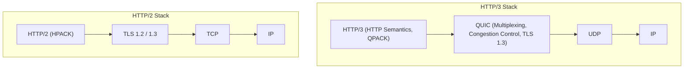
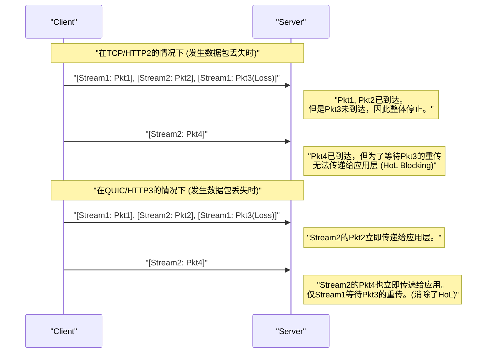
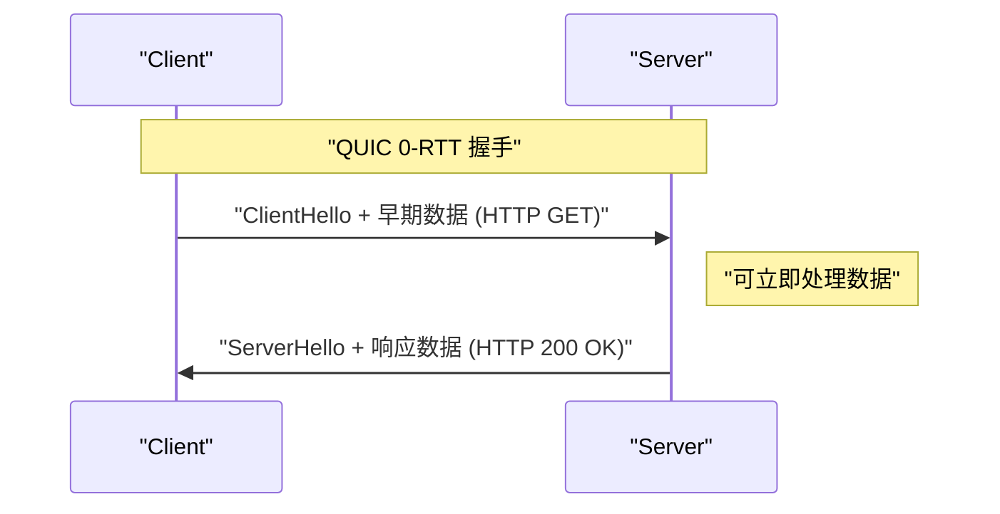

# 1. 引言：Web通信的进化与下一代的开端

互联网世界是由不断的技术革新所支撑的。在我们每天使用的Web网站和应用程序背后，运行着 **HTTP (Hypertext Transfer Protocol)** 协议。从20世纪90年代出现的HTTP/1.0开始，经历了长期使用的HTTP/1.1，再到大幅提升性能的HTTP/2，它一直在不断进化。

然而，现代Web充斥着丰富的应用内容（高清图像、视频流媒体、复杂的JavaScript应用），传统的协议栈开始显现出局限性。特别是长期支撑互联网传输层的 **TCP (Transmission Control Protocol)** 本身的规范，成为了Web进一步加速的绊脚石。

因此，**HTTP/3** 及其基础 **QUIC (Quick UDP Internet Connections)** 协议应运而生。HTTP/3采用了一种非常野心勃勃的方法，它抛弃了TCP，竟然在 **UDP (User Datagram Protocol)** 之上构建了一个新的可靠通信层。

本文将通过架构、算法、具体的代码示例以及图表，极其详细地解释为何需要HTTP/3和QUIC，以及如何用UDP克服TCP的哪些局限性。

---

# 2. HTTP的历史与TCP的局限性

为了理解HTTP/3的革新性，首先必须深入了解其前身HTTP/1.1和HTTP/2所面临的问题，即“TCP的局限性”。

## 2.1 从HTTP/1.1到HTTP/2的进化及遗留问题

在HTTP/1.1中，必须在一个TCP连接上按顺序处理一个请求和响应。为了解决这个问题，普及了建立多个TCP连接的变通方法，但建立TCP连接需要成本，并且存在每个浏览器并发连接数上限（通常为6个）的限制。

HTTP/2通过使用 **流（Stream）** 的 **多路复用 (Multiplexing)** 解决了这个问题。它在一个TCP连接中创建多个虚拟流，将请求和响应分割成细小的帧以便能够同时交换。


由此，HTTP层面的“排队等待（HTTP的队头阻塞，Head-of-Line Blocking）”得以消除。然而，根本问题隐藏在传输层，即TCP中。

## 2.2 TCP的队头阻塞 (Head-of-Line Blocking)

TCP是一个极其可靠的协议，负责“顺序保证”和“数据包丢失的重传”。当发送方发送数据包 `1, 2, 3, 4` 时，接收方必定按此顺序将其传递给应用层（HTTP/2）。

如果网络中途数据包 `2` 丢失（数据包丢失），即使接收方收到了数据包 `3` 和 `4`，在数据包 `2` 被重传并到达之前，也无法将后续的数据包传递给应用层。这被称为 **TCP层面的队头阻塞 (HoL Blocking)**。

由于HTTP/2让所有流共用一个TCP连接，因此哪怕只发生一次数据包丢失，就会面临 **所有流的通信暂时停止** 的致命弱点。在数据包丢失频繁的移动网络环境等情况下，HTTP/2的性能甚至可能会低于HTTP/1.1。

## 2.3 握手延迟 (RTT的累积)

TCP是面向连接的协议，在开始通信之前必须进行 **三次握手 (3-way handshake)**。此外，还需加上现代Web中必不可少的加密（TLS）握手。

在 TCP + TLS 1.2 的环境中，建立通信需要花费往返时间（RTT）数倍的时间。

*   **TCP握手:** $ 1 \text{ RTT} $
*   **TLS握手:** $ 2 \text{ RTT} $ (在TLS 1.2的情况下)

总共会消耗 $ 3 \text{ RTT} $ 的时间，这都是在发送第一个HTTP请求之前。鉴于光速的物理定律限制，不可能将RTT本身降为零（例如，日本和美国西海岸之间的通信RTT大约需要100毫秒）。因此，减少建立通信所需的RTT次数是提升性能的绝对条件。

## 2.4 缺乏IP移动性（连接断开）

TCP通过 **IP地址和端口号的4元组（源IP、源端口、目标IP、目标端口）** 来识别通信两端的端点。

在智能手机上从Wi-Fi切换到4G/5G网络时，设备的IP地址会发生变化。由于IP地址改变，TCP会将其视为不同的通信，从而断开现有的TCP连接。如果是视频流媒体播放或大文件下载中，就必须从零开始重新建立连接，极大地损害了用户体验（UX）。

---

# 3. QUIC的诞生：在UDP的画布上描绘新世界

为了打破这些TCP的局限性，Google开始开发，后来由IETF（互联网工程任务组）标准化的便是 **QUIC (Quick UDP Internet Connections)**。

QUIC最令人惊讶之处在于，它抛弃了长期作为互联网基础的TCP，转而采用 **UDP (User Datagram Protocol)** 作为基础。

## 3.1 为什么不改进TCP，而选择了UDP？

你可能会想：“如果TCP有问题，把TCP本身升级一下不就好了吗？”然而，在现实中这极其困难。

其最大的原因是 **中间设备（Middleboxes）的僵化 (Ossification)**。
互联网上的路由器、防火墙、NAT（网络地址转换）、负载均衡器等网络设备（中间设备），会深入解析TCP规范（如头部结构和标志位行为等），以执行优化或安全检查。

如果在TCP头部添加新标志位，或者创建新版本的TCP，世界上无数旧的中间设备就会将其作为“非法数据包”丢弃。这被称为 **协议僵化 (Protocol Ossification)**。

另一方面，UDP是一个非常简单的协议，只有目标端口、源端口和校验和等信息。中间设备也不会深入干涉UDP内部的内容。
因此，采取了这样一种策略：**“在UDP这个纯白的画布上，在用户空间（更靠近应用层的地方）重新实现TCP那样的可靠性控制和TLS的加密”**。这就是QUIC。

## 3.2 QUIC的协议栈

引入QUIC的HTTP/3协议栈如下所示。



QUIC将HTTP/2具有的多路复用（流）功能、TCP具有的拥塞控制和数据包丢失恢复功能，以及TLS 1.3的加密功能，整合到了单一的协议层中。

---

# 4. QUIC带来的革命性功能与解决方案

QUIC是如何解决前面提到的TCP局限性的呢？我们将详细探讨其核心的革命性技术。

## 4.1 传输层队头阻塞 (HoL Blocking) 的消除

QUIC放弃了类似TCP的“整个连接的顺序保证”，引入了 **“基于每个流的顺序保证”**。

QUIC中存在多个独立的流，每个数据包都包含自己属于哪个流的信息。如果某个数据包丢失，被迫等待的 **只有丢失的数据包所属的那个流**。属于其他流的数据包不会受到丢失的影响，而是直接传递给应用层（HTTP/3）。



这使得在容易发生数据包丢失的不稳定网络环境（如移动网络或拥挤的公共Wi-Fi）下的性能得到了飞跃性的提升。

## 4.2 连接建立的超高速化 (1-RTT 与 0-RTT)

QUIC的设计使得传输层的握手与加密（TLS 1.3）的握手能够 **同时** 进行。

在与首次通信的服务器之间，可以在 **1-RTT** 内完成连接建立和加密密钥交换，并立即开始发送数据。与 TCP+TLS1.2 的 $ 3 \text{ RTT} $ 相比，仅仅这一点也是巨大的进步。

此外，对于过去曾经通信过的服务器，QUIC提供了一种类似魔法般的功能，即 **0-RTT (Zero Round Trip Time)**。
客户端利用在之前通信中从服务器收到的会话票据 (Session Ticket) 和参数，在第一个握手数据包（ClientHello）中直接搭载HTTP请求数据（如GET请求等）一并发送。



这样一来，理论上的通信开始延迟将变为零。然而，0-RTT数据在安全性方面存在易受 **重放攻击 (Replay Attack)** 的风险。因此，允许通过0-RTT发送的仅限于像GET请求这样具有“幂等性（无论执行多少次结果都相同）”的安全请求。

## 4.3 连接迁移 (Connection Migration)

为了克服TCP在IP地址改变时会断开的弱点，QUIC不再通过IP地址和端口号管理连接，而是通过 **连接ID (Connection ID)** 这种唯一标识符来管理。

连接ID被以非加密的形式包含在QUIC数据包头部（以便可以进行路由）。

假设用户走出了Wi-Fi的信号范围切换到了4G/5G网络，智能手机的IP地址发生了变化。QUIC客户端将从新的IP地址发送数据包，但在该数据包中记载了现有的“连接ID”。
服务器虽然检测到IP地址已更改，但由于连接ID一致，便将其识别为“相同通信的延续”，在无需重新握手的情况下继续通信。

通过这一功能，实现了在移动环境下的无缝通信切换，大幅减少了视频缓冲停止和下载失败的情况。

---

# 5. HTTP/3：QUIC上的HTTP语义

QUIC协议本身并非HTTP专用，而是一个通用的传输协议。在这个QUIC之上运行HTTP语义（如方法、头部、状态码等）的规范就是 **HTTP/3**。

HTTP/3基本继承了HTTP/2的概念，但由于底层协议从TCP变为QUIC，因此加入了一些重要的修改。

## 5.1 通过QPACK进行头部压缩

在HTTP/2中，使用了名为 **HPACK** 的头部压缩算法。HPACK在通信的两端保持一个动态表（Dynamic Table），对于已经发送过的头部，仅通过发送索引号来减少通信量。

然而，HPACK完全依赖于TCP的“顺序保证”。也就是说，如果某个头部块丢失并等待重传，后续流的头部在依赖的动态表更新之前无法解密，存在由HPACK引起的队头阻塞（HoL Blocking）。

由于QUIC不对流之间进行顺序保证，如果直接使用HPACK，在流的到达顺序被打乱时，动态表的同步将会被破坏。

为了解决这个问题，重新设计了 **QPACK**。在QPACK中，引入了将动态表更新与各数据流分离，并通过专用控制流异步管理动态表的机制。这样一来，即使在QUIC的无序流传输下，也能够安全且高压缩地进行头部通信。

## 5.2 控制流与单向流

在HTTP/3中，除了用于请求/响应的双向流之外，还定义了几个特殊的 **单向流**。

1.  **控制流 (Control Stream):** 用于交换配置（SETTINGS帧）等信息的流。
2.  **QPACK编码器流 (QPACK Encoder Stream):** 用于更新QPACK动态表的流。
3.  **QPACK解码器流 (QPACK Decoder Stream):** 用于传达QPACK表更新确认或错误的流。

通过按角色分离流，这是一种为了防止数据竞争和不必要等待的优化。

---

# 6. 技术深度解析：QUIC的算法与数学公式

接下来，我们将在技术上深入一步，结合数学公式来探讨支撑QUIC的算法及其性能评估。

## 6.1 BBR (Bottleneck Bandwidth and Round-trip propagation time) 拥塞控制

因为QUIC是在用户空间中实现的，所以它具备无需等待OS内核更新便可自由且快速更新拥塞控制算法的优势。在很多情况下，Google开发的 **BBR** 被用作QUIC的拥塞控制。

传统的基于丢包的拥塞控制（如CUBIC TCP等），会不断扩大发送窗口直到发生数据包丢失。因此，存在容易引发缓冲区膨胀（Bufferbloat，网络设备的缓冲区被填满导致延迟增加的现象）的问题。

传统的TCP吞吐量（Mathis公式）可表示如下：

$ \text{吞吐量} \le \frac{\text{MSS}}{R \times \sqrt{p}} $

*   $ \text{MSS} $ : Maximum Segment Size (最大分段大小)
*   $ R $ : Round Trip Time (RTT) (往返时间)
*   $ p $ : 数据包丢失率

如该公式所示，基于丢包的TCP，只要数据包丢失率 $ p $ 稍有增加，吞吐量就会急剧下降。

相比之下，BBR不根据数据包丢失，而是通过直接测量 **带宽 (Bandwidth)** 和 **延迟 (RTT)** 来估算网络的极限。

BBR利用以下公式来模拟网络管道的容量：

$ \text{BDP (带宽延迟乘积)} = \text{BtlBw} \times \text{RTprop} $

*   $ \text{BtlBw} $ : Bottleneck Bandwidth (瓶颈带宽・过去的最高通信速度)
*   $ \text{RTprop} $ : Round-Trip propagation time (传播延迟・过去的最小RTT)

BBR会调整发送速度，使得正在发送（In-flight）的数据量与该BDP相匹配。这样一来，即便发生数据包丢失（例如：因无线干扰造成的丢失），也不会无谓地降低速度，并且不会让路由器的缓冲区溢出，从而兼顾了高吞吐量与低延迟。QUIC的用户空间实现与BBR的组合发挥出了最高的性能。

## 6.2 加密与安全性的整合

QUIC默认内含了 **TLS 1.3**，不存在未加密的“明文”QUIC连接。在TCP的情况下，由于TCP头部本身未加密，中间设备可以窥探或篡改TCP的标志位（如SYN, ACK, FIN等）（例如RST注入）。

在QUIC中，除了IP头部和UDP头部之外，QUIC头部的大部分内容（包括数据包号等）和有效载荷被完全加密。
甚至连数据包号都被加密，因此即使在路径上监视网络流量，也极难推测出哪个数据包是被重传的、当前的拥塞窗口有多大等元数据。从隐私保护的角度来看，这是非常强大的。

---

# 7. QUIC的实现与代码示例

为了更直观地理解如何从程序中操作QUIC，让我们来看一些代码示例。
这是一个使用Python异步QUIC实现库 `aioquic` 的简单HTTP/3服务器和客户端示例。

## 7.1 使用 Python (aioquic) 的 HTTP/3 服务器

```python
import asyncio
from aioquic.asyncio import serve
from aioquic.h3.connection import H3_ALPN, H3Connection
from aioquic.h3.events import DataReceived, HeadersReceived
from aioquic.quic.configuration import QuicConfiguration

class Http3ServerProtocol(asyncio.Protocol):
    def __init__(self):
        self.http = H3Connection(is_client=False)
        self.transport = None

    def connection_made(self, transport):
        self.transport = transport

    def datagram_received(self, data, addr):
        # 接收UDP数据报，并将其传递给QUIC协议栈
        self.http.receive_datagram(data, addr, now=asyncio.get_event_loop().time())
        self.process_http_events()

    def process_http_events(self):
        for event in self.http.next_event():
            if isinstance(event, HeadersReceived):
                print(f"Received headers: {event.headers}")
                # 构建简单的 200 OK 响应
                headers = [
                    (b":status", b"200"),
                    (b"server", b"aioquic"),
                    (b"content-type", b"text/html"),
                ]
                self.http.send_headers(event.stream_id, headers)
                self.http.send_data(event.stream_id, b"<h1>Hello HTTP/3 via QUIC!</h1>", end_stream=True)
                
        # 通过UDP发送响应
        for data, addr in self.http.datagrams_to_send(now=asyncio.get_event_loop().time()):
            self.transport.sendto(data, addr)

async def main():
    configuration = QuicConfiguration(is_client=False, alpn_protocols=H3_ALPN)
    # 需要加载证书
    configuration.load_cert_chain("cert.pem", "key.pem")
    
    # 在UDP的443端口监听
    await serve("0.0.0.0", 443, configuration=configuration, create_protocol=Http3ServerProtocol)
    print("HTTP/3 Server listening on UDP 443...")
    await asyncio.Future()  # 永久运行

if __name__ == "__main__":
    asyncio.run(main())
```

从这段代码可以看出，虽然底层完全是 **UDP通信 (datagram_received / sendto)**，但在其之上执行了高级的HTTP/3流控制和头部处理。

## 7.2 在 Nginx 中启用 HTTP/3

作为广泛使用的Web服务器，Nginx在1.25.0及更高版本中已默认支持HTTP/3和QUIC。
配置非常简单，只需在现有的TLS配置中添加几行即可。

```nginx
server {
    # 针对传统的 TCP (HTTP/1.1, HTTP/2)
    listen 443 ssl;
    listen [::]:443 ssl;
    
    # 针对新的 UDP (HTTP/3, QUIC)
    listen 443 quic reuseport;
    listen [::]:443 quic reuseport;

    server_name example.com;

    ssl_certificate     /path/to/cert.pem;
    ssl_certificate_key /path/to/key.pem;
    # QUIC必须使用TLS 1.3
    ssl_protocols       TLSv1.2 TLSv1.3;

    location / {
        root /var/www/html;
        # 告知客户端可使用HTTP/3 (Alt-Svc 头部)
        add_header Alt-Svc 'h3=":443"; ma=86400';
    }
}
```

这里重要的是 `Alt-Svc` 头部。由于历史原因，浏览器最初会尝试通过TCP（如HTTP/2）进行连接。如果响应中包含 `Alt-Svc: h3=":443"`，浏览器就会识别出“这个服务器也能在UDP端口443上使用HTTP/3通信！”，并将在随后的访问或后台尝试升级为基于QUIC的连接。

---

# 8. 部署与运维的挑战 (Challenges of Deployment)

尽管QUIC和HTTP/3是如梦幻般的技术，但在落实到实际运维中仍存在几座巨大的壁垒。

## 8.1 企业防火墙对 UDP 的拦截

自互联网黎明期以来，因为UDP经常被用于“DDoS攻击”或“可疑的[P2P](https://kenji.blog/zh-cn/p/webrtc-realtime-communication-p2p/)通信”，企业防火墙或网络管理员往往会 **除了端口53(DNS)和123(NTP)之外，一律拦截 (DROP)** UDP通信。

QUIC使用UDP端口443，但在仅仅因为是UDP就被拦截的环境中，无法建立HTTP/3通信。
在这种情况下，浏览器具有一种机制：等待几毫秒到几秒并检测到QUIC通信超时后，自动回退（Fallback）到TCP（HTTP/2）。然而，这种回退的等待时间本身就成为了恶化用户体验的延迟。

## 8.2 较高的 CPU 负载与缺乏硬件卸载 (Hardware Offload)

TCP已有数十年的历史，现代网卡（NIC）具有诸如 **TCP分段卸载 (TCP Segmentation Offload, TSO)** 的功能，由硬件（NIC芯片）代为承担TCP的数据包分割和校验和计算。这极大地降低了操作系统的CPU负载。

然而，QUIC在用户空间运行，并且所有数据包都分别施加了强力的加密（如AES-GCM或ChaCha20），因此在处理大量通信的服务器端，其 **CPU使用率相比 TCP+TLS 会非常高**。
目前，各硬件供应商和云服务提供商正急于开发UDP分段卸载 (USO) 等功能，但在硬件层面的完全支持普及之前，基础设施成本的增加仍是一个伴随的问题。

## 8.3 负载均衡的复杂化

传统的TCP流量负载均衡，通常使用简单的4元组（源IP·端口、目标IP·端口）的哈希值来分配给后端服务器。

然而，由于前面提到的 **“连接迁移”** 功能，客户端的IP地址或端口号会在通信中途发生变化。因此，如果使用基于IP的简单路由，数据包在通信中途会被分配到另一台后端服务器，导致连接被丢弃。

为了正确地对QUIC进行负载均衡，必须使用高级的四层/七层负载均衡器，读取数据包头部包含的“连接ID”，并基于此始终路由到同一台后端服务器。

---

# 9. QUIC的未来：WebTransport 与更广阔的应用领域

QUIC的真正价值不仅限于实现HTTP/3。作为一种“高性能且安全的基于UDP的通用传输协议”，QUIC也开始被作为除了HTTP之外各种协议的基础。

## 9.1 WebTransport：WebSocket的下一代标准

当前，Web浏览器与服务器之间的双向实时通信广泛使用的是 **WebSocket**。但由于WebSocket运行在TCP之上，仍无法摆脱队头阻塞（HoL Blocking）的问题。例如，游戏中的实时位置同步数据具有“只要稍有延迟的旧数据就丢弃，总是只需要最新数据”的性质，但TCP却死板地重传陈旧的延迟数据包，从而引起游戏卡顿。

基于QUIC的新API **WebTransport** 解决了这个问题。
在WebTransport中，浏览器中的JavaScript不仅可以直接处理保证可靠性的流通信，还可以处理即使允许丢包也要以最快速度发送数据的 **数据报通信 (Datagram)**。
这被期待将大幅推动基于浏览器的云游戏，以及超低延迟的实时视频流（作为[WebRTC](https://kenji.blog/zh-cn/p/webrtc-realtime-communication-p2p/)的替代）的进化。

## 9.2 各种协议的 "over QUIC" 化

充分利用QUIC的优秀特性，将现有协议迁移到QUIC之上的标准化工作正在进行中。

*   **DoQ (DNS over QUIC):** 兼顾隐私与速度的下一代DNS协议。比TCP上的DoT快，比UDP上的明文DNS更安全。
*   **SMB over QUIC:** 将Windows文件共享协议 (SMB) QUIC化，无需VPN即可在互联网上安全高速地访问文件服务器的技术（已在Windows Server 2022中实现）。
*   **SSH over QUIC:** 即便在移动网络下移动也不会断开连接，终极的SSH终端连接。

由此可见，QUIC作为“互联网通信新Layer 4标准”的地位正在确立。

---

# 10. 总结：从TCP时代迈向QUIC时代

本文深入探讨了HTTP/3和QUIC协议，从TCP的局限性到向UDP的范式转移、队头阻塞的解决、连接建立的加速，直至实现与运维的挑战。

*   **TCP的局限性:** 由于顺序保证引起的队头阻塞、握手延迟、以及对IP地址变更的[脆弱性](https://kenji.blog/zh-cn/p/web-application-vulnerability-owasp-top-10/)。
*   **QUIC的革新:** 基于UDP，在用户空间实现了流多路复用、TLS 1.3的整合以及通过连接ID的连接迁移。
*   **HTTP/3:** 针对QUIC特性进行优化的QPACK等新HTTP规范。

在过去近40年里，TCP是支撑互联网爆炸式增长的伟大协议。然而，在以毫秒为单位的性能直接关系到商业利益，人人都在移动环境中使用丰富的Web应用的现代，其架构的局限性已显而易见。

描绘在UDP这一纯白画布上的QUIC，从根本上打破了Web通信的瓶颈。虽然在防火墙设置、硬件优化等方面仍有需要克服的障碍，但Google、Facebook (Meta)、Cloudflare等庞大流量的绝大部分已经迁移到了HTTP/3。

我们每天开发的Web应用程序，即便未曾刻意关注，也将享受到QUIC带来的红利，变得更快、更健壮。塑造下一代Web的这一革命性协议的发展动向，今后也不容错过。

---

*参考资料：*
*   RFC 9000: QUIC: A UDP-Based Multiplexed and Secure Transport
*   RFC 9114: HTTP/3
*   RFC 9204: QPACK: Field Compression for HTTP/3
*   IETF QUIC Working Group 相关文档
