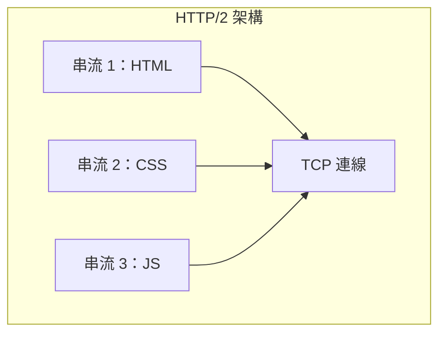
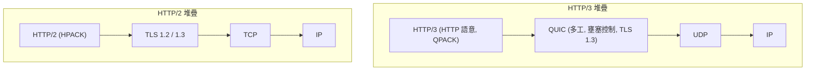
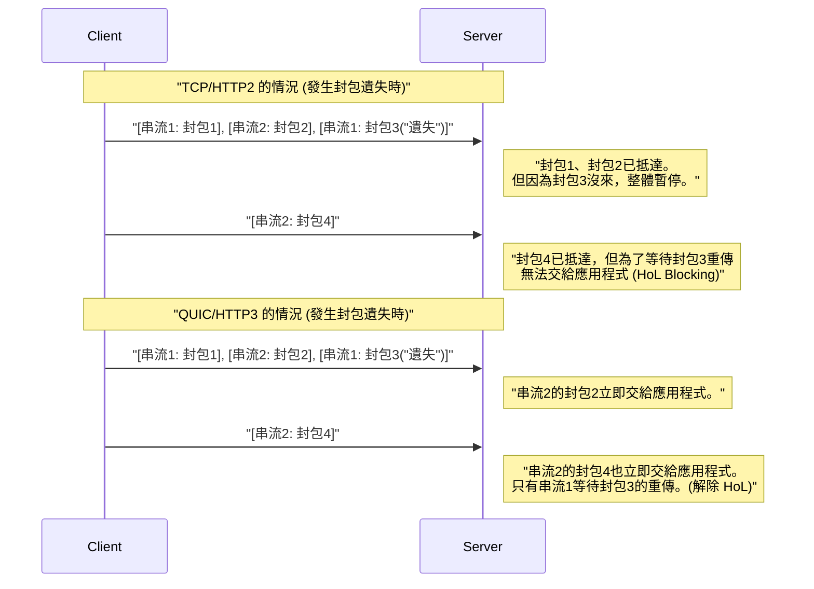
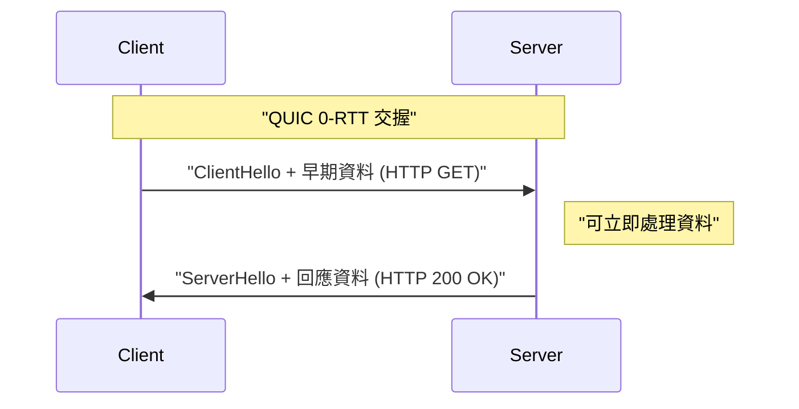

# 1. 前言：網頁通訊的進化與次世代的序幕

網際網路的世界是由不斷的技術革新所支撐。在我們每天使用的網站和應用程式的背後，運作著 **HTTP (Hypertext Transfer Protocol)** 協定。從 1990 年代出現的 HTTP/1.0 開始，到長久以來使用的 HTTP/1.1，以及大幅提升效能的 HTTP/2，它一直在持續進化。

然而，現代的網頁充滿了豐富的內容（高畫質圖片、影片串流、複雜的 JavaScript 應用程式），傳統的協定堆疊已開始顯露極限。特別是長期支撐網際網路傳輸層的 **TCP (Transmission Control Protocol)** 本身的規格，已經成為網頁進一步高速化的絆腳石。

因此，**HTTP/3** 及其基礎的 **QUIC (Quick UDP Internet Connections)** 協定應運而生。HTTP/3 拋棄了 TCP，竟然採取了在 **UDP (User Datagram Protocol)** 之上建構全新可靠通訊層的極具野心的方法。

本文將結合架構、演算法、具體程式碼範例以及圖表，極其詳細地解說為何需要 HTTP/3 與 QUIC，以及它們是如何透過 UDP 克服 TCP 的極限。

---

# 2. HTTP 的歷史與 TCP 的極限

為了理解 HTTP/3 的革新性，首先必須深入了解其前身 HTTP/1.1 和 HTTP/2 所面臨的課題，也就是「TCP 的極限」。

## 2.1 從 HTTP/1.1 到 HTTP/2 的進化與遺留的課題

在 HTTP/1.1 中，必須在一個 TCP 連線上依序處理一個請求和回應。為了解決這個問題，雖然普及了建立多個 TCP 連線的解決方案，但 TCP 連線的建立需要成本，且每個瀏覽器都有同時連線數上限（通常為 6 個）的限制。

HTTP/2 透過基於 **串流** 的 **多工 (Multiplexing)** 解決了這個問題。在一個 TCP 連線中建立多個虛擬串流，將請求和回應分割成細小的訊框並同時進行收發。



如此一來，HTTP 層級的「排隊等待（HTTP 的 Head-of-Line Blocking）」就被消除了。然而，根本的問題仍隱藏在傳輸層，也就是 TCP 之中。

## 2.2 TCP 的 Head-of-Line (HoL) Blocking

TCP 是一種執行「順序保證」與「封包遺失重傳」、可靠性極高的協定。當發送端傳送了封包 `1, 2, 3, 4` 時，接收端必定會按照該順序將資料交給應用層（HTTP/2）。

如果封包 `2` 在網路傳輸途中遺失（封包遺失），接收端即使已經收到封包 `3` 和 `4`，在封包 `2` 被重傳並送達之前，也無法將後續的封包交給應用層。這被稱為 **TCP 層級的 Head-of-Line Blocking (HoL Blocking)**。

由於 HTTP/2 將所有串流都承載在同一個 TCP 連線上，只要發生哪怕一個封包遺失，**所有串流的通訊就會暫停**，這是一個致命的弱點。在封包遺失頻繁的行動網路環境等情況下，HTTP/2 的效能甚至有時會低於 HTTP/1.1。

## 2.3 交握的延遲 (RTT 的累積)

TCP 是導向連線的協定，在開始通訊前必須進行 **三向交握**。此外，還要加上現代網頁中不可或缺的加密（TLS）交握。

在 TCP + TLS 1.2 的環境中，直到通訊建立完成，需要花費來回通訊延遲 (RTT) 數倍的時間。

*   **TCP 交握:** $ 1 \text{ RTT} $
*   **TLS 交握:** $ 2 \text{ RTT} $ (以 TLS 1.2 為例)

在發送第一個 HTTP 請求之前，總共會消耗 $ 3 \text{ RTT} $ 的時間。既然存在光速這種物理法則的極限，就不可能將 RTT 本身降為零（例如日本與美國西岸之間的通訊，RTT 大約需要 100ms）。因此，減少通訊建立所需的 RTT 次數，是提升效能的絕對條件。

## 2.4 IP 行動性的缺乏（連線中斷）

TCP 使用 **IP 位址和通訊埠號碼的四種組合（來源 IP、來源通訊埠、目的 IP、目的通訊埠）** 來識別通訊兩端的端點。

當智慧型手機從 Wi-Fi 切換到 4G/5G 網路時，裝置的 IP 位址會發生變化。一旦 IP 位址改變，TCP 就會將其視為不同的通訊，導致現有的 TCP 連線中斷。如果正在進行影片串流或大容量檔案的下載，就必須從零開始重新建立連線，這大幅損害了使用者體驗 (UX)。

---

# 3. QUIC 的誕生：在 UDP 的畫布上描繪新世界

為了突破這些 TCP 的極限，Google 開始開發，隨後由 IETF (Internet Engineering Task Force) 標準化的協定，就是 **QUIC (Quick UDP Internet Connections)**。

QUIC 最大的驚喜，在於它捨棄了長年作為網際網路基礎的 TCP，改採 **UDP (User Datagram Protocol)** 作為基礎。

## 3.1 為什麼不改良 TCP，而是選擇 UDP？

你可能會想：「如果 TCP 有問題，把 TCP 本身升級不就好了嗎？」然而，這在現實中是極度困難的。

其最大的原因是 **中介設備 (Middleboxes) 的僵化 (Ossification)**。
網際網路上的路由器、防火牆、NAT (Network Address Translation)、負載平衡器等網路設備（中介設備），會深入解析 TCP 的規格（標頭結構、旗標行為等），並執行最佳化或安全檢查。

如果我們在 TCP 的標頭中加入新的旗標，或是建立新版本的 TCP，世界上無數老舊的中介設備就會將其視為「無效封包」而丟棄。這被稱為 **協定的僵化 (Protocol Ossification)**。

另一方面，UDP 是一個非常簡單的協定，只包含目的通訊埠、來源通訊埠以及檢查碼等資訊。中介設備也不會對 UDP 的內容進行過度干涉。
因此，便採用了 **「在 UDP 這塊純白的畫布上，於使用者空間（靠近應用層的地方）重新實作所有如同 TCP 般的可靠性控制與 TLS 加密」** 的方法。這就是 QUIC。

## 3.2 QUIC 的協定堆疊

導入 QUIC 後的 HTTP/3 協定堆疊如下所示。



QUIC 將 HTTP/2 所具備的多工（串流）功能、TCP 所具備的壅塞控制與封包遺失復原功能，以及 TLS 1.3 的加密功能，全部整合到了單一層中。

---

# 4. QUIC 所帶來的創新功能與解決方案

QUIC 是如何解決前面提到的 TCP 極限呢？我們將詳細探討其核心的創新技術。

## 4.1 在傳輸層消除 HoL Blocking

QUIC 放棄了如同 TCP 般的「整體連線的順序保證」，引進了 **「基於串流的順序保證」**。

在 QUIC 內部存在多個獨立的串流，每個封包都帶有自己屬於哪個串流的資訊。如果某個封包遺失了，被迫等待的 **只有該遺失封包所屬的串流**。屬於其他串流的封包，能夠不受遺失影響，順利送達應用層（HTTP/3）。



如此一來，在容易發生封包遺失的不穩定網路環境（如行動網路或擁擠的公共 Wi-Fi 等）下，效能獲得了飛躍性的提升。

## 4.2 連線建立的超高速化 (1-RTT 與 0-RTT)

QUIC 的設計是 **同時** 進行傳輸層的交握與加密（TLS 1.3）的交握。

與首次通訊的伺服器之間，只需 **1-RTT** 即可完成連線建立與加密金鑰交換，並立即開始傳送資料。相較於 TCP+TLS1.2 的 $ 3 \text{ RTT} $，這已經是戲劇性的進步。

此外，對於過去曾經通訊過的伺服器，QUIC 提供了一項如魔法般的功能：**0-RTT (Zero Round Trip Time)**。
客戶端利用之前通訊時從伺服器取得的連線票證或參數，在第一個交握封包 (ClientHello) 中直接夾帶 HTTP 請求資料（如 GET 請求等）一併發送。



如此一來，理論上的通訊開始延遲就變成了零。然而，0-RTT 資料存在著容易受到 **重放攻擊 (Replay Attack)** 的安全風險。因此，允許使用 0-RTT 發送的，僅限於具備「冪等性（無論執行幾次結果都一樣）」的安全請求，例如 GET 請求。

## 4.3 連線轉移 (Connection Migration)

為了解決 TCP 在 IP 位址改變時會斷線的弱點，QUIC 使用 **連線 ID (Connection ID)** 這種唯一識別碼來管理連線，而不是透過 IP 位址和通訊埠號碼。

連線 ID 會以未加密的形式（為了能夠進行路由）包含在 QUIC 封包的標頭中。

假設使用者離開了 Wi-Fi 的訊號範圍切換到 4G/5G 網路，導致智慧型手機的 IP 位址發生改變。QUIC 客戶端會從新的 IP 位址發送封包，但該封包中記載著既有的「連線 ID」。
伺服器雖然偵測到 IP 位址已變更，但因為連線 ID 相符，會將其視為「相同通訊的延續」，並在不重新交握的情況下繼續通訊。

這項功能實現了在行動環境下無縫的通訊切換，並大幅減少了影片緩衝中斷或下載失敗的情況。

---

# 5. HTTP/3：QUIC 上的 HTTP 語意

QUIC 協定本身並非 HTTP 專用，而是一個通用的傳輸協定。在 QUIC 之上運行 HTTP 語意（方法、標頭、狀態碼等）的規格，即是 **HTTP/3**。

HTTP/3 基本上繼承了 HTTP/2 的概念，但因為底層從 TCP 換成了 QUIC，所以進行了幾項重要的修改。

## 5.1 透過 QPACK 進行標頭壓縮

HTTP/2 使用名為 **HPACK** 的標頭壓縮演算法。HPACK 在通訊的兩端維護動態表 (Dynamic Table)，發送過一次的標頭後續只傳送索引編號，藉此減少通訊量。

然而，HPACK 完全依賴 TCP 的「順序保證」。換句話說，如果某個標頭區塊遺失而處於等待重傳的狀態，後續串流的標頭在它所依賴的動態表更新之前將無法解密，這就是因 HPACK 造成的 HoL Blocking。

由於 QUIC 不保證串流之間的順序，如果直接使用 HPACK，當串流抵達順序顛倒時，動態表的同步就會損壞。

為了解決這個問題，新設計的演算法名為 **QPACK**。在 QPACK 中，動態表的更新與各個資料串流分離，並引入了使用專用控制串流來非同步管理表格的機制。如此一來，即使在 QUIC 無序的串流傳輸下，也能進行安全且高壓縮率的標頭通訊。

## 5.2 控制串流與單向串流

在 HTTP/3 中，除了用於請求和回應的雙向串流之外，還定義了幾種特殊的 **單向串流**。

1.  **控制串流:** 用於交換設定（SETTINGS 訊框）等的串流。
2.  **QPACK 編碼器串流:** 用於更新 QPACK 動態表的串流。
3.  **QPACK 解碼器串流:** 用於確認 QPACK 表格更新或傳達錯誤的串流。

這些透過根據角色劃分串流，是為了防止資料競爭或不必要的等待而進行的最佳化。

---

# 6. 技術深究：QUIC 的演算法與公式

從這裡開始，我們將稍微深入技術層面，結合數學公式來探討支撐 QUIC 的演算法及效能評估。

## 6.1 BBR (Bottleneck Bandwidth and Round-trip propagation time) 壅塞控制

由於 QUIC 實作在使用者空間中，因此具備可以自由且迅速地更新壅塞控制演算法，而無須等待 OS 核心更新的優勢。在許多情況下，Google 開發的 **BBR** 會被採用作為 QUIC 的壅塞控制。

傳統基於封包遺失的壅塞控制（如 CUBIC TCP）會不斷擴大發送視窗，直到發生封包遺失為止。因此，容易引發緩衝區膨脹（網路設備的緩衝區塞滿導致延遲增加的現象）的問題。

傳統的 TCP 吞吐量 (Mathis 公式) 可表示如下：

$ \text{吞吐量} \le \frac{\text{MSS}}{R \times \sqrt{p}} $

*   $ \text{MSS} $ : 最大區段大小 (Maximum Segment Size)
*   $ R $ : 來回通訊延遲 (Round Trip Time, RTT)
*   $ p $ : 封包遺失率

如公式所示，基於遺失的 TCP，只要封包遺失率 $ p $ 稍微增加，吞吐量就會急劇下降。

相對於此，BBR 不是測量封包遺失，而是直接測量 **頻寬 (Bandwidth)** 和 **延遲 (RTT)** 來估算網路的極限。

BBR 用以下公式來對網路管道的容量建立模型：

$ \text{BDP (頻寬延遲乘積)} = \text{BtlBw} \times \text{RTprop} $

*   $ \text{BtlBw} $ : 瓶頸頻寬 (Bottleneck Bandwidth・過去的最大通訊速度)
*   $ \text{RTprop} $ : 傳遞延遲 (Round-Trip propagation time・過去的最小 RTT)

BBR 會調整發送速度，使得傳輸中 (In-flight) 的資料量與這個 BDP 一致。如此一來，即使發生封包遺失（例如：無線干擾造成的遺失）也不會白白降低速度，而且不會讓路由器的緩衝區溢滿，從而兼顧高吞吐量與低延遲。QUIC 的使用者空間實作與 BBR 的組合，能發揮最頂尖的效能。

## 6.2 加密與安全性的整合

QUIC 預設內含 **TLS 1.3**，不存在未加密的「純文字」QUIC 連線。在 TCP 的情況下，因為 TCP 標頭本身沒有加密，所以中介設備能夠窺視 TCP 的旗標（SYN、ACK、FIN 等），或是進行竄改（如 RST 注入等）。

在 QUIC 中，除了 IP 標頭和 UDP 標頭外，QUIC 標頭的大部分（包含封包編號等）與有效負載完全加密。
由於連封包編號都受到加密，即使在傳輸路徑上監控網路流量，也很難推測出哪個封包是被重傳的、目前的壅塞視窗大小是多少等詮釋資料。這在保護隱私方面非常強大。

---

# 7. QUIC 的實作與程式碼範例

為了掌握在程式中如何處理 QUIC 的具體概念，讓我們來看看程式碼範例。
這是一個使用 Python 的 `aioquic` 非同步 QUIC 實作函式庫，所撰寫的簡單 HTTP/3 伺服器與客戶端範例。

## 7.1 使用 Python (aioquic) 建立的 HTTP/3 伺服器

```python
import asyncio
from aioquic.asyncio import serve
from aioquic.h3.connection import H3_ALPN, H3Connection
from aioquic.h3.events import DataReceived, HeadersReceived
from aioquic.quic.configuration import QuicConfiguration

class Http3ServerProtocol(asyncio.Protocol):
    def __init__(self):
        self.http = H3Connection(is_client=False)
        self.transport = None

    def connection_made(self, transport):
        self.transport = transport

    def datagram_received(self, data, addr):
        # 接收 UDP 封包，並將其傳遞給 QUIC 協定堆疊
        self.http.receive_datagram(data, addr, now=asyncio.get_event_loop().time())
        self.process_http_events()

    def process_http_events(self):
        for event in self.http.next_event():
            if isinstance(event, HeadersReceived):
                print(f"收到標頭: {event.headers}")
                # 建立簡單的 200 OK 回應
                headers = [
                    (b":status", b"200"),
                    (b"server", b"aioquic"),
                    (b"content-type", b"text/html"),
                ]
                self.http.send_headers(event.stream_id, headers)
                self.http.send_data(event.stream_id, b"<h1>Hello HTTP/3 via QUIC!</h1>", end_stream=True)
                
        # 透過 UDP 發送回應
        for data, addr in self.http.datagrams_to_send(now=asyncio.get_event_loop().time()):
            self.transport.sendto(data, addr)

async def main():
    configuration = QuicConfiguration(is_client=False, alpn_protocols=H3_ALPN)
    # 必須載入憑證
    configuration.load_cert_chain("cert.pem", "key.pem")
    
    # 在 UDP 埠 443 上監聽
    await serve("0.0.0.0", 443, configuration=configuration, create_protocol=Http3ServerProtocol)
    print("HTTP/3 伺服器正在監聽 UDP 443 埠...")
    await asyncio.Future()  # 永遠執行

if __name__ == "__main__":
    asyncio.run(main())
```

從這段程式碼可以看出，底層完全是 **UDP 通訊 (datagram_received / sendto)**，但在這之上執行了高度的 HTTP/3 串流控制與標頭處理。

## 7.2 在 Nginx 中啟用 HTTP/3

被廣泛使用作為網頁伺服器的 Nginx，也在 1.25.0 以後的版本中預設支援了 HTTP/3 與 QUIC。
設定非常簡單，只需在現有的 TLS 設定中加上幾行即可。

```nginx
server {
    # 傳統的 TCP (HTTP/1.1, HTTP/2) 用
    listen 443 ssl;
    listen [::]:443 ssl;
    
    # 新的 UDP (HTTP/3, QUIC) 用
    listen 443 quic reuseport;
    listen [::]:443 quic reuseport;

    server_name example.com;

    ssl_certificate     /path/to/cert.pem;
    ssl_certificate_key /path/to/key.pem;
    # QUIC 必須使用 TLS 1.3
    ssl_protocols       TLSv1.2 TLSv1.3;

    location / {
        root /var/www/html;
        # 告知客戶端可以使用 HTTP/3 (Alt-Svc 標頭)
        add_header Alt-Svc 'h3=":443"; ma=86400';
    }
}
```

這裡重要的是 `Alt-Svc` 標頭。基於歷史原因，瀏覽器最初會嘗試以 TCP（如 HTTP/2）進行連線。如果回應中包含 `Alt-Svc: h3=":443"`，它就會意識到「這台伺服器也可以在 UDP 埠 443 使用 HTTP/3 溝通！」，並會在下次存取或在背景嘗試將連線升級為 QUIC。

---

# 8. 移轉與營運的課題 (Challenges of Deployment)

雖然 QUIC 與 HTTP/3 是如夢似幻的技術，但在落實於實際營運時，仍存在著幾道巨大的障礙。

## 8.1 企業防火牆對 UDP 的封鎖

自網際網路黎明期以來，因為 UDP 常被用於「DDoS 攻擊」或「可疑的 [P2P](https://kenji.blog/zh-tw/p/webrtc-realtime-communication-p2p/) 通訊」，企業防火牆或網路管理員 **除了 53 埠 (DNS) 或 123 埠 (NTP) 以外，將其一律阻擋 (DROP)** 的情況並不少見。

QUIC 使用 UDP 埠 443，但在因為是 UDP 就被封鎖的環境中，是無法建立 HTTP/3 通訊的。
在這種情況下，瀏覽器會具備在等待幾毫秒到幾秒後，若偵測到 QUIC 通訊逾時，便會自動降級到 TCP (HTTP/2) 的機制。然而，這個降級的等待時間本身就成了使使用者體驗惡化的延遲。

## 8.2 高 CPU 負載與缺乏硬體卸載

TCP 擁有數十年的歷史，現代的網路卡 (NIC) 具備如 **TCP 區段卸載 (TCP Segmentation Offload, TSO)** 等功能，由硬體（NIC 晶片）代勞 TCP 的封包分割或檢查碼計算。這大幅降低了 OS 的 CPU 負載。

然而，QUIC 運作在使用者空間，而且所有的封包都會各自被施以強大的加密（AES-GCM 或 ChaCha20），因此在處理大量通訊的伺服器端，**CPU 使用率會比 TCP+TLS 高出非常多**。
目前，各家硬體供應商與雲端供應商都在加緊開發如 UDP 區段卸載 (USO) 等功能，但在硬體層級的完全支援普及之前，基礎架構成本增加的課題將會如影隨形。

## 8.3 負載平衡的複雜化

TCP 流量的負載平衡，通常是使用單純的 4 元組（來源 IP/埠、目的 IP/埠）雜湊值來將流量分配到後端伺服器。

但是，由於前述的 **「連線轉移」** 功能，QUIC 客戶端的 IP 位址或通訊埠號碼可能會在途中發生改變。因此，若是採用單純基於 IP 的路由，封包會在通訊中途被分配到其他的後端伺服器，導致連線被丟棄。

為了正確地對 QUIC 進行負載平衡，必須讀取封包標頭中包含的「連線 ID」，並具備高階的 Layer 4 / Layer 7 負載平衡器，以基於此 ID 將流量始終路由到相同的後端伺服器。

---

# 9. QUIC 的未來：WebTransport 與擴展的應用領域

QUIC 真正的價值，不僅止於實現 HTTP/3。「作為高效能且安全的 UDP 基礎通用傳輸協定」，QUIC 也開始被採用作為 HTTP 以外各種協定的基礎。

## 9.1 WebTransport：WebSocket 的次世代標準

目前，在網頁瀏覽器與伺服器之間的雙向即時通訊，廣泛使用的是 **WebSocket**。然而，由於 WebSocket 運行在 TCP 之上，因此也無法逃避 HoL Blocking 的問題。舉例來說，像是遊戲的即時位置同步這類資料，具備「稍微延遲的舊資料就丟棄，永遠只要最新資料」的特性，但 TCP 卻會盡責地重傳那些舊的延遲封包，從而引發遊戲的卡頓。

為了解決這個問題，以 QUIC 為基礎的新 API **WebTransport** 應運而生。
在 WebTransport 中，不僅有保證可靠性的串流通訊，也可以從瀏覽器的 JavaScript 直接操作為了以最快速度傳送資料而允許封包遺失的 **資料報 (Datagram) 通訊**。
這有望讓基於瀏覽器的雲端遊戲，以及超低延遲的直播串流（[WebRTC](https://kenji.blog/zh-tw/p/webrtc-realtime-communication-p2p/) 的替代方案）獲得大幅進化。

## 9.2 各種協定的 "over QUIC" 化

善用 QUIC 優異的特性，將現有協定移植到 QUIC 上的標準化工作正在進行中。

*   **DoQ (DNS over QUIC):** 兼顧隱私與速度的次世代 DNS 協定。比 TCP 上的 DoT 更快，比 UDP 上的純文字 DNS 更安全。
*   **SMB over QUIC:** 將 Windows 的檔案共用協定 (SMB) QUIC 化，無須 VPN 即可透過網際網路安全且高速地存取檔案伺服器的技術（已在 Windows Server 2022 中實作）。
*   **SSH over QUIC:** 即使在行動網路中移動也不會斷線，極致的 SSH 終端連線。

像這樣，QUIC 正在逐步確立其作為「網際網路通訊新 Layer 4 標準」的地位。

---

# 10. 總結：從 TCP 時代走向 QUIC 時代

在本文中，我們深入探討了解說 HTTP/3 與 QUIC 協定，從 TCP 的極限到轉向 UDP 的典範轉移、HoL Blocking 的解決、連線建立的高速化，甚至實作與營運上的課題。

*   **TCP 的極限:** 順序保證所造成的 HoL Blocking、交握延遲、對 IP 位址變更的[脆弱性](https://kenji.blog/zh-tw/p/web-application-vulnerability-owasp-top-10/)。
*   **QUIC 的創新:** 以 UDP 為基礎，在使用者空間實現串流多工、整合 TLS 1.3，以及透過連線 ID 進行轉移。
*   **HTTP/3:** 針對 QUIC 特性進行最佳化，如 QPACK 等新的 HTTP 規格。

在過去近 40 年間，TCP 是一項支撐了網際網路爆炸性成長的偉大協定。然而，在效能以毫秒計且直接影響業務、人人都透過行動環境使用豐富網頁應用的現代，其架構的極限已顯而易見。

描繪在 UDP 這塊純白畫布上的 QUIC，從根本上打破了網頁通訊的瓶頸。雖然仍有防火牆設定或硬體最佳化等許多障礙需要克服，但 Google、Facebook (Meta)、Cloudflare 等巨大流量的大部分，已經轉移至 HTTP/3。

我們每天開發的網頁應用程式，即使不刻意意識，也能享受這項 QUIC 的恩惠，變得更快速、更穩固。塑造次世代網頁的這項創新協定的動向，今後也將持續備受矚目。

---

*參考資料：*
*   RFC 9000: QUIC: A UDP-Based Multiplexed and Secure Transport
*   RFC 9114: HTTP/3
*   RFC 9204: QPACK: Field Compression for HTTP/3
*   IETF QUIC Working Group 相關文件
