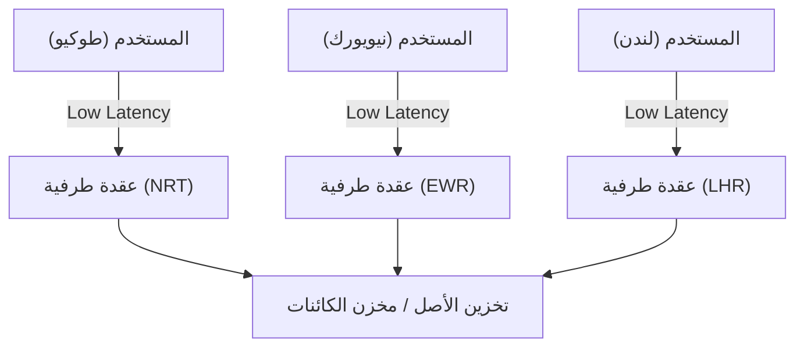
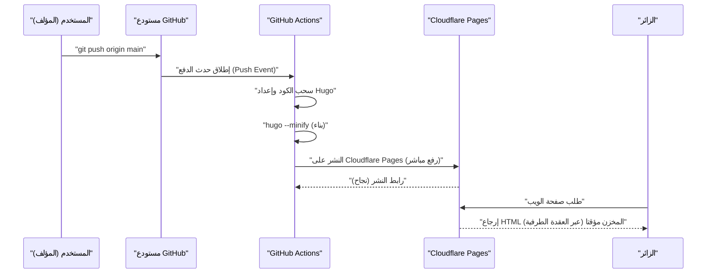
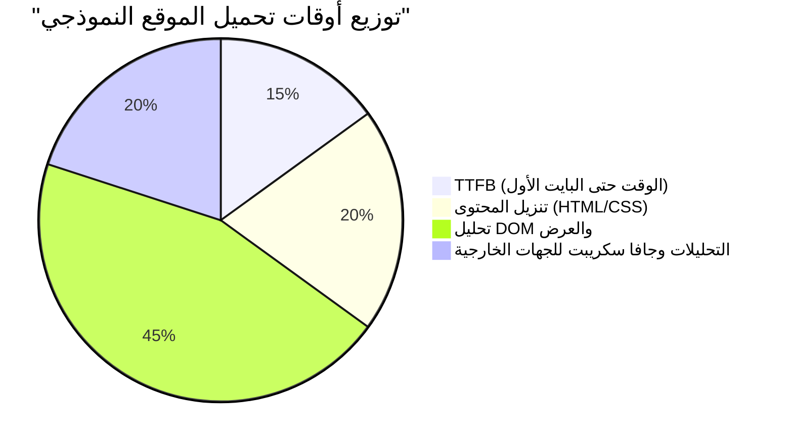

عند إدارة موقع ويب أو مدونة، تعتبر سرعة العرض (الأداء)، تكاليف التشغيل، والأمان عوامل في غاية الأهمية. في الماضي، كان المزيج بين أنظمة إدارة المحتوى الديناميكية (CMS) مثل WordPress وخوادم الاستضافة المشتركة هو السائد، أما اليوم فإن المعمارية المعروفة باسم "Jamstack" تحظى باهتمام كبير. من بين هذه التقنيات، بدمج "Hugo" وهو مولد مواقع ثابتة (SSG) فائق السرعة مبني بلغة Go، مع خدمات استضافة حديثة مثل Cloudflare Pages و GitHub Pages، يمكنك بناء بيئة تدوين **مجانية بالكامل وفائقة السرعة**.

في هذا المقال، سنشرح بتعمق من منظور تقني الخطوات العملية لنشر موقع ثابت مبني بـ Hugo على Cloudflare Pages و GitHub Pages، والفرق في المعمارية بين كل منصة، وبناء CI/CD (التكامل المستمر/التسليم المستمر) باستخدام GitHub Actions، وتحسين DNS، واستراتيجيات التخزين المؤقت (Cache)، ووصولاً إلى دمج أدوات تحليل الزيارات التي تراعي الخصوصية.

---

## 1. أساسيات مولدات المواقع الثابتة (SSG) ومعمارية Jamstack

### 1.1 لماذا المواقع الثابتة؟
أنظمة إدارة المحتوى الديناميكية التقليدية (مثل: WordPress) تقوم بإرسال استعلام إلى قاعدة البيانات (مثل MySQL) عند كل طلب من المستخدم، وتقوم بإنشاء HTML ديناميكيًا على جانب الخادم (مثل PHP) ثم إعادته. على الرغم من أن هذا الأسلوب يتميز بمرونة عالية، إلا أن مقاومته للزيادات المفاجئة في حركة المرور (ما يسمى بالانتشار الواسع أو هجمات DDoS) ضعيفة، وغالبًا ما تصبح بنية النظام معقدة بسبب الحاجة إلى وضع خوادم تخزين مؤقت (مثل Redis أو Varnish) في المقدمة.

من ناحية أخرى، في مولدات المواقع الثابتة (SSG) التي تعتمد معمارية Jamstack (وهي اختصار لـ JavaScript و APIs و Markup)، يتم إنشاء جميع ملفات HTML و CSS و JavaScript مسبقًا (أثناء عملية البناء). عند استلام طلب المستخدم، يقوم خادم الويب (أو CDN) ببساطة بإرجاع الملفات الثابتة التي تم إنشاؤها مسبقًا كما هي، مما يوفر سرعة فائقة وأمانًا قويًا.

### 1.2 أفضلية Hugo
هناك العديد من الخيارات المتاحة لـ SSG مثل Next.js و Gatsby و Jekyll و Astro، ولكن الميزة الأكبر لـ Hugo هي **سرعة البناء**. بفضل المعالجة المتزامنة في لغة Go، تكتمل عملية البناء في بضع ثوانٍ فقط حتى لموقع يحتوي على آلاف أو عشرات الآلاف من الصفحات. هذا يقلل بشكل كبير من أوقات الانتظار في مسار CI/CD، مما يؤدي بشكل مباشر إلى تحسين تجربة المطور (DX: Developer Experience).

---

## 2. مقارنة معمارية خدمات الاستضافة

التحدي التالي هو تحديد المكان الذي سيتم فيه استضافة الملفات الثابتة التي تم إنشاؤها بواسطة Hugo. تشمل الخيارات البارزة Cloudflare Pages و GitHub Pages و Netlify، ولكن بنية الشبكة التي تعمل خلف الكواليس تختلف في كل منها.

### 2.1 شبكات توصيل المحتوى (CDN) والحوسبة الطرفية (Edge Computing)
تستخدم جميع هذه المنصات شبكة توصيل محتوى (CDN) موزعة عالميًا لتوصيل المحتوى. ومع ذلك، لا يقتصر الأمر على مجرد التخزين المؤقت للملفات الثابتة، بل إن العامل الفارق هو القدرة على استخدام "الحوسبة الطرفية" لتوجيه الطلبات وإعادة كتابة الترويسات (Headers) في أقرب نقطة تواجد (PoP) للمستخدم.



### 2.2 GitHub Pages
GitHub Pages هي خدمة تتيح لك نشر ملفات HTML و CSS و JavaScript مباشرة من مستودع GitHub. يتم استخدام شبكات CDN مثل Fastly في الخلفية، مما يوفر أداءً ممتازًا. ومع ذلك، هناك قيود على تخصيص الترويسات (مثل إعدادات `Cache-Control` وترويسات الأمان)، وتعتمد إعدادات إعادة التوجيه على meta refresh في HTML أو إضافات Jekyll، مما يجعل وظائفها كبنية تحتية بحتة متواضعة إلى حد ما.

### 2.3 Cloudflare Pages
Cloudflare Pages هي خدمة استضافة مواقع ثابتة مبنية على أكبر شبكة Anycast في العالم تفخر بها Cloudflare (منتشرة في أكثر من 275 مدينة).
توفر دعمًا قياسيًا لـ HTTP/3 (QUIC)، وتحسين الصور، وتكامل الوظائف الطرفية (Cloudflare Workers)، مما يتيح ضبط أداء استثنائي. بالإضافة إلى ذلك، لا توجد رسوم على عرض النطاق الترددي (Bandwidth)، وهي ميزة كبيرة حيث يمكنك تشغيلها مجانًا مهما زادت حركة المرور بشكل مفاجئ.

### 2.4 Netlify
تعتبر Netlify رائدة في معمارية Jamstack، حيث توفر تجربة مطور (DX) متكاملة تجمع بين النماذج، المصادقة (Identity)، والوظائف بدون خادم (Serverless Functions). ولكن إذا تجاوزت حد عرض النطاق الترددي المجاني (100 جيجابايت شهريًا)، ستتحمل رسوم استهلاك باهظة، لذلك يجب الانتباه إلى إدارة التكاليف في المدونات التي تستخدم الصور ومقاطع الفيديو بكثرة.

---

## 3. الحساب النظري للأداء وزمن الانتقال (النموذج الرياضي باستخدام LaTeX)

عند تقييم أداء الويب، يعد تقليل زمن الانتقال (Latency) أهم مؤشر. دعونا نضع نموذجًا لمدى تقليل زمن الانتقال عند استخدام شبكة توصيل المحتوى CDN (الطرفية) مقارنة بالوصول المباشر إلى خادم الأصل (Origin Server).

نفترض أن احتمالية نجاح طلب المستخدم في العثور على ما يطلبه في التخزين المؤقت هي "نسبة إصابة التخزين المؤقت (Cache Hit Ratio)" ونرمز لها بـ $C$. حيث $0 \le C \le 1$.
ونرمز لزمن الانتقال إلى خادم الأصل بـ $L_{origin}$، وزمن الانتقال إلى أقرب عقدة طرفية بـ $L_{edge}$.

يتم حساب متوسط زمن الانتقال الجديد $L_{new}$ كقيمة متوقعة على النحو التالي:

$$ L_{new} = C \times L_{edge} + (1 - C) \times (L_{edge} + L_{origin}) $$

عند تبسيط هذه المعادلة تصبح كالتالي:

$$ L_{new} = L_{edge} + (1 - C) \times L_{origin} $$

على سبيل المثال، عندما يصل مستخدم في طوكيو إلى خادم أصل يقع على الساحل الشرقي للولايات المتحدة (نيويورك)، فإن $L_{origin}$ سيكون حوالي 200 مللي ثانية، مع الأخذ في الاعتبار المسافة المادية للألياف الضوئية وتأخير المعالجة في الموجهات (Routers). من ناحية أخرى، عند استخدام شبكة CDN مثل Cloudflare، يمكن الاتصال بالعقدة الطرفية في طوكيو، مما يقلل $L_{edge}$ إلى حوالي 10 مللي ثانية.

بافتراض أن نسبة إصابة التخزين المؤقت $C = 0.95$ (95%)،

$$ L_{new} = 10 + (1 - 0.95) \times 200 = 10 + 0.05 \times 200 = 10 + 10 = 20 \text{ ms} $$

بهذه الطريقة، من خلال اعتماد CDN، يصبح من الممكن تقليل متوسط زمن الانتقال بشكل كبير (حوالي 90٪) من 210 مللي ثانية إلى 20 مللي ثانية.

---

## 4. بناء مسار CI/CD باستخدام GitHub Actions

من أجل أتمتة عملية تحديث مدونة Hugo، سنقوم ببناء مسار CI/CD باستخدام GitHub Actions. بفضل هذا، بمجرد كتابة مقالات بصيغة Markdown محليًا وتنفيذ أمر `git push`، ستبدأ عملية البناء تلقائيًا وسيتم نشر الموقع على Cloudflare Pages أو GitHub Pages.

يوضح المخطط التسلسلي (Sequence Diagram) التالي التدفق الكامل منذ عملية الدفع (Push) للمقال وحتى تسليمه للمستخدم.



### 4.1 إعدادات النشر على Cloudflare Pages (الرفع المباشر - Direct Upload)

في Cloudflare Pages، توجد طريقتان: ربط مستودع GitHub وبناء الموقع على بنية Cloudflare التحتية، أو طريقة "الرفع المباشر (Direct Upload)" للملفات الثابتة التي تم بناؤها بواسطة GitHub Actions. إذا كنت ترغب في إدارة إصدارات Hugo بشكل أكثر صرامة وربطه بمهام أخرى (مثل الاختبار وتحسين الصور)، يُوصى بالبناء على GitHub Actions واستخدام الرفع المباشر.

فيما يلي مثال عملي لملف `.github/workflows/deploy.yml` للنشر على Cloudflare Pages.

```yaml
name: "Deploy Hugo site to Cloudflare Pages"

on:
  push:
    branches:
      - "main"
  workflow_dispatch:

jobs:
  build-and-deploy:
    runs-on: "ubuntu-latest"
    steps:
      - name: "Checkout repository"
        uses: "actions/checkout@v4"
        with:
          submodules: "recursive"
          fetch-depth: 0

      - name: "Setup Hugo"
        uses: "peaceiris/actions-hugo@v3"
        with:
          hugo-version: "0.125.0"
          extended: true

      - name: "Build Hugo Site"
        run: "hugo --minify --gc"
        env:
          HUGO_ENVIRONMENT: "production"

      - name: "Deploy to Cloudflare Pages"
        uses: "cloudflare/pages-action@v1"
        with:
          apiToken: ${{ secrets.CLOUDFLARE_API_TOKEN }}
          accountId: ${{ secrets.CLOUDFLARE_ACCOUNT_ID }}
          projectName: "your-project-name"
          directory: "public"
          gitHubToken: ${{ secrets.GITHUB_TOKEN }}
          branch: "main"
```

في مسار العمل هذا، يقوم خيار `--minify` بتصغير ملفات HTML/CSS/JS، ويقوم `--gc` بحذف الملفات غير الضرورية. وتعتبر هذه أساسيات تحسين الأداء.

---

## 5. التعمق في إعدادات DNS: النطاق المخصص وسجلات CNAME / ALIAS

عند استخدام نطاق خاص (مثل: `kenji.blog`)، يكون الإعداد الصحيح لـ DNS (نظام أسماء النطاقات) أمرًا حيويًا.

### 5.1 قيود سجل CNAME ونطاق الجذر (Zone Apex)
عادةً، عند توجيه نطاق فرعي (مثل: `www.kenji.blog`) إلى خدمة خارجية، يتم استخدام سجل `CNAME`. ومع ذلك، وبسبب مواصفات DNS (حسب RFC 1034)، لا يمكن إعداد سجل `CNAME` للنطاق الجذر (المعروف أيضًا باسم Zone Apex أو النطاق المجرد، مثل: `kenji.blog`). والسبب في ذلك هو أن النطاق الجذر يجب أن يحتوي دائمًا على سجلات SOA (Start of Authority) وسجلات NS (Name Server) وسجلات MX (Mail Exchange)، وتوجد قاعدة تنص على أن سجل CNAME لا يمكن أن يتواجد مع سجلات الموارد الأخرى.

### 5.2 الحلول: ALIAS / ANAME / CNAME Flattening
لحل هذه المشكلة، توفر شركات تقديم خدمات DNS الحديثة إضافات خاصة بها.

- **سجلات ALIAS / ANAME**: تقوم بتحليل الاسم ديناميكيًا على جانب خادم DNS وإرجاع سجل A النهائي (عنوان IP) إلى العميل. تدعم خدمات مثل Amazon Route 53 هذه الميزة.
- **CNAME Flattening**: هي ميزة تقدمها Cloudflare. فهي تتصرف كما لو تم إعداد سجل CNAME على النطاق الجذر (Zone Apex)، بينما يقوم خادم DNS المعتمد من Cloudflare بإرجاع عناوين IP التي تم حلها تلقائيًا (سجلات A وسجلات AAAA) إلى العميل بشفافية.

عند استخدام Cloudflare Pages، فإن تفويض خوادم الأسماء (Name Servers) الخاصة بالنطاق إلى Cloudflare واستغلال تقنية "CNAME Flattening" يوفر البنية الأكثر سلاسة وعالية الأداء.

---

## 6. استراتيجيات التخزين المؤقت والتحكم في ترويسات HTTP

في عملية تسريع المواقع الثابتة، هناك عنصر أساسي آخر وهو "استراتيجية التخزين المؤقت". في Cloudflare Pages، يمكنك استخدام ملف يتم إنشاؤه (ملف `_headers`) للتحكم الدقيق في ترويسات الاستجابة HTTP (HTTP Response Headers).

### 6.1 التخزين المؤقت الطرفي (Edge Cache) مقابل التخزين المؤقت للمتصفح (Browser Cache)
ينقسم التخزين المؤقت بشكل عام إلى نوعين: "التخزين المؤقت الطرفي (Edge Cache)" الذي يتم الاحتفاظ به على جانب شبكة CDN، و "التخزين المؤقت للمتصفح (Browser Cache)" الذي يتم تخزينه في متصفح المستخدم.

من المثالي جعل الملفات الثابتة (مثل الصور، CSS، JS، والتي تحتوي أسماؤها على دوال تجزئة "Hashes") تُخزن مؤقتًا في المتصفح لفترات طويلة. من ناحية أخرى، بالنسبة لملفات HTML، ولعكس التحديثات فورًا، من الشائع تقصير مدة التخزين المؤقت في المتصفح (أو تعطيله بالكامل) والاعتماد على التخزين المؤقت الطرفي للتعامل معها.

مثال على إعداد `_headers` في Cloudflare Pages:

```text
# عدم تخزين ملفات HTML في المتصفح والتحقق منها في كل مرة
/*.html
  Cache-Control: public, max-age=0, must-revalidate

# تخزين ملفات الأصول (CSS/JS/الصور) في المتصفح لمدة عام واحد
/assets/*
  Cache-Control: public, max-age=31536000, immutable
/img/*
  Cache-Control: public, max-age=31536000, immutable
```

### 6.2 معادلة حساب خفض تكاليف عرض النطاق الترددي
من خلال إعداد ترويسات التخزين المؤقت المناسبة، يمكنك تقليل كمية نقل البيانات من الخادم (الطرفية) بشكل كبير. يمكن التعبير عن التكلفة الشهرية لعرض النطاق الترددي $Cost$ بالنموذج التالي بناءً على كمية النقل $B_i$ لكل مورد، نسبة إصابة التخزين المؤقت $C_i$، وسعر الوحدة لعرض النطاق الترددي $R$:

$$ Cost = \sum_{i=1}^{n} \left( B_i \times (1 - C_i) \times R \right) $$

نظرًا لأن Cloudflare يوفر حركة نقل البيانات الصادرة مجانًا ($R = 0$)، فإن التكلفة المالية المباشرة ستكون $0$. ومع ذلك، عند استخدام بنية تحتية أخرى بالاقتران مثل GitHub Pages، أو استخدام خوادم خلفية مثل AWS S3، فإن تعظيم نسبة إصابة التخزين المؤقت $C_i$ يعد عاملاً رئيسيًا في تقليل تكاليف البنية التحتية.

---

## 7. تحليلات الزيارات التي تجمع بين الخصوصية والأداء

أثناء إدارة مدونة، تُعتبر تحليلات الزيارات (Web Analytics) لمعرفة عدد المستخدمين الزائرين أمرًا لا غنى عنه. لفترة طويلة كانت أداة Google Analytics (GA4) هي المعيار الفعلي السائد، ولكن مع توجهات حماية الخصوصية الحديثة (مثل GDPR و CCPA)، والتخلص التدريجي من ملفات تعريف الارتباط للجهات الخارجية (Third-party Cookies)، بدأت الأوضاع في التغير.

### 7.1 التأثير على أداء الويب
عند دمج Google Analytics (وتحديدًا `gtag.js` أو Google Tag Manager)، يتم تحميل وتنفيذ العديد من السكربتات الخارجية، مما يؤثر سلبًا على الأداء (خاصة وقت الاستجابة الأولي TTFB ووقت حظر مؤشر الترابط الرئيسي Main-thread Blocking Time).

دعونا نقسم ونفكر في أوقات تحميل الموقع كما يلي:



ليس من النادر أن تستهلك أدوات التحليل التي تعتمد على جافا سكريبت من جهات خارجية حوالي 20٪ إلى 30٪ من إجمالي وقت التحميل.

### 7.2 دمج Cloudflare Web Analytics
لذلك، تتجه الأنظار نحو أدوات تحليل الزيارات التي تعطي الأولوية للخصوصية ولا تستخدم ملفات تعريف الارتباط (Cookieless)، مثل Cloudflare Web Analytics و Plausible Analytics.

تعمل أداة Cloudflare Web Analytics بمجرد تضمين مقطع JavaScript خفيف الوزن للغاية، ولأنها لا تصدر ملفات تعريف الارتباط، فلن تكون هناك حاجة لإعداد لافتات الموافقة على ملفات تعريف الارتباط المزعجة (Cookie Consent Banner).

التنفيذ في Hugo سهل جدًا أيضًا. كل ما عليك فعله هو إضافة المقطع المقدم إلى ملفات مثل `layouts/partials/head.html` أو `layouts/partials/analytics.html`.

```html
{{ if eq hugo.Environment "production" }}
<!-- Cloudflare Web Analytics -->
<script defer src='https://static.cloudflareinsights.com/beacon.min.js' data-cf-beacon='{"token": "YOUR_CLOUDFLARE_BEACON_TOKEN"}'></script>
<!-- End Cloudflare Web Analytics -->
{{ end }}
```

من خلال إضافة سمة `defer`، سيتم تحميل السكربت بشكل غير متزامن دون حظر عملية تحليل HTML، ليتم تنفيذه بعد اكتمال بناء DOM. هذا يقلل من التأثير على سرعة العرض الأولي (مثل LCP: عرض أكبر محتوى مرئي، و FCP: سرعة عرض أول محتوى) إلى الحد الأدنى.

---

## 8. الخلاصة وأفضل الممارسات

عند تشغيل موقع ثابت باستخدام Hugo، فإن اعتماد منصات الاستضافة الحديثة مثل Cloudflare Pages أو GitHub Pages يوفر فوائد هائلة من حيث الأداء مقابل التكلفة، سرعة العرض، والأمان.

1. **بناء فائق السرعة**: الاستفادة من سرعة Hugo لتقليل وقت تنفيذ مسار CI/CD (GitHub Actions) إلى أدنى حد ممكن.
2. **التسليم عبر الطرفيات (Edge)**: استخدام شبكة طرفيات Cloudflare لتوصيل المحتوى للمستخدمين حول العالم بزمن انتقال يقاس بالمللي ثانية.
3. **التكوين المناسب لـ DNS**: الاستفادة من تقنية CNAME Flattening لتشغيل النطاق الجذر (النطاق الخاص) بأمان وسرعة.
4. **تحسين استراتيجية التخزين المؤقت**: استخدام `_headers` لفصل التخزين المؤقت للمتصفح والتخزين المؤقت الطرفي بشكل مناسب لكل نوع من أنواع الموارد.
5. **تحليلات خفيفة الوزن**: دمج أدوات مثل Cloudflare Web Analytics التي تحافظ على الأداء وتراعي الخصوصية.

من خلال الجمع بين هذه العناصر، يمكنك مجانًا بناء نظام تدوين قابل للتوسع وقوي، قادر على تحمل حركة مرور ضخمة تصل إلى الملايين من مشاهدات الصفحات (PV) شهريًا. إذا كنت تفكر في إطلاق مدونة تقنية، موقع شركة، أو موقع محفظة أعمال (Portfolio)، فننصحك بشدة بتجربة بنية Jamstack + Hugo + Cloudflare Pages.
