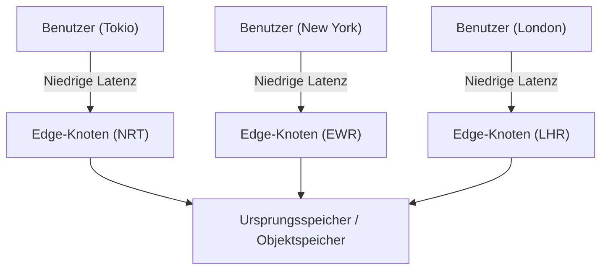
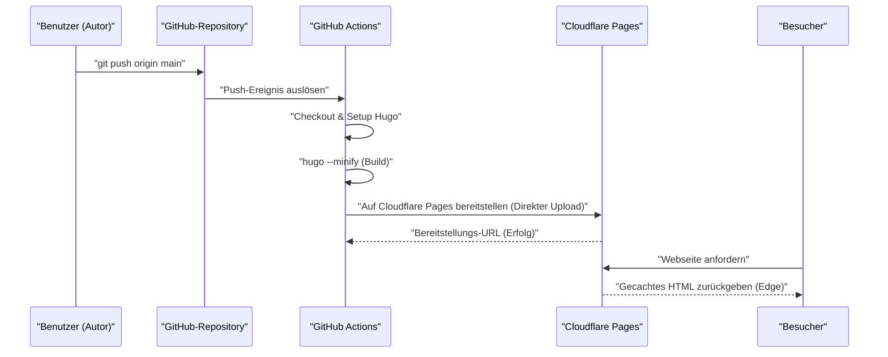
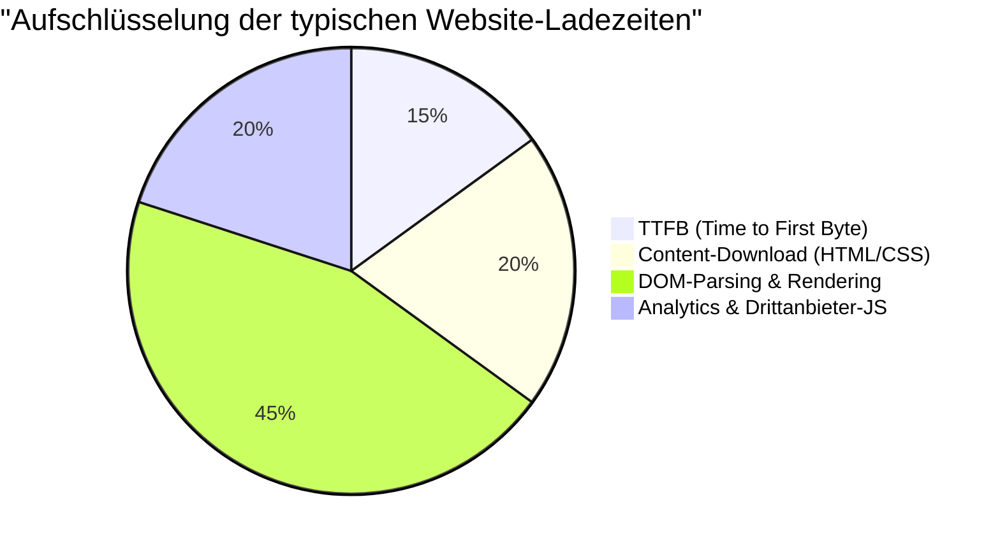

Beim Betrieb einer Website oder eines Blogs sind die Ladegeschwindigkeit (Performance), die Betriebskosten und die Sicherheit äußerst wichtige Faktoren. Früher war die Kombination aus dynamischen CMS (Content Management System) wie WordPress und gemieteten Servern der Standard. Heute jedoch zieht eine Architektur namens „Jamstack“ große Aufmerksamkeit auf sich. Insbesondere durch die Kombination von „Hugo“, einem in Go geschriebenen, ultraschnellen Static Site Generator (SSG), mit modernen Hosting-Diensten wie Cloudflare Pages oder GitHub Pages ist es möglich, eine **völlig kostenlose und blitzschnelle** Blog-Umgebung aufzubauen.

In diesem Artikel werden wir die konkreten Schritte zur Veröffentlichung einer statischen Website mit Hugo auf Cloudflare Pages oder GitHub Pages, die Unterschiede in den Architekturen der einzelnen Plattformen, den Aufbau von CI/CD (Continuous Integration / Continuous Deployment) mit GitHub Actions, die DNS-Optimierung, Caching-Strategien und die Einführung datenschutzfreundlicher Web-Analysen aus einer technischen Perspektive sehr detailliert erläutern.

---

## 1. Grundlagen von Static Site Generatoren (SSG) und Jamstack

### 1.1 Warum eine statische Website?
Herkömmliche dynamische CMS (z. B. WordPress) senden bei jeder Benutzeranfrage eine Abfrage an eine Datenbank (z. B. MySQL) und generieren serverseitig (z. B. mit PHP) dynamisch HTML, das dann zurückgegeben wird. Während dieser Ansatz sehr flexibel ist, weist er eine geringere Widerstandsfähigkeit gegen plötzliche Traffic-Spitzen (sogenannte virale Hits oder DDoS-Angriffe) auf. Dies führt oft zu einer komplexeren Infrastruktur, bei der beispielsweise Cache-Server (wie Redis oder Varnish) vorgeschaltet werden müssen.

Andererseits generieren Static Site Generatoren (SSG), die die Jamstack-Architektur (JavaScript, APIs und Markup) verwenden, bereits im Voraus (zur Build-Zeit) alle HTML-Dateien, CSS und JavaScript. Bei Benutzeranfragen gibt der Webserver (oder das CDN) lediglich die bereits generierten statischen Dateien zurück. Dies ermöglicht eine überwältigende Geschwindigkeit und robuste Sicherheit.

### 1.2 Die Vorteile von Hugo
Bei SSGs gibt es verschiedene Optionen wie Next.js, Gatsby, Jekyll oder Astro. Das herausragendste Merkmal von Hugo ist jedoch seine **Build-Geschwindigkeit**. Dank der gleichzeitigen Verarbeitung durch die Programmiersprache Go ist der Build selbst bei Websites mit Tausenden oder Zehntausenden von Seiten in nur wenigen Sekunden abgeschlossen. Dies reduziert die Wartezeiten in der CI/CD-Pipeline drastisch und führt direkt zu einer besseren Entwicklererfahrung (DX: Developer Experience).

---

## 2. Vergleich der Hosting-Service-Architekturen

Wo die mit Hugo generierten statischen Dateien gehostet werden, ist die nächste Frage. Repräsentative Optionen sind Cloudflare Pages, GitHub Pages und Netlify, die jedoch jeweils über unterschiedliche zugrunde liegende Netzwerkarchitekturen verfügen.

### 2.1 CDN und Edge-Computing
Alle diese Plattformen nutzen ein global verteiltes CDN (Content Delivery Network), um Inhalte bereitzustellen. Der entscheidende Unterschied liegt jedoch nicht nur im reinen Caching statischer Dateien, sondern darin, ob das Routing von Anfragen und das Umschreiben von Headern durch „Edge-Computing“ am Point of Presence (PoP), der dem Benutzer am nächsten ist, ausgeführt werden kann.



### 2.2 GitHub Pages
GitHub Pages ist ein Dienst, mit dem HTML-, CSS- und JavaScript-Dateien direkt aus einem GitHub-Repository veröffentlicht werden können. Im Hintergrund werden CDNs wie Fastly verwendet, was eine solide Leistung bietet. Allerdings gibt es Einschränkungen bei der Anpassung von Headern (z. B. `Cache-Control` oder Sicherheitsheader), und Weiterleitungen sind auf HTML-Meta-Refresh oder Jekyll-Plugins angewiesen. Die rein infrastrukturellen Funktionen sind daher etwas eingeschränkt.

### 2.3 Cloudflare Pages
Cloudflare Pages ist ein Hosting-Service für statische Websites, der auf Cloudflares weltweit größtem Anycast-Netzwerk (mit Präsenz in über 275 Städten) aufbaut.
Er bietet Standardunterstützung für HTTP/3 (QUIC), Bildoptimierung und die Integration von Edge-Funktionen (Cloudflare Workers), was ein überwältigendes Performance-Tuning ermöglicht. Ein großer Vorteil ist zudem, dass keine Gebühren für die Bandbreite anfallen, sodass die Website auch bei massiven Traffic-Spitzen kostenlos betrieben werden kann.

### 2.4 Netlify
Netlify ist ein Pionier im Bereich Jamstack und bietet eine All-in-One-DX (Developer Experience), die Formularfunktionen, Authentifizierung (Identity), serverlose Funktionen und vieles mehr integriert. Wenn jedoch das kostenlose Kontingent für die Bandbreite (100 GB pro Monat) überschritten wird, können hohe verbrauchsabhängige Kosten entstehen. Daher ist bei Blogs, die viele Bilder oder Videos verwenden, auf das Kostenmanagement zu achten.

---

## 3. Theoretische Berechnung von Performance und Latenz (Mathematisches Modell mit LaTeX)

Bei der Bewertung der Web-Performance ist die Reduzierung der Latenz (Latency) der wichtigste Indikator. Lassen Sie uns modellieren, wie stark die Latenz durch die Nutzung eines CDN (Edge) im Vergleich zum direkten Zugriff auf den Ursprungsserver reduziert wird.

Wir bezeichnen die Wahrscheinlichkeit, dass eine Benutzeranfrage den Cache trifft, als „Cache-Trefferrate (Cache Hit Ratio)“ und setzen sie als $C$. Dabei gilt $0 \le C \le 1$.
Die Latenz zum Ursprungsserver bezeichnen wir als $L_{origin}$ und die Latenz zum nächstgelegenen Edge-Knoten als $L_{edge}$.

Die neue durchschnittliche Latenz $L_{new}$ wird als folgender Erwartungswert berechnet:

$$ L_{new} = C \times L_{edge} + (1 - C) \times (L_{edge} + L_{origin}) $$

Wenn man diese Formel vereinfacht, erhält man Folgendes:

$$ L_{new} = L_{edge} + (1 - C) \times L_{origin} $$

Wenn beispielsweise ein Benutzer in Tokio auf einen Ursprungsserver an der Ostküste der USA (New York) zugreift, beträgt $L_{origin}$ angesichts der physischen Distanz der Glasfaserkabel und der Verarbeitungsverzögerungen an den Routern etwa 200 ms. Nutzt man hingegen ein CDN wie Cloudflare, kann eine Verbindung zu einem Edge-Knoten in Tokio hergestellt werden, wodurch sich $L_{edge}$ auf etwa 10 ms verkürzt.

Angenommen, die Cache-Trefferrate beträgt $C = 0.95$ (95 %):

$$ L_{new} = 10 + (1 - 0.95) \times 200 = 10 + 0.05 \times 200 = 10 + 10 = 20 \text{ ms} $$

Auf diese Weise ist es durch die Einführung eines CDNs möglich, die durchschnittliche Latenz drastisch (um etwa 90 %) von 210 ms auf 20 ms zu reduzieren.

---

## 4. Aufbau einer CI/CD-Pipeline mit GitHub Actions

Um den Aktualisierungsprozess eines Hugo-Blogs zu automatisieren, richten wir eine CI/CD-Pipeline mit GitHub Actions ein. Auf diese Weise genügt es, lokal einen Markdown-Artikel zu schreiben und `git push` auszuführen; der Build wird automatisch gestartet und auf Cloudflare Pages oder GitHub Pages bereitgestellt.

Das folgende Sequenzdiagramm zeigt den gesamten Ablauf vom Pushen eines Artikels bis zur Bereitstellung an den Benutzer.



### 4.1 Bereitstellungseinstellungen für Cloudflare Pages (Direkter Upload)

Bei Cloudflare Pages gibt es zwei Möglichkeiten: Sie können ein GitHub-Repository verknüpfen, um den Build auf der Infrastruktur von Cloudflare auszuführen, oder Sie laden die mit GitHub Actions erstellten statischen Dateien über „Direct Upload (Direkter Upload)“ hoch. Wenn Sie die Hugo-Versionierung strenger kontrollieren und mit anderen Jobs (wie Tests oder Bildoptimierung) verknüpfen möchten, empfiehlt sich die Methode, den Build in GitHub Actions auszuführen und einen Direct Upload durchzuführen.

Nachfolgend finden Sie ein praktisches Beispiel für `.github/workflows/deploy.yml` zur Bereitstellung auf Cloudflare Pages.

```yaml
name: "Hugo-Website auf Cloudflare Pages bereitstellen"

on:
  push:
    branches:
      - "main"
  workflow_dispatch:

jobs:
  build-and-deploy:
    runs-on: "ubuntu-latest"
    steps:
      - name: "Repository auschecken"
        uses: "actions/checkout@v4"
        with:
          submodules: "recursive"
          fetch-depth: 0

      - name: "Hugo einrichten"
        uses: "peaceiris/actions-hugo@v3"
        with:
          hugo-version: "0.125.0"
          extended: true

      - name: "Hugo-Website erstellen"
        run: "hugo --minify --gc"
        env:
          HUGO_ENVIRONMENT: "production"

      - name: "Auf Cloudflare Pages bereitstellen"
        uses: "cloudflare/pages-action@v1"
        with:
          apiToken: ${{ secrets.CLOUDFLARE_API_TOKEN }}
          accountId: ${{ secrets.CLOUDFLARE_ACCOUNT_ID }}
          projectName: "your-project-name"
          directory: "public"
          gitHubToken: ${{ secrets.GITHUB_TOKEN }}
          branch: "main"
```

In dieser Pipeline werden durch die Option `--minify` HTML, CSS und JS minimiert, und mit `--gc` werden nicht mehr benötigte Dateien gelöscht. Dies sind die Grundlagen der Performance-Optimierung.

---

## 5. Tiefer Einblick in die DNS-Einstellungen: Benutzerdefinierte Domains und CNAME / ALIAS-Einträge

Bei der Verwendung einer eigenen Domain (z. B. `kenji.blog`) ist die richtige Konfiguration des DNS (Domain Name System) unerlässlich.

### 5.1 Einschränkungen von CNAME-Einträgen und Zone Apex

Normalerweise wird ein `CNAME`-Eintrag verwendet, wenn eine Subdomain (z. B. `www.kenji.blog`) auf einen externen Dienst verweisen soll. Gemäß der DNS-Spezifikation (RFC 1034) ist es jedoch nicht möglich, einen `CNAME`-Eintrag für die Root-Domain (auch Zone Apex oder Naked Domain genannt, z. B. `kenji.blog`) festzulegen. Das liegt daran, dass in der Zone Apex immer ein SOA-Eintrag (Start of Authority), ein NS-Eintrag (Name Server) und ein MX-Eintrag (Mail Exchange) vorhanden sein müssen und die Regel besagt, dass ein CNAME nicht mit anderen Ressourceneinträgen koexistieren darf.

### 5.2 Lösung: ALIAS / ANAME / CNAME Flattening

Um dieses Problem zu lösen, bieten moderne DNS-Anbieter eigene Erweiterungsfunktionen an.

- **ALIAS / ANAME-Einträge**: Die Namensauflösung erfolgt dynamisch auf der Seite des DNS-Servers, und der endgültige A-Eintrag (IP-Adresse) wird an den Client zurückgegeben. Amazon Route 53 und andere unterstützen dies.
- **CNAME Flattening**: Eine von Cloudflare angebotene Funktion. Sie verhält sich so, als wäre ein CNAME in der Zone Apex konfiguriert, aber der autoritative DNS-Server von Cloudflare gibt die automatisch aufgelösten IP-Adressen (A-Einträge und AAAA-Einträge) transparent an den Client zurück.

Wenn Sie Cloudflare Pages verwenden, ist die Delegierung der Nameserver der Domain an Cloudflare und die Nutzung dieses „CNAME Flattening“ die nahtloseste und leistungsstärkste Konfiguration.

---

## 6. Caching-Strategien und Steuerung von HTTP-Headern

Ein weiterer Schlüssel zur Beschleunigung statischer Websites ist die „Caching-Strategie“. Bei Cloudflare Pages können HTTP-Antwortheader detailliert mithilfe einer generierten Datei (`_headers`-Datei) gesteuert werden.

### 6.1 Edge Cache vs. Browser Cache

Caches lassen sich grob in zwei Arten unterteilen: den „Edge Cache“, der auf CDN-Seite vorgehalten wird, und den „Browser Cache“, der im Browser des Benutzers gespeichert wird.

Es ist ideal, statische Dateien (Bilder, CSS, JS usw., die Hashes in ihren Dateinamen enthalten) für einen langen Zeitraum im Browser zwischenzuspeichern. Im Gegensatz dazu wird für HTML-Dateien in der Regel eine Konfiguration gewählt, bei der der Browser-Cache kurz gehalten (oder deaktiviert) wird und die Verarbeitung über den Edge-Cache erfolgt, damit Aktualisierungen sofort widergespiegelt werden.

Konfigurationsbeispiel für `_headers` in Cloudflare Pages:

```text
# HTML-Dateien werden nicht im Browser zwischengespeichert und bei jeder Anfrage validiert
/*.html
  Cache-Control: public, max-age=0, must-revalidate

# Asset-Dateien (CSS/JS/Bilder) werden für 1 Jahr im Browser zwischengespeichert
/assets/*
  Cache-Control: public, max-age=31536000, immutable
/img/*
  Cache-Control: public, max-age=31536000, immutable
```

### 6.2 Berechnungsformel zur Reduzierung der Bandbreitenkosten

Durch das Setzen geeigneter Cache-Header kann die Datenübertragungsmenge vom Server (Edge) deutlich reduziert werden. Die monatlichen Bandbreitenkosten $Cost$ werden durch folgendes Modell dargestellt, basierend auf dem Übertragungsvolumen jeder Ressource $B_i$, der Cache-Trefferrate $C_i$ und dem Einheitspreis für die Bandbreite $R$:

$$ Cost = \sum_{i=1}^{n} \left( B_i \times (1 - C_i) \times R \right) $$

Da der ausgehende Datenverkehr bei Cloudflare kostenlos ist ($R = 0$), belaufen sich die direkten finanziellen Kosten auf $0$. Wenn jedoch andere Infrastrukturen wie GitHub Pages parallel genutzt werden oder wenn beispielsweise AWS S3 als Backend dient, ist die Maximierung dieser Cache-Trefferrate $C_i$ der Schlüssel zur Senkung der Infrastrukturkosten.

---

## 7. Web-Analysen, die Datenschutz und Performance in Einklang bringen

Beim Betrieb eines Blogs ist die Web-Analyse unerlässlich, um zu erfahren, wie viele Benutzer die Website besuchen. Lange Zeit war Google Analytics (GA4) der De-facto-Standard, doch mit dem aktuellen Trend zum Datenschutz (DSGVO, CCPA) und der Abschaffung von Third-Party-Cookies ändert sich die Situation.

### 7.1 Auswirkungen auf die Web-Performance

Die Implementierung von Google Analytics (insbesondere `gtag.js` oder Google Tag Manager) führt zum Laden und Ausführen zahlreicher externer Skripte, was sich negativ auf die Performance (insbesondere auf TTFB und die Blockierungszeit des Main Threads) auswirkt.

Lassen Sie uns die Ladezeit der Website wie folgt aufschlüsseln und betrachten.



Es ist nicht ungewöhnlich, dass Analyse-Tools von Drittanbietern etwa 20 % bis 30 % der gesamten Ladezeit ausmachen.

### 7.2 Einführung von Cloudflare Web Analytics

Aus diesem Grund rücken privatsphäre-fokussierte (Privacy First) Web-Analysen ohne Cookies (Cookieless) wie Cloudflare Web Analytics oder Plausible Analytics ins Rampenlicht.

Cloudflare Web Analytics funktioniert durch einfaches Einbetten eines sehr ressourcenschonenden JavaScript-Snippets. Da es keine Cookies setzt, entfällt die Notwendigkeit, ein lästiges Cookie-Zustimmungsbanner (Cookie Consent Banner) zu installieren.

Auch die Implementierung in Hugo ist sehr einfach. Sie müssen lediglich das bereitgestellte Snippet zu `layouts/partials/head.html` oder `layouts/partials/analytics.html` hinzufügen.

```html
{{ if eq hugo.Environment "production" }}
<!-- Cloudflare Web Analytics -->
<script defer src='https://static.cloudflareinsights.com/beacon.min.js' data-cf-beacon='{"token": "YOUR_CLOUDFLARE_BEACON_TOKEN"}'></script>
<!-- End Cloudflare Web Analytics -->
{{ end }}
```

Durch das Hinzufügen des Attributs `defer` kann das Skript asynchron geladen werden, ohne das Parsen des HTMLs zu blockieren, und nach dem Aufbau des DOMs ausgeführt werden. Dadurch werden die Auswirkungen auf die anfängliche Ladegeschwindigkeit (LCP: Largest Contentful Paint und FCP: First Contentful Paint) auf ein Minimum reduziert.

---

## 8. Zusammenfassung und Best Practices

Beim Betrieb von statischen Websites mit Hugo bietet der Einsatz moderner Hosting-Plattformen wie Cloudflare Pages oder GitHub Pages überwältigende Vorteile in allen Bereichen: Kosteneffizienz, Ladegeschwindigkeit und Sicherheit.

1. **Blitzschnelle Builds**: Nutzen Sie die Geschwindigkeit von Hugo, um die Ausführungszeit der CI/CD-Pipeline (GitHub Actions) zu minimieren.
2. **Bereitstellung am Edge**: Nutzen Sie das Edge-Netzwerk von Cloudflare, um Inhalte mit Latenzen im Millisekundenbereich an Benutzer auf der ganzen Welt auszuliefern.
3. **Geeignete DNS-Konfiguration**: Nutzen Sie CNAME Flattening, um die Zone Apex (benutzerdefinierte Domain) sicher und schnell zu betreiben.
4. **Optimierung der Caching-Strategie**: Verwenden Sie `_headers`, um Browser-Cache und Edge-Cache je nach Ressourcentyp angemessen zu trennen.
5. **Ressourcenschonende Analysen**: Führen Sie Tools wie Cloudflare Web Analytics ein, die die Privatsphäre respektieren und gleichzeitig die Performance nicht beeinträchtigen.

Durch die Kombination dieser Elemente kann kostenlos ein skalierbares und robustes Blog-System aufgebaut werden, das massivem Traffic im Bereich von mehreren Millionen Seitenaufrufen pro Monat standhält. Wenn Sie die Erstellung eines Technik-Blogs, einer Unternehmenswebsite oder einer Portfolio-Website in Betracht ziehen, sollten Sie diese Architektur aus Jamstack + Hugo + Cloudflare Pages unbedingt ausprobieren.
