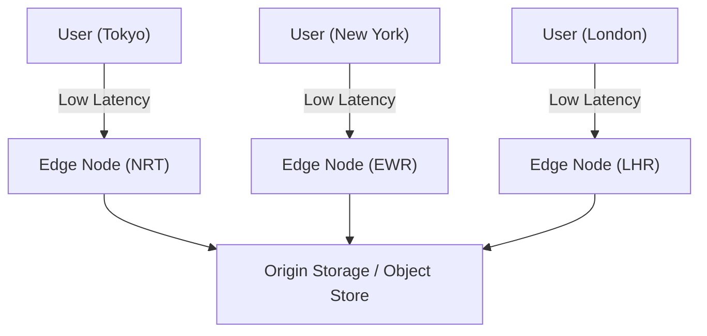
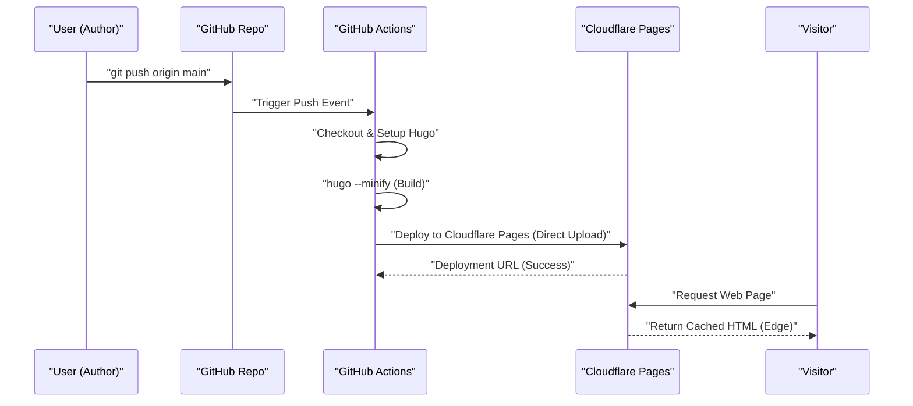
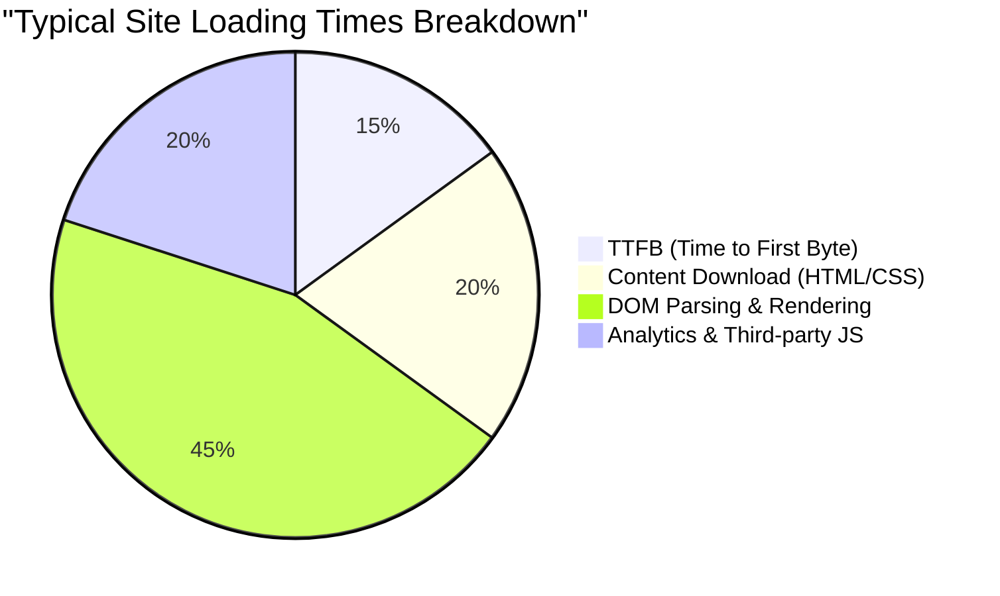

When running a website or blog, page speed (performance), operational costs, and security are extremely important factors. In the past, the combination of dynamic CMS (Content Management System) like WordPress and shared hosting was the mainstream, but currently, an architecture known as 'Jamstack' is gaining significant attention. Among them, by combining "Hugo", an ultra-fast static site generator (SSG) built in Go, with modern hosting services like Cloudflare Pages and GitHub Pages, it is possible to build a **completely free and blazing fast** blog environment.

In this article, we will delve very deeply from a technical perspective into the specific steps to publish a Hugo-based static site with Cloudflare Pages and GitHub Pages, the architectural differences between each platform, the construction of CI/CD (Continuous Integration / Continuous Deployment) using GitHub Actions, DNS optimization, caching strategies, and even the introduction of privacy-friendly web analytics.

---

## 1. Basics of Static Site Generators (SSG) and Jamstack

### 1.1 Why static sites?
Traditional dynamic CMS (e.g., WordPress) issue queries to a database (such as MySQL) and dynamically generate HTML on the server-side (like PHP) to return for every user request. While this method offers high flexibility, it has low resilience against sudden traffic spikes (such as going viral or DDoS attacks) and often leads to complicated infrastructure configurations, like placing cache servers (Redis or Varnish) in the front end.

On the other hand, with Static Site Generators (SSG) adopting the Jamstack (JavaScript, APIs, and Markup) architecture, all HTML files, CSS, and JavaScript are generated in advance (at build time). In response to user requests, the web server (or CDN) simply returns the already generated static files as they are, thereby achieving overwhelming speed and robust security.

### 1.2 The Superiority of Hugo
There are various choices for SSGs such as Next.js, Gatsby, Jekyll, and Astro, but the greatest feature of Hugo is its **build speed**. Benefiting from concurrent processing in the Go language, building even a site with thousands to tens of thousands of pages is completed in just a few seconds. This significantly reduces wait times in CI/CD pipelines and directly connects to an improved Developer Experience (DX).

---

## 2. Comparison of Hosting Service Architectures

Where to host the static files generated by Hugo becomes the next challenge. Representative choices include Cloudflare Pages, GitHub Pages, and Netlify, but each has a different network architecture behind it.

### 2.1 CDN and Edge Computing
All of these platforms use globally distributed CDNs (Content Delivery Networks) to deliver content. However, beyond just caching static files, the ability to perform request routing and header rewriting at the PoP (Point of Presence) closest to the user through "edge computing" serves as a differentiating factor.



### 2.2 GitHub Pages
GitHub Pages is a service that allows you to publish HTML, CSS, and JavaScript files directly from a GitHub repository. CDNs like Fastly are used behind the scenes, delivering sufficient performance. However, there are constraints on header customization (e.g., setting `Cache-Control` or security headers), and redirect settings rely on HTML meta refresh or Jekyll plugins, making its functions as pure infrastructure somewhat modest.

### 2.3 Cloudflare Pages
Cloudflare Pages is a static site hosting service built on top of Cloudflare's world-class Anycast network (deployed in over 275 cities). It enables overwhelming performance tuning, including standard support for HTTP/3 (QUIC), image optimization, and integration with edge functions (Cloudflare Workers). Additionally, a major benefit is that there are no bandwidth charges, so it can be operated for free no matter how much traffic spikes.

### 2.4 Netlify
Netlify is a pioneer of Jamstack, offering an all-in-one DX that integrates form features, authentication (Identity), serverless functions, and more. However, exceeding the free tier bandwidth (100GB per month) incurs expensive pay-as-you-go billing, so careful cost management is necessary for blogs that heavily use images and videos.

---

## 3. Theoretical Calculation of Performance and Latency (Mathematical Model with LaTeX)

In evaluating web performance, reducing latency is the most important metric. Let's model how much latency is reduced by using a CDN (edge) compared to accessing the origin server directly.

Let the probability that a user's request hits the cache be the "Cache Hit Ratio", denoted as $C$. It follows $0 \le C \le 1$.
Let the latency to the origin server be $L_{origin}$, and the latency to the nearest edge node be $L_{edge}$.

The new average latency $L_{new}$ is calculated as the following expected value:

$$ L_{new} = C \times L_{edge} + (1 - C) \times (L_{edge} + L_{origin}) $$

Simplifying this formula yields the following:

$$ L_{new} = L_{edge} + (1 - C) \times L_{origin} $$

For example, when a user in Tokyo accesses an origin server located on the East Coast of the US (New York), considering the physical distance of the fiber optics and the processing delays at routers, $L_{origin}$ will be roughly 200 ms. On the other hand, by using a CDN like Cloudflare, they can connect to an edge node in Tokyo, reducing $L_{edge}$ to about 10 ms.

Assuming a cache hit ratio $C = 0.95$ (95%),

$$ L_{new} = 10 + (1 - 0.95) \times 200 = 10 + 0.05 \times 200 = 10 + 10 = 20 \text{ ms} $$

In this way, introducing a CDN can dramatically reduce (by about 90%) the average latency from 210 ms to 20 ms.

---

## 4. Building a CI/CD Pipeline using GitHub Actions

To automate the update process for a Hugo blog, we will build a CI/CD pipeline using GitHub Actions. With this setup, simply writing a Markdown article locally and running `git push` will automatically trigger the build and deploy to Cloudflare Pages or GitHub Pages.

The sequence diagram below shows the entire flow from pushing an article to delivering it to the user.



### 4.1 Deployment Settings for Cloudflare Pages (Direct Upload)

Cloudflare Pages offers two methods: linking a GitHub repository to build on Cloudflare's infrastructure, or using "Direct Upload" for static files built via GitHub Actions. If you want to manage Hugo versions more strictly and integrate with other jobs (such as testing and image optimization), building on GitHub Actions and using the Direct Upload method is recommended.

Below is a practical example of `.github/workflows/deploy.yml` for deploying to Cloudflare Pages.

```yaml
name: "Deploy Hugo site to Cloudflare Pages"

on:
  push:
    branches:
      - "main"
  workflow_dispatch:

jobs:
  build-and-deploy:
    runs-on: "ubuntu-latest"
    steps:
      - name: "Checkout repository"
        uses: "actions/checkout@v4"
        with:
          submodules: "recursive"
          fetch-depth: 0

      - name: "Setup Hugo"
        uses: "peaceiris/actions-hugo@v3"
        with:
          hugo-version: "0.125.0"
          extended: true

      - name: "Build Hugo Site"
        run: "hugo --minify --gc"
        env:
          HUGO_ENVIRONMENT: "production"

      - name: "Deploy to Cloudflare Pages"
        uses: "cloudflare/pages-action@v1"
        with:
          apiToken: ${{ secrets.CLOUDFLARE_API_TOKEN }}
          accountId: ${{ secrets.CLOUDFLARE_ACCOUNT_ID }}
          projectName: "your-project-name"
          directory: "public"
          gitHubToken: ${{ secrets.GITHUB_TOKEN }}
          branch: "main"
```

In this pipeline, HTML/CSS/JS are minified using the `--minify` option, and unnecessary files are removed with `--gc`. These are the basics of performance optimization.

---

## 5. Deep Dive into DNS Settings: Custom Domains and CNAME / ALIAS Records

When using a custom domain (e.g., `kenji.blog`), proper configuration of DNS (Domain Name System) is essential.

### 5.1 CNAME Record Limitations and Zone Apex
Typically, when pointing a subdomain (e.g., `www.kenji.blog`) to an external service, a `CNAME` record is used. However, according to DNS specifications (RFC 1034), a `CNAME` record cannot be set on the root domain (also known as the Zone Apex or naked domain, e.g., `kenji.blog`). This is due to the rule that the Zone Apex must contain an SOA (Start of Authority) record, NS (Name Server) records, or MX (Mail Exchange) records, and a CNAME cannot coexist with other resource records.

### 5.2 Solutions: ALIAS / ANAME / CNAME Flattening
To solve this problem, modern DNS providers offer their own extended features.

- **ALIAS / ANAME Records**: The DNS server dynamically resolves the name and returns the final A record (IP address) to the client. Amazon Route 53 and others support this.
- **CNAME Flattening**: A feature provided by Cloudflare. It behaves as if a CNAME were set on the Zone Apex, while Cloudflare's authoritative DNS servers transparently return a group of automatically resolved IP addresses (A and AAAA records) to the client.

When using Cloudflare Pages, delegating the domain's name servers to Cloudflare and utilizing this "CNAME Flattening" results in the most seamless and high-performance setup.

---

## 6. Caching Strategies and HTTP Header Control

Another key element in accelerating static sites is the "caching strategy". In Cloudflare Pages, you can use the generated file (`_headers` file) to control HTTP response headers in detail.

### 6.1 Edge Cache vs Browser Cache
Caches can broadly be divided into two types: "Edge Cache" held on the CDN side, and "Browser Cache" saved in the user's browser.

For static files (such as images, CSS, and JS, whose filenames include hashes), it is ideal to let the browser cache them for a long time. On the other hand, to reflect updates immediately in HTML files, it is common to keep their browser cache short (or disabled) and serve them from the edge cache.

Configuration example of `_headers` in Cloudflare Pages:

```text
# Do not browser-cache HTML files, validate them every time
/*.html
  Cache-Control: public, max-age=0, must-revalidate

# Let the browser cache asset files (CSS/JS/images) for 1 year
/assets/*
  Cache-Control: public, max-age=31536000, immutable
/img/*
  Cache-Control: public, max-age=31536000, immutable
```

### 6.2 Calculation Formula for Bandwidth Cost Reduction
By setting appropriate cache headers, the volume of data transferred from the server (edge) can be greatly reduced. The monthly bandwidth cost $Cost$ is represented by the following model, based on the transfer volume $B_i$ of each resource, the cache hit ratio $C_i$, and the unit price of bandwidth $R$:

$$ Cost = \sum_{i=1}^{n} \left( B_i \times (1 - C_i) \times R \right) $$

Because outbound data transfer is free with Cloudflare ($R = 0$), the direct financial cost becomes $0$. However, when using other infrastructures like GitHub Pages alongside it, or when using something like AWS S3 as a backend, maximizing this cache hit ratio $C_i$ is crucial for reducing infrastructure costs.

---

## 7. Web Analytics Balancing Privacy and Performance

Running a blog inevitably requires web analytics to understand how many users are visiting. Google Analytics (GA4) has long been the de facto standard, but with recent trends in privacy protection (such as GDPR and CCPA) and the phase-out of third-party cookies, the situation is changing.

### 7.1 Impact on Web Performance
Introducing Google Analytics (specifically `gtag.js` or Google Tag Manager) leads to the loading and execution of numerous external scripts, negatively impacting performance (especially TTFB and main thread blocking time).

Let's break down site loading times as follows:



It is not uncommon for third-party JS analytics tools to account for around 20% to 30% of total load times.

### 7.2 Introducing Cloudflare Web Analytics
This is where privacy-first, cookieless web analytics tools like Cloudflare Web Analytics and Plausible Analytics are gaining attention.

Cloudflare Web Analytics works just by embedding a very lightweight JavaScript snippet, and since it doesn't issue cookies, there's no need to install annoying Cookie Consent Banners.

Implementation in Hugo is also very simple. Just add the provided snippet to `layouts/partials/head.html` or `layouts/partials/analytics.html`.

```html
{{ if eq hugo.Environment "production" }}
<!-- Cloudflare Web Analytics -->
<script defer src='https://static.cloudflareinsights.com/beacon.min.js' data-cf-beacon='{"token": "YOUR_CLOUDFLARE_BEACON_TOKEN"}'></script>
<!-- End Cloudflare Web Analytics -->
{{ end }}
```

Adding the `defer` attribute allows the script to load asynchronously without blocking HTML parsing, letting it run after the DOM is built. This minimizes its impact on initial display speed (LCP: Largest Contentful Paint and FCP: First Contentful Paint).

---

## 8. Conclusion and Best Practices

When running static sites using Hugo, adopting modern hosting platforms like Cloudflare Pages or GitHub Pages provides overwhelming benefits across cost performance, load speed, and security.

1. **Blazing Fast Builds**: Leverage Hugo's speed to minimize CI/CD pipeline (GitHub Actions) execution times.
2. **Edge Delivery**: Utilize Cloudflare's edge network to deliver content to global users with millisecond-level latency.
3. **Appropriate DNS Configuration**: Make use of CNAME Flattening to safely and swiftly operate your Zone Apex (custom domain).
4. **Caching Strategy Optimization**: Use `_headers` to properly separate browser cache and edge cache based on resource type.
5. **Lightweight Analytics**: Adopt privacy-friendly analytics like Cloudflare Web Analytics that won't compromise performance.

By combining these, it is possible to build a scalable, robust blog system for free that can withstand massive traffic of several million PVs per month. If you are considering launching a tech blog, corporate site, or portfolio site, be sure to try out this Jamstack + Hugo + Cloudflare Pages setup.
