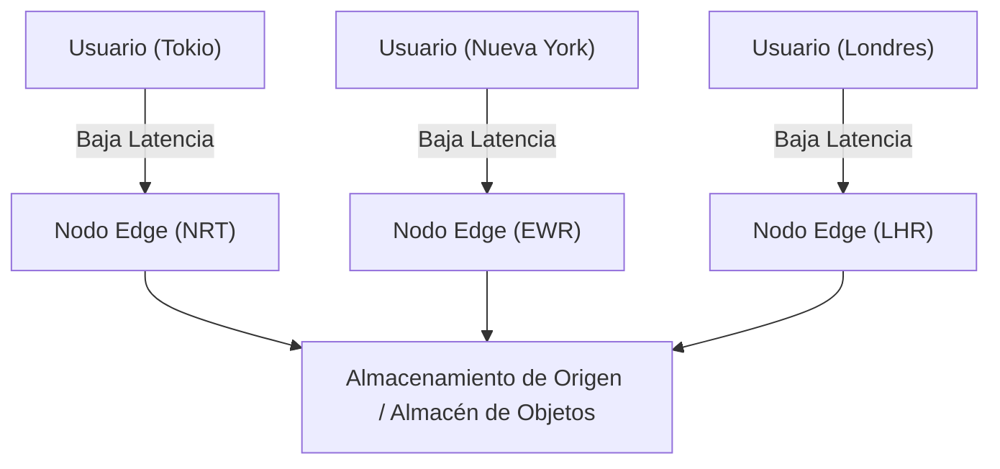
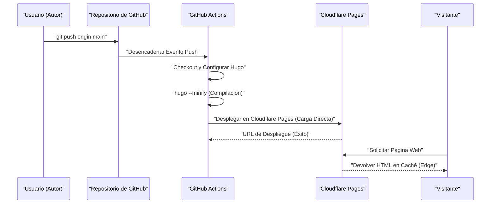
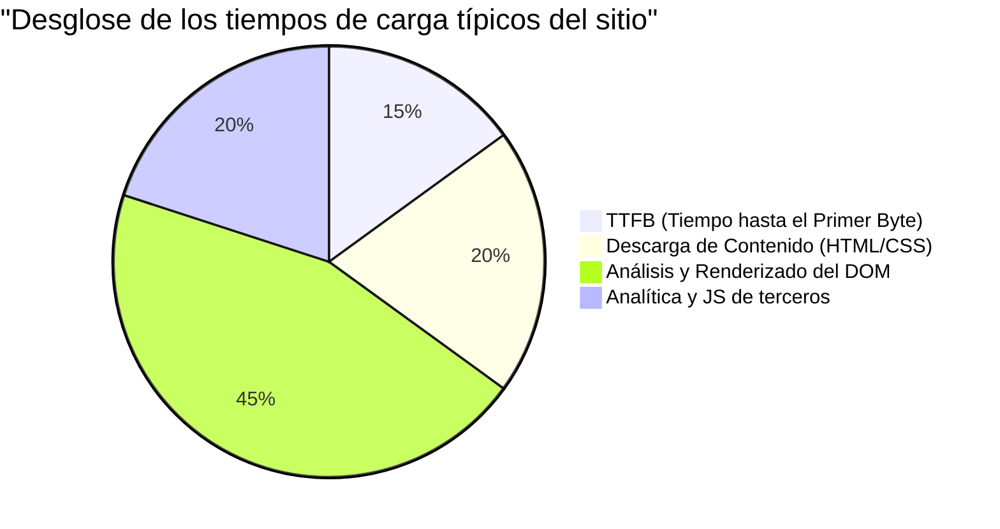

Al administrar un sitio web o un blog, la velocidad de carga (rendimiento), los costos operativos y la seguridad son factores extremadamente importantes. En el pasado, la combinación de un CMS (Sistema de Gestión de Contenidos) dinámico como WordPress y un servidor de alojamiento era la corriente principal, pero actualmente la arquitectura llamada "Jamstack" está atrayendo mucha atención. Entre ellos, combinando "Hugo", un generador de sitios estáticos (SSG) ultrarrápido escrito en Go, con servicios de alojamiento modernos como Cloudflare Pages y GitHub Pages, es posible construir un entorno de blog **completamente gratuito y ultrarrápido**.

En este artículo, profundizaremos desde un punto de vista técnico en los pasos específicos para publicar un sitio estático usando Hugo en Cloudflare Pages o GitHub Pages, las diferencias en la arquitectura de cada plataforma, la construcción de CI/CD (Integración Continua / Despliegue Continuo) usando GitHub Actions, la optimización de DNS, las estrategias de caché, y la introducción de análisis de acceso que respetan la privacidad.

---

## 1. Fundamentos de los Generadores de Sitios Estáticos (SSG) y Jamstack

### 1.1 ¿Por qué un sitio estático?
Los CMS dinámicos tradicionales (ej. WordPress) consultan la base de datos (como MySQL) por cada solicitud del usuario y generan HTML dinámicamente en el lado del servidor (como PHP) para devolverlo. Si bien este método es altamente flexible, tiene poca resistencia a los aumentos repentinos de tráfico (los llamados picos de popularidad o ataques DDoS) y a menudo complica la configuración de la infraestructura, requiriendo colocar servidores de caché (Redis o Varnish) en primer plano.

Por otro lado, en los generadores de sitios estáticos (SSG) que adoptan la arquitectura Jamstack (JavaScript, APIs y Markup), todos los archivos HTML, CSS y JavaScript se generan por adelantado (durante el tiempo de compilación). Dado que el servidor web (o CDN) simplemente devuelve los archivos estáticos ya generados en respuesta a las solicitudes de los usuarios, se puede lograr una velocidad abrumadora y una seguridad robusta.

### 1.2 La superioridad de Hugo
Existen varias opciones de SSG como Next.js, Gatsby, Jekyll y Astro, pero la mayor característica de Hugo es su **velocidad de compilación**. Beneficiándose del procesamiento concurrente de Go, la compilación de un sitio de miles a decenas de miles de páginas se completa en solo unos segundos. Esto reduce drásticamente el tiempo de espera en el pipeline CI/CD y se traduce directamente en una mejora de la experiencia del desarrollador (DX: Developer Experience).

---

## 2. Comparación de arquitecturas de servicios de alojamiento

El siguiente desafío es dónde alojar los archivos estáticos generados con Hugo. Las opciones representativas incluyen Cloudflare Pages, GitHub Pages y Netlify, pero la arquitectura de red detrás de cada una es diferente.

### 2.1 CDN y Edge Computing
Todas estas plataformas utilizan CDNs (Redes de Entrega de Contenido) distribuidas globalmente para entregar contenido. Sin embargo, el factor diferenciador es si el "edge computing" (computación en el borde) puede ejecutar el enrutamiento de solicitudes y la reescritura de encabezados en el PoP (Point of Presence) más cercano al usuario, y no solo almacenar en caché archivos estáticos.



### 2.2 GitHub Pages
GitHub Pages es un servicio que permite publicar archivos HTML, CSS y JavaScript directamente desde un repositorio de GitHub. Detrás utiliza un CDN como Fastly y ofrece un rendimiento suficiente. Sin embargo, las capacidades como infraestructura pura son un poco modestas, con restricciones en la personalización de encabezados (ej. configuración de `Cache-Control` y encabezados de seguridad) y la dependencia de meta refresh de HTML o plugins de Jekyll para la configuración de redirecciones.

### 2.3 Cloudflare Pages
Cloudflare Pages es un servicio de alojamiento de sitios estáticos construido sobre la red Anycast a nivel mundial de la que Cloudflare se enorgullece (desplegada en más de 275 ciudades).
Permite un ajuste de rendimiento abrumador, incluyendo soporte estándar para HTTP/3 (QUIC), optimización de imágenes y la integración de funciones edge (Cloudflare Workers). Además, una gran ventaja es que no hay cargos por ancho de banda, por lo que se puede operar de forma gratuita sin importar cuánto aumente el tráfico.

### 2.4 Netlify
Netlify es un pionero de Jamstack y proporciona un DX todo en uno que integra funciones de formularios, autenticación (Identity), funciones serverless, etc. Sin embargo, una vez que se supera el ancho de banda del nivel gratuito (100 GB por mes), se incurren en altos cargos por uso, por lo que se requiere cuidado con la gestión de costos en blogs que utilizan muchas imágenes o videos.

---

## 3. Cálculo teórico del rendimiento y la latencia (Modelo matemático con LaTeX)

Al evaluar el rendimiento web, la reducción de la latencia (Latency) es el indicador más importante. Modelemos cuánta latencia se reduce al usar una CDN (edge) en comparación con acceder directamente al servidor de origen.

Supongamos que la probabilidad de que la solicitud de un usuario acierte en la caché es el "Ratio de aciertos de caché (Cache Hit Ratio)" y la denotamos como $C$. Donde $0 \le C \le 1$.
Dejamos que la latencia hasta el servidor de origen sea $L_{origin}$, y la latencia hasta el nodo edge más cercano sea $L_{edge}$.

La nueva latencia promedio $L_{new}$ se calcula como el siguiente valor esperado:

$$ L_{new} = C \times L_{edge} + (1 - C) \times (L_{edge} + L_{origin}) $$

Simplificando esta fórmula obtenemos lo siguiente:

$$ L_{new} = L_{edge} + (1 - C) \times L_{origin} $$

Por ejemplo, si un usuario en Tokio accede a un servidor de origen ubicado en la costa este de los EE. UU. (Nueva York), considerando la distancia física de la fibra óptica y el retraso de procesamiento en los enrutadores, $L_{origin}$ será de aproximadamente 200 ms. Por otro lado, si se utiliza una CDN como Cloudflare, el usuario puede conectarse al nodo edge en Tokio, por lo que $L_{edge}$ se reducirá a unos 10 ms.

Asumiendo que el ratio de aciertos de caché $C = 0.95$ (95%),

$$ L_{new} = 10 + (1 - 0.95) \times 200 = 10 + 0.05 \times 200 = 10 + 10 = 20 \text{ ms} $$

De esta manera, la introducción de una CDN hace posible reducir drásticamente (alrededor del 90%) la latencia promedio de 210 ms a 20 ms.

---

## 4. Construcción del pipeline CI/CD utilizando GitHub Actions

Para automatizar el proceso de actualización del blog de Hugo, construiremos un pipeline CI/CD utilizando GitHub Actions. Con esto, simplemente escribiendo artículos en Markdown localmente y ejecutando `git push`, la compilación se ejecutará automáticamente y se desplegará en Cloudflare Pages o GitHub Pages.

El siguiente diagrama de secuencia muestra el flujo general desde que se hace push a un artículo hasta que se entrega al usuario.



### 4.1 Configuración de despliegue para Cloudflare Pages (Direct Upload)

En Cloudflare Pages, hay un método para vincular un repositorio de GitHub y construir en la infraestructura de Cloudflare, y un método para "Direct Upload" (cargar directamente) archivos estáticos compilados con GitHub Actions. Si deseas gestionar las versiones de Hugo más estrictamente y vincularlas con otros trabajos (pruebas y optimización de imágenes), se recomienda el método de compilar en GitHub Actions y hacer un Direct Upload.

A continuación se muestra un ejemplo práctico de `.github/workflows/deploy.yml` para desplegar en Cloudflare Pages.

```yaml
name: "Deploy Hugo site to Cloudflare Pages"

on:
  push:
    branches:
      - "main"
  workflow_dispatch:

jobs:
  build-and-deploy:
    runs-on: "ubuntu-latest"
    steps:
      - name: "Checkout repository"
        uses: "actions/checkout@v4"
        with:
          submodules: "recursive"
          fetch-depth: 0

      - name: "Setup Hugo"
        uses: "peaceiris/actions-hugo@v3"
        with:
          hugo-version: "0.125.0"
          extended: true

      - name: "Build Hugo Site"
        run: "hugo --minify --gc"
        env:
          HUGO_ENVIRONMENT: "production"

      - name: "Deploy to Cloudflare Pages"
        uses: "cloudflare/pages-action@v1"
        with:
          apiToken: ${{ secrets.CLOUDFLARE_API_TOKEN }}
          accountId: ${{ secrets.CLOUDFLARE_ACCOUNT_ID }}
          projectName: "your-project-name"
          directory: "public"
          gitHubToken: ${{ secrets.GITHUB_TOKEN }}
          branch: "main"
```

En este pipeline, HTML/CSS/JS se minimizan mediante la opción `--minify`, y los archivos innecesarios se eliminan mediante `--gc`. Estos son los conceptos básicos de la optimización del rendimiento.

---

## 5. Profundizando en la configuración DNS: Dominios personalizados y registros CNAME / ALIAS

Cuando se utiliza un dominio personalizado (ej: `kenji.blog`), es esencial una configuración adecuada del DNS (Sistema de Nombres de Dominio).

### 5.1 Restricciones de registros CNAME y Zone Apex
Normalmente, al dirigir un subdominio (ej: `www.kenji.blog`) a un servicio externo, se utiliza un registro `CNAME`. Sin embargo, debido a las especificaciones DNS (RFC 1034), no se puede configurar un registro `CNAME` en el dominio raíz (también llamado Zone Apex o dominio desnudo. Ej: `kenji.blog`). Esto se debe a la regla de que registros como SOA (Start of Authority), NS (Name Server) y MX (Mail Exchange) deben existir en el Zone Apex, y un CNAME no puede coexistir con otros registros de recursos.

### 5.2 Soluciones: ALIAS / ANAME / CNAME Flattening
Para resolver este problema, los proveedores de DNS modernos ofrecen sus propias extensiones.

- **Registros ALIAS / ANAME**: Resuelven dinámicamente nombres en el lado del servidor DNS y devuelven el registro A final (dirección IP) al cliente. Amazon Route 53 y otros lo admiten.
- **CNAME Flattening**: Una función proporcionada por Cloudflare. Mientras se comporta como si un CNAME estuviera configurado en el Zone Apex, el servidor DNS autoritativo de Cloudflare devuelve de manera transparente al cliente el grupo de direcciones IP (registros A y AAAA) resueltos automáticamente.

Al usar Cloudflare Pages, delegar los servidores de nombres de dominio a Cloudflare y utilizar este "CNAME Flattening" es la configuración más eficiente y de mayor rendimiento.

---

## 6. Estrategias de caché y control de encabezados HTTP

Otra clave para acelerar sitios estáticos es la "estrategia de caché". En Cloudflare Pages, se pueden controlar en detalle los encabezados de respuesta HTTP utilizando un archivo generado (el archivo `_headers`).

### 6.1 Edge Cache vs Browser Cache
La caché se divide a grandes rasgos en dos tipos: la "Edge Cache" que se retiene en el lado del CDN, y la "Browser Cache" que se guarda en el navegador del usuario.

Lo ideal es permitir que los archivos estáticos (imágenes, CSS, JS, etc., aquellos con hashes en sus nombres de archivo) se almacenen en la caché del navegador durante un largo período de tiempo. Por otro lado, para que los archivos HTML reflejen las actualizaciones de inmediato, la configuración común es acortar (o deshabilitar) la caché del navegador y manejarla en la caché del edge.

Ejemplo de configuración de `_headers` en Cloudflare Pages:

```text
# Los archivos HTML no se almacenan en la caché del navegador y se validan cada vez
/*.html
  Cache-Control: public, max-age=0, must-revalidate

# Los archivos de recursos (CSS/JS/imágenes) se almacenan en la caché del navegador por 1 año
/assets/*
  Cache-Control: public, max-age=31536000, immutable
/img/*
  Cache-Control: public, max-age=31536000, immutable
```

### 6.2 Fórmula para reducir los costos de ancho de banda
Al configurar los encabezados de caché adecuados, la cantidad de datos transferidos desde el servidor (edge) se puede reducir drásticamente. El costo mensual del ancho de banda $Cost$ se representa mediante el siguiente modelo, basado en la cantidad de transferencia de cada recurso $B_i$, el ratio de aciertos de caché $C_i$ y el precio unitario del ancho de banda $R$.

$$ Cost = \sum_{i=1}^{n} \left( B_i \times (1 - C_i) \times R \right) $$

Dado que la transferencia de salida es gratuita en Cloudflare ($R = 0$), el costo monetario directo se convierte en $0$. Sin embargo, cuando se usa junto con otra infraestructura como GitHub Pages, o cuando se usa AWS S3 como backend, maximizar este ratio de aciertos de caché $C_i$ es clave para reducir los costos de infraestructura.

---

## 7. Análisis de acceso equilibrando privacidad y rendimiento

Al gestionar un blog, el análisis de acceso (Web Analytics) para saber cuántos usuarios lo visitan es indispensable. Google Analytics (GA4) ha sido el estándar de facto durante mucho tiempo, pero la situación está cambiando con las recientes tendencias de protección de la privacidad (GDPR, CCPA) y la abolición de las cookies de terceros.

### 7.1 Impacto en el rendimiento web
Cuando se introduce Google Analytics (específicamente `gtag.js` o Google Tag Manager), se cargan y ejecutan muchos scripts externos, lo que afecta negativamente al rendimiento (especialmente al TTFB y al tiempo de bloqueo del hilo principal).

Desglosemos los tiempos de carga del sitio de la siguiente manera:



No es raro que las herramientas de análisis JS de terceros representen alrededor del 20% al 30% del tiempo de carga total.

### 7.2 Introducción a Cloudflare Web Analytics
Por lo tanto, la atención se centra en los análisis de acceso que priorizan la privacidad y que no utilizan cookies (Cookieless), como Cloudflare Web Analytics y Plausible Analytics.

Cloudflare Web Analytics funciona simplemente incrustando un fragmento de JavaScript muy ligero y no emite cookies, por lo que no es necesario instalar un molesto banner de consentimiento de cookies (Cookie Consent Banner).

Su implementación en Hugo también es muy sencilla. Simplemente añade el fragmento proporcionado en `layouts/partials/head.html` o `layouts/partials/analytics.html`.

```html
{{ if eq hugo.Environment "production" }}
<!-- Cloudflare Web Analytics -->
<script defer src='https://static.cloudflareinsights.com/beacon.min.js' data-cf-beacon='{"token": "YOUR_CLOUDFLARE_BEACON_TOKEN"}'></script>
<!-- End Cloudflare Web Analytics -->
{{ end }}
```

Al agregar el atributo `defer`, el script se puede cargar de forma asíncrona sin bloquear el análisis de HTML y ejecutarse después de que se construya el DOM. Esto minimiza el impacto en la velocidad de visualización inicial (LCP: Largest Contentful Paint y FCP: First Contentful Paint).

---

## 8. Conclusión y Mejores Prácticas

En la operación de un sitio estático usando Hugo, adoptar plataformas de alojamiento modernas como Cloudflare Pages o GitHub Pages tiene beneficios abrumadores en términos de rentabilidad, velocidad de visualización y seguridad.

1. **Compilación ultrarrápida**: Aprovechar la velocidad de Hugo para minimizar el tiempo de ejecución del pipeline CI/CD (GitHub Actions).
2. **Entrega en el edge**: Utilizar la red edge de Cloudflare para entregar contenido a usuarios de todo el mundo con latencia de milisegundos.
3. **Configuración adecuada de DNS**: Aprovechar CNAME Flattening para operar el Zone Apex (dominio personalizado) de manera segura y rápida.
4. **Optimización de la estrategia de caché**: Usar `_headers` para separar adecuadamente la caché del navegador y la caché del edge para cada tipo de recurso.
5. **Analíticas ligeras**: Introducir Cloudflare Web Analytics, etc., que no comprometen el rendimiento al tiempo que respetan la privacidad.

Al combinar estos elementos, es posible construir un sistema de blog escalable y robusto que puede soportar grandes volúmenes de tráfico de millones de visitas mensuales de forma gratuita. Si estás considerando lanzar un blog técnico, un sitio corporativo o un portafolio, definitivamente prueba esta configuración de Jamstack + Hugo + Cloudflare Pages.
