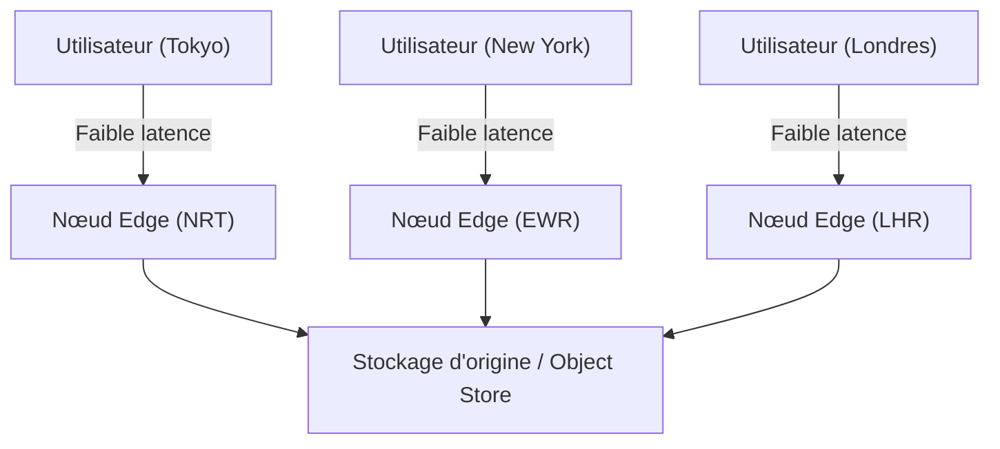
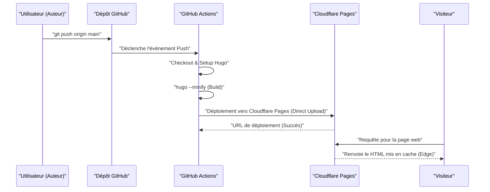
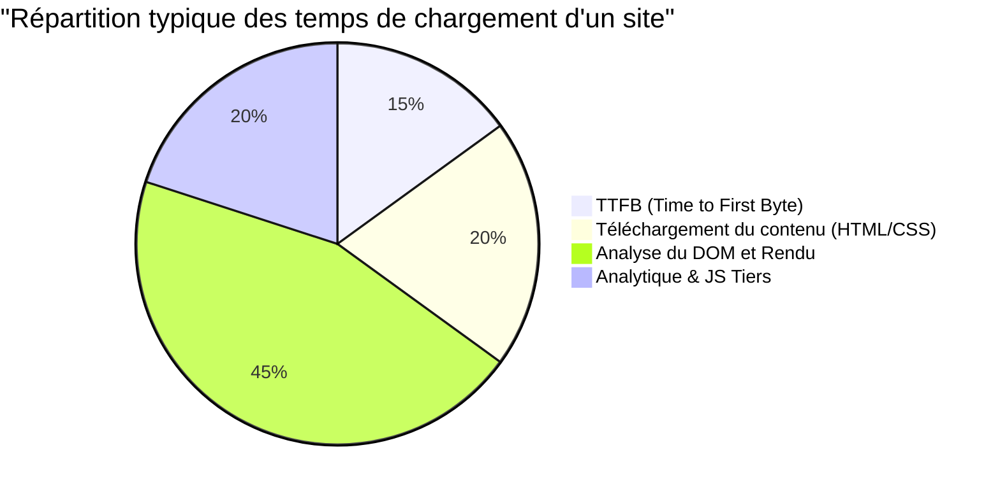

Lors de la gestion d'un site web ou d'un blog, la vitesse d'affichage (performances), les coûts d'exploitation et la sécurité sont des éléments cruciaux. Autrefois, la combinaison d'un CMS dynamique (comme WordPress) et d'un serveur d'hébergement partagé était la norme, mais aujourd'hui, l'architecture appelée "Jamstack" attire beaucoup l'attention. Parmi ses solutions, l'association de "Hugo", un générateur de sites statiques (SSG) ultra-rapide écrit en langage Go, avec des services d'hébergement modernes comme Cloudflare Pages ou GitHub Pages, permet de construire un environnement de blog **totalement gratuit et extrêmement rapide**.

Dans cet article, nous plongerons profondément dans les détails techniques : les étapes concrètes pour publier un site statique utilisant Hugo sur Cloudflare Pages ou GitHub Pages, les différences d'architecture entre ces plateformes, la mise en place d'une CI/CD (Intégration Continue / Déploiement Continu) avec GitHub Actions, l'optimisation des DNS, les stratégies de cache, et enfin l'intégration d'une analyse d'audience respectueuse de la vie privée.

---

## 1. Les bases des générateurs de sites statiques (SSG) et de Jamstack

### 1.1 Pourquoi un site statique ?
Les CMS dynamiques traditionnels (par exemple WordPress) exécutent des requêtes vers une base de données (comme MySQL) à chaque demande d'un utilisateur, et génèrent dynamiquement du HTML côté serveur (avec PHP, par exemple) pour le renvoyer. Bien que cette approche offre une grande flexibilité, elle a une faible résistance aux pics de trafic (les "buzz" ou les attaques DDoS) et a tendance à complexifier l'infrastructure, nécessitant souvent le placement d'un serveur de cache (Redis ou Varnish) en amont.

D'un autre côté, avec un générateur de sites statiques (SSG) adoptant l'architecture Jamstack (JavaScript, APIs, and Markup), tous les fichiers HTML, CSS et JavaScript sont générés à l'avance (lors de la phase de build). Lorsqu'un utilisateur effectue une requête, le serveur web (ou le CDN) se contente de renvoyer les fichiers statiques déjà générés. Cela permet d'obtenir une vitesse fulgurante et une sécurité très robuste.

### 1.2 L'avantage de Hugo
Il existe de nombreuses options pour les SSG telles que Next.js, Gatsby, Jekyll ou Astro, mais la plus grande caractéristique de Hugo est sa **vitesse de compilation (build)**. Bénéficiant du traitement asynchrone et concurrentiel du langage Go, il peut compiler un site de plusieurs milliers ou dizaines de milliers de pages en quelques secondes seulement. Cela réduit considérablement le temps d'attente dans les pipelines CI/CD, ce qui se traduit directement par une amélioration de l'expérience développeur (DX : Developer Experience).

---

## 2. Comparaison des architectures des services d'hébergement

Le prochain défi consiste à déterminer où héberger les fichiers statiques générés par Hugo. Les choix typiques incluent Cloudflare Pages, GitHub Pages et Netlify, mais chacun d'entre eux possède une architecture réseau sous-jacente différente.

### 2.1 CDN et Edge Computing
Toutes ces plateformes distribuent le contenu en utilisant des CDN (Content Delivery Network) répartis mondialement. Cependant, leur facteur de différenciation réside dans leur capacité, au-delà de la simple mise en cache de fichiers statiques, à utiliser "l'informatique en périphérie" (edge computing) pour effectuer le routage des requêtes ou la réécriture des en-têtes directement depuis le PoP (Point of Presence) le plus proche de l'utilisateur.



### 2.2 GitHub Pages
GitHub Pages est un service qui permet de publier des fichiers HTML, CSS et JavaScript directement depuis un dépôt GitHub. En arrière-plan, il utilise des CDN comme Fastly et offre des performances tout à fait satisfaisantes. Toutefois, ses fonctionnalités en tant qu'infrastructure pure sont un peu modestes : il existe des restrictions sur la personnalisation des en-têtes (par exemple, la configuration de `Cache-Control` ou des en-têtes de sécurité) et la configuration des redirections dépend des meta refresh HTML ou des plugins Jekyll.

### 2.3 Cloudflare Pages
Cloudflare Pages est un service d'hébergement de sites statiques construit sur le plus grand réseau Anycast au monde dont Cloudflare est fier (déployé dans plus de 275 villes).
Il offre d'immenses possibilités d'optimisation des performances, telles que la prise en charge standard de HTTP/3 (QUIC), l'optimisation des images et l'intégration de fonctions en périphérie (Cloudflare Workers). De plus, il n'y a pas de facturation pour la bande passante, ce qui permet de l'utiliser gratuitement même en cas d'augmentation fulgurante du trafic.

### 2.4 Netlify
Netlify est un pionnier de la Jamstack et offre une expérience développeur (DX) tout-en-un intégrant des fonctionnalités de formulaire, d'authentification (Identity), de fonctions serverless, etc. Cependant, si vous dépassez la bande passante gratuite (100 Go par mois), des frais de paiement à l'usage élevés sont appliqués. Par conséquent, il est nécessaire de faire attention à la gestion des coûts pour les blogs qui utilisent beaucoup d'images ou de vidéos.

---

## 3. Calcul théorique des performances et de la latence (Modèle mathématique avec LaTeX)

Lors de l'évaluation des performances web, la réduction de la latence est l'indicateur le plus important. Modélisons à quel point la latence est réduite en utilisant un CDN (Edge) par rapport à un accès direct au serveur d'origine.

Soit $C$ le taux de réussite du cache (Cache Hit Ratio), c'est-à-dire la probabilité que la requête de l'utilisateur accède au cache. On a $0 \le C \le 1$.
Soit $L_{origin}$ la latence vers le serveur d'origine, et $L_{edge}$ la latence vers le nœud Edge le plus proche.

La nouvelle latence moyenne $L_{new}$ se calcule avec l'espérance mathématique suivante :

$$ L_{new} = C \times L_{edge} + (1 - C) \times (L_{edge} + L_{origin}) $$

En simplifiant cette équation, nous obtenons :

$$ L_{new} = L_{edge} + (1 - C) \times L_{origin} $$

Par exemple, si un utilisateur à Tokyo accède à un serveur d'origine situé sur la côte est des États-Unis (New York), en tenant compte de la distance physique de la fibre optique et du délai de traitement par les routeurs, $L_{origin}$ sera d'environ 200 ms. En revanche, si on utilise un CDN comme Cloudflare, l'utilisateur peut se connecter à un nœud Edge à Tokyo, ce qui réduit $L_{edge}$ à environ 10 ms.

Si le taux de réussite du cache est de $C = 0.95$ (95 %),

$$ L_{new} = 10 + (1 - 0.95) \times 200 = 10 + 0.05 \times 200 = 10 + 10 = 20 \text{ ms} $$

Ainsi, l'introduction d'un CDN permet de réduire de façon spectaculaire (d'environ 90 %) la latence moyenne, qui passe de 210 ms à 20 ms.

---

## 4. Mise en place d'un pipeline CI/CD avec GitHub Actions

Pour automatiser le processus de mise à jour de notre blog Hugo, nous allons configurer un pipeline CI/CD utilisant GitHub Actions. De cette façon, il suffira de rédiger un article en Markdown localement et de faire un `git push` pour lancer automatiquement le build et le déployer sur Cloudflare Pages ou GitHub Pages.

Le diagramme de séquence ci-dessous illustre le flux global depuis le Push d'un article jusqu'à sa distribution à l'utilisateur.



### 4.1 Configuration du déploiement pour Cloudflare Pages (Direct Upload)

Avec Cloudflare Pages, il existe deux méthodes : lier un dépôt GitHub pour effectuer le build sur l'infrastructure de Cloudflare, ou utiliser « Direct Upload » pour transférer directement les fichiers statiques générés par GitHub Actions. Si vous souhaitez gérer plus strictement la version de Hugo et la combiner avec d'autres tâches (comme les tests ou l'optimisation des images), il est recommandé de compiler sur GitHub Actions et d'utiliser la méthode Direct Upload.

Voici un exemple pratique de fichier `.github/workflows/deploy.yml` pour un déploiement vers Cloudflare Pages.

```yaml
name: "Deploy Hugo site to Cloudflare Pages"

on:
  push:
    branches:
      - "main"
  workflow_dispatch:

jobs:
  build-and-deploy:
    runs-on: "ubuntu-latest"
    steps:
      - name: "Checkout repository"
        uses: "actions/checkout@v4"
        with:
          submodules: "recursive"
          fetch-depth: 0

      - name: "Setup Hugo"
        uses: "peaceiris/actions-hugo@v3"
        with:
          hugo-version: "0.125.0"
          extended: true

      - name: "Build Hugo Site"
        run: "hugo --minify --gc"
        env:
          HUGO_ENVIRONMENT: "production"

      - name: "Deploy to Cloudflare Pages"
        uses: "cloudflare/pages-action@v1"
        with:
          apiToken: ${{ secrets.CLOUDFLARE_API_TOKEN }}
          accountId: ${{ secrets.CLOUDFLARE_ACCOUNT_ID }}
          projectName: "your-project-name"
          directory: "public"
          gitHubToken: ${{ secrets.GITHUB_TOKEN }}
          branch: "main"
```

Dans ce pipeline, l'option `--minify` est utilisée pour minifier le HTML/CSS/JS, et `--gc` est utilisé pour supprimer les fichiers inutiles. Ce sont les bases de l'optimisation des performances.

---

## 5. Examen approfondi de la configuration DNS : Domaine personnalisé et enregistrements CNAME / ALIAS

Lors de l'utilisation d'un domaine personnalisé (par exemple, `kenji.blog`), une configuration appropriée du DNS (Domain Name System) est indispensable.

### 5.1 Restrictions des enregistrements CNAME et Zone Apex
Normalement, lorsque vous pointez un sous-domaine (par exemple `www.kenji.blog`) vers un service externe, vous utilisez un enregistrement `CNAME`. Cependant, selon les spécifications DNS (RFC 1034), il n'est pas possible de configurer un enregistrement `CNAME` pour le domaine racine (également appelé Zone Apex ou domaine nu, par ex. `kenji.blog`). La raison est que la Zone Apex doit contenir obligatoirement un enregistrement SOA (Start of Authority), un enregistrement NS (Name Server) ou un enregistrement MX (Mail Exchange), et la règle dicte que le CNAME ne peut pas coexister avec d'autres enregistrements de ressources.

### 5.2 Solutions : ALIAS / ANAME / CNAME Flattening
Pour résoudre ce problème, les fournisseurs DNS modernes offrent leurs propres fonctionnalités étendues.

- **Enregistrement ALIAS / ANAME** : Le serveur DNS effectue dynamiquement la résolution de nom et renvoie l'enregistrement A final (adresse IP) au client. Des services comme Amazon Route 53 le prennent en charge.
- **CNAME Flattening** : C'est une fonctionnalité offerte par Cloudflare. Elle agit comme si vous aviez configuré un CNAME sur votre Zone Apex, mais le serveur DNS faisant autorité de Cloudflare renvoie de manière transparente au client les adresses IP résolues automatiquement (enregistrements A et AAAA).

Si vous utilisez Cloudflare Pages, déléguer les serveurs de noms de votre domaine à Cloudflare et exploiter ce "CNAME Flattening" sera la configuration la plus transparente et la plus performante.

---

## 6. Stratégies de cache et contrôle des en-têtes HTTP

Une autre clé pour accélérer les sites statiques est la "stratégie de cache". Avec Cloudflare Pages, vous pouvez utiliser un fichier généré (le fichier `_headers`) pour contrôler en détail les en-têtes de réponse HTTP.

### 6.1 Edge Cache vs Cache du navigateur
Il existe deux grands types de cache : le "Edge Cache", conservé du côté du CDN, et le "Cache du navigateur" (Browser Cache), stocké dans le navigateur de l'utilisateur.

Pour les fichiers statiques (images, CSS, JS, etc. dont le nom de fichier inclut un hachage), l'idéal est de les mettre en cache sur le navigateur pendant une longue période. En revanche, pour que les mises à jour des fichiers HTML soient reflétées immédiatement, il est courant de raccourcir (ou de désactiver) le cache du navigateur et de traiter la requête via l'Edge Cache.

Exemple de configuration de `_headers` dans Cloudflare Pages :

```text
# Les fichiers HTML ne sont pas mis en cache par le navigateur et sont validés à chaque fois
/*.html
  Cache-Control: public, max-age=0, must-revalidate

# Les fichiers d'assets (CSS/JS/images) sont mis en cache sur le navigateur pendant 1 an
/assets/*
  Cache-Control: public, max-age=31536000, immutable
/img/*
  Cache-Control: public, max-age=31536000, immutable
```

### 6.2 Formule de calcul pour la réduction des coûts de bande passante
La configuration d'en-têtes de cache appropriés permet de réduire considérablement la quantité de données transférées depuis le serveur (Edge). Le coût mensuel de la bande passante $Cost$ peut être modélisé avec la quantité de transfert de chaque ressource $B_i$, le taux de réussite du cache $C_i$, et le coût unitaire de la bande passante $R$ comme suit :

$$ Cost = \sum_{i=1}^{n} \left( B_i \times (1 - C_i) \times R \right) $$

Étant donné que le transfert de données sortant est gratuit sur Cloudflare ($R = 0$), le coût financier direct sera de $0$. Cependant, si vous utilisez en parallèle d'autres infrastructures comme GitHub Pages, ou si vous utilisez AWS S3 comme backend, maximiser ce taux de réussite de cache $C_i$ sera la clé pour réduire les coûts d'infrastructure.

---

## 7. Analyses d'audience combinant confidentialité et performances

Lors de la gestion d'un blog, l'analyse d'audience (Web Analytics) est essentielle pour savoir combien d'utilisateurs le visitent. Pendant longtemps, Google Analytics (GA4) a été le standard de facto, mais face aux récentes tendances de protection de la vie privée (RGPD, CCPA) et à la suppression progressive des cookies tiers, la situation évolue.

### 7.1 Impact sur les performances web
L'intégration de Google Analytics (plus particulièrement `gtag.js` ou Google Tag Manager) entraîne le chargement et l'exécution de nombreux scripts externes, ce qui a un impact négatif sur les performances (surtout sur le TTFB et le temps de blocage du thread principal).

Prenons le temps de décomposer le temps de chargement d'un site de la façon suivante :



Il n'est pas rare que les outils d'analyse JS tiers représentent environ 20 % à 30 % du temps de chargement global.

### 7.2 Mise en place de Cloudflare Web Analytics
C'est pourquoi les solutions d'analyse "privacy-first" qui n'utilisent pas de cookies (cookieless), comme Cloudflare Web Analytics ou Plausible Analytics, attirent l'attention.

Cloudflare Web Analytics fonctionne simplement en intégrant un extrait de JavaScript très léger. Il n'émet pas de cookies, vous n'avez donc pas besoin d'installer une bannière de consentement aux cookies contraignante.

Son implémentation dans Hugo est également très simple. Il vous suffit d'ajouter l'extrait de code fourni dans `layouts/partials/head.html` ou `layouts/partials/analytics.html`.

```html
{{ if eq hugo.Environment "production" }}
<!-- Cloudflare Web Analytics -->
<script defer src='https://static.cloudflareinsights.com/beacon.min.js' data-cf-beacon='{"token": "YOUR_CLOUDFLARE_BEACON_TOKEN"}'></script>
<!-- End Cloudflare Web Analytics -->
{{ end }}
```

L'ajout de l'attribut `defer` permet de charger le script de manière asynchrone sans bloquer l'analyse du document HTML, et de l'exécuter après la construction du DOM. Cela permet de minimiser l'impact sur la vitesse d'affichage initiale (LCP : Largest Contentful Paint et FCP : First Contentful Paint).

---

## 8. Conclusion et bonnes pratiques

Dans le cadre de l'exploitation d'un site statique utilisant Hugo, l'adoption de plateformes d'hébergement modernes telles que Cloudflare Pages ou GitHub Pages offre d'énormes avantages en termes de rapport coût-performance, de vitesse d'affichage et de sécurité.

1. **Build ultra-rapide** : Tirer parti de la rapidité de Hugo pour minimiser le temps d'exécution des pipelines CI/CD (GitHub Actions).
2. **Distribution via l'Edge** : Utiliser le réseau Edge de Cloudflare pour distribuer le contenu aux utilisateurs du monde entier avec une latence de l'ordre de la milliseconde.
3. **Configuration DNS appropriée** : Exploiter le CNAME Flattening pour exploiter la Zone Apex (domaine personnalisé) de manière sécurisée et rapide.
4. **Optimisation des stratégies de cache** : Utiliser `_headers` pour séparer correctement le cache du navigateur et l'Edge Cache en fonction du type de ressource.
5. **Analytique légère** : Intégrer des outils comme Cloudflare Web Analytics pour ne pas dégrader les performances tout en respectant la vie privée.

En combinant ces éléments, vous pouvez créer gratuitement un système de blog évolutif et robuste, capable de supporter des trafics massifs atteignant des millions de pages vues (PV) par mois. Si vous envisagez de lancer un blog technique, un site d'entreprise ou un site portfolio, je vous invite vivement à essayer cette configuration Jamstack + Hugo + Cloudflare Pages.
