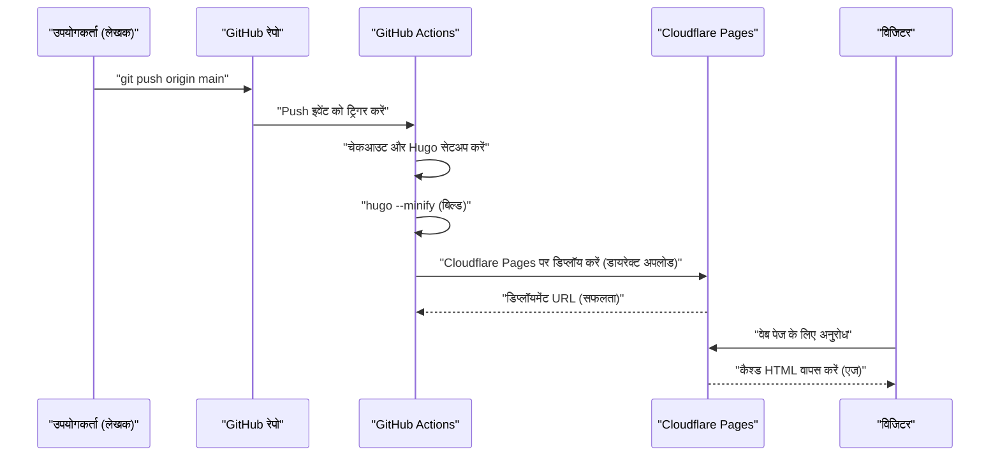
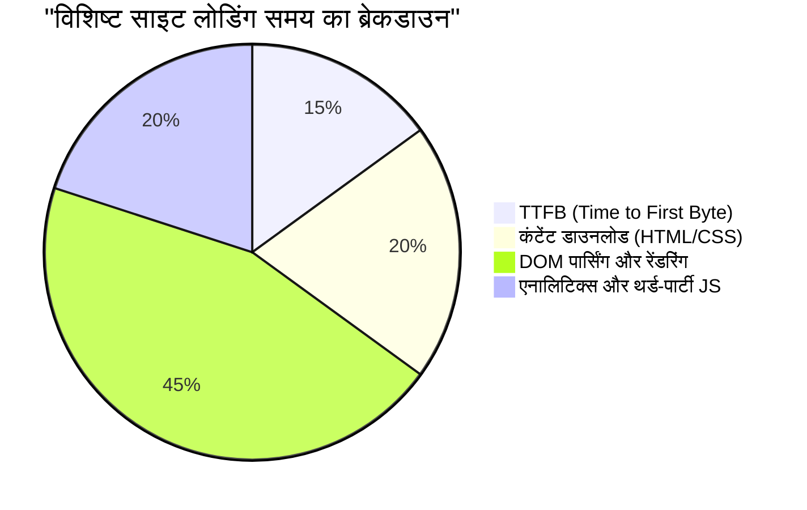

Webसाइट या ब्लॉग को चलाने में, प्रदर्शन (लोडिंग स्पीड), संचालन लागत, और सुरक्षा बहुत महत्वपूर्ण कारक हैं। अतीत में, WordPress जैसे डायनेमिक CMS (कंटेंट मैनेजमेंट सिस्टम) और रेंटल सर्वर का संयोजन मुख्यधारा था, लेकिन वर्तमान में "Jamstack" नामक आर्किटेक्चर बहुत ध्यान आकर्षित कर रहा है। उनमें से, Go भाषा में बने एक सुपर फास्ट स्टैटिक साइट जनरेटर (SSG) "Hugo" और Cloudflare Pages या GitHub Pages जैसी आधुनिक होस्टिंग सेवाओं को मिलाकर, **पूरी तरह से मुफ़्त और सुपर-फ़ास्ट** ब्लॉग वातावरण बनाना संभव है।

इस लेख में, हम Hugo का उपयोग करके बनी स्टैटिक साइट को Cloudflare Pages या GitHub Pages पर पब्लिश करने के विशिष्ट चरण, प्रत्येक प्लेटफ़ॉर्म के आर्किटेक्चर के बीच अंतर, GitHub Actions का उपयोग करके CI/CD (निरंतर एकीकरण / निरंतर परिनियोजन) का निर्माण, DNS का अनुकूलन, कैशिंग रणनीति, और गोपनीयता को ध्यान में रखते हुए एक्सेस एनालिटिक्स को लागू करने तक के तकनीकी दृष्टिकोण से बहुत गहराई से समझाएंगे।

---

## 1. स्टैटिक साइट जनरेटर (SSG) और Jamstack के मूल सिद्धांत

### 1.1 स्टैटिक साइट क्यों?
पारंपरिक डायनेमिक CMS (उदा: WordPress) उपयोगकर्ताओं के हर अनुरोध पर डेटाबेस (जैसे MySQL) पर क्वेरी भेजते हैं, और सर्वर-साइड (जैसे PHP) पर गतिशील रूप से HTML जनरेट करके वापस करते हैं। यह दृष्टिकोण बहुत लचीला है, लेकिन ट्रैफ़िक में अचानक वृद्धि (जैसे कि बज़ या DDoS हमले) के खिलाफ इसकी सहनशीलता कम है, और बुनियादी ढांचा (इन्फ्रास्ट्रक्चर) जटिल हो जाता है, जैसे कि सामने एक कैश सर्वर (Redis या Varnish) रखना पड़ता है।

दूसरी ओर, Jamstack (JavaScript, APIs, and Markup) आर्किटेक्चर को अपनाने वाले स्टैटिक साइट जनरेटर्स (SSG) में, सभी HTML फ़ाइलें, CSS और JavaScript पहले से (बिल्ड के समय) जनरेट कर लिए जाते हैं। उपयोगकर्ता के अनुरोधों के लिए, वेब सर्वर (या CDN) पहले से जनरेट की गई स्टैटिक फ़ाइलों को सीधे वापस कर देता है, जिससे अभूतपूर्व गति और मजबूत सुरक्षा प्राप्त होती है।

### 1.2 Hugo की श्रेष्ठता
SSG में Next.js, Gatsby, Jekyll, Astro जैसे कई विकल्प हैं, लेकिन Hugo की सबसे बड़ी विशेषता इसकी **बिल्ड स्पीड** है। Go भाषा की समवर्ती प्रसंस्करण (कंकरेंसी) का लाभ उठाते हुए, हजारों से लेकर हजारों पेजों वाली साइटों को भी कुछ ही सेकंड में बिल्ड किया जा सकता है। यह CI/CD पाइपलाइन में प्रतीक्षा समय को काफी कम करता है और सीधे डेवलपर अनुभव (DX: Developer Experience) को बेहतर बनाता है।

---

## 2. होस्टिंग सेवाओं के आर्किटेक्चर की तुलना

Hugo द्वारा जनरेट की गई स्टैटिक फ़ाइलों को कहाँ होस्ट करना है, यह अगला काम है। प्रतिनिधि विकल्पों के रूप में Cloudflare Pages, GitHub Pages और Netlify शामिल हैं, लेकिन इनके पीछे का नेटवर्क आर्किटेक्चर अलग-अलग है।

### 2.1 CDN और एज कंप्यूटिंग
ये सभी प्लेटफ़ॉर्म वैश्विक रूप से वितरित CDN (कंटेंट डिलीवरी नेटवर्क) का उपयोग करके कंटेंट वितरित करते हैं। हालाँकि, केवल स्टैटिक फ़ाइलों को कैश करने के अलावा, उपयोगकर्ता के सबसे नज़दीकी PoP (Point of Presence) पर अनुरोधों की रूटिंग और हेडर को फिर से लिखने के लिए "एज कंप्यूटिंग" का निष्पादन एक महत्वपूर्ण विभेदक कारक बन गया है।

```mermaid
graph TD
    A["उपयोगकर्ता (टोक्यो)"] -->|कम विलंबता (Low Latency)| B["एज नोड (NRT)"]
    C["उपयोगकर्ता (न्यूयॉर्क)"] -->|कम विलंबता (Low Latency)| D["एज नोड (EWR)"]
    E["उपयोगकर्ता (लंदन)"] -->|कम विलंबता (Low Latency)| F["एज नोड (LHR)"]
    B --> G["ओरिजिन स्टोरेज / ऑब्जेक्ट स्टोर"]
    D --> G
    F --> G
```

### 2.2 GitHub Pages
GitHub Pages एक ऐसी सेवा है जो आपको सीधे GitHub रिपॉजिटरी से HTML, CSS और JavaScript फ़ाइलों को प्रकाशित करने की अनुमति देती है। इसके पीछे Fastly जैसे CDN का उपयोग किया जाता है, जो पर्याप्त प्रदर्शन देता है। हालाँकि, हेडर के कस्टमाइज़ेशन (उदा: `Cache-Control` और सुरक्षा हेडर की सेटिंग) पर प्रतिबंध हैं, और रीडायरेक्ट सेटिंग्स के लिए HTML के meta refresh या Jekyll प्लगइन्स पर निर्भरता जैसी सीमाएँ हैं, इसलिए एक शुद्ध बुनियादी ढांचे के रूप में इसके कार्य थोड़े सीमित हैं।

### 2.3 Cloudflare Pages
Cloudflare Pages एक स्टैटिक साइट होस्टिंग सेवा है जो Cloudflare के दुनिया के सबसे बड़े Anycast नेटवर्क (275 से अधिक शहरों में फैला) के ऊपर बनाई गई है।
HTTP/3 (QUIC) का मानक समर्थन, इमेज ऑप्टिमाइज़ेशन, एज फंक्शंस (Cloudflare Workers) का एकीकरण, आदि जैसी जबरदस्त प्रदर्शन ट्यूनिंग संभव है। इसके अलावा, बैंडविड्थ के लिए कोई शुल्क नहीं है, जिसका अर्थ है कि ट्रैफ़िक कितना भी बढ़ जाए, इसे मुफ़्त में संचालित किया जा सकता है, जो एक बहुत बड़ा फायदा है।

### 2.4 Netlify
Netlify Jamstack का अग्रणी (पायनियर) है, और यह फॉर्म कार्यक्षमता, प्रमाणीकरण (Identity), सर्वरलेस फ़ंक्शंस आदि को एकीकृत करने वाला ऑल-इन-वन DX प्रदान करता है। हालाँकि, यदि आप मुफ़्त टियर बैंडविड्थ (100GB/माह) को पार करते हैं, तो उच्च पे-एज-यू-गो शुल्क लग सकता है, इसलिए इमेजेज़ या वीडियोज़ का अत्यधिक उपयोग करने वाले ब्लॉग्स में लागत प्रबंधन पर ध्यान देना आवश्यक है।

---

## 3. प्रदर्शन और विलंबता की सैद्धांतिक गणना (LaTeX द्वारा गणितीय मॉडल)

वेब प्रदर्शन का मूल्यांकन करते समय, विलंबता (Latency) में कमी सबसे महत्वपूर्ण मीट्रिक है। आइए हम एक मॉडल बनाएं कि ओरिजिन सर्वर को सीधे एक्सेस करने की तुलना में CDN (एज) का उपयोग करके विलंबता को कितना कम किया जा सकता है।

मान लें कि उपयोगकर्ता के अनुरोध के कैश से टकराने (हिट होने) की संभावना "कैश हिट अनुपात (Cache Hit Ratio)" है और इसे $C$ के रूप में दर्शाएं। $0 \le C \le 1$ है।
ओरिजिन सर्वर तक विलंबता को $L_{origin}$ और निकटतम एज नोड तक विलंबता को $L_{edge}$ मान लें।

नई औसत विलंबता $L_{new}$ की गणना निम्नलिखित अपेक्षित मूल्य (expected value) के रूप में की जाती है:

$$ L_{new} = C \times L_{edge} + (1 - C) \times (L_{edge} + L_{origin}) $$

इस सूत्र को सरल करने पर निम्नलिखित प्राप्त होता है:

$$ L_{new} = L_{edge} + (1 - C) \times L_{origin} $$

उदाहरण के लिए, यदि टोक्यो का कोई उपयोगकर्ता संयुक्त राज्य अमेरिका के पूर्वी तट (न्यूयॉर्क) पर एक ओरिजिन सर्वर तक पहुँचता है, तो ऑप्टिकल फाइबर की भौतिक दूरी और राउटर पर प्रोसेसिंग विलंब को देखते हुए, $L_{origin}$ लगभग 200 ms होगा। दूसरी ओर, यदि Cloudflare जैसे CDN का उपयोग किया जाता है, तो यह टोक्यो में एज नोड से जुड़ सकता है, इसलिए $L_{edge}$ लगभग 10 ms तक कम हो जाएगा।

मान लें कि कैश हिट अनुपात $C = 0.95$ (95%) है,

$$ L_{new} = 10 + (1 - 0.95) \times 200 = 10 + 0.05 \times 200 = 10 + 10 = 20 \text{ ms} $$

इस तरह, CDN को लागू करके औसत विलंबता को 210 ms से घटाकर 20 ms (लगभग 90%) तक कम करना संभव हो जाता है।

---

## 4. GitHub Actions का उपयोग करके CI/CD पाइपलाइन का निर्माण

Hugo ब्लॉग की अपडेट प्रक्रिया को स्वचालित (ऑटोमेट) करने के लिए, हम GitHub Actions का उपयोग करके CI/CD पाइपलाइन का निर्माण करेंगे। इससे आप बस स्थानीय रूप से (लोकल) Markdown में लेख लिख सकते हैं और `git push` कर सकते हैं, बिल्ड अपने आप चलेगा और इसे Cloudflare Pages या GitHub Pages पर तैनात (डिप्लॉय) कर दिया जाएगा।

निम्नलिखित अनुक्रम आरेख (sequence diagram) एक लेख को पुश करने से लेकर उपयोगकर्ताओं तक पहुँचाए जाने तक के पूरे प्रवाह को दर्शाता है।



### 4.1 Cloudflare Pages के लिए डिप्लॉयमेंट सेटिंग्स (डायरेक्ट अपलोड)

Cloudflare Pages पर, आपके पास GitHub रिपॉजिटरी को लिंक करके Cloudflare के इंफ्रास्ट्रक्चर पर बिल्ड करने का विकल्प है, या GitHub Actions का उपयोग करके बिल्ड की गई स्टैटिक फ़ाइलों को "डायरेक्ट अपलोड (Direct Upload)" करने का विकल्प है। यदि आप Hugo के संस्करणों को अधिक सख्ती से प्रबंधित करना चाहते हैं और इसे अन्य कार्यों (जैसे परीक्षण या इमेज ऑप्टिमाइज़ेशन) के साथ जोड़ना चाहते हैं, तो हम GitHub Actions पर बिल्ड करने और डायरेक्ट अपलोड का उपयोग करने की सलाह देते हैं।

नीचे `.github/workflows/deploy.yml` का एक व्यावहारिक उदाहरण है, जो Cloudflare Pages पर डिप्लॉय करने के लिए है।

```yaml
name: "Deploy Hugo site to Cloudflare Pages"

on:
  push:
    branches:
      - "main"
  workflow_dispatch:

jobs:
  build-and-deploy:
    runs-on: "ubuntu-latest"
    steps:
      - name: "Checkout repository"
        uses: "actions/checkout@v4"
        with:
          submodules: "recursive"
          fetch-depth: 0

      - name: "Setup Hugo"
        uses: "peaceiris/actions-hugo@v3"
        with:
          hugo-version: "0.125.0"
          extended: true

      - name: "Build Hugo Site"
        run: "hugo --minify --gc"
        env:
          HUGO_ENVIRONMENT: "production"

      - name: "Deploy to Cloudflare Pages"
        uses: "cloudflare/pages-action@v1"
        with:
          apiToken: ${{ secrets.CLOUDFLARE_API_TOKEN }}
          accountId: ${{ secrets.CLOUDFLARE_ACCOUNT_ID }}
          projectName: "your-project-name"
          directory: "public"
          gitHubToken: ${{ secrets.GITHUB_TOKEN }}
          branch: "main"
```

इस पाइपलाइन में, `--minify` विकल्प के माध्यम से HTML/CSS/JS को छोटा (मिनिफ़ाई) किया गया है, और `--gc` के माध्यम से अनावश्यक फ़ाइलों को हटा दिया जाता है। ये प्रदर्शन अनुकूलन (परफॉरमेंस ऑप्टिमाइज़ेशन) की मूल बातें हैं।

---

## 5. DNS सेटिंग्स की गहराई में: कस्टम डोमेन और CNAME / ALIAS रिकॉर्ड

यदि आप कस्टम डोमेन (जैसे: `kenji.blog`) का उपयोग करना चाहते हैं, तो उचित DNS (डोमेन नेम सिस्टम) कॉन्फ़िगरेशन आवश्यक है।

### 5.1 CNAME रिकॉर्ड सीमाएँ और Zone Apex
आमतौर पर, जब आप एक सबडोमेन (उदा: `www.kenji.blog`) को किसी बाहरी सेवा की ओर निर्देशित करते हैं, तो आप `CNAME` रिकॉर्ड का उपयोग करते हैं। हालाँकि, DNS विशिष्टताओं (RFC 1034) के अनुसार, रूट डोमेन (Zone Apex, या नेकेड डोमेन, उदा: `kenji.blog`) के लिए `CNAME` रिकॉर्ड सेट नहीं किया जा सकता है। इसका कारण यह है कि Zone Apex में SOA (Start of Authority) रिकॉर्ड, NS (Name Server) रिकॉर्ड, या MX (Mail Exchange) रिकॉर्ड होना आवश्यक है, और यह नियम है कि CNAME अन्य रिसोर्स रिकॉर्ड के साथ सह-अस्तित्व में नहीं हो सकता है।

### 5.2 समाधान: ALIAS / ANAME / CNAME Flattening
इस समस्या को हल करने के लिए, आधुनिक DNS प्रदाता अपने स्वयं के विस्तार (एक्सटेंशन) प्रदान करते हैं।

- **ALIAS / ANAME रिकॉर्ड**: DNS सर्वर साइड पर गतिशील रूप से नाम का रिज़ॉल्यूशन करता है और अंतिम A रिकॉर्ड (IP एड्रेस) को क्लाइंट को वापस करता है। Amazon Route 53 आदि इसका समर्थन करते हैं।
- **CNAME Flattening**: यह Cloudflare द्वारा प्रदान की जाने वाली एक सुविधा है। ऐसा व्यवहार करते हुए जैसे कि Zone Apex पर CNAME सेट किया गया हो, Cloudflare का आधिकारिक DNS सर्वर पारदर्शी रूप से क्लाइंट को IP एड्रेसेस (A रिकॉर्ड्स और AAAA रिकॉर्ड्स) लौटाता है जिसे उसने स्वचालित रूप से हल किया है।

जब आप Cloudflare Pages का उपयोग करते हैं, तो सबसे निर्बाध और उच्च-प्रदर्शन कॉन्फ़िगरेशन यह है कि डोमेन के नेम सर्वर को Cloudflare को सौंप दिया जाए और इस "CNAME Flattening" का लाभ उठाया जाए।

---

## 6. कैशिंग रणनीति और HTTP हेडर नियंत्रण

स्टैटिक साइट को गति देने के लिए "कैशिंग रणनीति (Caching Strategy)" एक और महत्वपूर्ण पहलू है। Cloudflare Pages में, आप उत्पन्न फ़ाइलों (`_headers` फ़ाइल) का उपयोग करके HTTP रिस्पांस हेडर को विस्तार से नियंत्रित कर सकते हैं।

### 6.1 Edge Cache बनाम Browser Cache
कैश को मोटे तौर पर दो प्रकारों में विभाजित किया जा सकता है: "Edge Cache" जिसे CDN पक्ष पर रखा जाता है, और "Browser Cache" जिसे उपयोगकर्ता के ब्राउज़र में संग्रहीत किया जाता है।

स्टैटिक फ़ाइलों (जैसे इमेज, CSS, JS, आदि जिनके फ़ाइल नाम में हैश होता है) को लंबे समय तक ब्राउज़र में कैश करना आदर्श है। दूसरी ओर, HTML फ़ाइलों में अपडेट को तुरंत दर्शाने के लिए, ब्राउज़र कैश को छोटा करना (या अक्षम करना) और इसे एज कैश के माध्यम से संभालना एक सामान्य कॉन्फ़िगरेशन है।

Cloudflare Pages में `_headers` का कॉन्फ़िगरेशन उदाहरण:

```text
# HTML फ़ाइलों को ब्राउज़र द्वारा कैश नहीं किया जाएगा, उन्हें हर बार मान्य किया जाएगा
/*.html
  Cache-Control: public, max-age=0, must-revalidate

# एसेट फ़ाइलों (CSS/JS/इमेज) को ब्राउज़र में 1 वर्ष के लिए कैश किया जाएगा
/assets/*
  Cache-Control: public, max-age=31536000, immutable
/img/*
  Cache-Control: public, max-age=31536000, immutable
```

### 6.2 बैंडविड्थ लागत में कमी के लिए गणना सूत्र
उचित कैश हेडर सेट करके, आप सर्वर (एज) से डेटा ट्रांसफर को काफी कम कर सकते हैं। मासिक बैंडविड्थ लागत $Cost$ को प्रत्येक संसाधन के ट्रांसफर वॉल्यूम $B_i$, कैश हिट अनुपात $C_i$ और बैंडविड्थ यूनिट मूल्य $R$ का उपयोग करके निम्न मॉडल द्वारा दर्शाया गया है:

$$ Cost = \sum_{i=1}^{n} \left( B_i \times (1 - C_i) \times R \right) $$

चूँकि Cloudflare मुफ़्त आउटबाउंड डेटा ट्रांसफर ($R = 0$) प्रदान करता है, इसलिए प्रत्यक्ष वित्तीय लागत $0$ है। हालाँकि, यदि आप GitHub Pages जैसे अन्य बुनियादी ढांचे के साथ काम करते हैं, या बैकेंड के रूप में AWS S3 आदि का उपयोग চৈতন্য करते हैं, तो इस कैश हिट अनुपात $C_i$ को अधिकतम करना बुनियादी ढांचा लागत को कम करने की कुंजी है।

---

## 7. एक्सेस एनालिटिक्स जो गोपनीयता और प्रदर्शन को संतुलित करता है

एक ब्लॉग चलाते समय, एक्सेस एनालिटिक्स (Web Analytics) यह जानने के लिए आवश्यक है कि कितने उपयोगकर्ता साइट पर आ रहे हैं। Google Analytics (GA4) लंबे समय से एक मानक रहा है, लेकिन हालिया गोपनीयता सुरक्षा प्रवृत्तियों (GDPR, CCPA) और थर्ड-पार्टी कुकीज़ के उन्मूलन के साथ स्थिति बदल रही है।

### 7.1 वेब प्रदर्शन पर प्रभाव
Google Analytics (विशेष रूप से `gtag.js` या Google Tag Manager) को लागू करने से कई बाहरी स्क्रिप्ट लोड और निष्पादित होती हैं, जो प्रदर्शन को (विशेष रूप से TTFB और मुख्य थ्रेड ब्लॉकिंग समय को) नकारात्मक रूप से प्रभावित करता है।

आइए साइट के लोड समय को तोड़कर समझें:



थर्ड-पार्टी JS एनालिटिक्स टूल के लिए कुल लोड समय का लगभग 20% से 30% लेना असामान्य नहीं है।

### 7.2 Cloudflare Web Analytics को लागू करना
यहीं पर कुकी-रहित (Cookieless), गोपनीयता-प्रथम एक्सेस एनालिटिक्स जैसे कि Cloudflare Web Analytics और Plausible Analytics ध्यान आकर्षित कर रहे हैं।

Cloudflare Web Analytics एक बहुत ही हल्के JavaScript स्निपेट को एम्बेड करके काम करता है और यह कुकीज़ जारी नहीं करता है, इसलिए आपको कष्टप्रद कुकी सहमति बैनर (Cookie Consent Banner) सेट करने की आवश्यकता नहीं है।

Hugo में इसे लागू करना भी बहुत आसान है। बस दिए गए स्निपेट को `layouts/partials/head.html` या `layouts/partials/analytics.html` में जोड़ें।

```html
{{ if eq hugo.Environment "production" }}
<!-- Cloudflare Web Analytics -->
<script defer src='https://static.cloudflareinsights.com/beacon.min.js' data-cf-beacon='{"token": "YOUR_CLOUDFLARE_BEACON_TOKEN"}'></script>
<!-- End Cloudflare Web Analytics -->
{{ end }}
```

`defer` एट्रिब्यूट (attribute) जोड़ने से, स्क्रिप्ट को HTML पार्सिंग को रोके बिना अतुल्यकालिक (asynchronously) रूप से लोड किया जा सकता है, और DOM निर्माण के बाद निष्पादित किया जा सकता है। यह प्रारंभिक प्रदर्शन गति (LCP: Largest Contentful Paint और FCP: First Contentful Paint) पर प्रभाव को कम करता है।

---

## 8. निष्कर्ष और सर्वोत्तम अभ्यास (Best Practices)

Hugo का उपयोग करके स्टैटिक साइट को चलाने के लिए Cloudflare Pages और GitHub Pages जैसे आधुनिक होस्टिंग प्लेटफ़ॉर्म का चयन करना लागत प्रदर्शन, डिस्प्ले स्पीड और सुरक्षा के सभी पहलुओं में भारी लाभ प्रदान करता है।

1. **सुपर-फ़ास्ट बिल्ड**: Hugo की उच्च गति का लाभ उठाएं और CI/CD पाइपलाइन (GitHub Actions) के निष्पादन समय को कम करें।
2. **एज पर डिलीवरी**: दुनिया भर के उपयोगकर्ताओं को मिलीसेकंड विलंबता के साथ कंटेंट वितरित करने के लिए Cloudflare के एज नेटवर्क का उपयोग करें।
3. **उचित DNS कॉन्फ़िगरेशन**: Zone Apex (कस्टम डोमेन) को सुरक्षित और तेज़ी से संचालित करने के लिए CNAME Flattening का लाभ उठाएं।
4. **कैशिंग रणनीति का अनुकूलन**: संसाधन प्रकार (रिसर्च टाइप) द्वारा ब्राउज़र कैश और एज कैश को उचित रूप से अलग करने के लिए `_headers` का उपयोग करें।
5. **हल्के एनालिटिक्स**: Cloudflare Web Analytics आदि लागू करें, जो गोपनीयता को ध्यान में रखता है लेकिन प्रदर्शन से समझौता नहीं करता है।

इन्हें मिलाकर, आप मुफ़्त में एक स्केलेबल और मजबूत ब्लॉग सिस्टम बना सकते हैं जो हर महीने लाखों पेज-व्यू के बड़े पैमाने पर ट्रैफ़िक का सामना कर सकता है। यदि आप एक तकनीकी ब्लॉग, कॉर्पोरेट साइट या पोर्टफोलियो साइट शुरू करने पर विचार कर रहे हैं, तो कृपया Jamstack + Hugo + Cloudflare Pages के इस संयोजन को आज़माएं।
