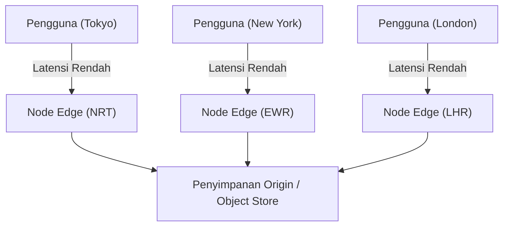
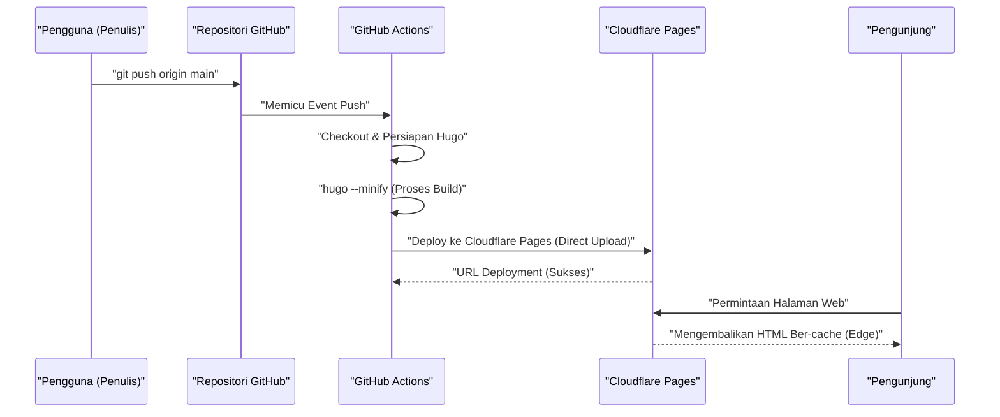
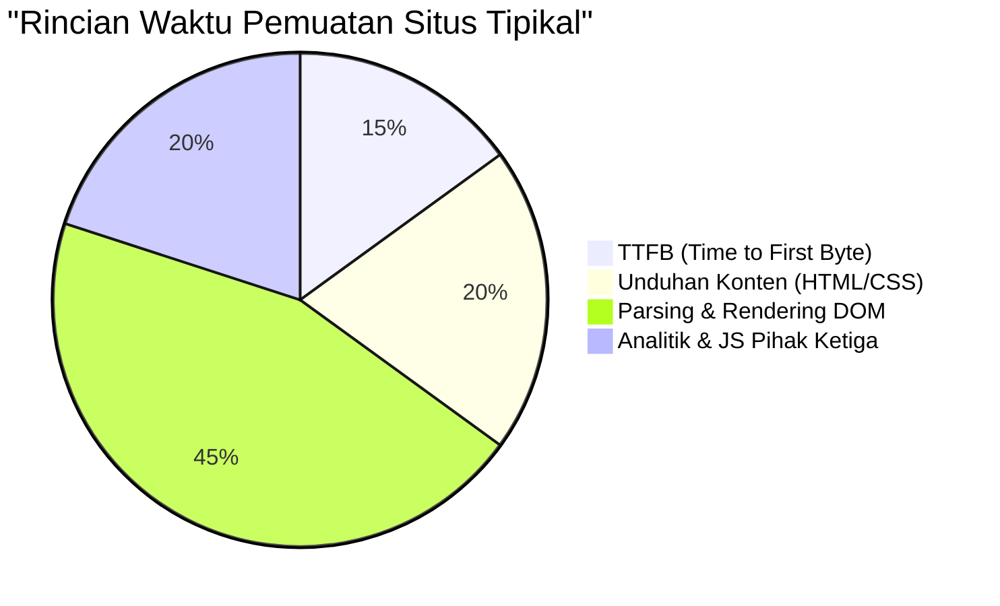

Dalam mengelola situs web atau blog, kecepatan pemuatan (kinerja), biaya operasional, dan keamanan adalah faktor yang sangat penting. Di masa lalu, kombinasi CMS (Content Management System) dinamis seperti WordPress dan server sewaan adalah yang utama, tetapi saat ini, arsitektur yang disebut "Jamstack" menarik banyak perhatian. Di antaranya, menggabungkan "Hugo", generator situs statis (SSG) super cepat yang dibuat dalam bahasa Go, dengan layanan hosting modern seperti Cloudflare Pages atau GitHub Pages memungkinkan Anda membangun lingkungan blog yang **sepenuhnya gratis dan sangat cepat**.

Artikel ini akan membahas secara mendalam dari perspektif teknis langkah-langkah spesifik untuk memublikasikan situs statis berbasis Hugo di Cloudflare Pages atau GitHub Pages, perbedaan arsitektur di setiap platform, pengaturan CI/CD (Continuous Integration / Continuous Deployment) menggunakan GitHub Actions, pengoptimalan DNS, strategi cache, hingga penerapan analisis akses yang mengutamakan privasi.

---

## 1. Dasar-dasar Generator Situs Statis (SSG) dan Jamstack

### 1.1 Mengapa Situs Statis?
CMS dinamis konvensional (misalnya WordPress) menjalankan kueri ke basis data (seperti MySQL) setiap kali ada permintaan dari pengguna, kemudian secara dinamis menghasilkan HTML di sisi server (seperti PHP) dan mengembalikannya. Metode ini menawarkan fleksibilitas tinggi, namun kurang tahan terhadap lonjakan lalu lintas yang tiba-tiba (seperti saat viral atau serangan DDoS), dan arsitektur infrastrukturnya cenderung menjadi rumit karena memerlukan server cache (seperti Redis atau Varnish) di bagian depan.

Sebaliknya, Generator Situs Statis (SSG) yang mengadopsi arsitektur Jamstack (JavaScript, APIs, and Markup) akan menghasilkan (saat proses build) seluruh file HTML, CSS, dan JavaScript terlebih dahulu. Untuk setiap permintaan pengguna, server web (atau CDN) hanya akan mengembalikan file statis yang sudah dihasilkan tersebut, sehingga mampu memberikan kecepatan luar biasa dan keamanan yang kuat.

### 1.2 Keunggulan Hugo
Ada berbagai pilihan SSG seperti Next.js, Gatsby, Jekyll, dan Astro, namun fitur utama Hugo adalah **kecepatan build-nya**. Berkat pemrosesan konkurensi (pemrosesan paralel) dari bahasa Go, build dapat diselesaikan hanya dalam beberapa detik meskipun situs tersebut memiliki ribuan hingga puluhan ribu halaman. Hal ini secara signifikan mengurangi waktu tunggu pada pipeline CI/CD dan secara langsung meningkatkan pengalaman developer (DX: Developer Experience).

---

## 2. Perbandingan Arsitektur Layanan Hosting

Tantangan selanjutnya adalah di mana Anda akan menghosting file statis yang dihasilkan oleh Hugo. Pilihan yang umum di antaranya adalah Cloudflare Pages, GitHub Pages, dan Netlify, masing-masing memiliki arsitektur jaringan yang berbeda di balik layarnya.

### 2.1 CDN dan Komputasi Edge (Edge Computing)
Semua platform ini mendistribusikan konten menggunakan CDN (Content Delivery Network) yang tersebar secara global. Namun, faktor pembedanya bukanlah sekadar menyimpan cache file statis, melainkan apakah mereka mampu mengeksekusi routing permintaan atau memodifikasi header di PoP (Point of Presence) terdekat dengan pengguna melalui "komputasi edge".



### 2.2 GitHub Pages
GitHub Pages adalah layanan yang memungkinkan Anda mempublikasikan file HTML, CSS, dan JavaScript langsung dari repositori GitHub. Di belakangnya digunakan CDN seperti Fastly, yang memberikan kinerja yang memadai. Namun, fungsi infrastruktur murninya agak terbatas, karena terdapat batasan dalam menyesuaikan header (misalnya mengatur `Cache-Control` atau header keamanan), dan pengaturan pengalihan (redirect) bergantung pada meta refresh HTML atau plugin Jekyll.

### 2.3 Cloudflare Pages
Cloudflare Pages adalah layanan hosting situs statis yang dibangun di atas jaringan Anycast berskala global milik Cloudflare (tersebar di lebih dari 275 kota).
Layanan ini menawarkan penyesuaian kinerja yang luar biasa, termasuk dukungan standar untuk HTTP/3 (QUIC), optimasi gambar, dan integrasi dengan fungsi edge (Cloudflare Workers). Selain itu, tidak ada biaya bandwidth, sehingga keunggulan terbesarnya adalah Anda dapat menjalankannya secara gratis, tidak peduli seberapa besar lonjakan lalu lintas yang terjadi.

### 2.4 Netlify
Netlify adalah pionir di bidang Jamstack, menawarkan DX (Developer Experience) all-in-one yang mengintegrasikan fungsionalitas formulir, otentikasi (Identity), hingga fungsi serverless. Namun, Anda harus berhati-hati dengan manajemen biaya, karena apabila penggunaan bandwidth melebihi batas gratis (100GB per bulan), tagihan berdasarkan penggunaan dapat menjadi sangat mahal, terutama bagi blog yang banyak memuat gambar dan video.

---

## 3. Perhitungan Teoretis Kinerja dan Latensi (Model Matematis dengan LaTeX)

Dalam mengevaluasi kinerja web, mengurangi latensi (waktu tunda) adalah indikator terpenting. Mari kita buat model matematika tentang seberapa banyak latensi yang dikurangi saat menggunakan CDN (edge) dibandingkan dengan mengakses server origin secara langsung.

Misalkan probabilitas permintaan pengguna untuk menemukan cache (Cache Hit Ratio) adalah $C$. Maka $0 \le C \le 1$.
Misalkan latensi ke server origin adalah $L_{origin}$, dan latensi ke node edge terdekat adalah $L_{edge}$.

Rata-rata latensi baru $L_{new}$ dapat dihitung dengan nilai ekspektasi berikut:

$$ L_{new} = C \times L_{edge} + (1 - C) \times (L_{edge} + L_{origin}) $$

Jika disederhanakan, persamaannya menjadi:

$$ L_{new} = L_{edge} + (1 - C) \times L_{origin} $$

Sebagai contoh, ketika seorang pengguna di Tokyo mengakses server origin yang berada di pantai timur Amerika Serikat (New York), mengingat jarak fisik kabel serat optik dan latensi pemrosesan di router, $L_{origin}$ akan berkisar sekitar 200 md (milidetik). Sementara itu, jika menggunakan CDN seperti Cloudflare, karena pengguna akan terhubung ke node edge di Tokyo, $L_{edge}$ akan berkurang menjadi sekitar 10 md.

Jika kita asumsikan rasio cache hit $C = 0.95$ (95%), maka:

$$ L_{new} = 10 + (1 - 0.95) \times 200 = 10 + 0.05 \times 200 = 10 + 10 = 20 \text{ ms} $$

Dengan demikian, pengenalan CDN dapat secara dramatis mengurangi (sekitar 90%) rata-rata latensi dari 210 md menjadi 20 md.

---

## 4. Membangun Pipeline CI/CD dengan GitHub Actions

Untuk mengotomatiskan proses pembaruan blog Hugo, kita akan membangun pipeline CI/CD menggunakan GitHub Actions. Melalui pengaturan ini, cukup dengan menulis artikel Markdown di lokal dan menjalankan `git push`, proses build akan berjalan otomatis dan langsung di-deploy ke Cloudflare Pages atau GitHub Pages.

Diagram urutan (sequence diagram) berikut ini menunjukkan alur keseluruhan dari mulai mem-push artikel hingga konten tersebut disampaikan kepada pengguna.



### 4.1 Konfigurasi Deployment untuk Cloudflare Pages (Direct Upload)

Untuk Cloudflare Pages, terdapat dua metode: menghubungkan repositori GitHub dan membangunnya di infrastruktur Cloudflare, atau melakukan "Direct Upload (Unggah Langsung)" dari file statis yang di-build melalui GitHub Actions. Jika Anda ingin mengontrol versi Hugo lebih ketat dan mengintegrasikannya dengan pekerjaan lain (seperti pengujian atau optimasi gambar), disarankan untuk menggunakan metode Direct Upload setelah melakukan build di GitHub Actions.

Berikut adalah contoh praktis file `.github/workflows/deploy.yml` untuk deployment ke Cloudflare Pages.

```yaml
name: "Deploy Hugo site to Cloudflare Pages"

on:
  push:
    branches:
      - "main"
  workflow_dispatch:

jobs:
  build-and-deploy:
    runs-on: "ubuntu-latest"
    steps:
      - name: "Checkout repository"
        uses: "actions/checkout@v4"
        with:
          submodules: "recursive"
          fetch-depth: 0

      - name: "Setup Hugo"
        uses: "peaceiris/actions-hugo@v3"
        with:
          hugo-version: "0.125.0"
          extended: true

      - name: "Build Hugo Site"
        run: "hugo --minify --gc"
        env:
          HUGO_ENVIRONMENT: "production"

      - name: "Deploy to Cloudflare Pages"
        uses: "cloudflare/pages-action@v1"
        with:
          apiToken: ${{ secrets.CLOUDFLARE_API_TOKEN }}
          accountId: ${{ secrets.CLOUDFLARE_ACCOUNT_ID }}
          projectName: "nama-proyek-anda"
          directory: "public"
          gitHubToken: ${{ secrets.GITHUB_TOKEN }}
          branch: "main"
```

Dalam pipeline ini, opsi `--minify` meminimalkan HTML/CSS/JS, dan `--gc` menghapus file yang tidak diperlukan. Ini merupakan langkah dasar dalam pengoptimalan kinerja.

---

## 5. Pendalaman Konfigurasi DNS: Domain Kustom dan Rekaman CNAME / ALIAS

Jika Anda menggunakan domain sendiri (kustom) (misalnya: `kenji.blog`), pengaturan DNS (Domain Name System) yang tepat sangatlah penting.

### 5.1 Keterbatasan Rekaman CNAME dan Zone Apex
Secara umum, ketika Anda mengarahkan subdomain (misalnya `www.kenji.blog`) ke layanan eksternal, Anda menggunakan rekaman `CNAME`. Namun, menurut spesifikasi DNS (RFC 1034), Anda tidak dapat menetapkan rekaman `CNAME` di root domain (sering disebut Zone Apex atau naked domain, contoh: `kenji.blog`). Alasannya, di Zone Apex selalu harus ada rekaman SOA (Start of Authority), NS (Name Server), dan MX (Mail Exchange), dan ada aturan bahwa CNAME tidak dapat berdiri bersama dengan jenis rekaman sumber daya lainnya.

### 5.2 Solusi: Rekaman ALIAS / ANAME / CNAME Flattening
Untuk menyelesaikan masalah ini, penyedia DNS modern menawarkan fitur perluasan unik.

- **Rekaman ALIAS / ANAME**: Server DNS secara dinamis memecahkan nama dan mengembalikan rekaman A (alamat IP) akhir ke klien. Amazon Route 53 dan layanan lainnya mendukung fitur ini.
- **CNAME Flattening**: Ini adalah fitur yang disediakan oleh Cloudflare. Meskipun Anda mengatur CNAME di Zone Apex, server DNS otoritatif Cloudflare secara otomatis menyelesaikan alamat IP (rekaman A dan AAAA) dan mengembalikannya ke klien secara transparan seolah-olah menggunakan rekaman A.

Saat menggunakan Cloudflare Pages, mendelegasikan nameserver domain ke Cloudflare dan memanfaatkan "CNAME Flattening" ini adalah konfigurasi yang paling mulus dan berkinerja tinggi.

---

## 6. Strategi Cache dan Kontrol Header HTTP

Selain itu, hal yang sangat penting untuk mempercepat situs statis adalah "strategi cache". Di Cloudflare Pages, Anda dapat mengontrol header respons HTTP secara rinci dengan menggunakan file yang disediakan (file `_headers`).

### 6.1 Edge Cache vs Browser Cache
Secara umum, cache terbagi menjadi dua kategori: "Edge Cache" yang disimpan di sisi CDN, dan "Browser Cache" yang disimpan di peramban pengguna.

Idealnya, file statis (seperti gambar, CSS, JS, yang nama filenya mengandung hash) harus disimpan dalam cache browser untuk jangka waktu yang lama. Di sisi lain, untuk file HTML, lazimnya cache browser dipersingkat (atau dinonaktifkan) dan diserahkan pengelolaannya kepada edge cache agar pembaruan konten dapat segera terlihat.

Contoh konfigurasi `_headers` pada Cloudflare Pages:

```text
# File HTML tidak disimpan di cache browser, divalidasi setiap saat
/*.html
  Cache-Control: public, max-age=0, must-revalidate

# File aset (CSS/JS/Gambar) disimpan di cache browser selama 1 tahun
/assets/*
  Cache-Control: public, max-age=31536000, immutable
/img/*
  Cache-Control: public, max-age=31536000, immutable
```

### 6.2 Formula Perhitungan Pengurangan Biaya Bandwidth
Dengan mengatur header cache yang tepat, Anda dapat mengurangi jumlah transfer data dari server (edge) secara signifikan. Biaya bandwidth bulanan ($Cost$) dapat dinyatakan dengan model berikut, yang bergantung pada volume transfer tiap sumber daya $B_i$, rasio cache hit $C_i$, dan harga satuan bandwidth $R$.

$$ Cost = \sum_{i=1}^{n} \left( B_i \times (1 - C_i) \times R \right) $$

Karena lalu lintas keluar (egress) di Cloudflare gratis ($R = 0$), maka beban finansial secara langsung menjadi $0$. Akan tetapi, ketika menggunakan infrastruktur lain seperti GitHub Pages atau menggunakan backend seperti AWS S3, memaksimalkan rasio cache hit $C_i$ ini menjadi kunci dalam memangkas biaya infrastruktur.

---

## 7. Analisis Akses yang Menggabungkan Privasi dan Kinerja

Dalam menjalankan blog, analisis akses (Web Analytics) untuk mengetahui seberapa banyak pengguna yang berkunjung sangatlah krusial. Google Analytics (GA4) sudah lama menjadi standar de facto, tetapi situasinya sedang berubah dengan maraknya perlindungan privasi beberapa tahun terakhir (seperti GDPR, CCPA) dan penghapusan Cookie pihak ketiga (Third-party Cookie).

### 7.1 Dampaknya Terhadap Kinerja Web
Menerapkan Google Analytics (khususnya `gtag.js` atau Google Tag Manager) menyebabkan pemuatan dan pengeksekusian banyak skrip eksternal, yang berdampak negatif terhadap kinerja (terutama pada metrik TTFB dan waktu pemblokiran thread utama).

Mari kita uraikan waktu pemuatan situs sebagai berikut:



Tidak jarang alat analisis JS pihak ketiga memakan sekitar 20% hingga 30% dari keseluruhan waktu pemuatan (loading).

### 7.2 Implementasi Cloudflare Web Analytics
Oleh karena itu, alternatif yang menarik perhatian saat ini adalah menggunakan alat analitik yang mengutamakan privasi tanpa menggunakan Cookie (Cookieless), seperti Cloudflare Web Analytics atau Plausible Analytics.

Cloudflare Web Analytics beroperasi hanya dengan menyematkan cuplikan (snippet) JavaScript yang sangat ringan, dan karena tidak menggunakan Cookie, Anda tidak perlu memasang banner persetujuan Cookie (Cookie Consent Banner) yang mengganggu.

Implementasinya di Hugo juga sangat mudah. Cukup tambahkan cuplikan kode yang diberikan ke dalam `layouts/partials/head.html` atau `layouts/partials/analytics.html`.

```html
{{ if eq hugo.Environment "production" }}
<!-- Cloudflare Web Analytics -->
<script defer src='https://static.cloudflareinsights.com/beacon.min.js' data-cf-beacon='{"token": "TOKEN_BEACON_CLOUDFLARE_ANDA"}'></script>
<!-- End Cloudflare Web Analytics -->
{{ end }}
```

Dengan menambahkan atribut `defer`, skrip akan dimuat secara asinkron tanpa memblokir proses parsing HTML, dan akan dieksekusi setelah pembuatan DOM selesai. Hal ini membantu meminimalkan dampak terhadap kecepatan tampilan awal (LCP: Largest Contentful Paint dan FCP: First Contentful Paint).

---

## 8. Kesimpulan dan Praktik Terbaik

Dalam mengoperasikan situs statis dengan Hugo, menggunakan platform hosting modern seperti Cloudflare Pages atau GitHub Pages menawarkan manfaat luar biasa dalam hal efektivitas biaya, kecepatan tampilan, dan keamanan.

1. **Build Super Cepat**: Manfaatkan kecepatan Hugo untuk meminimalkan waktu eksekusi pipeline CI/CD (GitHub Actions).
2. **Distribusi di Edge**: Gunakan jaringan edge Cloudflare untuk mengirimkan konten kepada pengguna di seluruh dunia dengan latensi dalam hitungan milidetik.
3. **Konfigurasi DNS yang Tepat**: Manfaatkan CNAME Flattening untuk mengelola Zone Apex (domain kustom) secara aman dan cepat.
4. **Optimasi Strategi Cache**: Gunakan `_headers` untuk memisahkan cache browser dan cache edge berdasarkan jenis sumber dayanya dengan tepat.
5. **Analitik yang Ringan**: Terapkan layanan seperti Cloudflare Web Analytics yang peduli terhadap privasi tanpa mengorbankan kinerja.

Dengan menggabungkan berbagai teknologi ini, Anda dapat membangun sistem blog yang kuat dan skalabel untuk menangani jutaan pengunjung (PV) setiap bulannya secara gratis. Bagi Anda yang sedang mempertimbangkan untuk meluncurkan blog teknis, situs perusahaan, atau situs portofolio, silakan coba kombinasi arsitektur Jamstack + Hugo + Cloudflare Pages ini.
