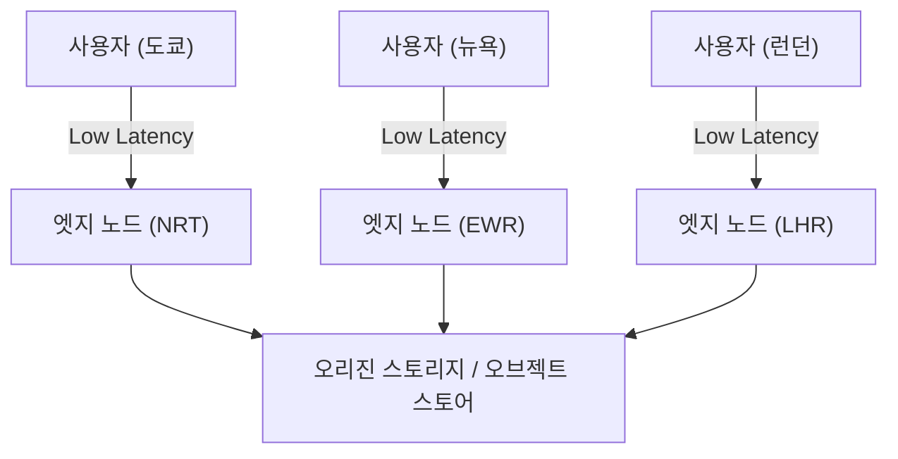
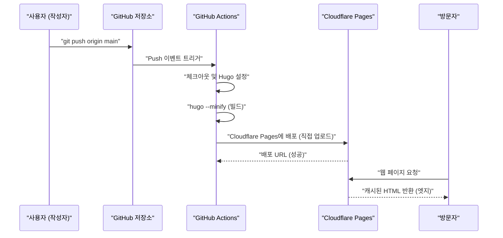
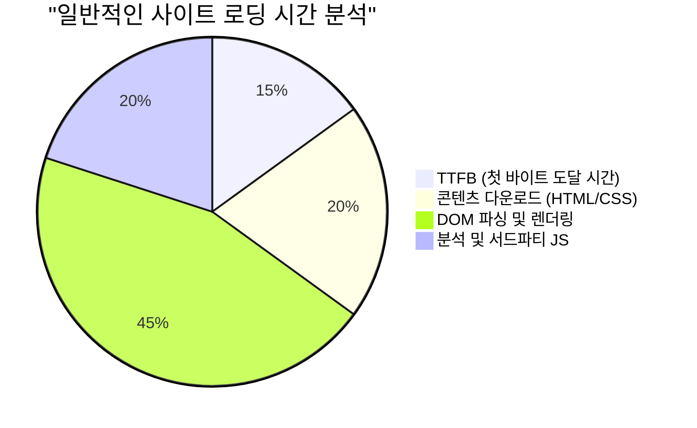

웹사이트나 블로그를 운영하는 데 있어서 표시 속도(퍼포먼스), 운영 비용, 그리고 보안은 매우 중요한 요소입니다. 예전에는 WordPress와 같은 동적 CMS(Content Management System)와 렌탈 서버의 조합이 주류를 이루었지만, 현재는 'Jamstack'이라고 불리는 아키텍처가 큰 주목을 받고 있습니다. 그 중에서도 Go 언어로 만들어진 초고속 정적 사이트 생성기(SSG)인 'Hugo'와, Cloudflare Pages나 GitHub Pages 같은 모던 호스팅 서비스를 조합하면 **완전 무료이면서 초고속**인 블로그 환경을 구축할 수 있습니다.

이 글에서는 Hugo를 사용한 정적 사이트를 Cloudflare Pages나 GitHub Pages에 공개하기 위한 구체적인 절차, 각 플랫폼의 아키텍처 차이, GitHub Actions를 이용한 CI/CD(지속적 통합/지속적 배포) 구축, DNS 최적화, 캐시 전략, 그리고 프라이버시를 고려한 접속 분석 도입에 이르기까지 기술적인 관점에서 매우 깊이 있게 설명합니다.

---

## 1. 정적 사이트 생성기(SSG)와 Jamstack의 기초

### 1.1 왜 정적 사이트인가?
기존의 동적 CMS(예: WordPress)는 사용자로부터 요청이 있을 때마다 데이터베이스(MySQL 등)에 쿼리를 실행하고, 서버 사이드(PHP 등)에서 HTML을 동적으로 생성하여 반환합니다. 이 방식은 유연성이 높은 반면, 트래픽의 급증(이른바 화제성 집중이나 DDoS 공격)에 대한 내성이 낮아 캐시 서버(Redis나 Varnish)를 전면에 두는 등 인프라 구성이 복잡해지기 쉽습니다.

반면, Jamstack(JavaScript, APIs, and Markup) 아키텍처를 채택한 정적 사이트 생성기(SSG)에서는 사전에(빌드 시에) 모든 HTML 파일, CSS, JavaScript를 생성해 둡니다. 사용자의 요청에 대해서는 이미 생성된 정적 파일을 웹 서버(또는 CDN)가 그대로 반환하기만 하므로, 압도적인 고속성과 견고한 보안을 실현할 수 있습니다.

### 1.2 Hugo의 우위성
SSG에는 Next.js, Gatsby, Jekyll, Astro 등 다양한 선택지가 있지만, Hugo의 가장 큰 특징은 바로 **빌드 속도**입니다. Go 언어의 병행 처리 혜택 덕분에, 수천에서 수만 페이지의 사이트라도 불과 몇 초 만에 빌드가 완료됩니다. 이는 CI/CD 파이프라인에서의 대기 시간을 대폭 줄여주며, 개발자 경험(DX: Developer Experience) 향상과 직결됩니다.

---

## 2. 호스팅 서비스의 아키텍처 비교

Hugo로 생성한 정적 파일을 어디에 호스팅할 것인지가 다음 과제입니다. 대표적인 선택지로 Cloudflare Pages, GitHub Pages, 그리고 Netlify를 들 수 있는데, 각각 배후에 있는 네트워크 아키텍처가 다릅니다.

### 2.1 CDN과 엣지 컴퓨팅
이러한 플랫폼들은 모두 글로벌하게 분산된 CDN(Content Delivery Network)을 이용하여 콘텐츠를 전송합니다. 하지만 단순한 정적 파일의 캐싱뿐만 아니라, '엣지 컴퓨팅'을 통해 요청 라우팅이나 헤더 수정을 사용자와 가장 가까운 PoP(Point of Presence)에서 실행할 수 있는지가 차별화 요소가 되고 있습니다.



### 2.2 GitHub Pages
GitHub Pages는 GitHub 저장소에서 직접 HTML, CSS, JavaScript 파일을 공개할 수 있는 서비스입니다. 그 배후에는 Fastly 같은 CDN이 이용되고 있어 충분한 퍼포먼스를 발휘합니다. 단, 헤더의 커스터마이즈(예: `Cache-Control`이나 보안 헤더 설정)에 제약이 있는 데다, 리다이렉트 설정에는 HTML의 meta refresh나 Jekyll의 플러그인에 의존하는 등 순수한 인프라로서의 기능은 약간 부족한 편입니다.

### 2.3 Cloudflare Pages
Cloudflare Pages는 Cloudflare가 자랑하는 세계 최대 규모의 Anycast 네트워크(275개 이상의 도시에 전개) 위에 구축된 정적 사이트 호스팅 서비스입니다.
HTTP/3(QUIC)의 기본 지원, 이미지 최적화, 엣지 함수(Cloudflare Workers)의 통합 등 압도적인 퍼포먼스 튜닝이 가능합니다. 또한 대역폭에 대한 과금이 없어, 아무리 트래픽이 급증해도 무료로 운영할 수 있다는 점이 큰 장점입니다.

### 2.4 Netlify
Netlify는 Jamstack의 선구자적인 존재로, 폼 기능, 인증(Identity), 서버리스 함수 등을 통합한 올인원 DX를 제공합니다. 그러나 무료 제공량의 대역폭(월간 100GB)을 초과하면 고액의 종량제 과금이 발생하므로, 이미지나 동영상을 많이 사용하는 블로그에서는 비용 관리에 주의가 필요합니다.

---

## 3. 퍼포먼스와 지연 시간의 이론적 계산 (LaTeX에 의한 수리 모델)

웹 퍼포먼스를 평가하는 데 있어서 지연 시간(Latency)의 감소는 가장 중요한 지표입니다. CDN(엣지)을 이용함으로써 오리진 서버에 직접 접속할 때와 비교하여 지연 시간이 얼마나 줄어드는지를 모델화해 봅시다.

사용자의 요청이 캐시에 적중할 확률을 '캐시 적중률(Cache Hit Ratio)'이라 하고, $C$ 로 둡니다. $0 \le C \le 1$ 입니다.
오리진 서버까지의 지연 시간을 $L_{origin}$, 가장 가까운 엣지 노드까지의 지연 시간을 $L_{edge}$ 라고 합니다.

새로운 평균 지연 시간 $L_{new}$ 는 다음의 기댓값으로 계산됩니다.

$$ L_{new} = C \times L_{edge} + (1 - C) \times (L_{edge} + L_{origin}) $$

이 식을 간략화하면 다음과 같습니다.

$$ L_{new} = L_{edge} + (1 - C) \times L_{origin} $$

예를 들어, 도쿄의 사용자가 미국 동부 해안(뉴욕)에 있는 오리진 서버에 접속할 경우, 광섬유의 물리적인 거리와 라우터에서의 처리 지연을 고려하면 $L_{origin}$ 은 약 200 ms 정도가 됩니다. 반면, Cloudflare와 같은 CDN을 이용하면 도쿄의 엣지 노드에 연결할 수 있으므로 $L_{edge}$ 는 약 10 ms 정도로 단축됩니다.

만약 캐시 적중률이 $C = 0.95$ (95%)라고 가정하면,

$$ L_{new} = 10 + (1 - 0.95) \times 200 = 10 + 0.05 \times 200 = 10 + 10 = 20 \text{ ms} $$

이처럼 CDN 도입을 통해 평균 지연 시간을 210 ms에서 20 ms로 극적으로(약 90%) 줄이는 것이 가능해집니다.

---

## 4. GitHub Actions를 이용한 CI/CD 파이프라인 구축

Hugo 블로그의 업데이트 프로세스를 자동화하기 위해, GitHub Actions를 이용한 CI/CD 파이프라인을 구축합니다. 이를 통해 로컬에서 Markdown 글을 작성하고 `git push` 하기만 하면, 자동으로 빌드가 실행되어 Cloudflare Pages나 GitHub Pages에 배포됩니다.

다음의 시퀀스 다이어그램은 글을 Push한 후 사용자에게 전송될 때까지의 전체 흐름을 보여줍니다.



### 4.1 Cloudflare Pages를 위한 배포 설정 (Direct Upload)

Cloudflare Pages에는 GitHub 저장소를 연동시켜 Cloudflare의 인프라 위에서 빌드하는 방법과, GitHub Actions에서 빌드한 정적 파일을 'Direct Upload(직접 업로드)'하는 방법이 있습니다. Hugo의 버전 관리를 더 엄격하게 하고 다른 작업(테스트나 이미지 최적화 등)과 연동하고 싶다면, GitHub Actions에서 빌드하고 Direct Upload 하는 방식을 추천합니다.

다음은 Cloudflare Pages에 배포하기 위한 `.github/workflows/deploy.yml` 의 실전 예시입니다.

```yaml
name: "Deploy Hugo site to Cloudflare Pages"

on:
  push:
    branches:
      - "main"
  workflow_dispatch:

jobs:
  build-and-deploy:
    runs-on: "ubuntu-latest"
    steps:
      - name: "Checkout repository"
        uses: "actions/checkout@v4"
        with:
          submodules: "recursive"
          fetch-depth: 0

      - name: "Setup Hugo"
        uses: "peaceiris/actions-hugo@v3"
        with:
          hugo-version: "0.125.0"
          extended: true

      - name: "Build Hugo Site"
        run: "hugo --minify --gc"
        env:
          HUGO_ENVIRONMENT: "production"

      - name: "Deploy to Cloudflare Pages"
        uses: "cloudflare/pages-action@v1"
        with:
          apiToken: ${{ secrets.CLOUDFLARE_API_TOKEN }}
          accountId: ${{ secrets.CLOUDFLARE_ACCOUNT_ID }}
          projectName: "your-project-name"
          directory: "public"
          gitHubToken: ${{ secrets.GITHUB_TOKEN }}
          branch: "main"
```

이 파이프라인에서는 `--minify` 옵션으로 HTML/CSS/JS를 축소하고, `--gc` 로 불필요한 파일을 삭제하고 있습니다. 이것들은 퍼포먼스 최적화의 기본입니다.

---

## 5. DNS 설정 깊게 파고들기: 커스텀 도메인과 CNAME / ALIAS 레코드

독자 도메인(예: `kenji.blog`)을 이용할 경우, DNS(Domain Name System)의 적절한 설정이 필수적입니다.

### 5.1 CNAME 레코드의 제약과 Zone Apex
보통 서브 도메인(예: `www.kenji.blog`)을 외부 서비스로 연결할 경우에는 `CNAME` 레코드를 이용합니다. 그러나 DNS의 사양(RFC 1034)에 따라 루트 도메인(Zone Apex, 네이키드 도메인이라고도 불림. 예: `kenji.blog`)에는 `CNAME` 레코드를 설정할 수 없습니다. 이는 Zone Apex에는 SOA(Start of Authority) 레코드나 NS(Name Server) 레코드, MX(Mail Exchange) 레코드가 반드시 존재해야 하며, CNAME은 다른 리소스 레코드와 공존할 수 없다는 규칙이 있기 때문입니다.

### 5.2 해결책: ALIAS / ANAME / CNAME Flattening
이 문제를 해결하기 위해, 모던 DNS 제공업체들은 자체적인 확장 기능을 제공하고 있습니다.

- **ALIAS / ANAME 레코드**: DNS 서버 측에서 동적으로 이름 확인을 수행하여, 최종적인 A 레코드(IP 주소)를 클라이언트에 반환합니다. Amazon Route 53 등이 지원하고 있습니다.
- **CNAME Flattening**: Cloudflare가 제공하는 기능입니다. Zone Apex에 CNAME을 설정한 것처럼 작동하면서, Cloudflare의 권한(Authoritative) DNS 서버가 자동으로 확인한 IP 주소들(A 레코드 및 AAAA 레코드)을 클라이언트에게 투명하게 반환합니다.

Cloudflare Pages를 이용할 경우, 도메인의 네임 서버를 Cloudflare에 위임하고, 이 'CNAME Flattening'을 활용하는 것이 가장 매끄럽고 고성능인 구성이 됩니다.

---

## 6. 캐시 전략과 HTTP 헤더 제어

정적 사이트의 고속화에 있어서 또 하나의 핵심이 되는 것은 '캐시 전략'입니다. Cloudflare Pages에서는 생성된 파일(`_headers` 파일)을 이용하여, HTTP 응답 헤더를 세밀하게 제어할 수 있습니다.

### 6.1 엣지 캐시(Edge Cache) vs 브라우저 캐시(Browser Cache)
캐시에는 크게 나누어 CDN 측에서 유지되는 '엣지 캐시'와 사용자의 브라우저에 저장되는 '브라우저 캐시' 2종류가 있습니다.

정적 파일(이미지, CSS, JS 등 파일명에 해시가 포함된 것)은 브라우저 측에 장기간 캐싱시키는 것이 이상적입니다. 반면, HTML 파일은 업데이트를 즉시 반영하기 위해 브라우저 캐시를 짧게(혹은 무효화) 하고, 엣지 캐시로 처리하는 구성이 일반적입니다.

Cloudflare Pages에서의 `_headers` 설정 예시:

```text
# HTML 파일은 브라우저 캐시를 하지 않고, 매번 검증한다
/*.html
  Cache-Control: public, max-age=0, must-revalidate

# 에셋 파일(CSS/JS/이미지)은 1년간 브라우저에 캐시한다
/assets/*
  Cache-Control: public, max-age=31536000, immutable
/img/*
  Cache-Control: public, max-age=31536000, immutable
```

### 6.2 대역폭 비용 절감 계산식
적절한 캐시 헤더를 설정함으로써 서버(엣지)로부터의 데이터 전송량을 대폭 줄일 수 있습니다. 월간 대역폭 비용 $Cost$ 는 각 리소스의 전송량 $B_i$, 캐시 적중률 $C_i$, 그리고 대역폭 단가 $R$ 에 의해 다음과 같은 모델로 나타낼 수 있습니다.

$$ Cost = \sum_{i=1}^{n} \left( B_i \times (1 - C_i) \times R \right) $$

Cloudflare는 다운로드 전송량이 무료($R = 0$)이므로 직접적인 금전적 비용은 $0$ 이 됩니다. 그러나 GitHub Pages 등 다른 인프라를 병용하는 경우나 AWS 구성을 백엔드로 삼는 경우에는, 이 캐시 적중률 $C_i$ 를 극대화하는 것이 인프라 비용 절감의 핵심이 됩니다.

---

## 7. 프라이버시와 퍼포먼스를 양립하는 접속 분석

블로그를 운영하는 데 있어서, 얼마나 많은 사용자가 방문하고 있는지를 알기 위한 접속 분석(Web Analytics)은 필수적입니다. 오랫동안 Google Analytics(GA4)가 사실상의 표준(De facto standard)이었지만, 최근의 프라이버시 보호 흐름(GDPR, CCPA)이나 서드파티 쿠키 폐지에 따라 상황이 변하고 있습니다.

### 7.1 웹 퍼포먼스에 미치는 영향
Google Analytics(구체적으로는 `gtag.js` 나 Google Tag Manager)를 도입하면, 수많은 외부 스크립트의 로딩과 실행이 발생하여 퍼포먼스(특히 TTFB나 메인 스레드 차단 시간)에 악영향을 미칩니다.

사이트의 로드 시간을 다음과 같이 분해해서 생각해 봅시다.



서드파티의 JS 분석 도구는 전체 로딩 시간의 약 20%~30%를 차지하는 일도 드물지 않습니다.

### 7.2 Cloudflare Web Analytics의 도입
그래서 주목받고 있는 것이 Cloudflare Web Analytics나 Plausible Analytics 같은, 쿠키를 사용하지 않는(Cookieless) 프라이버시 퍼스트 접속 분석입니다.

Cloudflare Web Analytics는 매우 가벼운 JavaScript 스니펫을 삽입하기만 하면 작동하며, 쿠키를 발행하지 않기 때문에 번거로운 쿠키 동의 배너(Cookie Consent Banner)를 설치할 필요가 없습니다.

Hugo에서의 구현도 매우 간단합니다. `layouts/partials/head.html` 이나 `layouts/partials/analytics.html` 에 제공받은 스니펫을 추가하기만 하면 됩니다.

```html
{{ if eq hugo.Environment "production" }}
<!-- Cloudflare Web Analytics -->
<script defer src='https://static.cloudflareinsights.com/beacon.min.js' data-cf-beacon='{"token": "YOUR_CLOUDFLARE_BEACON_TOKEN"}'></script>
<!-- End Cloudflare Web Analytics -->
{{ end }}
```

`defer` 속성을 부여함으로써 HTML 파싱을 차단하지 않고 스크립트를 비동기적으로 불러와, DOM 구축 후에 실행시킬 수 있습니다. 이를 통해 초기 표시 속도(LCP: Largest Contentful Paint 나 FCP: First Contentful Paint)에 미치는 영향을 최소화할 수 있습니다.

---

## 8. 요약 및 베스트 프랙티스

Hugo를 이용한 정적 사이트 운영에 있어, Cloudflare Pages나 GitHub Pages와 같은 모던 호스팅 플랫폼을 채택하는 것은 가성비, 표시 속도, 보안의 모든 측면에서 압도적인 장점이 있습니다.

1. **초고속 빌드**: Hugo의 고속성을 살려 CI/CD 파이프라인(GitHub Actions)의 실행 시간을 최소화한다.
2. **엣지 전송**: Cloudflare의 엣지 네트워크를 이용하여 전 세계 사용자에게 밀리초 단위의 지연 시간으로 콘텐츠를 전달한다.
3. **적절한 DNS 구성**: CNAME Flattening을 활용하여 Zone Apex(독자 도메인)를 안전하고 빠르게 운영한다.
4. **캐시 전략 최적화**: `_headers` 를 사용하여 브라우저 캐시와 엣지 캐시를 리소스 종류에 따라 적절하게 분리한다.
5. **가벼운 애널리틱스**: 프라이버시를 배려하면서 퍼포먼스를 손상시키지 않는 Cloudflare Web Analytics 등을 도입한다.

이것들을 조합함으로써 월간 수백만 PV 클래스의 대규모 트래픽도 견뎌낼 수 있는, 확장 가능하고 견고한 블로그 시스템을 무료로 구축할 수 있습니다. 기술 블로그나 기업 사이트, 포트폴리오 사이트 개설을 검토하고 계신 분들은 꼭 이 Jamstack + Hugo + Cloudflare Pages 구성을 시도해 보시기 바랍니다.
