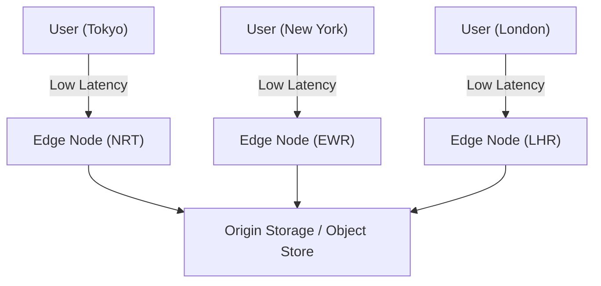
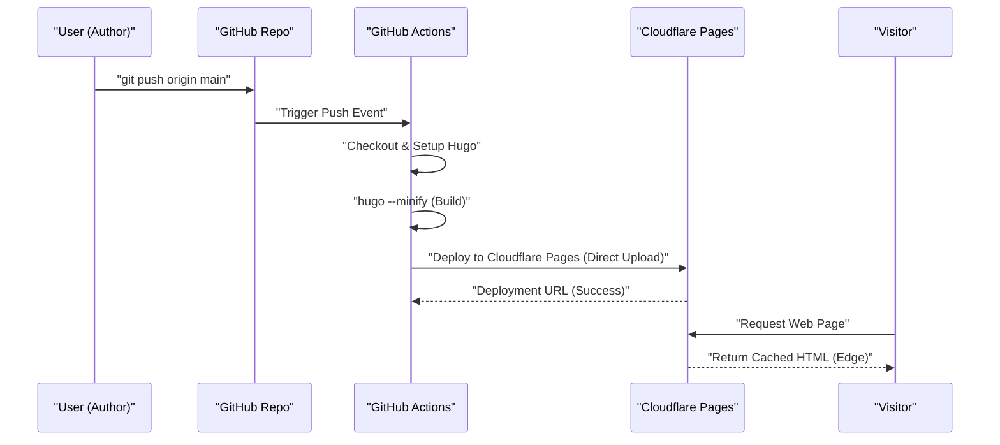
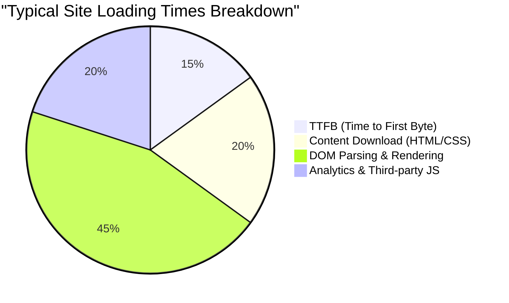

Webサイトやブログを運営するにあたり、表示速度（パフォーマンス）、運用コスト、そしてセキュリティは極めて重要な要素です。かつてはWordPressなどの動的CMS（Content Management System）とレンタルサーバーの組み合わせが主流でしたが、現在では「Jamstack」と呼ばれるアーキテクチャが大きな注目を集めています。その中でも、Go言語で作られた超高速な静的サイトジェネレーター（SSG）である「Hugo」と、Cloudflare PagesやGitHub Pagesのようなモダンなホスティングサービスを組み合わせることで、**完全無料かつ爆速**のブログ環境を構築することが可能です。

本記事では、Hugoを用いた静的サイトをCloudflare PagesやGitHub Pagesで公開するための具体的な手順、各プラットフォームのアーキテクチャの違い、GitHub Actionsを用いたCI/CD（継続的インテグレーション／継続的デプロイメント）の構築、DNSの最適化、キャッシュ戦略、そしてプライバシーに配慮したアクセス解析の導入に至るまで、技術的な観点から非常に深く掘り下げて解説します。

---

## 1. 静的サイトジェネレーター（SSG）とJamstackの基礎

### 1.1 なぜ静的サイトなのか？
従来の動的CMS（例：WordPress）は、ユーザーからのリクエストのたびにデータベース（MySQLなど）へクエリを発行し、サーバーサイド（PHPなど）でHTMLを動的に生成して返却します。この方式は柔軟性が高い一方で、トラフィックの急増（いわゆるバズやDDoS攻撃）に対する耐性が低く、キャッシュサーバー（RedisやVarnish）を前段に置くなど、インフラ構成が複雑化しがちです。

一方、Jamstack（JavaScript, APIs, and Markup）アーキテクチャを採用した静的サイトジェネレーター（SSG）では、事前に（ビルド時に）すべてのHTMLファイル、CSS、JavaScriptを生成しておきます。ユーザーのリクエストに対しては、すでに生成済みの静的ファイルをWebサーバー（またはCDN）がそのまま返すだけであるため、圧倒的な高速性と堅牢なセキュリティを実現できます。

### 1.2 Hugoの優位性
SSGにはNext.js、Gatsby、Jekyll、Astroなど様々な選択肢がありますが、Hugoの最大の特徴はその**ビルド速度**です。Go言語による並行処理の恩恵を受け、数千から数万ページのサイトであってもわずか数秒でビルドが完了します。これは、CI/CDパイプラインにおける待ち時間を大幅に削減し、開発者体験（DX: Developer Experience）の向上に直結します。

---

## 2. ホスティングサービスのアーキテクチャ比較

Hugoで生成した静的ファイルをどこにホスティングするかが次の課題となります。代表的な選択肢として、Cloudflare Pages、GitHub Pages、そしてNetlifyが挙げられますが、それぞれ背後にあるネットワークアーキテクチャが異なります。

### 2.1 CDNとエッジコンピューティング
これらのプラットフォームはすべて、グローバルに分散されたCDN（Content Delivery Network）を利用してコンテンツを配信します。しかし、単なる静的ファイルのキャッシュだけでなく、「エッジコンピューティング」によってリクエストのルーティングやヘッダーの書き換えをユーザーに最も近いPoP（Point of Presence）で実行できるかが差別化要因となっています。



### 2.2 GitHub Pages
GitHub Pagesは、GitHubリポジトリから直接HTML、CSS、JavaScriptファイルを公開できるサービスです。背後にはFastlyなどのCDNが利用されており、十分なパフォーマンスを発揮します。ただし、ヘッダーのカスタマイズ（例：`Cache-Control`やセキュリティヘッダーの設定）に制約があるほか、リダイレクトの設定にはHTMLのmeta refreshやJekyllのプラグインに依存するなど、純粋なインフラとしての機能はやや控えめです。

### 2.3 Cloudflare Pages
Cloudflare Pagesは、Cloudflareが誇る世界最大規模のAnycastネットワーク（275以上の都市に展開）の上に構築された静的サイトホスティングサービスです。
HTTP/3（QUIC）の標準サポート、画像最適化、エッジ関数（Cloudflare Workers）の統合など、圧倒的なパフォーマンスチューニングが可能です。また、帯域幅に対する課金がなく、どれだけトラフィックが急増しても無料で運用できる点が大きなメリットです。

### 2.4 Netlify
NetlifyはJamstackのパイオニア的存在であり、フォーム機能、認証（Identity）、サーバーレス関数などを統合したオールインワンのDXを提供します。しかし、無料枠の帯域幅（月間100GB）を超えると高額な従量課金が発生するため、画像や動画を多用するブログではコスト管理に注意が必要です。

---

## 3. パフォーマンスと遅延の理論的計算（LaTeXによる数理モデル）

Webパフォーマンスを評価する上で、遅延（Latency）の削減は最も重要な指標です。CDN（エッジ）を利用することで、オリジンサーバーに直接アクセスする場合と比較してどれだけ遅延が削減されるかをモデル化してみましょう。

ユーザーのリクエストがキャッシュにヒットする確率を「キャッシュヒット率（Cache Hit Ratio）」とし、$C$ と置きます。$0 \le C \le 1$ です。
オリジンサーバーまでの遅延を $L_{origin}$、最寄りのエッジノードまでの遅延を $L_{edge}$ とします。

新しい平均遅延 $L_{new}$ は以下の期待値として計算されます。

$$ L_{new} = C \times L_{edge} + (1 - C) \times (L_{edge} + L_{origin}) $$

この式を簡略化すると以下のようになります。

$$ L_{new} = L_{edge} + (1 - C) \times L_{origin} $$

例えば、東京のユーザーが米国の東海岸（ニューヨーク）にあるオリジンサーバーにアクセスする場合、光ファイバーの物理的な距離とルーターでの処理遅延を考慮すると、$L_{origin}$ は約 200 ms 程度になります。一方、CloudflareのようなCDNを利用すれば、東京のエッジノードに接続できるため、$L_{edge}$ は約 10 ms 程度に短縮されます。

仮にキャッシュヒット率 $C = 0.95$（95%）であった場合、

$$ L_{new} = 10 + (1 - 0.95) \times 200 = 10 + 0.05 \times 200 = 10 + 10 = 20 \text{ ms} $$

このように、CDNの導入によって平均遅延を 210 ms から 20 ms へと、劇的に（約90%）削減することが可能になります。

---

## 4. GitHub Actionsを用いたCI/CDパイプラインの構築

Hugoブログの更新プロセスを自動化するために、GitHub Actionsを利用したCI/CDパイプラインを構築します。これにより、ローカルでMarkdown記事を書いて `git push` するだけで、自動的にビルドが走り、Cloudflare PagesやGitHub Pagesにデプロイされるようになります。

以下のシーケンス図は、記事をPushしてからユーザーに配信されるまでの全体フローを示しています。



### 4.1 Cloudflare Pages向けのデプロイ設定（Direct Upload）

Cloudflare Pagesには、GitHubリポジトリを連携させてCloudflareのインフラ上でビルドさせる方法と、GitHub Actionsでビルドした静的ファイルを「Direct Upload（直接アップロード）」する方法があります。Hugoのバージョン管理をより厳密に行い、他のジョブ（テストや画像の最適化）と連動させたい場合は、GitHub Actions上でビルドし、Direct Uploadする方式がおすすめです。

以下は、Cloudflare Pagesへデプロイするための `.github/workflows/deploy.yml` の実践的な例です。

```yaml
name: "Deploy Hugo site to Cloudflare Pages"

on:
  push:
    branches:
      - "main"
  workflow_dispatch:

jobs:
  build-and-deploy:
    runs-on: "ubuntu-latest"
    steps:
      - name: "Checkout repository"
        uses: "actions/checkout@v4"
        with:
          submodules: "recursive"
          fetch-depth: 0

      - name: "Setup Hugo"
        uses: "peaceiris/actions-hugo@v3"
        with:
          hugo-version: "0.125.0"
          extended: true

      - name: "Build Hugo Site"
        run: "hugo --minify --gc"
        env:
          HUGO_ENVIRONMENT: "production"

      - name: "Deploy to Cloudflare Pages"
        uses: "cloudflare/pages-action@v1"
        with:
          apiToken: ${{ secrets.CLOUDFLARE_API_TOKEN }}
          accountId: ${{ secrets.CLOUDFLARE_ACCOUNT_ID }}
          projectName: "your-project-name"
          directory: "public"
          gitHubToken: ${{ secrets.GITHUB_TOKEN }}
          branch: "main"
```

このパイプラインでは、`--minify` オプションによってHTML/CSS/JSを最小化し、`--gc` によって不要なファイルを削除しています。これらはパフォーマンス最適化の基本です。

---

## 5. DNS設定の深堀り：カスタムドメインとCNAME / ALIASレコード

独自ドメイン（例：`kenji.blog`）を利用する場合、DNS（Domain Name System）の適切な設定が不可欠です。

### 5.1 CNAMEレコードの制約とZone Apex
通常、サブドメイン（例：`www.kenji.blog`）を外部サービスに向ける場合は、`CNAME` レコードを利用します。しかし、DNSの仕様（RFC 1034）により、ルートドメイン（Zone Apex, ネイキッドドメインとも呼ばれる。例：`kenji.blog`）には `CNAME` レコードを設定することができません。これは、Zone ApexにはSOA（Start of Authority）レコードやNS（Name Server）レコード、MX（Mail Exchange）レコードが必ず存在しなければならず、CNAMEは他のリソースレコードと共存できないというルールがあるためです。

### 5.2 解決策：ALIAS / ANAME / CNAME Flattening
この問題を解決するため、モダンなDNSプロバイダは独自の拡張機能を提供しています。

- **ALIAS / ANAMEレコード**: DNSサーバー側で動的に名前解決を行い、最終的なAレコード（IPアドレス）をクライアントに返します。Amazon Route 53などが対応しています。
- **CNAME Flattening**: Cloudflareが提供する機能です。Zone ApexにCNAMEを設定したかのように振る舞いつつ、Cloudflareの権威DNSサーバーが自動的に解決したIPアドレス群（AレコードおよびAAAAレコード）をクライアントに透過的に返却します。

Cloudflare Pagesを利用する場合、ドメインのネームサーバーをCloudflareに委譲し、この「CNAME Flattening」を活用するのが最もシームレスで高性能な構成となります。

---

## 6. キャッシュ戦略とHTTPヘッダーの制御

静的サイトの高速化において、もう一つの要となるのが「キャッシュ戦略」です。Cloudflare Pagesでは、生成されたファイル（`_headers` ファイル）を利用して、HTTPレスポンスヘッダーを詳細に制御できます。

### 6.1 Edge Cache vs Browser Cache
キャッシュには大きく分けて、CDN側で保持される「Edge Cache」と、ユーザーのブラウザに保存される「Browser Cache」の2種類があります。

静的ファイル（画像、CSS、JSなど、ファイル名にハッシュが含まれるもの）は、ブラウザ側に長期間キャッシュさせるのが理想です。一方、HTMLファイルは更新をすぐに反映させるため、ブラウザキャッシュを短く（あるいは無効化）し、エッジキャッシュでさばく構成が一般的です。

Cloudflare Pagesにおける `_headers` の設定例：

```text
# HTMLファイルはブラウザキャッシュをせず、都度検証する
/*.html
  Cache-Control: public, max-age=0, must-revalidate

# アセットファイル（CSS/JS/画像）は1年間ブラウザにキャッシュさせる
/assets/*
  Cache-Control: public, max-age=31536000, immutable
/img/*
  Cache-Control: public, max-age=31536000, immutable
```

### 6.2 帯域幅コスト削減の計算式
適切なキャッシュヘッダーを設定することで、サーバー（エッジ）からのデータ転送量を大幅に削減できます。月間の帯域幅コスト $Cost$ は、各リソースの転送量 $B_i$、キャッシュヒット率 $C_i$、および帯域幅の単価 $R$ によって以下のモデルで表されます。

$$ Cost = \sum_{i=1}^{n} \left( B_i \times (1 - C_i) \times R \right) $$

Cloudflareは下り転送量が無料（$R = 0$）であるため、直接的な金銭的コストは $0$ になります。しかし、GitHub Pagesなど他のインフラを併用する場合や、AWS S3などをバックエンドにする場合は、このキャッシュヒット率 $C_i$ を最大化することが、インフラコスト削減の要となります。

---

## 7. プライバシーとパフォーマンスを両立するアクセス解析

ブログを運営する上で、どれくらいのユーザーが訪問しているかを知るためのアクセス解析（Web Analytics）は欠かせません。長らくGoogle Analytics（GA4）がデファクトスタンダードでしたが、近年のプライバシー保護の潮流（GDPR、CCPA）や、サードパーティCookieの廃止に伴い、状況は変化しています。

### 7.1 Webパフォーマンスへの影響
Google Analytics（具体的には `gtag.js` や Google Tag Manager）を導入すると、数多くの外部スクリプトの読み込みと実行が発生し、パフォーマンス（特にTTFBやメインスレッドのブロッキング時間）に悪影響を及ぼします。

サイトのロード時間を以下のように分解して考えてみましょう。



サードパーティのJS解析ツールは、全体のロード時間の約20%〜30%を占めることも珍しくありません。

### 7.2 Cloudflare Web Analyticsの導入
そこで注目されているのが、Cloudflare Web AnalyticsやPlausible Analyticsのような、Cookieを使用しない（Cookieless）プライバシーファーストなアクセス解析です。

Cloudflare Web Analyticsは、非常に軽量なJavaScriptスニペットを埋め込むだけで動作し、Cookieを発行しないため、煩わしいCookie同意バナー（Cookie Consent Banner）を設置する必要がありません。

Hugoでの実装も非常に簡単です。`layouts/partials/head.html` や `layouts/partials/analytics.html` に、提供されたスニペットを追加するだけです。

```html
{{ if eq hugo.Environment "production" }}
<!-- Cloudflare Web Analytics -->
<script defer src='https://static.cloudflareinsights.com/beacon.min.js' data-cf-beacon='{"token": "YOUR_CLOUDFLARE_BEACON_TOKEN"}'></script>
<!-- End Cloudflare Web Analytics -->
{{ end }}
```

`defer` 属性を付与することで、HTMLのパースをブロックせずにスクリプトを非同期に読み込み、DOM構築後に実行させることができます。これにより、初期表示速度（LCP: Largest Contentful Paint や FCP: First Contentful Paint）への影響を最小限に抑えられます。

---

## 8. まとめとベストプラクティス

Hugoを用いた静的サイトの運用において、Cloudflare PagesやGitHub Pagesといったモダンなホスティングプラットフォームを採用することは、コストパフォーマンス、表示速度、セキュリティのすべての面で圧倒的なメリットがあります。

1. **爆速のビルド**: Hugoの高速性を活かし、CI/CDパイプライン（GitHub Actions）の実行時間を最小化する。
2. **エッジでの配信**: Cloudflareのエッジネットワークを利用し、世界中のユーザーへミリ秒単位の遅延でコンテンツを届ける。
3. **適切なDNS構成**: CNAME Flatteningを活用してZone Apex（独自ドメイン）を安全かつ高速に運用する。
4. **キャッシュ戦略の最適化**: `_headers` を用いて、ブラウザキャッシュとエッジキャッシュをリソースの種類ごとに適切に分離する。
5. **軽量なアナリティクス**: プライバシーに配慮しつつパフォーマンスを損なわないCloudflare Web Analyticsなどを導入する。

これらを組み合わせることで、月間数百万PVクラスの大規模トラフィックにも耐えうる、スケーラブルかつ堅牢なブログシステムを無料で構築することができます。技術ブログや企業サイト、ポートフォリオサイトの立ち上げを検討している方は、ぜひこの Jamstack + Hugo + Cloudflare Pages の構成を試してみてください。
