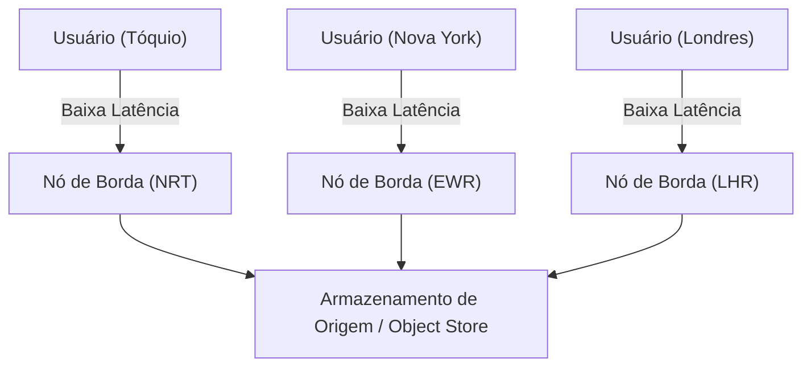
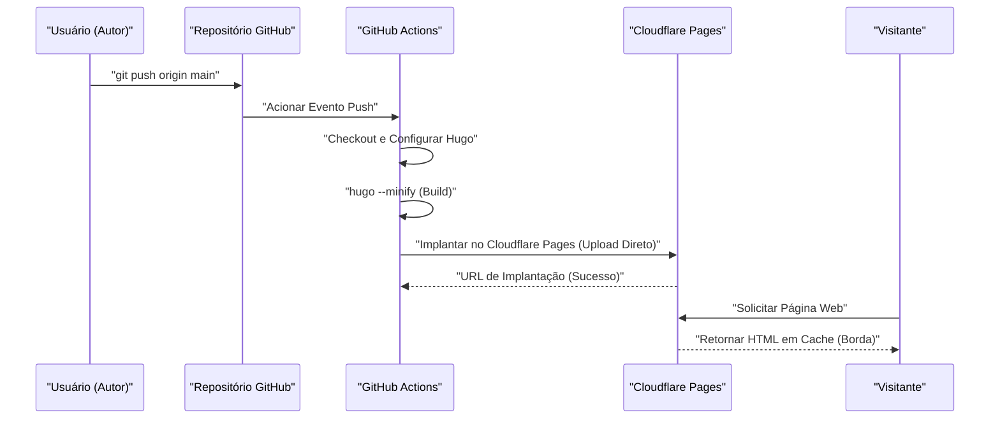
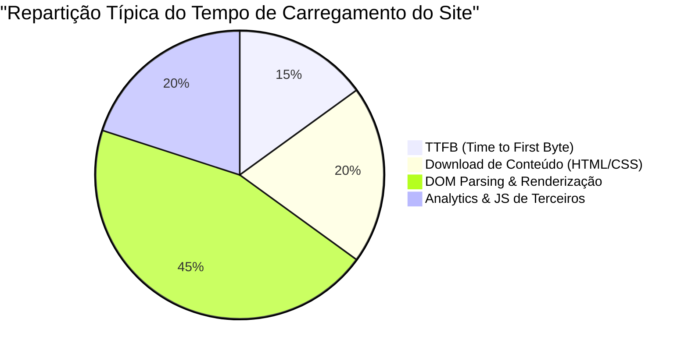

Ao gerenciar um site ou blog, a velocidade de carregamento (desempenho), os custos operacionais e a segurança são fatores extremamente importantes. No passado, a combinação de um CMS dinâmico (Content Management System) como o WordPress e um servidor de hospedagem era predominante, mas hoje a arquitetura chamada "Jamstack" está atraindo muita atenção. Entre as opções, combinando o "Hugo" - um gerador de sites estáticos (SSG) ultrarrápido escrito em Go - com serviços de hospedagem modernos como o Cloudflare Pages e o GitHub Pages, é possível construir um ambiente de blog **totalmente gratuito e incrivelmente rápido**.

Neste artigo, explicaremos a fundo, sob uma perspectiva técnica, as etapas específicas para publicar um site estático usando Hugo no Cloudflare Pages ou GitHub Pages, as diferenças na arquitetura de cada plataforma, a construção de CI/CD (Integração Contínua/Implantação Contínua) usando o GitHub Actions, a otimização de DNS, estratégias de cache e até a introdução de análises de acesso que respeitam a privacidade.

---

## 1. O Básico sobre Geradores de Sites Estáticos (SSG) e Jamstack

### 1.1 Por que sites estáticos?
Sistemas de CMS dinâmicos tradicionais (ex: WordPress) enviam consultas a um banco de dados (como MySQL) e geram o HTML dinamicamente no lado do servidor (como PHP) para cada solicitação do usuário. Embora esse método seja altamente flexível, ele possui baixa tolerância a picos repentinos de tráfego (ou seja, quando algo viraliza ou ataques DDoS) e frequentemente exige uma arquitetura de infraestrutura complexa, como colocar servidores de cache (Redis ou Varnish) na frente.

Por outro lado, geradores de sites estáticos (SSG) que adotam a arquitetura Jamstack (JavaScript, APIs e Markup) geram antecipadamente (no momento do build) todos os arquivos HTML, CSS e JavaScript. Para as solicitações do usuário, o servidor web (ou CDN) simplesmente retorna os arquivos estáticos já gerados, o que permite alcançar uma velocidade impressionante e segurança robusta.

### 1.2 A Vantagem do Hugo
Há várias opções de SSG, como Next.js, Gatsby, Jekyll e Astro, mas a maior característica do Hugo é a sua **velocidade de compilação**. Beneficiando-se do processamento simultâneo fornecido pela linguagem Go, a compilação é concluída em apenas alguns segundos, mesmo para sites com milhares a dezenas de milhares de páginas. Isso reduz drasticamente o tempo de espera no pipeline de CI/CD e está diretamente ligado à melhoria da experiência do desenvolvedor (DX: Developer Experience).

---

## 2. Comparação da Arquitetura dos Serviços de Hospedagem

A próxima questão é onde hospedar os arquivos estáticos gerados pelo Hugo. Opções típicas incluem o Cloudflare Pages, o GitHub Pages e o Netlify, mas a arquitetura de rede por trás de cada um deles difere.

### 2.1 CDN e Computação de Borda (Edge Computing)
Todas essas plataformas utilizam uma CDN (Content Delivery Network) distribuída globalmente para entregar conteúdo. No entanto, além do simples armazenamento em cache de arquivos estáticos, o fator de diferenciação é se elas podem executar roteamento de solicitações e reescrita de cabeçalhos no PoP (Point of Presence) mais próximo do usuário, usando a "computação de borda".



### 2.2 GitHub Pages
O GitHub Pages é um serviço que permite publicar arquivos HTML, CSS e JavaScript diretamente de um repositório GitHub. Por trás dele, são utilizadas CDNs como o Fastly, entregando um desempenho adequado. Contudo, possui recursos de infraestrutura pura mais limitados, havendo restrições quanto à personalização de cabeçalhos (ex: configuração de `Cache-Control` ou cabeçalhos de segurança), além de que as configurações de redirecionamento dependem de atualizações meta do HTML ou de plugins do Jekyll.

### 2.3 Cloudflare Pages
O Cloudflare Pages é um serviço de hospedagem de sites estáticos construído na maior rede Anycast do mundo (presente em mais de 275 cidades), orgulhosamente fornecida pela Cloudflare.
Ele permite ajustes de desempenho esmagadores, como o suporte padrão ao HTTP/3 (QUIC), otimização de imagens e a integração de funções de borda (Cloudflare Workers). Além disso, não há cobrança por largura de banda, o que significa que pode ser operado gratuitamente independentemente de quão repentinamente o tráfego aumentar, sendo esta uma grande vantagem.

### 2.4 Netlify
O Netlify é um pioneiro no modelo Jamstack, fornecendo uma DX tudo-em-um que integra funcionalidades de formulário, autenticação (Identity), funções serverless (sem servidor), entre outras. Porém, caso a largura de banda ultrapasse a cota gratuita (100 GB por mês), são geradas cobranças baseadas no consumo que podem ser altas, de modo que é necessário ter cuidado com o controle de custos em blogs que utilizam muitas imagens e vídeos.

---

## 3. Cálculo Teórico de Desempenho e Latência (Modelo Matemático com LaTeX)

Ao avaliar o desempenho web, a redução da latência (Latency) é o indicador mais importante. Vamos modelar o quanto a latência pode ser reduzida utilizando uma CDN (Borda) em comparação ao acesso direto ao servidor de origem.

Definiremos a probabilidade da requisição do usuário atingir o cache como a "Taxa de Acertos de Cache" (Cache Hit Ratio), denotada por $C$, onde $0 \le C \le 1$.
Seja a latência até o servidor de origem $L_{origin}$, e a latência até o nó de borda mais próximo $L_{edge}$.

A nova latência média $L_{new}$ é calculada como o seguinte valor esperado:

$$ L_{new} = C \times L_{edge} + (1 - C) \times (L_{edge} + L_{origin}) $$

Simplificando esta fórmula, temos:

$$ L_{new} = L_{edge} + (1 - C) \times L_{origin} $$

Por exemplo, se um usuário em Tóquio acessar um servidor de origem localizado na costa leste dos Estados Unidos (Nova York), levando em conta a distância física da fibra óptica e o atraso de processamento nos roteadores, $L_{origin}$ será de aproximadamente 200 ms. Por outro lado, utilizando uma CDN como a Cloudflare, é possível conectar-se ao nó de borda de Tóquio, reduzindo $L_{edge}$ para cerca de 10 ms.

Supondo uma taxa de acertos de cache $C = 0.95$ (95%),

$$ L_{new} = 10 + (1 - 0.95) \times 200 = 10 + 0.05 \times 200 = 10 + 10 = 20 \text{ ms} $$

Dessa forma, com a introdução da CDN, torna-se possível reduzir drasticamente (em cerca de 90%) a latência média, de 210 ms para 20 ms.

---

## 4. Construção de um Pipeline CI/CD com GitHub Actions

Para automatizar o processo de atualização de um blog Hugo, construiremos um pipeline CI/CD utilizando o GitHub Actions. Com isso, basta escrever artigos em Markdown localmente e dar um `git push` para que o processo de compilação execute automaticamente e o site seja implantado no Cloudflare Pages ou GitHub Pages.

O diagrama de sequência a seguir mostra todo o fluxo, desde o envio do artigo (Push) até sua entrega aos usuários.



### 4.1 Configuração de Implantação para o Cloudflare Pages (Upload Direto)

O Cloudflare Pages possui dois métodos: vincular um repositório GitHub para que a compilação ocorra na infraestrutura da Cloudflare, ou fazer o "Direct Upload" (Upload Direto) dos arquivos estáticos previamente compilados com o GitHub Actions. Se você deseja controlar a versão do Hugo com mais rigor e vincular o processo a outras tarefas (testes e otimização de imagens), é recomendável o método de compilação no GitHub Actions e Upload Direto.

Abaixo, um exemplo prático do arquivo `.github/workflows/deploy.yml` para implantação no Cloudflare Pages.

```yaml
name: "Deploy Hugo site to Cloudflare Pages"

on:
  push:
    branches:
      - "main"
  workflow_dispatch:

jobs:
  build-and-deploy:
    runs-on: "ubuntu-latest"
    steps:
      - name: "Checkout repository"
        uses: "actions/checkout@v4"
        with:
          submodules: "recursive"
          fetch-depth: 0

      - name: "Setup Hugo"
        uses: "peaceiris/actions-hugo@v3"
        with:
          hugo-version: "0.125.0"
          extended: true

      - name: "Build Hugo Site"
        run: "hugo --minify --gc"
        env:
          HUGO_ENVIRONMENT: "production"

      - name: "Deploy to Cloudflare Pages"
        uses: "cloudflare/pages-action@v1"
        with:
          apiToken: ${{ secrets.CLOUDFLARE_API_TOKEN }}
          accountId: ${{ secrets.CLOUDFLARE_ACCOUNT_ID }}
          projectName: "your-project-name"
          directory: "public"
          gitHubToken: ${{ secrets.GITHUB_TOKEN }}
          branch: "main"
```

Neste pipeline, utilizamos a opção `--minify` para minificar HTML/CSS/JS e `--gc` para remover arquivos desnecessários. Esses são os fundamentos da otimização de desempenho.

---

## 5. Mergulho Profundo nas Configurações de DNS: Domínios Personalizados e Registros CNAME / ALIAS

Ao utilizar um domínio personalizado (ex: `kenji.blog`), a configuração adequada do DNS (Domain Name System) é essencial.

### 5.1 Restrições dos Registros CNAME e Zone Apex
Normalmente, para apontar um subdomínio (ex: `www.kenji.blog`) para um serviço externo, usa-se um registro `CNAME`. Contudo, devido à especificação do DNS (RFC 1034), não é possível definir um registro `CNAME` no domínio raiz (também conhecido como Zone Apex ou naked domain, ex: `kenji.blog`). Isso ocorre porque o Zone Apex deve, obrigatoriamente, conter um registro SOA (Start of Authority), registros NS (Name Server) ou MX (Mail Exchange), e há uma regra de que o CNAME não pode coexistir com outros registros de recurso.

### 5.2 A Solução: ALIAS / ANAME / CNAME Flattening
Para resolver esse problema, os provedores de DNS modernos oferecem suas próprias extensões:

- **Registros ALIAS / ANAME**: O servidor DNS realiza dinamicamente a resolução de nomes no lado do servidor e retorna os registros A finais (endereços IP) para o cliente. Serviços como o Amazon Route 53 suportam isso.
- **CNAME Flattening**: Um recurso fornecido pela Cloudflare. Ele atua como se um CNAME fosse configurado para a Zone Apex, mas o servidor DNS autoritativo da Cloudflare retorna de forma transparente para o cliente o conjunto de endereços IP (registros A e AAAA) que foram resolvidos automaticamente.

Ao utilizar o Cloudflare Pages, delegar os servidores de nomes (nameservers) do seu domínio para a Cloudflare e aproveitar este "CNAME Flattening" é a configuração mais perfeita e de maior desempenho.

---

## 6. Estratégias de Cache e Controle de Cabeçalhos HTTP

Outro pilar na aceleração de sites estáticos é a "Estratégia de Cache". Com o Cloudflare Pages, utilizando o arquivo gerado (arquivo `_headers`), é possível ter um controle preciso dos cabeçalhos HTTP de resposta.

### 6.1 Cache de Borda (Edge Cache) vs Cache do Navegador (Browser Cache)
O cache é amplamente dividido em dois tipos: o "Edge Cache" mantido pelo lado da CDN e o "Browser Cache" armazenado no navegador do usuário.

Para os arquivos estáticos (como imagens, CSS e JS que contêm hashes no nome do arquivo), o ideal é que eles sejam mantidos no cache do navegador por longos períodos. Por outro lado, para arquivos HTML, a fim de que as atualizações sejam refletidas imediatamente, a prática comum é ter um tempo de cache de navegador muito curto (ou até mesmo desativado), lidando com essas requisições por meio do edge cache.

Exemplo de configuração do arquivo `_headers` no Cloudflare Pages:

```text
# Arquivos HTML não usarão o cache do navegador e serão validados sempre
/*.html
  Cache-Control: public, max-age=0, must-revalidate

# Arquivos de recursos (CSS/JS/Imagens) ficarão no cache do navegador por 1 ano
/assets/*
  Cache-Control: public, max-age=31536000, immutable
/img/*
  Cache-Control: public, max-age=31536000, immutable
```

### 6.2 Fórmula para Cálculo de Redução dos Custos com Largura de Banda
Ao configurar cabeçalhos de cache apropriados, o volume de transferência de dados do servidor (borda) pode ser drasticamente reduzido. O custo mensal com largura de banda $Cost$ pode ser expresso pelo seguinte modelo, dependendo do volume de transferência $B_i$ de cada recurso, da taxa de acertos do cache $C_i$ e do preço unitário da largura de banda $R$:

$$ Cost = \sum_{i=1}^{n} \left( B_i \times (1 - C_i) \times R \right) $$

Como a taxa de transferência de saída da Cloudflare é gratuita ($R = 0$), o custo monetário direto é $0$. Porém, ao utilizar outras infraestruturas simultaneamente como o GitHub Pages, ou usar serviços como o AWS S3 como backend, maximizar essa taxa de acertos de cache $C_i$ se torna o pilar para a redução dos custos da infraestrutura.

---

## 7. Análise de Acesso que Equilibra Privacidade e Desempenho

Ao gerir um blog, a análise de acesso (Web Analytics) é essencial para saber quantos usuários o estão visitando. O Google Analytics (GA4) foi o padrão da indústria por muito tempo, mas com a recente tendência voltada para a proteção de privacidade (GDPR, CCPA) e a depreciação dos cookies de terceiros, o cenário está mudando.

### 7.1 Impacto no Desempenho da Web
A adoção do Google Analytics (especificamente o `gtag.js` e o Google Tag Manager) resulta no carregamento e execução de inúmeros scripts externos, prejudicando o desempenho (especialmente o tempo de TTFB e o tempo de bloqueio da thread principal).

Vamos tentar dividir e considerar o tempo de carregamento de um site da seguinte maneira:



Não é raro que ferramentas analíticas JS de terceiros representem entre cerca de 20% a 30% do tempo total de carregamento.

### 7.2 Implementando o Cloudflare Web Analytics
Assim, ferramentas de análises de acesso que colocam a privacidade em primeiro lugar e não utilizam cookies (Cookieless), como o Cloudflare Web Analytics e o Plausible Analytics, vêm chamando a atenção.

O Cloudflare Web Analytics funciona apenas com a incorporação de um snippet de JavaScript extremamente leve e, como não emite cookies, evita a necessidade de colocar os incômodos banners de consentimento de cookies (Cookie Consent Banner).

A implementação no Hugo também é muito simples. Basta adicionar o snippet fornecido nos arquivos `layouts/partials/head.html` ou `layouts/partials/analytics.html`.

```html
{{ if eq hugo.Environment "production" }}
<!-- Cloudflare Web Analytics -->
<script defer src='https://static.cloudflareinsights.com/beacon.min.js' data-cf-beacon='{"token": "YOUR_CLOUDFLARE_BEACON_TOKEN"}'></script>
<!-- End Cloudflare Web Analytics -->
{{ end }}
```

Adicionando o atributo `defer`, o script é carregado de forma assíncrona sem bloquear a análise (parsing) do HTML e executado após a construção do DOM. Dessa forma, é possível minimizar os impactos na velocidade de renderização inicial (LCP: Largest Contentful Paint e FCP: First Contentful Paint).

---

## 8. Conclusão e Melhores Práticas

Na operação de sites estáticos usando o Hugo, a adoção de plataformas de hospedagem modernas como o Cloudflare Pages e o GitHub Pages possui vantagens esmagadoras em termos de relação custo-benefício, velocidade de exibição e segurança.

1. **Compilação Extremamente Rápida**: Aproveitar a velocidade do Hugo para minimizar o tempo de execução do pipeline de CI/CD (GitHub Actions).
2. **Distribuição na Borda**: Usar a rede de borda da Cloudflare para entregar conteúdo a usuários em todo o mundo com latência de milissegundos.
3. **Configuração Apropriada de DNS**: Aproveitar o CNAME Flattening para operar a Zone Apex (seu domínio personalizado) de forma segura e rápida.
4. **Otimização de Estratégias de Cache**: Usar o arquivo `_headers` para separar adequadamente o cache de navegador do cache de borda, dependendo do tipo de recurso.
5. **Analytics Mais Leves**: Implementar opções como o Cloudflare Web Analytics, que respeitam a privacidade enquanto não comprometem o desempenho.

Combinando tudo isso, é possível construir de forma gratuita um sistema de blog escalável e robusto, capaz de suportar tráfegos de larga escala (de milhões de pageviews mensais). Se você está considerando iniciar um blog de tecnologia, um site corporativo ou um portfólio, por favor não hesite em testar essa configuração composta por Jamstack, Hugo e Cloudflare Pages.
