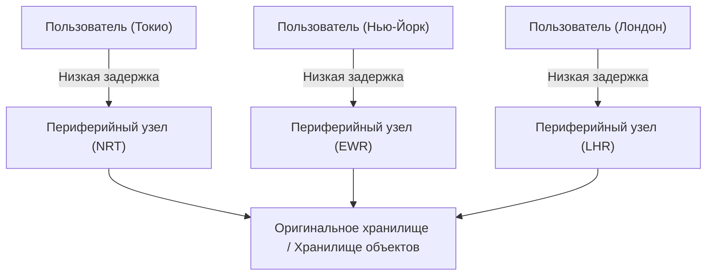
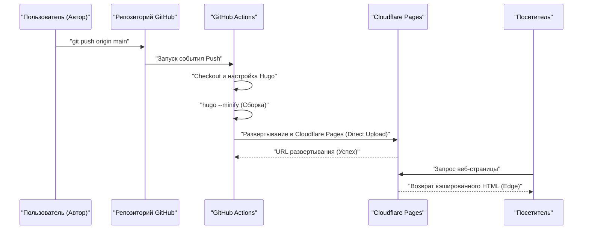
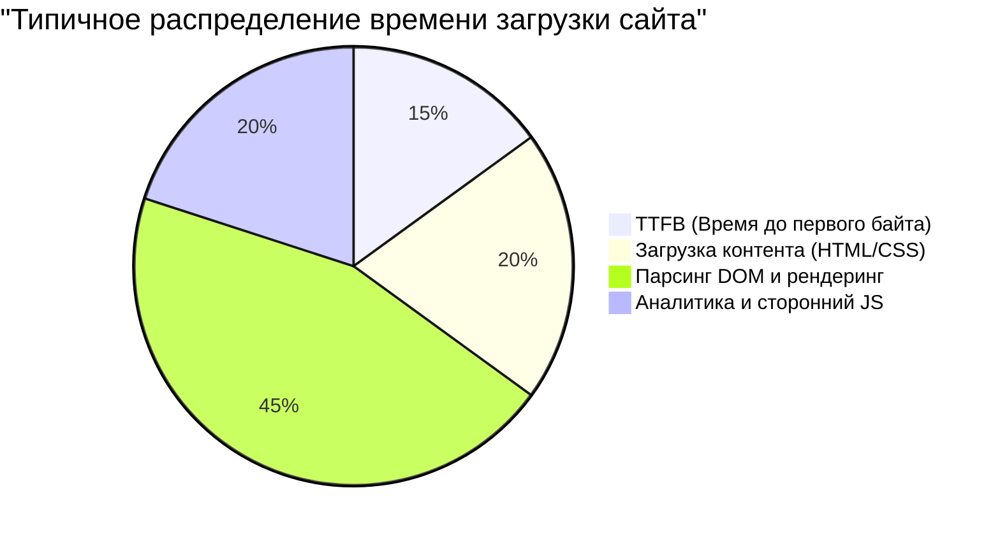

Скорость загрузки (производительность), эксплуатационные расходы и безопасность являются критически важными факторами при управлении веб-сайтом или блогом. Раньше доминировала комбинация динамической CMS (системы управления контентом), такой как WordPress, и арендованного сервера, но сегодня огромное внимание привлекает архитектура, называемая «Jamstack». В частности, объединив «Hugo», сверхбыстрый генератор статических сайтов (SSG), написанный на языке Go, с современными сервисами хостинга, такими как Cloudflare Pages или GitHub Pages, можно создать **совершенно бесплатную и невероятно быструю** среду для блога.

В этой статье мы глубоко погрузимся в технические аспекты и пошагово объясним, как опубликовать статический сайт на Hugo в Cloudflare Pages и GitHub Pages. Мы рассмотрим различия в архитектуре каждой платформы, настройку CI/CD (непрерывная интеграция/непрерывное развертывание) с использованием GitHub Actions, оптимизацию DNS, стратегии кэширования, а также внедрение аналитики, уважающей конфиденциальность пользователей.

---

## 1. Основы генераторов статических сайтов (SSG) и Jamstack

### 1.1 Почему статические сайты?
Традиционные динамические CMS (например, WordPress) при каждом запросе пользователя отправляют запрос к базе данных (например, MySQL) и динамически генерируют HTML на стороне сервера (например, с помощью PHP) перед его возвратом. Хотя этот метод обеспечивает высокую гибкость, он имеет низкую устойчивость к резким всплескам трафика (вирусный эффект или DDoS-атаки) и часто приводит к усложнению инфраструктуры, например, из-за необходимости установки кэширующего сервера (Redis или Varnish) на переднем крае.

С другой стороны, генераторы статических сайтов (SSG), использующие архитектуру Jamstack (JavaScript, APIs, and Markup), генерируют все HTML-файлы, CSS и JavaScript заранее (на этапе сборки). При поступлении запроса от пользователя веб-сервер (или CDN) просто возвращает уже сгенерированный статический файл, что обеспечивает невероятную скорость и надежную безопасность.

### 1.2 Преимущества Hugo
Среди множества SSG, таких как Next.js, Gatsby, Jekyll и Astro, главной отличительной чертой Hugo является **скорость сборки**. Благодаря параллельной обработке на языке Go даже сайты с тысячами или десятками тысяч страниц собираются всего за несколько секунд. Это значительно сокращает время ожидания в пайплайне CI/CD и напрямую улучшает опыт разработчика (DX: Developer Experience).

---

## 2. Сравнение архитектуры хостинговых сервисов

Следующая задача — решить, где хостить статические файлы, сгенерированные Hugo. Основные варианты включают Cloudflare Pages, GitHub Pages и Netlify, но они различаются по своей сетевой архитектуре.

### 2.1 CDN и периферийные вычисления (Edge Computing)
Все эти платформы используют глобально распределенные CDN (сети доставки контента) для доставки контента. Однако ключевым фактором дифференциации является не только кэширование статических файлов, но и возможность выполнения маршрутизации запросов и перезаписи заголовков в ближайшем к пользователю PoP (Point of Presence) с помощью «периферийных вычислений».



### 2.2 GitHub Pages
GitHub Pages — это сервис, который позволяет публиковать файлы HTML, CSS и JavaScript непосредственно из репозитория GitHub. В основе лежит CDN, такой как Fastly, что обеспечивает достаточную производительность. Тем не менее, как чистая инфраструктура он имеет некоторые ограничения: настройка заголовков (например, `Cache-Control` или заголовки безопасности) ограничена, а настройка перенаправлений зависит от meta refresh в HTML или плагинов Jekyll.

### 2.3 Cloudflare Pages
Cloudflare Pages — это сервис хостинга статических сайтов, построенный на базе крупнейшей в мире Anycast-сети Cloudflare (охватывающей более 275 городов).
Он обеспечивает выдающиеся возможности настройки производительности, включая стандартную поддержку HTTP/3 (QUIC), оптимизацию изображений и интеграцию с периферийными функциями (Cloudflare Workers). Большим преимуществом является отсутствие платы за пропускную способность, что позволяет бесплатно работать с сайтом даже при резких всплесках трафика.

### 2.4 Netlify
Netlify является пионером Jamstack и предлагает решение «все в одном» для DX, объединяя функции форм, аутентификации (Identity) и бессерверных функций. Однако следует быть осторожным с контролем затрат, особенно для блогов с большим количеством изображений и видео, так как при превышении бесплатного лимита пропускной способности (100 ГБ в месяц) применяются высокие тарифы за использование.

---

## 3. Теоретический расчет производительности и задержки (математическая модель в LaTeX)

При оценке производительности веб-сайта сокращение задержки (Latency) является важнейшим показателем. Давайте смоделируем, насколько использование CDN (Edge) сокращает задержку по сравнению с прямым доступом к исходному серверу.

Пусть $C$ — вероятность того, что запрос пользователя попадет в кэш («коэффициент попадания в кэш» или Cache Hit Ratio), где $0 \le C \le 1$.
Пусть $L_{origin}$ — задержка до исходного сервера, а $L_{edge}$ — задержка до ближайшего периферийного узла.

Новая средняя задержка $L_{new}$ рассчитывается как следующее математическое ожидание:

$$ L_{new} = C \times L_{edge} + (1 - C) \times (L_{edge} + L_{origin}) $$

Упростив это уравнение, получим:

$$ L_{new} = L_{edge} + (1 - C) \times L_{origin} $$

Например, если пользователь в Токио обращается к исходному серверу на восточном побережье США (Нью-Йорк), учитывая физическое расстояние по оптоволокну и задержку обработки маршрутизатором, $L_{origin}$ составит около 200 мс. С другой стороны, если используется CDN, например Cloudflare, пользователь может подключиться к периферийному узлу в Токио, и $L_{edge}$ сократится примерно до 10 мс.

Предположим, что коэффициент попадания в кэш $C = 0.95$ (95%):

$$ L_{new} = 10 + (1 - 0.95) \times 200 = 10 + 0.05 \times 200 = 10 + 10 = 20 \text{ мс} $$

Таким образом, внедрение CDN может кардинально (примерно на 90%) сократить среднюю задержку с 210 мс до 20 мс.

---

## 4. Построение пайплайна CI/CD с помощью GitHub Actions

Для автоматизации процесса обновления блога Hugo мы настроим пайплайн CI/CD с использованием GitHub Actions. Благодаря этому вам достаточно написать статью в Markdown локально и выполнить `git push`, после чего автоматически запустится сборка и сайт будет развернут на Cloudflare Pages или GitHub Pages.

На следующей диаграмме последовательности показан весь процесс от отправки (push) статьи до её доставки пользователю:



### 4.1 Настройка развертывания для Cloudflare Pages (Direct Upload)

В Cloudflare Pages есть два способа: подключить репозиторий GitHub для сборки в инфраструктуре Cloudflare или выполнить «Direct Upload» (прямую загрузку) статических файлов, собранных с помощью GitHub Actions. Если вы хотите более строго управлять версией Hugo и связывать его с другими задачами (такими как тестирование или оптимизация изображений), рекомендуется собирать проект в GitHub Actions и использовать Direct Upload.

Ниже приведен практический пример файла `.github/workflows/deploy.yml` для развертывания в Cloudflare Pages.

```yaml
name: "Deploy Hugo site to Cloudflare Pages"

on:
  push:
    branches:
      - "main"
  workflow_dispatch:

jobs:
  build-and-deploy:
    runs-on: "ubuntu-latest"
    steps:
      - name: "Checkout repository"
        uses: "actions/checkout@v4"
        with:
          submodules: "recursive"
          fetch-depth: 0

      - name: "Setup Hugo"
        uses: "peaceiris/actions-hugo@v3"
        with:
          hugo-version: "0.125.0"
          extended: true

      - name: "Build Hugo Site"
        run: "hugo --minify --gc"
        env:
          HUGO_ENVIRONMENT: "production"

      - name: "Deploy to Cloudflare Pages"
        uses: "cloudflare/pages-action@v1"
        with:
          apiToken: ${{ secrets.CLOUDFLARE_API_TOKEN }}
          accountId: ${{ secrets.CLOUDFLARE_ACCOUNT_ID }}
          projectName: "your-project-name"
          directory: "public"
          gitHubToken: ${{ secrets.GITHUB_TOKEN }}
          branch: "main"
```

В этом пайплайне файлы HTML/CSS/JS минифицируются с помощью опции `--minify`, а ненужные файлы удаляются с помощью `--gc`. Это основы оптимизации производительности.

---

## 5. Глубокое погружение в настройки DNS: пользовательские домены и записи CNAME / ALIAS

При использовании собственного домена (например, `kenji.blog`) правильная настройка DNS (Domain Name System) просто необходима.

### 5.1 Ограничения записей CNAME и Zone Apex
Обычно при направлении поддомена (например, `www.kenji.blog`) на внешний сервис используется запись `CNAME`. Однако спецификации DNS (RFC 1034) не позволяют устанавливать запись `CNAME` для корневого домена (Zone Apex, также называемого голым доменом, например, `kenji.blog`). Это правило связано с тем, что в Zone Apex обязательно должны присутствовать записи SOA (Start of Authority), NS (Name Server) и MX (Mail Exchange), а CNAME не может сосуществовать с другими записями ресурсов.

### 5.2 Решение: записи ALIAS / ANAME / CNAME Flattening
Для решения этой проблемы современные DNS-провайдеры предлагают собственные расширения:

- **Записи ALIAS / ANAME**: Динамически разрешают имена на стороне DNS-сервера и возвращают клиенту конечную запись A (IP-адрес). Поддерживается такими сервисами, как Amazon Route 53.
- **CNAME Flattening**: Функция, предоставляемая Cloudflare. Она действует так, как если бы CNAME был настроен для Zone Apex, но при этом авторитетный DNS-сервер Cloudflare прозрачно возвращает клиенту автоматически разрешенные IP-адреса (записи A и AAAA).

При использовании Cloudflare Pages наиболее бесшовной и высокопроизводительной конфигурацией является делегирование серверов имен вашего домена в Cloudflare и использование этой функции «CNAME Flattening».

---

## 6. Стратегия кэширования и управление HTTP-заголовками

Еще одним ключом к ускорению работы статических сайтов является «стратегия кэширования». В Cloudflare Pages вы можете использовать сгенерированный файл (`_headers` файл) для точного управления HTTP-заголовками ответа.

### 6.1 Edge Cache против Browser Cache
Кэш можно разделить на две основные категории: «Edge Cache» (кэш на периферии), хранящийся на стороне CDN, и «Browser Cache» (кэш браузера), сохраняемый в браузере пользователя.

В идеале статические файлы (изображения, CSS, JS и т.д., чьи имена файлов содержат хэш) должны кэшироваться браузером на длительное время. С другой стороны, чтобы обновления HTML-файлов отражались немедленно, обычно делают кэш браузера коротким (или отключают его) и обрабатывают их с помощью кэша на периферии (edge cache).

Пример настройки `_headers` в Cloudflare Pages:

```text
# HTML-файлы не кэшируются браузером и проверяются каждый раз
/*.html
  Cache-Control: public, max-age=0, must-revalidate

# Ресурсные файлы (CSS/JS/изображения) кэшируются в браузере на 1 год
/assets/*
  Cache-Control: public, max-age=31536000, immutable
/img/*
  Cache-Control: public, max-age=31536000, immutable
```

### 6.2 Формула расчета снижения затрат на пропускную способность
Настраивая правильные заголовки кэширования, вы можете значительно сократить объем передаваемых данных с сервера (периферии). Ежемесячные затраты на пропускную способность $Cost$ могут быть выражены следующей моделью на основе объема передачи $B_i$ каждого ресурса, коэффициента попадания в кэш $C_i$ и цены за единицу пропускной способности $R$:

$$ Cost = \sum_{i=1}^{n} \left( B_i \times (1 - C_i) \times R \right) $$

Поскольку Cloudflare не взимает плату за исходящий трафик ($R = 0$), прямые финансовые затраты составляют $0$. Однако, если вы используете другие инфраструктуры, такие как GitHub Pages, или используете AWS S3 в качестве бэкенда, максимизация коэффициента попадания в кэш $C_i$ имеет решающее значение для снижения затрат на инфраструктуру.

---

## 7. Веб-аналитика, сочетающая конфиденциальность и производительность

При ведении блога веб-аналитика (Web Analytics) необходима для понимания того, сколько пользователей его посещают. Долгое время Google Analytics (GA4) был стандартом де-факто, но в связи с недавними тенденциями в области защиты конфиденциальности (GDPR, CCPA) и отказом от сторонних файлов cookie, ситуация меняется.

### 7.1 Влияние на веб-производительность
Внедрение Google Analytics (в частности, `gtag.js` или Google Tag Manager) приводит к загрузке и выполнению множества внешних скриптов, что негативно сказывается на производительности (особенно на TTFB и времени блокировки основного потока).

Давайте разобьем время загрузки сайта на компоненты:



Нередко на сторонние JS-инструменты аналитики уходит около 20–30% всего времени загрузки.

### 7.2 Внедрение Cloudflare Web Analytics
В связи с этим привлекают внимание аналитические инструменты, ориентированные на конфиденциальность и не использующие файлы cookie (Cookieless), такие как Cloudflare Web Analytics и Plausible Analytics.

Cloudflare Web Analytics работает просто путем встраивания очень легкого фрагмента JavaScript и не выдает файлы cookie, поэтому вам не нужно устанавливать раздражающий баннер согласия на использование файлов cookie (Cookie Consent Banner).

Его внедрение в Hugo также очень просто. Просто добавьте предоставленный фрагмент в `layouts/partials/head.html` или `layouts/partials/analytics.html`.

```html
{{ if eq hugo.Environment "production" }}
<!-- Cloudflare Web Analytics -->
<script defer src='https://static.cloudflareinsights.com/beacon.min.js' data-cf-beacon='{"token": "YOUR_CLOUDFLARE_BEACON_TOKEN"}'></script>
<!-- End Cloudflare Web Analytics -->
{{ end }}
```

Добавив атрибут `defer`, скрипт загружается асинхронно, не блокируя парсинг HTML, и выполняется после построения DOM. Это сводит к минимуму влияние на начальную скорость отображения (LCP: Largest Contentful Paint и FCP: First Contentful Paint).

---

## 8. Заключение и лучшие практики

При работе со статическими сайтами на Hugo использование современных хостинговых платформ, таких как Cloudflare Pages или GitHub Pages, дает огромные преимущества с точки зрения экономической эффективности, скорости загрузки и безопасности.

1. **Сверхбыстрые сборки**: Используйте скорость Hugo, чтобы минимизировать время выполнения пайплайна CI/CD (GitHub Actions).
2. **Доставка на периферии**: Используйте периферийную сеть Cloudflare для доставки контента пользователям по всему миру с задержками порядка миллисекунд.
3. **Правильная настройка DNS**: Используйте CNAME Flattening для безопасной и быстрой работы Zone Apex (пользовательский домен).
4. **Оптимизация стратегии кэширования**: Используйте `_headers`, чтобы правильно разделить кэширование в браузере и кэширование на периферии для каждого типа ресурсов.
5. **Легкая аналитика**: Внедрите такие решения, как Cloudflare Web Analytics, которые уважают конфиденциальность без ущерба для производительности.

Объединив все это, вы сможете бесплатно создать масштабируемую и надежную систему блогов, способную выдерживать огромный трафик — миллионы просмотров страниц в месяц. Если вы планируете запустить технический блог, корпоративный сайт или сайт-портфолио, обязательно попробуйте эту комбинацию Jamstack + Hugo + Cloudflare Pages.
