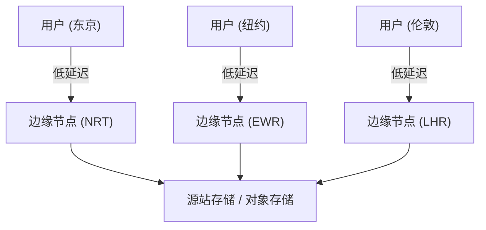
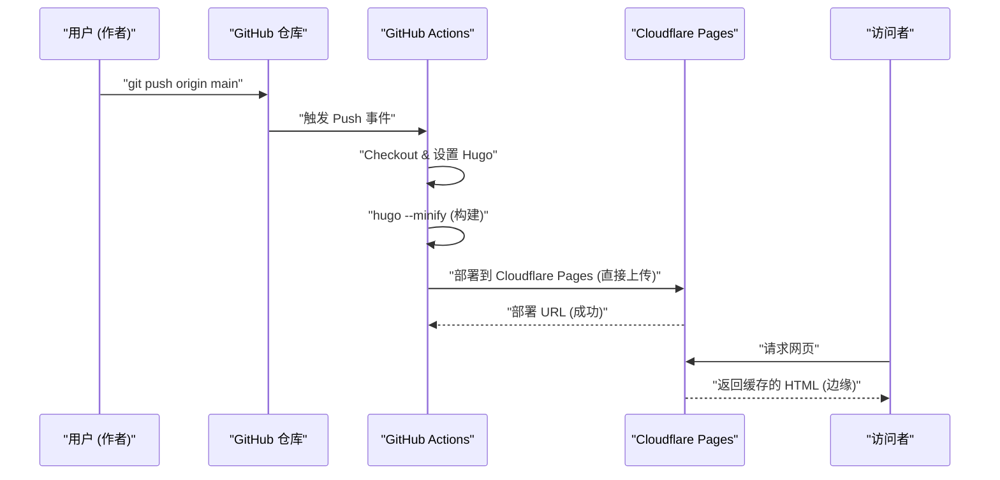
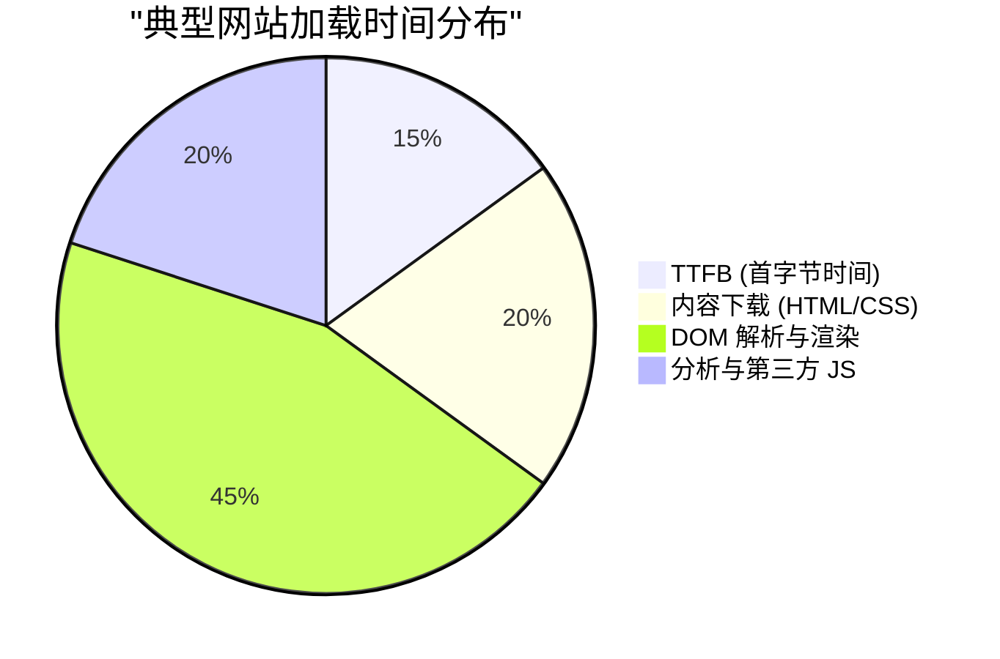

在运营网站或博客时，页面加载速度（性能）、运营成本以及安全性是至关重要的因素。过去，动态CMS（内容管理系统，如WordPress）与租用服务器的组合是主流，但现在，被称为“Jamstack”的架构受到了极大的关注。其中，将由Go语言编写的超高速静态网站生成器（SSG）“Hugo”与Cloudflare Pages或GitHub Pages等现代托管服务相结合，可以构建**完全免费且极速**的博客环境。

本文将从技术角度深入探讨，为您详细讲解将Hugo生成的静态网站发布到Cloudflare Pages和GitHub Pages的具体步骤、各平台在架构上的差异、如何使用GitHub Actions构建CI/CD（持续集成/持续部署）、DNS优化、缓存策略，以及如何引入注重隐私的访问分析工具。

---

## 1. 静态网站生成器（SSG）与Jamstack基础

### 1.1 为什么选择静态网站？
传统的动态CMS（例如：WordPress）在每次收到用户请求时，都会向数据库（如MySQL）发起查询，并在服务器端（如PHP）动态生成HTML后返回。这种方式虽然灵活性高，但应对流量激增（所谓的爆发性流量或DDoS攻击）的抵抗力较低，且往往需要在前端放置缓存服务器（如Redis或Varnish），导致基础设施架构变得复杂。

相比之下，采用Jamstack（JavaScript, APIs, and Markup）架构的静态网站生成器（SSG）会在事前（构建时）生成所有的HTML文件、CSS和JavaScript。当用户发起请求时，Web服务器（或CDN）只需将已生成的静态文件直接返回，从而实现压倒性的高速和坚固的安全性。

### 1.2 Hugo的优势
在SSG中，有Next.js、Gatsby、Jekyll、Astro等多种选择，而Hugo最大的特点在于其**构建速度**。得益于Go语言的并发处理能力，即使是拥有几千到几万页面的网站，构建也能在短短几秒内完成。这大幅减少了CI/CD流水线中的等待时间，直接提升了开发者体验（DX: Developer Experience）。

---

## 2. 托管服务架构比较

将Hugo生成的静态文件托管在哪里，是接下来的课题。典型的选项包括Cloudflare Pages、GitHub Pages以及Netlify，但它们背后的网络架构各有不同。

### 2.1 CDN与边缘计算
这些平台全部利用全球分布的CDN（内容分发网络）来分发内容。然而，与仅仅缓存静态文件不同的是，能否通过“边缘计算”在离用户最近的PoP（节点，Point of Presence）执行请求路由和请求头重写，成为了它们的差异化因素。



### 2.2 GitHub Pages
GitHub Pages是一项能够直接从GitHub仓库发布HTML、CSS和JavaScript文件的服务。其背后使用了Fastly等CDN，能够发挥出色的性能。但是，它在自定义请求头（例如：`Cache-Control`和安全头）方面存在限制，而且重定向设置还需要依赖HTML的meta refresh或Jekyll插件，作为纯粹基础设施的功能显得较为有限。

### 2.3 Cloudflare Pages
Cloudflare Pages是建立在Cloudflare引以为豪的全球最大规模Anycast网络（覆盖275个以上城市）之上的静态网站托管服务。
它原生支持HTTP/3（QUIC）、图像优化以及集成边缘函数（Cloudflare Workers），可以进行极致的性能调优。此外，它不对带宽进行计费，无论流量如何激增都能免费运营，这是一个巨大的优势。

### 2.4 Netlify
Netlify是Jamstack的先驱，提供了集成表单功能、认证（Identity）、无服务器函数等在内的多合一DX体验。然而，当超出免费额度的带宽（每月100GB）时，将会产生高昂的按量计费费用，因此在大量使用图像和视频的博客中需要注意成本控制。

---

## 3. 性能与延迟的理论计算（基于LaTeX的数学模型）

在评估Web性能时，减少延迟（Latency）是最重要的指标。我们来建立一个模型，看看与直接访问源站相比，使用CDN（边缘）能够减少多少延迟。

设用户请求命中缓存的概率为“缓存命中率（Cache Hit Ratio）”，记作 $C$。且 $0 \le C \le 1$。
设到源站的延迟为 $L_{origin}$，到最近边缘节点的延迟为 $L_{edge}$。

新的平均延迟 $L_{new}$ 可以作为以下期望值进行计算：

$$ L_{new} = C \times L_{edge} + (1 - C) \times (L_{edge} + L_{origin}) $$

将此公式简化后如下所示：

$$ L_{new} = L_{edge} + (1 - C) \times L_{origin} $$

例如，当东京的用户访问位于美国东海岸（纽约）的源站时，考虑到光纤的物理距离和路由器处理延迟，$L_{origin}$ 约在 200 ms 左右。另一方面，如果使用像Cloudflare这样的CDN，就可以连接到东京的边缘节点，$L_{edge}$ 会缩短到约 10 ms。

假设缓存命中率为 $C = 0.95$（95%），则：

$$ L_{new} = 10 + (1 - 0.95) \times 200 = 10 + 0.05 \times 200 = 10 + 10 = 20 \text{ ms} $$

由此可见，通过引入CDN，可以将平均延迟从 210 ms 大幅（约90%）降低到 20 ms。

---

## 4. 使用GitHub Actions构建CI/CD流水线

为了自动化Hugo博客的更新流程，我们利用GitHub Actions构建CI/CD流水线。这样一来，只需在本地编写Markdown文章并执行 `git push`，就会自动触发构建，并部署到Cloudflare Pages或GitHub Pages。

以下的时序图展示了从推送文章到分发给用户的整个流程。



### 4.1 针对Cloudflare Pages的部署设置（直接上传）

Cloudflare Pages提供了两种方法：一是绑定GitHub仓库并在Cloudflare的基础设施上进行构建；二是将在GitHub Actions中构建好的静态文件进行“直接上传（Direct Upload）”。如果想更严格地管理Hugo的版本，并与其他任务（如测试和图像优化）联动，推荐在GitHub Actions上构建并使用直接上传的方式。

以下是一个用于部署到Cloudflare Pages的 `.github/workflows/deploy.yml` 实用示例：

```yaml
name: "Deploy Hugo site to Cloudflare Pages"

on:
  push:
    branches:
      - "main"
  workflow_dispatch:

jobs:
  build-and-deploy:
    runs-on: "ubuntu-latest"
    steps:
      - name: "Checkout repository"
        uses: "actions/checkout@v4"
        with:
          submodules: "recursive"
          fetch-depth: 0

      - name: "Setup Hugo"
        uses: "peaceiris/actions-hugo@v3"
        with:
          hugo-version: "0.125.0"
          extended: true

      - name: "Build Hugo Site"
        run: "hugo --minify --gc"
        env:
          HUGO_ENVIRONMENT: "production"

      - name: "Deploy to Cloudflare Pages"
        uses: "cloudflare/pages-action@v1"
        with:
          apiToken: ${{ secrets.CLOUDFLARE_API_TOKEN }}
          accountId: ${{ secrets.CLOUDFLARE_ACCOUNT_ID }}
          projectName: "your-project-name"
          directory: "public"
          gitHubToken: ${{ secrets.GITHUB_TOKEN }}
          branch: "main"
```

在这条流水线中，通过 `--minify` 选项最小化了HTML/CSS/JS代码，并通过 `--gc` 删除了不必要的文件。这些都是性能优化的基本操作。

---

## 5. 深入理解DNS设置：自定义域名与CNAME / ALIAS记录

当使用自定义域名（例如：`kenji.blog`）时，正确的DNS（域名系统）设置是必不可少的。

### 5.1 CNAME记录的限制与Zone Apex
通常情况下，将子域名（例如：`www.kenji.blog`）指向外部服务时，会使用 `CNAME` 记录。然而，根据DNS规范（RFC 1034），根域名（Zone Apex，也称为裸域名，例如：`kenji.blog`）不能设置 `CNAME` 记录。这是因为Zone Apex必须存在SOA（起始授权机构）记录、NS（名称服务器）记录和MX（邮件交换）记录，而规则规定CNAME不能与其他资源记录共存。

### 5.2 解决方案：ALIAS / ANAME / CNAME Flattening
为了解决这个问题，现代的DNS提供商提供了他们独有的扩展功能。

- **ALIAS / ANAME记录**: 在DNS服务器端动态解析，并将最终的A记录（IP地址）返回给客户端。Amazon Route 53等支持该功能。
- **CNAME Flattening**: 这是Cloudflare提供的功能。它表现得就像是在Zone Apex设置了CNAME一样，但实际上是Cloudflare的权威DNS服务器自动解析出一组IP地址（A记录和AAAA记录）并透明地返回给客户端。

如果使用Cloudflare Pages，将域名的名称服务器委托给Cloudflare，并利用这个“CNAME Flattening”功能，将是实现无缝且高性能的最佳架构。

---

## 6. 缓存策略与HTTP请求头控制

在静态网站加速方面，另一个关键点是“缓存策略”。在Cloudflare Pages中，可以利用生成的文件（`_headers` 文件）对HTTP响应头进行精细的控制。

### 6.1 边缘缓存 (Edge Cache) vs 浏览器缓存 (Browser Cache)
缓存大致可以分为在CDN端保存的“边缘缓存（Edge Cache）”和在用户浏览器中保存的“浏览器缓存（Browser Cache）”两种。

对于静态文件（如文件名中包含哈希值的图像、CSS、JS等），理想的做法是让浏览器进行长期的缓存。另一方面，为了使HTML文件的更新能够立即生效，一般的做法是缩短（或禁用）浏览器缓存，转而依赖边缘缓存来处理请求。

Cloudflare Pages中的 `_headers` 设置示例：

```text
# HTML文件不在浏览器缓存，每次都进行验证
/*.html
  Cache-Control: public, max-age=0, must-revalidate

# 资源文件（CSS/JS/图像）让浏览器缓存1年
/assets/*
  Cache-Control: public, max-age=31536000, immutable
/img/*
  Cache-Control: public, max-age=31536000, immutable
```

### 6.2 带宽成本削减的计算公式
通过设置合适的缓存头，可以大幅减少从服务器（边缘）传输的数据量。月度带宽成本 $Cost$ 可以通过各资源的传输量 $B_i$、缓存命中率 $C_i$ 以及带宽单价 $R$ 的以下模型来表示：

$$ Cost = \sum_{i=1}^{n} \left( B_i \times (1 - C_i) \times R \right) $$

由于Cloudflare的下行传输量是免费的（$R = 0$），因此直接的资金成本为 $0$。然而，如果同时使用GitHub Pages等其他基础设施，或者以AWS S3等作为后端，最大化这个缓存命中率 $C_i$ 将是削减基础设施成本的关键。

---

## 7. 兼顾隐私与性能的访问分析

在运营博客时，了解有多少用户访问的访问分析（Web Analytics）是必不可少的。长期以来，Google Analytics（GA4）一直是事实上的标准，但随着近年来隐私保护的趋势（如GDPR、CCPA）以及第三方Cookie的废除，情况正在发生变化。

### 7.1 对Web性能的影响
如果引入Google Analytics（具体来说是 `gtag.js` 或 Google Tag Manager），将会加载和执行大量的外部脚本，从而对性能（尤其是TTFB和主线程阻塞时间）产生负面影响。

让我们将网站的加载时间进行如下分解：



第三方JS分析工具占据总加载时间约20%到30%的情况也并不少见。

### 7.2 引入Cloudflare Web Analytics
因此，像Cloudflare Web Analytics或Plausible Analytics这样，不使用Cookie（Cookieless）且隐私优先的访问分析工具正受到瞩目。

Cloudflare Web Analytics只需嵌入一个非常轻量的JavaScript片段即可运行，由于不生成Cookie，因此无需设置烦人的Cookie同意横幅（Cookie Consent Banner）。

在Hugo中的实现也非常简单。只需在 `layouts/partials/head.html` 或 `layouts/partials/analytics.html` 中添加提供的代码片段即可。

```html
{{ if eq hugo.Environment "production" }}
<!-- Cloudflare Web Analytics -->
<script defer src='https://static.cloudflareinsights.com/beacon.min.js' data-cf-beacon='{"token": "YOUR_CLOUDFLARE_BEACON_TOKEN"}'></script>
<!-- End Cloudflare Web Analytics -->
{{ end }}
```

通过添加 `defer` 属性，可以异步加载脚本而不阻塞HTML的解析，并在DOM构建完成后执行。这样可以把对初始显示速度（LCP: Largest Contentful Paint 和 FCP: First Contentful Paint）的影响降到最低。

---

## 8. 总结与最佳实践

在使用Hugo运营静态网站时，采用像Cloudflare Pages和GitHub Pages这样现代的托管平台，在性价比、加载速度和安全性方面都具有压倒性的优势。

1. **极速构建**: 发挥Hugo的高速特性，将CI/CD流水线（GitHub Actions）的执行时间降至最低。
2. **边缘分发**: 利用Cloudflare的边缘网络，以毫秒级的延迟将内容分发给全球用户。
3. **适当的DNS配置**: 运用CNAME Flattening安全且高速地运营Zone Apex（自定义域名）。
4. **优化缓存策略**: 使用 `_headers` 针对各类资源合理分离浏览器缓存和边缘缓存。
5. **轻量级分析**: 引入兼顾隐私且不损耗性能的Cloudflare Web Analytics等工具。

通过将这些实践结合起来，即可免费构建一个足以应对每月数百万PV级别大规模流量的、可扩展且坚固的博客系统。如果您正在考虑搭建技术博客、企业网站或个人作品集网站，请务必尝试一下这种 Jamstack + Hugo + Cloudflare Pages 的架构。
