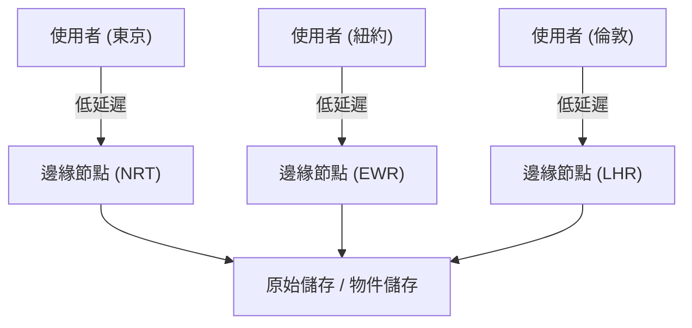
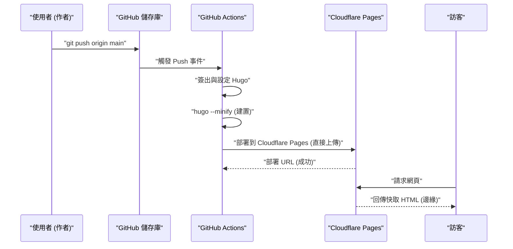
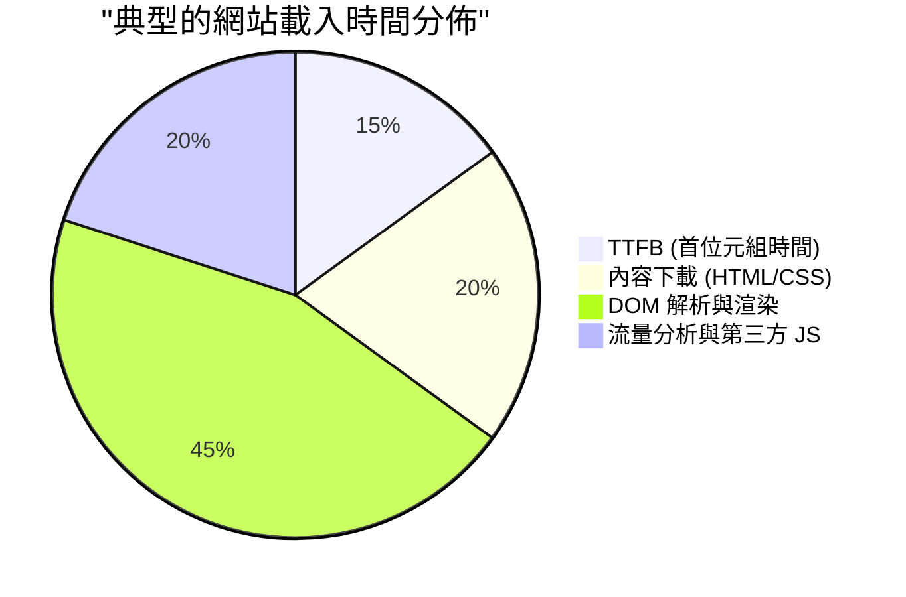

在營運網站或部落格時，載入速度（效能）、營運成本以及安全性是極為重要的因素。過去，像 WordPress 這樣的動態 CMS（內容管理系統）與虛擬主機的組合是主流，但現在被稱為「Jamstack」的架構正受到極大關注。其中，將以 Go 語言編寫的超高速靜態網站產生器（SSG）「Hugo」與 Cloudflare Pages 或 GitHub Pages 等現代代管服務結合，即可建構出**完全免費且極速**的部落格環境。

本文將從技術觀點進行非常深入的探討，說明如何將使用 Hugo 產生的靜態網站在 Cloudflare Pages 或 GitHub Pages 上發布的具體步驟、各平台架構的差異、使用 GitHub Actions 建構 CI/CD（持續整合／持續部署）、DNS 的最佳化、快取策略，以及如何導入兼顧隱私的流量分析工具。

---

## 1. 靜態網站產生器（SSG）與 Jamstack 基礎

### 1.1 為什麼選擇靜態網站？
傳統的動態 CMS（例如：WordPress）在每次收到使用者請求時，都會向資料庫（如 MySQL）發出查詢，並在伺服器端（如 PHP）動態產生 HTML 後回傳。這種方式雖然靈活性高，但對流量激增（所謂的爆紅或 DDoS 攻擊）的承受力較低，往往需要將快取伺服器（如 Redis 或 Varnish）放置在前端，導致基礎設施架構變得複雜。

另一方面，採用 Jamstack（JavaScript, APIs, and Markup）架構的靜態網站產生器（SSG），會事先（在建置時）產生所有的 HTML 檔案、CSS 和 JavaScript。對於使用者的請求，網頁伺服器（或 CDN）只需直接回傳已產生的靜態檔案，因此能實現壓倒性的高速與堅固的安全性。

### 1.2 Hugo 的優勢
SSG 有 Next.js、Gatsby、Jekyll、Astro 等多種選擇，但 Hugo 最大的特色在於其**建置速度**。受惠於 Go 語言的並行處理，即使是擁有數千至數萬個頁面的網站，也只需短短幾秒鐘即可完成建置。這大幅減少了 CI/CD 流程中的等待時間，直接提升了開發者體驗（DX: Developer Experience）。

---

## 2. 代管服務的架構比較

將 Hugo 產生的靜態檔案代管在哪裡是下一個課題。具代表性的選擇包括 Cloudflare Pages、GitHub Pages 以及 Netlify，但它們背後的網路架構各不相同。

### 2.1 CDN 與邊緣運算
這些平台全部都利用全球分散的 CDN（內容傳遞網路）來傳遞內容。然而，不僅僅是靜態檔案的快取，是否能透過「邊緣運算」在最靠近使用者的 PoP（節點）執行請求的路由或標頭改寫，成為了它們的差異化因素。



### 2.2 GitHub Pages
GitHub Pages 是能直接從 GitHub 儲存庫發布 HTML、CSS 和 JavaScript 檔案的服務。其背後使用了 Fastly 等 CDN，能發揮出色的效能。不過，在自訂標頭（例如：設定 `Cache-Control` 或安全性標頭）方面有其限制，且重新導向（Redirect）的設定需要依賴 HTML 的 meta refresh 或 Jekyll 的外掛程式，作為純粹基礎設施的功能稍微受限。

### 2.3 Cloudflare Pages
Cloudflare Pages 是一個建立在 Cloudflare 引以為傲的全球最大規模 Anycast 網路（部署於 275 個以上城市）之上的靜態網站代管服務。
支援 HTTP/3（QUIC）標準、圖片最佳化以及邊緣函式（Cloudflare Workers）的整合，可進行壓倒性的效能調校。此外，它沒有頻寬計費，無論流量如何激增都能免費營運，這是其一大優勢。

### 2.4 Netlify
Netlify 是 Jamstack 的先驅，提供整合表單功能、驗證（Identity）、無伺服器函式等 All-in-One 的開發者體驗。然而，一旦超過免費額度的頻寬（每月 100GB），將會產生高昂的按量計費，因此在大量使用圖片或影片的部落格中需要注意成本控管。

---

## 3. 效能與延遲的理論計算（使用 LaTeX 的數學模型）

在評估網站效能時，減少延遲（Latency）是最重要的指標。讓我們來建立一個模型，看看使用 CDN（邊緣節點）相較於直接存取原始伺服器，能減少多少延遲。

將使用者請求命中快取的機率設為「快取命中率（Cache Hit Ratio）」，並以 $C$ 表示。$0 \le C \le 1$。
將到達原始伺服器的延遲設為 $L_{origin}$，到達最近邊緣節點的延遲設為 $L_{edge}$。

新的平均延遲 $L_{new}$ 將以下列的期望值來計算：

$$ L_{new} = C \times L_{edge} + (1 - C) \times (L_{edge} + L_{origin}) $$

將此公式簡化後如下：

$$ L_{new} = L_{edge} + (1 - C) \times L_{origin} $$

例如，當東京的使用者存取位於美國東岸（紐約）的原始伺服器時，若考慮光纖的物理距離與路由器的處理延遲，$L_{origin}$ 大約是 200 ms。另一方面，如果使用像 Cloudflare 這樣的 CDN，因為可以連線到東京的邊緣節點，$L_{edge}$ 將縮短至約 10 ms。

假設快取命中率 $C = 0.95$（95%），

$$ L_{new} = 10 + (1 - 0.95) \times 200 = 10 + 0.05 \times 200 = 10 + 10 = 20 \text{ ms} $$

像這樣，透過導入 CDN，可以將平均延遲從 210 ms 戲劇性地（約 90%）減少至 20 ms。

---

## 4. 使用 GitHub Actions 建構 CI/CD 流程

為了將 Hugo 部落格的更新流程自動化，我們將使用 GitHub Actions 建構 CI/CD 流程。如此一來，只需在本地端撰寫 Markdown 文章並執行 `git push`，就會自動進行建置，並部署到 Cloudflare Pages 或 GitHub Pages 上。

以下循序圖顯示了從推送文章到傳遞給使用者的整體流程。



### 4.1 針對 Cloudflare Pages 的部署設定（Direct Upload）

Cloudflare Pages 有兩種方式：一種是連結 GitHub 儲存庫並在 Cloudflare 的基礎設施上建置，另一種是將透過 GitHub Actions 建置好的靜態檔案「直接上傳（Direct Upload）」。如果您想要更嚴謹地進行 Hugo 的版本控制，並與其他作業（測試或圖片最佳化）連動，建議採用在 GitHub Actions 上建置並 Direct Upload 的方式。

以下是部署到 Cloudflare Pages 的 `.github/workflows/deploy.yml` 實務範例。

```yaml
name: "Deploy Hugo site to Cloudflare Pages"

on:
  push:
    branches:
      - "main"
  workflow_dispatch:

jobs:
  build-and-deploy:
    runs-on: "ubuntu-latest"
    steps:
      - name: "Checkout repository"
        uses: "actions/checkout@v4"
        with:
          submodules: "recursive"
          fetch-depth: 0

      - name: "Setup Hugo"
        uses: "peaceiris/actions-hugo@v3"
        with:
          hugo-version: "0.125.0"
          extended: true

      - name: "Build Hugo Site"
        run: "hugo --minify --gc"
        env:
          HUGO_ENVIRONMENT: "production"

      - name: "Deploy to Cloudflare Pages"
        uses: "cloudflare/pages-action@v1"
        with:
          apiToken: ${{ secrets.CLOUDFLARE_API_TOKEN }}
          accountId: ${{ secrets.CLOUDFLARE_ACCOUNT_ID }}
          projectName: "your-project-name"
          directory: "public"
          gitHubToken: ${{ secrets.GITHUB_TOKEN }}
          branch: "main"
```

在這個流程中，透過 `--minify` 參數將 HTML/CSS/JS 最小化，並透過 `--gc` 刪除不必要的檔案。這些都是效能最佳化的基礎。

---

## 5. 深入 DNS 設定：自訂網域與 CNAME / ALIAS 紀錄

當使用自訂網域（例如：`kenji.blog`）時，適當的 DNS（網域名稱系統）設定是不可或缺的。

### 5.1 CNAME 紀錄的限制與 Zone Apex
通常，將子網域（例如：`www.kenji.blog`）指向外部服務時，會使用 `CNAME` 紀錄。然而，根據 DNS 規範（RFC 1034），根網域（Zone Apex，也稱為裸網域，例如：`kenji.blog`）無法設定 `CNAME` 紀錄。這是因為 Zone Apex 必須存在 SOA（Start of Authority）紀錄、NS（Name Server）紀錄或 MX（Mail Exchange）紀錄，而 CNAME 有無法與其他資源紀錄共存的規則。

### 5.2 解決方案：ALIAS / ANAME / CNAME Flattening
為了解決這個問題，現代的 DNS 服務商提供了獨家的擴充功能。

- **ALIAS / ANAME 紀錄**：在 DNS 伺服器端動態進行名稱解析，並將最終的 A 紀錄（IP 位址）回傳給客戶端。Amazon Route 53 等支援此功能。
- **CNAME Flattening**：這是 Cloudflare 提供的功能。它讓您可以像在 Zone Apex 上設定 CNAME 一樣，而 Cloudflare 的權威 DNS 伺服器會自動解析並將 IP 位址群（A 紀錄及 AAAA 紀錄）透明地回傳給客戶端。

在使用 Cloudflare Pages 時，將網域的名稱伺服器委派給 Cloudflare，並活用這個「CNAME Flattening」是最無縫且高效能的架構。

---

## 6. 快取策略與 HTTP 標頭控制

在加速靜態網站方面，另一個關鍵在於「快取策略」。在 Cloudflare Pages 中，可以利用產生的檔案（`_headers` 檔案）來詳細控制 HTTP 回應標頭。

### 6.1 邊緣快取 vs 瀏覽器快取
快取大致分為在 CDN 端保留的「邊緣快取（Edge Cache）」以及儲存在使用者瀏覽器中的「瀏覽器快取（Browser Cache）」兩種。

靜態檔案（圖片、CSS、JS 等檔名中包含雜湊值的檔案）理想情況下是讓瀏覽器長時間快取。另一方面，為了能立即反映 HTML 檔案的更新，通常會將瀏覽器快取縮短（或停用），並交由邊緣快取來處理，這是一般的架構。

Cloudflare Pages 中的 `_headers` 設定範例：

```text
# HTML 檔案不進行瀏覽器快取，每次都重新驗證
/*.html
  Cache-Control: public, max-age=0, must-revalidate

# 資源檔案（CSS/JS/圖片）讓瀏覽器快取 1 年
/assets/*
  Cache-Control: public, max-age=31536000, immutable
/img/*
  Cache-Control: public, max-age=31536000, immutable
```

### 6.2 減少頻寬成本的計算公式
透過設定適當的快取標頭，可以大幅減少伺服器（邊緣節點）的資料傳輸量。每月的頻寬成本 $Cost$ 可由各資源的傳輸量 $B_i$、快取命中率 $C_i$ 以及頻寬單價 $R$ 以下列模型表示：

$$ Cost = \sum_{i=1}^{n} \left( B_i \times (1 - C_i) \times R \right) $$

由於 Cloudflare 的下行傳輸量是免費的（$R = 0$），因此直接的資金成本將為 $0$。但是，若同時使用 GitHub Pages 等其他基礎設施，或是以 AWS S3 等作為後端時，將此快取命中率 $C_i$ 最大化，將成為減少基礎設施成本的關鍵。

---

## 7. 兼顧隱私與效能的流量分析

在營運部落格時，為了了解有多少使用者造訪，流量分析（Web Analytics）是不可或缺的。長久以來，Google Analytics（GA4）一直是業界標準，但隨著近年來隱私保護的趨勢（GDPR、CCPA）以及第三方 Cookie 的淘汰，情況正在發生變化。

### 7.1 對網頁效能的影響
如果導入 Google Analytics（具體來說是 `gtag.js` 或 Google Tag Manager），將會產生大量外部腳本的載入與執行，對效能（尤其是 TTFB 和主執行緒的阻塞時間）產生不良影響。

讓我們將網站的載入時間分解如下：



第三方 JS 分析工具佔據整體載入時間約 20% 到 30% 也是很常見的情況。

### 7.2 導入 Cloudflare Web Analytics
因此，像 Cloudflare Web Analytics 或 Plausible Analytics 這種不使用 Cookie（Cookieless）且隱私優先的流量分析工具正受到關注。

Cloudflare Web Analytics 只要嵌入非常輕量的 JavaScript 程式碼片段即可運作，且不會發行 Cookie，因此不需要設置繁瑣的 Cookie 同意橫幅（Cookie Consent Banner）。

在 Hugo 中的實作也非常簡單。只需將提供的程式碼片段加入 `layouts/partials/head.html` 或 `layouts/partials/analytics.html` 中即可。

```html
{{ if eq hugo.Environment "production" }}
<!-- Cloudflare Web Analytics -->
<script defer src='https://static.cloudflareinsights.com/beacon.min.js' data-cf-beacon='{"token": "YOUR_CLOUDFLARE_BEACON_TOKEN"}'></script>
<!-- End Cloudflare Web Analytics -->
{{ end }}
```

透過加上 `defer` 屬性，可以在不阻塞 HTML 解析的情況下非同步載入腳本，並在 DOM 建構完成後執行。這樣可以將對初始顯示速度（LCP: Largest Contentful Paint 和 FCP: First Contentful Paint）的影響降至最低。

---

## 8. 總結與最佳實務

在使用 Hugo 營運靜態網站時，採用 Cloudflare Pages 或 GitHub Pages 等現代代管平台，在成本效益、載入速度以及安全性等各方面都具有壓倒性的優勢。

1. **極速的建置**：善用 Hugo 的高速特性，將 CI/CD 流程（GitHub Actions）的執行時間最小化。
2. **在邊緣節點傳遞**：利用 Cloudflare 的邊緣網路，以毫秒級的延遲將內容傳遞給全球使用者。
3. **適當的 DNS 架構**：活用 CNAME Flattening 安全且高速地營運 Zone Apex（自訂網域）。
4. **快取策略最佳化**：使用 `_headers`，針對不同資源類型適當地分離瀏覽器快取與邊緣快取。
5. **輕量級的分析工具**：導入兼顧隱私且不損害效能的 Cloudflare Web Analytics 等工具。

透過結合這些技術，可以免費建構出能夠承受每月數百萬 PV 等級大規模流量，且具備高可擴充性與堅固性的部落格系統。正在考慮建立技術部落格、企業網站或作品集網站的人，請務必嘗試這個 Jamstack + Hugo + Cloudflare Pages 的組合。
