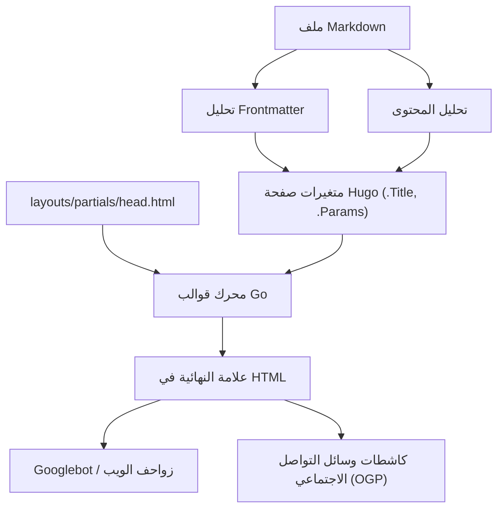
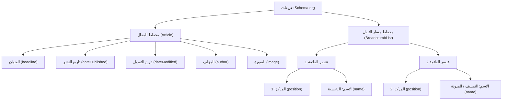

Hugo هو أحد أسرع مولدات المواقع الثابتة (SSG) في العالم، ومكتوب بلغة Go. يحظى بدعم كبير من العديد من المهندسين والمدونين بفضل سرعة بنائه الهائلة ونظام القوالب المرن الخاص به. ومع ذلك، مجرد إنشاء الموقع وعرضه بسرعة لا يكفي ليتم تقييمه بشكل عالٍ من قبل محركات البحث (مثل Google و Bing) وإيصال المقالات إلى المستخدمين.

لتحسين ترتيب البحث، وزيادة القدرة على الانتشار في وسائل التواصل الاجتماعي، وبالتالي زيادة عدد الزيارات إلى المدونة بشكل كبير، فإن إجراءات تحسين محركات البحث (SEO) الدقيقة تعتبر أمرًا ضروريًا. يكمن قلب تحسين محركات البحث في Hugo في التعاون بين **Frontmatter**، الذي يُكتب في بداية كل مقال بصيغة Markdown، و**القوالب (Layouts)** التي تفسره وتنشر البيانات الوصفية داخل علامة `<head>` في HTML.

في هذا المقال، سنشرح بالتفصيل وبحجم هائل يتجاوز 10,000 حرف كيفية تحقيق أقصى استفادة من ميزات Hugo وتنفيذ إجراءات SEO المتقدمة، بدءًا من إعدادات Frontmatter، ومرورًا بعلامات الميتا (Meta Tags) المختلفة، و OGP (Open Graph Protocol)، و Twitter Cards، وصولًا إلى إخراج البيانات المنظمة باستخدام JSON-LD.

---

## 1. الخلفية الرياضية لتحسين محركات البحث وحركة المرور

قبل الدخول في التنفيذ العملي، دعونا نفهم رياضيًا سبب أهمية البيانات الوصفية الدقيقة لـ SEO. يتم تحديد حركة المرور $T$ التي يمكن لموقع الويب الحصول عليها بناءً على حجم البحث للكلمة الرئيسية المستهدفة ومعدل النقر (CTR) بناءً على ترتيب البحث.

يمكن التعبير عن ذلك بالمعادلة التالية:

$$ T = \sum_{i=1}^{n} V_i \times CTR(R_i) $$

- $V_i$ : حجم البحث الشهري للكلمة الرئيسية $i$
- $R_i$ : ترتيب البحث للكلمة الرئيسية $i$
- $CTR(R_i)$ : معدل النقر (CTR) عند الترتيب $R_i$

من بين هذه العوامل، يعتمد ترتيب البحث $R_i$ على العديد من العوامل مثل جودة المحتوى والروابط الخلفية (PageRank)، ولكن تم تصميم خوارزمية PageRank الأولية لـ Google على النحو التالي:

$$ PR(u) = \frac{1-d}{N} + d \sum_{v \in B(u)} \frac{PR(v)}{L(v)} $$

- $PR(u)$ : ترتيب الصفحة (PageRank) للصفحة $u$
- $d$ : عامل التخميد (Damping factor) (عادةً 0.85)
- $B(u)$ : مجموعة الصفحات التي ترتبط للصفحة $u$
- $L(v)$ : عدد الروابط الصادرة من الصفحة $v$

النقطة المهمة هنا هي، **بالإضافة إلى الجهد المبذول لرفع ترتيب البحث $R_i$، كيف يمكننا زيادة معدل النقر $CTR(R_i)$ إلى الحد الأقصى**. من خلال تحسين العنوان والمقتطف (description) المعروضين في نتائج البحث (SERPs)، والصورة المصغرة (OGP) عند مشاركة المقال على وسائل التواصل الاجتماعي، يمكن رفع $CTR(R_i)$ بشكل مقصود. ترتبط إعدادات SEO في Frontmatter بشكل مباشر بزيادة هذا الـ $CTR$ إلى الحد الأقصى.

---

## 2. عملية البناء في Hugo ودور Frontmatter

يقوم Hugo بقراءة Frontmatter (بصيغ YAML/TOML/JSON) الموجود داخل ملف Markdown، ويمرره كمتغيرات صفحة إلى محرك القوالب. دعونا نفهم أولاً تدفق هذه المعلومات بشكل مرئي.



وبهذه الطريقة، يتم تمرير القيم المحددة في Frontmatter كمتغيرات مثل `.Title` و `.Params.description` إلى `head.html`، ويتم إخراجها في النهاية كبيانات وصفية في HTML. لذلك، فإن نجاح تحسين محركات البحث يتكون من خطوتين: "تعريف المعلومات المناسبة في Frontmatter" و "تحويلها بشكل صحيح إلى HTML في القالب".

---

## 3. إعداد البيانات الوصفية الأساسية: Title, Description, Canonical URL

العلامات الأساسية لمحركات البحث لفهم محتوى الصفحة هي `<title>` و `<meta name="description">`. بالإضافة إلى ذلك، فإن `<link rel="canonical">` ضروري لتجنب عقوبة المحتوى المكرر.

### 3.1. مثال على إعداد Frontmatter

في Frontmatter الخاص بالمقال، نقوم بإعداد حقول مخصصة لتحسين محركات البحث.

```yaml
---
title: 'تحسين محركات البحث لمدونة Hugo: إعدادات Frontmatter لزيادة عدد الزيارات بشكل كبير'
seo_title: 'الدليل الشامل لتحسين محركات البحث في Hugo: زيادة الزيارات عبر Frontmatter' # اختياري: لمحركات البحث
description: 'طرق متقدمة لتحسين محركات البحث باستخدام Frontmatter في Hugo. شرح مفصل لكيفية إعداد OGP و JSON-LD والبيانات الوصفية.'
slug: "hugo-seo-frontmatter-tips"
canonicalUrl: "https://example.com/post/hugo-seo-frontmatter-tips/" # رابط أساسي صريح
---
```

### 3.2. تنفيذ `layouts/partials/head.html`

سنقوم بإنشاء قالب HTML لإخراج هذه المتغيرات بشكل صحيح.

```html
<!-- تحسين العنوان -->
{{ $title := .Title }}
{{ if .Params.seo_title }}
  {{ $title = .Params.seo_title }}
{{ end }}
<title>{{ $title }} | {{ .Site.Title }}</title>

<!-- تحسين الوصف -->
{{ $description := .Summary | plainify | truncate 120 }}
{{ if .Params.description }}
  {{ $description = .Params.description }}
{{ end }}
<meta name="description" content="{{ $description }}">

<!-- Canonical URL (الرابط الأساسي) -->
{{ $canonical := .Permalink }}
{{ if .Params.canonicalUrl }}
  {{ $canonical = .Params.canonicalUrl }}
{{ end }}
<link rel="canonical" href="{{ $canonical }}">

<!-- التحكم في الروبوتات (مثل إعدادات منع الفهرسة) -->
{{ if .Params.noindex }}
<meta name="robots" content="noindex, nofollow">
{{ else }}
<meta name="robots" content="index, follow">
{{ end }}
```

باستخدام `.Summary` من Hugo كخيار احتياطي، يمكن استخراج الجملة الافتتاحية للمقال تلقائيًا حتى إذا لم يتم تعيين `description`.

---

## 4. OGP و Twitter Cards: زيادة CTR على وسائل التواصل الاجتماعي إلى الحد الأقصى

عند مشاركة مقال على منصات التواصل الاجتماعي مثل Twitter (X) أو Facebook، فإن إعدادات Open Graph Protocol (OGP) و Twitter Cards ضرورية لعرض المقال بتنسيق بطاقة جذابة. يتم إنشاء هذا أيضًا ديناميكيًا من Frontmatter.

### 4.1. تحديات القوالب المدمجة

يحتوي Hugo على قالب مدمج مفيد `{{ template "_internal/opengraph.html" . }}`، ولكنه يفتقر إلى القابلية للتخصيص، وقد لا يتناسب مع البيئات غير الإنجليزية أو المتطلبات الخاصة. لذلك، نوصي بشدة بتنفيذ علامات OGP المخصصة داخل `head.html`.

### 4.2. تحديد الصور في Frontmatter

```yaml
---
image: "img/eyecatch.jpg"
images:
  - "img/eyecatch-large.jpg" # لتحديد صور متعددة أو مسارات مطلقة
---
```

### 4.3. كود التنفيذ المخصص لـ OGP و Twitter Cards

```html
<!-- Open Graph Protocol -->
<meta property="og:title" content="{{ $title }}">
<meta property="og:description" content="{{ $description }}">
<meta property="og:type" content="{{ if .IsPage }}article{{ else }}website{{ end }}">
<meta property="og:url" content="{{ .Permalink }}">
<meta property="og:site_name" content="{{ .Site.Title }}">

<!-- معالجة صورة OGP -->
{{ $ogImage := "" }}
{{ if .Params.image }}
  {{ $ogImage = .Params.image | absURL }}
{{ else if .Params.images }}
  {{ $ogImage = index .Params.images 0 | absURL }}
{{ else if .Site.Params.defaultImage }}
  {{ $ogImage = .Site.Params.defaultImage | absURL }}
{{ end }}

{{ if $ogImage }}
<meta property="og:image" content="{{ $ogImage }}">
<meta name="twitter:image" content="{{ $ogImage }}">
<meta name="twitter:card" content="summary_large_image">
{{ else }}
<meta name="twitter:card" content="summary">
{{ end }}

<!-- Twitter Cards -->
<meta name="twitter:title" content="{{ $title }}">
<meta name="twitter:description" content="{{ $description }}">
{{ if .Site.Params.twitterAccount }}
<meta name="twitter:site" content="@{{ .Site.Params.twitterAccount }}">
{{ end }}
```

من خلال استخدام الدالة `absURL`، يتم تحويل عنوان URL للصورة المحدد بمسار نسبي إلى مسار مطلق. نظرًا لأن المسارات المطلقة إلزامية في OGP، فإن هذه العملية بالغة الأهمية.

---

## 5. تنفيذ البيانات المنظمة (JSON-LD)

في تحسين محركات البحث الحالي، أصبح **JSON-LD (JavaScript Object Notation for Linked Data)** هو التقنية السائدة لنقل البنية الدلالية للصفحة بدقة إلى محركات البحث. من خلال إعداد هذا، يصبح من السهل عرض المقتطفات المنسقة (التقييم بالنجوم، اسم المؤلف، تاريخ النشر، إلخ) في نتائج البحث.

### 5.1. بنية JSON-LD

في مقالات المدونة، يتم بشكل رئيسي تنفيذ مخططين: مخطط المقال (`Article`) ومخطط مسار التنقل (`BreadcrumbList`).



### 5.2. إنشاء JSON-LD في قوالب Hugo

سنستخدم متغيرات Frontmatter مثل `.Date` و `.Lastmod` لإخراج JSON-LD ديناميكيًا. يتم كتابته في `head.html` باستخدام علامة `<script type="application/ld+json">`.

```html
{{ if .IsPage }}
<script type="application/ld+json">
{
  "@context": "https://schema.org",
  "@type": "Article",
  "mainEntityOfPage": {
    "@type": "WebPage",
    "@id": "{{ .Permalink }}"
  },
  "headline": "{{ .Title | htmlEscape }}",
  "description": "{{ $description | htmlEscape }}",
  "image": "{{ $ogImage }}",
  "datePublished": "{{ .Date.Format "2006-01-02T15:04:05-07:00" }}",
  "dateModified": "{{ .Lastmod.Format "2006-01-02T15:04:05-07:00" }}",
  "author": {
    "@type": "Person",
    "name": "{{ if .Params.author }}{{ .Params.author }}{{ else }}{{ .Site.Params.author }}{{ end }}"
  },
  "publisher": {
    "@type": "Organization",
    "name": "{{ .Site.Title }}",
    "logo": {
      "@type": "ImageObject",
      "url": "{{ .Site.Params.logo | absURL }}"
    }
  }
}
</script>

<!-- BreadcrumbList Schema -->
<script type="application/ld+json">
{
  "@context": "https://schema.org",
  "@type": "BreadcrumbList",
  "itemListElement": [
    {
      "@type": "ListItem",
      "position": 1,
      "name": "الرئيسية",
      "item": "{{ .Site.BaseURL }}"
    }
    {{ $position := 2 }}
    {{ range .Params.categories }}
    ,{
      "@type": "ListItem",
      "position": {{ $position }},
      "name": "{{ . }}",
      "item": "{{ "categories/" | relLangURL }}{{ . | urlize | lower }}/"
    }
    {{ $position = add $position 1 }}
    {{ end }}
    ,{
      "@type": "ListItem",
      "position": {{ $position }},
      "name": "{{ .Title | htmlEscape }}",
      "item": "{{ .Permalink }}"
    }
  ]
}
</script>
{{ end }}
```

عند إخراج نصوص داخل JSON-LD، من المهم استخدام `htmlEscape` (أو `jsonify`) لمنع كسر علامات الاقتباس المزدوجة. يضمن هذا منع أخطاء صيغة JSON، بغض النظر عن الرموز المستخدمة في Frontmatter.

---

## 6. تقنيات الاستخدام المتقدمة لـ Frontmatter

بالإضافة إلى البيانات الوصفية الأساسية لـ SEO، يحتوي Frontmatter في Hugo على ميزات لتحقيق استراتيجيات SEO أكثر تقدمًا.

### 6.1. معالجة إعادة التوجيه باستخدام الأسماء المستعارة (Aliases)

إذا كنت قد انتقلت من خدمة تدوين سابقة إلى Hugo، أو قمت بتغيير بنية الروابط الثابتة، ستحتاج إلى إعادة توجيه الزيارات من الروابط القديمة إلى الروابط الجديدة. باستخدام حقل `aliases` في Hugo، يمكنك إنشاء صفحات تحديث HTTP-Equiv (إعادة توجيه Meta) للروابط القديمة تلقائيًا.

```yaml
---
title: 'عنوان المقال الجديد'
slug: "new-seo-post"
aliases:
  - "/old-category/old-seo-post/"
  - "/2020/05/12/seo-tips/"
---
```

### 6.2. تواريخ انتهاء صلاحية المقالات وجدولتها

بالنسبة لمقالات الحملات محدودة الوقت، أو المعلومات التي تفقد قيمتها مع مرور الوقت، يمكنك إعداد `expiryDate` لاستبعادها من نتائج البناء بعد وقت وتاريخ محددين، ومنع عرضها على الموقع (لإرجاع 404). يمنع هذا المحتوى القديم منخفض الجودة من البقاء في الفهرس وخفض تقييم الموقع ككل.

```yaml
---
title: 'تقنيات تحسين محركات البحث الحصرية لعام 2026'
publishDate: "2026-01-01T00:00:00Z"
expiryDate: "2026-12-31T23:59:59Z"
---
```

---

## 7. أداء الموقع ومؤشرات الويب الأساسية (Core Web Vitals)

في تحسين محركات البحث، **سرعة تحميل الصفحة** لا تقل أهمية عن تحسين العلامات. تدمج Google مؤشرات الويب الأساسية (LCP، FID/INP، CLS) كعوامل تصنيف.

يتميز Hugo كموقع ثابت بـ TTFB (وقت الوصول لأول بايت) ممتاز، ولكن بالنسبة للمدونات التي تستخدم الكثير من الصور، فإن تحسين الصور أمر ضروري. من خلال دمج ميزة معالجة الصور القوية في Hugo مع Frontmatter، يمكنك أتمتة التحويل إلى تنسيقات الجيل التالي (مثل WebP) وتغيير الحجم أثناء البناء.

على سبيل المثال، يمكنك إنشاء رمز قصير (Shortcode) يقوم تلقائيًا بإنشاء صور WebP في القالب من مسار الصورة المحدد في Frontmatter. سيعزز هذا بشكل كبير من تقييم SEO.

---

## 8. الخاتمة

في تشغيل المدونة باستخدام Hugo، فإن Frontmatter ليس مجرد "قائمة بالقيم المحددة"، بل هو "لوحة تحكم" للتفاعل مع محركات البحث ووسائل التواصل الاجتماعي.

من خلال التنفيذ الكامل للنقاط الموضحة في هذا المقال، سيصبح أساس تحسين محركات البحث لمدونتك قويًا جدًا.

1. **الإنشاء الديناميكي للبيانات الوصفية الأساسية**: ضمان إخراج Title و Description و Canonical بدقة.
2. **تحسين المشاركة الاجتماعية**: زيادة CTR من خلال التنفيذ المخصص لـ OGP و Twitter Cards.
3. **الدعم الكامل للبيانات المنظمة**: دعم النتائج المنسقة عبر JSON-LD (Article, Breadcrumb).
4. **إدارة حركة المرور المتقدمة**: عمليات إعادة التوجيه باستخدام Aliases والتحكم في الروبوتات من خلال علامات الميتا.

تتطور خوارزميات محركات البحث كل يوم، ولكن المبدأ الأساسي لتحسين محركات البحث المتمثل في توفير إشارات لمساعدة محركات البحث على "فهم محتوى الصفحة بشكل صحيح" لا يتغير. من خلال إتقان محرك قوالب Hugo المرن و Frontmatter، استمر في إرسال هذه الإشارات بأعلى جودة وزد عدد الزيارات إلى مدونتك بشكل كبير.
